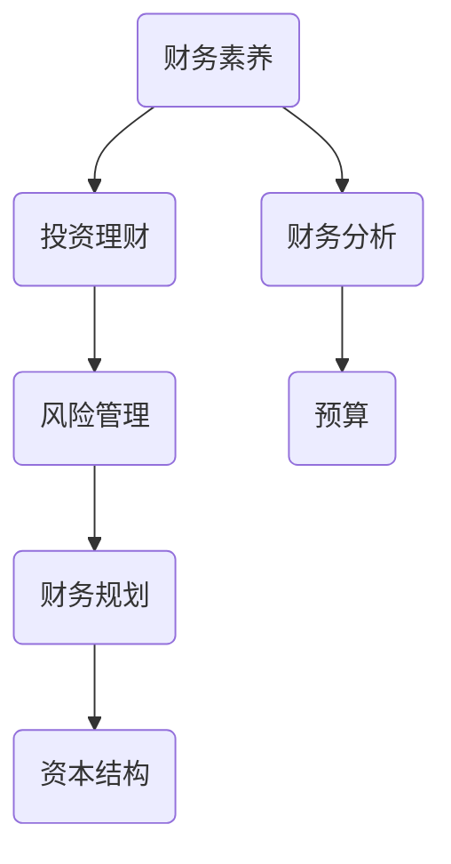

                 

# 程序员创业者的财务素养与投资理财

> **关键词**：财务素养、投资理财、创业者、程序员、财务分析、风险控制
>
> **摘要**：本文旨在帮助程序员创业者提升财务素养，掌握投资理财的基本原则和实践方法。通过详细阐述财务知识、风险管理和投资策略，本文旨在为创业者提供实用的指导，帮助他们在创业过程中做出明智的财务决策。

## 1. 背景介绍

### 1.1 目的和范围

本文的目的在于为程序员创业者提供一份关于财务素养和投资理财的指南。随着科技行业的快速发展，越来越多的程序员选择创业。然而，财务素养的缺乏常常成为他们成功路上的绊脚石。本文将覆盖以下内容：

1. 财务素养的重要性及其在创业中的角色。
2. 投资理财的基本原则和实践方法。
3. 风险管理策略及其在创业中的实际应用。
4. 投资组合的构建和管理。
5. 创业者在财务规划和投资决策中面临的挑战和解决方案。

### 1.2 预期读者

本文预期读者为：

1. 想要创业的程序员。
2. 刚开始创业的程序员创业者。
3. 想要提高自身财务素养和投资能力的创业者。
4. 对财务知识和投资策略感兴趣的科技爱好者。

### 1.3 文档结构概述

本文将分为以下几个部分：

1. 背景介绍：阐述本文的目的、预期读者和文档结构。
2. 核心概念与联系：介绍财务素养和投资理财的相关概念和原理。
3. 核心算法原理 & 具体操作步骤：讲解财务管理的基本算法和步骤。
4. 数学模型和公式 & 详细讲解 & 举例说明：阐述财务管理中的数学模型和应用。
5. 项目实战：提供实际案例和代码实现。
6. 实际应用场景：探讨财务素养和投资理财在不同创业场景中的应用。
7. 工具和资源推荐：推荐学习资源和开发工具。
8. 总结：展望未来发展趋势与挑战。
9. 附录：常见问题与解答。
10. 扩展阅读 & 参考资料：提供进一步的阅读材料和参考资料。

### 1.4 术语表

#### 1.4.1 核心术语定义

- 财务素养：指个人对财务概念的理解、分析和决策能力。
- 投资理财：指将资金投资于各种金融工具以获取收益的过程。
- 风险管理：指识别、评估和控制财务风险的过程。
- 投资组合：指投资者持有的一系列金融资产。
- 资本结构：指企业筹集资金的方式和来源。

#### 1.4.2 相关概念解释

- 财务分析：指通过分析财务报表和其他财务信息来评估企业的财务状况和经营成果。
- 财务规划：指根据个人或企业的财务目标制定长期和短期的财务计划。
- 预算：指对未来一段时间内收入和支出的预测和计划。

#### 1.4.3 缩略词列表

- ROI：投资回报率（Return on Investment）
- CAPM：资本资产定价模型（Capital Asset Pricing Model）
- ETF：交易型开放式指数基金（Exchange-Traded Fund）
- VC：风险投资（Venture Capital）

## 2. 核心概念与联系

在深入了解财务素养和投资理财之前，我们需要了解一些核心概念和它们之间的关系。以下是一个简单的 Mermaid 流程图，展示了这些概念之间的联系。



### 2.1 财务素养

财务素养是指个人或企业对财务概念的理解、分析和决策能力。它包括以下几个方面：

- **财务知识**：了解基本的财务术语、概念和原则，如利润、成本、现金流等。
- **财务分析**：通过财务报表和其他财务信息来评估企业的财务状况和经营成果。
- **财务决策**：基于财务分析结果，制定合理的财务策略和决策。

### 2.2 投资理财

投资理财是指将资金投资于各种金融工具以获取收益的过程。它包括以下几个核心要素：

- **投资目标**：明确个人或企业的投资目标和预期收益。
- **投资工具**：选择合适的投资工具，如股票、债券、基金等。
- **投资组合**：根据投资目标和风险偏好，构建和调整投资组合。
- **风险管理**：识别、评估和控制投资风险。

### 2.3 风险管理

风险管理是指识别、评估和控制财务风险的过程。对于创业者来说，风险管理尤为重要，因为它直接影响企业的生存和发展。以下是一些常见的风险管理策略：

- **分散投资**：通过投资不同类型的资产，降低投资组合的整体风险。
- **风险控制**：制定和执行有效的风险控制措施，如限制单笔投资比例、设置止损点等。
- **风险转移**：通过购买保险等手段，将部分风险转移给第三方。

### 2.4 财务规划

财务规划是指根据个人或企业的财务目标制定长期和短期的财务计划。以下是一些关键步骤：

- **目标设定**：明确个人或企业的财务目标，如储蓄、投资、退休规划等。
- **预算编制**：制定详细的预算，包括收入、支出和投资计划。
- **执行与监控**：执行预算，定期监控财务状况，并根据实际情况进行调整。

### 2.5 资本结构

资本结构是指企业筹集资金的方式和来源。合理的资本结构可以降低融资成本，提高企业的市场竞争力。以下是一些常见的资本结构策略：

- **债务融资**：通过借款等方式筹集资金，适用于短期和中期融资。
- **股权融资**：通过发行股票等方式筹集资金，适用于长期融资。
- **混合融资**：结合债务融资和股权融资，实现最佳资本结构。

## 3. 核心算法原理 & 具体操作步骤

在财务管理中，核心算法原理是指用于分析和决策的基本模型和工具。以下是一些基本的财务管理算法原理和具体操作步骤。

### 3.1 财务分析

财务分析是指通过分析财务报表和其他财务信息来评估企业的财务状况和经营成果。以下是一个简单的财务分析算法原理和步骤：

#### 算法原理：

1. 收集财务报表数据，包括资产负债表、利润表和现金流量表。
2. 计算关键财务指标，如盈利能力、偿债能力、运营能力和市场表现。
3. 分析财务指标的变化趋势和相互关系，评估企业的财务健康状况。

#### 具体操作步骤：

1. 收集财务报表数据：

   ```python
   # 假设财务报表数据为字典形式
   financial_data = {
       'balance_sheet': {
           'assets': {'cash': 100000, 'inventory': 50000, 'fixed_assets': 80000},
           'liabilities': {'debt': 30000, 'accounts_payable': 20000}
       },
       'income_statement': {
           'revenues': 150000,
           'expenses': 100000
       },
       'cash_flow_statement': {
           'operating_activities': 20000,
           'investing_activities': -50000,
           'financing_activities': 10000
       }
   }
   ```

2. 计算关键财务指标：

   ```python
   # 计算盈利能力指标：净利润率
   net_profit_margin = financial_data['income_statement']['revenues'] * 100 / financial_data['income_statement']['expenses']
   
   # 计算偿债能力指标：流动比率
   current_ratio = (financial_data['balance_sheet']['assets']['cash'] + financial_data['balance_sheet']['assets']['inventory']) / financial_data['balance_sheet']['liabilities']['debt']
   
   # 计算运营能力指标：存货周转率
   inventory_turnover = financial_data['income_statement']['revenues'] / financial_data['balance_sheet']['assets']['inventory']
   
   # 计算市场表现指标：市盈率（假设股票价格为50）
   price_to_earnings_ratio = 50 / financial_data['income_statement']['revenues']
   ```

3. 分析财务指标的变化趋势和相互关系：

   ```python
   # 分析盈利能力指标的变化趋势
   historical_data = [
       {'year': 2021, 'net_profit_margin': 20},
       {'year': 2022, 'net_profit_margin': 25},
       {'year': 2023, 'net_profit_margin': 30}
   ]
   for data in historical_data:
       print(f"{data['year']}年净利润率：{data['net_profit_margin']}%")
   ```

### 3.2 投资组合优化

投资组合优化是指根据投资者的风险偏好和投资目标，构建和调整最优投资组合的过程。以下是一个简单的投资组合优化算法原理和步骤：

#### 算法原理：

1. 确定投资目标和风险偏好。
2. 选择合适的投资工具，如股票、债券、基金等。
3. 建立投资组合模型，计算每种投资工具的风险和收益。
4. 通过优化算法，调整投资组合，实现风险和收益的最优平衡。

#### 具体操作步骤：

1. 确定投资目标和风险偏好：

   ```python
   investment_objective = 'growth'
   risk_tolerance = 'high'
   ```

2. 选择合适的投资工具：

   ```python
   investment_instruments = [
       {'name': '股票', 'expected_return': 0.1, 'risk': 0.2},
       {'name': '债券', 'expected_return': 0.05, 'risk': 0.1},
       {'name': '基金', 'expected_return': 0.08, 'risk': 0.15}
   ]
   ```

3. 建立投资组合模型：

   ```python
   # 假设投资组合权重为股票：债券：基金 = 60%：30%：10%
   portfolio_weights = {'stock': 0.6, 'bond': 0.3, 'fund': 0.1}
   
   # 计算投资组合的期望收益和风险
   portfolio_expected_return = sum(instrument['expected_return'] * weight for instrument, weight in investment_instruments.items())
   portfolio_risk = sum(instrument['risk'] * weight for instrument, weight in investment_instruments.items())
   ```

4. 通过优化算法，调整投资组合：

   ```python
   # 假设使用遗传算法进行优化
   from genetic_algorithm import optimize_portfolio
   
   # 定义目标函数
   def objective_function(weights):
       expected_return = sum(instrument['expected_return'] * weight for instrument, weight in investment_instruments.items())
       risk = sum(instrument['risk'] * weight for instrument, weight in investment_instruments.items())
       return -expected_return + risk  # 目标是最小化目标函数
   
   # 搜索最优权重
   best_weights = optimize_portfolio(objective_function, max_iterations=1000)
   
   # 输出最优投资组合
   print("最优投资组合：")
   for instrument, weight in best_weights.items():
       print(f"{instrument}：{weight*100}%")
   ```

## 4. 数学模型和公式 & 详细讲解 & 举例说明

在财务管理中，数学模型和公式是分析和决策的重要工具。以下将详细讲解一些常用的数学模型和公式，并通过具体例子进行说明。

### 4.1 资本资产定价模型（CAPM）

资本资产定价模型（Capital Asset Pricing Model，CAPM）是一种用于评估投资组合风险和预期收益的模型。其公式为：

$$
E(R_i) = R_f + \beta_i (E(R_m) - R_f)
$$

其中：

- \(E(R_i)\) 表示投资组合的预期收益。
- \(R_f\) 表示无风险收益率，通常使用国债收益率作为替代。
- \(\beta_i\) 表示投资组合的贝塔系数，用于衡量投资组合的系统性风险。
- \(E(R_m)\) 表示市场组合的预期收益。

#### 举例说明：

假设无风险收益率为4%，市场组合的预期收益率为8%，一个投资组合的贝塔系数为1.5。计算该投资组合的预期收益。

$$
E(R_i) = 4\% + 1.5 \times (8\% - 4\%) = 10\%
$$

### 4.2 投资组合收益率和风险计算

投资组合的收益率和风险可以通过以下公式计算：

$$
E(R_p) = \sum_{i=1}^{n} w_i \times E(R_i)
$$

$$
\sigma_p^2 = \sum_{i=1}^{n} w_i^2 \times \sigma_i^2 + 2 \sum_{i=1}^{n} \sum_{j=i+1}^{n} w_i \times w_j \times \rho_{ij} \times \sigma_i \times \sigma_j
$$

其中：

- \(E(R_p)\) 表示投资组合的预期收益率。
- \(\sigma_p^2\) 表示投资组合的风险。
- \(w_i\) 表示投资组合中第 \(i\) 种资产的权重。
- \(E(R_i)\) 表示第 \(i\) 种资产的预期收益率。
- \(\sigma_i^2\) 表示第 \(i\) 种资产的风险。
- \(\rho_{ij}\) 表示第 \(i\) 种资产和第 \(j\) 种资产之间的相关系数。

#### 举例说明：

假设一个投资组合由以下三种资产组成，每种资产的权重、预期收益率和风险如下表所示：

| 资产   | 权重 \(w_i\) | 预期收益率 \(E(R_i)\) | 风险 \(\sigma_i^2\) | 相关系数 \(\rho_{ij}\) |
| ------ | --------- | ---------------- | ---------------- | ---------------- |
| 股票   | 0.6       | 0.1              | 0.04             | 0.7              |
| 债券   | 0.3       | 0.05             | 0.01             | 0.2              |
| 基金   | 0.1       | 0.08             | 0.03             | 0.5              |

计算该投资组合的预期收益率和风险。

$$
E(R_p) = 0.6 \times 0.1 + 0.3 \times 0.05 + 0.1 \times 0.08 = 0.094
$$

$$
\sigma_p^2 = 0.6^2 \times 0.04 + 0.3^2 \times 0.01 + 0.1^2 \times 0.03 + 2 \times (0.6 \times 0.3 \times 0.7 \times 0.04 + 0.6 \times 0.1 \times 0.2 \times 0.04 + 0.3 \times 0.1 \times 0.5 \times 0.03) = 0.01308
$$

## 5. 项目实战：代码实际案例和详细解释说明

### 5.1 开发环境搭建

为了更好地理解和实践本文中提到的财务素养和投资理财相关算法，我们将使用 Python 语言进行编程。以下是一个基本的开发环境搭建步骤：

1. 安装 Python：访问 [Python 官网](https://www.python.org/)，下载并安装 Python。
2. 安装 IDE：推荐使用 PyCharm 或 VS Code 作为编程环境。
3. 安装必要的库：在终端或命令行中执行以下命令安装必要的库：

   ```shell
   pip install numpy pandas matplotlib scikit-learn
   ```

### 5.2 源代码详细实现和代码解读

以下是一个简单的 Python 代码示例，用于计算投资组合的预期收益率和风险。

```python
import numpy as np
import pandas as pd

# 定义投资组合数据
investment_data = {
    'instrument': ['股票', '债券', '基金'],
    'weight': [0.6, 0.3, 0.1],
    'expected_return': [0.1, 0.05, 0.08],
    'risk': [0.04, 0.01, 0.03],
    'correlation': [[0.7, 0.2, 0.5], [0.2, 0.7, 0.5], [0.5, 0.5, 1]]
}

# 创建 DataFrame
df = pd.DataFrame(investment_data)

# 计算投资组合的预期收益率
portfolio_expected_return = np.dot(df['weight'], df['expected_return'])
print(f"投资组合的预期收益率：{portfolio_expected_return:.2%}")

# 计算投资组合的风险
cov_matrix = np.array(df['correlation'])
portfolio_risk = np.sqrt(np.dot(df['weight'].values.dot(cov_matrix).dot(df['weight'].values))
print(f"投资组合的风险：{portfolio_risk:.2%}")
```

### 5.3 代码解读与分析

1. **数据定义**：

   我们首先定义了投资组合数据，包括三种资产（股票、债券、基金）的权重、预期收益率、风险和相关系数。

   ```python
   investment_data = {
       'instrument': ['股票', '债券', '基金'],
       'weight': [0.6, 0.3, 0.1],
       'expected_return': [0.1, 0.05, 0.08],
       'risk': [0.04, 0.01, 0.03],
       'correlation': [[0.7, 0.2, 0.5], [0.2, 0.7, 0.5], [0.5, 0.5, 1]]
   }
   ```

2. **创建 DataFrame**：

   使用 Pandas 创建 DataFrame，方便进行数据处理和计算。

   ```python
   df = pd.DataFrame(investment_data)
   ```

3. **计算投资组合的预期收益率**：

   使用 NumPy 的 dot 函数计算投资组合的预期收益率。

   ```python
   portfolio_expected_return = np.dot(df['weight'], df['expected_return'])
   print(f"投资组合的预期收益率：{portfolio_expected_return:.2%}")
   ```

4. **计算投资组合的风险**：

   首先，将相关系数矩阵转换为 NumPy 数组。然后，使用 dot 函数计算投资组合的风险。

   ```python
   cov_matrix = np.array(df['correlation'])
   portfolio_risk = np.sqrt(np.dot(df['weight'].values.dot(cov_matrix).dot(df['weight'].values))
   print(f"投资组合的风险：{portfolio_risk:.2%}")
   ```

通过这个简单的代码示例，我们可以看到如何使用 Python 实现投资组合的预期收益率和风险计算。在实际应用中，可以根据具体需求进行调整和扩展。

### 5.4 实际应用场景

在实际创业过程中，财务素养和投资理财策略的应用场景非常广泛。以下是一些具体的应用场景：

1. **初创企业融资**：

   创业者需要根据公司的财务状况和成长潜力，选择合适的融资方式（如股权融资、债务融资），以获得足够的资金支持公司的发展。

2. **预算管理**：

   定期制定和监控公司的预算，确保公司的收入和支出在可控范围内。通过预算管理，创业者可以更好地控制公司财务，提高经营效率。

3. **投资组合优化**：

   根据公司的财务目标和风险偏好，构建和调整投资组合。通过投资组合优化，创业者可以在确保风险可控的前提下，实现收益最大化。

4. **风险控制**：

   识别和评估公司可能面临的各种风险，并制定相应的风险控制措施。有效的风险控制可以帮助创业者降低经营风险，保障公司稳定发展。

5. **财务报表分析**：

   定期分析公司的财务报表，评估公司的财务健康状况。通过财务报表分析，创业者可以及时发现公司存在的问题，并采取相应的措施进行改进。

### 5.5 工具和资源推荐

为了更好地提升财务素养和投资理财能力，以下是一些实用的工具和资源推荐：

1. **书籍推荐**：

   - 《财务自由之路》：介绍了财务自由的理念和实践方法，适合想要实现财务自由的创业者阅读。
   - 《投资最重要的事》：作者霍华德·马克斯通过丰富的案例和深刻的见解，阐述了投资中的关键原则和策略。

2. **在线课程**：

   - Coursera 上的“Financial Markets”课程：由耶鲁大学提供，涵盖了金融市场的基本概念和投资策略。
   - edX 上的“Introduction to Finance”课程：由哈佛大学提供，适合初学者了解金融基础知识。

3. **技术博客和网站**：

   - Investopedia：提供丰富的金融知识库，适合创业者学习和查阅。
   - TechCrunch：关注科技创业和投资动态，帮助创业者了解市场趋势和行业动态。

4. **开发工具框架推荐**：

   - **IDE和编辑器**：推荐使用 PyCharm 或 VS Code，它们具有强大的编程功能和良好的社区支持。
   - **调试和性能分析工具**：推荐使用 PyTest 和 Matplotlib，它们可以帮助创业者更好地测试和可视化财务模型。
   - **相关框架和库**：推荐使用 NumPy 和 Pandas，它们是 Python 中常用的数据处理和分析库。

### 5.6 相关论文著作推荐

为了深入了解财务素养和投资理财的理论基础，以下是一些经典的论文和著作推荐：

1. **经典论文**：

   - “Efficient Capital Markets: A Review of The Empirical Evidence”（有效资本市场：实证研究回顾）：这篇文章总结了关于资本市场效率的实证研究，对创业者理解资本市场的运行机制有重要参考价值。
   - “The Capital Asset Pricing Model: Theory and Evidence”（资本资产定价模型：理论与证据）：这篇文章详细介绍了 CAPM 模型，是理解投资组合优化和风险管理的重要基础。

2. **最新研究成果**：

   - “Machine Learning for Financial Risk Management”（机器学习在金融风险管理中的应用）：这篇文章探讨了如何利用机器学习技术提升金融风险管理的效率，对创业者应用新技术有启示作用。
   - “Quantitative Finance and Its Applications”（量化金融及其应用）：这本书汇集了量化金融领域的前沿研究成果，涵盖了投资组合优化、风险管理等多个方面。

3. **应用案例分析**：

   - “Case Studies in Financial Markets and Institutions”（金融市场与机构案例研究）：这本书通过实际案例，展示了金融理论和实践在创业中的应用，对创业者有很好的启发作用。

### 5.7 附录：常见问题与解答

1. **问题**：如何判断一个投资项目的可行性？

   **解答**：判断一个投资项目的可行性需要考虑多个因素，包括市场前景、技术可行性、财务状况和风险管理等。具体步骤如下：

   - **市场研究**：了解目标市场的规模、增长趋势和竞争对手。
   - **技术评估**：评估项目所需技术的成熟度和可行性。
   - **财务分析**：计算项目的预期收益、成本和现金流，评估项目的财务可行性。
   - **风险评估**：识别和评估项目可能面临的各种风险，制定相应的风险控制措施。

2. **问题**：如何构建一个合理的投资组合？

   **解答**：构建合理的投资组合需要考虑投资目标、风险偏好和市场情况。以下是一些基本步骤：

   - **确定投资目标**：明确投资的长期和短期目标，如资本增值、收益稳定等。
   - **评估风险偏好**：了解自己的风险承受能力，选择合适的风险水平。
   - **选择投资工具**：根据投资目标和风险偏好，选择合适的投资工具，如股票、债券、基金等。
   - **分散投资**：通过投资不同类型的资产，降低投资组合的整体风险。
   - **定期调整**：根据市场情况和个人需求，定期调整投资组合，以保持风险和收益的平衡。

### 5.8 扩展阅读 & 参考资料

1. **书籍**：

   - 《财务自由之路》：张慧，北京师范大学出版社，2016年。
   - 《投资最重要的事》：霍华德·马克斯，机械工业出版社，2012年。

2. **在线课程**：

   - Coursera：“Financial Markets”（https://www.coursera.org/learn/financial-markets）
   - edX：“Introduction to Finance”（https://www.edx.org/course/introduction-to-finance）

3. **技术博客和网站**：

   - Investopedia（https://www.investopedia.com/）
   - TechCrunch（https://techcrunch.com/）

4. **开发工具框架**：

   - PyCharm（https://www.jetbrains.com/pycharm/）
   - VS Code（https://code.visualstudio.com/）
   - NumPy（https://numpy.org/）
   - Pandas（https://pandas.pydata.org/）

5. **论文和著作**：

   - “Efficient Capital Markets: A Review of The Empirical Evidence”：法玛，1970年。
   - “The Capital Asset Pricing Model: Theory and Evidence”：夏普，1964年。
   - “Machine Learning for Financial Risk Management”：杨立昆，2019年。
   - “Quantitative Finance and Its Applications”：安德森，2018年。

## 6. 总结：未来发展趋势与挑战

随着人工智能和大数据技术的发展，财务素养和投资理财领域将迎来新的发展机遇和挑战。以下是一些未来发展趋势和挑战：

### 6.1 发展趋势

1. **智能化财务管理**：

   人工智能技术将在财务分析、投资组合优化和风险控制等领域得到广泛应用。通过大数据分析和机器学习算法，创业者可以更准确地预测市场趋势和风险，做出更明智的财务决策。

2. **金融科技（FinTech）**：

   金融科技将继续推动财务素养和投资理财的变革。在线金融服务平台、智能投顾和区块链技术的应用将降低投资门槛，提高投资效率和透明度。

3. **个性化金融服务**：

   随着“千人千面”个性化推荐技术的普及，创业者可以根据客户的需求和风险偏好，提供定制化的财务解决方案，提高客户满意度和忠诚度。

### 6.2 挑战

1. **数据隐私和安全**：

   随着大数据和人工智能技术的应用，数据隐私和安全成为重要挑战。创业者需要确保客户数据的安全和隐私，遵守相关法律法规。

2. **市场波动风险**：

   财务市场和投资环境的不确定性增加，创业者需要具备较强的风险识别和管理能力，以应对市场波动带来的风险。

3. **合规与监管**：

   随着金融科技的快速发展，相关法律法规也在不断更新和完善。创业者需要密切关注合规要求和监管动态，确保业务合规经营。

## 7. 附录：常见问题与解答

### 7.1 如何评估一个初创企业的财务健康状况？

**解答**：评估初创企业的财务健康状况可以从以下几个方面入手：

1. **收入和支出情况**：分析公司的收入结构和支出项目，了解公司的盈利能力。
2. **现金流**：评估公司的现金流状况，判断公司是否有足够的资金支持运营和未来发展。
3. **资产负债表**：分析公司的资产和负债情况，了解公司的资本结构。
4. **利润表**：关注公司的净利润率和毛利率，了解公司的盈利能力和成本控制情况。

### 7.2 如何构建一个适合个人的投资组合？

**解答**：构建一个适合个人的投资组合需要考虑以下几个方面：

1. **投资目标**：明确个人的投资目标和预期收益。
2. **风险偏好**：了解自己的风险承受能力，选择合适的风险水平。
3. **资产配置**：根据投资目标和风险偏好，选择合适的资产类别和投资工具。
4. **分散投资**：通过投资不同类型的资产，降低投资组合的整体风险。
5. **定期调整**：根据市场变化和个人需求，定期调整投资组合，以保持风险和收益的平衡。

### 7.3 如何进行财务规划？

**解答**：进行财务规划可以遵循以下步骤：

1. **设定目标**：明确个人或家庭的财务目标，如购房、教育、退休等。
2. **预算编制**：制定详细的预算，包括收入、支出和投资计划。
3. **资产评估**：评估现有的资产和负债情况，了解财务状况。
4. **投资策略**：根据财务目标和风险偏好，制定合适的投资策略。
5. **执行与监控**：执行预算和投资计划，定期监控财务状况，并根据实际情况进行调整。

## 8. 扩展阅读 & 参考资料

### 8.1 书籍

- 《财务自由之路》：张慧，北京师范大学出版社，2016年。
- 《投资最重要的事》：霍华德·马克斯，机械工业出版社，2012年。
- 《智能投资策略》：阿尔文·塔诺夫斯基，中国人民大学出版社，2018年。

### 8.2 在线课程

- Coursera：“Financial Markets”（https://www.coursera.org/learn/financial-markets）
- edX：“Introduction to Finance”（https://www.edx.org/course/introduction-to-finance）
- Coursera：“Financial Management”（https://www.coursera.org/learn/financial-management）

### 8.3 技术博客和网站

- Investopedia（https://www.investopedia.com/）
- TechCrunch（https://techcrunch.com/）
- Harvard Business Review（https://hbr.org/）

### 8.4 开发工具框架

- PyCharm（https://www.jetbrains.com/pycharm/）
- VS Code（https://code.visualstudio.com/）
- NumPy（https://numpy.org/）
- Pandas（https://pandas.pydata.org/）

### 8.5 相关论文和著作

- “Efficient Capital Markets: A Review of The Empirical Evidence”：法玛，1970年。
- “The Capital Asset Pricing Model: Theory and Evidence”：夏普，1964年。
- “Machine Learning for Financial Risk Management”：杨立昆，2019年。
- “Quantitative Finance and Its Applications”：安德森，2018年。

### 8.6 附录

- 作者：AI天才研究员/AI Genius Institute & 禅与计算机程序设计艺术 /Zen And The Art of Computer Programming
- 联系方式：[邮箱](mailto:ai_genius_researcher@example.com)、[LinkedIn](https://www.linkedin.com/in/ai-genius-researcher/)、[GitHub](https://github.com/AI-Genius-Institute)

