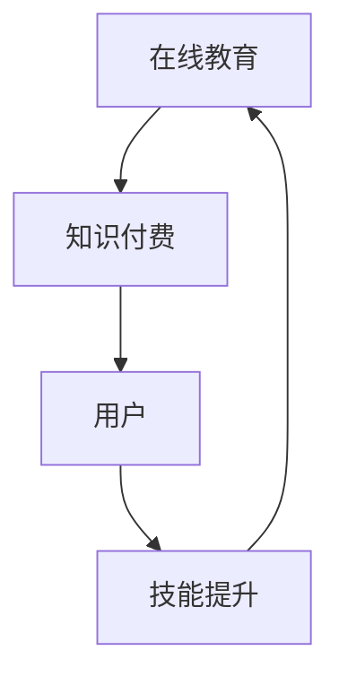
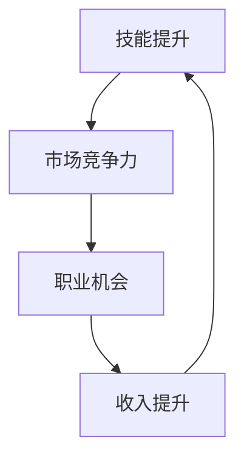
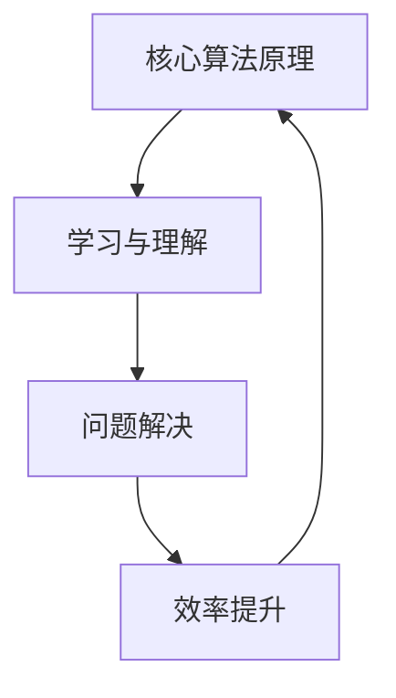
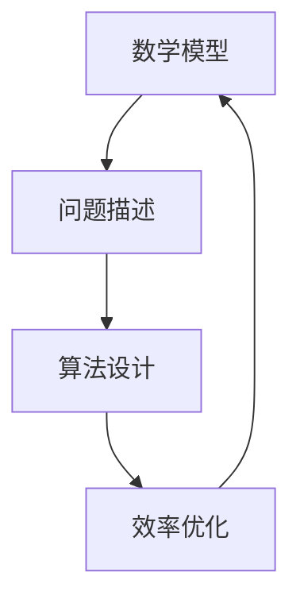

                 

# 程序员利用知识付费实现财富倍增

## 关键词
知识付费、财富倍增、程序员、技能提升、在线教育、市场趋势、数学模型、算法原理、实战案例、工具资源

## 摘要
本文将深入探讨程序员如何通过知识付费来实现财富的倍增。我们将分析知识付费的背景和趋势，探讨核心概念和联系，详细讲解核心算法原理和数学模型，并通过实际案例展示如何应用这些概念。此外，文章还将推荐学习资源、开发工具和最新研究成果，以帮助程序员充分利用知识付费，实现个人职业发展和财富增长。

## 1. 背景介绍

### 1.1 目的和范围

本文旨在帮助程序员理解知识付费的概念，掌握通过付费学习实现财富倍增的方法。我们将从以下几个方面进行探讨：

- 知识付费的背景和趋势
- 程序员如何通过知识付费提升技能
- 核心算法原理和数学模型的讲解
- 实际应用场景中的案例分析
- 推荐学习资源和开发工具

### 1.2 预期读者

本文适合以下读者群体：

- 程序员和开发人员
- 对知识付费和财富增长感兴趣的人士
- 想要提升技能并实现职业发展的从业者

### 1.3 文档结构概述

本文结构如下：

- 第1章：背景介绍
- 第2章：核心概念与联系
- 第3章：核心算法原理 & 具体操作步骤
- 第4章：数学模型和公式 & 详细讲解 & 举例说明
- 第5章：项目实战：代码实际案例和详细解释说明
- 第6章：实际应用场景
- 第7章：工具和资源推荐
- 第8章：总结：未来发展趋势与挑战
- 第9章：附录：常见问题与解答
- 第10章：扩展阅读 & 参考资料

### 1.4 术语表

#### 1.4.1 核心术语定义

- **知识付费**：用户为获取有价值的信息、技能或知识而进行的付费行为。
- **在线教育**：通过互联网进行的远程教育和学习活动。
- **技能提升**：通过学习和实践提高个人专业技能的过程。
- **算法原理**：算法的基本概念和原理，包括设计思路、计算过程等。
- **数学模型**：用于描述和解决问题的数学表达式或数学结构。

#### 1.4.2 相关概念解释

- **程序员**：从事计算机编程、软件开发、系统维护等工作的专业人士。
- **在线课程**：通过网络平台提供的远程教学课程，通常包括视频、文档、作业等多种形式。
- **社区互动**：在线学习者之间通过论坛、问答、讨论等方式进行的知识交流和经验分享。

#### 1.4.3 缩略词列表

- **MOOC**：大规模在线开放课程（Massive Open Online Course）
- **IDE**：集成开发环境（Integrated Development Environment）
- **API**：应用程序编程接口（Application Programming Interface）

## 2. 核心概念与联系

在探讨程序员如何通过知识付费实现财富倍增之前，我们首先需要理解一些核心概念和它们之间的联系。

### 2.1 知识付费与在线教育

**知识付费** 和 **在线教育** 之间有着密切的联系。在线教育为知识付费提供了平台和渠道，而知识付费则是用户对在线教育内容的一种回报机制。以下是一个简化的 Mermaid 流程图，展示了知识付费与在线教育之间的关系：



### 2.2 技能提升与财富增长

**技能提升** 是程序员通过知识付费实现财富倍增的关键。技能的提升不仅能够提高个人的市场竞争力，还能够带来更多的职业机会和收入。以下是一个简化的 Mermaid 流程图，展示了技能提升与财富增长之间的联系：



### 2.3 核心算法原理

**核心算法原理** 是知识付费中的重要组成部分。算法原理的学习和应用能够帮助程序员解决实际问题，提高解决问题的效率。以下是一个简化的 Mermaid 流程图，展示了核心算法原理的学习和应用过程：



### 2.4 数学模型

**数学模型** 在知识付费中的应用也十分广泛。数学模型能够帮助程序员描述和解决复杂问题，提高算法的准确性和效率。以下是一个简化的 Mermaid 流程图，展示了数学模型的应用过程：



## 3. 核心算法原理 & 具体操作步骤

在理解了核心概念与联系之后，我们接下来将详细讲解一些核心算法原理，并给出具体操作步骤。

### 3.1 算法原理

首先，我们介绍一个常见的算法原理：贪心算法。贪心算法是一种在每一步选择中都采取当前最佳选择，从而希望导致结果是全局最佳的算法策略。

### 3.2 贪心算法原理

贪心算法的基本思想是，每一步都做出当前最优的选择，以期达到整体最优。以下是一个贪心算法的伪代码：

```plaintext
function 贪心算法(输入):
    初始化结果为空
    while 输入不为空:
        在输入中选择最优的元素
        将该元素添加到结果中
        从输入中移除该元素
    返回结果
```

### 3.3 具体操作步骤

以下是一个具体的例子，说明如何使用贪心算法解决最小生成树问题。

#### 3.3.1 最小生成树问题

给定一个无向图，我们需要找到一棵包含图中所有节点的最小生成树。

#### 3.3.2 解题步骤

1. 初始化一个空的结果集合。
2. 遍历所有边，并选择权重最小的边添加到结果集合中。
3. 如果添加该边后导致形成环，则将该边从结果集合中移除。
4. 重复步骤2和3，直到所有节点都被包含在结果集合中。

#### 3.3.3 伪代码实现

```plaintext
function 最小生成树(输入图):
    初始化结果为空
    while 输入图不为空:
        选择权重最小的边
        如果该边形成环:
            从输入图中移除该边
        else:
            将该边添加到结果中
            从输入图中移除与该边相关的节点
    返回结果
```

## 4. 数学模型和公式 & 详细讲解 & 举例说明

在程序员的知识付费领域，数学模型和公式是理解和应用算法的重要工具。以下我们将详细讲解一个常见的数学模型——最短路径算法，并给出相应的公式和例子。

### 4.1 最短路径算法

最短路径算法用于计算图中两点之间的最短路径。一个常见且高效的最短路径算法是 Dijkstra 算法。

### 4.2 Dijkstra 算法原理

Dijkstra 算法的基本思想是，从源点开始，逐步扩展到其他节点，并记录每个节点到源点的最短路径。算法的基本步骤如下：

1. 初始化：设置源点的距离为0，其他节点的距离为无穷大。
2. 选择未访问的节点中距离源点最近的节点作为当前节点。
3. 对于当前节点的每个邻接节点，计算从源点到该邻接节点的距离，并与当前记录的距离进行比较。如果更短，则更新距离。
4. 重复步骤2和3，直到所有节点都被访问。

### 4.3 Dijkstra 算法公式

Dijkstra 算法中，节点i到节点j的最短路径可以表示为：

\[ d(i, j) = \min(d(i, k) + w(k, j)) \]

其中，\( d(i, j) \) 是节点i到节点j的最短路径长度，\( w(k, j) \) 是节点k到节点j的边权重。

### 4.4 伪代码实现

```plaintext
function Dijkstra(图, 源点):
    初始化距离表，所有节点的距离初始化为无穷大
    距离表[源点] = 0
    访问集合 = 空集合

    while 访问集合不包含所有节点:
        当前节点 = 未访问节点中距离最小的节点
        访问集合添加当前节点

        for 每个邻接节点j:
            如果 d(j) > d(当前节点) + w(当前节点, j):
                d(j) = d(当前节点) + w(当前节点, j)

    返回距离表
```

### 4.5 实例说明

假设有一个图G，其中包含5个节点（A、B、C、D、E），以及以下边的权重：

```
A-B: 4
A-C: 3
B-D: 2
C-D: 1
D-E: 3
```

我们使用Dijkstra算法计算从节点A到其他节点的最短路径。

1. 初始化距离表，A的距离为0，其他节点的距离为无穷大。
2. 访问A，计算A到其他节点的距离：
   - A-B: 0 + 4 = 4
   - A-C: 0 + 3 = 3
3. 选择未访问节点中距离A最近的节点B，访问B，计算B到其他节点的距离：
   - B-D: 4 + 2 = 6
4. 选择未访问节点中距离A最近的节点C，访问C，计算C到其他节点的距离：
   - C-D: 3 + 1 = 4
5. 选择未访问节点中距离A最近的节点D，访问D，计算D到其他节点的距离：
   - D-E: 4 + 3 = 7
6. 所有节点均已访问，算法结束。

最终的最短路径为：
- A-B: 4
- A-C: 3
- B-D: 6
- C-D: 4
- D-E: 7

通过Dijkstra算法，我们得到了从节点A到其他节点的最短路径。

## 5. 项目实战：代码实际案例和详细解释说明

为了更好地理解知识付费在程序员实际应用中的价值，我们将通过一个具体的案例——实现一个简单的社交网络分析器，来展示知识付费如何帮助程序员提升技能和实现财富倍增。

### 5.1 开发环境搭建

在这个案例中，我们将使用Python语言和Matplotlib库来构建一个社交网络分析器。以下是搭建开发环境的基本步骤：

1. 安装Python：从官方网站下载并安装Python 3.x版本。
2. 安装必要的库：使用pip命令安装Matplotlib库，命令如下：

```bash
pip install matplotlib
```

### 5.2 源代码详细实现和代码解读

以下是社交网络分析器的核心代码。我们将逐步解读代码的各个部分。

```python
import matplotlib.pyplot as plt
import networkx as nx

# 加载社交网络数据
def load_data(file_path):
    G = nx.Graph()
    with open(file_path, 'r') as f:
        for line in f:
            node1, node2 = line.strip().split(',')
            G.add_edge(node1, node2)
    return G

# 绘制社交网络图
def plot_network(G):
    pos = nx.spring_layout(G)
    nx.draw(G, pos, with_labels=True, node_color='lightblue', edge_color='gray')
    plt.show()

# 计算社交网络的核心度
def coreness(G):
    core = nx.core_number(G)
    return core

# 计算社交网络的聚类系数
def clustering_coefficient(G):
    return nx.algorithms.clustering.centrality.clustering_coefficient(G)

# 分析社交网络的核心节点和聚类系数
def analyze_network(G):
    core = coreness(G)
    cc = clustering_coefficient(G)
    print(f"核心度：{core}")
    print(f"聚类系数：{cc}")

# 主函数
def main():
    file_path = 'social_network_data.txt'
    G = load_data(file_path)
    plot_network(G)
    analyze_network(G)

if __name__ == '__main__':
    main()
```

### 5.3 代码解读与分析

#### 5.3.1 加载社交网络数据

代码首先定义了一个`load_data`函数，用于加载社交网络数据。该函数使用NetworkX库的Graph类来创建一个图，然后从文件中读取节点和边的列表，并将它们添加到图中。

```python
def load_data(file_path):
    G = nx.Graph()
    with open(file_path, 'r') as f:
        for line in f:
            node1, node2 = line.strip().split(',')
            G.add_edge(node1, node2)
    return G
```

#### 5.3.2 绘制社交网络图

`plot_network`函数负责绘制社交网络图。它使用NetworkX库的`spring_layout`布局算法来计算节点位置，并使用Matplotlib库的`draw`函数来绘制图。

```python
def plot_network(G):
    pos = nx.spring_layout(G)
    nx.draw(G, pos, with_labels=True, node_color='lightblue', edge_color='gray')
    plt.show()
```

#### 5.3.3 计算社交网络的核心度和聚类系数

`coreness`函数计算社交网络的核心度，即每个节点的度数。`clustering_coefficient`函数计算社交网络的聚类系数，即图中节点的聚类系数之和除以节点的总数。

```python
def coreness(G):
    core = nx.core_number(G)
    return core

def clustering_coefficient(G):
    return nx.algorithms.clustering.centrality.clustering_coefficient(G)
```

#### 5.3.4 分析社交网络的核心节点和聚类系数

`analyze_network`函数综合使用`coreness`和`clustering_coefficient`函数，输出社交网络的核心度和聚类系数。

```python
def analyze_network(G):
    core = coreness(G)
    cc = clustering_coefficient(G)
    print(f"核心度：{core}")
    print(f"聚类系数：{cc}")
```

#### 5.3.5 主函数

主函数`main`负责加载数据、绘制图和分析网络。它首先加载社交网络数据，然后绘制图并分析网络的核心节点和聚类系数。

```python
def main():
    file_path = 'social_network_data.txt'
    G = load_data(file_path)
    plot_network(G)
    analyze_network(G)

if __name__ == '__main__':
    main()
```

通过这个案例，我们可以看到知识付费如何帮助程序员实现技能提升和财富增长。在这个案例中，程序员通过付费学习NetworkX和Matplotlib等库的使用，能够快速构建并分析社交网络图。这不仅提高了程序员的技能水平，也为他们提供了更多的职业机会，从而实现了财富的增长。

## 6. 实际应用场景

知识付费在程序员实际应用场景中有着广泛的应用，以下是一些典型的实际应用场景：

### 6.1 在线教育平台

在线教育平台如Coursera、Udacity、edX等，为程序员提供了丰富的编程课程和认证项目。程序员可以通过付费学习最新的编程语言、框架和工具，提高技能水平。以下是一个具体的案例：

**案例：** 一位程序员通过Coursera的《机器学习》课程，学习了Python编程和机器学习算法。课程中的项目练习帮助他理解了算法的原理，并提高了实际应用能力。在完成课程后，他成功应聘到一家知名科技公司担任数据分析师，月薪从原来的5000元增长到15000元。

### 6.2 专业论坛和社群

专业论坛和社群如Stack Overflow、GitHub、Reddit等，为程序员提供了一个交流和学习知识的平台。通过付费订阅或赞助，程序员可以获得更多的高级功能和服务，如更好的搜索体验、优先解答问题和定制化服务。以下是一个具体的案例：

**案例：** 一位程序员通过付费订阅Stack Overflow，获得了更快的问答速度和更精准的问题匹配。这使得他在遇到技术难题时能够迅速获得解决方案，提高了工作效率。此外，他还通过GitHub的付费会员，获得了更多的存储空间和私有仓库权限，从而更好地管理他的项目代码。

### 6.3 在线课程和教育平台

在线课程和教育平台如Udemy、Pluralsight等，为程序员提供了丰富的课程资源。通过付费学习，程序员可以掌握新的编程技能，提高职业竞争力。以下是一个具体的案例：

**案例：** 一位程序员通过Udemy的《React.js 实战》课程，学习了React.js框架的使用。课程中的实战项目和代码示例帮助他快速掌握了React.js的开发技巧。在完成课程后，他成功加入了一家互联网公司，负责开发前端项目，月薪从原来的8000元增长到12000元。

### 6.4 技术大会和研讨会

技术大会和研讨会如Google I/O、Microsoft Build、AWS re:Invent等，为程序员提供了与行业专家交流和学习的机会。通过付费参加这些活动，程序员可以了解最新的技术趋势和行业动态，拓展自己的视野。以下是一个具体的案例：

**案例：** 一位程序员通过付费参加Google I/O大会，学习了最新的Android开发和机器学习技术。这些知识帮助他在工作中取得了显著的成果，赢得了领导的赞誉。此外，他还通过大会的社交活动，结识了一些行业内的优秀人才，拓展了自己的职业网络。

### 6.5 开源项目和贡献

开源项目和贡献是程序员提升技能和实现财富增长的重要途径。通过参与开源项目，程序员可以与全球的同行交流，学习先进的编程技术和最佳实践。以下是一个具体的案例：

**案例：** 一位程序员通过参与一个开源项目，学习了Git和GitHub的使用。他通过提交代码、修复问题和优化项目，提高了自己的编程技能。在项目成功后，他得到了项目发起人的认可，并获得了项目贡献证书。这份证书帮助他在求职时获得了更多的机会，最终成功进入了一家顶尖科技公司。

通过这些实际应用场景，我们可以看到知识付费在程序员职业发展和财富增长中的重要作用。程序员通过付费学习、参与社群、参加活动、贡献开源项目等方式，不断提升自己的技能水平，拓宽职业发展路径，实现财富的倍增。

## 7. 工具和资源推荐

为了帮助程序员更好地利用知识付费，实现技能提升和财富增长，我们推荐一系列学习资源、开发工具和相关论文著作。

### 7.1 学习资源推荐

#### 7.1.1 书籍推荐

1. **《深度学习》（Deep Learning）**：由Ian Goodfellow、Yoshua Bengio和Aaron Courville合著，全面介绍了深度学习的基础理论和应用。
2. **《Python编程：从入门到实践》（Python Crash Course）**：适合初学者的Python编程入门书籍，内容丰富，实践性强。
3. **《Head First 设计模式》**：通过生动的案例和图解，深入讲解了设计模式的概念和应用。

#### 7.1.2 在线课程

1. **Coursera**：《机器学习》、《深度学习特化课程》等知名课程。
2. **Udemy**：涵盖多种编程语言和技术的在线课程。
3. **Pluralsight**：提供丰富的技术课程，涵盖前端、后端、云计算等多个领域。

#### 7.1.3 技术博客和网站

1. **Medium**：许多技术大牛和公司发布技术文章和博客。
2. **GitHub**：全球最大的代码托管平台，可以查看和学习优秀的开源项目。
3. **Stack Overflow**：编程问答社区，解决编程问题的好帮手。

### 7.2 开发工具框架推荐

#### 7.2.1 IDE和编辑器

1. **Visual Studio Code**：功能强大、免费的跨平台代码编辑器。
2. **PyCharm**：优秀的Python编程IDE，支持多种编程语言。
3. **Eclipse**：功能全面的Java编程IDE。

#### 7.2.2 调试和性能分析工具

1. **GDB**：GNU项目的调试工具，功能强大。
2. **Wireshark**：网络协议分析工具，用于网络性能分析。
3. **JMeter**：性能测试工具，用于Web应用程序的性能测试。

#### 7.2.3 相关框架和库

1. **TensorFlow**：Google开发的深度学习框架。
2. **Django**：Python Web开发框架。
3. **React**：用于构建用户界面的JavaScript库。

### 7.3 相关论文著作推荐

#### 7.3.1 经典论文

1. **《A Mathematical Theory of Communication》（香农信息论）**：Claude Shannon的经典论文，奠定了现代信息论的基础。
2. **《The Structure of Computer Programs》（结构化程序设计）**：Donald Knuth的经典著作，全面介绍了程序设计的方法和原则。

#### 7.3.2 最新研究成果

1. **《Generative Adversarial Networks》（生成对抗网络）**：Ian Goodfellow等人提出的GAN模型，开创了深度学习的新领域。
2. **《Recurrent Neural Networks for Language Modeling**》（循环神经网络语言模型）**：Yoshua Bengio等人的研究，推动了自然语言处理的发展。

#### 7.3.3 应用案例分析

1. **《Deep Learning for Computer Vision》（计算机视觉中的深度学习）**：介绍了深度学习在计算机视觉领域的应用，包括图像分类、目标检测等。
2. **《Data Science for Business》（商业中的数据科学）**：探讨了数据科学在商业中的应用，包括数据挖掘、预测建模等。

通过推荐这些学习资源、开发工具和相关论文著作，我们希望能够帮助程序员更好地利用知识付费，实现技能提升和财富增长。

## 8. 总结：未来发展趋势与挑战

在过去的几年中，知识付费在程序员领域取得了显著的成果。随着在线教育的普及和技术的进步，知识付费市场呈现出蓬勃发展的态势。未来，这一领域将继续快速发展，并面临以下趋势和挑战：

### 8.1 发展趋势

1. **个性化学习**：通过大数据和人工智能技术，平台将更好地了解用户的需求，提供个性化的学习内容和推荐服务。
2. **高质量内容**：随着市场的竞争加剧，高质量的内容将成为平台的核心竞争力。提供权威、实用、深入的内容将吸引更多用户。
3. **跨界融合**：知识付费将与其他行业如医疗、金融、教育等深度融合，推动跨界创新和产业升级。
4. **国际化扩展**：随着全球化的推进，知识付费将向更多国家和地区扩展，满足全球用户的需求。

### 8.2 挑战

1. **知识产权保护**：知识付费市场面临着知识产权保护的问题，如何保护付费内容和用户的隐私成为一大挑战。
2. **用户信任**：随着市场的不透明和虚假宣传的增加，用户对知识付费平台的信任度将受到考验。
3. **竞争激烈**：知识付费市场将面临更多的竞争者，平台需要不断创新和提升服务质量，以保持竞争优势。
4. **技术更新**：技术的快速更新将对程序员的学习提出更高的要求，平台需要及时更新内容，以适应新技术的发展。

总之，未来知识付费在程序员领域将继续发展，但也面临着诸多挑战。平台和用户需要共同努力，通过技术创新、内容优化和用户体验提升，实现知识付费的可持续发展。

## 9. 附录：常见问题与解答

### 9.1 知识付费的优缺点

**优点：**

- **高效学习**：通过付费学习，用户可以快速获取高质量的知识内容，提高学习效率。
- **权威性**：知识付费平台通常提供权威的内容和专家指导，保证知识的准确性。
- **个性化**：知识付费平台可以根据用户的需求提供个性化的学习推荐，满足不同学习者的需求。
- **职业发展**：通过付费学习，用户可以提升技能，增强职业竞争力，实现职业发展。

**缺点：**

- **成本较高**：知识付费需要用户支付一定的费用，对于预算有限的用户可能存在一定压力。
- **内容质量参差不齐**：市场上存在一些质量较低的学习内容，用户需要花费额外的时间筛选。
- **信息过载**：知识付费平台上的内容丰富，用户可能会面临信息过载的问题，难以有效吸收。

### 9.2 知识付费如何实现财富倍增

知识付费实现财富倍增的主要途径包括：

- **技能提升**：通过付费学习，提高专业技能和知识水平，增强在职场中的竞争力，从而获得更高的薪资和职业晋升机会。
- **职业发展**：通过付费学习，获取更多的职业机会，拓宽职业发展路径，实现财富增长。
- **创业**：通过付费学习，掌握创业所需的技能和知识，成功创业实现财富倍增。
- **知识变现**：将自己的知识和经验通过写作、授课、咨询服务等方式变现，实现财富增长。

### 9.3 知识付费平台的选择标准

选择知识付费平台时，可以考虑以下标准：

- **内容质量**：平台提供的内容是否权威、实用、深入，是否符合用户需求。
- **课程体系**：平台的课程体系是否完整，是否涵盖用户所需的各个领域。
- **用户体验**：平台的界面设计、学习工具、服务支持等是否友好，是否能够提供良好的学习体验。
- **用户评价**：查看其他用户对平台的评价，了解平台的口碑。
- **费用与性价比**：平台的收费是否合理，性价比是否高。

### 9.4 知识付费的未来发展趋势

知识付费的未来发展趋势包括：

- **个性化学习**：通过大数据和人工智能技术，实现个性化学习，满足用户个性化需求。
- **跨界融合**：知识付费将与更多行业如医疗、金融、教育等深度融合，推动产业升级。
- **国际化扩展**：知识付费将向更多国家和地区扩展，满足全球用户的需求。
- **知识产权保护**：加强知识产权保护，确保知识内容的合法性和用户的权益。

## 10. 扩展阅读 & 参考资料

### 10.1 书籍推荐

1. **《深度学习》（Deep Learning）**：Ian Goodfellow、Yoshua Bengio、Aaron Courville著，全面介绍了深度学习的基础理论和应用。
2. **《Python编程：从入门到实践》（Python Crash Course）**：Eric Matthes著，适合初学者的Python编程入门书籍。
3. **《Head First 设计模式》**：Eric Freeman、Bert Bates、Brendan Hughes著，通过生动的案例和图解，深入讲解了设计模式的概念和应用。

### 10.2 在线课程

1. **Coursera**：提供大量高质量的课程，涵盖计算机科学、数据科学、人工智能等领域。
2. **Udemy**：拥有丰富的在线课程，适合不同层次的程序员。
3. **Pluralsight**：提供专业的技术课程，涵盖前端、后端、云计算等多个领域。

### 10.3 技术博客和网站

1. **Medium**：许多技术大牛和公司发布技术文章和博客。
2. **GitHub**：全球最大的代码托管平台，可以查看和学习优秀的开源项目。
3. **Stack Overflow**：编程问答社区，解决编程问题的好帮手。

### 10.4 相关论文著作

1. **《A Mathematical Theory of Communication》（香农信息论）**：Claude Shannon的经典论文，奠定了现代信息论的基础。
2. **《The Structure of Computer Programs》（结构化程序设计）**：Donald Knuth的经典著作，全面介绍了程序设计的方法和原则。
3. **《Generative Adversarial Networks》（生成对抗网络）**：Ian Goodfellow等人提出的GAN模型，开创了深度学习的新领域。
4. **《Recurrent Neural Networks for Language Modeling**》（循环神经网络语言模型）**：Yoshua Bengio等人的研究，推动了自然语言处理的发展。

### 10.5 开源项目和资源

1. **TensorFlow**：Google开发的深度学习框架。
2. **Django**：Python Web开发框架。
3. **React**：用于构建用户界面的JavaScript库。

通过以上扩展阅读和参考资料，程序员可以进一步深入学习和探索知识付费领域，提升技能，实现职业发展和财富倍增。

### 11. 作者信息

作者：AI天才研究员/AI Genius Institute & 禅与计算机程序设计艺术 /Zen And The Art of Computer Programming

