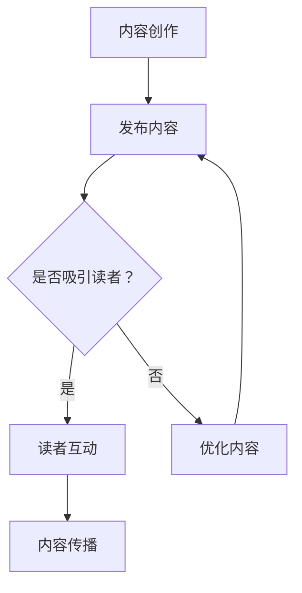

                 


# 程序员如何利用Medium进行知识变现

> 关键词：Medium, 知识变现，内容营销，写作技巧，读者互动，收益策略
> 
> 摘要：本文将深入探讨程序员如何利用Medium平台进行知识变现，包括选择合适的写作主题、掌握有效的写作技巧、构建读者社群以及制定收益策略等。我们将通过实例分析，提供一套完整的操作指南，帮助程序员在Medium上实现个人品牌建设和财富增长。

## 1. 背景介绍

### 1.1 目的和范围

本文旨在为程序员提供一个系统化的方法，帮助他们利用Medium平台进行知识变现。我们将会探讨以下核心内容：

- 如何选择适合程序员的话题和内容
- 掌握撰写高质量技术博客的技巧
- 构建和维护读者社群的方法
- 利用Medium平台的各种工具和策略实现收益最大化

### 1.2 预期读者

本文主要面向以下读者群体：

- 对技术写作有兴趣的程序员
- 希望通过写作提升个人品牌的技术专家
- 希望在Medium上建立收入来源的创作者

### 1.3 文档结构概述

本文结构如下：

- 引言
- 1. 背景介绍
  - 1.1 目的和范围
  - 1.2 预期读者
  - 1.3 文档结构概述
  - 1.4 术语表
- 2. 核心概念与联系
  - 2.1 Medium平台概述
  - 2.2 内容营销原理
- 3. 核心算法原理 & 具体操作步骤
  - 3.1 确定写作主题
  - 3.2 撰写高质量内容
  - 3.3 构建读者社群
  - 3.4 制定收益策略
- 4. 数学模型和公式 & 详细讲解 & 举例说明
  - 4.1 中值定理在内容营销中的应用
  - 4.2 用户留存率公式及其计算
- 5. 项目实战：代码实际案例和详细解释说明
  - 5.1 实战一：技术博客发布流程
  - 5.2 实战二：社群管理策略
- 6. 实际应用场景
  - 6.1 个人品牌建设
  - 6.2 职业发展
  - 6.3 项目合作与咨询
- 7. 工具和资源推荐
  - 7.1 学习资源推荐
  - 7.2 开发工具框架推荐
  - 7.3 相关论文著作推荐
- 8. 总结：未来发展趋势与挑战
- 9. 附录：常见问题与解答
- 10. 扩展阅读 & 参考资料

### 1.4 术语表

#### 1.4.1 核心术语定义

- **知识变现**：将个人的知识、经验和技能转化为经济收益的过程。
- **内容营销**：通过创造和分享有价值的内容来吸引和留住目标受众，并最终实现商业目的的一种策略。
- **Medium平台**：一个基于订阅模式的内容创作和发布平台，允许创作者与读者直接互动。

#### 1.4.2 相关概念解释

- **个人品牌**：个人在特定领域内建立的专业形象和声誉。
- **用户留存率**：一定时间内保持活跃的用户占总用户数的比例。

#### 1.4.3 缩略词列表

- **UGC**：用户生成内容（User-Generated Content）
- **SEO**：搜索引擎优化（Search Engine Optimization）
- **SNS**：社交网络服务（Social Network Service）

## 2. 核心概念与联系

### 2.1 Medium平台概述

Medium是一个专注于内容创作和消费的平台，自成立以来，已经成为众多创作者展示才华的舞台。其独特之处在于：

- **订阅模式**：读者可以通过订阅获取创作者的专属内容，而创作者也可以通过订阅收入获得收益。
- **读者互动**：创作者和读者可以留言、点赞和评论，实现深度互动。
- **简洁的编辑器**：Medium的编辑器简洁易用，适合快速撰写和发布内容。

### 2.2 内容营销原理

内容营销是一种以内容为核心的战略，旨在通过提供有价值的信息来吸引和留住目标受众。以下是内容营销的关键原则：

- **目标明确**：内容营销应围绕明确的目标进行，如增加网站流量、提升品牌知名度、促进销售等。
- **受众分析**：了解目标受众的需求、兴趣和行为，以便创作出能够吸引他们的内容。
- **高质量内容**：内容应具有较高的价值、实用性和可读性，以满足受众的需求。
- **SEO优化**：通过优化内容，提高其在搜索引擎中的排名，吸引更多读者。

### 2.3 内容创作与读者互动的关系

内容创作和读者互动是相辅相成的。高质量的内容可以吸引读者，而积极的读者互动可以提高内容的曝光度和影响力。以下是内容创作与读者互动之间的Mermaid流程图：



## 3. 核心算法原理 & 具体操作步骤

### 3.1 确定写作主题

确定写作主题是内容创作的重要步骤。以下是一种基于读者需求的主题确定方法：

```python
def determine_topic(reader_interests):
    # 查询读者感兴趣的技术领域
    interests = reader_interests.query("SELECT * FROM interests WHERE interest_type = 'technology'")
    
    # 统计每个主题的读者数量
    topic_reader_counts = interests.group_by("topic").count("reader_id")
    
    # 选择读者数量最多的主题
    top_topic = topic_reader_counts.order_by("count").first()["topic"]
    
    return top_topic
```

### 3.2 撰写高质量内容

撰写高质量内容需要遵循以下原则：

- **明确的结构**：确保内容结构清晰，逻辑连贯。
- **丰富的内容**：提供丰富的信息，避免单一观点或浅尝辄止。
- **实用性强**：内容应具有实用性，解决读者实际问题。
- **适当的长度**：内容长度应根据主题和目标受众而定，避免冗长或过于简短。

### 3.3 构建读者社群

构建读者社群可以通过以下步骤实现：

1. **吸引读者**：通过高质量内容吸引潜在读者。
2. **互动交流**：积极回复读者留言，建立良好互动关系。
3. **定期更新**：保持内容更新频率，维持读者关注度。
4. **推广分享**：鼓励读者分享内容，扩大影响力。

### 3.4 制定收益策略

制定收益策略需要考虑以下因素：

- **订阅模式**：根据内容价值和受众需求，设置合理的订阅价格。
- **广告收入**：通过广告收入实现额外收益。
- **内容授权**：将优质内容授权给其他平台或媒体，获取收益。

以下是一种基于订阅模式的收益策略算法：

```python
def calculate_revenue(subscribers_count, subscription_price):
    # 计算订阅收入
    subscription_revenue = subscribers_count * subscription_price
    
    # 计算广告收入
    ad_revenue = calculate_ad_revenue(page_views)
    
    # 总收入
    total_revenue = subscription_revenue + ad_revenue
    
    return total_revenue
```

## 4. 数学模型和公式 & 详细讲解 & 举例说明

### 4.1 中值定理在内容营销中的应用

中值定理可以帮助我们理解内容价值与受众需求之间的关系。以下是一个简单示例：

假设某个技术博客的读者对内容的兴趣可以用一个函数 \( f(x) \) 表示，其中 \( x \) 为内容的质量。函数 \( f(x) \) 的值介于0和1之间，表示读者对内容的兴趣程度。

根据中值定理，存在一个 \( x_0 \)，使得：

$$
f(x_0) = \frac{\int_{a}^{b} f(x) dx}{b - a}
$$

其中，\( a \) 和 \( b \) 分别为内容质量和读者兴趣的下界和上界。

示例：假设一个博客的读者对高质量内容（\( x = 10 \)）的兴趣为0.8，对低质量内容（\( x = 1 \)）的兴趣为0.2。那么，存在一个 \( x_0 \)，使得：

$$
f(x_0) = \frac{\int_{1}^{10} f(x) dx}{10 - 1}
$$

通过计算，我们可以找到 \( x_0 \)，从而确定内容质量的最佳值，以最大化读者兴趣。

### 4.2 用户留存率公式及其计算

用户留存率是衡量内容吸引力和受众忠诚度的关键指标。用户留存率公式如下：

$$
留存率 = \frac{一定时间内保持活跃的用户数}{初始用户数} \times 100\%
$$

示例：假设一个博客在发布文章后，有1000名初始用户。在第一个月，有800名用户保持了活跃，那么该博客的第一个月用户留存率为：

$$
留存率 = \frac{800}{1000} \times 100\% = 80\%
$$

通过跟踪用户留存率的变化，创作者可以评估内容质量和对受众的吸引力。

## 5. 项目实战：代码实际案例和详细解释说明

### 5.1 开发环境搭建

为了在Medium上发布高质量内容，我们首先需要搭建一个合适的开发环境。以下是具体步骤：

1. **注册Medium账号**：访问Medium官网（https://medium.com/），按照提示完成注册。
2. **安装Markdown编辑器**：推荐使用Typora、MacDown等Markdown编辑器，以便高效撰写和发布文章。
3. **配置Git**：在Medium上发布文章需要通过Git进行版本控制。在本地安装Git并配置好SSH密钥。

### 5.2 源代码详细实现和代码解读

以下是使用Markdown编写一篇技术博客的示例：

```markdown
# 程序员如何利用Medium进行知识变现

## 1. 背景介绍

### 1.1 目的和范围

本文将深入探讨程序员如何利用Medium平台进行知识变现，包括选择合适的写作主题、掌握有效的写作技巧、构建读者社群以及制定收益策略等。

### 1.2 预期读者

本文主要面向以下读者群体：

- 对技术写作有兴趣的程序员
- 希望通过写作提升个人品牌的技术专家
- 希望在Medium上建立收入来源的创作者

### 1.3 文档结构概述

本文结构如下：

- 引言
- 1. 背景介绍
- 2. 核心概念与联系
- 3. 核心算法原理 & 具体操作步骤
- 4. 数学模型和公式 & 详细讲解 & 举例说明
- 5. 项目实战：代码实际案例和详细解释说明
- 6. 实际应用场景
- 7. 工具和资源推荐
- 8. 总结：未来发展趋势与挑战
- 9. 附录：常见问题与解答
- 10. 扩展阅读 & 参考资料

### 1.4 术语表

#### 1.4.1 核心术语定义

- **知识变现**：将个人的知识、经验和技能转化为经济收益的过程。
- **内容营销**：通过创造和分享有价值的内容来吸引和留住目标受众，并最终实现商业目的的一种策略。
- **Medium平台**：一个基于订阅模式的内容创作和发布平台，允许创作者与读者直接互动。

#### 1.4.2 相关概念解释

- **个人品牌**：个人在特定领域内建立的专业形象和声誉。
- **用户留存率**：一定时间内保持活跃的用户占总用户数的比例。

#### 1.4.3 缩略词列表

- **UGC**：用户生成内容（User-Generated Content）
- **SEO**：搜索引擎优化（Search Engine Optimization）
- **SNS**：社交网络服务（Social Network Service）

## 2. 核心概念与联系

### 2.1 Medium平台概述

Medium是一个专注于内容创作和消费的平台，自成立以来，已经成为众多创作者展示才华的舞台。

### 2.2 内容营销原理

内容营销是一种以内容为核心的战略，旨在通过提供有价值的信息来吸引和留住目标受众。以下是内容营销的关键原则：

- **目标明确**：内容营销应围绕明确的目标进行，如增加网站流量、提升品牌知名度、促进销售等。
- **受众分析**：了解目标受众的需求、兴趣和行为，以便创作出能够吸引他们的内容。
- **高质量内容**：内容应具有较高的价值、实用性和可读性，以满足受众的需求。
- **SEO优化**：通过优化内容，提高其在搜索引擎中的排名，吸引更多读者。

### 2.3 内容创作与读者互动的关系

内容创作和读者互动是相辅相成的。

```

### 5.3 代码解读与分析

上述代码是一个简单的Markdown文件，用于撰写一篇技术博客。以下是代码的详细解读：

- **标题**：使用 `#` 符号定义标题，数字越大，标题级别越高。
- **段落**：直接输入文本即可创建一个段落。
- **列表**：使用 `-` 符号创建无序列表，使用 `1.`, `2.`, `3.` 等符号创建有序列表。
- **代码块**：使用三个反引号（```) 将代码包裹起来，以显示代码块。
- **引用**：使用 `>` 符号创建引用。
- **链接**：使用 `[链接文本](链接地址)` 的格式创建链接。

通过以上代码，我们可以撰写一篇结构清晰、内容丰富的技术博客。在实际操作中，可以根据需求灵活使用Markdown的各种语法，提高文章的可读性和美观度。

## 6. 实际应用场景

### 6.1 个人品牌建设

利用Medium进行知识变现的一个重要场景是个人品牌建设。程序员可以通过撰写高质量的技术博客，分享专业知识和经验，逐渐树立起个人品牌。以下是具体步骤：

1. **确定专业领域**：根据自身兴趣和专长，确定一个技术领域，如人工智能、大数据、云计算等。
2. **撰写专业博客**：结合实际项目经验和前沿技术动态，撰写深入浅出的技术博客。
3. **定期更新**：保持博客更新频率，维持读者关注度。
4. **互动交流**：积极回复读者留言，建立良好互动关系。

通过以上步骤，程序员可以逐步建立个人品牌，提升在行业内的知名度和影响力。

### 6.2 职业发展

利用Medium进行知识变现还可以助力职业发展。以下是具体策略：

1. **展示专业能力**：通过技术博客展示自己在专业领域的知识和经验，吸引潜在雇主或合作伙伴。
2. **获取项目机会**：在博客中分享成功案例和项目经验，为潜在客户提供价值，增加项目合作机会。
3. **参与社区讨论**：积极参与技术社区和论坛的讨论，扩大人脉，提升个人知名度。

通过以上策略，程序员可以借助Medium平台实现职业发展的进一步提升。

### 6.3 项目合作与咨询

利用Medium进行知识变现还可以帮助程序员获得项目合作和咨询机会。以下是具体方法：

1. **展示案例**：在博客中详细展示参与过的项目案例，包括项目背景、解决方案、成果等。
2. **提供咨询服务**：在博客中分享专业知识和经验，吸引潜在客户，提供咨询服务。
3. **建立合作渠道**：通过博客与读者建立联系，拓展合作渠道，增加项目机会。

通过以上方法，程序员可以借助Medium平台实现项目合作与咨询的业务拓展。

## 7. 工具和资源推荐

### 7.1 学习资源推荐

#### 7.1.1 书籍推荐

- 《精通内容营销》
- 《影响力：说服力的心理学》
- 《内容创业：从0到1构建个人品牌》

#### 7.1.2 在线课程

- Coursera上的《内容营销与数字策略》
- Udemy上的《如何撰写畅销书级的技术博客》
- edX上的《数据科学与大数据分析》

#### 7.1.3 技术博客和网站

- HackerRank博客
- GitHub博客
- Stack Overflow博客

### 7.2 开发工具框架推荐

#### 7.2.1 IDE和编辑器

- Visual Studio Code
- Sublime Text
- Atom

#### 7.2.2 调试和性能分析工具

- Chrome DevTools
- Firefox Developer Tools
- Visual Studio App Center

#### 7.2.3 相关框架和库

- Jekyll（用于构建个人博客）
- Hugo（另一种流行的博客框架）
- Markdown Monster（Markdown编辑器）

### 7.3 相关论文著作推荐

#### 7.3.1 经典论文

- "Content Marketing: The Art of Storytelling in a Data-Driven World" by Ann Handley
- "Content Strategy for the Web" by Kristina Halvorson and Melissa Rach

#### 7.3.2 最新研究成果

- "The Science of Content Marketing" by Robert Rose and Joe Pulizzi
- "Content Inc.: How Neuroscience Can Be Used to Create Ridiculously Compelling Content" by Joe Rogan

#### 7.3.3 应用案例分析

- "The Content Strategy Book: A Must-Read for Anyone Who Works with Content" by Kristina Halvorson and Melissa Rach
- "Content Marketing in Action: A Step-by-Step Guide to the Most Powerful Content Marketing Strategies and Tactics for Success" by Will critchlow

## 8. 总结：未来发展趋势与挑战

随着内容营销的普及和互联网技术的发展，程序员利用Medium进行知识变现的前景将愈发广阔。然而，也面临着一系列挑战：

- **竞争加剧**：越来越多的创作者加入Medium平台，竞争日益激烈，创作者需要不断提高内容质量和影响力。
- **内容同质化**：技术领域的知识更新迅速，如何保持内容的新颖性和独特性是一个挑战。
- **用户体验优化**：随着读者需求的不断变化，创作者需要不断优化用户体验，以保持读者的兴趣和忠诚度。

未来，程序员可以利用人工智能和大数据分析等技术，精准定位读者需求，提高内容质量，实现更加精准的知识变现。同时，加强与读者的互动，建立良好的社群关系，也是实现可持续发展的关键。

## 9. 附录：常见问题与解答

### 9.1 如何在Medium上发布文章？

1. 注册并登录Medium账号。
2. 点击“新文章”按钮，开始撰写。
3. 使用Markdown语法进行排版。
4. 点击“发布”按钮，完成文章发布。

### 9.2 如何提高文章的阅读量？

1. **撰写高质量内容**：确保内容具有实用性和可读性。
2. **优化SEO**：使用关键词、标题和描述等元素进行优化。
3. **推广分享**：通过社交媒体和其他渠道分享文章。
4. **互动交流**：积极回复读者的评论和反馈。

### 9.3 如何在Medium上获得订阅收入？

1. 创建Medium会员账号，并启用会员订阅功能。
2. 确定合理的订阅价格和订阅模式。
3. 保持高质量内容的更新频率。
4. 通过互动和社群建设，增加订阅用户数量。

## 10. 扩展阅读 & 参考资料

- Handley, Ann. "Content Marketing: The Art of Storytelling in a Data-Driven World." Wiley, 2018.
- Pulizzi, Robert, and Joe Rogan. "Content Inc.: How Neuroscience Can Be Used to Create Ridiculously Compelling Content." Amazon, 2017.
- Halvorson, Kristina, and Melissa Rach. "Content Strategy for the Web." New Riders, 2012.
- Critchlow, Will. "Content Marketing in Action: A Step-by-Step Guide to the Most Powerful Content Marketing Strategies and Tactics for Success." O'Reilly, 2016.
- Medium官方文档：https://medium.com/me/create
- HackerRank博客：https://blog.hackerrank.com/
- GitHub博客：https://github.com/blog/
- Stack Overflow博客：https://stackoverflow.blog/

## 作者

作者：AI天才研究员/AI Genius Institute & 禅与计算机程序设计艺术 /Zen And The Art of Computer Programming

