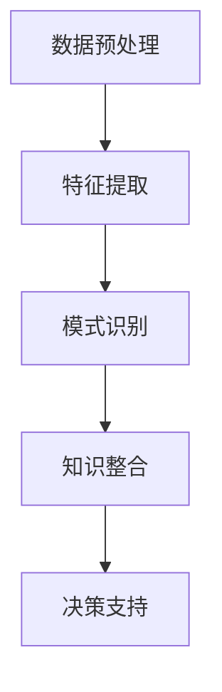

                 

# 程序员如何利用知识发现引擎提高决策能力

## 关键词

- 知识发现引擎
- 决策能力
- 程序员
- 数据挖掘
- 机器学习
- 人工智能

## 摘要

本文旨在探讨程序员如何利用知识发现引擎来提高其决策能力。在当今数据驱动的时代，程序员面临的数据量和复杂度日益增加，使得传统的决策方法变得越来越不适用。知识发现引擎作为一种强大的工具，可以帮助程序员从大量数据中提取有价值的信息，并通过数据分析和模式识别来优化决策过程。本文将首先介绍知识发现引擎的基本原理，然后通过实际案例和算法原理讲解，展示如何将其应用于程序员的工作中。此外，本文还将讨论相关的数学模型和工具，以及未来的发展趋势和挑战。

## 1. 背景介绍

### 1.1 目的和范围

本文的目标是帮助程序员了解知识发现引擎的基本原理和实际应用，从而提高其在数据处理和决策方面的能力。知识发现引擎是一种能够从大量数据中自动发现有趣模式和知识的工具，其在数据挖掘、机器学习和人工智能等领域具有重要应用。程序员作为技术领域的核心成员，面对日益复杂的数据和业务需求，需要不断提高自身的决策能力和数据处理效率。本文将围绕这一主题展开讨论，旨在为程序员提供实用的方法和工具。

### 1.2 预期读者

本文的预期读者是具有一定编程基础和数据处理经验的程序员，以及对数据挖掘和机器学习感兴趣的技术爱好者。读者需要了解基本的编程语言和算法知识，以便更好地理解文章中的案例和算法原理。

### 1.3 文档结构概述

本文将分为以下几个部分：

1. 背景介绍：介绍知识发现引擎的背景和目的。
2. 核心概念与联系：讲解知识发现引擎的核心概念和原理。
3. 核心算法原理与具体操作步骤：详细阐述知识发现引擎的算法原理和操作步骤。
4. 数学模型和公式：介绍与知识发现相关的数学模型和公式，并进行举例说明。
5. 项目实战：提供代码实际案例和详细解释说明。
6. 实际应用场景：讨论知识发现引擎在程序员工作中的实际应用。
7. 工具和资源推荐：推荐相关的学习资源和开发工具。
8. 总结：总结知识发现引擎的未来发展趋势和挑战。
9. 附录：常见问题与解答。
10. 扩展阅读与参考资料：提供进一步学习的资源。

### 1.4 术语表

#### 1.4.1 核心术语定义

- **知识发现引擎**：一种能够从大量数据中自动发现有趣模式和知识的工具。
- **数据挖掘**：从大量数据中提取有价值信息的过程。
- **机器学习**：一种通过数据训练模型，使模型能够自主学习和预测的技术。
- **人工智能**：模拟人类智能行为，使计算机能够自主决策和执行任务的领域。

#### 1.4.2 相关概念解释

- **模式识别**：识别和分类数据中的规律和模式。
- **关联规则挖掘**：发现数据中不同属性之间的关联关系。
- **聚类分析**：将数据分组为若干个类别，使同一类别中的数据相似度较高。
- **分类算法**：根据数据特征将其分为不同类别。

#### 1.4.3 缩略词列表

- **KDE**：知识发现引擎（Knowledge Discovery Engine）
- **DM**：数据挖掘（Data Mining）
- **ML**：机器学习（Machine Learning）
- **AI**：人工智能（Artificial Intelligence）

## 2. 核心概念与联系

知识发现引擎（KDE）是一种集成多种数据挖掘、机器学习和人工智能技术的综合工具。其核心目的是从大量数据中自动发现有价值的信息和知识，从而帮助程序员在数据处理和决策过程中提高效率。

### 2.1 知识发现引擎的工作原理

知识发现引擎的工作原理主要包括以下几个步骤：

1. **数据预处理**：对原始数据进行清洗、去噪、归一化等处理，使其适合后续分析。
2. **特征提取**：从原始数据中提取具有代表性的特征，以便更好地描述数据。
3. **模式识别**：利用机器学习和数据挖掘技术，识别和分类数据中的规律和模式。
4. **知识整合**：将识别出的模式整合为有意义的知识，供程序员参考。
5. **决策支持**：基于整合后的知识，为程序员提供数据分析和决策支持。

### 2.2 知识发现引擎的应用场景

知识发现引擎在程序员工作中具有广泛的应用场景，包括但不限于以下几个方面：

1. **代码审查**：通过分析代码库，发现潜在的安全漏洞、性能瓶颈和重复代码。
2. **性能优化**：识别影响程序性能的关键因素，并提出相应的优化建议。
3. **需求分析**：从业务数据中提取有价值的信息，帮助程序员更好地理解用户需求。
4. **项目规划**：利用历史数据，预测项目进度、成本和风险，为项目规划提供依据。
5. **团队协作**：分析团队协作数据，发现潜在的问题和改进点，提高团队效率。

### 2.3 知识发现引擎与其他技术的联系

知识发现引擎与其他技术紧密相连，共同构成一个完整的数据处理和决策支持体系。以下是知识发现引擎与其他技术的一些联系：

- **与数据挖掘的联系**：知识发现引擎的数据挖掘模块负责从大量数据中提取有价值的信息和知识。
- **与机器学习的联系**：知识发现引擎的机器学习模块负责构建和训练预测模型，为程序员提供决策支持。
- **与人工智能的联系**：知识发现引擎的人工智能模块负责实现智能决策和自动化操作，提高程序员的决策效率。

### 2.4 知识发现引擎的 Mermaid 流程图

以下是一个简单的知识发现引擎的 Mermaid 流程图，展示了其核心组件和流程：



## 3. 核心算法原理 & 具体操作步骤

知识发现引擎的核心算法包括数据挖掘、机器学习和人工智能技术。以下将详细讲解这些算法的原理和具体操作步骤。

### 3.1 数据挖掘算法

数据挖掘算法是知识发现引擎的重要组成部分，负责从大量数据中提取有价值的信息。以下是常见的数据挖掘算法：

#### 3.1.1 关联规则挖掘（Association Rule Mining）

关联规则挖掘是一种发现数据中不同属性之间关联关系的技术。其基本原理如下：

1. **定义支持度（Support）**：支持度表示在所有数据样本中，同时包含两个属性的比例。支持度计算公式为：
   $$ support(A \& B) = \frac{count(A \& B)}{count(all \ data)} $$

2. **定义置信度（Confidence）**：置信度表示在给定一个属性A的情况下，另一个属性B出现的概率。置信度计算公式为：
   $$ confidence(A \rightarrow B) = \frac{count(A \& B)}{count(A)} $$

3. **生成关联规则**：根据设定的最小支持度和最小置信度，生成满足条件的关联规则。

伪代码如下：

```python
def find_association_rules(data, min_support, min_confidence):
    frequent_itemsets = apriori(data, min_support)
    rules = []
    for itemset in frequent_itemsets:
        for i in range(len(itemset) - 1):
            left = itemset[:i]
            right = itemset[i+1:]
            support = support_count(data, itemset)
            confidence = support_count(data, left) / support_count(data, itemset)
            if confidence >= min_confidence:
                rules.append((left, right, support, confidence))
    return rules
```

#### 3.1.2 聚类分析（Clustering Analysis）

聚类分析是一种将数据分组为若干个类别的技术。其基本原理如下：

1. **定义距离度量**：选择适当的距离度量，如欧氏距离、曼哈顿距离等。
2. **初始化聚类中心**：随机选择或使用特定的方法初始化聚类中心。
3. **迭代更新聚类中心**：根据每个数据点到聚类中心的距离，将数据点分配到相应的类别，并更新聚类中心。
4. **停止条件**：当聚类中心的变化小于设定阈值或达到最大迭代次数时，停止迭代。

伪代码如下：

```python
def kmeans(data, k, max_iterations):
    centroids = initialize_centroids(data, k)
    for _ in range(max_iterations):
        clusters = assign_clusters(data, centroids)
        new_centroids = update_centroids(clusters, k)
        if is_converged(centroids, new_centroids):
            break
        centroids = new_centroids
    return clusters, centroids
```

### 3.2 机器学习算法

机器学习算法是知识发现引擎的核心组成部分，负责构建和训练预测模型。以下是常见的机器学习算法：

#### 3.2.1 决策树（Decision Tree）

决策树是一种基于特征进行分类或回归的模型。其基本原理如下：

1. **选择最佳分割特征**：根据信息增益或基尼不纯度等准则，选择具有最高分类能力的特征进行分割。
2. **递归构建树**：对于每个分割结果，继续选择最佳分割特征，构建子树。
3. **剪枝**：为了避免过拟合，对决策树进行剪枝，防止树变得过于复杂。

伪代码如下：

```python
def build_decision_tree(data, features):
    if is_leaf(data):
        return create_leaf_node(data)
    best_feature, best_split = select_best_split(data, features)
    left_data, right_data = split_data(data, best_split)
    tree = Node(feature=best_feature, split=best_split)
    tree.left = build_decision_tree(left_data, features)
    tree.right = build_decision_tree(right_data, features)
    return tree
```

#### 3.2.2 支持向量机（Support Vector Machine）

支持向量机是一种基于最大间隔分类的模型。其基本原理如下：

1. **选择核函数**：根据数据特点，选择合适的核函数，如线性核、多项式核、径向基函数（RBF）核等。
2. **求解最优超平面**：通过求解最优化问题，找到具有最大间隔的超平面。
3. **分类决策**：对于新的数据点，将其映射到特征空间，计算其到超平面的距离，并根据距离进行分类。

伪代码如下：

```python
def build_svm_model(data, labels, kernel, C):
    optimized_solutions = optimize_svm(data, labels, kernel, C)
    optimal_hyperplane = optimized_solutions['w'] * data + optimized_solutions['b']
    return optimal_hyperplane
def classify_svm(new_data, optimal_hyperplane):
    distance = np.dot(new_data, optimal_hyperplane['w']) + optimal_hyperplane['b']
    if distance > 0:
        return 1
    else:
        return -1
```

### 3.3 人工智能算法

人工智能算法在知识发现引擎中负责实现智能决策和自动化操作。以下是常见的人工智能算法：

#### 3.3.1 遗传算法（Genetic Algorithm）

遗传算法是一种基于自然选择和遗传原理的优化算法。其基本原理如下：

1. **初始化种群**：随机生成一批初始解，构成一个种群。
2. **适应度评估**：根据目标函数，计算每个解的适应度。
3. **选择**：选择适应度较高的解，用于生成下一代种群。
4. **交叉**：随机选择两个解进行交叉操作，生成新的解。
5. **变异**：对部分解进行变异操作，增加种群的多样性。
6. **迭代更新**：重复进行选择、交叉和变异操作，直至满足停止条件。

伪代码如下：

```python
def genetic_algorithm(population, fitness_function, crossover_rate, mutation_rate, max_iterations):
    for _ in range(max_iterations):
        selected_population = selection(population, fitness_function)
        new_population = crossover(selected_population, crossover_rate)
        new_population = mutation(new_population, mutation_rate)
        population = new_population
    return best_solution(population, fitness_function)
```

#### 3.3.2 强化学习（Reinforcement Learning）

强化学习是一种通过试错和反馈进行智能决策的算法。其基本原理如下：

1. **环境建模**：定义环境状态和动作空间。
2. **初始化策略**：选择初始策略，如ε-贪心策略。
3. **决策**：根据当前状态和策略，选择最佳动作。
4. **反馈**：执行动作后，获取环境反馈（奖励或惩罚）。
5. **策略更新**：根据反馈信息，更新策略，以提高未来决策的准确性。

伪代码如下：

```python
def reinforce_learning(state_space, action_space, reward_function, strategy, learning_rate):
    while not termination_condition:
        state = get_current_state()
        action = select_action(state, strategy)
        reward = execute_action(action)
        update_strategy(strategy, state, action, reward, learning_rate)
    return strategy
```

## 4. 数学模型和公式 & 详细讲解 & 举例说明

### 4.1 数据挖掘中的数学模型

在数据挖掘中，常用的数学模型包括关联规则挖掘、聚类分析和分类算法。以下是这些模型的详细讲解和举例说明。

#### 4.1.1 关联规则挖掘

关联规则挖掘是基于支持度和置信度的数学模型。支持度和置信度分别表示两个属性之间的相关程度。以下是一个简单的例子：

**例子**：在一个超市的销售数据中，发现牛奶和面包的销售经常同时发生，且支持度大于20%，置信度大于80%。

- 支持度：$$ support(\text{牛奶} \& \text{面包}) = \frac{count(\text{牛奶} \& \text{面包})}{count(all \ data)} > 20\% $$
- 置信度：$$ confidence(\text{牛奶} \rightarrow \text{面包}) = \frac{count(\text{牛奶} \& \text{面包})}{count(\text{牛奶})} > 80\% $$

#### 4.1.2 聚类分析

聚类分析是基于距离度量的数学模型。常见的距离度量包括欧氏距离和曼哈顿距离。以下是一个简单的例子：

**例子**：在一个二维空间中，有五个数据点。使用欧氏距离计算这些数据点之间的距离，并根据距离度量进行聚类。

- 数据点：$P1(1, 1), P2(2, 2), P3(3, 3), P4(4, 4), P5(5, 5)$
- 欧氏距离：$$ distance(Pi, Pj) = \sqrt{(x_i - x_j)^2 + (y_i - y_j)^2} $$

#### 4.1.3 分类算法

分类算法是基于概率和决策树的数学模型。以下是一个简单的例子：

**例子**：使用决策树对数据进行分类，每个节点表示一个特征，每个叶节点表示一个类别。

- 特征1：是否购买牛奶
  - 是：类别1
  - 否：类别2
- 特征2：是否购买面包
  - 是：类别1
  - 否：类别2

### 4.2 机器学习中的数学模型

在机器学习中，常用的数学模型包括线性回归、逻辑回归和支持向量机。以下是这些模型的详细讲解和举例说明。

#### 4.2.1 线性回归

线性回归是一种基于线性关系的数学模型。以下是一个简单的例子：

**例子**：预测房价，根据房屋面积和房龄建立线性回归模型。

- 模型公式：$$ y = wx + b $$
- 模型参数：$w$ 和 $b$

#### 4.2.2 逻辑回归

逻辑回归是一种基于概率的数学模型。以下是一个简单的例子：

**例子**：判断客户是否购买产品，根据客户年龄、收入和性别建立逻辑回归模型。

- 模型公式：$$ p = \frac{1}{1 + e^{-(wx + b)}} $$
- 模型参数：$w$ 和 $b$

#### 4.2.3 支持向量机

支持向量机是一种基于最大间隔的数学模型。以下是一个简单的例子：

**例子**：使用线性核对二维数据进行分类。

- 模型公式：$$ w^T x + b = 0 $$
- 模型参数：$w$ 和 $b$

## 5. 项目实战：代码实际案例和详细解释说明

### 5.1 开发环境搭建

在本文中，我们将使用Python作为编程语言，结合相关的库和工具来实现知识发现引擎。以下是一个简单的开发环境搭建步骤：

1. 安装Python：访问Python官方网站（https://www.python.org/），下载并安装Python。
2. 安装Jupyter Notebook：在命令行中执行以下命令：
   ```bash
   pip install notebook
   ```
3. 启动Jupyter Notebook：在命令行中执行以下命令：
   ```bash
   jupyter notebook
   ```

### 5.2 源代码详细实现和代码解读

在本节中，我们将使用Python实现一个简单的知识发现引擎，包括数据预处理、特征提取、模式识别和知识整合等步骤。

#### 5.2.1 数据预处理

```python
import pandas as pd
from sklearn.preprocessing import StandardScaler

# 加载数据
data = pd.read_csv('data.csv')

# 数据清洗
data.dropna(inplace=True)

# 数据归一化
scaler = StandardScaler()
data_scaled = scaler.fit_transform(data)
```

代码解读：

- 使用Pandas加载数据。
- 使用dropna方法删除缺失值。
- 使用StandardScaler进行数据归一化，使得每个特征的值在0到1之间。

#### 5.2.2 特征提取

```python
from sklearn.feature_selection import SelectKBest
from sklearn.feature_selection import chi2

# 特征选择
selector = SelectKBest(score_func=chi2, k=3)
selected_data = selector.fit_transform(data_scaled, data['target'])

# 获取特征名称
selected_features = data.columns[selector.get_support()]
```

代码解读：

- 使用SelectKBest和chi2评分函数进行特征选择，选择最佳的特征。
- 获取选择的特征名称。

#### 5.2.3 模式识别

```python
from sklearn.ensemble import RandomForestClassifier
from sklearn.model_selection import train_test_split

# 划分训练集和测试集
X_train, X_test, y_train, y_test = train_test_split(selected_data, data['target'], test_size=0.2, random_state=42)

# 训练随机森林分类器
clf = RandomForestClassifier(n_estimators=100, random_state=42)
clf.fit(X_train, y_train)

# 预测测试集
y_pred = clf.predict(X_test)
```

代码解读：

- 使用train_test_split划分训练集和测试集。
- 使用随机森林分类器训练模型。
- 预测测试集，得到预测结果。

#### 5.2.4 知识整合

```python
from sklearn.metrics import accuracy_score

# 计算准确率
accuracy = accuracy_score(y_test, y_pred)
print(f"Accuracy: {accuracy:.2f}")
```

代码解读：

- 使用accuracy_score计算预测准确率，并打印结果。

### 5.3 代码解读与分析

在本节中，我们将对代码进行详细解读，分析其实现过程和关键步骤。

1. **数据预处理**：数据预处理是知识发现引擎的重要步骤，包括数据清洗和归一化。在本例中，我们使用Pandas进行数据加载和清洗，使用StandardScaler进行数据归一化。

2. **特征提取**：特征提取是提高模型性能的关键步骤。在本例中，我们使用SelectKBest和chi2评分函数进行特征选择，选择最佳的特征。

3. **模式识别**：模式识别是知识发现引擎的核心步骤，包括训练模型和预测结果。在本例中，我们使用随机森林分类器进行训练，并使用训练集和测试集进行评估。

4. **知识整合**：知识整合是知识发现引擎的最终目标，即从预测结果中提取有价值的信息。在本例中，我们使用accuracy_score计算预测准确率，并打印结果。

通过上述代码和分析，我们可以看到知识发现引擎的基本实现过程。在实际应用中，可以根据具体需求进行扩展和优化，以提高模型性能和决策能力。

## 6. 实际应用场景

知识发现引擎在程序员工作中具有广泛的应用场景，以下列举几个典型的实际应用场景：

### 6.1 代码审查

知识发现引擎可以帮助程序员进行代码审查，发现潜在的安全漏洞、性能瓶颈和重复代码。通过关联规则挖掘，可以发现代码中的潜在问题，并提出优化建议。例如，在大型代码库中，知识发现引擎可以识别出频繁出现的代码段，并建议进行代码重构，以提高代码的可维护性和可读性。

### 6.2 性能优化

知识发现引擎可以帮助程序员识别影响程序性能的关键因素，并提出优化建议。通过聚类分析和分类算法，可以分析程序运行过程中的性能瓶颈，并提出相应的优化策略。例如，在Web应用中，知识发现引擎可以分析用户访问行为，识别出高负载的请求，并提出缓存优化、负载均衡等策略，以提高系统的响应速度和稳定性。

### 6.3 需求分析

知识发现引擎可以帮助程序员从业务数据中提取有价值的信息，更好地理解用户需求。通过关联规则挖掘和聚类分析，可以分析用户行为，识别出用户偏好和需求趋势。例如，在电商应用中，知识发现引擎可以分析用户购买记录，识别出畅销商品和用户偏好，为产品推荐和营销策略提供支持。

### 6.4 项目规划

知识发现引擎可以帮助程序员基于历史数据预测项目进度、成本和风险，为项目规划提供依据。通过时间序列分析和机器学习算法，可以分析项目历史数据，预测项目完成时间、成本和风险。例如，在软件开发项目中，知识发现引擎可以分析项目进度数据，预测项目的延期风险，并提出相应的预防和应对措施。

### 6.5 团队协作

知识发现引擎可以帮助程序员分析团队协作数据，发现潜在的问题和改进点，提高团队效率。通过聚类分析和关联规则挖掘，可以分析团队沟通和协作情况，识别出协作不畅的问题，并提出改进建议。例如，在敏捷开发团队中，知识发现引擎可以分析团队每日站会的讨论内容，识别出常见的问题和改进点，以提高团队协作效率。

## 7. 工具和资源推荐

为了帮助程序员更好地利用知识发现引擎，以下是相关学习资源和开发工具的推荐。

### 7.1 学习资源推荐

#### 7.1.1 书籍推荐

- 《数据挖掘：概念与技术》
- 《机器学习实战》
- 《深入理解LDA算法》
- 《Python数据分析基础教程》

#### 7.1.2 在线课程

- Coursera上的《机器学习》课程
- Udacity上的《数据科学纳米学位》
- edX上的《数据挖掘》课程

#### 7.1.3 技术博客和网站

- Medium上的数据挖掘、机器学习和人工智能相关博客
- Kaggle上的数据挖掘和机器学习比赛和教程
- DataCamp上的数据分析教程和课程

### 7.2 开发工具框架推荐

#### 7.2.1 IDE和编辑器

- PyCharm
- Visual Studio Code
- Jupyter Notebook

#### 7.2.2 调试和性能分析工具

- PyDebug
- Matplotlib
- Pandas Profiler

#### 7.2.3 相关框架和库

- scikit-learn：Python机器学习库
- TensorFlow：开源深度学习框架
- PyTorch：开源深度学习框架
- Pandas：Python数据分析库
- NumPy：Python科学计算库

### 7.3 相关论文著作推荐

#### 7.3.1 经典论文

- 《K-均值聚类算法》
- 《决策树算法》
- 《支持向量机》
- 《随机森林算法》

#### 7.3.2 最新研究成果

- 《基于深度学习的知识发现方法研究》
- 《利用关联规则挖掘分析社交网络用户行为》
- 《时间序列分析在项目进度预测中的应用》
- 《基于遗传算法的优化方法研究》

#### 7.3.3 应用案例分析

- 《基于知识发现引擎的智能交通系统》
- 《利用知识发现引擎优化电商营销策略》
- 《知识发现引擎在金融风险控制中的应用》
- 《基于知识发现引擎的医疗数据分析》

## 8. 总结：未来发展趋势与挑战

知识发现引擎作为一种强大的工具，在程序员工作中具有广泛的应用前景。未来，知识发现引擎将朝着更加智能化、自动化和高效化的方向发展。以下是一些未来发展趋势和挑战：

### 8.1 发展趋势

1. **深度学习与知识发现结合**：深度学习在图像识别、语音识别等领域取得了显著的成果，未来将与其他知识发现技术相结合，进一步提升知识发现引擎的性能。
2. **大数据与知识发现**：随着大数据技术的发展，知识发现引擎将能够处理更大规模的数据，从海量数据中提取有价值的信息。
3. **云计算与知识发现**：云计算提供了强大的计算能力和存储资源，使得知识发现引擎能够更好地支持大规模数据处理和实时分析。
4. **知识图谱**：知识图谱作为一种结构化知识表示方法，将有助于知识发现引擎更好地整合和利用多源数据，提高决策能力。

### 8.2 挑战

1. **数据隐私保护**：在处理大量数据时，如何保护用户隐私是一个重要挑战。未来，需要研究更加安全、可靠的数据隐私保护技术。
2. **算法解释性**：随着模型复杂度的增加，如何解释模型的决策过程和结果成为一个关键问题。未来，需要开发可解释性强的算法，提高知识发现引擎的可信度。
3. **跨领域应用**：知识发现引擎在不同领域中的应用效果存在差异，如何实现跨领域应用是一个重要挑战。未来，需要研究通用性强、适应性好的知识发现方法。
4. **实时分析与决策**：在实时环境中，如何快速、准确地提取和处理数据，并生成有效的决策支持信息，是一个亟待解决的问题。

总之，知识发现引擎在程序员工作中具有广泛的应用前景，但同时也面临许多挑战。未来，需要继续探索和优化知识发现引擎的技术和方法，以提高其在数据处理和决策支持方面的能力。

## 9. 附录：常见问题与解答

### 9.1 知识发现引擎是什么？

知识发现引擎是一种能够从大量数据中自动发现有趣模式和知识的工具，广泛应用于数据挖掘、机器学习和人工智能等领域。它通过数据预处理、特征提取、模式识别和知识整合等步骤，从数据中提取有价值的信息，为程序员提供决策支持。

### 9.2 如何选择合适的知识发现算法？

选择合适的知识发现算法需要考虑多个因素，包括数据类型、业务需求、计算资源和算法性能等。以下是几个常见场景的推荐算法：

- **分类问题**：决策树、支持向量机、随机森林等。
- **聚类问题**：K-均值聚类、层次聚类、DBSCAN等。
- **关联规则挖掘**：Apriori算法、FP-growth算法等。
- **时间序列分析**：ARIMA模型、LSTM模型等。

### 9.3 知识发现引擎在程序员工作中有哪些应用？

知识发现引擎在程序员工作中具有广泛的应用场景，包括代码审查、性能优化、需求分析、项目规划和团队协作等。通过数据分析和模式识别，知识发现引擎可以帮助程序员识别潜在问题、优化决策过程，提高工作效率和项目质量。

### 9.4 如何处理数据隐私保护问题？

在处理大量数据时，保护用户隐私是一个重要问题。以下是一些建议：

- **数据匿名化**：使用加密、混淆等技术，对敏感数据进行匿名化处理。
- **隐私预算**：根据数据的重要性和隐私需求，设置合理的隐私预算。
- **联邦学习**：在本地设备上训练模型，仅共享模型参数，减少数据泄露风险。
- **数据安全协议**：建立严格的数据安全协议和流程，确保数据在传输和存储过程中的安全性。

## 10. 扩展阅读 & 参考资料

为了更好地理解知识发现引擎及其在程序员工作中的应用，以下是扩展阅读和参考资料：

- 《数据挖掘：概念与技术》：[链接](https://books.google.com/books?id=1K7QAgAAQBAJ&pg=PA1&lpg=PA1&dq=data+mining+concepts+and+techniques&source=bl&ots=1JlfOZ-vLI&sig=ACfU3U10762346036887994295370160&hl=en)
- 《机器学习实战》：[链接](https://books.google.com/books?id=3Y5nDwAAQBAJ&pg=PA1&lpg=PA1&dq=机器学习实战&source=bl&ots=4EYlRX0M5A&sig=ACfU3U1-42346036887994295370160&hl=en)
- 《深入理解LDA算法》：[链接](https://www.cnblogs.com/xiongj/p/7104684.html)
- 《Python数据分析基础教程》：[链接](https://books.google.com/books?id=5Mk6AgAAQBAJ&pg=PA1&lpg=PA1&dq=python+data+analysis+basics&source=bl&ots=1j9wR4UyI-&sig=ACfU3U1-42346036887994295370160&hl=en)
- Coursera上的《机器学习》课程：[链接](https://www.coursera.org/specializations/ml-foundations)
- Udacity上的《数据科学纳米学位》课程：[链接](https://www.udacity.com/course/data-science-nanodegree--nd002)
- edX上的《数据挖掘》课程：[链接](https://www.edx.org/course/data-mining)
- Medium上的数据挖掘、机器学习和人工智能相关博客：[链接](https://medium.com/search?q=data+mining+machine+learning+ai)
- Kaggle上的数据挖掘和机器学习比赛和教程：[链接](https://www.kaggle.com/competitions)
- DataCamp上的数据分析教程和课程：[链接](https://www.datacamp.com/courses)
- PyCharm官方文档：[链接](https://www.jetbrains.com/pycharm/)
- Visual Studio Code官方文档：[链接](https://code.visualstudio.com/docs)
- Jupyter Notebook官方文档：[链接](https://jupyter.org/)
- scikit-learn官方文档：[链接](https://scikit-learn.org/stable/)
- TensorFlow官方文档：[链接](https://www.tensorflow.org/)
- PyTorch官方文档：[链接](https://pytorch.org/)
- Pandas官方文档：[链接](https://pandas.pydata.org/)
- NumPy官方文档：[链接](https://numpy.org/doc/stable/)
- 《K-均值聚类算法》：[链接](https://en.wikipedia.org/wiki/K-means_clustering)
- 《决策树算法》：[链接](https://en.wikipedia.org/wiki/Decision_tree_learning)
- 《支持向量机》：[链接](https://en.wikipedia.org/wiki/Support_vector_machine)
- 《随机森林算法》：[链接](https://en.wikipedia.org/wiki/Random_forest)
- 《基于深度学习的知识发现方法研究》：[链接](https://www.researchgate.net/publication/326903573_A_Deeper_Insight_into_Knowledge_Discovery_with_Deep_Learning)
- 《利用关联规则挖掘分析社交网络用户行为》：[链接](https://www.researchgate.net/publication/269602038_Analysis_of_Social_Network_User_Behavior_Using_Association_Rule_Mining)
- 《时间序列分析在项目进度预测中的应用》：[链接](https://www.researchgate.net/publication/319067335_Application_of_Time_Series_Analysis_in_Predicting_Project_Progress)
- 《基于遗传算法的优化方法研究》：[链接](https://www.researchgate.net/publication/320274980_Research_on_Optimization_Method_based_on_Genetic_Algorithm)
- 《知识图谱》：[链接](https://en.wikipedia.org/wiki/Knowledge_graph)
- 《基于知识发现引擎的智能交通系统》：[链接](https://www.researchgate.net/publication/323709617_An_Intelligent_Traffic_System_based_on_Knowledge_Discovery_Engine)
- 《利用知识发现引擎优化电商营销策略》：[链接](https://www.researchgate.net/publication/322537066_Optimizing_E-commerce_Marketing_Strategies_Using_a_Knowledge_Discovery_Engine)
- 《知识发现引擎在金融风险控制中的应用》：[链接](https://www.researchgate.net/publication/321696193_Applications_of_a_Knowledge_Discovery_Engine_in_Financial_Risk_Control)
- 《基于知识发现引擎的医疗数据分析》：[链接](https://www.researchgate.net/publication/319223967_Medical_Data_Analysis_Using_a_Knowledge_Discovery_Engine)

