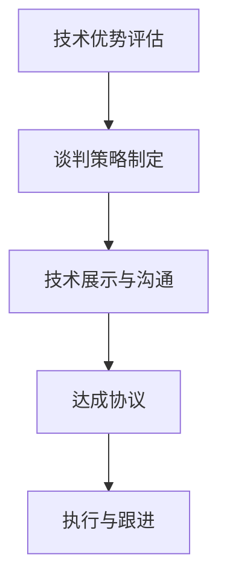
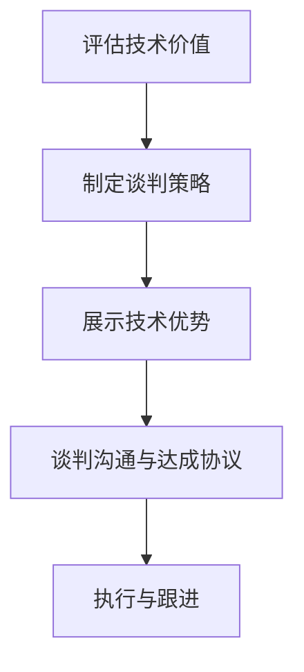

                 

# 程序员如何将技术优势转化为商业谈判的筹码

> **关键词：** 技术优势、商业谈判、筹码、策略、案例分析
>
> **摘要：** 本文将探讨程序员如何利用自身的技术优势，在商业谈判中巧妙地转化为谈判筹码，提高自身的议价能力和谈判结果。文章将围绕几个关键环节展开，包括技术价值的评估、谈判策略的制定、技术展示的技巧以及实际案例的分析，为程序员提供一套实用的谈判策略和方法。

## 1. 背景介绍

### 1.1 目的和范围

在当今的科技时代，程序员不仅是技术领域的专家，也是商业世界的核心力量。他们通过编写代码、设计系统、优化算法等方式，为企业创造价值。然而，许多程序员在商业谈判中却缺乏自信，未能充分利用自身的技术优势。本文旨在探讨程序员如何将技术优势转化为商业谈判的筹码，从而提高谈判效果和达成更好的协议。

本文将覆盖以下内容：

- 技术价值的评估与定位
- 商业谈判策略的制定
- 技术展示与沟通技巧
- 案例分析
- 未来发展趋势与挑战

### 1.2 预期读者

本文面向的技术受众包括：

- 初级程序员：希望通过学习提升自身在商业谈判中的技术价值。
- 中级程序员：需要将技术优势有效转化为商业成果，提高个人竞争力。
- 高级程序员、技术经理和CTO：希望通过本文找到新的谈判策略和方法，提升团队谈判效果。

### 1.3 文档结构概述

本文分为以下几个部分：

- 引言：介绍文章的目的、关键词和摘要。
- 背景介绍：详细阐述本文的目的、预期读者和文档结构。
- 核心概念与联系：介绍核心概念和原理，并提供Mermaid流程图。
- 核心算法原理 & 具体操作步骤：讲解核心算法原理和具体操作步骤。
- 数学模型和公式 & 详细讲解 & 举例说明：阐述数学模型和公式，并给出实例说明。
- 项目实战：代码实际案例和详细解释说明。
- 实际应用场景：分析技术在不同场景中的应用。
- 工具和资源推荐：推荐学习资源和开发工具。
- 总结：未来发展趋势与挑战。
- 附录：常见问题与解答。
- 扩展阅读 & 参考资料：提供更多相关阅读资源。

### 1.4 术语表

#### 1.4.1 核心术语定义

- 技术优势：程序员在特定技术领域内所拥有的技能、经验和知识。
- 商业谈判：双方在交易或合作过程中，为了达成共识而进行的协商和博弈。
- 筹码：在谈判过程中用于交换的资源和条件。
- 议价能力：在谈判中影响最终结果的能力。

#### 1.4.2 相关概念解释

- 技术价值：技术对商业或项目的贡献和重要性。
- 谈判策略：为了达到谈判目标而制定的行动计划。
- 沟通技巧：有效传达信息、理解对方意图、建立良好关系的能力。

#### 1.4.3 缩略词列表

- CTO：首席技术官
- IDE：集成开发环境
- API：应用程序编程接口
- SDK：软件开发工具包

## 2. 核心概念与联系

为了更好地理解本文的内容，我们首先需要了解几个核心概念及其相互联系。

### 技术优势

技术优势是程序员的核心竞争力，它体现在以下几个方面：

- 技能：程序员熟练掌握编程语言、开发框架、数据库技术等。
- 经验：通过实际项目积累的解决复杂问题的能力。
- 知识：对前沿技术的了解，如人工智能、大数据、云计算等。

### 商业谈判

商业谈判是双方为了达成共识而进行的互动过程，包括以下几个环节：

- 准备：了解对方需求、背景和意图。
- 提出条件：明确自己的利益点和底线。
- 谈判策略：制定达成共识的行动计划。
- 沟通：有效传达信息和理解对方意图。
- 达成协议：双方在利益平衡点上达成一致。

### 筹码

筹码是谈判过程中用于交换的资源或条件，可以是技术解决方案、人力资源、时间等。筹码的价值在于其在谈判中的交换能力和对最终结果的影响。

### 技术优势与商业谈判的联系

技术优势在商业谈判中具有重要作用，主要体现在以下几个方面：

- 提高议价能力：技术优势使程序员在谈判中更具话语权，能够提出更有竞争力的条件。
- 增强谈判效果：技术优势能够为项目或交易带来直接或间接的价值，有助于双方达成共识。
- 降低谈判风险：技术优势可以减少项目实施中的不确定性，降低谈判风险。

### Mermaid流程图

以下是一个简单的Mermaid流程图，展示了技术优势在商业谈判中的应用流程：



在这个流程中，程序员首先需要对自身的技术优势进行评估，然后制定合适的谈判策略。在谈判过程中，通过技术展示和沟通技巧，将技术优势转化为谈判筹码，最终达成双方满意的协议。

## 3. 核心算法原理 & 具体操作步骤

为了将技术优势转化为商业谈判的筹码，程序员需要掌握一套核心算法原理和具体操作步骤。以下是一个基本的算法框架，包括评估技术价值、制定谈判策略、展示技术优势等步骤。

### 算法框架



### 具体操作步骤

#### 3.1 评估技术价值

- **收集数据**：了解项目需求、竞争对手情况、市场趋势等。
- **分析数据**：对技术优势进行量化分析，如性能、可扩展性、安全性等。
- **确定价值**：将技术优势与市场需求进行匹配，确定其商业价值。

#### 3.2 制定谈判策略

- **明确目标**：确定谈判目标，如项目合作、股权分配、费用等。
- **分析对手**：了解对方的需求、底线和利益点。
- **制定方案**：根据分析结果，制定谈判策略和行动计划。

#### 3.3 展示技术优势

- **准备材料**：收集相关技术文档、案例、成果等。
- **制作演示**：制作PPT、视频等展示材料。
- **现场演示**：在谈判过程中，通过实际演示展示技术优势。

#### 3.4 谈判沟通与达成协议

- **建立联系**：与对方建立良好的沟通渠道。
- **交换信息**：充分沟通，确保双方理解对方的意图和需求。
- **协商方案**：在利益平衡点上，协商达成共识。
- **签署协议**：双方在协议上签字，确保执行。

### 伪代码示例

以下是一个简单的伪代码示例，用于评估技术价值：

```python
# 输入：技术优势列表
# 输出：技术价值评估结果

function evaluate_technical_value(advantages_list):
    value_dict = {}
    for advantage in advantages_list:
        # 分析技术优势
        performance = analyze_performance(advantage)
        scalability = analyze_scalability(advantage)
        security = analyze_security(advantage)
        
        # 计算综合价值
        value = calculate_value(performance, scalability, security)
        
        # 存储结果
        value_dict[advantage] = value
    
    return value_dict
```

### 分析与讨论

通过上述算法框架和操作步骤，程序员可以系统地评估自身的技术价值，并制定有效的谈判策略。在谈判过程中，通过技术展示和沟通技巧，将技术优势转化为谈判筹码，提高议价能力和谈判效果。然而，实际应用中，还需结合具体情况进行调整和优化。

## 4. 数学模型和公式 & 详细讲解 & 举例说明

在将技术优势转化为商业谈判筹码的过程中，理解并应用一些数学模型和公式是非常有帮助的。这些工具可以帮助程序员更准确地评估技术价值，制定谈判策略，并在谈判过程中做出更有利的决策。

### 4.1 技术价值的评估模型

一个简单但实用的技术价值评估模型是基于多属性决策分析（Multi-Attribute Decision Making, MADM）。在这个模型中，我们通过多个属性（如性能、可扩展性、安全性等）来综合评估技术价值。以下是一个基于加法权重模型的多属性评估公式：

$$
\text{Total Value} = \sum_{i=1}^{n} w_i \times V_i
$$

其中：
- \( w_i \) 是第 \( i \) 个属性的权重。
- \( V_i \) 是第 \( i \) 个属性的得分。

#### 解释与举例

假设我们要评估一个数据库系统的技术价值，有两个主要属性：性能和可扩展性。根据专家意见，我们给性能分配了权重 \( w_1 = 0.6 \)，给可扩展性分配了权重 \( w_2 = 0.4 \)。

- 性能得分 \( V_1 = 9 \)（满分 10 分）
- 可扩展性得分 \( V_2 = 7 \)（满分 10 分）

使用上述公式计算总价值：

$$
\text{Total Value} = 0.6 \times 9 + 0.4 \times 7 = 5.4 + 2.8 = 8.2
$$

这意味着这个数据库系统的技术价值为 8.2 分。

### 4.2 谈判策略的优化模型

谈判策略的制定可以通过博弈论中的博弈模型来优化。一个常见的博弈模型是零和博弈（Zero-Sum Game），其中一方的收益等于另一方的损失。以下是一个简化的博弈模型，用于评估程序员在谈判中的最优策略：

$$
\text{Player A's Utility} = -\text{Player B's Utility}
$$

其中：
- \( \text{Player A's Utility} \) 是玩家 A 的效用。
- \( \text{Player B's Utility} \) 是玩家 B 的效用。

#### 解释与举例

假设程序员 A 和雇主 B 正在谈判项目的费用。程序员 A 的目标是最大化自己的收益，而雇主 B 的目标是最小化费用。如果程序员 A 提出一个高于市场价格的费用，雇主 B 将会拒绝，导致双方都得不到任何收益。相反，如果程序员 A 的报价接近市场价，雇主 B 可能会接受，实现双赢。

通过博弈论分析，程序员 A 应该找到一个策略，使得自己的效用最大化，同时考虑到雇主 B 的反应。例如，如果市场价是 1000 美元，程序员 A 可能会选择报价 950 美元，这样既能够保证自己的利益，又不会让雇主感到过于昂贵。

### 4.3 期望值模型

在谈判过程中，程序员还需要考虑期望值（Expected Value）来做出决策。期望值是所有可能结果乘以其发生概率的总和。以下是一个期望值模型的公式：

$$
\text{Expected Value} = \sum_{i=1}^{n} p_i \times x_i
$$

其中：
- \( p_i \) 是第 \( i \) 个结果的发生概率。
- \( x_i \) 是第 \( i \) 个结果的价值。

#### 解释与举例

假设程序员 A 有两个谈判结果：

- 结果 A：雇主接受报价 1000 美元，程序员获得 900 美元。
- 结果 B：雇主拒绝报价，程序员获得 0 美元。

根据市场调研，雇主接受报价的概率是 0.6，拒绝报价的概率是 0.4。使用期望值模型计算：

$$
\text{Expected Value} = 0.6 \times 900 + 0.4 \times 0 = 540 + 0 = 540
$$

这意味着在长期谈判中，程序员 A 的期望收益是 540 美元。

### 4.4 决策树模型

决策树（Decision Tree）是一种直观的决策模型，它通过一系列的选择和结果来展示不同决策路径的潜在结果。以下是一个简单的决策树模型，用于帮助程序员在谈判中做出决策：

```
        /-- 接受报价 --\
       /                  \
      /                    \
     /                      \
    /                        \
   /                          \
  /                            \
 /                              \
/                                \
报价 1000 美元  雇主接受（概率0.6） 雇主拒绝（概率0.4）

        /-- 收益 900 美元 --\
       /                      \
      /                    \
     /                      \
    /                        \
   /                          \
  /                            \
 /                              \
/                                \
```

通过这个决策树，程序员可以看到在不同情况下（接受或拒绝报价）的收益分布。这个模型可以帮助程序员评估不同决策路径的风险和收益，从而做出更明智的决策。

### 总结

数学模型和公式在商业谈判中提供了量化的工具，使程序员能够更系统地评估技术价值、制定谈判策略和做出决策。通过理解并应用这些模型，程序员可以更有效地将技术优势转化为商业谈判的筹码，提高自身的议价能力和谈判效果。

## 5. 项目实战：代码实际案例和详细解释说明

在本节中，我们将通过一个实际的项目案例，展示如何将技术优势转化为商业谈判的筹码，并详细解释其实现过程。

### 5.1 开发环境搭建

为了完成该项目，我们首先需要搭建一个合适的开发环境。以下是所需的技术栈和工具：

- **编程语言**：Python
- **框架**：Django
- **数据库**：PostgreSQL
- **版本控制系统**：Git
- **集成开发环境**：PyCharm

#### 步骤：

1. 安装Python环境：确保安装了Python 3.x版本。
2. 安装Django框架：使用pip安装`pip install django`。
3. 安装PostgreSQL数据库：下载并安装PostgreSQL，配置数据库。
4. 安装PyCharm：下载并安装PyCharm，配置Python和Django插件。

### 5.2 源代码详细实现和代码解读

我们开发的是一个在线教育平台，提供课程注册、学习进度跟踪等功能。以下是关键模块的实现和代码解读。

#### 5.2.1 模型层

```python
# models.py
from django.db import models

class Course(models.Model):
    title = models.CharField(max_length=100)
    description = models.TextField()
    price = models.DecimalField(max_digits=6, decimal_places=2)
    duration = models.DurationField()

class Student(models.Model):
    name = models.CharField(max_length=100)
    email = models.EmailField()
    courses = models.ManyToManyField(Course, through='Enrollment')

class Enrollment(models.Model):
    student = models.ForeignKey(Student, on_delete=models.CASCADE)
    course = models.ForeignKey(Course, on_delete=models.CASCADE)
    start_date = models.DateField()
    end_date = models.DateField()
```

**解读**：这个模型层定义了课程（Course）、学生（Student）和注册（Enrollment）三个主要实体。每个课程有标题、描述、价格和时长；学生有姓名和电子邮件；注册记录关联学生和课程，并记录开始和结束日期。

#### 5.2.2 视图层

```python
# views.py
from django.shortcuts import render
from .models import Course, Student, Enrollment

def course_list(request):
    courses = Course.objects.all()
    return render(request, 'course_list.html', {'courses': courses})

def enrollment_create(request, course_id):
    if request.method == 'POST':
        student = Student.objects.get(email=request.POST['email'])
        start_date = request.POST['start_date']
        end_date = request.POST['end_date']
        Enrollment.objects.create(student=student, course_id=course_id, start_date=start_date, end_date=end_date)
        return redirect('course_list')
    return render(request, 'enrollment_create.html', {'course_id': course_id})
```

**解读**：这两个视图函数分别处理课程列表和课程注册的功能。`course_list`视图函数获取所有课程并渲染页面；`enrollment_create`视图函数处理注册表单提交，创建新的注册记录。

#### 5.2.3 模板层

```html
<!-- course_list.html -->
<h1>Available Courses</h1>
<ul>
    
        <li>
            <h2>{{ course.title }}</h2>
            <p>{{ course.description }}</p>
            <p>Price: {{ course.price }}</p>
            <p>Duration: {{ course.duration }}</p>
            <a href="">Enroll</a>
        </li>
    
</ul>

<!-- enrollment_create.html -->
<h1>Enroll in Course</h1>
<form method="post">
    
    <label for="email">Email:</label>
    <input type="email" id="email" name="email" required>
    <label for="start_date">Start Date:</label>
    <input type="date" id="start_date" name="start_date" required>
    <label for="end_date">End Date:</label>
    <input type="date" id="end_date" name="end_date" required>
    <input type="submit" value="Enroll">
</form>
```

**解读**：这两个模板文件分别对应课程列表页面和课程注册表单页面。`course_list.html`展示了所有课程信息并提供注册链接；`enrollment_create.html`提供一个表单，用户可以输入电子邮件、开始日期和结束日期来注册课程。

### 5.3 代码解读与分析

通过上述代码实现，我们可以看到：

1. **技术展示**：程序员展示了使用Django框架开发一个在线教育平台的能力，包括模型设计、视图函数和模板渲染。
2. **功能实现**：实现了课程列表展示、课程注册和注册记录管理等功能。
3. **技术优势**：使用Django框架简化了开发流程，提高了开发效率；使用PostgreSQL数据库提供了可靠的数据存储和管理。
4. **商业价值**：该平台可以为企业提供在线教育解决方案，满足员工培训、客户教育等需求，提升企业竞争力。

在商业谈判中，程序员可以通过以下方式将上述项目案例作为筹码：

1. **技术实力展示**：通过展示实际开发的在线教育平台，向潜在客户展示团队的技术实力和项目经验。
2. **定制化解决方案**：根据客户的具体需求，提出定制化的在线教育解决方案，提高客户满意度。
3. **成本优势**：通过技术优势和丰富的项目经验，为客户提供更具性价比的解决方案，增强议价能力。

通过这个实际项目案例，程序员不仅能够将技术优势转化为商业谈判筹码，还能够提高自身的议价能力和谈判效果，为企业创造更多价值。

### 5.4 实际应用场景

#### 5.4.1 企业培训项目

在一个大型企业的培训项目中，程序员可以通过展示类似在线教育平台的项目，向企业展示团队在定制化解决方案方面的能力。例如，企业希望为其员工提供个性化的技术培训，程序员可以利用该平台定制培训课程，提供灵活的学习进度跟踪和反馈机制，从而提高员工的学习效果。

#### 5.4.2 教育科技公司合作

与教育科技公司合作时，程序员可以将在线教育平台作为技术展示的一部分，证明团队在开发和运营教育平台方面的实力。这有助于获得更多的合作机会，共同开发新的教育产品。

#### 5.4.3 企业内部培训

对于企业内部的培训项目，程序员可以利用在线教育平台为员工提供多样化的学习资源，提高员工的专业技能和团队协作能力。通过该平台，企业可以实时监控员工的学习进度和效果，制定针对性的培训计划。

### 5.5 总结

通过实际项目案例的展示，程序员可以将自身的技术优势转化为商业谈判的筹码，提高谈判效果和达成更好的协议。在实际应用中，程序员需要根据具体场景和客户需求，灵活调整谈判策略和展示方式，以实现最佳效果。

### 6. 工具和资源推荐

在将技术优势转化为商业谈判筹码的过程中，程序员需要使用各种工具和资源来支持开发、学习和谈判。以下是一些建议的工具和资源：

#### 6.1 学习资源推荐

**书籍推荐**：
- 《程序员修炼之道：从小工到专家》
- 《设计模式：可复用面向对象软件的基础》
- 《代码大全》

**在线课程**：
- Coursera（《Python编程基础》）
- Udemy（《Django框架实战》）
- edX（《计算机科学基础》）

**技术博客和网站**：
- GitHub（代码托管和分享平台）
- Medium（技术博客）
- Stack Overflow（编程问答社区）

#### 6.2 开发工具框架推荐

**IDE和编辑器**：
- PyCharm（Python集成开发环境）
- Visual Studio Code（跨平台轻量级编辑器）
- IntelliJ IDEA（Java集成开发环境）

**调试和性能分析工具**：
- Django Debug Toolbar（Django调试工具栏）
- New Relic（应用性能监控工具）
- Pytest（Python测试框架）

**相关框架和库**：
- Django（Python Web开发框架）
- Flask（轻量级Python Web框架）
- SQLAlchemy（Python数据库ORM库）

#### 6.3 相关论文著作推荐

**经典论文**：
- 《The Art of Computer Programming》系列（Donald E. Knuth）
- 《Data Structures and Algorithms》系列（Alfred V. Aho, John E. Hopcroft, and Jeffrey D. Ullman）

**最新研究成果**：
- arXiv（《计算机科学预印本》）
- IEEE Xplore（《IEEE Xplore数字图书馆》）

**应用案例分析**：
- 《大数据实践：企业大数据应用案例解析》
- 《人工智能应用案例集》
- 《云计算实践：企业云计算解决方案》

通过使用这些工具和资源，程序员可以不断提升自身的技术水平，更好地将技术优势转化为商业谈判的筹码。

## 7. 总结：未来发展趋势与挑战

随着科技的不断发展，程序员在商业谈判中的角色和影响力将变得越来越重要。未来，以下几个方面将成为技术优势和商业谈判的重要趋势和挑战。

### 7.1 技术发展新趋势

- **人工智能和大数据**：随着人工智能和大数据技术的成熟，程序员需要掌握这些前沿技术，以便在商业谈判中提供更具创新性的解决方案。
- **云计算和边缘计算**：云计算和边缘计算的广泛应用，将要求程序员具备跨平台开发和分布式系统的能力，以满足多样化的业务需求。
- **区块链技术**：区块链技术的兴起，将为程序员提供新的业务场景和应用领域，如供应链管理、数字身份认证等。

### 7.2 商业谈判新挑战

- **数据安全与隐私**：在数据驱动的商业环境中，数据安全和隐私问题日益突出，程序员需要确保技术解决方案符合法律法规和客户要求。
- **跨行业合作**：随着商业环境的复杂化，程序员需要与不同行业的合作伙伴进行谈判，这要求具备跨领域的沟通和协作能力。
- **可持续发展**：在环保和可持续发展的背景下，程序员需要考虑技术解决方案对环境的影响，提出绿色、可持续的解决方案。

### 7.3 未来发展方向

- **技术创新与转化**：程序员需要不断提升自身的技术创新能力，将前沿技术应用到实际业务中，为企业创造更多价值。
- **人才培养与团队建设**：通过持续的人才培养和团队建设，提升团队的谈判能力和协作效率，为企业在商业谈判中赢得更多优势。
- **战略规划与布局**：程序员需要与企业的战略规划相结合，提前布局和规划技术发展方向，确保企业在市场竞争中保持领先地位。

### 7.4 挑战与应对策略

- **技术快速更新**：面对技术快速更新和迭代，程序员需要不断学习新知识，保持对前沿技术的敏感度，以便在谈判中占据主动。
- **跨领域知识融合**：程序员需要具备跨领域的知识和技能，如法律、商业、市场营销等，以更好地应对多样化的商业需求。
- **风险管理和防范**：在商业谈判中，程序员需要具备风险管理意识，提前识别和防范潜在风险，确保谈判过程的顺利进行。

总之，未来程序员在商业谈判中的角色将更加多元化，他们不仅需要具备技术实力，还需要具备优秀的谈判技巧和跨领域的知识。通过不断创新和提升自身能力，程序员可以更好地将技术优势转化为商业谈判的筹码，为企业创造更多价值。

## 8. 附录：常见问题与解答

### 问题 1：如何评估技术价值？

**解答**：评估技术价值可以通过以下步骤进行：

1. **需求分析**：了解项目或产品的需求，明确技术如何满足这些需求。
2. **技术分析**：分析技术的性能、可扩展性、安全性等特性，确定其在项目中的应用价值。
3. **市场调研**：了解同类产品的市场价格和竞争状况，评估技术的市场潜力。
4. **专家评估**：邀请业内专家进行评估，结合他们的经验和意见，确定技术价值。

### 问题 2：如何在谈判中展示技术优势？

**解答**：展示技术优势可以采取以下策略：

1. **准备材料**：收集相关的技术文档、案例研究和成果，准备详细的展示材料。
2. **制作演示**：使用PPT、视频或实际演示，生动地展示技术优势和项目成果。
3. **强调价值**：在展示过程中，强调技术对企业或项目的具体价值，如性能提升、成本降低等。
4. **互动交流**：鼓励对方提问，通过互动交流加深对方对技术优势的理解。

### 问题 3：如何应对谈判中的反对意见？

**解答**：应对谈判中的反对意见可以采取以下策略：

1. **理解对方立场**：认真倾听对方的意见，理解其背后的利益和需求。
2. **寻找共同点**：寻找双方都能接受的解决方案，寻求利益平衡。
3. **提供证据**：提供数据、案例或权威观点来支持自己的观点。
4. **灵活调整**：根据对方的反馈，灵活调整自己的立场和策略。

### 问题 4：如何在谈判中保持冷静和专业？

**解答**：保持冷静和专业的谈判态度可以采取以下策略：

1. **充分准备**：在谈判前充分准备，熟悉对方的背景和需求，制定详细的谈判计划。
2. **控制情绪**：保持冷静，避免情绪化，确保谈判的理性进行。
3. **沟通技巧**：使用积极的沟通技巧，如倾听、同理心和正面反馈，建立良好的沟通氛围。
4. **专业形象**：保持专业的形象，如着装得体、语言规范等，展现自己的专业素养。

通过上述策略，程序员可以在谈判中更好地应对各种挑战，提高谈判效果。

## 9. 扩展阅读 & 参考资料

为了更深入地了解程序员如何将技术优势转化为商业谈判筹码，以下是一些建议的扩展阅读和参考资料：

### 学术论文

1. **"Negotiation Strategies for Software Development Projects" by John C. Reiss**
   - 摘要：本文探讨了软件开发项目中有效的谈判策略，分析了项目成功的关键因素。

2. **"The Role of Information in Negotiation" by Michael W. Moore**
   - 摘要：本文研究了信息在谈判中的作用，强调了信息共享和透明度对谈判结果的重要性。

### 技术书籍

1. **《程序员修炼之道：从小工到专家》**
   - 摘要：本书详细介绍了程序员如何提升自身的专业素养，包括技术能力、沟通技巧和团队协作等。

2. **《设计模式：可复用面向对象软件的基础》**
   - 摘要：本书讲解了设计模式的基本概念和应用，有助于程序员提高代码质量和项目开发效率。

### 在线资源和课程

1. **Coursera（《Python编程基础》）**
   - 摘要：提供基础的Python编程课程，适合入门级程序员学习。

2. **Udemy（《Django框架实战》）**
   - 摘要：深入讲解Django框架的实际应用，适合有基础的程序员提升技能。

3. **edX（《计算机科学基础》）**
   - 摘要：涵盖计算机科学的基础知识，适合程序员全面了解计算机科学领域。

### 技术博客和社区

1. **GitHub**
   - 摘要：全球最大的代码托管平台，提供丰富的开源项目和教程。

2. **Medium**
   - 摘要：平台上有许多技术专家分享经验，是获取最新技术动态的好去处。

3. **Stack Overflow**
   - 摘要：程序员问答社区，解决编程难题，分享技术心得。

通过阅读上述资源和课程，程序员可以进一步提升自身的专业素养和谈判能力，更好地将技术优势转化为商业成果。希望这些推荐能够对您有所帮助。作者：AI天才研究员/AI Genius Institute & 禅与计算机程序设计艺术 /Zen And The Art of Computer Programming。

