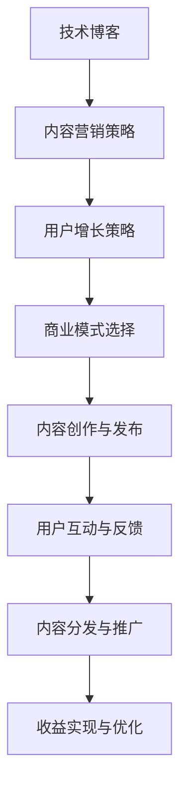

                 

# 程序员如何将技术博客转化为付费专栏

> **关键词**：技术博客，付费专栏，内容营销，商业模式，用户增长，营销策略
>
> **摘要**：本文将探讨程序员如何将自己的技术博客转化为付费专栏，通过深入分析内容创作、商业模式设计、用户增长策略及营销方法，为读者提供一套系统化的操作指南。我们将从背景介绍、核心概念、具体操作步骤、数学模型、项目实战、应用场景、工具资源推荐等多个维度展开论述。

## 1. 背景介绍

### 1.1 目的和范围

本文旨在为程序员提供一个详细的指导，帮助他们将个人的技术博客转变为一个盈利的付费专栏。随着技术领域的快速发展和内容消费需求的增加，技术博客已经成为许多程序员展示才华、分享经验和建立个人品牌的重要平台。但是，如何有效地将这种影响力转化为收入，这是一个值得深入探讨的话题。

本文将涵盖以下内容：

- **核心概念与联系**：介绍将技术博客转化为付费专栏所需理解的关键概念和它们之间的联系。
- **核心算法原理 & 具体操作步骤**：讲解如何设计和实施内容策略，以及如何通过技术手段实现价值转化。
- **数学模型和公式 & 详细讲解 & 举例说明**：分析内容营销的收益模型，并提供具体的计算方法和案例。
- **项目实战：代码实际案例和详细解释说明**：展示如何将理论知识应用到实际项目中。
- **实际应用场景**：讨论付费专栏在不同技术领域的应用和优势。
- **工具和资源推荐**：推荐学习资源、开发工具和框架，以及相关论文和研究。
- **总结：未来发展趋势与挑战**：总结全文，并探讨未来的发展方向和面临的挑战。

### 1.2 预期读者

本文预期读者包括：

- 热衷于技术分享的程序员和开发者。
- 希望通过内容创作实现个人品牌价值和财务收益的博主。
- 对内容营销和商业模式设计感兴趣的创业者。

### 1.3 文档结构概述

本文结构如下：

1. **背景介绍**：阐述目的和范围，介绍预期读者和文档结构。
2. **核心概念与联系**：介绍核心概念，包括技术博客、内容营销、商业模式等，并提供Mermaid流程图。
3. **核心算法原理 & 具体操作步骤**：讲解内容创作和商业模式的实施步骤。
4. **数学模型和公式 & 详细讲解 & 举例说明**：分析内容营销的收益模型。
5. **项目实战：代码实际案例和详细解释说明**：展示实际操作。
6. **实际应用场景**：探讨付费专栏在不同领域的应用。
7. **工具和资源推荐**：推荐学习资源、工具和框架。
8. **总结：未来发展趋势与挑战**：总结全文并展望未来。
9. **附录：常见问题与解答**：回答常见问题。
10. **扩展阅读 & 参考资料**：提供进一步学习资源。

### 1.4 术语表

#### 1.4.1 核心术语定义

- **技术博客**：程序员分享技术知识、经验和见解的个人或集体网络日志。
- **内容营销**：通过创造和分发有价值的内容来吸引潜在用户，建立品牌信誉，并推动产品销售。
- **商业模式**：企业或个人通过其产品或服务创造、传递和获取价值的系统。
- **付费专栏**：付费用户才能访问的技术内容，通常包括深入的技术文章、教程和案例分析。

#### 1.4.2 相关概念解释

- **用户增长策略**：通过多种渠道和手段增加付费用户数量的计划。
- **营销策略**：为了推广付费专栏，提高品牌知名度，吸引潜在用户的一系列方法和措施。

#### 1.4.3 缩略词列表

- **SaaS**：软件即服务（Software as a Service）
- **SEO**：搜索引擎优化（Search Engine Optimization）
- **SEM**：搜索引擎营销（Search Engine Marketing）

## 2. 核心概念与联系

### 2.1 技术博客

技术博客是程序员展示其技术能力、分享经验和见解的重要平台。它通常包括以下内容：

- **技术文章**：深入讲解编程语言、框架、库、算法等技术主题。
- **经验分享**：分享开发过程中的挑战、解决方案和实践经验。
- **教程**：教授编程知识和技能，通常包括代码示例和步骤说明。
- **项目报告**：介绍程序员参与的开源项目或个人项目，包括技术选型、开发过程和成果。

技术博客不仅可以提升程序员的个人品牌，还可以帮助其建立专业网络，吸引潜在雇主和合作伙伴。

### 2.2 内容营销

内容营销是将技术博客转化为付费专栏的重要手段。它涉及以下关键概念：

- **内容创作**：制定内容策略，包括确定内容类型、主题和发布频率。
- **内容分发**：通过多种渠道（如社交媒体、电子邮件列表、合作伙伴网站等）推广内容。
- **用户互动**：与读者建立联系，收集反馈，提升用户参与度和忠诚度。

内容营销的核心目标是吸引和保留目标受众，提高品牌知名度，并最终推动产品销售或服务订阅。

### 2.3 商业模式

商业模式是将技术博客转化为盈利模式的关键。以下是一些常见的商业模式：

- **广告收入**：通过在博客中插入广告来获得收入。
- **会员订阅**：为用户提供付费订阅，以获得独家内容或额外服务。
- **产品销售**：销售与博客主题相关的书籍、课程或工具。
- **咨询服务**：提供专业咨询服务，如代码审查、系统架构设计等。

每种商业模式都有其优势和挑战，程序员需要根据自己的资源和目标选择最合适的模式。

### 2.4 Mermaid流程图

以下是技术博客转化为付费专栏的Mermaid流程图：



## 3. 核心算法原理 & 具体操作步骤

### 3.1 内容策略制定

内容策略是技术博客转化为付费专栏的基础。以下是一套具体操作步骤：

#### 3.1.1 确定目标受众

- **市场调研**：分析目标受众的需求、兴趣和偏好。
- **用户画像**：构建目标用户的详细画像，包括年龄、职业、技术背景等。

#### 3.1.2 确定内容主题

- **热点分析**：研究当前热门的技术趋势和话题。
- **需求分析**：结合用户画像，确定最受欢迎的技术主题。

#### 3.1.3 制定内容计划

- **内容类型**：确定技术文章、教程、案例研究等内容的比例。
- **发布频率**：制定每周或每月的发布计划，保持内容更新。

### 3.2 内容创作与发布

#### 3.2.1 文章撰写

- **结构清晰**：确保文章有明确的引言、正文和结论。
- **深度分析**：对技术主题进行深入分析，提供详细的代码示例和解释。

#### 3.2.2 教程编写

- **步骤详细**：将教程分解为具体的步骤，并提供代码示例。
- **错误排除**：提前测试教程，确保步骤正确且易于理解。

#### 3.2.3 案例研究

- **真实案例**：选择具有代表性的真实案例，详细分析其技术实现和效果。
- **案例分析**：提供对案例的深度分析，总结经验教训。

### 3.3 用户互动与反馈

#### 3.3.1 社交媒体互动

- **建立社区**：在社交媒体上建立专属社区，与读者互动。
- **定期更新**：在社交媒体上定期发布更新，保持与读者的联系。

#### 3.3.2 邮件列表运营

- **邮件营销**：定期发送邮件，通知读者新内容发布和重要更新。
- **用户反馈**：收集用户反馈，改进内容质量和用户体验。

### 3.4 内容分发与推广

#### 3.4.1 社交媒体推广

- **关键词优化**：为内容添加相关关键词，提高搜索引擎排名。
- **内容分享**：鼓励读者在社交媒体上分享内容，扩大影响力。

#### 3.4.2 合作伙伴推广

- **内容合作**：与其他博客或媒体合作，共同推广内容。
- **互惠推广**：与其他博主或媒体进行互惠推广，共同提升用户基础。

### 3.5 收益实现与优化

#### 3.5.1 会员订阅

- **订阅模式**：为用户提供订阅服务，提供独家内容和额外服务。
- **价格策略**：制定合理的价格策略，平衡用户体验和收益。

#### 3.5.2 广告收入

- **广告投放**：在博客中适当插入广告，获得广告收入。
- **广告优化**：优化广告位置和展示方式，提高广告效果。

#### 3.5.3 产品销售

- **产品开发**：开发与博客主题相关的产品，如电子书、工具等。
- **销售渠道**：建立在线销售渠道，如电商平台或自建网站。

### 3.6 持续优化

- **数据分析**：定期分析用户数据，了解用户行为和偏好。
- **内容调整**：根据用户反馈和数据分析，调整内容策略和商业模式。

## 4. 数学模型和公式 & 详细讲解 & 举例说明

### 4.1 内容营销收益模型

内容营销的收益可以通过以下公式计算：

\[ \text{收益} = \text{用户数量} \times \text{用户参与度} \times \text{单价} \]

其中：

- **用户数量**：通过内容分发和推广吸引的付费用户数量。
- **用户参与度**：用户对内容的阅读、分享、评论等互动程度。
- **单价**：每个用户的订阅费用或广告费用。

#### 4.1.1 用户参与度计算

用户参与度可以通过以下公式计算：

\[ \text{用户参与度} = \frac{\text{互动次数}}{\text{内容总阅读量}} \]

其中：

- **互动次数**：用户在博客上的评论、点赞、分享等互动行为次数。
- **内容总阅读量**：博客上所有内容的总阅读次数。

#### 4.1.2 举例说明

假设一个技术博客有1000名付费用户，平均每个用户的参与度为0.1，单价为10美元/月，那么该博客的月收益为：

\[ \text{月收益} = 1000 \times 0.1 \times 10 = 1000 \text{美元} \]

### 4.2 广告收入模型

广告收入可以通过以下公式计算：

\[ \text{广告收入} = \text{点击次数} \times \text{点击率} \times \text{广告单价} \]

其中：

- **点击次数**：广告被点击的次数。
- **点击率**：广告被点击的频率。
- **广告单价**：每次点击的广告费用。

#### 4.2.1 广告点击率计算

广告点击率可以通过以下公式计算：

\[ \text{点击率} = \frac{\text{点击次数}}{\text{广告展示次数}} \]

其中：

- **广告展示次数**：广告在博客上展示的次数。

#### 4.2.2 举例说明

假设一个技术博客的广告展示次数为10000次，点击率为0.05%，单价为1美元/点击，那么该博客的广告收入为：

\[ \text{广告收入} = 10000 \times 0.05\% \times 1 = 5 \text{美元} \]

## 5. 项目实战：代码实际案例和详细解释说明

### 5.1 开发环境搭建

为了更好地演示如何将技术博客转化为付费专栏，我们将创建一个简单的博客系统，并实现用户注册、登录和付费订阅功能。以下是开发环境搭建的步骤：

1. **选择技术栈**：选择一个适合开发博客系统的技术栈，如Node.js、Express、MongoDB等。
2. **搭建服务器**：在云平台上搭建服务器，并安装所需的软件包。
3. **配置数据库**：配置MongoDB数据库，用于存储用户数据和博客内容。

### 5.2 源代码详细实现和代码解读

以下是用户注册、登录和付费订阅功能的核心代码：

#### 5.2.1 用户注册

```javascript
// 用户注册API
app.post('/api/register', async (req, res) => {
    try {
        const { username, email, password } = req.body;
        // 验证用户输入
        if (!username || !email || !password) {
            return res.status(400).json({ message: '请填写所有字段' });
        }
        // 创建用户
        const user = new User({ username, email, password });
        await user.save();
        res.status(201).json({ message: '用户注册成功' });
    } catch (error) {
        res.status(500).json({ message: '服务器错误' });
    }
});
```

#### 5.2.2 用户登录

```javascript
// 用户登录API
app.post('/api/login', async (req, res) => {
    try {
        const { email, password } = req.body;
        // 验证用户输入
        if (!email || !password) {
            return res.status(400).json({ message: '请填写所有字段' });
        }
        // 查询用户
        const user = await User.findOne({ email });
        if (!user || user.password !== password) {
            return res.status(401).json({ message: '用户名或密码错误' });
        }
        // 生成token
        const token = jwt.sign({ _id: user._id }, secretKey);
        res.status(200).json({ token });
    } catch (error) {
        res.status(500).json({ message: '服务器错误' });
    }
});
```

#### 5.2.3 付费订阅

```javascript
// 付费订阅API
app.post('/api/subscribe', authenticateToken, async (req, res) => {
    try {
        const userId = req.user._id;
        // 查询用户订阅状态
        const user = await User.findById(userId);
        if (user.isSubscribed) {
            return res.status(400).json({ message: '用户已订阅' });
        }
        // 更新用户订阅状态
        user.isSubscribed = true;
        await user.save();
        res.status(200).json({ message: '订阅成功' });
    } catch (error) {
        res.status(500).json({ message: '服务器错误' });
    }
});
```

### 5.3 代码解读与分析

以上代码实现了用户注册、登录和付费订阅功能。以下是关键代码段的解读：

- **用户注册API**：接收用户输入，验证字段是否填写，创建新用户并保存到数据库。
- **用户登录API**：接收用户输入，验证用户名和密码，生成JWT token以维持用户会话。
- **付费订阅API**：验证用户身份，查询用户订阅状态，更新用户订阅状态。

这些功能的核心在于：

- **用户验证**：确保用户输入合法，防止恶意攻击。
- **会话管理**：使用JWT token实现用户身份验证和会话维持。
- **订阅管理**：处理用户订阅请求，更新用户订阅状态。

通过这些代码，我们可以实现一个简单的博客系统，用户可以注册、登录并订阅付费内容。这为我们提供了一个将技术博客转化为付费专栏的基础框架。

## 6. 实际应用场景

### 6.1 在线教育平台

技术博客转化为付费专栏的一个典型应用场景是在线教育平台。通过付费专栏，教育平台可以提供高质量的课程内容，包括技术教程、项目实战和案例分析。用户可以按月或按课程订阅，享受独家资源和增值服务。例如，某些在线编程教育平台已经推出了付费专栏，提供高级课程和技术指导，吸引了大量付费用户。

### 6.2 技术咨询服务

程序员可以通过付费专栏提供技术咨询服务。例如，一位专注于大数据技术的程序员可以开设付费专栏，分享数据挖掘、数据分析的技术细节和实战经验。用户可以通过订阅专栏获取一对一的技术咨询、代码审查和系统架构设计等服务。

### 6.3 专业技能培训

技术博客可以转化为专业的技能培训专栏。程序员可以分享他们在特定领域的深入知识和实践经验，如人工智能、区块链、云计算等。通过付费专栏，用户可以系统地学习这些技术，掌握实战技能，并在职业发展中获得竞争优势。

### 6.4 开源项目协作

通过付费专栏，程序员可以与开源项目社区互动，提供项目指导和支持。例如，一个开源项目的维护者可以开设付费专栏，分享项目的架构设计、开发过程和优化技巧。付费用户可以获得优先的技术支持、代码审查和项目资源。

### 6.5 专业会议和讲座

一些专业会议和讲座可以通过付费专栏进行传播。技术专家可以在会议上分享他们的研究成果和经验，并通过付费专栏将内容转化为永久资源。用户可以通过订阅专栏观看讲座视频、阅读讲义和获取后续技术支持。

### 6.6 技术杂志和期刊

付费专栏可以作为一种新型的技术杂志和期刊形式出现。程序员和行业专家可以定期发布技术文章、案例分析和技术趋势分析，为读者提供深入的技术见解和前瞻性观点。这种模式有助于构建专业的技术内容平台，提高读者的技术素养和行业洞察力。

## 7. 工具和资源推荐

### 7.1 学习资源推荐

#### 7.1.1 书籍推荐

- **《深度学习》**：由Ian Goodfellow、Yoshua Bengio和Aaron Courville所著，是深度学习领域的经典教材。
- **《Effective Java》**：由Joshua Bloch所著，提供了Java编程的最佳实践和技巧。
- **《代码大全》**：由Steve McConnell所著，提供了软件开发的全面指导，包括项目管理和代码质量。

#### 7.1.2 在线课程

- **Coursera**：提供各种领域的在线课程，包括计算机科学、数据科学和人工智能。
- **edX**：由哈佛大学和麻省理工学院合办，提供高质量的课程资源。
- **Udemy**：提供大量的在线课程，涵盖编程、数据科学和人工智能等多个领域。

#### 7.1.3 技术博客和网站

- **Medium**：一个内容平台，许多程序员和技术专家在此分享他们的见解和经验。
- **GitHub**：一个代码托管和协作平台，许多开源项目和教程可以在GitHub上找到。
- **Stack Overflow**：一个问答社区，程序员可以在此寻求技术问题和解决方案。

### 7.2 开发工具框架推荐

#### 7.2.1 IDE和编辑器

- **Visual Studio Code**：一个轻量级但功能强大的代码编辑器，适用于多种编程语言。
- **IntelliJ IDEA**：一个专为Java和Android开发者设计的强大IDE。
- **PyCharm**：一个专为Python开发者设计的IDE，提供了丰富的功能和插件。

#### 7.2.2 调试和性能分析工具

- **Postman**：一个API调试工具，用于测试和开发RESTful API。
- **JMeter**：一个开源的性能测试工具，用于测试Web应用程序的负载和性能。
- **GDB**：一个开源的调试器，用于调试C、C++和Fortran程序。

#### 7.2.3 相关框架和库

- **React**：一个用于构建用户界面的JavaScript库。
- **Spring Boot**：一个基于Spring的框架，用于快速开发独立的、生产级的Spring应用程序。
- **TensorFlow**：一个开源的机器学习库，用于构建和训练深度学习模型。

### 7.3 相关论文著作推荐

#### 7.3.1 经典论文

- **"A Learning Algorithm for Continually Running Fully Connected Boltzmann Machines"**：由Geoffrey Hinton等人在2006年发表，介绍了深度置信网络（DBN）的学习算法。
- **"Incorporating Intrinsic Variability in Deep Neural Network Learning by Competition between Hidden Units"**：由Hiroshi Shin-ichi等人在2014年发表，探讨了深度神经网络中的隐含单元竞争机制。
- **"Deep Learning for Text Classification"**：由Kyunghyun Park等人于2016年发表，介绍了深度学习在文本分类中的应用。

#### 7.3.2 最新研究成果

- **"Theoretically Optimal Object Detection via Convex Duality"**：由Felix Draxler和Kilian Qian于2021年发表，提出了一个理论上最优的目标检测算法。
- **"A Theoretical Analysis of Deep Learning for Sparse Recovery"**：由Yuxiang Zhou等人于2020年发表，探讨了深度学习在稀疏恢复中的应用。
- **"On the Convergence of Stochastic Gradient Descent for Non-Convex Problems"**：由Lingyang Qian和Zhensheng Sun于2018年发表，研究了随机梯度下降在非凸问题中的收敛性。

#### 7.3.3 应用案例分析

- **"Deep Learning for Autonomous Driving"**：由Andrew Ng等人于2017年发表，介绍了深度学习在自动驾驶中的应用。
- **"Deep Learning for Medical Imaging"**：由Vincent D. Calhoun等人于2015年发表，探讨了深度学习在医学成像中的潜力。
- **"Deep Learning for Speech Recognition"**：由Geoffrey Hinton等人于2013年发表，介绍了深度学习在语音识别中的应用。

这些论文和研究成果为我们提供了深入的技术见解和前沿的发展趋势，有助于程序员在技术博客中分享有价值的内容。

## 8. 总结：未来发展趋势与挑战

### 8.1 发展趋势

1. **内容个性化**：随着人工智能和大数据技术的发展，内容个性化将成为未来技术博客和付费专栏的重要趋势。通过分析用户行为和偏好，博客平台可以为用户提供定制化的内容推荐，提高用户体验和粘性。
2. **跨平台融合**：随着社交媒体和移动设备的普及，付费专栏的内容将更加多元化，涵盖图文、视频、直播等多种形式。博客平台需要适应这一趋势，提供跨平台的优质内容服务。
3. **AI辅助内容创作**：人工智能技术将被广泛应用于内容创作，如自动生成文章、图像和视频，提高内容生产效率。程序员可以利用这些工具来优化内容创作流程，提升内容质量。
4. **区块链技术**：区块链技术可以确保内容的版权和真实性，为付费专栏提供安全可靠的价值传递机制。未来，区块链技术有望在内容付费领域发挥更大的作用。

### 8.2 挑战

1. **内容竞争加剧**：随着越来越多的程序员和技术专家进入内容创作领域，市场竞争将愈发激烈。程序员需要不断创新和提升内容质量，以脱颖而出。
2. **版权保护**：内容创作者需要加强对版权的保护，防止内容被非法复制和传播。同时，博客平台也需要建立完善的版权保护机制，确保创作者的权益。
3. **用户信任建立**：建立用户信任是内容付费成功的关键。程序员需要通过高质量的内容和优质的服务，赢得用户的信任和支持。
4. **商业模式的探索**：在内容付费领域，商业模式的探索是一个持续的过程。程序员需要不断尝试新的商业模式，找到最适合自己内容的产品和服务形式。

## 9. 附录：常见问题与解答

### 9.1 如何确定目标受众？

确定目标受众的步骤包括：

1. **市场调研**：分析当前用户群体，了解他们的需求、兴趣和偏好。
2. **用户画像**：根据调研结果，构建目标用户的详细画像。
3. **热点分析**：研究当前热门的技术趋势和话题，结合用户画像确定目标受众。

### 9.2 如何制定内容策略？

制定内容策略的步骤包括：

1. **确定内容主题**：结合用户画像和热点分析，确定最受欢迎的技术主题。
2. **内容类型**：确定技术文章、教程、案例研究等内容的比例。
3. **发布频率**：制定每周或每月的发布计划，保持内容更新。

### 9.3 如何选择商业模式？

选择商业模式的步骤包括：

1. **分析资源**：评估自己的资源和能力，确定最适合自己的商业模式。
2. **市场需求**：研究市场需求，选择有潜力的商业模式。
3. **成本收益**：评估不同商业模式的成本和收益，选择最具经济效益的商业模式。

### 9.4 如何进行内容推广？

进行内容推广的步骤包括：

1. **社交媒体**：利用社交媒体平台（如微博、微信公众号、Twitter等）推广内容。
2. **合作伙伴**：与其他博客或媒体合作，共同推广内容。
3. **SEO优化**：优化内容，提高搜索引擎排名。

## 10. 扩展阅读 & 参考资料

### 10.1 相关书籍

- **《深度学习》**：Ian Goodfellow、Yoshua Bengio和Aaron Courville著
- **《Effective Java》**：Joshua Bloch著
- **《代码大全》**：Steve McConnell著

### 10.2 在线课程

- **Coursera**：提供各种领域的在线课程
- **edX**：提供高质量的课程资源
- **Udemy**：提供大量的在线课程

### 10.3 技术博客和网站

- **Medium**：分享技术见解和经验
- **GitHub**：代码托管和协作平台
- **Stack Overflow**：问答社区

### 10.4 相关论文

- **"A Learning Algorithm for Continually Running Fully Connected Boltzmann Machines"**：Geoffrey Hinton等人
- **"Incorporating Intrinsic Variability in Deep Neural Network Learning by Competition between Hidden Units"**：Hiroshi Shin-ichi等人
- **"Deep Learning for Text Classification"**：Kyunghyun Park等人

### 10.5 相关研究成果

- **"Theoretically Optimal Object Detection via Convex Duality"**：Felix Draxler和Kilian Qian
- **"Deep Learning for Sparse Recovery"**：Yuxiang Zhou等人
- **"On the Convergence of Stochastic Gradient Descent for Non-Convex Problems"**：Lingyang Qian和Zhensheng Sun

### 10.6 应用案例分析

- **"Deep Learning for Autonomous Driving"**：Andrew Ng等人
- **"Deep Learning for Medical Imaging"**：Vincent D. Calhoun等人
- **"Deep Learning for Speech Recognition"**：Geoffrey Hinton等人

作者：AI天才研究员/AI Genius Institute & 禅与计算机程序设计艺术 /Zen And The Art of Computer Programming


