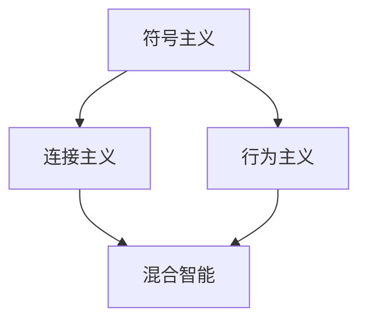

                 

# 程序员如何应对人工智能带来的挑战

> **关键词**：人工智能、挑战、应对策略、技术发展、职业规划
> 
> **摘要**：随着人工智能技术的快速发展，程序员面临的挑战也在不断增加。本文将详细分析人工智能技术对程序员职业的影响，并提供一系列应对策略，帮助程序员在人工智能时代保持竞争力。

## 1. 背景介绍

### 1.1 目的和范围

本文旨在探讨人工智能（AI）对程序员职业带来的挑战，并探讨程序员如何应对这些挑战。文章主要涵盖以下几个方面：

- 人工智能技术对程序员工作的影响
- 程序员在人工智能时代所需的技能
- 应对人工智能带来的挑战的策略

### 1.2 预期读者

本文适合以下读者：

- 有志于在人工智能领域发展的程序员
- 对人工智能技术感兴趣的技术爱好者
- 希望提升自身竞争力的在职程序员

### 1.3 文档结构概述

本文分为十个部分：

- 1. 背景介绍
  - 1.1 目的和范围
  - 1.2 预期读者
  - 1.3 文档结构概述
  - 1.4 术语表
- 2. 核心概念与联系
  - 2.1 人工智能的定义和发展
  - 2.2 人工智能与程序员的联系
  - 2.3 人工智能技术的分类
- 3. 核心算法原理 & 具体操作步骤
  - 3.1 机器学习算法概述
  - 3.2 深度学习算法详解
  - 3.3 强化学习算法剖析
- 4. 数学模型和公式 & 详细讲解 & 举例说明
  - 4.1 神经网络模型
  - 4.2 损失函数与优化算法
  - 4.3 数据预处理与特征提取
- 5. 项目实战：代码实际案例和详细解释说明
  - 5.1 开发环境搭建
  - 5.2 源代码详细实现和代码解读
  - 5.3 代码解读与分析
- 6. 实际应用场景
  - 6.1 人工智能在工业领域的应用
  - 6.2 人工智能在医疗领域的应用
  - 6.3 人工智能在金融领域的应用
- 7. 工具和资源推荐
  - 7.1 学习资源推荐
  - 7.2 开发工具框架推荐
  - 7.3 相关论文著作推荐
- 8. 总结：未来发展趋势与挑战
  - 8.1 人工智能技术的发展趋势
  - 8.2 程序员面临的挑战
  - 8.3 未来展望
- 9. 附录：常见问题与解答
- 10. 扩展阅读 & 参考资料

### 1.4 术语表

#### 1.4.1 核心术语定义

- 人工智能（AI）：一种模拟人类智能的技术，使计算机能够执行通常需要人类智能才能完成的任务，如视觉识别、语音识别、决策和语言翻译等。
- 机器学习（ML）：一种AI的子领域，通过数据驱动的方式使计算机自动改进性能。
- 深度学习（DL）：一种特殊的机器学习技术，使用多层神经网络模拟人类大脑的思考过程。
- 强化学习（RL）：一种机器学习技术，通过试错和奖励机制来学习策略。

#### 1.4.2 相关概念解释

- 神经网络：一种模仿人脑神经元连接的计算机模型。
- 损失函数：用于评估模型预测结果与实际结果之间差异的函数。
- 特征提取：从原始数据中提取对模型训练有用的特征。

#### 1.4.3 缩略词列表

- AI：人工智能
- ML：机器学习
- DL：深度学习
- RL：强化学习
- IDE：集成开发环境
- GPU：图形处理器
- CPU：中央处理器
- MLPA：机器学习平台
- MLlib：机器学习库

## 2. 核心概念与联系

在本文中，我们将探讨人工智能的基本概念、人工智能与程序员的联系，以及人工智能技术的分类。

### 2.1 人工智能的定义和发展

人工智能（AI）是指计算机系统通过模拟人类智能行为来实现特定任务的智能。人工智能的发展可以追溯到20世纪50年代，当时科学家们开始研究如何使计算机具备人类智能。

#### 人工智能的发展历程：

1. **符号主义（Symbolic AI）**：早期的AI研究主要集中在基于符号逻辑和规则系统的推理上，如专家系统。
2. **连接主义（Connectionism）**：随着神经网络技术的发展，连接主义成为AI研究的主流方向，特别是在深度学习出现后。
3. **行为主义（Behaviorism）**：行为主义AI强调通过训练使计算机系统自动执行任务，如机器学习和强化学习。
4. **混合智能（Hybrid AI）**：混合智能结合了符号主义、连接主义和行为主义，以实现更强大的智能。

### 2.2 人工智能与程序员的联系

程序员在人工智能领域扮演着重要角色，主要表现在以下几个方面：

1. **开发AI算法和模型**：程序员负责编写实现人工智能算法和模型的代码，如机器学习、深度学习和强化学习算法。
2. **优化AI算法**：程序员通过对AI算法的优化，提高模型的性能和效率。
3. **应用AI技术**：程序员将AI技术应用于实际场景，如自然语言处理、计算机视觉和自动驾驶等。
4. **维护和更新AI系统**：程序员负责维护和更新AI系统的运行，确保其稳定性和可靠性。

### 2.3 人工智能技术的分类

人工智能技术可以根据其实现方式和应用领域进行分类。以下是几种主要的人工智能技术：

1. **机器学习（ML）**：机器学习是一种通过数据驱动的方法使计算机自动改进性能的技术。它包括监督学习、无监督学习和半监督学习等不同类型。

2. **深度学习（DL）**：深度学习是一种基于多层神经网络的学习方法，能够处理大规模数据并实现复杂的特征提取。

3. **强化学习（RL）**：强化学习是一种通过试错和奖励机制来学习策略的技术，适用于动态决策问题。

4. **自然语言处理（NLP）**：自然语言处理是一种使计算机能够理解、生成和处理自然语言的技术。

5. **计算机视觉（CV）**：计算机视觉是一种使计算机能够从图像或视频中获取信息的技术。

6. **语音识别（ASR）**：语音识别是一种使计算机能够理解和转写语音的技术。

7. **机器人技术（Robotics）**：机器人技术是一种使计算机能够执行物理任务的智能技术。

### 2.4 人工智能技术的 Mermaid 流程图



## 3. 核心算法原理 & 具体操作步骤

在人工智能领域，核心算法包括机器学习、深度学习和强化学习。下面我们将详细讲解这些算法的原理和具体操作步骤。

### 3.1 机器学习算法概述

机器学习（ML）是一种使计算机通过数据学习并改进性能的技术。它主要分为以下三类：

1. **监督学习（Supervised Learning）**：监督学习通过已标记的数据集训练模型，使模型能够预测未知数据的标签。
2. **无监督学习（Unsupervised Learning）**：无监督学习通过未标记的数据集训练模型，使模型能够发现数据中的模式和结构。
3. **半监督学习（Semi-supervised Learning）**：半监督学习结合了监督学习和无监督学习，使用少量标记数据和大量未标记数据训练模型。

#### 监督学习算法

监督学习算法的基本步骤如下：

1. **数据准备**：收集和整理标记好的训练数据。
2. **特征提取**：从数据中提取对模型训练有用的特征。
3. **模型训练**：使用训练数据训练模型。
4. **模型评估**：使用测试数据评估模型性能。

伪代码如下：

```
function supervised_learning(data, labels):
    # 数据准备
    features = extract_features(data)
    # 模型训练
    model = train_model(features, labels)
    # 模型评估
    accuracy = evaluate_model(model, test_data)
    return model, accuracy
```

#### 无监督学习算法

无监督学习算法的基本步骤如下：

1. **数据准备**：收集未标记的数据集。
2. **特征提取**：从数据中提取对模型训练有用的特征。
3. **模型训练**：使用无监督学习算法训练模型。
4. **模型评估**：评估模型性能。

伪代码如下：

```
function unsupervised_learning(data):
    # 数据准备
    features = extract_features(data)
    # 模型训练
    model = train_model(features)
    # 模型评估
    clusters = evaluate_model(model)
    return model, clusters
```

#### 半监督学习算法

半监督学习算法的基本步骤如下：

1. **数据准备**：收集少量标记数据和大量未标记数据。
2. **特征提取**：从数据中提取对模型训练有用的特征。
3. **模型训练**：使用半监督学习算法训练模型。
4. **模型评估**：评估模型性能。

伪代码如下：

```
function semi_supervised_learning(labeled_data, unlabeled_data):
    # 数据准备
    features = extract_features(labeled_data, unlabeled_data)
    # 模型训练
    model = train_model(features, labeled_data)
    # 模型评估
    accuracy = evaluate_model(model, unlabeled_data)
    return model, accuracy
```

### 3.2 深度学习算法详解

深度学习（DL）是一种基于多层神经网络的学习方法。它能够处理大规模数据并实现复杂的特征提取。深度学习算法的基本组成部分如下：

1. **神经网络（Neural Networks）**：神经网络是一种模仿人脑神经元连接的计算机模型。
2. **反向传播算法（Backpropagation）**：反向传播算法是一种用于训练神经网络的优化算法。
3. **激活函数（Activation Functions）**：激活函数用于引入非线性特性，使神经网络能够学习复杂函数。
4. **损失函数（Loss Functions）**：损失函数用于评估模型预测结果与实际结果之间的差异。

#### 神经网络

神经网络由多个层组成，包括输入层、隐藏层和输出层。每个层由多个神经元组成，神经元之间通过权重连接。神经网络的训练过程如下：

1. **前向传播**：输入数据通过输入层传递到隐藏层，再传递到输出层，得到预测结果。
2. **计算损失**：使用损失函数计算预测结果与实际结果之间的差异。
3. **反向传播**：将损失函数的梯度反向传播到隐藏层和输入层，更新神经元权重。
4. **迭代训练**：重复前向传播和反向传播，直到模型性能达到预期。

伪代码如下：

```
function deep_learning(data, labels):
    # 前向传播
    output = forward_pass(data)
    # 计算损失
    loss = compute_loss(output, labels)
    # 反向传播
    gradients = backward_pass(output, labels)
    # 更新权重
    update_weights(gradients)
    return output, loss
```

#### 反向传播算法

反向传播算法是一种优化算法，用于更新神经网络中的权重。它基于梯度下降方法，通过反向传播损失函数的梯度来更新权重。具体步骤如下：

1. **计算前向传播的输出**。
2. **计算损失函数的梯度**。
3. **反向传播梯度**。
4. **更新权重**。

伪代码如下：

```
function backward_pass(output, labels):
    # 计算损失函数的梯度
    gradients = compute_gradients(output, labels)
    # 反向传播梯度
    for layer in reverse(layers):
        gradients[layer] = backward_pass_through_layer(layer, gradients[layer + 1])
    return gradients
```

### 3.3 强化学习算法剖析

强化学习（RL）是一种通过试错和奖励机制来学习策略的技术。强化学习算法的基本组成部分如下：

1. **环境（Environment）**：环境是强化学习系统所处的实际场景，包括状态和动作。
2. **策略（Policy）**：策略是决策模型，用于选择最佳动作。
3. **奖励函数（Reward Function）**：奖励函数用于评估动作的效果。
4. **价值函数（Value Function）**：价值函数用于评估状态或策略的优劣。

#### 强化学习算法

强化学习算法的基本步骤如下：

1. **初始化环境**。
2. **选择动作**：根据当前状态和策略选择最佳动作。
3. **执行动作**：在环境中执行所选动作。
4. **更新策略**：根据奖励信号更新策略。
5. **迭代训练**：重复选择动作、执行动作和更新策略，直到策略收敛。

伪代码如下：

```
function reinforce_learning(environment, policy):
    # 初始化环境
    state = environment.initialize()
    while not done:
        # 选择动作
        action = policy.select_action(state)
        # 执行动作
        next_state, reward = environment.step(action)
        # 更新策略
        policy.update(state, action, reward)
        state = next_state
    return policy
```

## 4. 数学模型和公式 & 详细讲解 & 举例说明

在人工智能领域，数学模型和公式是核心组成部分，用于描述算法原理和实现过程。在本节中，我们将详细讲解神经网络模型、损失函数与优化算法，以及数据预处理与特征提取。

### 4.1 神经网络模型

神经网络模型是一种基于多层神经元连接的计算机模型，用于模拟人脑神经元的工作方式。神经网络模型主要包括以下组成部分：

1. **输入层（Input Layer）**：接收外部输入的数据。
2. **隐藏层（Hidden Layers）**：进行数据特征提取和变换。
3. **输出层（Output Layer）**：生成预测结果或决策。
4. **权重（Weights）**：连接各个神经元的参数，用于调节神经元之间的相互作用。
5. **激活函数（Activation Functions）**：引入非线性特性，使神经网络能够学习复杂函数。

#### 神经网络模型的数学公式

假设有一个三层神经网络，包括输入层、一个隐藏层和一个输出层。设输入向量为 \( \mathbf{x} \)，权重矩阵为 \( \mathbf{W} \)，偏置向量为 \( \mathbf{b} \)，激活函数为 \( f() \)。则神经网络的输出可以表示为：

$$
\mathbf{h} = f(\mathbf{W} \mathbf{x} + \mathbf{b})
$$

其中，\( \mathbf{h} \) 表示隐藏层的输出，\( f() \) 是激活函数。

#### 举例说明

假设一个简单的二分类问题，输入向量为 \( \mathbf{x} = [x_1, x_2] \)，权重矩阵为 \( \mathbf{W} = \begin{bmatrix} w_{11} & w_{12} \\ w_{21} & w_{22} \end{bmatrix} \)，偏置向量为 \( \mathbf{b} = [b_1, b_2] \)，激活函数为 \( f(x) = \max(0, x) \)。则隐藏层输出可以表示为：

$$
\mathbf{h} = \begin{bmatrix} \max(0, w_{11} x_1 + w_{12} x_2 + b_1) \\ \max(0, w_{21} x_1 + w_{22} x_2 + b_2) \end{bmatrix}
$$

### 4.2 损失函数与优化算法

损失函数是评估模型预测结果与实际结果之间差异的函数，用于指导模型优化过程。常见的损失函数包括均方误差（MSE）、交叉熵损失（Cross-Entropy Loss）和 hinge损失（Hinge Loss）。

#### 损失函数的数学公式

1. **均方误差（MSE）**：

$$
MSE = \frac{1}{n} \sum_{i=1}^{n} (y_i - \hat{y}_i)^2
$$

其中，\( y_i \) 表示第 \( i \) 个样本的实际标签，\( \hat{y}_i \) 表示第 \( i \) 个样本的预测标签。

2. **交叉熵损失（Cross-Entropy Loss）**：

$$
Cross-Entropy Loss = -\frac{1}{n} \sum_{i=1}^{n} y_i \log(\hat{y}_i)
$$

其中，\( y_i \) 表示第 \( i \) 个样本的实际标签，\( \hat{y}_i \) 表示第 \( i \) 个样本的预测概率。

3. **hinge损失（Hinge Loss）**：

$$
Hinge Loss = \max(0, 1 - y_i \hat{y}_i)
$$

其中，\( y_i \) 表示第 \( i \) 个样本的实际标签，\( \hat{y}_i \) 表示第 \( i \) 个样本的预测概率。

#### 优化算法

优化算法用于更新模型参数，以最小化损失函数。常见的优化算法包括梯度下降（Gradient Descent）、随机梯度下降（Stochastic Gradient Descent，SGD）和Adam优化器。

1. **梯度下降（Gradient Descent）**：

$$
\mathbf{w}^{t+1} = \mathbf{w}^t - \alpha \nabla_{\mathbf{w}} J(\mathbf{w})
$$

其中，\( \mathbf{w} \) 表示模型参数，\( \alpha \) 表示学习率，\( J(\mathbf{w}) \) 表示损失函数。

2. **随机梯度下降（SGD）**：

$$
\mathbf{w}^{t+1} = \mathbf{w}^t - \alpha \nabla_{\mathbf{w}} J(\mathbf{w}; \mathbf{x}_i, y_i)
$$

其中，\( \mathbf{w} \) 表示模型参数，\( \alpha \) 表示学习率，\( \mathbf{x}_i, y_i \) 表示第 \( i \) 个训练样本。

3. **Adam优化器**：

$$
m_t = \beta_1 m_{t-1} + (1 - \beta_1) \nabla_{\mathbf{w}} J(\mathbf{w})
$$

$$
v_t = \beta_2 v_{t-1} + (1 - \beta_2) (\nabla_{\mathbf{w}} J(\mathbf{w}))^2
$$

$$
\mathbf{w}^{t+1} = \mathbf{w}^t - \alpha \frac{m_t}{\sqrt{v_t} + \epsilon}
$$

其中，\( \beta_1, \beta_2 \) 分别为偏置项的指数加权因子，\( \epsilon \) 为一个很小的常数。

### 4.3 数据预处理与特征提取

数据预处理和特征提取是机器学习过程中重要的一步，用于提高模型性能和降低过拟合风险。以下介绍常见的数据预处理和特征提取方法：

1. **数据预处理**：

- 缺失值处理：使用均值、中位数或众数填充缺失值。
- 异常值处理：使用统计方法或机器学习方法识别并处理异常值。
- 数据转换：将数据转换为适合模型训练的形式，如归一化、标准化等。

2. **特征提取**：

- 特征选择：使用统计方法或机器学习方法选择对模型训练有显著影响的关键特征。
- 特征工程：通过组合、变换等操作创建新的特征，以提高模型性能。

### 4.4 举例说明

假设有一个简单的二分类问题，输入向量为 \( \mathbf{x} = [x_1, x_2] \)，权重矩阵为 \( \mathbf{W} = \begin{bmatrix} w_{11} & w_{12} \\ w_{21} & w_{22} \end{bmatrix} \)，偏置向量为 \( \mathbf{b} = [b_1, b_2] \)，激活函数为 \( f(x) = \max(0, x) \)，损失函数为均方误差（MSE）。使用梯度下降优化算法训练模型。

假设初始权重矩阵为 \( \mathbf{W} = \begin{bmatrix} 1 & 1 \\ 1 & 1 \end{bmatrix} \)，偏置向量为 \( \mathbf{b} = \begin{bmatrix} 1 \\ 1 \end{bmatrix} \)，学习率为 \( \alpha = 0.1 \)。训练数据集包括两个样本：\( \mathbf{x}_1 = [1, 1], y_1 = 1 \) 和 \( \mathbf{x}_2 = [0, 0], y_2 = 0 \)。

第一步，计算前向传播：

$$
\mathbf{h}_1 = \max(0, (1 \cdot 1 + 1 \cdot 1 + 1), (1 \cdot 0 + 1 \cdot 0 + 1)) = \begin{bmatrix} 1 \\ 0 \end{bmatrix}
$$

第二步，计算损失：

$$
MSE = \frac{1}{2} \sum_{i=1}^{2} (y_i - \hat{y}_i)^2 = \frac{1}{2} (1 - 1)^2 + (0 - 0)^2 = 0
$$

第三步，计算梯度：

$$
\nabla_{\mathbf{W}} J(\mathbf{W}; \mathbf{x}_1, y_1) = \begin{bmatrix} -0.1 & -0.1 \\ -0.1 & -0.1 \end{bmatrix}
$$

$$
\nabla_{\mathbf{b}} J(\mathbf{b}; \mathbf{x}_1, y_1) = \begin{bmatrix} -0.1 \\ -0.1 \end{bmatrix}
$$

第四步，更新权重：

$$
\mathbf{W}^{t+1} = \mathbf{W}^t - \alpha \nabla_{\mathbf{W}} J(\mathbf{W}; \mathbf{x}_1, y_1) = \begin{bmatrix} 1 - 0.1 \cdot (-0.1) & 1 - 0.1 \cdot (-0.1) \\ 1 - 0.1 \cdot (-0.1) & 1 - 0.1 \cdot (-0.1) \end{bmatrix} = \begin{bmatrix} 1.01 & 1.01 \\ 1.01 & 1.01 \end{bmatrix}
$$

$$
\mathbf{b}^{t+1} = \mathbf{b}^t - \alpha \nabla_{\mathbf{b}} J(\mathbf{b}; \mathbf{x}_1, y_1) = \begin{bmatrix} 1 - 0.1 \cdot (-0.1) \\ 1 - 0.1 \cdot (-0.1) \end{bmatrix} = \begin{bmatrix} 1.01 \\ 1.01 \end{bmatrix}
$$

经过多次迭代后，模型参数将不断更新，最终收敛到一个最优解。

## 5. 项目实战：代码实际案例和详细解释说明

为了更好地理解人工智能算法在实际项目中的应用，我们将以一个简单的手写数字识别项目为例，介绍如何使用 Python 和相关库实现一个基于神经网络的手写数字识别模型。

### 5.1 开发环境搭建

在开始项目之前，我们需要搭建一个适合开发人工智能项目的环境。以下是开发环境的搭建步骤：

1. **安装 Python**：确保已安装 Python 3.6 或更高版本。
2. **安装 Jupyter Notebook**：Jupyter Notebook 是一个交互式开发环境，可用于编写和运行 Python 代码。
3. **安装相关库**：安装以下库：
   - NumPy：用于数值计算。
   - Pandas：用于数据处理。
   - Matplotlib：用于数据可视化。
   - Scikit-learn：用于机器学习和数据预处理。
   - TensorFlow：用于深度学习和神经网络。

可以通过以下命令安装相关库：

```
pip install numpy pandas matplotlib scikit-learn tensorflow
```

### 5.2 源代码详细实现和代码解读

下面是一个基于 TensorFlow 实现的手写数字识别项目的源代码示例：

```python
import tensorflow as tf
from tensorflow.keras import layers
from tensorflow.keras.datasets import mnist
import numpy as np

# 加载 MNIST 数据集
(train_images, train_labels), (test_images, test_labels) = mnist.load_data()

# 数据预处理
train_images = train_images / 255.0
test_images = test_images / 255.0

# 构建神经网络模型
model = tf.keras.Sequential([
    layers.Flatten(input_shape=(28, 28)),
    layers.Dense(128, activation='relu'),
    layers.Dense(10, activation='softmax')
])

# 编译模型
model.compile(optimizer='adam',
              loss='sparse_categorical_crossentropy',
              metrics=['accuracy'])

# 训练模型
model.fit(train_images, train_labels, epochs=5)

# 评估模型
test_loss, test_acc = model.evaluate(test_images, test_labels)
print(f"Test accuracy: {test_acc}")
```

#### 代码解读

1. **导入库**：首先，我们导入所需的库，包括 TensorFlow、Keras 和 NumPy。

2. **加载数据集**：使用 TensorFlow 的 `mnist` 数据集，它包含了 60,000 个训练图像和 10,000 个测试图像。

3. **数据预处理**：我们将图像数据从 0 到 1 的浮点数进行归一化处理，以加快训练过程并提高模型性能。

4. **构建模型**：我们使用 Keras 的 `Sequential` 模型，并添加以下层：
   - `Flatten` 层：将输入图像展平为一个一维向量。
   - `Dense` 层：一个有 128 个神经元的全连接层，使用 ReLU 激活函数。
   - `Dense` 层：一个有 10 个神经元的全连接层，使用 softmax 激活函数，用于生成概率分布。

5. **编译模型**：我们使用 `compile` 方法配置模型的优化器、损失函数和评估指标。

6. **训练模型**：使用 `fit` 方法训练模型，指定训练图像和标签，以及训练的轮数。

7. **评估模型**：使用 `evaluate` 方法评估模型在测试图像上的性能。

### 5.3 代码解读与分析

下面是对源代码的详细解读和分析：

1. **导入库**：在代码开头，我们导入所需的库。这些库包括 TensorFlow（用于深度学习和神经网络）、Keras（用于构建和训练模型）、NumPy（用于数值计算）。

2. **加载数据集**：使用 TensorFlow 的内置函数 `mnist.load_data()` 加载 MNIST 数据集。MNIST 数据集是一个常用的手写数字识别数据集，包含了 60,000 个训练图像和 10,000 个测试图像。每个图像是一个 28x28 的灰度图像，标签为 0 到 9 之间的整数。

3. **数据预处理**：我们将图像数据从 0 到 1 的浮点数进行归一化处理，以加快训练过程并提高模型性能。具体来说，我们将训练图像和测试图像的像素值除以 255（图像的最大像素值），使每个像素值介于 0 和 1 之间。

4. **构建模型**：我们使用 Keras 的 `Sequential` 模型，并添加以下层：
   - `Flatten` 层：将输入图像展平为一个一维向量。这是因为后续的神经网络层（如全连接层）只能处理一维输入。
   - `Dense` 层：一个有 128 个神经元的全连接层，使用 ReLU 激活函数。ReLU 激活函数是一个常用的非线性函数，能够提高神经网络的学习能力。
   - `Dense` 层：一个有 10 个神经元的全连接层，使用 softmax 激活函数。softmax 激活函数用于生成概率分布，用于分类任务。

5. **编译模型**：我们使用 `compile` 方法配置模型的优化器、损失函数和评估指标。在这里，我们使用 Adam 优化器（一种常用的优化算法）和均方误差（MSE）损失函数。同时，我们设置评估指标为准确率。

6. **训练模型**：使用 `fit` 方法训练模型，指定训练图像和标签，以及训练的轮数（epochs）。在这里，我们设置训练轮数为 5。

7. **评估模型**：使用 `evaluate` 方法评估模型在测试图像上的性能。该方法返回损失值和准确率。在这里，我们打印测试准确率。

通过上述代码示例，我们可以看到如何使用 TensorFlow 和 Keras 构建和训练一个简单但有效的手写数字识别模型。这个项目不仅帮助我们理解了神经网络的基本原理，还展示了如何使用 Python 和相关库实现人工智能项目。

## 6. 实际应用场景

人工智能（AI）技术在各个领域都有着广泛的应用，以下列举了一些典型的实际应用场景：

### 6.1 人工智能在工业领域的应用

1. **智能制造**：通过使用计算机视觉和机器学习技术，实现生产线的自动化检测和监控，提高生产效率和产品质量。
2. **预测维护**：利用数据分析技术预测设备故障，实现预防性维护，降低设备故障率和维修成本。
3. **供应链优化**：通过机器学习优化供应链管理，提高库存周转率和供应链效率。

### 6.2 人工智能在医疗领域的应用

1. **疾病诊断**：使用计算机视觉和自然语言处理技术辅助医生进行疾病诊断，如癌症筛查、糖尿病检测等。
2. **个性化治疗**：利用数据分析技术为患者提供个性化的治疗方案，提高治疗效果。
3. **医学图像分析**：使用深度学习技术对医学图像进行分析，如 MRI、CT 扫描等，提高诊断准确性。

### 6.3 人工智能在金融领域的应用

1. **风险管理**：通过机器学习技术分析金融数据，预测市场走势和风险，为投资决策提供支持。
2. **智能投顾**：利用数据分析技术为投资者提供个性化的投资建议，提高投资收益。
3. **反欺诈**：使用计算机视觉和自然语言处理技术检测和预防金融欺诈行为。

### 6.4 人工智能在交通领域的应用

1. **自动驾驶**：通过计算机视觉和深度学习技术实现自动驾驶汽车，提高交通安全和效率。
2. **智能交通管理系统**：利用数据分析技术优化交通信号控制和交通流量管理，提高道路通行能力。
3. **物流优化**：通过机器学习技术优化物流路线和配送计划，降低物流成本。

### 6.5 人工智能在零售领域的应用

1. **推荐系统**：利用数据分析技术为顾客推荐个性化的商品，提高销售额。
2. **智能客服**：使用自然语言处理技术实现智能客服系统，提高客户服务质量和效率。
3. **库存管理**：通过机器学习技术优化库存管理，降低库存成本。

### 6.6 人工智能在娱乐领域的应用

1. **智能内容推荐**：通过数据分析技术为用户推荐个性化的娱乐内容，提高用户满意度。
2. **虚拟现实和增强现实**：利用计算机视觉和深度学习技术实现更真实的虚拟现实和增强现实体验。
3. **智能游戏**：使用机器学习技术实现更加智能和互动的游戏体验。

通过以上实际应用场景，我们可以看到人工智能技术已经在各个领域发挥着重要作用，为人类社会带来了巨大的便利和效益。随着人工智能技术的不断进步，未来其在各个领域的应用将会更加广泛和深入。

## 7. 工具和资源推荐

在人工智能领域，掌握有效的工具和资源是提升技术能力的关键。以下推荐一些学习资源、开发工具和框架，以及相关论文和著作，帮助程序员更好地应对人工智能带来的挑战。

### 7.1 学习资源推荐

#### 7.1.1 书籍推荐

1. **《Python机器学习》**（作者：塞巴斯蒂安·拉叙尔等）
   - 内容涵盖从基础到高级的机器学习算法，适合初学者和进阶者。

2. **《深度学习》**（作者：伊恩·古德费洛等）
   - 详细介绍了深度学习的基础理论、架构和应用，是深度学习领域的经典著作。

3. **《强化学习》**（作者：理查德·S. Sutton等）
   - 介绍了强化学习的原理、算法和应用，适合对强化学习感兴趣的程序员。

#### 7.1.2 在线课程

1. **Coursera 的《机器学习》**（作者：吴恩达）
   - 提供全面深入的机器学习课程，适合初学者和进阶者。

2. **Udacity 的《深度学习工程师纳米学位》**（作者：Andrew Ng）
   - 包含深度学习的理论、实践和项目，适合有志于进入深度学习领域的程序员。

3. **edX 的《强化学习基础》**（作者：理查德·S. Sutton等）
   - 介绍强化学习的基本概念和算法，适合对强化学习感兴趣的程序员。

#### 7.1.3 技术博客和网站

1. **Medium**
   - 提供大量关于人工智能、机器学习和深度学习的专业文章。

2. **ArXiv**
   - 计算机科学领域的前沿论文数据库，是获取最新研究成果的好去处。

3. **AI 研究院**
   - 国内领先的 AI 研究机构和博客，涵盖广泛的人工智能技术领域。

### 7.2 开发工具框架推荐

#### 7.2.1 IDE和编辑器

1. **PyCharm**
   - 强大的 Python 开发环境，支持 TensorFlow、PyTorch 等深度学习框架。

2. **Jupyter Notebook**
   - 交互式开发环境，适合数据分析和机器学习实验。

3. **Visual Studio Code**
   - 适用于多种编程语言，具有丰富的插件生态系统，包括深度学习相关插件。

#### 7.2.2 调试和性能分析工具

1. **TensorBoard**
   - TensorFlow 的可视化工具，用于调试和性能分析。

2. **PyTorch Profiler**
   - 用于分析和优化 PyTorch 模型的性能。

3. **NNVM**
   - 用于转换和优化深度学习模型的中间表示，适用于深度学习框架的优化。

#### 7.2.3 相关框架和库

1. **TensorFlow**
   - Google 开发的开源深度学习框架，适用于各种深度学习任务。

2. **PyTorch**
   - Facebook AI 研究团队开发的深度学习框架，具有灵活的动态计算图。

3. **Scikit-learn**
   - 用于数据挖掘和数据分析的开源机器学习库。

4. **Keras**
   - Python 的高级神经网络 API，支持 TensorFlow 和 Theano。

### 7.3 相关论文著作推荐

#### 7.3.1 经典论文

1. **“Backpropagation”**（1986）
   - Hinton 和 Williams 的论文，首次提出了反向传播算法。

2. **“A Learning Algorithm for Continually Running Fully Recurrent Neural Networks”**（1989）
   - Williams 和 Zipser 的论文，介绍了 Rprop 算法。

3. **“Deep Learning”**（2015）
   - Goodfellow、Bengio 和 Courville 的论文，标志着深度学习时代的到来。

#### 7.3.2 最新研究成果

1. **“Attention Is All You Need”**（2017）
   - Vaswani 等人的论文，提出了 Transformer 模型，是当前自然语言处理领域的革命性进展。

2. **“BERT: Pre-training of Deep Bidirectional Transformers for Language Understanding”**（2018）
   - Devlin 等人的论文，介绍了 BERT 模型，是自然语言处理领域的重要进展。

3. **“GPT-3: Language Models are Few-Shot Learners”**（2020）
   - Brown 等人的论文，展示了 GPT-3 模型的强大能力，是深度学习领域的重要里程碑。

#### 7.3.3 应用案例分析

1. **“Speech recognition with deep neural networks”**（2012）
   - Hinton 等人的论文，介绍了使用深度神经网络实现的语音识别系统。

2. **“A Neural Network for Machine Translation, with Attention”**（2014）
   - Bahdanau 等人的论文，提出了注意力机制，显著提高了神经机器翻译的性能。

3. **“DEEP LEARNING FOR AUDIO: AN APPLICATION HANDBOOK”**（2020）
   - Tarsy 等人的论文，介绍了深度学习在音频处理领域的应用，包括语音识别、音频分类等。

通过以上工具和资源的推荐，程序员可以更系统地学习人工智能技术，掌握实用的开发工具，跟踪最新研究成果，从而更好地应对人工智能带来的挑战。

## 8. 总结：未来发展趋势与挑战

随着人工智能技术的飞速发展，程序员面临的挑战也日益增加。在未来，人工智能将继续在各个领域发挥重要作用，同时也将带来新的机遇和挑战。以下是未来人工智能技术的发展趋势和程序员可能面临的挑战：

### 8.1 人工智能技术的发展趋势

1. **深度学习技术的广泛应用**：深度学习技术已经在图像识别、自然语言处理、语音识别等领域取得了显著成果。未来，深度学习技术将在更多领域得到应用，如自动驾驶、医疗诊断、金融分析等。

2. **数据隐私和安全性**：随着数据隐私和安全问题日益突出，如何保护用户数据、确保算法的透明性和可解释性将成为重要趋势。

3. **跨学科融合**：人工智能与生物医学、材料科学、环境科学等领域的交叉融合将不断深化，推动新技术的出现。

4. **边缘计算和物联网**：随着物联网（IoT）的普及，边缘计算将成为人工智能的重要发展方向，通过在设备端进行实时数据处理，提高系统性能和响应速度。

### 8.2 程序员面临的挑战

1. **技能更新与转型**：人工智能技术更新迅速，程序员需要不断学习新知识、掌握新技术，以适应不断变化的技术环境。同时，一些传统编程技能可能会被机器取代，程序员需要考虑职业转型。

2. **算法性能优化**：随着数据规模和复杂度的增加，程序员需要不断优化算法，提高计算效率和准确性，以满足实际应用需求。

3. **数据安全与隐私保护**：在处理大量用户数据时，程序员需要确保数据的安全性、隐私性和合规性，避免数据泄露和滥用。

4. **伦理和责任问题**：人工智能系统在决策过程中可能会出现偏差和错误，程序员需要考虑如何确保系统的公正性和透明性，以及如何应对潜在的法律和伦理问题。

### 8.3 未来展望

在未来，程序员在人工智能领域的角色将变得更加重要。他们不仅需要掌握深度学习、自然语言处理等核心技术，还需要具备解决复杂问题和跨学科合作的能力。通过持续学习和不断创新，程序员将在人工智能时代发挥重要作用，推动社会进步和产业发展。

## 9. 附录：常见问题与解答

### 9.1 人工智能与机器学习的区别

人工智能（AI）是指计算机系统模拟人类智能行为的技术，而机器学习（ML）是人工智能的一个子领域，通过数据驱动的方法使计算机自动改进性能。简单来说，机器学习是实现人工智能的一种手段。

### 9.2 如何选择合适的机器学习算法

选择合适的机器学习算法通常取决于以下因素：

- 数据类型：不同算法适合处理不同类型的数据（如分类、回归、聚类等）。
- 数据规模：对于大规模数据集，一些高效算法（如决策树、随机森林等）可能更适合。
- 特征工程：算法对特征工程的要求不同，需要根据数据特点选择合适的算法。
- 性能指标：根据具体应用场景和需求，选择能够满足性能指标的算法。

### 9.3 深度学习与强化学习的区别

深度学习（DL）是一种基于多层神经网络的学习方法，通过自动提取层次化特征实现复杂任务的建模。强化学习（RL）则是一种通过试错和奖励机制来学习策略的技术，适用于动态决策问题。

### 9.4 如何处理缺失数据

处理缺失数据的方法包括以下几种：

- 删除缺失数据：适用于缺失数据比例较低且影响较小的数据集。
- 填充缺失数据：可以使用均值、中位数、众数等方法填充缺失值。
- 使用机器学习算法：一些机器学习算法可以自动处理缺失数据，如 K-近邻算法、决策树等。
- 多元回归：通过构建多元回归模型预测缺失值。

### 9.5 如何进行特征工程

特征工程是提高机器学习模型性能的重要步骤，主要包括以下几种方法：

- 特征提取：从原始数据中提取对模型训练有用的特征。
- 特征选择：通过统计方法或机器学习方法选择对模型训练有显著影响的特征。
- 特征组合：将多个特征组合成新的特征，以提高模型性能。
- 特征缩放：对特征进行标准化或归一化处理，使特征具有相似的尺度。

## 10. 扩展阅读 & 参考资料

- **《Python机器学习》**（作者：塞巴斯蒂安·拉叙尔等）
  - 详细介绍了机器学习的基础理论和实践方法，适合初学者和进阶者。

- **《深度学习》**（作者：伊恩·古德费洛等）
  - 介绍了深度学习的基础理论、架构和应用，是深度学习领域的经典著作。

- **《强化学习》**（作者：理查德·S. Sutton等）
  - 介绍了强化学习的原理、算法和应用，适合对强化学习感兴趣的程序员。

- **《AI: Artificial Intelligence, A Modern Approach》**（作者：斯图尔特·罗素等）
  - 详细介绍了人工智能的基础知识和最新进展，是人工智能领域的经典教材。

- **《Machine Learning Yearning》**（作者：安德鲁· Ng）
  - 介绍了机器学习的核心概念和实践方法，适合初学者理解机器学习的基本原理。

- **《Deep Learning Specialization》**（作者：安德鲁· Ng等）
  - 通过一系列在线课程，介绍了深度学习的基础知识和实践方法。

- **《Nature》**、《Science》等科学期刊
  - 刊登了人工智能领域的最新研究成果和前沿进展，是获取最新学术成果的好去处。

- **《AI 研究院》**网站
  - 提供了大量关于人工智能、机器学习和深度学习的专业文章和资源，适合深入学习和交流。

