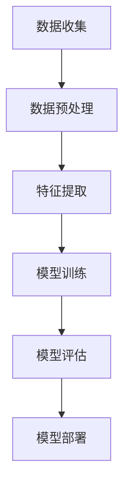
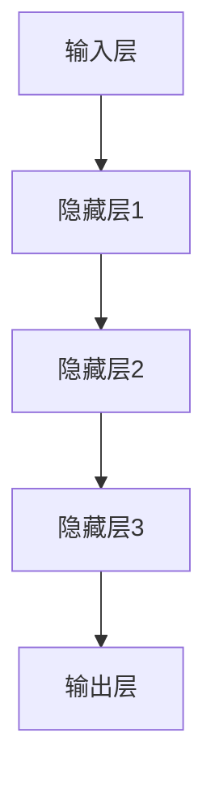

                 

# 程序员如何应对人工智能带来的挑战

> **关键词：** 人工智能、程序员、职业发展、技术变革、技能更新、持续学习
>
> **摘要：** 随着人工智能技术的迅猛发展，程序员面临着前所未有的挑战和机遇。本文将探讨程序员如何应对人工智能带来的变化，包括提升自身技能、适应新兴技术、以及把握职业发展的新趋势。

## 1. 背景介绍

### 1.1 目的和范围

本文旨在帮助程序员理解人工智能对软件开发和编程领域的影响，并提供实用的建议和策略，以帮助他们更好地应对这些变化。我们将讨论以下主题：

- 人工智能技术的基本概念及其对程序员职业的影响。
- 程序员需要掌握的新技能和知识领域。
- 应对技术变革的方法和策略。
- 职业发展的新趋势和机会。

### 1.2 预期读者

本文适合以下读者：

- 拥有一定编程基础的程序员。
- 对人工智能技术感兴趣的软件开发者。
- 希望了解技术变革对编程职业影响的行业人士。

### 1.3 文档结构概述

本文分为以下章节：

- **第1章：背景介绍**：介绍本文的目的、范围、预期读者以及文档结构。
- **第2章：核心概念与联系**：介绍人工智能技术的基本概念和架构。
- **第3章：核心算法原理与操作步骤**：详细解释人工智能中的核心算法。
- **第4章：数学模型与公式**：阐述人工智能中的数学模型。
- **第5章：项目实战**：提供代码实际案例。
- **第6章：实际应用场景**：讨论人工智能在现实世界的应用。
- **第7章：工具和资源推荐**：推荐学习资源和开发工具。
- **第8章：总结：未来发展趋势与挑战**：总结人工智能的未来趋势和挑战。
- **第9章：附录：常见问题与解答**：解答常见问题。
- **第10章：扩展阅读 & 参考资料**：提供扩展阅读资源。

### 1.4 术语表

#### 1.4.1 核心术语定义

- **人工智能**：模拟人类智能行为的技术和学科，通过机器学习、自然语言处理、计算机视觉等技术实现。
- **机器学习**：一种人工智能技术，通过数据训练模型，使其能够自主学习和改进。
- **深度学习**：一种基于多层神经网络的人工智能技术，用于图像识别、语音识别等任务。
- **编程**：使用编程语言编写指令，让计算机执行特定任务的过程。

#### 1.4.2 相关概念解释

- **算法**：解决问题的步骤和方法，用于指导计算机执行特定任务。
- **框架**：为特定应用提供结构、工具和资源的软件。
- **模型**：用于表示数据和知识，通过训练可以自动执行特定任务的软件结构。

#### 1.4.3 缩略词列表

- **AI**：人工智能
- **ML**：机器学习
- **DL**：深度学习
- **IDE**：集成开发环境
- **GPU**：图形处理器单元

## 2. 核心概念与联系

在深入探讨人工智能对程序员的影响之前，我们需要了解一些核心概念和它们之间的关系。以下是人工智能技术的基本概念及其相互联系：

### 2.1. 人工智能技术

**机器学习（ML）** 是人工智能的一个重要分支，它通过从数据中学习模式来使计算机实现特定任务。以下是一个简单的机器学习流程：



**深度学习（DL）** 是一种基于多层神经网络的技术，它在图像识别、语音识别和自然语言处理等领域表现出色。以下是一个简单的深度学习架构：



### 2.2. 编程语言和框架

编程语言是用于编写计算机程序的正式语言，而框架则为特定应用提供了结构化的代码库和工具。以下是几种流行的编程语言和框架：

- **Python**：一种高级编程语言，广泛用于机器学习和数据科学。
- **TensorFlow**：一个开源机器学习框架，由谷歌开发，用于构建和训练深度学习模型。
- **PyTorch**：一个开源深度学习框架，提供了灵活的动态计算图。

### 2.3. 数据库和存储

数据库用于存储和管理数据，而云存储提供了灵活的存储解决方案。以下是几种流行的数据库和云存储服务：

- **关系型数据库**：如MySQL、PostgreSQL，用于结构化数据存储。
- **NoSQL数据库**：如MongoDB、Cassandra，用于非结构化或半结构化数据存储。
- **云存储**：如Amazon S3、Google Cloud Storage，提供了弹性的数据存储服务。

### 2.4. 硬件和基础设施

硬件和基础设施是支持人工智能计算的重要基础。以下是几种关键硬件和基础设施：

- **CPU**：中央处理器，用于执行计算机程序。
- **GPU**：图形处理器单元，用于加速机器学习和深度学习计算。
- **数据中心**：用于托管计算资源和存储服务。

## 3. 核心算法原理与具体操作步骤

### 3.1. 机器学习算法

机器学习算法是人工智能的核心组成部分，以下是一个简单的机器学习算法示例：线性回归。

**线性回归伪代码：**

```python
function linear_regression(x, y):
    # x: 特征向量
    # y: 标签向量

    # 初始化权重和偏置
    w = [0] * len(x[0])
    b = 0

    # 梯度下降算法
    for epoch in range(num_epochs):
        for i in range(len(x)):
            # 预测值
            prediction = dot(w, x[i]) + b

            # 计算损失函数
            loss = (prediction - y[i]) ** 2

            # 计算梯度
            dw = 2 * (prediction - y[i]) * x[i]
            db = 2 * (prediction - y[i])

            # 更新权重和偏置
            w = w - learning_rate * dw
            b = b - learning_rate * db

    return w, b
```

### 3.2. 深度学习算法

深度学习算法是基于多层神经网络的技术，以下是一个简单的卷积神经网络（CNN）算法示例。

**卷积神经网络伪代码：**

```python
class ConvolutionalNeuralNetwork:
    def __init__(self, input_shape, num_classes):
        # 初始化网络结构
        self.layers = [
            ConvLayer(input_shape, num_filters, kernel_size),
            ActivationLayer('ReLU'),
            PoolingLayer(pool_size),
            # ... 添加更多层
            FlattenLayer(),
            DenseLayer(num_classes)
        ]

    def forward(self, x):
        # 前向传播
        for layer in self.layers:
            x = layer.forward(x)
        return x

    def backward(self, x, d_output):
        # 反向传播
        d_input = d_output
        for layer in reversed(self.layers):
            d_input = layer.backward(d_input)
        return d_input
```

## 4. 数学模型和公式

### 4.1. 损失函数

损失函数是机器学习中的一个关键概念，用于衡量预测值与真实值之间的差距。以下是一个简单的均方误差（MSE）损失函数：

$$
MSE = \frac{1}{n} \sum_{i=1}^{n} (y_i - \hat{y}_i)^2
$$

其中，$y_i$ 是真实值，$\hat{y}_i$ 是预测值，$n$ 是样本数量。

### 4.2. 优化算法

优化算法用于更新模型参数，以最小化损失函数。以下是一个简单的梯度下降算法：

$$
\theta = \theta - \alpha \frac{\partial}{\partial \theta} J(\theta)
$$

其中，$\theta$ 是模型参数，$\alpha$ 是学习率，$J(\theta)$ 是损失函数。

### 4.3. 神经网络激活函数

神经网络激活函数用于引入非线性，以下是一个简单的ReLU激活函数：

$$
f(x) =
\begin{cases}
0 & \text{if } x < 0 \\
x & \text{if } x \geq 0
\end{cases}
$$

## 5. 项目实战：代码实际案例和详细解释说明

### 5.1. 开发环境搭建

为了更好地理解人工智能对程序员的影响，我们将使用Python和TensorFlow框架来构建一个简单的神经网络，实现手写数字识别。

**步骤 1**：安装Python和TensorFlow

```bash
pip install python tensorflow
```

**步骤 2**：下载MNIST数据集

MNIST是一个常用的手写数字数据集，包含60,000个训练样本和10,000个测试样本。

```python
import tensorflow as tf
mnist = tf.keras.datasets.mnist
(train_images, train_labels), (test_images, test_labels) = mnist.load_data()
```

### 5.2. 源代码详细实现和代码解读

**步骤 3**：构建神经网络模型

```python
model = tf.keras.Sequential([
    tf.keras.layers.Flatten(input_shape=(28, 28)),
    tf.keras.layers.Dense(128, activation='relu'),
    tf.keras.layers.Dense(10, activation='softmax')
])
```

这段代码定义了一个简单的神经网络模型，包括两个全连接层，第一个层有128个神经元，使用ReLU激活函数，第二个层有10个神经元，用于输出每个数字的概率。

**步骤 4**：编译模型

```python
model.compile(optimizer='adam',
              loss='sparse_categorical_crossentropy',
              metrics=['accuracy'])
```

这段代码编译模型，指定使用Adam优化器和均方误差损失函数，以及评估模型的准确率。

**步骤 5**：训练模型

```python
model.fit(train_images, train_labels, epochs=5)
```

这段代码使用训练数据集训练模型，指定训练的轮次（epochs）为5。

**步骤 6**：评估模型

```python
test_loss, test_acc = model.evaluate(test_images, test_labels)
print('Test accuracy:', test_acc)
```

这段代码使用测试数据集评估模型的准确率，并输出结果。

### 5.3. 代码解读与分析

在这个案例中，我们使用了TensorFlow的Keras API来构建和训练神经网络。以下是代码的主要部分及其解读：

- **FlattenLayer**：将输入图像展平为一维数组，方便后续处理。
- **DenseLayer**：全连接层，用于处理输入数据，并通过激活函数引入非线性。
- **softmax**：在输出层使用softmax激活函数，将输出转化为每个数字的概率分布。

通过这个简单的案例，我们可以看到程序员如何利用现有的框架和工具来构建和训练神经网络，实现复杂的人工智能任务。

## 6. 实际应用场景

人工智能在现实世界的应用越来越广泛，以下是一些实际应用场景：

- **图像识别**：通过卷积神经网络实现，用于自动识别和分类图像。
- **自然语言处理**：通过深度学习和自然语言处理技术，实现语音识别、机器翻译和文本分类。
- **自动驾驶**：利用计算机视觉和深度学习技术，实现车辆的自驾驶功能。
- **推荐系统**：通过协同过滤和深度学习技术，为用户提供个性化的推荐。
- **医疗诊断**：利用人工智能进行医学图像分析和疾病预测，提高医疗诊断的准确性。

这些应用场景展示了人工智能技术的潜力和影响力，同时也为程序员提供了广阔的职业发展空间。

## 7. 工具和资源推荐

### 7.1. 学习资源推荐

- **书籍推荐**：
  - 《深度学习》（Ian Goodfellow, Yoshua Bengio, Aaron Courville）
  - 《Python机器学习》（Sebastian Raschka）
  - 《动手学深度学习》（Awni Hannun, Chuan-shan Alvin Zhou, et al.）

- **在线课程**：
  - Coursera上的“机器学习”（吴恩达）
  - edX上的“深度学习”（耶鲁大学）
  - Udacity的“人工智能纳米学位”

- **技术博客和网站**：
  - Medium上的“Deep Learning”
  - towardsdatascience.com
  - fast.ai

### 7.2. 开发工具框架推荐

- **IDE和编辑器**：
  - PyCharm
  - Jupyter Notebook
  - VSCode

- **调试和性能分析工具**：
  - TensorBoard
  - wandb
  - Profiler（Python内置）

- **相关框架和库**：
  - TensorFlow
  - PyTorch
  - Keras

### 7.3. 相关论文著作推荐

- **经典论文**：
  - “Backpropagation”（Rumelhart, Hinton, Williams）
  - “A Learning Algorithm for Continually Running Fully Recurrent Neural Networks”（Hinton）
  - “Rectifier Non-linearities Improve Deep Neural Networks Acquitition”（Nair, Hinton）

- **最新研究成果**：
  - “Attention Is All You Need”（Vaswani et al.）
  - “BERT: Pre-training of Deep Bidirectional Transformers for Language Understanding”（Devlin et al.）
  - “Gated Graph Sequence Neural Networks”（Hamilton et al.）

- **应用案例分析**：
  - “How Airbnb Uses AI to Power Its Search Engine”（Airbnb Engineering）
  - “Uber's Dynamic Prediction Service”（Uber Engineering）
  - “Google's AI Research in Healthcare”（Google AI）

## 8. 总结：未来发展趋势与挑战

随着人工智能技术的不断进步，程序员面临着前所未有的机遇和挑战。以下是未来发展趋势和挑战的总结：

### 8.1. 发展趋势

- **技术融合**：人工智能与其他领域（如医疗、金融、制造等）的深度融合，推动新应用场景的出现。
- **开源生态**：开源框架和工具的不断发展，为程序员提供更多的选择和创新空间。
- **云计算**：云计算基础设施的普及，使得人工智能计算资源更加灵活和高效。
- **边缘计算**：随着物联网和智能设备的普及，边缘计算成为实现实时人工智能应用的关键。

### 8.2. 挑战

- **技能更新**：人工智能技术发展迅速，程序员需要不断学习和更新知识体系。
- **数据安全**：人工智能应用对数据安全提出了更高的要求，如何确保数据隐私和安全成为重要挑战。
- **伦理问题**：人工智能伦理问题日益突出，如算法歧视、隐私侵犯等，程序员需要关注并积极参与讨论。
- **职业转型**：人工智能技术的进步可能导致部分编程职位被取代，程序员需要适应职业转型和升级。

## 9. 附录：常见问题与解答

### 9.1. 问题 1

**问题**：如何选择合适的机器学习框架？

**解答**：选择机器学习框架时，应考虑以下因素：

- **项目需求**：根据项目的具体需求选择适合的框架。
- **性能要求**：考虑框架的性能和优化能力。
- **社区支持**：选择社区活跃、文档丰富的框架，有利于学习和解决问题。
- **易用性**：选择易于上手和使用的框架，降低学习成本。

### 9.2. 问题 2

**问题**：深度学习模型如何训练？

**解答**：训练深度学习模型主要包括以下步骤：

- **数据准备**：收集和预处理训练数据，包括数据清洗、归一化、数据增强等。
- **模型构建**：根据任务需求构建深度学习模型，选择合适的网络结构和激活函数。
- **损失函数选择**：根据任务类型选择合适的损失函数，如分类问题使用交叉熵损失函数。
- **优化算法**：选择合适的优化算法，如梯度下降、Adam等。
- **模型训练**：使用训练数据集训练模型，通过反向传播算法更新模型参数。
- **模型评估**：使用验证数据集评估模型性能，调整模型参数和结构。

## 10. 扩展阅读 & 参考资料

为了更深入地了解人工智能和编程领域的发展，以下是一些建议的扩展阅读和参考资料：

- **书籍**：
  - 《深度学习》（Ian Goodfellow, Yoshua Bengio, Aaron Courville）
  - 《Python机器学习》（Sebastian Raschka）
  - 《强化学习》（Richard S. Sutton, Andrew G. Barto）

- **在线课程**：
  - Coursera上的“机器学习”（吴恩达）
  - edX上的“深度学习”（耶鲁大学）
  - Udacity的“人工智能纳米学位”

- **技术博客和网站**：
  - Medium上的“Deep Learning”
  - towardsdatascience.com
  - fast.ai

- **开源项目和框架**：
  - TensorFlow
  - PyTorch
  - Keras

- **论文和研究报告**：
  - “Attention Is All You Need”（Vaswani et al.）
  - “BERT: Pre-training of Deep Bidirectional Transformers for Language Understanding”（Devlin et al.）
  - “Gated Graph Sequence Neural Networks”（Hamilton et al.）

- **行业报告**：
  - “人工智能行业报告2022”（全球人工智能协会）
  - “中国人工智能发展报告2022”（中国人工智能协会）

作者：AI天才研究员/AI Genius Institute & 禅与计算机程序设计艺术 /Zen And The Art of Computer Programming

