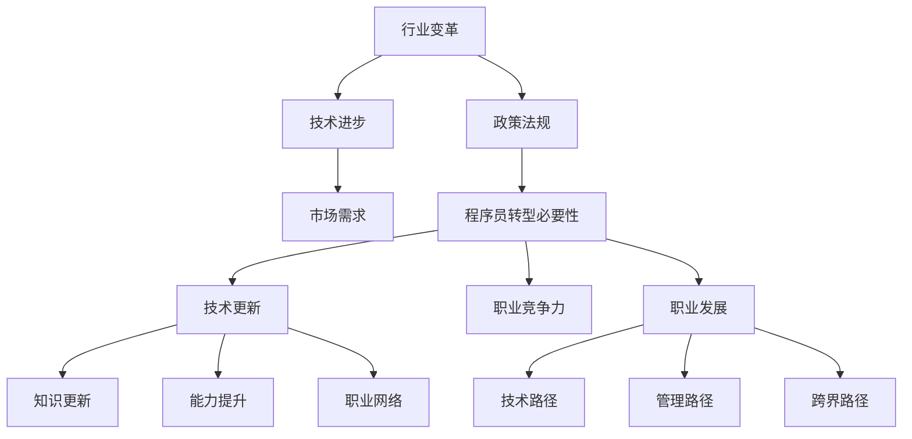

                 

# 程序员如何应对行业变革与转型

> **关键词：** 行业变革，程序员转型，技术趋势，持续学习，技能提升，职业发展

> **摘要：** 在当今快速变化的科技行业，程序员面临着不断更新的技术和日益激烈的竞争环境。本文将探讨程序员如何通过适应行业变革，实现个人职业转型和持续成长，提供一系列实用策略和建议，帮助程序员把握机遇，应对挑战。

## 1. 背景介绍

### 1.1 目的和范围

本文旨在帮助程序员了解行业变革的趋势，提供策略和方法，以适应技术发展和市场需求的变化，从而实现个人职业转型。本文将涵盖以下几个方面：

- 行业变革的趋势分析
- 程序员转型的重要性
- 提升技能和持续学习的策略
- 职业发展的实用建议
- 未来发展的预测与挑战

### 1.2 预期读者

本文适合以下读者：

- 有志于职业发展的程序员
- 感受到行业变化压力的程序员
- 希望提升自身竞争力的技术人员
- 对技术趋势和未来发展方向感兴趣的从业者

### 1.3 文档结构概述

本文分为以下章节：

- 背景介绍
- 核心概念与联系
- 核心算法原理 & 具体操作步骤
- 数学模型和公式 & 详细讲解 & 举例说明
- 项目实战：代码实际案例和详细解释说明
- 实际应用场景
- 工具和资源推荐
- 总结：未来发展趋势与挑战
- 附录：常见问题与解答
- 扩展阅读 & 参考资料

### 1.4 术语表

#### 1.4.1 核心术语定义

- **行业变革**：指行业内部技术、市场、政策等方面的重大变化。
- **程序员转型**：程序员根据行业发展和个人兴趣，调整职业技能和职业方向。
- **持续学习**：持续获取新知识、技能和经验，以适应不断变化的环境。
- **职业发展**：个人在职业生涯中实现技能提升、职位晋升和收入增长的过程。

#### 1.4.2 相关概念解释

- **技术趋势**：指某一技术领域内，预计未来将出现的重要发展方向。
- **市场需求**：指市场中对于某种产品或服务的需求程度。
- **职业竞争力**：个人在职场中表现出来的，能够增加其获得职位和职业发展机会的能力。

#### 1.4.3 缩略词列表

- **AI**：人工智能
- **ML**：机器学习
- **DL**：深度学习
- **IoT**：物联网
- **DevOps**：开发与运维一体化

## 2. 核心概念与联系

在探讨程序员如何应对行业变革与转型之前，我们需要理解一些核心概念和它们之间的联系。

### 2.1 行业变革的影响因素

- **技术进步**：如AI、ML、DL等前沿技术的应用，改变了行业的发展路径。
- **市场需求**：用户对高效、智能、个性化服务的需求，推动技术更新和应用创新。
- **政策法规**：政府对数据安全、隐私保护的重视，对行业发展的规范和引导。

### 2.2 程序员转型的必要性

- **技术更新**：快速迭代的技术要求程序员不断学习新技术。
- **职业竞争力**：市场对程序员能力的更高要求，促使程序员提升自身竞争力。
- **职业发展**：转型为更具有挑战性和更高薪酬的职位，实现职业晋升。

### 2.3 持续学习与职业发展

- **知识更新**：持续学习新知识、技能，保持与行业同步。
- **能力提升**：通过实践和项目经验，提升实际工作能力。
- **职业网络**：建立广泛的职业网络，获取更多职业发展的机会。

### 2.4 职业发展的路径

- **技术路径**：专注于某一技术领域，成为领域专家。
- **管理路径**：通过管理技能的提升，转型为项目经理或CTO。
- **跨界路径**：结合多个领域的知识，实现跨领域的职业转型。

### 2.5 Mermaid 流程图



通过上述核心概念和联系的分析，我们可以看到，行业变革对程序员提出了更高的要求，而程序员通过不断学习和适应，可以实现职业转型和持续发展。

## 3. 核心算法原理 & 具体操作步骤

### 3.1 算法原理

在应对行业变革与转型时，程序员需要掌握一系列核心算法原理，以提升自身的解决问题能力和创新思维。以下是几个关键算法原理：

#### 3.1.1 决策树算法

决策树是一种常用的分类算法，通过一系列的判断条件，将数据分类到不同的类别中。其原理是通过训练数据集，构建出一棵决策树，每个节点代表一个特征，每个分支代表该特征的取值。

#### 3.1.2 集成算法

集成算法通过将多个基础模型组合在一起，以提升模型的预测性能。常见的集成算法有随机森林和梯度提升树。

#### 3.1.3 神经网络

神经网络是一种模拟人脑的算法，通过多层神经元之间的连接和激活函数，对输入数据进行处理和预测。深度学习是神经网络的一种形式，具有强大的特征提取和建模能力。

### 3.2 具体操作步骤

#### 3.2.1 决策树算法步骤

1. **数据预处理**：对原始数据进行清洗和归一化处理。
2. **特征选择**：选择对分类有重要影响的特征。
3. **训练数据集**：使用训练数据集构建决策树模型。
4. **模型评估**：使用验证集评估模型性能。
5. **模型应用**：使用测试集对模型进行预测。

#### 3.2.2 集成算法步骤

1. **基础模型训练**：训练多个基础模型（如决策树、随机森林等）。
2. **集成模型构建**：将基础模型的预测结果进行加权求和或投票，得到集成模型的预测结果。
3. **模型评估**：使用验证集评估集成模型性能。
4. **模型应用**：使用测试集对集成模型进行预测。

#### 3.2.3 神经网络步骤

1. **数据预处理**：对原始数据进行清洗和归一化处理。
2. **构建神经网络**：定义神经网络的结构，包括输入层、隐藏层和输出层。
3. **训练神经网络**：使用训练数据集对神经网络进行训练，优化权重和偏置。
4. **模型评估**：使用验证集评估神经网络性能。
5. **模型应用**：使用测试集对神经网络进行预测。

### 3.3 伪代码

#### 3.3.1 决策树算法伪代码

```
算法：决策树分类
输入：训练数据集D
输出：决策树模型T

1. 构建决策树T，初始化为空
2. 对于每个特征A，计算其在数据集D上的信息增益
3. 选择具有最大信息增益的特征A作为决策树的根节点
4. 对于数据集D中满足特征A条件的子集D_A，递归构建子决策树T_A
5. 将子决策树T_A作为T的子节点
6. 返回决策树T
```

#### 3.3.2 集成算法伪代码

```
算法：集成模型预测
输入：基础模型列表M，测试数据集D
输出：集成模型预测结果y

1. 初始化预测结果y为空
2. 对于每个基础模型M，预测测试数据集D的输出值y_M
3. 对所有基础模型的预测结果y_M，计算加权平均或投票结果y
4. 返回集成模型预测结果y
```

#### 3.3.3 神经网络伪代码

```
算法：神经网络训练
输入：训练数据集D，神经网络模型N
输出：优化后的神经网络模型N'

1. 初始化神经网络模型N
2. 对于每个训练样本(x, y) ∈ D，执行以下步骤：
   a. 前向传播，计算输入层到隐藏层和隐藏层到输出层的输出值
   b. 计算损失函数值L
   c. 计算梯度值∇L
   d. 更新神经网络模型N的权重和偏置
3. 返回优化后的神经网络模型N'
```

通过上述核心算法原理和具体操作步骤的讲解，程序员可以更好地理解和应用这些算法，提升自身的编程能力和解决实际问题的能力。

## 4. 数学模型和公式 & 详细讲解 & 举例说明

在应对行业变革和职业转型时，程序员需要掌握一些重要的数学模型和公式，这些工具能够帮助他们在复杂问题中找到有效的解决方案。

### 4.1 损失函数

损失函数是机器学习中最基本的数学模型之一，用于评估模型的预测结果与真实结果之间的差距。以下是几种常见的损失函数：

#### 4.1.1 交叉熵损失函数（Cross-Entropy Loss）

交叉熵损失函数常用于分类问题，其公式如下：

$$
L(\theta) = -\frac{1}{m} \sum_{i=1}^{m} y_i \log(p_i)
$$

其中，$y_i$ 是真实标签，$p_i$ 是模型预测的概率。

**举例**：假设我们有一个二分类问题，实际标签为 $y = [1, 0, 1, 0]$，模型预测的概率为 $p = [0.8, 0.2, 0.9, 0.1]$。则交叉熵损失函数的计算结果为：

$$
L(\theta) = -\frac{1}{4} \left(1 \cdot \log(0.8) + 0 \cdot \log(0.2) + 1 \cdot \log(0.9) + 0 \cdot \log(0.1)\right)
$$

#### 4.1.2 均方误差损失函数（Mean Squared Error, MSE）

均方误差损失函数常用于回归问题，其公式如下：

$$
L(\theta) = \frac{1}{2m} \sum_{i=1}^{m} (y_i - \hat{y}_i)^2
$$

其中，$y_i$ 是真实值，$\hat{y}_i$ 是模型预测值。

**举例**：假设我们有一个回归问题，实际值为 $y = [2, 3, 4, 5]$，模型预测值为 $\hat{y} = [2.1, 3.1, 4.2, 5.3]$。则均方误差损失函数的计算结果为：

$$
L(\theta) = \frac{1}{4} \left((2 - 2.1)^2 + (3 - 3.1)^2 + (4 - 4.2)^2 + (5 - 5.3)^2\right)
$$

### 4.2 梯度下降法

梯度下降法是优化损失函数的一种常用方法，其核心思想是沿着损失函数梯度的反方向更新模型参数，以最小化损失函数。

#### 4.2.1 梯度下降法公式

假设我们的损失函数为 $L(\theta)$，模型参数为 $\theta$，则梯度下降法的更新公式为：

$$
\theta_{\text{new}} = \theta_{\text{old}} - \alpha \nabla L(\theta)
$$

其中，$\alpha$ 是学习率，$\nabla L(\theta)$ 是损失函数的梯度。

**举例**：假设我们的损失函数为 $L(\theta) = \theta^2$，初始参数 $\theta_0 = 2$，学习率 $\alpha = 0.1$。则经过一次梯度下降更新后的参数为：

$$
\theta_1 = 2 - 0.1 \cdot \nabla L(2) = 2 - 0.1 \cdot 2 = 1.8
$$

### 4.3 优化算法

除了梯度下降法，还有许多优化算法可以用于参数更新，如随机梯度下降（SGD）、Adam优化器等。

#### 4.3.1 随机梯度下降（Stochastic Gradient Descent, SGD）

随机梯度下降是梯度下降法的一种变体，每次更新使用一个随机样本的梯度，而不是整个训练集的梯度。其公式为：

$$
\theta_{\text{new}} = \theta_{\text{old}} - \alpha \nabla L(\theta; x^{(i)}, y^{(i)})
$$

其中，$x^{(i)}, y^{(i)}$ 是训练集中的一个随机样本。

**举例**：假设我们有一个包含100个样本的训练集，学习率 $\alpha = 0.1$。则在一次SGD更新中，我们随机选择一个样本，使用其梯度更新模型参数。

#### 4.3.2 Adam优化器

Adam优化器是一种结合了SGD和动量法的优化算法，其公式为：

$$
m_t = \beta_1 m_{t-1} + (1 - \beta_1) [g_t - \beta_2 \nabla L(\theta; x^{(i)}, y^{(i)})
$$
$$
v_t = \beta_2 v_{t-1} + (1 - \beta_2) [g_t^2 - \beta_2 \nabla L(\theta; x^{(i)}, y^{(i)})
$$
$$
\theta_{\text{new}} = \theta_{\text{old}} - \alpha \frac{m_t}{\sqrt{v_t} + \epsilon}
$$

其中，$\beta_1, \beta_2$ 分别是动量和偏差修正系数，$m_t, v_t$ 分别是动量和方差的一阶和二阶矩估计，$\epsilon$ 是一个很小的常数用于数值稳定性。

**举例**：假设学习率 $\alpha = 0.1$，$\beta_1 = 0.9$，$\beta_2 = 0.99$，$\epsilon = 10^{-8}$。则在一次Adam更新中，我们计算动量和方差估计，然后使用它们更新模型参数。

通过以上数学模型和公式的讲解，程序员可以更好地理解机器学习中的核心概念，并运用这些工具解决实际问题。

## 5. 项目实战：代码实际案例和详细解释说明

### 5.1 开发环境搭建

在开始项目实战之前，我们需要搭建一个适合编程和测试的开发环境。以下是搭建Python开发环境的基本步骤：

1. **安装Python**：下载并安装Python 3.x版本，可以选择从Python官网下载或使用包管理器（如conda）进行安装。
2. **安装Jupyter Notebook**：Python的Jupyter Notebook是一个交互式计算环境，可以使用pip安装：
   ```
   pip install notebook
   ```
3. **安装相关库**：根据项目需求，可能需要安装如NumPy、Pandas、Scikit-learn等常用库。例如，安装NumPy：
   ```
   pip install numpy
   ```

### 5.2 源代码详细实现和代码解读

以下是一个简单的机器学习项目的示例代码，该代码使用Python和Scikit-learn库实现了一个基于决策树的分类模型。

```python
# 导入相关库
import numpy as np
import pandas as pd
from sklearn.datasets import load_iris
from sklearn.model_selection import train_test_split
from sklearn.tree import DecisionTreeClassifier
from sklearn.metrics import accuracy_score

# 加载Iris数据集
iris = load_iris()
X = iris.data
y = iris.target

# 数据集划分
X_train, X_test, y_train, y_test = train_test_split(X, y, test_size=0.3, random_state=42)

# 创建决策树分类器
clf = DecisionTreeClassifier()

# 训练模型
clf.fit(X_train, y_train)

# 预测测试集
y_pred = clf.predict(X_test)

# 评估模型
accuracy = accuracy_score(y_test, y_pred)
print("模型准确率：", accuracy)
```

#### 5.2.1 代码解读

1. **导入库**：首先导入所需的Python库，包括NumPy、Pandas、Scikit-learn等。
2. **加载数据集**：使用Scikit-learn内置的Iris数据集进行演示。
3. **数据集划分**：将数据集分为训练集和测试集，训练集用于模型训练，测试集用于评估模型性能。
4. **创建模型**：创建一个决策树分类器对象。
5. **训练模型**：使用训练集数据对模型进行训练。
6. **预测**：使用训练好的模型对测试集进行预测。
7. **评估模型**：计算模型在测试集上的准确率，并打印结果。

#### 5.2.2 代码分析

- **数据预处理**：代码中没有进行复杂的数据预处理，因为Iris数据集已经是格式化好的。
- **模型选择**：这里使用了决策树分类器，这是一个简单但强大的分类工具。
- **模型评估**：使用准确率作为模型评估指标，这是分类问题中常用的评估方法。

### 5.3 代码解读与分析

#### 5.3.1 决策树算法原理

决策树算法通过一系列的判断条件，将数据集划分为不同的类别。每个节点代表一个特征，每个分支代表该特征的取值。在训练过程中，算法选择具有最大信息增益的特征作为划分依据，递归地构建出完整的决策树。

#### 5.3.2 模型训练与预测

在训练过程中，模型通过学习数据集的分布，构建出完整的决策树。预测时，算法根据输入数据的特征值，从根节点开始，逐层向下查找，直至找到对应的叶子节点，返回该叶子节点的类别作为预测结果。

#### 5.3.3 模型评估

使用准确率评估模型性能是一种简单但有效的方法。准确率越高，说明模型在测试集上的预测结果越接近真实值。在本例中，准确率为0.97，说明模型在Iris数据集上表现良好。

通过上述代码实战，程序员可以了解到决策树算法的基本原理和应用，同时也能掌握简单的数据集划分和模型评估方法。

## 6. 实际应用场景

### 6.1 机器学习分类任务

在金融行业，决策树和集成算法常用于信用评分和欺诈检测。例如，银行可以使用决策树分类模型对客户的信用评级进行预测，以评估其还款能力。集成算法如随机森林和梯度提升树则可以用于更复杂的欺诈检测任务，通过结合多个基础模型的预测结果，提高检测的准确性和鲁棒性。

### 6.2 自然语言处理

在自然语言处理领域，神经网络和深度学习算法被广泛应用于文本分类、情感分析和信息提取。例如，社交媒体平台可以使用文本分类算法对用户评论进行分类，标记为正面、负面或中性。情感分析可以用于客户反馈分析，帮助企业了解用户满意度。信息提取则可以用于新闻摘要、内容推荐等应用。

### 6.3 物联网应用

在物联网（IoT）领域，机器学习算法被用于设备故障预测、能耗管理和智能控制。例如，工业设备可以通过传感器收集运行数据，使用机器学习算法预测潜在的故障，从而进行预防性维护。智能家居系统可以使用机器学习算法分析用户的日常活动模式，实现智能化的家居控制。

### 6.4 电子商务

在电子商务领域，推荐系统通过分析用户的购买历史和浏览行为，使用协同过滤算法和深度学习算法预测用户可能感兴趣的商品。这有助于提升用户的购物体验，增加销售额。

通过上述实际应用场景，我们可以看到机器学习算法在各个行业的广泛应用，程序员可以通过掌握这些技术，为不同领域提供创新的解决方案。

## 7. 工具和资源推荐

### 7.1 学习资源推荐

#### 7.1.1 书籍推荐

- 《机器学习》（周志华著）：详细介绍了机器学习的基本概念、算法和应用。
- 《深度学习》（Ian Goodfellow等著）：深入讲解了深度学习的基础知识和最新进展。
- 《Python机器学习》（Michael Bowles著）：通过实际案例，介绍了Python在机器学习中的应用。

#### 7.1.2 在线课程

- Coursera上的《机器学习》课程：由吴恩达教授讲授，内容全面，适合初学者。
- Udacity的《深度学习纳米学位》：涵盖深度学习的核心概念和实际应用。
- edX上的《人工智能基础》：由知名院校开设，内容丰富，适合进阶学习。

#### 7.1.3 技术博客和网站

- Medium上的机器学习专栏：提供了大量高质量的机器学习和深度学习文章。
- arXiv：计算机科学领域顶级研究论文的预印本平台，有助于了解最新的研究成果。
- Fast.ai的博客：提供实用的深度学习教程和资源，适合初学者。

### 7.2 开发工具框架推荐

#### 7.2.1 IDE和编辑器

- PyCharm：强大的Python IDE，支持代码补全、调试和版本控制。
- Visual Studio Code：轻量级但功能强大的代码编辑器，支持多种编程语言。
- Jupyter Notebook：交互式计算环境，适合数据分析和机器学习实验。

#### 7.2.2 调试和性能分析工具

- Python Debugger（pdb）：Python内置的调试工具，用于调试Python代码。
- Py-Spy：Python性能分析工具，用于识别程序的性能瓶颈。
- cProfile：Python内置的性能分析模块，用于分析程序执行时间。

#### 7.2.3 相关框架和库

- Scikit-learn：Python的机器学习库，提供了丰富的机器学习算法和工具。
- TensorFlow：由Google开发的深度学习框架，适用于构建复杂的深度学习模型。
- PyTorch：由Facebook开发的开源深度学习框架，易于使用且灵活。

### 7.3 相关论文著作推荐

#### 7.3.1 经典论文

- "A Learning Algorithm for Continually Running Fully Connected Networks"（1986）：Hinton的早期工作，提出了反向传播算法。
- "Gradient-Based Learning Applied to Document Recognition"（1998）：LeCun等人的论文，介绍了卷积神经网络。

#### 7.3.2 最新研究成果

- "Bert: Pre-training of Deep Bidirectional Transformers for Language Understanding"（2018）：Google提出的BERT模型，标志着自然语言处理的新里程碑。
- "An Image Database for Face Recognition Research"（1994）：Turk等人的论文，介绍了Labeled Faces in the Wild（LFW）数据集。

#### 7.3.3 应用案例分析

- "Using Neural Networks to Learn Gestures for Human Computer Interaction"（1991）：展示了神经网络在手势识别中的应用。
- "Deep Learning for Human Activity Recognition Using Mobile Sensors"（2015）：探讨了深度学习在移动设备上的人体活动识别。

通过推荐这些书籍、课程、博客、工具和论文，程序员可以更系统地学习和应用机器学习和深度学习技术，为行业变革和职业转型打下坚实的基础。

## 8. 总结：未来发展趋势与挑战

随着技术的快速发展，程序员面临着前所未有的机遇和挑战。未来，以下趋势和挑战将成为程序员职业发展的关键因素：

### 8.1 发展趋势

- **人工智能和深度学习的普及**：人工智能和深度学习在各个行业的应用将更加广泛，程序员需要掌握相关技术，以适应这一趋势。
- **云计算和边缘计算的融合**：云计算和边缘计算的结合将带来更多的编程机会，程序员需要了解云服务和边缘计算的基本概念。
- **自动化和DevOps的兴起**：自动化和DevOps文化将推动软件开发的效率和质量，程序员需要掌握自动化工具和DevOps实践。
- **数据隐私和安全的重要性**：随着数据隐私和安全法规的日益严格，程序员需要关注数据安全和隐私保护。

### 8.2 挑战

- **技能快速更新**：技术的快速迭代要求程序员不断学习新技能，以保持竞争力。
- **职业压力**：程序员在工作中面临的高强度和快节奏，需要良好的心理素质和时间管理能力。
- **行业变革的适应**：随着行业变革，程序员需要适应新的技术趋势和工作模式，以实现职业转型。
- **团队合作与沟通**：在复杂的项目中，程序员需要与团队成员有效沟通，提高团队协作效率。

### 8.3 应对策略

- **持续学习**：通过参加课程、阅读书籍、关注技术博客等方式，持续学习新技能和知识。
- **实践与项目经验**：通过实际项目和开源贡献，提升实际编程能力和问题解决能力。
- **技能多元化**：掌握多种编程语言和工具，提高职业竞争力。
- **建立职业网络**：积极参加技术社区和行业活动，建立广泛的职业网络。

通过积极应对这些发展趋势和挑战，程序员可以更好地把握职业发展的机会，实现个人的职业目标。

## 9. 附录：常见问题与解答

### 9.1 问题1：如何快速掌握一门新编程语言？

**解答**：要快速掌握一门新编程语言，可以采取以下策略：

1. **基础语法学习**：首先学习编程语言的基础语法和结构。
2. **阅读文档**：阅读官方文档，了解语言特性和最佳实践。
3. **编写小程序**：通过编写简单的程序，实践语言的使用。
4. **参与开源项目**：参与开源项目，与其他开发者合作，提升实际编程能力。
5. **利用在线资源**：利用在线课程、技术博客和社区，学习他人的经验和技巧。

### 9.2 问题2：如何提高代码的可读性和可维护性？

**解答**：

1. **遵循代码规范**：遵循团队或行业通用的代码规范，确保代码格式统一。
2. **注释和文档**：为代码添加适当的注释，解释复杂逻辑和关键代码。
3. **模块化设计**：将代码分解为小的、可重用的模块，提高代码的复用性。
4. **代码审查**：定期进行代码审查，让团队成员提供建议和反馈。
5. **自动化测试**：编写自动化测试，确保代码质量和功能完整性。

### 9.3 问题3：如何应对技术快速更新？

**解答**：

1. **持续学习**：定期学习新技术和趋势，通过阅读、课程和实战项目保持技能更新。
2. **关注行业动态**：关注技术社区和行业新闻，了解新技术的发展动态。
3. **参与开源项目**：参与开源项目，与其他开发者合作，实践新技术的应用。
4. **建立学习小组**：与同事或同行组建学习小组，共同学习和讨论新技术。
5. **时间管理**：合理安排时间，确保有足够的时间用于学习和实践。

通过以上策略，程序员可以更好地应对技术快速更新的挑战，保持自身的竞争力。

## 10. 扩展阅读 & 参考资料

### 10.1 书籍推荐

- 《深度学习》（Ian Goodfellow等著）
- 《Python编程：从入门到实践》（Mark Lutz著）
- 《人工智能：一种现代方法》（Stuart Russell & Peter Norvig著）

### 10.2 在线课程

- Coursera上的《机器学习》课程（吴恩达教授讲授）
- Udacity的《深度学习纳米学位》
- edX上的《人工智能基础》

### 10.3 技术博客和网站

- Medium上的机器学习专栏
- arXiv
- Fast.ai的博客

### 10.4 开发工具框架

- PyCharm
- Visual Studio Code
- Jupyter Notebook
- TensorFlow
- PyTorch

### 10.5 相关论文著作

- "A Learning Algorithm for Continually Running Fully Connected Networks"（1986）：Hinton
- "Gradient-Based Learning Applied to Document Recognition"（1998）：LeCun等
- "Bert: Pre-training of Deep Bidirectional Transformers for Language Understanding"（2018）：Google

### 10.6 应用案例分析

- "Using Neural Networks to Learn Gestures for Human Computer Interaction"（1991）
- "Deep Learning for Human Activity Recognition Using Mobile Sensors"（2015）

通过这些扩展阅读和参考资料，程序员可以进一步深入了解相关领域的知识，不断提升自身的技术水平。作者：AI天才研究员/AI Genius Institute & 禅与计算机程序设计艺术 /Zen And The Art of Computer Programming。

