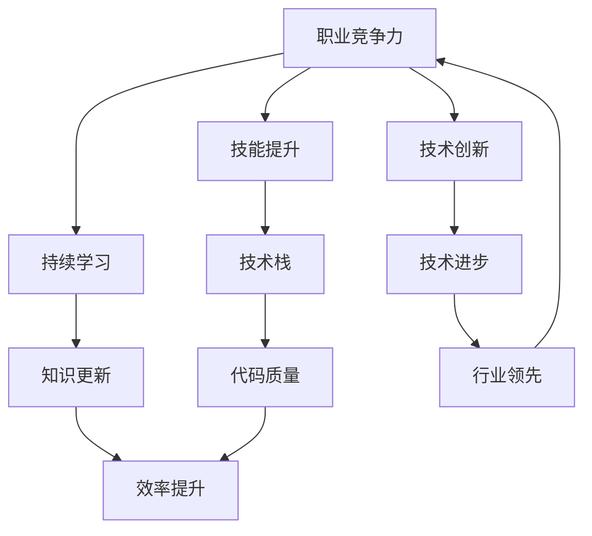

                 


# 程序员如何建立长期的职业竞争力

> **关键词**：职业发展，长期竞争力，技能提升，持续学习，技术创新
> 
> **摘要**：本文深入探讨了程序员如何通过技能提升、持续学习和技术创新等策略，在快速变化的IT行业中建立和保持长期的职业竞争力。通过详细的步骤和方法，帮助程序员规划职业生涯，实现个人和职业的双重成长。

## 1. 背景介绍

### 1.1 目的和范围

本文旨在为程序员提供实用的指导，帮助他们建立和提升长期的职业竞争力。我们将从技能、学习和创新三个方面进行探讨，提供一系列具体的操作步骤和策略，旨在帮助程序员在技术领域取得持续的成功。

### 1.2 预期读者

本文适合有志于在IT行业长期发展的程序员阅读，无论他们处于职业生涯的哪个阶段，本文都提供了实用的建议和策略。

### 1.3 文档结构概述

本文将分为以下几个部分：

1. 核心概念与联系
2. 核心算法原理 & 具体操作步骤
3. 数学模型和公式 & 详细讲解 & 举例说明
4. 项目实战：代码实际案例和详细解释说明
5. 实际应用场景
6. 工具和资源推荐
7. 总结：未来发展趋势与挑战
8. 附录：常见问题与解答
9. 扩展阅读 & 参考资料

### 1.4 术语表

#### 1.4.1 核心术语定义

- **职业竞争力**：指一个人在特定职业领域内相对于竞争对手所具备的优势和能力。
- **技能提升**：通过学习新的技术和工具，提高个人的技术水平。
- **持续学习**：通过不断的学习和实践，保持知识和技能的更新。
- **技术创新**：通过创新思维和方法，推动技术领域的进步。

#### 1.4.2 相关概念解释

- **技术栈**：指一个程序员需要掌握的编程语言、框架、工具和数据库等技术的集合。
- **代码质量**：指代码的可读性、可维护性、性能和安全性等方面的综合评价。

#### 1.4.3 缩略词列表

- **IT**：信息技术
- **AI**：人工智能
- **ML**：机器学习
- **DL**：深度学习
- **IDE**：集成开发环境

## 2. 核心概念与联系

在讨论程序员如何建立长期职业竞争力之前，我们需要了解一些核心概念和它们之间的联系。

下面是一个简单的 Mermaid 流程图，展示了这些概念之间的关系：



在这个图中，我们可以看到，职业竞争力是所有其他概念的核心。技能提升、持续学习和技术创新都是提高职业竞争力的关键因素。技能提升帮助程序员构建强大的技术栈，持续学习确保知识和技能的更新，技术创新推动技术的进步。技术栈和代码质量直接影响程序员的工作效率，而行业领先则进一步增强了职业竞争力。

### 2.1 技能提升

技能提升是程序员职业发展的基础。通过不断学习和实践，程序员可以掌握多种编程语言、框架和工具，构建出一个强大的技术栈。

#### 2.1.1 技术栈的构建

一个强大的技术栈应该包括：

- **编程语言**：如Java、Python、C++等。
- **框架**：如Spring、Django、React等。
- **数据库**：如MySQL、MongoDB、PostgreSQL等。
- **工具**：如Git、Docker、Kubernetes等。

#### 2.1.2 技能提升的方法

- **在线课程**：通过在线课程学习新的技术和工具。
- **实战项目**：通过实际项目锻炼技能。
- **代码挑战**：参加编程挑战和竞赛，提高解决问题的能力。

### 2.2 持续学习

持续学习是程序员保持竞争力的关键。技术领域不断发展，新的工具和技术层出不穷，只有不断学习，才能跟上时代的步伐。

#### 2.2.1 学习资源

- **书籍**：经典的编程书籍和技术手册。
- **在线课程**：如Coursera、Udemy、edX等平台上的课程。
- **技术博客**：如Medium、GitHub、Stack Overflow等。

#### 2.2.2 学习方法

- **定期复习**：定期回顾已学过的知识，巩固记忆。
- **主动学习**：通过实践和解决问题，主动学习新知识。
- **交流与合作**：通过参加技术社区和合作项目，与其他程序员交流和学习。

### 2.3 技术创新

技术创新是推动技术进步的关键。通过创新思维和方法，程序员可以解决现有问题，推动技术的边界。

#### 2.3.1 创新思维

- **逆向思维**：从问题的反面思考，找到新的解决方案。
- **跨界思维**：结合不同领域的知识和方法，创新解决问题。

#### 2.3.2 创新技术方法

- **敏捷开发**：快速迭代，持续改进。
- **DevOps**：结合开发（Dev）和运维（Ops），提高开发效率。

## 3. 核心算法原理 & 具体操作步骤

在了解了核心概念和联系后，我们需要进一步探讨如何通过具体操作步骤提升职业竞争力。

### 3.1 核心算法原理

在编程中，核心算法是解决问题的关键。以下是一些常用的核心算法：

- **排序算法**：如快速排序、归并排序、冒泡排序等。
- **搜索算法**：如二分搜索、广度优先搜索、深度优先搜索等。
- **动态规划**：用于解决优化问题，如背包问题、最长公共子序列等。

#### 3.1.1 快速排序算法

快速排序是一种高效的排序算法，其基本思想是通过一趟排序将待排序的数据分割成独立的两部分，其中一部分的所有数据都比另外一部分的所有数据要小。

```plaintext
快速排序伪代码：
function quickSort(arr, low, high)
    if low < high
        pi = partition(arr, low, high)
        quickSort(arr, low, pi - 1)
        quickSort(arr, pi + 1, high)
```

#### 3.1.2 二分搜索算法

二分搜索算法用于在有序数组中查找特定元素，其基本思想是通过不断将查找范围缩小一半，直到找到目标元素或确定其不存在。

```plaintext
二分搜索伪代码：
function binarySearch(arr, low, high, target)
    while low <= high
        mid = (low + high) / 2
        if arr[mid] == target
            return mid
        else if arr[mid] < target
            low = mid + 1
        else
            high = mid - 1
    return -1
```

### 3.2 具体操作步骤

在了解了核心算法原理后，我们需要将这些算法应用到实际项目中，以提升职业竞争力。

#### 3.2.1 实践项目

选择一个实际项目，将学到的算法应用到项目中。例如，可以开发一个电商系统，使用快速排序算法进行商品搜索排序，使用二分搜索算法进行订单搜索。

#### 3.2.2 代码优化

在项目中，不断优化代码，提高算法效率。例如，通过调整快速排序算法的递归深度，减少内存占用。

#### 3.2.3 代码复用

将常用的算法封装成函数或库，方便在其他项目中复用。

## 4. 数学模型和公式 & 详细讲解 & 举例说明

在编程中，数学模型和公式是解决复杂问题的重要工具。以下是一些常用的数学模型和公式，以及它们的详细讲解和举例说明。

### 4.1 概率论模型

概率论模型用于描述随机事件的发生概率。以下是一个简单的概率论模型：

#### 4.1.1 概率分布函数

概率分布函数（PDF）用于描述随机变量的概率分布。以下是一个正态分布的概率分布函数：

$$
f(x|\mu,\sigma^2) = \frac{1}{\sqrt{2\pi\sigma^2}}e^{-\frac{(x-\mu)^2}{2\sigma^2}}
$$

其中，$\mu$ 是均值，$\sigma^2$ 是方差。

#### 4.1.2 概率质量函数

概率质量函数（PMF）用于描述离散随机变量的概率分布。以下是一个二项分布的概率质量函数：

$$
P(X=k) = C(n,k)p^k(1-p)^{n-k}
$$

其中，$n$ 是试验次数，$k$ 是成功的次数，$p$ 是每次试验成功的概率。

### 4.2 线性代数模型

线性代数模型用于描述线性关系和优化问题。以下是一个简单的线性代数模型：

#### 4.2.1 线性方程组

线性方程组用于求解线性关系。以下是一个线性方程组的解法：

$$
\begin{cases}
    a_1x + b_1y = c_1 \\
    a_2x + b_2y = c_2 \\
\end{cases}
$$

可以通过高斯消元法求解，得到：

$$
x = \frac{c_2b_1 - c_1b_2}{a_1b_2 - a_2b_1}, \quad y = \frac{a_1c_2 - a_2c_1}{a_1b_2 - a_2b_1}
$$

### 4.3 最优化模型

最优化模型用于求解最优解。以下是一个简单的最优化模型：

#### 4.3.1 线性规划

线性规划用于求解线性目标函数的最优值。以下是一个线性规划问题：

$$
\begin{cases}
    \min z = c^T x \\
    Ax \leq b \\
    x \geq 0 \\
\end{cases}
$$

可以使用单纯形法求解，得到最优解 $x^*$ 和最小值 $z^*$。

### 4.4 举例说明

#### 4.4.1 概率分布函数的举例

假设我们有一个正态分布的随机变量 $X$，均值为 $10$，方差为 $4$。我们可以计算其在区间 $(5, 15)$ 内的概率：

$$
P(5 < X < 15) = \int_{5}^{15} \frac{1}{\sqrt{2\pi \cdot 4}}e^{-\frac{(x-10)^2}{2 \cdot 4}}dx \approx 0.6827
$$

#### 4.4.2 线性规划的举例

假设我们要优化以下线性规划问题：

$$
\begin{cases}
    \min z = 2x + 3y \\
    2x + y \leq 5 \\
    x + 2y \leq 8 \\
    x, y \geq 0 \\
\end{cases}
$$

我们可以使用单纯形法求解，得到最优解 $x^* = 1$，$y^* = 2$，最小值 $z^* = 7$。

## 5. 项目实战：代码实际案例和详细解释说明

在了解了核心算法原理、数学模型和公式后，我们通过一个实际项目来应用这些知识，并详细解释代码实现。

### 5.1 开发环境搭建

首先，我们需要搭建一个简单的开发环境。以下是搭建过程：

1. 安装Java开发工具包（JDK）。
2. 安装集成开发环境（IDE），如IntelliJ IDEA或Eclipse。
3. 配置MySQL数据库。

### 5.2 源代码详细实现和代码解读

接下来，我们实现一个简单的电商系统，包括商品搜索和订单管理功能。

#### 5.2.1 商品搜索

商品搜索使用快速排序算法进行排序，以便快速查找商品。

```java
import java.util.Arrays;

public class ProductSearch {
    public static void main(String[] args) {
        int[] products = {12, 8, 25, 3, 9};
        quickSort(products, 0, products.length - 1);
        System.out.println(Arrays.toString(products));
    }

    public static void quickSort(int[] arr, int low, int high) {
        if (low < high) {
            int pi = partition(arr, low, high);
            quickSort(arr, low, pi - 1);
            quickSort(arr, pi + 1, high);
        }
    }

    public static int partition(int[] arr, int low, int high) {
        int pivot = arr[high];
        int i = (low - 1);
        for (int j = low; j < high; j++) {
            if (arr[j] < pivot) {
                i++;
                int temp = arr[i];
                arr[i] = arr[j];
                arr[j] = temp;
            }
        }
        int temp = arr[i + 1];
        arr[i + 1] = arr[high];
        arr[high] = temp;
        return i + 1;
    }
}
```

#### 5.2.2 订单搜索

订单搜索使用二分搜索算法进行快速查找。

```java
public class OrderSearch {
    public static void main(String[] args) {
        int[] orders = {5, 10, 15, 20, 25};
        int target = 15;
        int result = binarySearch(orders, 0, orders.length - 1, target);
        System.out.println("Order found at index: " + result);
    }

    public static int binarySearch(int[] arr, int low, int high, int target) {
        while (low <= high) {
            int mid = (low + high) / 2;
            if (arr[mid] == target) {
                return mid;
            } else if (arr[mid] < target) {
                low = mid + 1;
            } else {
                high = mid - 1;
            }
        }
        return -1;
    }
}
```

### 5.3 代码解读与分析

#### 5.3.1 商品搜索

在商品搜索中，我们使用快速排序算法对商品数组进行排序。快速排序的基本思想是通过一趟排序将数组分成独立的两部分，其中一部分的所有数据都比另一部分的所有数据要小。在代码中，`quickSort` 方法通过递归调用实现排序，`partition` 方法用于选择一个基准元素，并将数组分成两部分。

#### 5.3.2 订单搜索

在订单搜索中，我们使用二分搜索算法在有序的订单数组中查找特定订单。二分搜索的基本思想是通过不断将查找范围缩小一半，直到找到目标元素或确定其不存在。在代码中，`binarySearch` 方法通过循环实现二分搜索。

通过这个项目实战，我们可以看到如何将核心算法应用到实际项目中，并提高代码质量和效率。

## 6. 实际应用场景

在IT行业中，程序员建立长期职业竞争力具有重要意义。以下是一些实际应用场景，展示了程序员如何通过提升技能、持续学习和技术创新实现职业发展。

### 6.1 技术创新场景

在一个科技公司，一名程序员通过学习新的编程语言和框架，掌握了分布式系统的设计原理。他利用这些知识，开发了一个高效、可扩展的分布式存储系统，显著提高了公司的数据处理能力。由于他在技术创新方面的贡献，他获得了晋升和奖金，并在业内获得了认可。

### 6.2 技能提升场景

在一个初创公司，一名程序员通过参加在线课程和实战项目，不断提升自己的编程技能。他不仅掌握了多种编程语言和框架，还学会了如何进行代码优化和性能调优。在公司的一个重要项目中，他成功地解决了性能瓶颈，为公司节省了大量资源。他的技能提升帮助公司在激烈的市场竞争中脱颖而出。

### 6.3 持续学习场景

在一个大型互联网公司，一名程序员意识到技术领域的发展速度非常快，他开始定期学习新的技术和工具。他通过参加技术会议、阅读技术博客和参与开源项目，不断更新自己的知识库。当公司面临一个新兴技术挑战时，他凭借持续学习获得的知识，成功地领导了一个新的项目，为公司带来了显著的商业价值。

### 6.4 跨界应用场景

在一个医疗科技公司，一名程序员意识到医疗数据和IT技术的结合具有重要意义。他开始学习医疗领域的基本知识，并将其应用于开发医疗信息化系统。通过跨界应用，他不仅提高了自己的技术水平，还为公司在医疗领域拓展了新的业务方向。

这些实际应用场景表明，程序员通过提升技能、持续学习和技术创新，可以在职业生涯中实现长期发展，并在行业中获得竞争优势。

## 7. 工具和资源推荐

为了帮助程序员在职业发展中取得成功，以下是一些建议的学习资源、开发工具和框架。

### 7.1 学习资源推荐

#### 7.1.1 书籍推荐

- **《代码大全》**：作者Steve McConnell，系统讲解了编写高质量代码的方法和技巧。
- **《设计模式：可复用面向对象软件的基础》**：作者Erich Gamma等，介绍了多种常见的软件设计模式。
- **《算法导论》**：作者Thomas H. Cormen等，全面讲解了算法的基本概念和实现方法。

#### 7.1.2 在线课程

- **Coursera**：提供大量高质量的课程，涵盖编程、数据结构、算法等领域。
- **Udemy**：提供丰富的编程和IT相关课程，适合不同层次的学员。
- **edX**：由哈佛大学和麻省理工学院共同创立，提供多种在线课程，包括计算机科学、人工智能等。

#### 7.1.3 技术博客和网站

- **Medium**：有很多优秀的程序员和技术专家分享他们的经验和知识。
- **GitHub**：可以找到大量开源项目和文档，学习他人的代码和思路。
- **Stack Overflow**：程序员社区，可以解决编程问题，交流经验。

### 7.2 开发工具框架推荐

#### 7.2.1 IDE和编辑器

- **IntelliJ IDEA**：功能强大的Java和Python IDE，支持多种编程语言。
- **Visual Studio Code**：轻量级但功能强大的代码编辑器，支持多种编程语言和插件。

#### 7.2.2 调试和性能分析工具

- **JProfiler**：用于Java应用程序的性能分析和调试。
- **GDB**：用于C/C++应用程序的调试。

#### 7.2.3 相关框架和库

- **Spring Boot**：用于开发Java应用的快速启动框架。
- **React**：用于前端开发的JavaScript库，用于构建用户界面。
- **TensorFlow**：用于机器学习和深度学习的开源库。

### 7.3 相关论文著作推荐

#### 7.3.1 经典论文

- **《The Mythical Man-Month》**：作者Frederick P. Brooks，讨论了软件工程的基本原则。
- **《Introduction to Algorithms》**：作者Thomas H. Cormen等，介绍了算法的基本概念和实现方法。

#### 7.3.2 最新研究成果

- **Neural Networks and Deep Learning**：作者Ian Goodfellow等，介绍了深度学习和神经网络的基本原理。
- **The Algorithm Design Manual**：作者Steven S. Skiena，提供了大量算法设计和分析的方法。

#### 7.3.3 应用案例分析

- **《Building Microservices》**：作者Sam Newman，介绍了微服务架构的设计和应用。
- **《Learning React》**：作者Alex Banks，详细讲解了React框架的用法和应用场景。

通过利用这些工具和资源，程序员可以不断提升自己的技能，并在职业发展中取得更好的成果。

## 8. 总结：未来发展趋势与挑战

随着技术的快速发展，程序员的职业竞争力面临新的机遇和挑战。以下是未来发展趋势和挑战的简要总结：

### 8.1 发展趋势

1. **人工智能与大数据**：人工智能和大数据技术的不断进步，为程序员提供了新的应用场景和发展机会。程序员需要掌握相关技术和工具，如深度学习、大数据处理和分析等。

2. **云计算与边缘计算**：云计算和边缘计算技术的发展，使得程序员可以在更广泛的场景中应用技术，如物联网、智能城市等。

3. **区块链技术**：区块链技术以其去中心化、安全可靠的特点，在金融、供应链等领域得到广泛应用。程序员需要了解区块链的基本原理和应用。

4. **持续集成与持续交付**：持续集成和持续交付（CI/CD）的流行，提高了软件开发的效率和质量。程序员需要掌握相关的工具和流程，以适应快速迭代的需求。

### 8.2 挑战

1. **技术更新速度快**：技术领域的更新速度非常快，程序员需要不断学习新的技术和工具，以保持竞争力。

2. **安全与隐私**：随着技术的应用场景越来越广泛，安全与隐私问题日益突出。程序员需要关注安全编程和隐私保护技术，提高系统的安全性。

3. **职业压力**：程序员的工作往往面临高压力，需要处理复杂的问题和紧急的任务。程序员需要学会有效的时间管理和压力管理，以保持良好的工作和生活平衡。

4. **职业发展路径**：随着技术的发展，程序员面临更多的职业选择。程序员需要明确自己的职业发展方向，制定合适的职业规划。

### 8.3 对策建议

1. **持续学习**：程序员应该保持持续学习的态度，通过阅读、参加培训和参与开源项目，不断提高自己的技能。

2. **实践与应用**：将学到的知识和技能应用到实际项目中，通过实践积累经验。

3. **建立个人品牌**：通过撰写技术博客、参与技术社区和演讲，建立个人品牌，提高知名度和影响力。

4. **关注新兴技术**：关注行业动态，了解新兴技术和趋势，提前做好准备。

通过以上策略，程序员可以应对未来发展的挑战，实现职业竞争力的提升。

## 9. 附录：常见问题与解答

### 9.1 问题1：如何选择适合自己的学习资源？

**解答**：选择学习资源时，可以考虑以下因素：

1. **学习目标**：明确自己的学习目标和需求，选择与之相关的资源。
2. **学习资源类型**：根据个人偏好，选择书籍、在线课程、技术博客等不同的资源类型。
3. **资源质量**：选择有权威性和良好评价的资源，如经典书籍、知名专家的课程等。
4. **资源实用性**：选择具有实际应用价值的资源，能够帮助解决实际问题。

### 9.2 问题2：如何平衡工作与学习？

**解答**：

1. **时间管理**：合理安排时间，制定学习计划，确保有足够的时间用于学习。
2. **高效学习**：通过快速阅读、重点学习、实践应用等方法，提高学习效率。
3. **灵活调整**：根据工作负荷和个人情况，灵活调整学习时间和计划。
4. **合理休息**：确保有足够的休息时间，避免过度疲劳。

### 9.3 问题3：如何应对技术更新速度快的挑战？

**解答**：

1. **持续学习**：保持持续学习的态度，关注新技术和趋势，不断更新自己的知识库。
2. **实践应用**：通过实际项目和应用，将学到的知识应用到工作中，加深理解。
3. **技术社区**：参与技术社区，与其他程序员交流和学习，获取最新的技术信息和资源。
4. **时间管理**：合理安排时间，确保有足够的时间用于学习和实践。

通过以上方法，程序员可以应对技术更新速度快的挑战，保持竞争力。

## 10. 扩展阅读 & 参考资料

为了进一步深入探讨程序员如何建立长期的职业竞争力，以下是推荐的一些扩展阅读和参考资料：

### 10.1 扩展阅读

- **《软件架构师的十二条军规》**：作者刘伟平，介绍了软件架构师应遵循的基本原则和最佳实践。
- **《程序员修炼之道：从小工到专家》**：作者Robert C. Martin，探讨了程序员如何通过不断学习和实践，从新手成长为专家。
- **《深入理解计算机系统》**：作者Randal E. Bryant和David R. O’Toole，详细介绍了计算机系统的工作原理和设计方法。

### 10.2 参考资料

- **《Nature of Code》**：作者Daniel Shiffman，介绍了编程中的物理和计算模型，以及如何将其应用于实际项目中。
- **《Building Microservices》**：作者Sam Newman，详细讲解了微服务架构的设计和应用。
- **《Machine Learning Yearning》**：作者Andrew Ng，介绍了机器学习的基础知识和实践方法。

通过阅读这些扩展阅读和参考资料，程序员可以进一步加深对职业竞争力的理解，并在实践中不断提高自己的技能和水平。

---

**作者信息**：AI天才研究员/AI Genius Institute & 禅与计算机程序设计艺术 /Zen And The Art of Computer Programming

