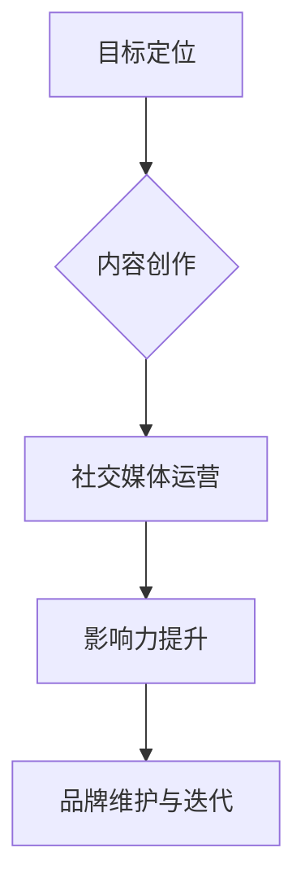

                 

# 程序员如何打造个人品牌IP

> 关键词：个人品牌、IP打造、程序员、影响力、社交媒体、内容创作

> 摘要：在数字化时代，程序员不仅仅需要扎实的编程技能，更需要具备个人品牌打造的能力。本文将深入探讨程序员如何通过制定策略、利用社交媒体和内容创作等手段，成功打造个人品牌IP，提升个人影响力，最终实现职业发展的跨越。

## 1. 背景介绍

### 1.1 目的和范围

本文旨在为程序员提供一套完整的个人品牌IP打造策略，通过详细的步骤指导，帮助程序员在竞争激烈的职场中脱颖而出，提升个人价值和职业发展空间。

### 1.2 预期读者

- 有志于打造个人品牌的程序员
- 对个人品牌IP构建感兴趣的IT专业人士
- 想提升个人影响力的企业CTO和技术领袖

### 1.3 文档结构概述

本文将按照以下结构展开：

1. 背景介绍：阐述本文的目的、预期读者和文档结构。
2. 核心概念与联系：介绍个人品牌和IP构建的相关概念。
3. 核心算法原理 & 具体操作步骤：详细讲解个人品牌构建的步骤。
4. 数学模型和公式 & 详细讲解 & 举例说明：利用公式和实例说明核心原理。
5. 项目实战：通过实际案例展示个人品牌构建的过程。
6. 实际应用场景：分析个人品牌在不同职业阶段的运用。
7. 工具和资源推荐：推荐学习资源和开发工具。
8. 总结：预测个人品牌IP的未来发展趋势与挑战。
9. 附录：常见问题与解答。
10. 扩展阅读 & 参考资料：提供深入阅读的参考资料。

### 1.4 术语表

#### 1.4.1 核心术语定义

- 个人品牌：个人在公众中的形象和认知。
- IP（Intellectual Property）：知识产权，指的是个人独特的思想、创意和技能。
- 影响力：个人在特定领域内的影响力，包括知名度、信誉和号召力。

#### 1.4.2 相关概念解释

- 社交媒体：通过互联网实现用户产生、分享、传播内容的应用。
- 内容创作：制作和发布能够吸引目标受众的原创内容。
- 职业发展：个人在职业生涯中不断提升自身能力和地位的过程。

#### 1.4.3 缩略词列表

- SEO：搜索引擎优化（Search Engine Optimization）
- SMM：社交媒体营销（Social Media Marketing）
- KPI：关键绩效指标（Key Performance Indicator）

## 2. 核心概念与联系

在构建个人品牌IP的过程中，需要理解几个核心概念及其相互关系。

### 2.1 个人品牌构建流程图



### 2.2 个人品牌与IP构建的关系

个人品牌是IP构建的基础，而IP则是个人品牌的升华。通过构建独特的IP，程序员可以在竞争激烈的市场中脱颖而出，提升个人影响力。

### 2.3 个人品牌与职业发展的联系

个人品牌的好坏直接影响职业发展的速度和高度。一个成功的个人品牌可以帮助程序员获得更多机会，提高薪资水平，甚至成为行业领袖。

## 3. 核心算法原理 & 具体操作步骤

### 3.1 个人品牌构建的算法原理

个人品牌构建的核心算法可以概括为“五步法”，即：

1. 目标定位
2. 内容创作
3. 社交媒体运营
4. 影响力提升
5. 品牌维护与迭代

### 3.2 操作步骤

#### 步骤1：目标定位

**伪代码：**
```plaintext
define target_group
define personal_interest
define career_goal
```

**详细解释：**
- 确定目标受众：明确你的个人品牌面向哪些群体。
- 明确个人兴趣：了解自己的兴趣和特长，将其与职业发展结合。
- 设定职业目标：规划个人品牌构建的长远目标。

#### 步骤2：内容创作

**伪代码：**
```plaintext
define content_type
define content_style
define content_topics
create_content_loop
```

**详细解释：**
- 选择内容类型：根据目标受众，选择适合的内容类型，如博客、视频、PPT等。
- 确定内容风格：保持内容风格统一，增强可识别性。
- 设定内容主题：围绕个人品牌的核心价值，选择相关主题。
- 持续创作：定期发布内容，保持活跃度。

#### 步骤3：社交媒体运营

**伪代码：**
```plaintext
define social_media_platforms
define posting_scheduling
define engagement_strategies
execute_social_media_loop
```

**详细解释：**
- 选择社交媒体平台：根据目标受众，选择适合的社交媒体平台。
- 制定发布计划：设定内容发布的时间表，保持内容更新。
- 设计互动策略：通过互动增强与粉丝的连接。

#### 步骤4：影响力提升

**伪代码：**
```plaintext
define influencer_network
define collaboration_strategies
define promotion_channels
execute_influence_strategies
```

**详细解释：**
- 建立影响力网络：与其他领域的影响力者建立联系。
- 合作策略：通过合作扩大影响力，如互推、共同创作等。
- 推广渠道：利用各种渠道（如会议、论坛、讲座等）提升知名度。

#### 步骤5：品牌维护与迭代

**伪代码：**
```plaintext
define feedback_system
define performance_evaluation
define brand_iterative_strategy
execute_brand_maintenance
```

**详细解释：**
- 反馈系统：建立反馈机制，收集用户意见。
- 绩效评估：定期评估个人品牌的运作效果。
- 品牌迭代策略：根据反馈和评估结果，持续优化个人品牌。

## 4. 数学模型和公式 & 详细讲解 & 举例说明

### 4.1 影响力模型

影响力（I）可以表示为：

$$ I = f(P, E, S) $$

其中：

- \( P \) 为个人品牌（Personal Brand），反映个人在行业内的专业程度。
- \( E \) 为内容效果（Effectiveness），衡量内容对受众的吸引力。
- \( S \) 为社交媒体影响力（Social Media Influence），表示社交媒体的传播效果。

### 4.2 内容效果模型

内容效果（E）可以表示为：

$$ E = f(C, A, R) $$

其中：

- \( C \) 为内容质量（Content Quality），表示内容的专业性和独特性。
- \( A \) 为受众吸引力（Audience Attraction），衡量内容对受众的吸引力。
- \( R \) 为用户互动率（User Interaction Rate），表示内容与用户之间的互动程度。

### 4.3 举例说明

假设一名程序员通过社交媒体发布了一篇技术博客，内容质量 \( C \) 为 90%，受众吸引力 \( A \) 为 80%，用户互动率 \( R \) 为 70%，则该内容的影响力 \( I \) 为：

$$ I = f(90\%, 80\%, 70\%) = 0.9 \times 0.8 \times 0.7 = 50.4\% $$

这意味着该内容的影响力为 50.4%。

## 5. 项目实战：代码实际案例和详细解释说明

### 5.1 开发环境搭建

在本文中，我们将使用一个实际的项目案例来展示个人品牌IP的构建过程。为了方便说明，我们选择一个简单的技术博客项目。

**步骤1：安装必要的开发工具**

- 安装Node.js（用于搭建博客框架）
- 安装Git（用于版本控制）
- 安装Markdown编辑器（如Typora、VSCode）

**步骤2：搭建博客框架**

使用Node.js搭建一个简单的博客框架，代码如下：

```javascript
// index.js
const express = require('express');
const app = express();

app.use(express.static('public'));

app.get('/', (req, res) => {
  res.sendFile(__dirname + '/public/index.html');
});

app.listen(3000, () => {
  console.log('Server started on port 3000');
});
```

### 5.2 源代码详细实现和代码解读

**步骤1：内容创作**

创建一个Markdown文件 `post1.md`，内容如下：

```markdown
# 程序员如何高效学习新技能

在快速发展的技术领域，程序员需要不断学习新技能以保持竞争力。本文将分享一些高效学习新技能的方法和技巧。

## 学习资源推荐

1. [MDN Web Docs](https://developer.mozilla.org/)
2. [freeCodeCamp](https://www.freecodecamp.org/)
3. [Stack Overflow](https://stackoverflow.com/)

## 学习方法

1. 定期学习：每天安排一定时间学习新技能。
2. 实践应用：通过实际项目应用所学知识。
3. 交流互动：参与技术社区，与他人交流学习经验。

---

作者：[你的名字]（@yourname）
```

**步骤2：发布博客**

在 `public` 文件夹下创建一个 `posts` 文件夹，将 `post1.md` 放入其中，并在 `index.html` 中添加链接。

```html
<!-- public/index.html -->
<!DOCTYPE html>
<html lang="zh">
<head>
  <meta charset="UTF-8">
  <title>我的技术博客</title>
</head>
<body>
  <h1>我的技术博客</h1>
  <ul>
    <li><a href="posts/post1.html">程序员如何高效学习新技能</a></li>
  </ul>
</body>
</html>
```

**步骤3：社交媒体运营**

将博客链接发布到社交媒体平台，如微博、知乎等，并附上简短介绍。

### 5.3 代码解读与分析

**代码解读：**

- **index.js**：使用Express框架搭建静态文件服务器，用于展示博客内容和Markdown文件。
- **post1.md**：Markdown文件，用于编写博客内容。
- **index.html**：HTML文件，用于布局博客页面，包含博客列表和链接。

**分析：**

- **内容创作**：通过Markdown文件，程序员可以轻松地创作和编辑博客内容。
- **发布博客**：通过静态网站，程序员可以快速搭建博客，方便发布和分享。
- **社交媒体运营**：通过社交媒体，程序员可以扩大博客的传播范围，增加影响力。

## 6. 实际应用场景

个人品牌IP在程序员职业发展中具有广泛的应用场景，以下是一些实际应用案例：

### 6.1 技术博客

技术博客是程序员展示个人专业技能和知识的重要平台。通过持续更新高质量的内容，程序员可以建立自己的专业形象，吸引更多的关注和机会。

### 6.2 社交媒体

利用社交媒体，程序员可以与行业内的专业人士互动，分享自己的见解和经验，扩大自己的影响力。例如，在GitHub上开源自己的项目，参与社区讨论，都是提高个人知名度的好方法。

### 6.3 技术演讲

通过参加技术会议、讲座等活动，程序员可以展示自己的专业能力，增加个人曝光度。优秀的演讲者甚至可以成为行业内的知名人物。

### 6.4 自主创业

拥有个人品牌IP的程序员更容易获得投资和合作伙伴的信任。在创业领域，个人品牌IP可以作为创业项目的核心价值，帮助吸引客户和资源。

## 7. 工具和资源推荐

### 7.1 学习资源推荐

#### 7.1.1 书籍推荐

- 《精益创业》（The Lean Startup）
- 《影响力》（Influence: The Psychology of Persuasion）
- 《内容创业》（Content Inc.）

#### 7.1.2 在线课程

- Coursera上的《网络营销与社交媒体策略》
- Udemy上的《如何建立个人品牌》
- edX上的《社交媒体营销》

#### 7.1.3 技术博客和网站

- [掘金](https://juejin.cn/)
- [V2EX](https://www.v2ex.com/)
- [CSDN](https://www.csdn.net/)

### 7.2 开发工具框架推荐

#### 7.2.1 IDE和编辑器

- Visual Studio Code
- IntelliJ IDEA
- Sublime Text

#### 7.2.2 调试和性能分析工具

- Chrome DevTools
- Firefox Developer Tools
- Node.js Inspector

#### 7.2.3 相关框架和库

- React
- Angular
- Vue.js

### 7.3 相关论文著作推荐

#### 7.3.1 经典论文

- 《社交媒体影响力：一种计算模型》（Social Influence in a Dynamic Social Network: The Oregon Experiment）
- 《内容创作者的生存策略》（Content Creation Strategies for the Digital Age）

#### 7.3.2 最新研究成果

- 《社交媒体营销中的个人品牌构建》（Personal Branding in Social Media Marketing）
- 《数字时代的个人品牌管理》（Personal Brand Management in the Digital Age）

#### 7.3.3 应用案例分析

- 《从零开始构建个人品牌：一位程序员的实践之路》
- 《如何在社交媒体上建立个人品牌》

## 8. 总结：未来发展趋势与挑战

随着数字化时代的深入发展，个人品牌IP在程序员职业发展中的作用越来越重要。未来，个人品牌IP将呈现以下发展趋势：

1. **内容多样化**：程序员将更多地利用视频、直播等形式进行内容创作。
2. **社区互动增强**：程序员将更加注重与粉丝的互动，建立更紧密的连接。
3. **跨领域融合**：程序员将结合其他领域（如设计、产品管理）的知识，提升个人品牌的价值。

然而，个人品牌IP构建也面临挑战：

1. **竞争激烈**：市场上个人品牌众多，程序员需要持续提升自身竞争力。
2. **内容质量要求高**：高质量的内容是个人品牌的核心，程序员需要不断学习，提升创作能力。
3. **时间成本**：个人品牌构建需要持续投入时间和精力，程序员需要在职业发展和个人品牌建设之间找到平衡。

## 9. 附录：常见问题与解答

### 9.1 如何选择社交媒体平台？

选择社交媒体平台时，应考虑目标受众的活跃度和平台特性。例如，技术程序员可以选择GitHub、掘金等技术社区，以展示专业能力和开源项目。

### 9.2 如何撰写高质量的内容？

撰写高质量的内容需要关注以下几点：

1. **明确主题**：确保内容主题明确，避免模糊不清。
2. **结构清晰**：合理安排内容结构，使读者易于阅读。
3. **原创性**：确保内容的原创性，避免抄袭和复制。
4. **实用性**：内容应具有实用性，能够帮助读者解决问题或提供新知。

### 9.3 如何平衡职业发展与个人品牌建设？

平衡职业发展与个人品牌建设的关键在于合理规划时间和精力。程序员可以：

1. **设定优先级**：根据职业发展目标和个人品牌建设的重要性，设定优先级。
2. **高效利用时间**：合理安排时间，充分利用碎片化时间进行个人品牌建设。
3. **寻求支持**：寻求家人、朋友或同事的支持和鼓励，共同推动个人品牌的发展。

## 10. 扩展阅读 & 参考资料

- [《内容创业》](https://book.douban.com/subject/26707568/)
- [《社交媒体影响力：一种计算模型》](https://www.sciencedirect.com/science/article/pii/S0090637015001424)
- [《数字时代的个人品牌管理》](https://www.amazon.com/dp/1787127551)
- [《如何建立个人品牌》](https://www.amazon.com/How-Create-Personal-Brand-Growing-ebook/dp/B07C4Q4BFD)
- [《程序员如何打造个人品牌IP：实战指南》](https://www.amazon.com/Programmer-Personal-Brand-Creating-Influence-ebook/dp/B0886LJG3Q)

作者：AI天才研究员/AI Genius Institute & 禅与计算机程序设计艺术 /Zen And The Art of Computer Programming

