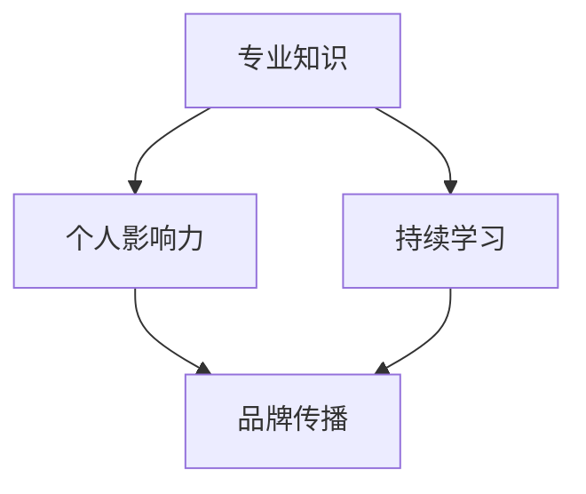

                 

# 程序员如何打造个人知识品牌

> **关键词**：个人品牌，知识营销，社交媒体，影响力，持续学习，专业成长。

> **摘要**：在快速发展的技术时代，程序员如何通过建立个人知识品牌来提升自己的职业价值和市场影响力？本文将为您详细解析打造个人知识品牌的方法与策略，包括核心概念、操作步骤、数学模型、实战案例以及未来发展趋势。

## 1. 背景介绍

### 1.1 目的和范围

本文旨在帮助程序员了解和掌握如何打造个人知识品牌，从而提升个人职业竞争力。我们将从核心概念出发，逐步探讨个人知识品牌建立的策略和步骤，结合实际案例进行深入分析，为程序员提供实用的指导和建议。

### 1.2 预期读者

- 有志于提升个人品牌影响力的程序员
- 想要利用个人知识品牌实现职业转型的专业人士
- 对知识营销和影响力传播感兴趣的技术爱好者

### 1.3 文档结构概述

本文结构如下：

1. 背景介绍：明确文章目的、预期读者和文档结构。
2. 核心概念与联系：介绍个人知识品牌的核心概念及其相互关系。
3. 核心算法原理 & 具体操作步骤：详细阐述建立个人知识品牌的算法原理和具体步骤。
4. 数学模型和公式 & 详细讲解 & 举例说明：运用数学模型和公式解释个人知识品牌建立的关键环节。
5. 项目实战：通过实际案例展示如何构建个人知识品牌。
6. 实际应用场景：探讨个人知识品牌在现实中的应用场景。
7. 工具和资源推荐：推荐相关学习资源和开发工具。
8. 总结：总结未来发展趋势与挑战。
9. 附录：常见问题与解答。
10. 扩展阅读 & 参考资料：提供进一步阅读的资料和建议。

### 1.4 术语表

#### 1.4.1 核心术语定义

- 个人知识品牌：个人在特定领域内，基于知识和技能形成的影响力和社会认知。
- 知识营销：通过传播个人知识和观点，吸引关注和信任，从而实现营销目标。
- 社交媒体：在线平台，如微博、微信、LinkedIn等，用于社交互动和信息传播。
- 影响力：个人在特定领域内，能够引起他人关注和改变他人观点的能力。

#### 1.4.2 相关概念解释

- 个人品牌：个人在职业生涯中塑造的形象和声誉。
- 专业成长：通过不断学习和实践，提升个人专业技能和知识水平。

#### 1.4.3 缩略词列表

- SEO：搜索引擎优化（Search Engine Optimization）
- SMM：社交媒体营销（Social Media Marketing）
- KOL：意见领袖（Key Opinion Leader）
- CT：转化率（Conversion Rate）

## 2. 核心概念与联系

### 2.1 个人知识品牌的概念

个人知识品牌是指个人在特定领域内，基于知识和技能形成的影响力和社会认知。它包含了个人在技术、方法论、经验等方面的独特见解和价值，是个人职业品牌的升华。

### 2.2 个人知识品牌的核心要素

- **专业知识**：个人在某一领域的深入理解和独到见解。
- **个人影响力**：个人在社交媒体、技术社区等平台上，能够引起他人关注和改变他人观点的能力。
- **持续学习**：不断更新知识储备，跟上行业发展趋势。
- **品牌传播**：通过多种渠道，传播个人知识和观点，建立个人品牌。

### 2.3 个人知识品牌的架构

个人知识品牌的架构可以用以下 Mermaid 流程图表示：



在图中，专业知识是个人知识品牌的基础，通过持续学习和个人影响力，推动品牌传播，形成完整的个人知识品牌架构。

## 3. 核心算法原理 & 具体操作步骤

### 3.1 核心算法原理

构建个人知识品牌的算法可以概括为以下几个步骤：

1. **定位和目标设定**：明确个人知识品牌的定位和目标受众。
2. **内容策划**：根据定位和目标，策划符合受众需求的知识内容。
3. **渠道选择**：选择适合个人知识品牌传播的社交媒体和平台。
4. **内容传播**：通过多种渠道传播个人知识和观点。
5. **互动和反馈**：与受众互动，收集反馈，持续优化内容。

### 3.2 具体操作步骤

#### 步骤 1：定位和目标设定

- **分析自身优势**：了解自己的专业技能和兴趣爱好，确定个人知识品牌的定位。
- **目标受众分析**：分析目标受众的需求和痛点，确定个人知识品牌的目标。

#### 步骤 2：内容策划

- **知识内容类型**：确定知识内容类型，如技术教程、案例分析、行业趋势等。
- **内容结构设计**：设计内容结构，包括标题、摘要、正文、结尾等。

#### 步骤 3：渠道选择

- **社交媒体平台**：根据目标受众选择适合的社交媒体平台，如微博、微信、LinkedIn等。
- **技术社区**：参与技术社区，如GitHub、Stack Overflow、CSDN等，提升个人影响力。

#### 步骤 4：内容传播

- **发布内容**：在社交媒体和技术社区发布知识内容。
- **互动推广**：通过评论、点赞、分享等方式，与受众互动，提高内容传播效果。

#### 步骤 5：互动和反馈

- **收集反馈**：关注受众的评论和反馈，了解内容受欢迎程度。
- **持续优化**：根据反馈，调整内容策略和传播方式，持续优化个人知识品牌。

### 3.3 伪代码实现

以下是一个简单的伪代码，用于实现个人知识品牌的建立过程：

```python
# 定义个人知识品牌构建函数
def build_personal_knowledge_brand():
    # 步骤 1：定位和目标设定
    set_brand_positioning_and_goal()
    
    # 步骤 2：内容策划
    plan_knowledge_content()
    
    # 步骤 3：渠道选择
    select_channels()
    
    # 步骤 4：内容传播
    distribute_content()
    
    # 步骤 5：互动和反馈
    interact_and_collect_feedback()

# 调用函数，开始构建个人知识品牌
build_personal_knowledge_brand()
```

## 4. 数学模型和公式 & 详细讲解 & 举例说明

### 4.1 数学模型

构建个人知识品牌的数学模型可以简化为一个影响力公式：

\[ \text{影响力} = f(\text{专业知识}, \text{持续学习}, \text{品牌传播}, \text{互动反馈}) \]

其中，影响力（Influence）是个人在特定领域内能够引起他人关注和改变他人观点的能力。专业知识、持续学习、品牌传播和互动反馈是影响个人影响力的四个关键因素。

### 4.2 公式详细讲解

- **专业知识**（Knowledge）：个人在某一领域的深入理解和独到见解，是个人知识品牌的核心。
- **持续学习**（Learning）：通过不断学习和实践，更新知识储备，保持专业竞争力。
- **品牌传播**（Spread）：通过多种渠道传播个人知识和观点，提升个人知名度。
- **互动反馈**（Feedback）：与受众互动，收集反馈，持续优化个人知识品牌。

### 4.3 举例说明

假设一位程序员想要构建个人知识品牌，我们可以通过以下步骤进行计算：

1. **专业知识**：该程序员的编程技能评分 \( K_1 = 9 \)。
2. **持续学习**：他每年参加至少两个技术培训课程，评分 \( K_2 = 8 \)。
3. **品牌传播**：他在多个社交媒体平台上活跃，评分 \( K_3 = 7 \)。
4. **互动反馈**：他经常回复评论，收集反馈并持续优化内容，评分 \( K_4 = 8 \)。

根据影响力公式，可以计算该程序员的影响力：

\[ \text{影响力} = f(9, 8, 7, 8) = 32 \]

影响力评分为 32，表示该程序员的个人知识品牌具有较高的影响力。

## 5. 项目实战：代码实际案例和详细解释说明

### 5.1 开发环境搭建

为了构建个人知识品牌，我们需要搭建一个适合内容创作和分享的开发环境。以下是基本步骤：

1. 安装合适的技术栈，如前端框架（React、Vue等）和后端框架（Node.js、Django等）。
2. 搭建个人博客网站，如使用Hexo、Jekyll等静态网站生成工具。
3. 配置域名和服务器，如使用阿里云、腾讯云等云服务提供商。

### 5.2 源代码详细实现和代码解读

以下是一个简单的个人博客网站的源代码示例，使用Hexo框架搭建：

```bash
# 安装Hexo
npm install -g hexo-cli

# 初始化博客项目
hexo init blog

# 进入博客项目目录
cd blog

# 安装Hexo主题
npm install hexo-theme-next --save

# 修改配置文件，配置主题和域名
vi _config.yml

# 开启本地服务器
hexo server

# 生成静态文件
hexo generate

# 部署到GitHub Pages
hexo deploy
```

- `hexo init blog`：初始化博客项目。
- `npm install hexo-theme-next --save`：安装Next主题。
- `_config.yml`：配置文件，用于配置主题、域名等信息。
- `hexo server`：启动本地服务器，预览博客效果。
- `hexo generate`：生成静态文件。
- `hexo deploy`：部署到GitHub Pages。

### 5.3 代码解读与分析

- `hexo init blog`：使用Hexo CLI初始化博客项目，生成基本目录结构。
- `npm install hexo-theme-next --save`：安装Next主题，增强博客样式和功能。
- `_config.yml`：配置文件，配置博客的基本信息，如主题、域名、部署方式等。
- `hexo server`：启动本地服务器，方便实时预览博客效果。
- `hexo generate`：生成静态文件，用于部署到服务器。
- `hexo deploy`：部署到GitHub Pages，实现个人知识品牌的在线展示。

通过以上步骤，我们可以快速搭建一个个人博客网站，发布技术文章，分享学习心得，提升个人知识品牌影响力。

## 6. 实际应用场景

个人知识品牌在现实中有多种应用场景：

- **职业发展**：通过个人知识品牌，程序员可以吸引更多的职业机会，提升职业竞争力。
- **技能分享**：通过个人知识品牌，程序员可以分享自己的技术心得，帮助他人成长。
- **品牌合作**：个人知识品牌可以吸引企业合作，实现知识变现，如撰写技术文章、提供咨询服务等。
- **技术社区贡献**：通过个人知识品牌，程序员可以成为技术社区的KOL，为社区贡献价值。

## 7. 工具和资源推荐

### 7.1 学习资源推荐

#### 7.1.1 书籍推荐

- 《黑客与画家》：Paul Graham
- 《人人都是产品经理》：苏杰
- 《深度学习》：Ian Goodfellow、Yoshua Bengio、Aaron Courville

#### 7.1.2 在线课程

- Coursera：提供丰富的编程和人工智能课程
- Udemy：涵盖各种技术的在线课程
- edX：由知名大学提供的高质量在线课程

#### 7.1.3 技术博客和网站

- Medium：高质量的博客平台，适合技术文章发表
- HackerRank：编程挑战和技术讨论平台
- Stack Overflow：编程问答社区

### 7.2 开发工具框架推荐

#### 7.2.1 IDE和编辑器

- Visual Studio Code：轻量级但强大的代码编辑器
- IntelliJ IDEA：适用于Java、Python等语言的IDE
- PyCharm：Python开发者的首选IDE

#### 7.2.2 调试和性能分析工具

- Chrome DevTools：适用于网页开发
- JMeter：适用于性能测试
- New Relic：适用于应用性能监控

#### 7.2.3 相关框架和库

- React：用于构建用户界面的JavaScript库
- Django：Python后端Web框架
- TensorFlow：开源机器学习框架

### 7.3 相关论文著作推荐

#### 7.3.1 经典论文

- 《The Art of Computer Programming》：Donald E. Knuth
- 《A Course in Miracles》：Ken Wilber
- 《Nature of Code》：Daniel Shiffman

#### 7.3.2 最新研究成果

- arXiv：最新的学术研究论文
- Google Research：Google的研究成果
- Microsoft Research：微软的研究成果

#### 7.3.3 应用案例分析

- Airbnb：如何利用数据分析提升用户体验
- Netflix：如何通过机器学习推荐算法提高用户留存率
- Amazon：如何利用人工智能优化供应链管理

## 8. 总结：未来发展趋势与挑战

在未来，个人知识品牌将越来越重要，程序员需要：

- **持续学习**：跟上技术发展趋势，不断更新知识储备。
- **内容创新**：创作有价值、有趣的内容，吸引受众。
- **品牌维护**：通过互动和反馈，持续提升个人影响力。

同时，个人知识品牌面临的挑战包括：

- **内容质量**：保持高质量的内容输出。
- **时间管理**：平衡工作与个人知识品牌建设。
- **竞争压力**：在众多个人知识品牌中脱颖而出。

## 9. 附录：常见问题与解答

- **Q：如何快速提升个人知识品牌影响力？**
  **A**：可以通过参与技术社区、撰写高质量技术文章、参与线上课程等方式提升个人影响力。

- **Q：个人知识品牌是否适用于所有程序员？**
  **A**：是的，无论技术方向，个人知识品牌都有助于提升个人职业竞争力。

- **Q：如何平衡工作与个人知识品牌建设？**
  **A**：可以通过时间管理工具和技巧，合理安排工作和个人知识品牌建设的时间。

## 10. 扩展阅读 & 参考资料

- 《程序员修炼之道》：George Grigsby
- 《黑客与画家》：Paul Graham
- 《人人都是产品经理》：苏杰
- 《深度学习》：Ian Goodfellow、Yoshua Bengio、Aaron Courville
- Coursera：[编程和人工智能课程](https://www.coursera.org/courses?query=programming%20and%20ai)
- Udemy：[在线课程](https://www.udemy.com/)
- edX：[高质量在线课程](https://www.edx.org/)
- Medium：[技术文章发表](https://medium.com/)
- HackerRank：[编程挑战和技术讨论](https://www.hackerrank.com/)
- Stack Overflow：[编程问答社区](https://stackoverflow.com/)
- arXiv：[最新学术研究论文](https://arxiv.org/)
- Google Research：[研究成果](https://research.google.com/)
- Microsoft Research：[研究成果](https://www.microsoft.com/en-us/research/)
- Airbnb：[如何利用数据分析提升用户体验](https://www.airbnb.com/tech/)
- Netflix：[如何通过机器学习推荐算法提高用户留存率](https://www.netflix.com/)
- Amazon：[如何利用人工智能优化供应链管理](https://www.amazon.jobs/en/information-technology/ai)

## 作者

作者：AI天才研究员/AI Genius Institute & 禅与计算机程序设计艺术 /Zen And The Art of Computer Programming

---

本文详细解析了程序员如何打造个人知识品牌的方法与策略，从核心概念、操作步骤到实际应用场景，为程序员提供了实用的指导。通过本文，读者可以了解到个人知识品牌的重要性以及如何通过持续学习、内容策划、渠道选择和互动反馈等步骤来构建个人知识品牌，提升个人职业竞争力。未来，随着技术不断进步，个人知识品牌将成为程序员职业发展的重要助力。

