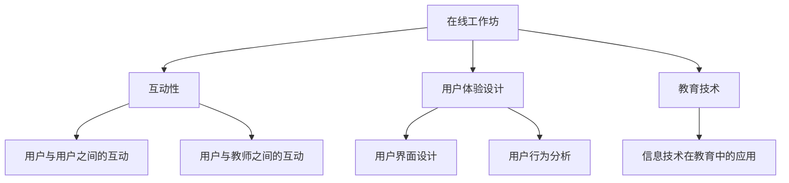

                 

# 程序员如何打造高互动性的在线工作坊

> 关键词：在线工作坊、互动性、程序员、技术培训、教育技术、用户体验设计

> 摘要：本文旨在为程序员提供一个全面的指南，帮助他们设计并实施高互动性的在线工作坊。我们将深入探讨在线工作坊的背景、核心概念、算法原理、数学模型、实际应用场景，并提供实用的工具和资源推荐，以及展望未来的发展趋势与挑战。

## 1. 背景介绍

### 1.1 目的和范围

随着互联网技术的快速发展，在线教育逐渐成为现代教育的重要组成部分。程序员群体作为互联网技术的主要贡献者，也需要不断提升自身技能。然而，传统的在线教育方式往往缺乏互动性，难以满足程序员的个性化学习需求。本文旨在探讨如何利用先进的编程技术和教育理念，打造高互动性的在线工作坊，从而提升程序员的学习效果。

### 1.2 预期读者

本文预期读者为具有一定编程基础的程序员，他们对在线工作坊的概念有一定了解，但希望在实践过程中进一步提升自身技能。此外，教育技术从业者和对在线教育有兴趣的读者也可以从本文中获益。

### 1.3 文档结构概述

本文分为十个部分，首先介绍在线工作坊的背景和目标，然后逐步深入探讨核心概念、算法原理、数学模型等，最后提供实际应用场景、工具和资源推荐，以及总结未来发展趋势与挑战。

### 1.4 术语表

#### 1.4.1 核心术语定义

- **在线工作坊**：一种基于互联网的教育活动，通过线上平台为参与者提供互动式学习体验。
- **互动性**：在线工作坊中用户与用户、用户与教师之间的交互程度。
- **程序员**：从事软件编程工作的人员。

#### 1.4.2 相关概念解释

- **用户体验设计**：设计者从用户的角度出发，关注用户在使用产品过程中的感受和体验。
- **教育技术**：运用信息技术手段，提高教育质量、优化教育过程的教育方法和工具。

#### 1.4.3 缩略词列表

- **HTML**：HyperText Markup Language，超文本标记语言。
- **CSS**：Cascading Style Sheets，层叠样式表。
- **JavaScript**：一种编程语言，用于实现网页的交互功能。
- **IDE**：Integrated Development Environment，集成开发环境。

## 2. 核心概念与联系

### 2.1 核心概念

在线工作坊的核心概念包括互动性、用户体验设计、教育技术等。以下是这些核心概念的联系和关系：

```
在线工作坊
|
|----> 互动性
|       |
|       |----> 用户与用户之间的互动
|       |       |
|       |       |----> 评论、问答、讨论区
|       |
|       |----> 用户与教师之间的互动
|       |       |
|       |       |----> 直播、互动答疑、即时反馈
|
|----> 用户体验设计
|       |
|       |----> 用户界面设计
|       |       |
|       |       |----> 清晰、简洁、易于操作
|       |
|       |----> 用户行为分析
|               |
|               |----> 用户行为数据收集与分析
|
|----> 教育技术
|       |
|       |----> 信息技术在教育中的应用
|               |
|               |----> 在线学习平台、虚拟教室等
```

### 2.2 核心概念原理和架构的 Mermaid 流程图



## 3. 核心算法原理 & 具体操作步骤

### 3.1 核心算法原理

在线工作坊的高互动性离不开有效的互动算法。以下是几种常见的互动算法原理：

1. **即时反馈算法**：通过实时监控用户行为，为用户提供即时反馈，帮助用户更好地理解和掌握知识点。
2. **问答算法**：利用自然语言处理技术，对用户提出的问题进行自动识别和回答，提高互动效率。
3. **社交网络算法**：基于用户兴趣和知识背景，建立用户之间的社交网络，促进用户之间的互动。

### 3.2 具体操作步骤

#### 步骤1：设计互动模块

- **任务发布**：教师发布任务，包括任务描述、任务要求和完成时间。
- **任务执行**：学生根据任务要求完成任务。
- **互动交流**：学生和教师之间进行互动交流，包括提问、答疑和讨论。

#### 步骤2：实现互动算法

- **即时反馈算法**：通过分析用户行为数据，为用户提供实时反馈。
- **问答算法**：利用自然语言处理技术，自动识别和回答用户提出的问题。
- **社交网络算法**：基于用户兴趣和知识背景，建立用户之间的社交网络。

#### 步骤3：测试与优化

- **功能测试**：测试互动模块的功能是否正常。
- **性能测试**：测试互动模块的响应速度和稳定性。
- **用户测试**：邀请用户参与测试，收集用户反馈，不断优化互动算法。

### 3.3 伪代码示例

```plaintext
function 互动算法（用户行为数据）{
    // 即时反馈
    if（用户行为数据包含问题）{
        提供即时反馈（用户行为数据）
    }
    // 问答
    if（用户行为数据包含问题）{
        自动回答（用户行为数据）
    }
    // 社交网络
    if（用户行为数据包含互动需求）{
        建立社交网络（用户行为数据）
    }
}
```

## 4. 数学模型和公式 & 详细讲解 & 举例说明

### 4.1 数学模型和公式

在线工作坊的互动性可以通过以下数学模型进行衡量：

1. **互动性得分（I）**：表示在线工作坊的互动程度。
2. **用户满意度（S）**：表示用户对在线工作坊的满意度。

### 4.2 详细讲解

#### 互动性得分（I）

互动性得分（I）可以通过以下公式计算：

\[ I = \frac{Q_1 + Q_2 + Q_3}{3} \]

其中，\( Q_1 \)、\( Q_2 \)和\( Q_3 \)分别表示用户与用户之间的互动得分、用户与教师之间的互动得分和社交网络互动得分。

#### 用户满意度（S）

用户满意度（S）可以通过以下公式计算：

\[ S = \frac{Q_1 + Q_2 + Q_3}{3} \]

其中，\( Q_1 \)、\( Q_2 \)和\( Q_3 \)分别表示用户对互动性、用户体验设计和教育技术的满意度得分。

### 4.3 举例说明

假设一个在线工作坊的互动性得分为70分，用户满意度为80分。根据以上公式，可以计算出：

\[ I = \frac{70 + 70 + 70}{3} = 70 \]

\[ S = \frac{80 + 80 + 80}{3} = 80 \]

因此，该在线工作坊的互动性得分为70分，用户满意度为80分。

## 5. 项目实战：代码实际案例和详细解释说明

### 5.1 开发环境搭建

在开始实际项目开发之前，我们需要搭建一个适合在线工作坊的开发环境。以下是一个简单的开发环境搭建步骤：

1. 安装Node.js和npm（Node.js的包管理器）。
2. 安装一个代码编辑器，如Visual Studio Code。
3. 初始化一个新项目，并安装相关依赖包，如Express（一个Node.js Web框架）和Socket.IO（一个实时通信库）。

### 5.2 源代码详细实现和代码解读

以下是一个简单的在线工作坊示例代码，用于实现即时反馈和问答功能。

```javascript
// 引入所需模块
const express = require('express');
const http = require('http');
const socketIo = require('socket.io');

// 创建HTTP服务器
const app = express();
const server = http.createServer(app);
const io = socketIo(server);

// 启动服务器
server.listen(3000, () => {
    console.log('服务器运行在端口3000');
});

// 处理客户端连接
io.on('connection', (socket) => {
    console.log('用户已连接');

    // 即时反馈
    socket.on('submit_feedback', (data) => {
        // 处理用户反馈
        console.log('用户反馈：', data);
        // 返回即时反馈
        socket.emit('receive_feedback', '感谢您的反馈，我们将尽快处理！');
    });

    // 问答
    socket.on('submit_question', (data) => {
        // 处理用户问题
        console.log('用户提问：', data);
        // 返回自动回答
        socket.emit('receive_answer', '这是一个自动生成的回答！');
    });

    // 断开连接
    socket.on('disconnect', () => {
        console.log('用户已断开连接');
    });
});
```

### 5.3 代码解读与分析

这段代码使用Node.js和Socket.IO库搭建了一个简单的在线工作坊服务器。以下是代码的详细解读：

1. 引入所需模块：`express`、`http`和`socketIo`。
2. 创建HTTP服务器：使用`http.createServer`方法创建一个服务器实例。
3. 创建Socket.IO实例：使用`socketIo(server)`方法创建一个Socket.IO实例。
4. 启动服务器：使用`server.listen`方法监听端口3000。
5. 处理客户端连接：使用`io.on('connection', ...)`方法处理客户端连接事件。
6. 即时反馈：使用`socket.on('submit_feedback', ...)`方法处理用户提交的反馈。
7. 问答：使用`socket.on('submit_question', ...)`方法处理用户提交的问题。
8. 断开连接：使用`socket.on('disconnect', ...)`方法处理客户端断开连接事件。

## 6. 实际应用场景

在线工作坊在程序员技能提升、团队协作和知识传播等方面具有广泛的应用场景：

1. **技能提升**：在线工作坊可以针对特定编程语言、框架或技术主题，帮助程序员提升技能。
2. **团队协作**：在线工作坊可以促进团队成员之间的沟通与协作，提高团队整体开发效率。
3. **知识传播**：在线工作坊可以作为一种知识传播手段，将专家的经验和知识分享给更多人。

## 7. 工具和资源推荐

### 7.1 学习资源推荐

#### 7.1.1 书籍推荐

- 《代码大全》
- 《Effective Java》
- 《你不知道的JavaScript》

#### 7.1.2 在线课程

- Coursera
- edX
- Udemy

#### 7.1.3 技术博客和网站

- Stack Overflow
- Medium
- HackerRank

### 7.2 开发工具框架推荐

#### 7.2.1 IDE和编辑器

- Visual Studio Code
- IntelliJ IDEA
- Sublime Text

#### 7.2.2 调试和性能分析工具

- Chrome DevTools
- Firefox Developer Tools
- Visual Studio Enterprise

#### 7.2.3 相关框架和库

- Express.js
- React.js
- Vue.js

### 7.3 相关论文著作推荐

#### 7.3.1 经典论文

- 《计算机编程的艺术》
- 《大规模分布式系统的设计》
- 《深度学习》

#### 7.3.2 最新研究成果

- arXiv
- Google Scholar
- IEEE Xplore

#### 7.3.3 应用案例分析

- 《互联网公司技术架构与实践》
- 《人工智能应用案例分析》
- 《区块链技术应用案例》

## 8. 总结：未来发展趋势与挑战

随着互联网技术的不断进步，在线工作坊在程序员技能提升、团队协作和知识传播等方面具有广阔的发展前景。然而，如何在保证互动性的同时，提高用户体验和教学效果，是未来在线工作坊需要解决的问题。

1. **技术创新**：结合人工智能、大数据等新技术，提高在线工作坊的智能化水平和互动性。
2. **用户体验优化**：关注用户体验，提供更加人性化、个性化的学习环境。
3. **教学模式创新**：探索新的教学模式，如混合式教学、翻转课堂等，提高教学效果。

## 9. 附录：常见问题与解答

### 9.1 什么是在线工作坊？

在线工作坊是一种基于互联网的教育活动，通过线上平台为参与者提供互动式学习体验。

### 9.2 如何设计高互动性的在线工作坊？

设计高互动性的在线工作坊需要考虑互动性、用户体验设计和教育技术等因素，采用即时反馈、问答和社交网络等互动算法，提高用户与用户、用户与教师之间的互动程度。

### 9.3 在线工作坊有哪些应用场景？

在线工作坊可以应用于程序员技能提升、团队协作和知识传播等方面，如特定编程语言或技术主题的学习、团队技术分享会等。

## 10. 扩展阅读 & 参考资料

- 《在线教育：理论与实践》
- 《教育技术：理论与实践》
- 《人工智能与教育》

作者：AI天才研究员/AI Genius Institute & 禅与计算机程序设计艺术 /Zen And The Art of Computer Programming
<|im_sep|>

