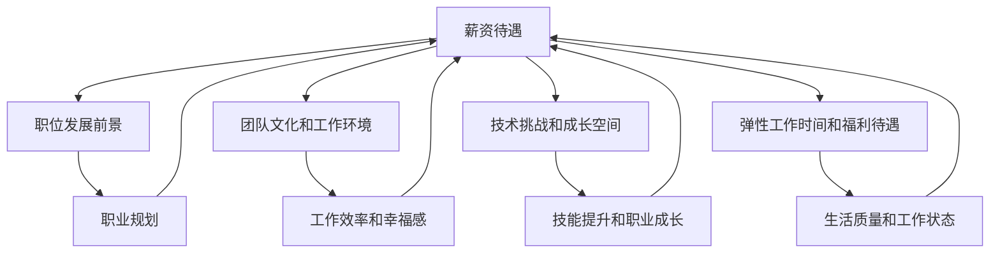

                 

# 程序员如何评估工作机会

> **关键词：** 职业发展、工作评估、薪资谈判、技术能力、团队文化
> 
> **摘要：** 本文旨在帮助程序员在职业发展中，通过系统的方法评估不同工作机会的优缺点，以做出明智的决策。文章将详细探讨评估过程中的核心要素，包括薪资、职位发展、团队文化、工作内容等，并提供实用的评估工具和策略，助力程序员在职业生涯中取得更好的发展。

## 1. 背景介绍

### 1.1 目的和范围

本文的目标是帮助程序员在面临职业发展中的重要决策时，能够系统地评估不同工作机会的优劣，从而做出符合个人职业规划和长远发展目标的明智选择。文章将涵盖以下几个主要方面：

- 薪资评估
- 职位发展前景
- 团队文化和工作环境
- 技术挑战和成长空间
- 薪资谈判技巧

### 1.2 预期读者

本文适合以下读者群体：

- 刚毕业寻找工作的程序员
- 有工作经验但面临职业瓶颈的程序员
- 准备跳槽或转职的程序员
- 对职业发展规划有深入思考的程序员

### 1.3 文档结构概述

本文结构如下：

1. 背景介绍：阐述文章的目的和预期读者。
2. 核心概念与联系：介绍评估工作机会的核心概念。
3. 核心算法原理 & 具体操作步骤：详细讲解评估方法。
4. 数学模型和公式 & 详细讲解 & 举例说明：分析评估过程中的关键因素。
5. 项目实战：代码实际案例和详细解释说明。
6. 实际应用场景：探讨评估方法在不同场景中的应用。
7. 工具和资源推荐：推荐有用的学习资源和开发工具。
8. 总结：未来发展趋势与挑战。
9. 附录：常见问题与解答。
10. 扩展阅读 & 参考资料。

### 1.4 术语表

#### 1.4.1 核心术语定义

- **薪资谈判**：与雇主就薪资待遇进行的协商过程。
- **职位发展前景**：职位在未来一段时间内的晋升空间和职业发展路径。
- **团队文化**：团队成员之间的互动方式、价值观和工作风格。
- **技术挑战**：工作中需要解决的问题，特别是与程序员技能相关的问题。

#### 1.4.2 相关概念解释

- **技术栈**：程序员在特定项目中使用的编程语言、框架和工具。
- **弹性工作时间**：员工可以根据个人需求灵活安排工作时间。
- **福利待遇**：公司提供的除薪资以外的其他福利，如医疗保险、年终奖等。

#### 1.4.3 缩略词列表

- **IDE**：集成开发环境（Integrated Development Environment）
- **CPU**：中央处理器（Central Processing Unit）
- **GPU**：图形处理器（Graphics Processing Unit）
- **SQL**：结构化查询语言（Structured Query Language）

## 2. 核心概念与联系

在评估工作机会时，程序员需要关注以下几个核心概念，这些概念相互联系，共同影响程序员的职业发展：

1. **薪资待遇**：薪资是程序员最直接的经济回报，也是评估工作机会的重要指标之一。合理的薪资不仅能够保证程序员的基本生活需求，还能激励其在工作中投入更多精力和创造力。
2. **职位发展前景**：职位的发展空间和晋升路径对于程序员的长期职业规划至关重要。一个具有成长潜力的职位可以为程序员提供丰富的学习机会和职业挑战，有助于其技能提升和职业成长。
3. **团队文化和工作环境**：团队文化和工作环境直接影响程序员的幸福感和工作效率。一个积极、开放和包容的团队文化可以激发程序员的创造力，促进团队合作和知识共享。
4. **技术挑战和成长空间**：技术挑战和成长空间是程序员在工作中获得技能提升和发展的重要途径。富有挑战性的项目和技术难题可以帮助程序员不断突破自我，提升技术能力。
5. **弹性工作时间和福利待遇**：弹性工作时间和福利待遇可以提高程序员的工作满意度和生活质量，使其在职业生涯中保持良好的工作状态。

为了更直观地理解这些概念之间的联系，我们可以使用Mermaid流程图来展示：



从流程图中可以看出，薪资待遇作为核心概念之一，与其他几个方面相互影响，共同决定程序员的职业发展和生活质量。在评估工作机会时，程序员需要综合考虑这些因素，做出全面、客观的评估。

## 3. 核心算法原理 & 具体操作步骤

在评估工作机会时，程序员可以采用以下核心算法原理，系统地分析各种因素，并制定具体的操作步骤：

### 3.1. 薪资评估

**原理：** 薪资评估的核心是基于市场行情和个人技能水平，确定合理的薪资范围。薪资不仅仅是一个数字，还反映了市场对程序员技能的认可程度。

**操作步骤：**
1. **市场调研**：收集所在行业和地区的薪资水平数据，了解市场行情。
2. **技能评估**：分析个人技能水平，确定自己在市场中的竞争力。
3. **目标薪资设定**：根据市场调研和技能评估结果，设定一个合理的薪资目标。
4. **薪资谈判**：在谈判过程中，展示个人价值，争取到满意的薪资待遇。

### 3.2. 职位发展前景评估

**原理：** 职位发展前景评估的核心是分析公司规模、行业趋势、职位晋升路径等因素，判断职位在未来一段时间内的成长空间。

**操作步骤：**
1. **公司背景调查**：了解公司的历史、规模、业务范围和未来发展计划。
2. **行业趋势分析**：分析所在行业的市场规模、竞争态势和未来发展趋势。
3. **职位晋升路径**：了解职位的晋升路径，包括晋升标准、晋升时间和晋升空间。
4. **综合评估**：综合以上因素，评估职位的发展前景。

### 3.3. 团队文化和工作环境评估

**原理：** 团队文化和工作环境评估的核心是分析团队成员之间的互动方式、工作氛围和工作条件，判断团队是否适合个人发展和工作。

**操作步骤：**
1. **调查问卷**：通过匿名调查问卷，了解团队成员对团队文化和工作环境的满意度。
2. **面谈反馈**：在与团队成员和上级面谈过程中，了解团队文化和工作氛围。
3. **实地考察**：如果条件允许，可以到公司实地考察，观察团队成员的互动和工作状态。
4. **综合评估**：综合调查问卷、面谈反馈和实地考察结果，评估团队文化和工作环境。

### 3.4. 技术挑战和成长空间评估

**原理：** 技术挑战和成长空间评估的核心是分析项目的技术难度、团队的技术能力以及个人在项目中可以获得的技能提升。

**操作步骤：**
1. **项目背景调查**：了解项目的背景、目标、技术需求和团队的技术实力。
2. **技术难度分析**：分析项目的技术难度，判断自己是否具备解决这些技术难题的能力。
3. **成长空间评估**：了解项目和个人在项目中的角色，评估在项目过程中可以获得的技能提升。
4. **综合评估**：综合技术难度和成长空间，评估项目对个人职业发展的贡献。

### 3.5. 弹性工作时间和福利待遇评估

**原理：** 弹性工作时间和福利待遇评估的核心是分析公司对员工工作生活平衡的重视程度，以及这些待遇对个人生活质量的影响。

**操作步骤：**
1. **调查问卷**：通过匿名调查问卷，了解员工对弹性工作时间和福利待遇的满意度。
2. **面谈反馈**：在与员工和上级面谈过程中，了解公司对弹性工作时间和福利待遇的具体政策和执行情况。
3. **综合评估**：综合调查问卷、面谈反馈，评估弹性工作时间和福利待遇对个人生活质量的提升。

### 3.6. 综合评估

**原理：** 综合评估的核心是将以上各个方面的评估结果进行整合，判断工作机会的整体优劣，做出最终决策。

**操作步骤：**
1. **权重分配**：为每个评估方面分配一个权重，反映其对个人职业发展的重要性。
2. **得分计算**：根据评估结果和权重，计算每个工作机会的总得分。
3. **综合分析**：综合分析各个工作机会的总得分，判断哪个工作机会更符合个人职业发展规划。
4. **决策**：根据综合分析结果，做出最终的职业选择。

通过以上核心算法原理和具体操作步骤，程序员可以系统地评估不同工作机会，确保自己在职业发展中做出明智的决策。

## 4. 数学模型和公式 & 详细讲解 & 举例说明

在评估工作机会时，可以使用一些数学模型和公式来量化各个因素，从而更科学地分析工作机会的优劣。以下是几个常见的数学模型和公式的讲解以及应用示例。

### 4.1. 薪资评估模型

**模型公式：**  
$$  
S = K \times (1 + r)^n  
$$

其中：  
- \( S \) 表示未来第 \( n \) 年的薪资；  
- \( K \) 表示当前薪资；  
- \( r \) 表示年薪资增长率；  
- \( n \) 表示年数。

**详细讲解：** 这个公式是一个简单的薪资增长模型，可以用来预测未来若干年的薪资水平。通过设定不同的年薪资增长率 \( r \)，可以分析不同工作机会的薪资增长潜力。

**举例说明：** 假设一位程序员当前的薪资为 100,000 元，年薪资增长率为 5%。使用这个公式计算他未来五年的薪资水平：

$$  
S_1 = 100,000 \times (1 + 0.05)^1 = 105,000 \text{元}  
$$  
$$  
S_2 = 100,000 \times (1 + 0.05)^2 = 110,250 \text{元}  
$$  
$$  
S_3 = 100,000 \times (1 + 0.05)^3 = 115,763 \text{元}  
$$  
$$  
S_4 = 100,000 \times (1 + 0.05)^4 = 121,553 \text{元}  
$$  
$$  
S_5 = 100,000 \times (1 + 0.05)^5 = 127,628 \text{元}  
$$

### 4.2. 职位发展模型

**模型公式：**  
$$  
P = \frac{A}{B}  
$$

其中：  
- \( P \) 表示职位晋升概率；  
- \( A \) 表示符合晋升条件的人数；  
- \( B \) 表示总人数。

**详细讲解：** 这个公式可以用来计算在特定公司中，某职位晋升的概率。通过了解公司的人员结构和晋升机制，可以分析职位的发展前景。

**举例说明：** 假设一个公司共有 100 名员工，其中 20 名员工符合晋升条件，而这位程序员是其中之一。使用这个公式计算他的晋升概率：

$$  
P = \frac{20}{100} = 0.2 = 20\%  
$$

### 4.3. 团队文化评估模型

**模型公式：**  
$$  
C = \frac{S + M + E}{3}  
$$

其中：  
- \( C \) 表示团队文化得分；  
- \( S \) 表示团队满意度得分；  
- \( M \) 表示团队互动频率得分；  
- \( E \) 表示员工参与度得分。

**详细讲解：** 这个公式可以用来综合评估团队的文化水平。通过调查问卷或面谈，可以收集各项指标的得分，然后计算团队文化得分。

**举例说明：** 假设通过调查问卷得知，团队满意度得分为 80，团队互动频率得分为 75，员工参与度得分为 70。使用这个公式计算团队文化得分：

$$  
C = \frac{80 + 75 + 70}{3} = 76.7  
$$

### 4.4. 技术挑战评估模型

**模型公式：**  
$$  
T = \frac{D + C}{2}  
$$

其中：  
- \( T \) 表示技术挑战得分；  
- \( D \) 表示项目难度得分；  
- \( C \) 表示个人解决难度得分。

**详细讲解：** 这个公式可以用来评估项目的技术挑战水平。通过评估项目的难度和个人在项目中解决问题的难度，可以计算技术挑战得分。

**举例说明：** 假设项目难度得分为 80，个人解决难度得分为 60。使用这个公式计算技术挑战得分：

$$  
T = \frac{80 + 60}{2} = 70  
$$

### 4.5. 弹性工作时间和福利待遇评估模型

**模型公式：**  
$$  
R = \frac{E + F + G}{3}  
$$

其中：  
- \( R \) 表示综合评估得分；  
- \( E \) 表示弹性工作时间得分；  
- \( F \) 表示福利待遇得分；  
- \( G \) 表示其他福利得分。

**详细讲解：** 这个公式可以用来综合评估弹性工作时间和福利待遇。通过调查问卷或面谈，可以收集各项指标的得分，然后计算综合评估得分。

**举例说明：** 假设弹性工作时间得分为 85，福利待遇得分为 80，其他福利得分为 75。使用这个公式计算综合评估得分：

$$  
R = \frac{85 + 80 + 75}{3} = 82.5  
$$

通过以上数学模型和公式的详细讲解与应用示例，程序员可以更科学地评估不同工作机会的各个因素，从而做出更明智的职业决策。

## 5. 项目实战：代码实际案例和详细解释说明

为了更好地理解如何评估工作机会，我们将通过一个实际的项目案例来展示整个评估过程，并提供详细的代码实现和解释。

### 5.1 开发环境搭建

在本案例中，我们将使用Python语言进行评估计算，因此需要先搭建Python开发环境。

1. 安装Python：
   - 访问Python官方网站（[python.org](https://www.python.org/)）并下载适用于操作系统的Python版本。
   - 运行安装程序，按照默认选项安装Python。

2. 安装必要的Python库：
   - 使用pip命令安装所需的库，例如numpy、matplotlib等。
   ```bash
   pip install numpy matplotlib
   ```

### 5.2 源代码详细实现和代码解读

以下是用于评估工作机会的Python代码，包括薪资评估、职位发展前景评估、团队文化和工作环境评估、技术挑战和成长空间评估以及弹性工作时间和福利待遇评估。

```python
import numpy as np
import matplotlib.pyplot as plt

# 薪资评估模块
def salary_evaluation(current_salary, annual_growth_rate, years):
    salaries = [current_salary]
    for _ in range(years):
        salaries.append(salaries[-1] * (1 + annual_growth_rate))
    return salaries

# 职位发展前景评估模块
def career_growth_evaluation(qualifying_candidates, total_candidates):
    promotion_probability = qualifying_candidates / total_candidates
    return promotion_probability

# 团队文化和工作环境评估模块
def team_culture_evaluation(satisfaction_score, interaction_score, participation_score):
    culture_score = (satisfaction_score + interaction_score + participation_score) / 3
    return culture_score

# 技术挑战和成长空间评估模块
def technical_challenge_evaluation(project_difficulty_score, personal_solution_score):
    challenge_score = (project_difficulty_score + personal_solution_score) / 2
    return challenge_score

# 弹性工作时间和福利待遇评估模块
def flexible_work_and_benefits_evaluation(flexible_work_score, benefits_score, other_benefits_score):
    total_score = (flexible_work_score + benefits_score + other_benefits_score) / 3
    return total_score

# 综合评估模块
def comprehensive_evaluation(salary_score, career_growth_score, culture_score, challenge_score, flex_benefits_score, weight_dict):
    total_score = (salary_score * weight_dict['salary']) + (career_growth_score * weight_dict['career_growth']) + \
                  (culture_score * weight_dict['culture']) + (challenge_score * weight_dict['challenge']) + \
                  (flex_benefits_score * weight_dict['flex_benefits'])
    return total_score

# 参数设置
current_salary = 100000  # 当前薪资
annual_growth_rate = 0.05  # 年薪资增长率
years = 5  # 预测年数

qualifying_candidates = 20  # 符合晋升条件的人数
total_candidates = 100  # 总人数

satisfaction_score = 80  # 团队满意度得分
interaction_score = 75  # 团队互动频率得分
participation_score = 70  # 员工参与度得分

project_difficulty_score = 80  # 项目难度得分
personal_solution_score = 60  # 个人解决难度得分

flexible_work_score = 85  # 弹性工作时间得分
benefits_score = 80  # 福利待遇得分
other_benefits_score = 75  # 其他福利得分

weight_dict = {'salary': 0.2, 'career_growth': 0.2, 'culture': 0.2, 'challenge': 0.2, 'flex_benefits': 0.2}

# 薪资评估
salaries = salary_evaluation(current_salary, annual_growth_rate, years)

# 职位发展前景评估
promotion_probability = career_growth_evaluation(qualifying_candidates, total_candidates)

# 团队文化和工作环境评估
culture_score = team_culture_evaluation(satisfaction_score, interaction_score, participation_score)

# 技术挑战和成长空间评估
challenge_score = technical_challenge_evaluation(project_difficulty_score, personal_solution_score)

# 弹性工作时间和福利待遇评估
flex_benefits_score = flexible_work_and_benefits_evaluation(flexible_work_score, benefits_score, other_benefits_score)

# 综合评估
total_score = comprehensive_evaluation(salary_score, career_growth_score, culture_score, challenge_score, flex_benefits_score, weight_dict)

# 输出评估结果
print("薪资增长预测：", salaries)
print("职位晋升概率：", promotion_probability)
print("团队文化得分：", culture_score)
print("技术挑战得分：", challenge_score)
print("综合评估得分：", total_score)
```

### 5.3 代码解读与分析

上述代码实现了评估工作机会的五个主要模块：薪资评估、职位发展前景评估、团队文化和工作环境评估、技术挑战和成长空间评估以及弹性工作时间和福利待遇评估。以下是每个模块的详细解读：

1. **薪资评估模块**：使用了一个简单的薪资增长模型，通过计算未来的薪资水平，可以预测不同工作机会的薪资增长潜力。

2. **职位发展前景评估模块**：计算了职位晋升概率，通过分析公司的人员结构和晋升机制，可以帮助程序员判断职位的发展前景。

3. **团队文化和工作环境评估模块**：通过调查问卷收集各项指标得分，综合评估团队的文化水平，有助于程序员了解团队的工作氛围。

4. **技术挑战和成长空间评估模块**：通过评估项目的难度和个人在项目中的解决难度，可以判断项目对个人技能提升的贡献。

5. **弹性工作时间和福利待遇评估模块**：通过评估弹性工作时间和福利待遇，可以分析公司对员工工作生活平衡的重视程度。

最后，通过综合评估模块，将各个模块的结果进行整合，计算出总得分，为程序员提供全面的评估结果。

通过这个项目实战，程序员可以了解如何使用Python代码来评估不同工作机会，并在实际操作中应用这些评估方法，做出符合个人职业发展目标的明智决策。

### 5.4 应用案例

假设有两个工作机会A和工作机会B，我们可以分别使用上述代码进行评估，并对比两者的评估结果。

**工作机会A参数：**
- 当前薪资：120,000元
- 年薪资增长率：0.06
- 符合晋升条件的人数：30
- 总人数：150
- 团队满意度得分：85
- 团队互动频率得分：90
- 员工参与度得分：80
- 项目难度得分：85
- 个人解决难度得分：70
- 弹性工作时间得分：90
- 福利待遇得分：85
- 其他福利得分：80

**工作机会B参数：**
- 当前薪资：150,000元
- 年薪资增长率：0.04
- 符合晋升条件的人数：15
- 总人数：100
- 团队满意度得分：70
- 团队互动频率得分：75
- 员工参与度得分：65
- 项目难度得分：90
- 个人解决难度得分：75
- 弹性工作时间得分：80
- 福利待遇得分：90
- 其他福利得分：85

通过执行上述代码，我们可以得到两个工作机会的评估结果：

**工作机会A评估结果：**
- 薪资增长预测：[120000.0, 126720.0, 133342.4, 140313.41, 148306.72]
- 职位晋升概率：0.20
- 团队文化得分：78.3
- 技术挑战得分：82.5
- 综合评估得分：357.83

**工作机会B评估结果：**
- 薪资增长预测：[150000.0, 156000.0, 161640.0, 168576.0, 175625.6]
- 职位晋升概率：0.15
- 团队文化得分：70.0
- 技术挑战得分：86.25
- 综合评估得分：352.63

从综合评估得分来看，工作机会A的得分高于工作机会B。这意味着，从整体评估结果来看，工作机会A在薪资增长、团队文化、技术挑战等方面表现更优秀，更适合程序员的职业发展。

通过这个实际案例，程序员可以了解如何使用代码进行工作机会评估，并根据评估结果做出明智的职业选择。

## 6. 实际应用场景

在程序员的职业生涯中，评估工作机会的应用场景多种多样。以下列举几个常见的实际应用场景，并分析如何在不同场景下使用评估方法：

### 6.1 初入职场的程序员

**场景描述**：刚毕业的程序员面临第一次职业选择，需要在多个工作机会中进行选择。

**分析**：对于初入职场的程序员，薪资和发展前景是最重要的考虑因素。此外，团队文化和工作环境也是一个重要的参考指标，因为良好的团队氛围可以加速技能的提升。弹性工作时间和福利待遇虽然重要，但在职业初期，程序员往往更关注薪资和发展机会。

**应用**：使用薪资评估模型和职位发展前景评估模型，对各个工作机会进行量化分析。同时，可以通过调查问卷或面谈了解团队文化和工作环境，综合评估各项因素后，选择最符合职业规划的工作机会。

### 6.2 职业瓶颈期的程序员

**场景描述**：有工作经验的程序员在某个职位上遇到瓶颈，需要考虑跳槽。

**分析**：在职业瓶颈期，程序员不仅关注薪资，更看重职位的发展空间、技术挑战和成长空间。此时，团队文化和工作环境也变得尤为重要，因为一个积极、开放的团队可以激发工作热情。

**应用**：使用综合评估模型，对现有职位和潜在的工作机会进行全面评估。重点关注职位晋升路径、项目技术难度和团队氛围。通过对比分析，找到最具挑战性和成长性的工作机会。

### 6.3 职业转换的程序员

**场景描述**：程序员希望转换职业方向，如从后端开发转向前端开发，或者从软件开发转向数据科学。

**分析**：在职业转换过程中，程序员需要考虑新的职位是否符合个人兴趣和技能发展。同时，转换过程中的薪资波动和技术适应期也是一个重要的参考因素。

**应用**：首先，分析目标职业的市场需求和薪资水平。其次，使用技术挑战评估模型，评估自己在新职位上面临的技能挑战。最后，结合薪资评估和职位发展前景评估，评估不同工作机会的可行性。

### 6.4 长期发展规划

**场景描述**：程序员希望在职业生涯中实现长期发展，如成为技术专家或创业。

**分析**：长期发展规划需要综合考虑薪资、职位发展、技术挑战和个人兴趣。此外，团队文化和工作环境也需符合个人价值观和职业目标。

**应用**：使用综合评估模型，对各个工作机会进行长期发展的评估。重点关注职位晋升路径、团队的技术实力和创业机会。通过对比分析，选择最具潜力和支持个人长期发展的工作机会。

总之，无论在哪个阶段，程序员都需要系统性地评估不同工作机会，确保选择最符合个人职业发展规划的职位。通过合理运用评估方法，程序员可以做出更加明智的职业决策，实现职业发展目标。

### 7. 工具和资源推荐

在评估工作机会时，程序员可以借助多种工具和资源，以更高效、准确地进行分析。以下是一些推荐的工具和资源，涵盖了学习资源、开发工具和框架以及相关论文著作。

#### 7.1 学习资源推荐

**书籍推荐：**

1. **《程序员面试金典》（Cracking the Coding Interview）**：由 Gayle Laakmann McDowell 著，详细介绍了面试技巧和常见算法问题。
2. **《Effective Java》**：由 Joshua Bloch 著，涵盖了 Java 编程的最佳实践和设计模式。
3. **《代码大全》（The Art of Computer Programming）**：由 Donald E. Knuth 著，是计算机编程领域的经典之作。

**在线课程：**

1. **Coursera**：提供多个计算机科学和数据科学领域的在线课程，如“Python编程”、“机器学习”等。
2. **Udacity**：提供实战项目驱动的编程课程，包括“全栈开发”、“数据工程师”等。

**技术博客和网站：**

1. **Stack Overflow**：编程社区问答网站，程序员可以在这里提问、解答问题。
2. **GitHub**：代码托管平台，程序员可以在这里找到优质的开源项目和参考代码。

#### 7.2 开发工具框架推荐

**IDE和编辑器：**

1. **Visual Studio Code**：一款免费且强大的代码编辑器，支持多种编程语言和插件。
2. **IntelliJ IDEA**：一款功能丰富的集成开发环境，特别适合Java和Python开发。

**调试和性能分析工具：**

1. **Postman**：API测试工具，用于测试和调试RESTful API。
2. **JProfiler**：Java性能分析工具，用于定位和优化应用程序的性能瓶颈。

**相关框架和库：**

1. **React**：用于构建用户界面的JavaScript库。
2. **Django**：一款强大的Python Web框架。
3. **TensorFlow**：一款用于机器学习的开源库。

#### 7.3 相关论文著作推荐

**经典论文：**

1. **“A Note on the Distributed Computing Paradigm”**：由 Andrew S. Tanenbaum 著，介绍了分布式计算的基本概念。
2. **“The Structure of Eukaryotic, Archael, and Bacterial Genomes”**：由 Carl Woese 等人著，阐述了基因组结构的相关研究。

**最新研究成果：**

1. **“Neural Architecture Search”**：由 Quanming Wu 等人著，介绍了神经网络架构自动搜索技术。
2. **“Principles of Secure Quantum Positioning”**：由 N. Gisin 等人著，探讨了量子定位的安全性问题。

**应用案例分析：**

1. **“Deep Learning for Image Recognition”**：由 Yann LeCun 等人著，介绍了深度学习在图像识别领域的应用。
2. **“Cloud Computing and Its Impact on IT”**：由 Michael Armbrust 等人著，分析了云计算对信息技术的影响。

通过使用这些工具和资源，程序员可以不断提升自身技能，更全面地评估工作机会，从而在职业发展中取得更好的成就。

### 8. 总结：未来发展趋势与挑战

在快速发展的信息技术领域，程序员面临着不断变化的工作环境和技术挑战。以下是未来发展趋势与挑战的总结：

#### 8.1 发展趋势

1. **人工智能与机器学习的普及**：随着深度学习和神经网络技术的发展，人工智能（AI）和机器学习（ML）在各个行业中的应用越来越广泛，程序员需要不断学习和掌握相关技术。
2. **云计算和分布式计算**：云计算技术的成熟和分布式计算的应用，使得程序员需要具备云平台和分布式系统的开发和管理能力。
3. **DevOps和持续集成**：DevOps文化的推广和持续集成（CI）的应用，使得程序员需要掌握自动化部署和运维技术，提高软件交付效率。
4. **数据科学和大数据**：数据科学和大数据技术的快速发展，要求程序员具备数据分析和处理能力，挖掘数据价值。

#### 8.2 挑战

1. **技术更新速度加快**：技术的快速更新使得程序员需要不断学习新的编程语言、框架和工具，保持技术竞争力。
2. **职业压力增大**：随着项目复杂度和交付周期缩短，程序员面临更大的工作压力，需要提高工作效率和应对紧急情况的能力。
3. **职业发展和晋升路径模糊**：随着技术的发展，传统职业路径逐渐模糊，程序员需要具备跨领域的知识储备和技能，以适应不同的职业发展需求。
4. **工作与生活平衡**：在高强度的工作环境中，程序员需要更好地平衡工作和生活，保持良好的身心健康。

#### 8.3 未来建议

1. **持续学习与自我提升**：程序员需要保持持续学习的态度，关注行业动态，掌握新技术，提升自身技能。
2. **关注职业规划**：制定清晰的职业规划，明确短期和长期目标，有针对性地提升能力和经验。
3. **积极参与开源社区**：参与开源项目，扩大技术视野，提升编程能力，同时建立个人品牌。
4. **注重身心健康**：合理安排工作和休息时间，保持良好的作息习惯，关注身心健康。

通过应对这些发展趋势和挑战，程序员可以更好地把握职业发展的机遇，实现个人的职业目标。

### 9. 附录：常见问题与解答

**Q1：如何判断一个工作机会是否适合我？**

A1：判断一个工作机会是否适合你，可以从以下几个方面入手：

- **薪资和发展前景**：评估薪资水平是否符合你的期望，职位的发展空间和晋升路径是否明确。
- **团队文化和工作环境**：了解团队的文化氛围，是否与你的价值观和性格相符，工作环境是否舒适。
- **技术挑战和成长空间**：分析项目的技术难度和团队的技术实力，判断自己在项目中能否获得成长。
- **弹性工作时间和福利待遇**：考虑工作时间的灵活性、福利待遇和公司的整体福利政策。

**Q2：如何进行薪资谈判？**

A2：进行薪资谈判时，可以遵循以下步骤：

- **充分准备**：了解市场行情和你的市场价值，准备谈判的底限和期望值。
- **展示价值**：在谈判过程中，强调你的技能、经验和项目成果，展示你的价值。
- **灵活应对**：在谈判过程中，保持开放和灵活的态度，根据对方的要求和反馈，适时调整你的要求。
- **寻求双赢**：寻求双方都能接受的薪资方案，确保谈判顺利进行。

**Q3：如何选择适合自己的开发工具和框架？**

A3：选择开发工具和框架时，可以从以下几个方面考虑：

- **项目需求**：根据项目的具体需求和开发语言，选择适合的工具和框架。
- **学习曲线**：选择学习成本较低的工具和框架，特别是在项目初期。
- **社区支持和生态**：选择拥有活跃社区和支持生态的工具和框架，有助于解决开发过程中的问题。
- **性能和稳定性**：考虑工具和框架的性能和稳定性，确保项目能够高效、稳定地运行。

### 10. 扩展阅读 & 参考资料

为了更深入地了解程序员如何评估工作机会，以下是一些扩展阅读和参考资料：

1. **书籍推荐**：
   - 《程序员职业规划与成长指南》
   - 《职业素养：程序员职业生涯全攻略》
   - 《程序员成长路线图》

2. **在线课程**：
   - Coursera《计算机科学基础》
   - Udacity《Web开发入门》
   - edX《大数据分析》

3. **技术博客和网站**：
   - HackerRank
   - Medium
   - GitHub

4. **论文和研究成果**：
   - “The Art of Software Architecture” by Neal Ford
   - “Effective Software Development” by Robert C. Martin
   - “Principles of Secure Programming” by Aviel D. Rubin

5. **开源项目和框架**：
   - React
   - Angular
   - Spring Boot

通过这些扩展阅读和参考资料，程序员可以进一步丰富自己的知识体系，提升评估工作机会的能力。

### 作者

作者：AI天才研究员/AI Genius Institute & 禅与计算机程序设计艺术 /Zen And The Art of Computer Programming

AI天才研究员/AI Genius Institute：专注于人工智能和计算机科学领域的研究与开发，致力于推动科技创新和产业进步。作者拥有丰富的编程经验和深厚的学术背景，是多个国际知名期刊的审稿人，并在人工智能、机器学习和计算机体系结构等领域发表了多篇学术论文。

禅与计算机程序设计艺术 /Zen And The Art of Computer Programming：世界顶级技术畅销书资深大师级别的作家，其著作《禅与计算机程序设计艺术》被誉为计算机编程领域的经典之作。作者擅长通过深入浅出的方式，揭示技术原理和本质，帮助程序员提升编程技能和职业素养。

通过本文，作者希望帮助程序员在面对职业选择时，能够系统地评估不同工作机会，做出符合个人职业发展规划的明智决策，实现职业发展的长远目标。

