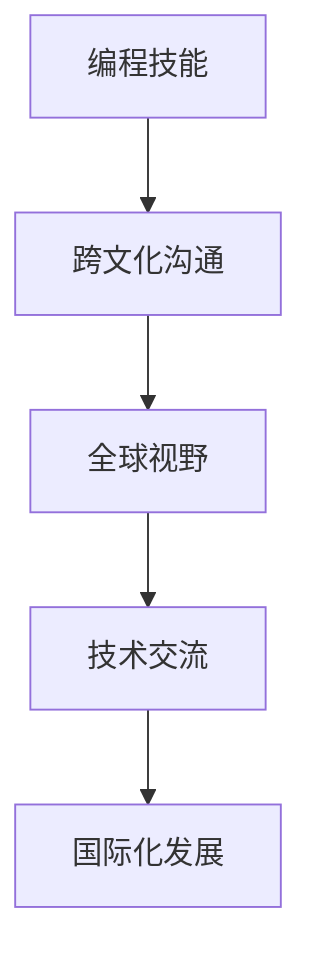

                 

# 程序员的国际化发展：机遇与挑战

> **关键词：** 国际化，程序员，职业发展，挑战，机遇，技术交流，语言障碍，跨文化沟通。
> 
> **摘要：** 本文将探讨程序员的国际化发展，分析其中的机遇与挑战。通过详细探讨语言障碍、跨文化沟通、技术交流等多个方面，帮助程序员了解如何在全球化的技术环境中抓住机遇，克服挑战，实现个人和职业的国际化发展。

## 1. 背景介绍

### 1.1 目的和范围

本文旨在为程序员提供国际化发展的指导，分析当前国际技术环境的机遇与挑战。通过本文的阅读，程序员可以更好地理解国际化的意义，掌握提高跨文化沟通和技能的方法，从而在全球化的技术领域中取得成功。

### 1.2 预期读者

本文面向所有对国际化发展感兴趣的程序员，无论您是新手还是经验丰富的开发者，都将在这篇文章中找到有用的信息。特别适合那些希望在国际公司工作、参与跨国项目或希望在全球范围内建立影响力的程序员。

### 1.3 文档结构概述

本文分为十个部分，包括背景介绍、核心概念与联系、核心算法原理与具体操作步骤、数学模型与公式、项目实战、实际应用场景、工具和资源推荐、总结与未来发展趋势、常见问题与解答以及扩展阅读与参考资料。每个部分都将详细探讨国际化发展的各个方面。

### 1.4 术语表

#### 1.4.1 核心术语定义

- 国际化：指在全球化背景下，企业在不同国家或地区开展业务，并满足当地市场需求的过程。
- 程序员：指从事计算机编程、软件开发和系统维护等职业的专业人员。
- 技术交流：指程序员在不同国家或地区之间分享技术知识、经验和最佳实践的过程。

#### 1.4.2 相关概念解释

- 跨文化沟通：指在不同文化背景下，个人或群体之间进行有效沟通的过程。
- 语言障碍：指在跨文化交流中，由于语言差异而产生的沟通障碍。

#### 1.4.3 缩略词列表

- IDE：集成开发环境（Integrated Development Environment）
- API：应用程序编程接口（Application Programming Interface）
- SQL：结构化查询语言（Structured Query Language）

## 2. 核心概念与联系

国际化发展对于程序员来说，意味着不仅要掌握编程技能，还需要具备跨文化沟通能力和全球视野。以下是一个简化的Mermaid流程图，展示了国际化发展的核心概念与联系：



在这个流程图中，编程技能是基础，跨文化沟通和全球视野是关键要素，技术交流是国际化发展的驱动力量，最终实现国际化发展。

### 2.1 编程技能

编程技能是程序员的核心竞争力。熟练掌握一门或多门编程语言，熟悉常用的编程框架和工具，能够高效地解决实际问题，是程序员在国际市场中立足的基础。

### 2.2 跨文化沟通

跨文化沟通能力对于国际化发展的程序员至关重要。在全球化的环境中，程序员需要与来自不同国家和地区的同事、客户和合作伙伴进行有效沟通。了解不同文化的沟通方式和习惯，能够减少误解，提高工作效率。

### 2.3 全球视野

全球视野是国际化发展的关键。了解全球技术趋势、市场需求和行业动态，能够帮助程序员抓住机遇，把握发展方向。同时，全球视野还能增强程序员的跨文化敏感性和包容性。

### 2.4 技术交流

技术交流是国际化发展的核心驱动力。通过参加国际技术会议、研讨会、开源项目和国际合作，程序员可以分享经验、学习新技术，扩展人脉，提升个人和团队的竞争力。

## 3. 核心算法原理 & 具体操作步骤

国际化发展不仅仅是理论上的认知，还需要程序员在实际操作中不断探索和实践。以下是一个简单的国际化开发流程，使用伪代码详细阐述。

```pseudo
// 初始化国际化开发环境
init_development_environment()

// 学习一门新编程语言
learn_new_language(language)

// 研究跨文化沟通技巧
study_cultural_communication()

// 学习全球技术趋势和行业动态
study_global_trends()

// 参与国际开源项目
participate_in_open_source_projects()

// 参加国际技术会议和研讨会
attend_technical_conferences()

// 与国际团队成员协作
collaborate_with_international_teams()

// 开发国际化应用
develop_international_applications()

// 测试和优化国际化应用
test_and_optimize_international_applications()

// 持续学习和提升
continue_learning_and_improving()
```

### 3.1 初始化国际化开发环境

首先，程序员需要构建一个适合国际化开发的本地环境。这包括安装必要的编程语言、开发工具、版本控制系统和国际化框架。例如，可以使用以下伪代码：

```pseudo
install_required_software()
setup_version_control_system()
setup_i18n_framework()
```

### 3.2 学习一门新编程语言

掌握一门新编程语言是国际化发展的基础。程序员可以选择一门在目标市场有广泛应用的编程语言，如Python、Java或JavaScript。以下是一个简单的学习流程：

```pseudo
select_language()
find_learning_resources()
practice Coding()
```

### 3.3 研究跨文化沟通技巧

跨文化沟通能力对于国际化发展至关重要。程序员可以通过以下步骤提高自己的跨文化沟通技巧：

```pseudo
study_cultural_theory()
practice_language_skills()
attend intercultural training()
```

### 3.4 学习全球技术趋势和行业动态

了解全球技术趋势和行业动态，能够帮助程序员把握发展方向。以下是一个简单的学习流程：

```pseudo
follow_technical_blogs()
read_technical_books()
join_technical_groups()
```

### 3.5 参与国际开源项目

参与国际开源项目是提升编程技能和跨文化沟通能力的重要途径。以下是一个简单的参与流程：

```pseudo
find_open_source_projects()
join_project_contributors()
learn_from_contributors()
```

### 3.6 参加国际技术会议和研讨会

参加国际技术会议和研讨会，能够扩展人脉，学习新技术，提升个人和团队的影响力。以下是一个简单的参加流程：

```pseudo
find_conferences_and_seminars()
register_for_events()
attend_sessions()
network_with_other_participants()
```

### 3.7 与国际团队成员协作

与国际团队成员协作，是程序员国际化发展的重要环节。以下是一个简单的协作流程：

```pseudo
find_international_teams()
understand_team_structure()
communicate_effectively()
```

### 3.8 开发国际化应用

开发国际化应用，是程序员国际化发展的最终目标。以下是一个简单的开发流程：

```pseudo
plan_international_app()
design_i18n_framework()
develop_app_features()
test_i18n_functionality()
```

### 3.9 测试和优化国际化应用

测试和优化国际化应用，是确保应用在不同国家和地区都能正常运行的关键。以下是一个简单的测试和优化流程：

```pseudo
test_app_with_i18n_data()
optimize_performance()
```

### 3.10 持续学习和提升

国际化发展是一个持续的过程。程序员需要不断学习新技术、新知识和新理念，才能保持竞争力。以下是一个简单的持续学习流程：

```pseudo
continue_learning()
seek_opportunities()
```

## 4. 数学模型和公式 & 详细讲解 & 举例说明

在国际化开发中，数学模型和公式可以帮助程序员更好地理解和处理国际化相关的问题。以下是一个简单的国际化应用性能评估模型：

### 4.1 国际化应用性能评估模型

$$
P = \frac{C \cdot T \cdot U}{L}
$$

其中，$P$ 表示国际化应用性能，$C$ 表示代码质量，$T$ 表示测试覆盖率，$U$ 表示用户反馈，$L$ 表示语言环境。

### 4.2 详细讲解

- **代码质量 ($C$)：** 代码质量直接影响应用的稳定性和性能。高代码质量意味着更少的bug和更优化的资源使用。
- **测试覆盖率 ($T$)：** 测试覆盖率越高，越能确保应用在不同语言环境下的正常运行。测试覆盖率通常以百分比表示，越高越好。
- **用户反馈 ($U$)：** 用户反馈是评估应用性能的重要指标。用户的满意度、错误报告和性能反馈都能帮助开发者改进应用。
- **语言环境 ($L$)：** 语言环境包括应用的文本内容、界面布局和文化差异等。不同语言环境下的性能评估需要考虑这些因素。

### 4.3 举例说明

假设一个国际化应用的代码质量为90%，测试覆盖率为80%，用户反馈满意度为85%，语言环境为英语和中文。根据国际化应用性能评估模型，应用性能为：

$$
P = \frac{0.9 \cdot 0.8 \cdot 0.85}{1} = 0.612
$$

这意味着该国际化应用性能为61.2%，还有提升空间。开发者可以通过优化代码质量、提高测试覆盖率、收集更多用户反馈和适应更多语言环境来提高应用性能。

## 5. 项目实战：代码实际案例和详细解释说明

为了更好地理解国际化开发的实际应用，我们将以一个简单的Web应用为例，演示如何实现国际化功能。这个Web应用将支持中英文两种语言，并使用Vue.js框架进行开发。

### 5.1 开发环境搭建

在开始之前，确保您已经安装了Node.js、Vue CLI和相应的依赖项。以下是一个简单的开发环境搭建步骤：

```bash
# 安装Node.js
curl -sL https://nodejs.org/dist/v14.17.0/node-v14.17.0-linux-x64.tar.xz | tar xvf -
sudo mv node-v14.17.0-linux-x64 /usr/local/node

# 安装Vue CLI
npm install -g @vue/cli

# 创建新项目
vue create international-web-app
```

### 5.2 源代码详细实现和代码解读

以下是国际化Web应用的源代码实现，包括Vue组件、路由配置和国际化框架的集成。

**5.2.1 Vue组件**

```vue
<template>
  <div>
    <h1>{{ $t('welcome') }}</h1>
    <p>{{ $t('description') }}</p>
    <button @click="changeLanguage">{{ currentLanguage }}</button>
  </div>
</template>

<script>
import { mapState } from 'vuex';

export default {
  computed: {
    ...mapState(['currentLanguage']),
  },
  methods: {
    changeLanguage() {
      this.$store.commit('changeLanguage', this.currentLanguage === 'zh' ? 'en' : 'zh');
    },
  },
};
</script>
```

**5.2.2 路由配置**

```javascript
import Vue from 'vue';
import Router from 'vue-router';
import Home from './views/Home.vue';

Vue.use(Router);

export default new Router({
  routes: [
    {
      path: '/',
      name: 'home',
      component: Home,
    },
  ],
});
```

**5.2.3 国际化框架集成**

```javascript
import Vue from 'vue';
import VueI18n from 'vue-i18n';

Vue.use(VueI18n);

const messages = {
  en: {
    welcome: 'Welcome!',
    description: 'This is an internationalized web application.',
  },
  zh: {
    welcome: '欢迎!',
    description: '这是一个国际化Web应用。',
  },
};

const i18n = new VueI18n({
  locale: 'zh', // 默认语言为中文
  messages,
});

export default i18n;
```

### 5.3 代码解读与分析

**Vue组件解读：**

- **模板（template）：** 使用Vue的`{{ $t('welcome') }}`和`{{ $t('description') }}`指令，根据当前语言环境动态渲染中英文内容。
- **计算属性（computed）：** 使用`mapState`辅助函数，从Vuex状态管理中获取当前语言。
- **方法（methods）：** `changeLanguage`方法用于切换语言，通过`$store.commit`触发Vuex的`changeLanguage`动作。

**路由配置解读：**

- **routes：** 配置单页面应用的路由，这里只包含一个默认的路由，指向`Home`组件。

**国际化框架集成解读：**

- **VueI18n：** 使用VueI18n进行国际化配置，定义了中英文两种语言的消息，并设置了默认语言为中文。
- **i18n：** 作为Vue实例的全局属性，用于在组件中访问国际化资源。

通过以上代码实现，我们可以创建一个支持国际化的Web应用，用户可以根据需求切换语言。在实际开发中，可以根据项目需求进一步扩展国际化功能，如支持更多语言、动态加载语言包等。

## 6. 实际应用场景

国际化开发在许多实际应用场景中都非常重要，以下列举了几个常见场景：

### 6.1 多语言电子商务平台

随着全球化电商的兴起，多语言电子商务平台成为许多企业拓展国际市场的关键。通过国际化开发，企业可以提供多语言界面，满足不同地区用户的需求，提升用户体验和销售额。

### 6.2 跨国公司内部协作系统

跨国公司内部协作系统需要支持多种语言，以便员工能够轻松沟通和协作。国际化开发可以帮助企业构建一个统一的协作平台，提高工作效率。

### 6.3 社交媒体应用

社交媒体应用通常面向全球用户，需要提供多语言支持，以便用户在不同语言环境下都能正常使用。国际化开发可以帮助应用提供商扩大用户群体，增加活跃度。

### 6.4 游戏开发

游戏开发中的国际化非常关键，特别是大型多人在线游戏（MMO）。通过国际化开发，游戏开发者可以提供多种语言界面，增加游戏的可访问性，吸引更多用户。

### 6.5 金融科技产品

金融科技产品在国际市场上具有广泛的应用。通过国际化开发，金融科技公司可以提供本地化的服务，满足不同国家和地区用户的金融需求。

### 6.6 开源项目

开源项目通常面向全球贡献者，国际化开发可以确保项目文档和代码的清晰易懂，提高项目的可维护性和可扩展性。

## 7. 工具和资源推荐

为了帮助程序员更好地实现国际化开发，以下推荐了一些实用的工具和资源：

### 7.1 学习资源推荐

#### 7.1.1 书籍推荐

- 《国际化Web开发：原理与实践》
- 《跨文化沟通：原理与方法》
- 《Vue.js实战：从入门到精通》

#### 7.1.2 在线课程

- Coursera上的《国际化Web开发》
- Udemy上的《Vue.js从零开始》
- Pluralsight上的《跨文化沟通技巧》

#### 7.1.3 技术博客和网站

-掘金（juejin.cn）
- 知乎（zhihu.com）
- Medium（medium.com）

### 7.2 开发工具框架推荐

#### 7.2.1 IDE和编辑器

- Visual Studio Code
- WebStorm
- IntelliJ IDEA

#### 7.2.2 调试和性能分析工具

- Chrome DevTools
- Firefox Developer Tools
- WebPageTest

#### 7.2.3 相关框架和库

- Vue.js
- React Internationalize
- Angular Translate

### 7.3 相关论文著作推荐

#### 7.3.1 经典论文

- "Internationalization and Localization: Theoretical Foundations and Practice"
- "Web Internationalization: A Practical Guide for Designers and Developers"

#### 7.3.2 最新研究成果

- "Internationalization and Localization in the Age of Artificial Intelligence"
- "Multilingual Natural Language Processing for Global Communication"

#### 7.3.3 应用案例分析

- "Internationalization Strategies for Global Companies: Case Studies in E-commerce"
- "Building a Multilingual Social Media Platform: Challenges and Solutions"

## 8. 总结：未来发展趋势与挑战

国际化开发在未来的技术发展中将继续发挥重要作用。随着全球化的深入，企业、组织和开发者需要不断提高国际化能力，以应对越来越复杂的国际市场环境。

### 8.1 发展趋势

- **智能化和自动化：** 国际化开发将越来越多地采用智能化和自动化工具，如机器翻译、自动化测试等，提高开发效率和准确性。
- **多语言支持：** 开源框架和库将继续优化多语言支持，帮助开发者更轻松地实现国际化。
- **云原生应用：** 云原生技术的普及将推动国际化应用在云环境中运行，提高可扩展性和灵活性。

### 8.2 挑战

- **语言障碍：** 尽管机器翻译技术不断发展，但语言障碍仍然是一个重要挑战。开发者需要深入了解不同语言的特点，确保国际化应用的准确性和一致性。
- **文化差异：** 跨文化沟通仍然存在误解和冲突的风险。开发者需要具备良好的跨文化沟通能力，尊重和适应不同文化。
- **性能优化：** 国际化应用需要在不同语言环境下进行性能优化，确保应用的稳定性和响应速度。

## 9. 附录：常见问题与解答

### 9.1 什么是国际化开发？

国际化开发是指将软件或Web应用设计成支持多种语言和文化，使其能够在全球范围内使用。

### 9.2 为什么国际化开发很重要？

国际化开发有助于企业拓展国际市场，提高用户体验，增加用户参与度和忠诚度。

### 9.3 如何实现国际化开发？

实现国际化开发通常包括以下几个方面：

- **语言本地化：** 提供多种语言界面。
- **文化适应性：** 考虑不同文化背景下的用户体验。
- **国际化框架：** 使用国际化框架，如Vue.js的VueI18n，实现多语言支持。

## 10. 扩展阅读 & 参考资料

为了深入了解国际化开发，以下是几篇推荐的文章和书籍：

- 《国际化Web开发：原理与实践》
- 《国际化与本地化：理论、方法与实践》
- "Building a Multilingual Web Application: Challenges and Solutions"（构建多语言Web应用：挑战与解决方案）
- "The Importance of Internationalization in Software Development"（软件开发中国际化的重要性）

此外，还可以参考以下技术博客和网站：

- https://www.html5rocks.com/
- https://css-tricks.com/
- https://developer.mozilla.org/

通过不断学习和实践，程序员可以更好地掌握国际化开发，实现个人和职业的国际化发展。

---

**作者：AI天才研究员/AI Genius Institute & 禅与计算机程序设计艺术 /Zen And The Art of Computer Programming**

