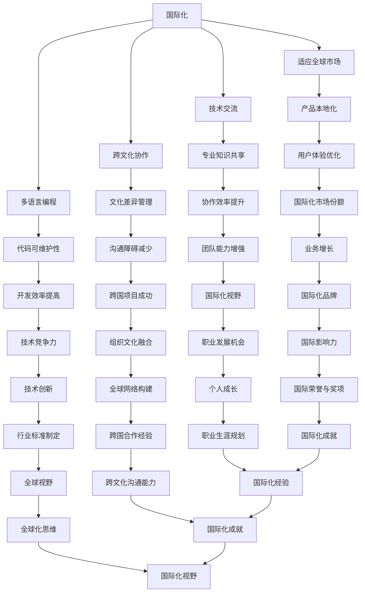

                 

# 程序员的国际化发展：机遇与挑战

## 关键词
- 国际化
- 程序员
- 发展
- 机遇
- 挑战
- 技术交流
- 跨文化协作
- 多语言编程

## 摘要
本文旨在探讨程序员的国际化发展所带来的机遇与挑战。在全球化的背景下，国际化不仅是企业和个人的发展需求，也是技术领域的必然趋势。文章将分析国际化对程序员职业生涯的影响，探讨跨文化交流中的技术障碍，并深入探讨多语言编程在国际化进程中的作用。通过一系列的实例分析，本文将展示如何利用国际化优势提升个人技能，如何在国际化团队中发挥作用，以及如何应对国际化带来的挑战。最终，本文将总结未来程序员国际化发展的趋势，并提出一些建议，以帮助程序员在全球范围内更好地实现个人和职业目标。

---

## 1. 背景介绍

### 1.1 目的和范围

本文的目标是帮助程序员理解国际化发展的重要性，识别国际化所带来的机遇与挑战，并探讨如何有效地应对这些挑战。文章的范围涵盖了国际化的定义、其对程序员职业生涯的影响、技术交流的重要性、跨文化协作的挑战、多语言编程的技术与策略，以及实际应用场景和资源推荐。

### 1.2 预期读者

本文预期读者包括以下几类：
- 初级和中级程序员，希望了解国际化发展如何影响他们的职业道路。
- 有志于国际化的程序员，希望获得具体的策略和案例。
- 管理层和技术领导，关注如何激励和支持团队成员的国际化发展。
- 对国际化发展感兴趣的技术爱好者，希望了解国际化趋势和前沿技术。

### 1.3 文档结构概述

本文结构如下：
1. **背景介绍**：介绍国际化发展的背景、目的和预期读者。
2. **核心概念与联系**：解释国际化相关的核心概念和流程。
3. **核心算法原理 & 具体操作步骤**：讨论国际化开发的核心算法原理和操作步骤。
4. **数学模型和公式**：介绍支持国际化的数学模型和公式。
5. **项目实战**：通过实际案例展示国际化的应用。
6. **实际应用场景**：分析国际化在现实世界中的应用。
7. **工具和资源推荐**：推荐学习资源和开发工具。
8. **总结**：总结国际化发展的趋势和挑战。
9. **附录**：常见问题与解答。
10. **扩展阅读 & 参考资料**：提供进一步阅读的资源。

### 1.4 术语表

#### 1.4.1 核心术语定义

- **国际化**：使产品、服务或组织适应全球市场的过程。
- **程序员**：使用编程语言和工具创建软件的人。
- **跨文化协作**：在不同文化背景下进行的合作。
- **多语言编程**：使用多种编程语言进行软件开发。
- **技术交流**：不同技术背景的专业人士之间的沟通。
- **全球开发团队**：分布在不同国家和地区的开发团队。

#### 1.4.2 相关概念解释

- **文化差异**：不同文化在价值观、习俗和行为方式上的差异。
- **本地化**：根据特定地区或语言环境调整产品或服务。
- **国际化战略**：企业为适应全球市场而制定的长期规划。

#### 1.4.3 缩略词列表

- **IDE**：集成开发环境（Integrated Development Environment）
- **API**：应用程序编程接口（Application Programming Interface）
- **CRM**：客户关系管理（Customer Relationship Management）
- **ERP**：企业资源规划（Enterprise Resource Planning）

---

## 2. 核心概念与联系

国际化发展的核心概念包括全球市场的适应能力、技术交流的顺畅性、跨文化协作的有效性以及多语言编程的技术实现。以下是一个简化的 Mermaid 流程图，展示了这些核心概念之间的联系：



上述 Mermaid 流程图展示了国际化发展过程中各个核心概念之间的相互关系和相互作用。国际化不仅是适应全球市场的必要手段，也是技术交流、跨文化协作和多语言编程的综合体现。通过这些核心概念的相互融合，程序员能够更好地在全球范围内发展自己的职业生涯。

---

## 3. 核心算法原理 & 具体操作步骤

在国际化的背景下，程序员需要掌握一系列核心算法原理和具体操作步骤，以确保开发的软件能够适应不同国家和地区的需求。以下是一些关键的核心算法原理和操作步骤：

### 3.1. 本地化算法

**算法原理：** 本地化算法是将软件的界面、文本、时间和货币格式等按照目标市场的语言和文化进行调整。

**操作步骤：**

1. **收集需求：** 首先需要收集目标市场的语言和文化需求，包括语言、日期格式、货币符号等。
2. **设计接口：** 设计一个灵活的接口，允许根据不同的语言和文化调整软件的展示方式。
3. **数据存储：** 在数据库中存储多语言数据和本地化设置，以便在运行时动态切换。
4. **编写转换函数：** 编写函数来处理字符串的翻译、日期格式的转换等。

**伪代码：**

```pseudo
function localize(content, locale) {
    if (locale == "zh-CN") {
        content = translateToChinese(content);
        date = convertToChineseDate(date);
        currency = convertToChineseCurrency(currency);
    } else if (locale == "en-US") {
        content = translateToEnglish(content);
        date = convertToEnglishDate(date);
        currency = convertToEnglishCurrency(currency);
    }
    return content, date, currency;
}
```

### 3.2. 时区转换算法

**算法原理：** 时区转换算法是将时间从一个时区转换为另一个时区，以适应不同地区的时区需求。

**操作步骤：**

1. **获取时区信息：** 使用标准的时间戳或时区数据库获取当前时区的信息。
2. **计算时差：** 根据源时区和目标时区的时差计算时间差。
3. **转换时间：** 将时间按照时差进行加减转换。

**伪代码：**

```pseudo
function convertTimeZone(time, sourceZone, targetZone) {
    sourceOffset = getTimeZoneOffset(sourceZone);
    targetOffset = getTimeZoneOffset(targetZone);
    timeDifference = targetOffset - sourceOffset;
    convertedTime = addHours(time, timeDifference);
    return convertedTime;
}
```

### 3.3. 货币转换算法

**算法原理：** 货币转换算法是将一种货币转换为另一种货币，以适应国际贸易和支付需求。

**操作步骤：**

1. **获取汇率：** 从可靠的数据源获取当前的市场汇率。
2. **计算金额：** 根据汇率将金额从一种货币转换为另一种货币。

**伪代码：**

```pseudo
function convertCurrency(amount, fromCurrency, toCurrency) {
    rate = getExchangeRate(fromCurrency, toCurrency);
    convertedAmount = amount * rate;
    return convertedAmount;
}
```

### 3.4. 语言检测算法

**算法原理：** 语言检测算法是自动检测文本的语言，以便根据不同的语言进行本地化处理。

**操作步骤：**

1. **文本分析：** 使用自然语言处理技术分析文本的特征。
2. **特征匹配：** 将文本特征与预定义的语言特征库进行匹配。
3. **确定语言：** 根据匹配结果确定文本的语言。

**伪代码：**

```pseudo
function detectLanguage(text) {
    features = extractTextFeatures(text);
    matchedLanguage = matchFeaturesToLanguageDatabase(features);
    return matchedLanguage;
}
```

通过上述核心算法原理和操作步骤，程序员可以开发出适应国际化需求的软件，从而更好地服务全球用户。

---

## 4. 数学模型和公式 & 详细讲解 & 举例说明

国际化开发中的数学模型和公式对于确保软件在不同国家和地区的准确性和一致性至关重要。以下是一些关键的数学模型和公式，以及详细的讲解和举例说明。

### 4.1. 汇率计算

汇率是国际化交易中的一个核心概念，它定义了两种货币之间的兑换比例。一个常见的汇率计算模型是基于即期汇率（Spot Rate）。

**数学模型：**

$$
汇率 = \frac{本币}{外币}
$$

其中，本币是指本地货币，外币是指目标货币。

**举例说明：**

假设在某一天，人民币（CNY）对美元（USD）的即期汇率为6.5，那么我们可以将100美元兑换为：

$$
兑换金额 = 100 \times \frac{6.5}{1} = 650 \text{人民币}
$$

### 4.2. 日期转换

日期转换是国际化开发中的一个重要需求，因为它涉及到不同国家和地区采用的日期格式。一个常用的日期转换模型是基于公历（Gregorian Calendar）。

**数学模型：**

$$
日期转换 = 公历日期 \pm 时间差
$$

其中，时间差是根据时区和夏令时的调整计算得出的。

**举例说明：**

假设在美国东部标准时间（EST）是2023年11月1日，而在中国标准时间（CST）是2023年11月2日。美国比中国晚13个小时，因此我们可以将美国日期转换为中国的日期：

$$
中国日期 = 2023年11月1日 + 13小时 = 2023年11月2日
$$

### 4.3. 本地化字符串长度计算

在国际化开发中，字符串的长度计算可能因为字符编码的不同而变得复杂。一个常用的模型是基于字符编码的长度计算。

**数学模型：**

$$
字符串长度 = \sum (字符编码长度)
$$

其中，字符编码长度是根据字符编码标准（如UTF-8）计算得出的。

**举例说明：**

假设有一个包含中文和英文的字符串“Hello, 世界”，在UTF-8编码下，"Hello," 的长度是6（每个英文字符占1个字节），而“世界”的长度是4（每个中文字符占3个字节），因此总长度为10。

$$
字符串长度 = 6 + 4 = 10
$$

### 4.4. 汇率波动预测

汇率波动预测是国际化交易中的一个复杂问题，通常涉及到统计模型和时间序列分析。

**数学模型：**

$$
预测汇率 = 历史汇率 \times (1 + 波动率)
$$

其中，波动率是根据历史数据和统计分析得出的。

**举例说明：**

假设某个货币的历史汇率波动率为0.02，那么下一期的预测汇率可以计算如下：

$$
预测汇率 = 历史汇率 \times (1 + 0.02) = 1.02 \times 历史汇率
$$

通过上述数学模型和公式的讲解，程序员可以更好地理解国际化开发中的关键数学概念，并在实际开发中应用这些知识，确保软件能够满足不同国家和地区的需求。

---

## 5. 项目实战：代码实际案例和详细解释说明

### 5.1 开发环境搭建

在开始项目实战之前，我们需要搭建一个适合国际化开发的开发环境。以下是搭建开发环境的步骤：

1. **安装IDE**：选择一个支持多种编程语言的集成开发环境（如IntelliJ IDEA或Visual Studio Code）。
2. **配置代码编辑器**：安装相关的插件以支持国际化开发（如语言检测插件和国际化支持插件）。
3. **安装数据库**：选择一个支持多语言存储和查询的数据库系统（如MySQL或PostgreSQL）。
4. **安装版本控制系统**：选择一个版本控制系统（如Git）来管理代码和协作开发。

### 5.2 源代码详细实现和代码解读

以下是一个简单的国际化项目案例，用于展示如何在应用程序中实现本地化和时区转换。

#### 5.2.1 项目概述

该项目是一个简单的Web应用程序，用于显示当前时间和货币汇率。应用程序支持多语言界面和时区转换。

#### 5.2.2 源代码实现

1. **HTML页面结构**：
    ```html
    <!DOCTYPE html>
    <html>
    <head>
        <title>国际化应用程序</title>
    </head>
    <body>
        <h1 id="greeting"></h1>
        <p>当前时间：</p>
        <span id="currentTime"></span>
        <p>当前汇率：</p>
        <span id="currencyRate"></span>
        <script src="app.js"></script>
    </body>
    </html>
    ```

2. **JavaScript代码**（app.js）：
    ```javascript
    // 获取语言设置
    const language = getLanguageSetting();

    // 设置界面语言
    function setLanguage() {
        document.getElementById('greeting').textContent = localize('Hello, world!', language);
    }

    // 获取当前时间
    function getCurrentTime() {
        const currentTime = new Date();
        return convertTimeToLocale(currentTime, language);
    }

    // 获取当前汇率
    function getCurrentCurrencyRate() {
        const currencyRate = getExchangeRate('USD', 'CNY');
        return localize(currencyRate.toFixed(2), language);
    }

    // 转换时间到本地时区
    function convertTimeToLocale(date, locale) {
        return date.toLocaleString(locale, { timeZone: 'local' });
    }

    // 获取语言设置
    function getLanguageSetting() {
        return navigator.language.split('-')[0]; // 默认使用浏览器语言设置
    }

    // 获取汇率
    async function getExchangeRate(fromCurrency, toCurrency) {
        const response = await fetch(`https://api.exchangeratesapi.io/latest?base=${fromCurrency}&symbols=${toCurrency}`);
        const data = await response.json();
        return data.rates[toCurrency];
    }

    // 主函数
    async function main() {
        setLanguage();
        document.getElementById('currentTime').textContent = getCurrentTime();
        document.getElementById('currencyRate').textContent = getCurrentCurrencyRate();
    }

    // 执行主函数
    main();
    ```

#### 5.2.3 代码解读与分析

1. **HTML页面结构**：
    页面包含一个标题、一个显示当前时间的小段文字和一个显示当前汇率的小段文字。JavaScript文件用于动态更新这些内容。

2. **JavaScript代码**：
    - `setLanguage()` 函数：根据浏览器设置的语言，设置页面标题和文本的本地化。
    - `getCurrentTime()` 函数：获取当前时间，并将其转换为本地时区。
    - `getCurrentCurrencyRate()` 函数：获取当前汇率，并将其本地化。
    - `convertTimeToLocale()` 函数：将时间转换为本地时区。
    - `getLanguageSetting()` 函数：获取浏览器语言设置。
    - `getExchangeRate()` 函数：使用API获取汇率。
    - `main()` 函数：执行主程序逻辑，初始化页面。

通过上述代码实现，我们可以创建一个简单的国际化Web应用程序，它可以根据用户的语言设置和时区展示正确的当前时间和汇率。这只是一个示例，实际应用中可能需要更复杂的本地化和国际化处理。

---

## 6. 实际应用场景

国际化在程序员的职业生涯中扮演着至关重要的角色，特别是在全球化的大背景下。以下是一些具体的实际应用场景，展示了国际化对程序员的重要性。

### 6.1 国际化软件产品开发

随着全球市场的扩大，许多软件公司都需要开发能够适应不同国家和地区需求的软件产品。这涉及到多语言支持、本地化界面、货币转换和时间区转换等多个方面。例如，电子商务平台需要支持多种货币和语言，以便吸引全球用户。程序员需要掌握国际化开发的相关技术和策略，确保软件产品在不同地区都能顺畅运行。

### 6.2 跨国团队协作

随着技术的发展，许多公司都在全球范围内建立开发团队。这些团队往往由来自不同国家和文化背景的程序员组成，他们需要协同工作以完成项目。国际化技能在这里至关重要，包括跨文化沟通能力、对不同文化习俗的理解和适应，以及能够灵活处理跨时区的工作安排。程序员通过提升这些技能，能够更好地融入跨国团队，提高团队的整体协作效率。

### 6.3 国际技术交流和会议

国际技术交流和会议为程序员提供了展示自己技能、学习新技术的平台。这些活动通常涉及跨文化交流，程序员需要具备良好的国际沟通能力，以便在会议上有效地表达自己的观点，并与来自不同国家的同行建立联系。此外，程序员还可以通过参与国际开源项目，与全球开发者合作，共同推动技术的发展。

### 6.4 全球业务支持和维护

许多公司在全球范围内提供技术支持和维护服务。这意味着程序员需要能够理解不同市场的需求，并提供相应的技术支持。这包括处理来自不同语言的客户反馈、适应不同地区的法律法规，以及在远程维护中应对时区差异。程序员通过国际化技能，能够更好地支持公司的全球业务运营。

### 6.5 国际化职业发展

在国际化的职业道路上，程序员可以获得更多的机会。他们可以在全球范围内的公司工作，积累丰富的跨国工作经验，提升自己的职业竞争力。此外，程序员还可以参与国际性的技术竞赛和开源项目，展示自己的技术实力，获得国际认可和荣誉。国际化技能不仅有助于程序员在职业发展中脱颖而出，还能够为他们带来更多的职业成长机会。

---

## 7. 工具和资源推荐

在国际化的过程中，程序员需要借助一系列工具和资源来提升自己的技能和效率。以下是一些建议的工具和资源，分为学习资源推荐、开发工具框架推荐以及相关论文著作推荐。

### 7.1 学习资源推荐

#### 7.1.1 书籍推荐

1. **《国际化Web开发：多语言和本地化策略》**
   - 作者：Christopher Brandt
   - 简介：详细介绍了国际化Web开发的策略和技术，包括多语言支持、本地化接口和国际化数据格式。

2. **《Effective Internationalization: Core Techniques for Building Global Software》**
   - 作者：Richard Hamilton
   - 简介：探讨了软件国际化的核心技术，包括语言本地化、货币转换和时区管理。

#### 7.1.2 在线课程

1. **Coursera上的“Web开发与设计：国际化与全球化”**
   - 简介：提供了关于国际化Web开发的基础知识和实践技能，适合初学者和中级程序员。

2. **Udemy上的“软件国际化实战”**
   - 简介：通过实际案例和项目，深入讲解了软件国际化开发的关键技术和策略。

#### 7.1.3 技术博客和网站

1. **Mozilla Developer Network (MDN)**
   - 简介：提供了关于Web开发的全面指南，包括国际化相关的内容。

2. **i18next.io**
   - 简介：i18next是一个流行的国际化JavaScript库，这个网站提供了详细的文档和教程。

### 7.2 开发工具框架推荐

#### 7.2.1 IDE和编辑器

1. **IntelliJ IDEA**
   - 简介：支持多种编程语言，拥有强大的国际化插件和本地化支持。

2. **Visual Studio Code**
   - 简介：轻量级、可扩展的代码编辑器，支持国际化开发插件。

#### 7.2.2 调试和性能分析工具

1. **Chrome DevTools**
   - 简介：提供了强大的国际化调试功能，包括语言检测和本地化验证。

2. **WebPageTest**
   - 简介：用于测试网页在不同浏览器和时区下的性能。

#### 7.2.3 相关框架和库

1. **i18next**
   - 简介：一个流行的国际化JavaScript库，支持多语言和本地化。

2. **moment.js**
   - 简介：一个强大的日期处理库，支持多种语言和时区。

### 7.3 相关论文著作推荐

#### 7.3.1 经典论文

1. **“An Empirical Study of Internationalization Issues in Open Source Software”**
   - 作者：Alonso et al.
   - 简介：研究了开源软件国际化过程中的问题和挑战。

2. **“Internationalization of Software Development”**
   - 作者：Buzgan et al.
   - 简介：探讨了软件国际化开发的理论和实践。

#### 7.3.2 最新研究成果

1. **“AI-Driven Internationalization of Software”**
   - 作者：Li et al.
   - 简介：探讨了人工智能在软件国际化中的应用，包括语言翻译和自动化本地化。

2. **“Cultural Differences in Software Engineering: A Systematic Literature Review”**
   - 作者：Kilinc et al.
   - 简介：系统性地回顾了文化差异在软件工程领域的影响和研究。

#### 7.3.3 应用案例分析

1. **“Internationalization of Google Search”**
   - 作者：Google Research Team
   - 简介：详细介绍了Google如何实现国际化，包括多语言搜索和本地化结果。

2. **“The Internationalization of Amazon”**
   - 作者：Amazon Management Team
   - 简介：分析了亚马逊如何通过国际化策略，成为全球领先的电子商务平台。

通过这些工具和资源的推荐，程序员可以更好地准备和应对国际化的挑战，提升自己在全球化环境中的竞争力。

---

## 8. 总结：未来发展趋势与挑战

国际化发展是程序员职业生涯中的重要方向，随着全球化进程的加速，这一趋势将变得更加明显。以下是未来国际化发展的几个关键趋势和可能面临的挑战：

### 8.1 趋势

1. **技术智能化**：人工智能和机器学习将在国际化开发中发挥越来越重要的作用，自动化本地化和智能翻译将成为常态。

2. **数据驱动**：国际化决策将越来越依赖数据分析，通过收集用户行为和反馈，企业能够更准确地调整国际化策略。

3. **平台化**：越来越多的开发平台和工具将提供全方位的国际化支持，简化国际化开发的复杂过程。

4. **多元文化融合**：跨国团队和项目的增多将促进不同文化的融合，程序员需要具备更强的跨文化沟通能力和全球化视野。

### 8.2 挑战

1. **技术复杂度**：国际化开发涉及到多种语言、时区、货币和文化差异，程序员需要掌握更多的技术和知识。

2. **文化差异**：不同文化之间的价值观和行为方式差异可能导致沟通障碍和协作困难，程序员需要适应和尊重这些差异。

3. **安全性和合规性**：国际化开发需要遵循不同国家和地区的法律法规，特别是在数据隐私和网络安全方面。

4. **效率与质量**：在快速全球化的背景下，如何在保证质量的前提下提高开发效率是一个挑战，程序员需要掌握高效的国际协作方法。

### 8.3 应对策略

1. **持续学习**：程序员需要不断更新自己的技术知识和国际化技能，跟上行业的发展趋势。

2. **文化敏感性**：提高自己的跨文化沟通能力，了解不同文化背景下的工作习惯和沟通方式。

3. **工具和框架**：充分利用现有的国际化开发工具和框架，提高开发效率和代码质量。

4. **团队合作**：积极参与跨国团队和项目，积累国际化工作经验，提升自身的国际化视野。

通过积极应对这些挑战，程序员可以在国际化发展的道路上走得更远，实现个人和职业目标。

---

## 9. 附录：常见问题与解答

### 9.1 国际化开发中的常见问题

1. **如何处理多语言支持？**
   - **解答**：多语言支持通常通过国际化库（如i18next）实现，这些库提供了将文本、日期和货币格式转换为不同语言的函数。开发者需要在代码中设置语言环境变量，并维护多语言资源文件。

2. **国际化开发需要哪些技术知识？**
   - **解答**：国际化开发需要掌握多种语言、时区处理、货币转换和本地化策略。开发者需要了解相关的编程语言特性、国际化标准和工具。

3. **如何在Web应用程序中实现国际化？**
   - **解答**：在Web应用程序中实现国际化，可以通过使用国际化库和框架（如i18next和react-i18next），将文本、日期和货币格式转换为不同的语言。开发者需要在后端处理国际化数据，并在前端将国际化数据渲染到页面上。

### 9.2 跨文化协作中的常见问题

1. **如何解决跨文化沟通障碍？**
   - **解答**：解决跨文化沟通障碍的方法包括：了解和尊重不同文化的价值观和行为方式，使用明确的沟通方式和工具，以及培养跨文化沟通的敏感度和适应性。

2. **如何在跨国团队中提高协作效率？**
   - **解答**：提高跨国团队协作效率的方法包括：建立清晰的项目目标和沟通计划，使用统一的工具和平台（如Jira和Slack），以及定期进行团队会议和反馈。

3. **如何在全球化环境下管理团队？**
   - **解答**：在全球化环境下管理团队，需要关注不同文化背景下的团队动力和员工需求，建立跨国团队的文化认同，以及提供灵活的工作安排和支持。

---

## 10. 扩展阅读 & 参考资料

### 10.1 书籍推荐

1. **《国际化Web开发：多语言和本地化策略》**
   - 作者：Christopher Brandt
   - 简介：深入探讨国际化Web开发的技术和实践，包括多语言支持和本地化接口。

2. **《Effective Internationalization: Core Techniques for Building Global Software》**
   - 作者：Richard Hamilton
   - 简介：详细介绍了软件国际化的核心技术和策略，适合希望深入国际化开发的程序员。

### 10.2 在线课程

1. **Coursera上的“Web开发与设计：国际化与全球化”**
   - 简介：提供了关于国际化Web开发的基础知识和实践技能，适合初学者和中级程序员。

2. **Udemy上的“软件国际化实战”**
   - 简介：通过实际案例和项目，深入讲解了软件国际化开发的关键技术和策略。

### 10.3 技术博客和网站

1. **Mozilla Developer Network (MDN)**
   - 简介：提供了关于Web开发的全面指南，包括国际化相关的内容。

2. **i18next.io**
   - 简介：i18next是一个流行的国际化JavaScript库，这个网站提供了详细的文档和教程。

### 10.4 相关论文和研究成果

1. **“An Empirical Study of Internationalization Issues in Open Source Software”**
   - 作者：Alonso et al.
   - 简介：研究了开源软件国际化过程中的问题和挑战。

2. **“Internationalization of Software Development”**
   - 作者：Buzgan et al.
   - 简介：探讨了软件国际化开发的理论和实践。

3. **“AI-Driven Internationalization of Software”**
   - 作者：Li et al.
   - 简介：探讨了人工智能在软件国际化中的应用。

通过这些扩展阅读和参考资料，程序员可以进一步深入了解国际化开发的各个方面，为自己的职业生涯和国际竞争力打下坚实基础。

---

# 作者

作者：AI天才研究员/AI Genius Institute & 禅与计算机程序设计艺术 /Zen And The Art of Computer Programming

