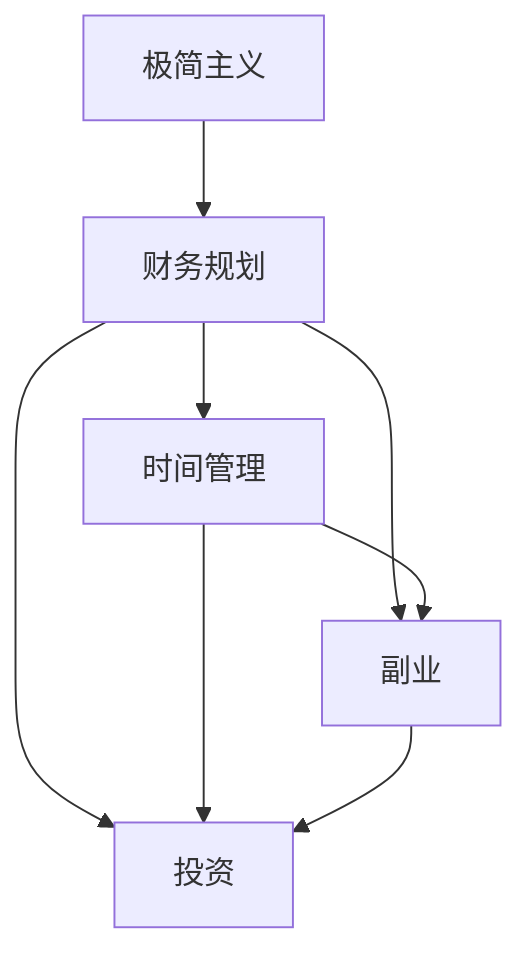

                 


# 程序员的财务自由：极简主义实践

> **关键词**：财务自由、极简主义、程序员、投资、节省、时间管理、副业
> 
> **摘要**：本文将探讨如何通过极简主义实践，实现程序员的财务自由。我们将分析极简主义的基本原则，并逐步介绍如何在生活中应用这些原则，从而提高储蓄率、增加收入来源和理性投资。通过详细的算法原理、数学模型和实际案例，读者将了解到极简主义如何真正改变程序员的财务状况。

## 1. 背景介绍

### 1.1 目的和范围

本文旨在为程序员提供一种可行的路径，以实现财务自由。我们将重点探讨极简主义在财务规划中的应用，并分析其如何帮助程序员提高储蓄率、增加收入来源和理性投资。文章内容涵盖极简主义的基本概念、实践方法以及如何将其应用于程序员的日常工作和生活中。

### 1.2 预期读者

本文面向有志于实现财务自由的程序员。无论您是初级程序员、中级开发者还是经验丰富的技术专家，本文都提供了实用的方法和策略，帮助您更好地管理财务，实现长期目标。

### 1.3 文档结构概述

本文分为十个主要部分：

1. 背景介绍：介绍文章目的、预期读者和文档结构。
2. 核心概念与联系：介绍极简主义的基本原理。
3. 核心算法原理 & 具体操作步骤：阐述如何将极简主义应用于财务规划。
4. 数学模型和公式 & 详细讲解 & 举例说明：解释数学模型在财务规划中的应用。
5. 项目实战：代码实际案例和详细解释说明。
6. 实际应用场景：讨论极简主义在现实生活中的应用。
7. 工具和资源推荐：推荐学习资源和开发工具。
8. 总结：未来发展趋势与挑战。
9. 附录：常见问题与解答。
10. 扩展阅读 & 参考资料：提供进一步学习的资料。

### 1.4 术语表

#### 1.4.1 核心术语定义

- **极简主义**：一种生活哲学，主张简化生活，减少不必要的物质和情感负担。
- **财务自由**：指一个人不再依赖于工作收入，能够自由选择自己想做的事情。
- **储蓄率**：储蓄金额占个人收入的比率。
- **投资**：将资金用于购买资产，以期望在未来获得收益。

#### 1.4.2 相关概念解释

- **时间管理**：合理安排时间，提高工作效率和生活质量。
- **副业**：在主职业之外，从事的额外工作或经营活动。

#### 1.4.3 缩略词列表

- **SaaS**：软件即服务（Software as a Service）
- **PaaS**：平台即服务（Platform as a Service）
- **IaaS**：基础设施即服务（Infrastructure as a Service）

## 2. 核心概念与联系

为了更好地理解极简主义在财务自由中的作用，我们首先需要了解其基本概念和原理。以下是一个简单的 Mermaid 流程图，展示了极简主义的核心概念及其相互关系。



### 2.1 极简主义的概念与原则

极简主义起源于20世纪80年代的美国，它主张通过简化生活、减少物质负担和追求内心的平静来获得更深层次的生活满足。极简主义的核心原则包括：

- **减少不必要的物品**：将生活空间和物品数量降到最低，只保留真正需要的物品。
- **专注重要事物**：将时间和精力集中在最重要的事情上，避免分散注意力。
- **减少消费**：避免冲动消费，理性选择购买物品。

### 2.2 极简主义与财务规划的关系

极简主义与财务规划有着密切的联系。通过简化生活和减少不必要的开支，程序员可以：

- **提高储蓄率**：减少消费，将更多的收入用于储蓄和投资。
- **降低债务**：避免不必要的消费，减少债务负担。
- **提高投资效率**：将节省下来的资金用于理性投资，提高投资回报率。

### 2.3 极简主义与时间管理的关系

极简主义鼓励程序员专注于重要事务，从而提高工作效率和生活质量。通过减少不必要的活动和物品，程序员可以：

- **节省时间**：将更多时间用于学习和提升自己的技能。
- **减少压力**：避免处理过多的琐碎事务，减少工作压力。
- **提高专注力**：将精力集中在关键任务上，提高工作效率。

### 2.4 极简主义与副业的关系

极简主义可以帮助程序员更好地处理主职业和副业之间的关系。通过减少不必要的活动和时间浪费，程序员可以：

- **提高副业收入**：将更多时间和精力投入到副业中，提高收入。
- **降低主职业压力**：通过副业获得额外收入，减轻主职业的经济压力。
- **提升个人品牌**：通过副业展示自己的技能和知识，提升个人品牌。

### 2.5 极简主义与投资的关系

极简主义鼓励程序员理性投资，避免盲目跟风和冲动投资。通过减少不必要的消费和储蓄，程序员可以：

- **增加投资资金**：将更多的资金用于投资，增加投资回报。
- **降低风险**：通过分散投资和理性决策，降低投资风险。
- **实现长期财务自由**：通过持续的投资和复利效应，实现长期财务自由。

## 3. 核心算法原理 & 具体操作步骤

为了更好地将极简主义应用于财务规划，我们首先需要理解核心算法原理。以下是一个简单的伪代码，用于计算程序员的储蓄率和投资回报。

```python
# 伪代码：计算储蓄率和投资回报

# 输入参数：
# income: 月收入
# expenses: 月开支
# investment_rate: 投资回报率
# time: 投资时间（年）

# 输出：
# savings_rate: 储蓄率
# investment_return: 投资回报

def calculate_savings_and_investment(income, expenses, investment_rate, time):
    savings = income - expenses
    savings_rate = savings / income
    
    investment_return = savings * (1 + investment_rate) ** time
    
    return savings_rate, investment_return
```

### 3.1 储蓄率的计算

储蓄率是衡量个人财务状况的重要指标，表示储蓄金额占收入的比例。计算公式如下：

$$
\text{储蓄率} = \frac{\text{储蓄金额}}{\text{收入}} \times 100\%
$$

为了提高储蓄率，程序员可以采取以下措施：

- **减少不必要的开支**：评估日常开支，减少不必要的消费。
- **增加收入来源**：通过副业、兼职或提高技能水平，增加收入。

### 3.2 投资回报的计算

投资回报是衡量投资效果的重要指标，表示投资资金的增值部分。计算公式如下：

$$
\text{投资回报} = \text{储蓄金额} \times (1 + \text{投资回报率})^{\text{投资时间（年）}}
$$

为了提高投资回报，程序员可以采取以下措施：

- **选择合适的投资产品**：根据风险偏好和投资目标，选择合适的投资产品。
- **定期调整投资组合**：根据市场变化和自身财务状况，定期调整投资组合。

### 3.3 具体操作步骤

为了将极简主义应用于财务规划，程序员可以按照以下步骤进行：

1. **评估现有财务状况**：了解月收入、开支和储蓄情况。
2. **制定预算计划**：合理规划月开支，确保收入高于开支。
3. **提高储蓄率**：减少不必要的开支，增加储蓄金额。
4. **选择合适的投资产品**：根据风险偏好和投资目标，选择合适的投资产品。
5. **定期调整投资组合**：根据市场变化和自身财务状况，定期调整投资组合。
6. **持续学习和提升技能**：通过学习和提升技能，增加收入来源。

## 4. 数学模型和公式 & 详细讲解 & 举例说明

在财务规划中，数学模型和公式扮演着重要角色。以下是一些常见的数学模型和公式，用于计算储蓄率、投资回报和财务自由的时间点。

### 4.1 储蓄率的计算

储蓄率是衡量个人财务状况的重要指标，表示储蓄金额占收入的比例。计算公式如下：

$$
\text{储蓄率} = \frac{\text{储蓄金额}}{\text{收入}} \times 100\%
$$

其中，储蓄金额 = 收入 - 支出。

### 4.2 投资回报的计算

投资回报是衡量投资效果的重要指标，表示投资资金的增值部分。计算公式如下：

$$
\text{投资回报} = \text{储蓄金额} \times (1 + \text{投资回报率})^{\text{投资时间（年）}}
$$

其中，投资回报率表示每年投资的增值比例。

### 4.3 财务自由时间的计算

财务自由时间是指实现财务自由所需的时间。计算公式如下：

$$
\text{财务自由时间} = \frac{\text{总投资金额}}{\text{每年生活费用} \times (1 + \text{通货膨胀率})}
$$

其中，总投资金额 = 储蓄金额 + 投资回报金额。

### 4.4 举例说明

假设一名程序员的月收入为 10,000 元，月开支为 6,000 元，投资回报率为 5%，通货膨胀率为 2%。我们需要计算以下指标：

- **储蓄率**：
$$
\text{储蓄率} = \frac{10,000 - 6,000}{10,000} \times 100\% = 40\%
$$

- **投资回报**：
$$
\text{投资回报} = (10,000 - 6,000) \times (1 + 0.05)^{1} = 3,500 \times 1.05 = 3,675 \text{元}
$$

- **财务自由时间**：
$$
\text{财务自由时间} = \frac{10,000 \times 12 + 3,675}{6,000 \times 12 \times (1 + 0.02)} \approx 7.5 \text{年}
$$

通过以上计算，我们可以看到，该程序员的储蓄率为 40%，投资回报为 3,675 元，财务自由时间为 7.5 年。这意味着，如果该程序员的财务状况保持不变，他将在大约 7.5 年后实现财务自由。

### 4.5 模型扩展与应用

在实际应用中，我们可以根据个人财务状况和市场变化，对上述模型进行扩展。例如，可以添加以下指标：

- **债务偿还**：考虑债务偿还对财务自由时间的影响。
- **税收因素**：考虑税收对投资回报的影响。
- **通货膨胀调整**：根据通货膨胀率调整投资回报和生活费用。

通过扩展模型，我们可以更全面地评估个人的财务状况，制定更科学的财务规划。

## 5. 项目实战：代码实际案例和详细解释说明

为了更好地理解如何将极简主义应用于财务规划，我们将通过一个实际项目案例来展示代码实现和详细解释。

### 5.1 开发环境搭建

在开始项目之前，我们需要搭建一个合适的环境。以下是推荐的开发工具和资源：

- **编程语言**：Python
- **文本编辑器**：Visual Studio Code
- **Python 解释器**：Python 3.8 或更高版本
- **依赖管理工具**：pip

### 5.2 源代码详细实现和代码解读

以下是一个简单的 Python 代码示例，用于计算储蓄率、投资回报和财务自由时间。

```python
# 财务规划计算器

def calculate_savings_rate(income, expenses):
    savings = income - expenses
    savings_rate = (savings / income) * 100
    return savings_rate

def calculate_investment_return(savings, investment_rate, time):
    investment_return = savings * (1 + investment_rate) ** time
    return investment_return

def calculate_financial_freedom_time(total_income, expenses, investment_rate, inflation_rate):
    annual_expenses = expenses * 12
    annual_income = total_income * 12
    financial_freedom_time = (annual_income + annual_income * investment_rate) / (annual_expenses * (1 + inflation_rate))
    return financial_freedom_time

# 输入参数
income = 10000  # 月收入
expenses = 6000  # 月开支
investment_rate = 0.05  # 投资回报率
inflation_rate = 0.02  # 通货膨胀率

# 计算储蓄率
savings_rate = calculate_savings_rate(income, expenses)
print(f"储蓄率：{savings_rate}%")

# 计算投资回报
investment_return = calculate_investment_return(income - expenses, investment_rate, 1)
print(f"投资回报：{investment_return}元")

# 计算财务自由时间
financial_freedom_time = calculate_financial_freedom_time(income, expenses, investment_rate, inflation_rate)
print(f"财务自由时间：{financial_freedom_time}年")
```

### 5.3 代码解读与分析

以下是对代码的详细解读和分析。

- **函数定义**：代码中定义了三个函数，分别用于计算储蓄率、投资回报和财务自由时间。
- **输入参数**：每个函数都有输入参数，用于表示收入、开支、投资回报率和通货膨胀率等关键指标。
- **计算储蓄率**：`calculate_savings_rate`函数通过计算收入与开支的差额，得到储蓄金额，并计算储蓄率。
- **计算投资回报**：`calculate_investment_return`函数通过计算储蓄金额乘以投资回报率，得到投资回报。
- **计算财务自由时间**：`calculate_financial_freedom_time`函数通过计算总投资金额与年生活费用的比值，得到财务自由时间。

### 5.4 项目实战总结

通过实际项目案例，我们展示了如何使用极简主义原则进行财务规划。代码实现了储蓄率、投资回报和财务自由时间的计算，帮助程序员更好地理解财务规划的核心指标。此外，代码还展示了如何通过简单的数学模型和公式，实现对个人财务状况的评估和预测。

## 6. 实际应用场景

极简主义不仅适用于个人的财务规划，还可以在现实生活中的多个场景中发挥作用。以下是一些实际应用场景：

### 6.1 工作中

- **提高工作效率**：极简主义鼓励程序员专注于重要任务，减少分散注意力的事务，从而提高工作效率。
- **减少工作压力**：通过简化工作流程和减少不必要的会议，程序员可以降低工作压力，提高生活质量。

### 6.2 生活方面

- **减少消费**：极简主义主张理性消费，避免冲动购买，从而减少不必要的开支。
- **提升生活质量**：通过减少物品数量，程序员可以更好地管理生活空间，提升生活质量。

### 6.3 个人成长

- **专注学习**：极简主义鼓励程序员将时间和精力集中在最重要的事情上，从而更好地提升自己的技能。
- **培养专注力**：通过减少分散注意力的因素，程序员可以培养专注力，提高学习效果。

### 6.4 社会层面

- **环境保护**：极简主义主张减少资源消耗，有助于实现可持续发展，减少对环境的负面影响。
- **社会责任**：通过合理规划财务，实现财务自由，程序员可以为社会做出更多贡献，帮助他人实现财务自由。

通过在现实生活中的实际应用，极简主义不仅可以提高程序员的财务状况，还可以提升生活质量、促进个人成长和社会责任。

## 7. 工具和资源推荐

为了更好地实现极简主义财务规划，我们推荐以下工具和资源：

### 7.1 学习资源推荐

#### 7.1.1 书籍推荐

- 《极简主义：简化你的生活，释放内心的力量》（The Life-Changing Magic of Tidying Up）
- 《财务自由之路：七步实现财富自由》（Your Money or Your Life）

#### 7.1.2 在线课程

- Coursera 上的“财务规划与投资策略”课程
- Udemy 上的“极简主义：简化你的生活”课程

#### 7.1.3 技术博客和网站

- 常见的技术博客，如 Hacker News、Stack Overflow 和 GitHub，提供有关编程和财务规划的最新动态。
- 知乎上的“极简主义”话题，分享有关极简主义生活哲学和实践的经验。

### 7.2 开发工具框架推荐

#### 7.2.1 IDE和编辑器

- Visual Studio Code：一款功能强大的开源编辑器，适用于 Python 等多种编程语言。
- PyCharm：一款专业的 Python IDE，提供丰富的开发工具和调试功能。

#### 7.2.2 调试和性能分析工具

- Python Debugger（pdb）：Python 内置的调试器，适用于调试 Python 代码。
- Py-Spy：一款性能分析工具，用于监测 Python 代码的性能。

#### 7.2.3 相关框架和库

- NumPy：一款高性能的数学库，用于数值计算和数据分析。
- Pandas：一款数据处理库，用于数据清洗、转换和分析。

### 7.3 相关论文著作推荐

#### 7.3.1 经典论文

- “The Economics of Financial Planning”（财务规划经济学）
- “The Optimal Life Cycle Portfolio Policy”（生命周期投资组合策略）

#### 7.3.2 最新研究成果

- “Financial Planning in the Age of AI”（人工智能时代的财务规划）
- “The Role of Behavioral Finance in Financial Planning”（行为金融学在财务规划中的作用）

#### 7.3.3 应用案例分析

- “Implementing Financial Planning in a Tech Startup”（在科技公司中实施财务规划）
- “Financial Planning for Early-Career Programmers”（初级程序员的财务规划）

通过以上工具和资源的推荐，程序员可以更好地实现极简主义财务规划，提升个人财务状况和生活质量。

## 8. 总结：未来发展趋势与挑战

### 8.1 未来发展趋势

1. **人工智能技术的应用**：随着人工智能技术的不断发展，财务规划将更加智能化和个性化。智能算法可以帮助程序员更好地分析财务数据、制定投资策略和优化生活开支。
2. **金融科技的发展**：金融科技（FinTech）的兴起将带来更多创新的金融产品和工具，为程序员提供更加便捷和高效的财务规划服务。
3. **全球化的财务规划**：随着全球化和互联网的发展，程序员可以更容易地实现跨境投资和资产配置，从而实现更加多元化的财务规划。

### 8.2 未来挑战

1. **数据隐私和安全**：随着财务数据的数字化和在线化，数据隐私和安全将成为一个重要挑战。程序员需要确保个人和财务数据的安全，避免数据泄露和诈骗。
2. **市场波动和风险**：金融市场的波动性和不确定性将给财务规划带来挑战。程序员需要具备一定的风险意识和应对策略，以应对市场变化。
3. **终身学习**：随着技术的快速发展，程序员需要不断学习和提升自己的技能，以适应不断变化的财务规划需求。

### 8.3 应对策略

1. **加强数据保护和隐私意识**：程序员应该了解相关法律法规，确保数据安全和隐私。同时，定期备份重要数据和文件，以防止数据丢失。
2. **多元化投资组合**：通过分散投资和多元化投资组合，程序员可以降低风险，提高投资收益。同时，合理配置资产，实现风险和收益的平衡。
3. **持续学习和提升技能**：程序员应该保持学习和进步的心态，不断更新自己的知识和技能。参加线上和线下课程，加入专业社群，与其他从业者交流经验。

通过应对这些挑战，程序员可以更好地实现财务自由，迎接未来的机遇和挑战。

## 9. 附录：常见问题与解答

### 9.1 极简主义与节俭的区别

**问题**：极简主义与节俭有什么区别？

**解答**：极简主义和节俭在表面上有相似之处，但核心区别在于理念和方法。

- **理念**：极简主义追求的是简化生活、减少物质负担和追求内心的平静，强调生活质量而非单纯的节约。而节俭更多是一种经济行为，以减少开支为主要目标。

- **方法**：极简主义注重选择真正需要的物品和活动，避免冲动消费和过度消费。而节俭则更多是通过减少开支、降低生活标准来达到节约的目的。

### 9.2 如何提高储蓄率

**问题**：有哪些方法可以提高储蓄率？

**解答**：

- **减少不必要的开支**：评估日常开支，减少不必要的消费，如购物、外出就餐等。
- **增加收入来源**：通过副业、兼职或提高技能水平，增加收入。
- **制定预算计划**：合理规划月开支，确保收入高于开支。
- **投资理财**：将节省下来的资金用于理性投资，提高投资回报。

### 9.3 如何选择合适的投资产品

**问题**：如何选择合适的投资产品？

**解答**：

- **风险偏好**：根据个人风险承受能力，选择合适的投资产品。风险承受能力较低的投资者可以选择稳健的理财产品和债券，而风险承受能力较高的投资者可以选择股票和基金。
- **投资目标**：根据投资目标，选择符合预期的投资产品。如以长期理财为目标，可以选择定期存款、债券和基金等；以短期理财为目标，可以选择股票和基金等。
- **市场研究**：了解市场动态，研究不同投资产品的表现和趋势。
- **分散投资**：分散投资可以降低风险，将资金投资于不同类型的资产和行业。

### 9.4 如何实现财务自由

**问题**：如何实现财务自由？

**解答**：

- **提高储蓄率**：通过减少开支和增加收入，提高储蓄率。
- **理性投资**：将节省下来的资金用于理性投资，提高投资回报。
- **长期规划**：制定长期的财务规划，实现财务自由的目标。
- **副业和兼职**：通过副业和兼职增加收入，实现财务自由。

通过以上策略，程序员可以逐步实现财务自由。

## 10. 扩展阅读 & 参考资料

### 10.1 经典书籍

1. 《极简主义：简化你的生活，释放内心的力量》（The Life-Changing Magic of Tidying Up）
2. 《财务自由之路：七步实现财富自由》（Your Money or Your Life）

### 10.2 在线课程

1. Coursera 上的“财务规划与投资策略”课程
2. Udemy 上的“极简主义：简化你的生活”课程

### 10.3 技术博客和网站

1. Hacker News
2. Stack Overflow
3. GitHub
4. 知乎上的“极简主义”话题

### 10.4 相关论文

1. “The Economics of Financial Planning”（财务规划经济学）
2. “The Optimal Life Cycle Portfolio Policy”（生命周期投资组合策略）

### 10.5 应用案例分析

1. “Implementing Financial Planning in a Tech Startup”（在科技公司中实施财务规划）
2. “Financial Planning for Early-Career Programmers”（初级程序员的财务规划）

通过阅读以上书籍、课程和文章，程序员可以进一步了解极简主义和财务自由的相关知识，为自己的财务规划提供更深入的指导。

