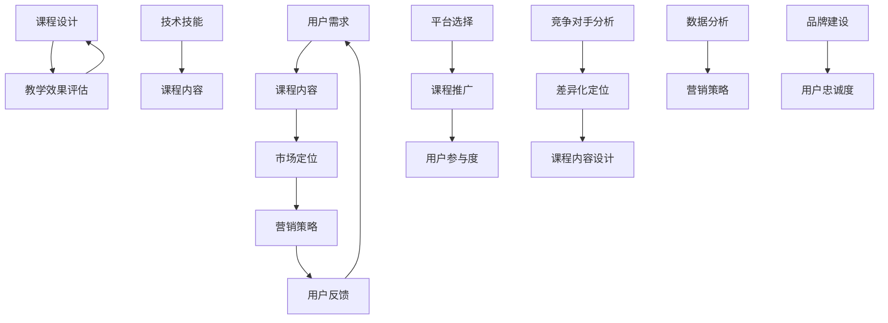
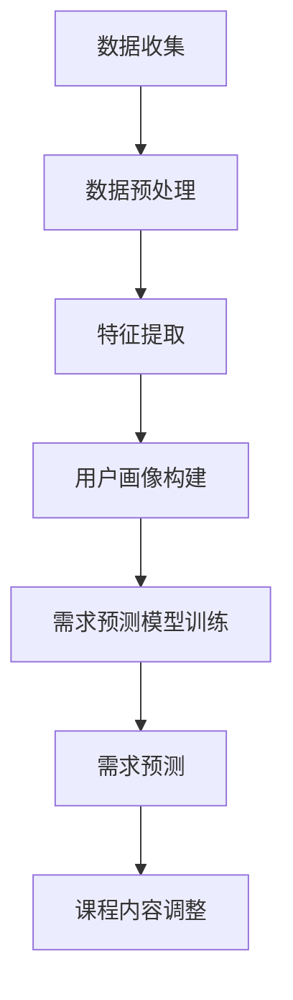

                 

### 程序员知识付费：打造差异化课程

> **关键词**：程序员，知识付费，差异化课程，内容策略，营销技巧，用户需求分析，教育平台

> **摘要**：本文将探讨程序员如何在知识付费领域打造差异化课程，通过分析用户需求、市场趋势和课程内容，提供一系列策略和营销技巧。本文旨在帮助程序员提升课程吸引力，提高课程销售和用户满意度，实现知识付费的可持续增长。

### 1. 背景介绍

#### 1.1 目的和范围

在信息技术飞速发展的今天，程序员作为数字时代的核心力量，不仅需要不断更新自己的技术栈，还必须具备优秀的教育和传播能力。知识付费作为一个新兴的市场，为程序员提供了一个通过分享专业知识和技能获取收益的平台。然而，随着越来越多的程序员进入这个市场，竞争也愈发激烈。如何在这片红海中脱颖而出，打造出具有差异化的课程，成为每位想要在知识付费领域取得成功的程序员必须思考的问题。

本文旨在为程序员提供一套系统化的策略，帮助他们分析市场需求，设计出具有吸引力的课程内容，并运用有效的营销手段，提高课程的知名度与销售量。我们将从以下几个方面进行探讨：

- 用户需求分析
- 课程内容设计
- 营销策略与执行
- 教学效果评估与优化

通过这些策略，程序员不仅可以更好地满足用户的需求，还能在竞争激烈的市场中树立个人品牌，实现知识付费的可持续发展。

#### 1.2 预期读者

本文的预期读者主要包括以下几类：

1. **有志于从事知识付费的程序员**：希望通过本文获取系统化的知识和方法，提升课程设计能力和营销效果。
2. **已经进入知识付费领域的程序员**：希望找到新的方向和方法，优化现有课程，提升市场竞争力。
3. **教育行业从业者**：对知识付费模式感兴趣，希望了解程序员在这一领域的实践经验。
4. **对技术教育和知识传播有兴趣的读者**：希望通过本文了解程序员在知识付费领域的挑战与机遇。

无论您属于哪一类读者，本文都将为您提供一个全面、深入的指导，帮助您在知识付费领域取得成功。

#### 1.3 文档结构概述

本文将分为以下几部分：

1. **背景介绍**：介绍知识付费市场的现状和本文的目的。
2. **用户需求分析**：探讨程序员需要了解的用户需求和市场趋势。
3. **课程内容设计**：提供课程内容设计的策略和步骤。
4. **营销策略与执行**：介绍如何制定和执行有效的营销策略。
5. **教学效果评估与优化**：讨论如何评估和优化课程的教学效果。
6. **案例研究**：通过具体案例展示策略的实际应用。
7. **总结**：总结文章的主要观点，并探讨未来发展趋势。

#### 1.4 术语表

在本文中，我们将使用一些特定的术语。以下是对这些术语的定义和解释：

#### 1.4.1 核心术语定义

- **知识付费**：用户为获取特定知识或技能，付费购买的教育产品或服务。
- **差异化课程**：在课程内容、形式或教学方法上具有独特性和创新性的课程。
- **用户需求分析**：通过市场调研和用户反馈，了解用户在知识付费方面的需求和偏好。
- **课程内容设计**：根据用户需求和课程目标，规划课程的内容、结构和教学方式。
- **营销策略**：为了推广和销售课程，采用的一系列方法和手段。

#### 1.4.2 相关概念解释

- **用户画像**：基于用户的行为数据、兴趣偏好等信息，构建的虚拟用户模型。
- **课程定位**：根据目标用户群体的特点和课程内容，确定课程的市场定位和目标。
- **市场调研**：通过问卷、访谈等方式，收集和分析市场信息和用户反馈。

#### 1.4.3 缩略词列表

- **KPI**：关键绩效指标（Key Performance Indicator）
- **SEO**：搜索引擎优化（Search Engine Optimization）
- **SMM**：社交媒体营销（Social Media Marketing）

### 2. 核心概念与联系

在知识付费市场中，程序员需要理解并运用多个核心概念，这些概念相互联系，共同构成了程序员在知识付费领域的成功路径。以下是对这些核心概念及其相互关系的详细解释，并附上 Mermaid 流程图。



#### 2.1 用户需求

用户需求是知识付费市场中最基础也是最重要的核心概念。程序员需要通过市场调研、用户画像分析等手段，深入了解目标用户的需求、兴趣、行为和痛点。这些需求将直接影响课程内容的设计和市场定位。

#### 2.2 课程内容

课程内容是知识付费的核心产品。程序员需要根据用户需求设计出具有吸引力和实用性的课程内容。课程内容不仅要涵盖用户感兴趣的技术主题，还需要通过创新的教学方法和结构设计，提升用户的参与度和满意度。

#### 2.3 市场定位

市场定位是课程成功的关键。程序员需要根据用户需求和竞争对手分析，确定课程的目标用户群体和课程的市场定位。一个清晰的市场定位可以帮助程序员在激烈的市场竞争中脱颖而出。

#### 2.4 营销策略

营销策略是推广和销售课程的重要手段。程序员需要结合用户需求、课程内容和市场定位，制定有效的营销策略。这包括SEO、SMM、广告投放等多种方法，旨在提高课程的知名度和用户参与度。

#### 2.5 用户反馈

用户反馈是优化课程设计和营销策略的重要依据。程序员需要通过多种渠道收集用户反馈，及时调整课程内容和营销策略，以提升用户满意度和忠诚度。

#### 2.6 课程设计

课程设计是将用户需求、市场定位和营销策略转化为实际课程的过程。程序员需要具备优秀的教学设计能力，确保课程内容结构合理、教学方法有效。

#### 2.7 教学效果评估

教学效果评估是衡量课程质量和用户满意度的关键。程序员需要通过测试、反馈和数据分析等手段，评估课程的教学效果，并据此进行优化。

#### 2.8 技术技能

技术技能是程序员的核心竞争力。程序员需要不断提升自己的技术能力，确保课程内容的实用性和前沿性。

#### 2.9 平台选择

平台选择是课程推广的重要环节。程序员需要选择适合自己课程特点和目标用户的平台，以提高课程的曝光率和销售量。

#### 2.10 用户参与度

用户参与度是衡量课程成功与否的重要指标。程序员需要通过互动、反馈和用户激励等手段，提高用户的参与度和满意度。

#### 2.11 竞争对手分析

竞争对手分析是制定差异化课程和市场定位的重要步骤。程序员需要了解竞争对手的课程内容、营销策略和用户反馈，以便制定更具竞争力的课程策略。

#### 2.12 数据分析

数据分析是优化营销策略和教学效果的重要工具。程序员需要运用数据分析工具，收集和处理用户行为数据，以支持决策和优化。

#### 2.13 品牌建设

品牌建设是程序员在知识付费市场长期发展的关键。一个强大的个人品牌可以提升课程的吸引力和用户忠诚度。

### 3. 核心算法原理 & 具体操作步骤

在知识付费市场中，核心算法原理的应用可以显著提高课程设计的科学性和教学效果。以下是一个具体的用户需求分析算法原理及其实际操作步骤：

#### 3.1 算法原理概述

用户需求分析算法基于机器学习和用户行为数据，旨在从大量数据中提取用户的关键需求和偏好，从而指导课程内容的设计和优化。

#### 3.2 算法流程图



#### 3.3 具体操作步骤

##### 3.3.1 数据收集

1. **用户行为数据**：收集用户在课程平台上的浏览、学习、评价等行为数据。
2. **用户反馈数据**：收集用户对课程的直接反馈，如问卷调查、评论等。
3. **技术论坛和博客**：从相关技术论坛、博客等渠道收集用户的技术需求和学习内容。

##### 3.3.2 数据预处理

1. **数据清洗**：去除重复、错误和无用的数据。
2. **数据整合**：将不同来源的数据进行整合，形成统一的用户行为数据集。
3. **数据标准化**：对数据进行标准化处理，使其适合进行机器学习分析。

##### 3.3.3 特征提取

1. **行为特征**：提取用户在学习过程中的行为特征，如学习时长、学习频率、参与度等。
2. **文本特征**：提取用户反馈中的关键词和主题，使用自然语言处理技术。
3. **技术技能特征**：根据用户的技术背景和技能水平，提取相关技术标签和技能等级。

##### 3.3.4 用户画像构建

1. **基础画像**：基于用户的基本信息（如性别、年龄、职业等），构建基础用户画像。
2. **兴趣画像**：基于用户的行为数据和文本特征，构建用户的兴趣画像。
3. **技能画像**：基于用户的技能水平和技术标签，构建用户的技能画像。

##### 3.3.5 需求预测模型训练

1. **数据划分**：将数据集划分为训练集和测试集。
2. **模型选择**：选择合适的机器学习模型，如决策树、随机森林、神经网络等。
3. **模型训练**：使用训练集数据训练模型，调整模型参数以优化预测效果。
4. **模型评估**：使用测试集数据评估模型性能，确保模型具有良好的预测准确性。

##### 3.3.6 需求预测

1. **输入特征**：将新用户的行为数据和文本特征输入到训练好的模型中。
2. **需求预测**：模型根据输入特征预测用户的需求和偏好。
3. **结果反馈**：将预测结果反馈给课程设计师和营销团队，用于指导课程内容和营销策略。

##### 3.3.7 课程内容调整

1. **内容优化**：根据需求预测结果，调整课程内容，增加用户感兴趣的主题和案例。
2. **教学优化**：根据用户的学习行为和反馈，优化教学方法和课程结构，提高用户参与度和满意度。

通过以上步骤，程序员可以有效地运用用户需求分析算法，设计出更加符合用户需求的课程，提升课程的市场竞争力。

### 4. 数学模型和公式 & 详细讲解 & 举例说明

在知识付费领域，数学模型和公式不仅用于需求分析，还广泛应用于课程设计、营销策略优化等环节。以下我们将介绍两个关键模型：用户参与度模型和转化率模型，并使用 LaTeX 格式详细讲解和举例说明。

#### 4.1 用户参与度模型

用户参与度是衡量课程成功与否的重要指标。以下是一个简单的用户参与度模型：

$$
User\ Activity\ Rate = \frac{Total\ Active\ Minutes}{Total\ Minutes}
$$

其中，$Total\ Active\ Minutes$ 表示用户在课程中的活跃时间，$Total\ Minutes$ 表示用户观看课程的全部时间。

**示例：**

假设一位用户在课程中观看了100分钟，其中30分钟处于活跃状态，则用户参与度为：

$$
User\ Activity\ Rate = \frac{30}{100} = 0.3 \ (30\%)
$$

#### 4.2 转化率模型

转化率是衡量营销策略有效性的关键指标。以下是一个简单的转化率模型：

$$
Conversion\ Rate = \frac{Number\ of\ Conversions}{Total\ Number\ of\ Exposures}
$$

其中，$Number\ of\ Conversions$ 表示完成目标动作的用户数（如注册、购买等），$Total\ Number\ of\ Exposures$ 表示接受营销活动的总用户数。

**示例：**

假设在一次营销活动中，有1000名用户接受了宣传，其中200名用户完成了课程购买，则转化率为：

$$
Conversion\ Rate = \frac{200}{1000} = 0.2 \ (20\%)
$$

#### 4.3 详细讲解

用户参与度模型主要衡量用户在学习过程中的活跃程度。通过该模型，程序员可以了解用户在课程中的参与情况，进而调整课程内容和方法，提高用户满意度。

转化率模型则用于评估营销活动的效果。高转化率表明营销策略的有效性，程序员可以据此优化营销策略，提高课程的销售量。

#### 4.4 举例说明

**用户参与度模型举例：**

假设有一门编程课程，总时长为60分钟，其中40分钟为用户观看视频的时间，用户在视频中实际活跃的时间为20分钟。使用用户参与度模型计算该用户的参与度：

$$
User\ Activity\ Rate = \frac{20}{60} = 0.333 \ (33.3\%)
$$

通过这个结果，程序员可以判断用户对该课程的参与度较低，可能需要优化课程内容的吸引力或增加互动环节。

**转化率模型举例：**

假设在一次电子邮件营销活动中，向1000名用户发送了课程推广邮件，其中400名用户点击了邮件链接，最终有100名用户完成了课程购买。计算该营销活动的转化率：

$$
Conversion\ Rate = \frac{100}{400} = 0.25 \ (25\%)
$$

这个结果表明，邮件营销活动的转化率较高，说明邮件内容具有较好的吸引力。程序员可以继续优化邮件内容和发送策略，以提高整体销售效果。

通过这些数学模型和公式的应用，程序员可以更科学、系统地设计课程和制定营销策略，提升课程的市场竞争力和用户满意度。

### 5. 项目实战：代码实际案例和详细解释说明

为了更好地展示如何将前面的理论应用到实际项目中，我们将通过一个具体的案例，展示如何搭建一个简单的知识付费课程系统，并进行代码实现和详细解释说明。

#### 5.1 开发环境搭建

在进行项目开发前，我们需要搭建一个适合的开发环境。以下是推荐的开发工具和框架：

- **编程语言**：Python
- **后端框架**：Django
- **数据库**：PostgreSQL
- **前端框架**：React
- **版本控制**：Git

开发环境搭建步骤如下：

1. 安装 Python 3.x 版本。
2. 安装 Django 框架：`pip install django`。
3. 安装 PostgreSQL 数据库：根据操作系统下载并安装。
4. 安装 React：`npm install -g create-react-app`。
5. 配置数据库：在 PostgreSQL 中创建一个名为 `knowledge_paid` 的数据库，并设置用户权限。

#### 5.2 源代码详细实现和代码解读

以下是项目的核心代码实现，我们将分模块进行解读。

**1. 后端（Django）**

**models.py**：定义数据模型
```python
from django.db import models

class Course(models.Model):
    title = models.CharField(max_length=255)
    description = models.TextField()
    price = models.DecimalField(max_digits=6, decimal_places=2)
    instructor = models.ForeignKey('Instructor', on_delete=models.CASCADE)

class Instructor(models.Model):
    name = models.CharField(max_length=255)
    bio = models.TextField()

class Order(models.Model):
    course = models.ForeignKey(Course, on_delete=models.CASCADE)
    user = models.ForeignKey('auth.User', on_delete=models.CASCADE)
    total_price = models.DecimalField(max_digits=6, decimal_places=2)
    order_date = models.DateTimeField(auto_now_add=True)
```

**views.py**：定义视图函数
```python
from django.shortcuts import render
from .models import Course, Order
from .forms import OrderForm

def course_list(request):
    courses = Course.objects.all()
    return render(request, 'courses/course_list.html', {'courses': courses})

def course_detail(request, pk):
    course = Course.objects.get(pk=pk)
    return render(request, 'courses/course_detail.html', {'course': course})

def order_create(request, pk):
    course = Course.objects.get(pk=pk)
    if request.method == 'POST':
        form = OrderForm(request.POST)
        if form.is_valid():
            order = Order(course=course, user=request.user, total_price=course.price)
            order.save()
            form.save()
            return redirect('order_detail', pk=order.pk)
    else:
        form = OrderForm()
    return render(request, 'courses/order_create.html', {'form': form})
```

**2. 前端（React）**

**CourseList.js**：课程列表组件
```jsx
import React from 'react';
import { Link } from 'react-router-dom';

const CourseList = ({ courses }) => {
  return (
    <div>
      {courses.map(course => (
        <div key={course.id}>
          <h2>{course.title}</h2>
          <p>{course.description}</p>
          <Link to={`/courses/${course.id}`}>Details</Link>
        </div>
      ))}
    </div>
  );
};

export default CourseList;
```

**CourseDetail.js**：课程详情组件
```jsx
import React from 'react';

const CourseDetail = ({ course }) => {
  return (
    <div>
      <h1>{course.title}</h1>
      <p>{course.description}</p>
      <button>Add to Cart</button>
    </div>
  );
};

export default CourseDetail;
```

**3. 代码解读与分析**

**后端代码解读**：

- **数据模型（models.py）**：定义了三个数据模型：`Course`、`Instructor` 和 `Order`。`Course` 模型表示课程信息，包括标题、描述和价格等；`Instructor` 模型表示讲师信息，包括姓名和简介；`Order` 模型表示订单信息，包括课程、用户和总价等。
- **视图函数（views.py）**：`course_list` 函数返回所有课程列表；`course_detail` 函数返回特定课程的详情；`order_create` 函数处理订单创建逻辑。

**前端代码解读**：

- **课程列表组件（CourseList.js）**：使用 `.map()` 方法遍历课程数据，并生成对应的课程列表项。
- **课程详情组件（CourseDetail.js）**：显示课程标题和描述，并提供添加到购物车的按钮。

#### 5.3 代码解读与分析

通过上述代码实现，我们可以看到整个知识付费课程系统的核心功能：

- **课程展示**：后端从数据库中获取课程数据，前端通过 React 组件展示给用户。
- **订单创建**：用户可以选择课程并创建订单，订单信息保存到数据库中。

此外，代码中还体现了以下几个关键点：

- **模块化**：后端和前端代码分别组织在独立的模块中，便于维护和扩展。
- **安全性**：使用 Django 的内置认证系统，确保用户数据和订单信息的安全。
- **灵活性**：课程和讲师信息可以通过数据库管理，方便地添加、修改和删除。

通过这个实际案例，我们可以看到如何将用户需求分析、课程内容设计和营销策略等理论应用到具体的开发实践中，从而构建一个功能完整的知识付费课程系统。

### 6. 实际应用场景

知识付费课程在程序员职业发展中具有广泛的应用场景，以下是一些典型的例子：

#### 6.1 技术提升

程序员可以通过知识付费课程学习最新的编程语言、框架和技术栈。例如，从 Python 进阶到 TypeScript，或者学习 Docker 和 Kubernetes 等容器技术。这些课程不仅能够帮助程序员提升技术能力，还能在实际项目中应用所学知识，提高工作效率。

#### 6.2 职业发展

知识付费课程对于职业发展的推动作用尤为显著。程序员可以通过学习项目管理、团队协作和领导力等课程，提升职业素养和管理能力。这些课程内容能够帮助程序员在团队中发挥更大的作用，获得更高的职位和薪资。

#### 6.3 创业孵化

许多程序员希望通过创业实现自我价值。知识付费课程提供了丰富的创业经验和市场洞察，包括市场调研、商业模式设计和营销策略等。通过学习这些课程，程序员可以更好地准备创业项目，降低创业风险。

#### 6.4 技术教育

有经验的程序员也可以通过知识付费课程培养下一代开发者。他们可以分享自己的技术经验和项目实践，通过教学视频、文档和互动课程，帮助更多开发者入门和成长。

#### 6.5 终身学习

随着技术的快速发展，程序员需要不断学习和更新知识。知识付费课程提供了一个持续学习的平台，程序员可以随时随地进行学习，保持技术竞争力。

### 7. 工具和资源推荐

在知识付费领域，程序员需要借助多种工具和资源来提升课程质量和用户体验。以下是一些推荐的学习资源、开发工具和框架：

#### 7.1 学习资源推荐

- **书籍推荐**：
  - 《编程珠玑》（Jon Bentley）
  - 《代码大全》（Steve McConnell）
  - 《深度学习》（Ian Goodfellow、Yoshua Bengio 和 Aaron Courville）

- **在线课程**：
  - Coursera（提供多种计算机科学和数据分析课程）
  - Udemy（涵盖各类编程语言和技术框架）
  - Pluralsight（专注于技术技能培训）

- **技术博客和网站**：
  - Medium（技术博客集合）
  - HackerRank（编程挑战和实践）
  - Stack Overflow（编程问答社区）

#### 7.2 开发工具框架推荐

- **IDE和编辑器**：
  - Visual Studio Code
  - PyCharm
  - IntelliJ IDEA

- **调试和性能分析工具**：
  - Chrome DevTools
  - JProfiler
  - VisualVM

- **相关框架和库**：
  - Django（Python 后端框架）
  - React（前端框架）
  - TensorFlow（深度学习框架）

#### 7.3 相关论文著作推荐

- **经典论文**：
  - 《The Art of Computer Programming》（Donald E. Knuth）
  - 《Efficient Algorithms for Sorting and Searching Strings》（Udi Manber 和 Venkatesh Ganti）

- **最新研究成果**：
  - 《Advances in Neural Information Processing Systems》（NIPS，年度顶级人工智能会议论文集）
  - 《Journal of Machine Learning Research》（JMLR，机器学习领域的权威期刊）

- **应用案例分析**：
  - 《深度学习在金融领域的应用》（李宏毅）
  - 《大数据之路：阿里巴巴大数据实践》（刘松）

通过这些工具和资源的支持，程序员可以更高效地开发课程，提高教学质量和用户体验，在知识付费领域取得更大的成功。

### 8. 总结：未来发展趋势与挑战

随着信息技术的飞速发展，知识付费领域正迎来新的机遇与挑战。以下是未来发展趋势和程序员需要面对的挑战：

#### 8.1 发展趋势

1. **个性化学习**：未来知识付费将更加注重个性化学习体验，通过大数据和人工智能技术，为用户提供量身定制的课程内容和学习路径。

2. **跨界融合**：知识付费将不再是单一的技术课程，而是涵盖跨学科、跨领域的综合课程，满足用户多元化的学习需求。

3. **平台生态化**：知识付费平台将逐渐形成生态系统，提供从课程学习、实战演练到职业发展的全方位服务。

4. **内容创新**：短视频、直播、互动式学习等新兴形式将丰富知识付费的内容形态，提高用户的参与度和学习效果。

#### 8.2 挑战

1. **竞争加剧**：随着更多程序员的加入，知识付费市场的竞争将愈发激烈，如何打造差异化课程、提升品牌影响力成为关键挑战。

2. **内容质量**：高质量的内容是知识付费的基石，程序员需要不断更新知识，提高课程的专业性和实用性。

3. **用户忠诚度**：在信息爆炸的时代，保持用户的忠诚度至关重要。程序员需要通过持续优化课程内容和用户体验，提高用户满意度。

4. **数据隐私**：随着数据量的增加，数据隐私和安全成为知识付费领域的重要议题。程序员需要确保用户数据的保密性和安全性。

5. **监管合规**：知识付费领域需要遵守相关法律法规，确保课程内容的合法性和合规性，避免因违规操作带来的法律风险。

### 9. 附录：常见问题与解答

以下是一些程序员在知识付费领域可能遇到的问题及其解答：

#### 9.1 如何选择知识付费平台？

- **评估平台用户基础**：选择用户量较大、活跃度较高的平台，可以确保课程有足够的曝光率和销售量。
- **考虑课程定位**：根据课程内容和目标用户，选择适合的平台，如技术类课程适合在 Udemy、Coursera 等。
- **查看平台政策**：了解平台的分成政策、版权保护措施等，确保自己的利益。

#### 9.2 如何设计有吸引力的课程内容？

- **了解用户需求**：通过市场调研和用户反馈，了解目标用户的需求和痛点，设计出有针对性的课程内容。
- **突出课程亮点**：课程要有独特的卖点和亮点，如创新的教学方法、实践案例等。
- **持续更新课程**：定期更新课程内容，保持课程的时效性和前沿性。

#### 9.3 如何进行有效的营销推广？

- **SEO优化**：通过搜索引擎优化，提高课程在搜索结果中的排名。
- **社交媒体营销**：利用社交媒体平台，如 Twitter、LinkedIn、Facebook 等，推广课程。
- **合作推广**：与其他从业者或平台进行合作，扩大课程的影响力。
- **用户激励**：通过优惠活动、积分奖励等方式，激励用户参与和推荐课程。

#### 9.4 如何处理用户反馈？

- **及时回复**：对于用户的反馈和问题，要及时回复，体现对用户的重视。
- **数据分析**：收集用户反馈，进行分析，找出课程中的不足和改进方向。
- **持续优化**：根据用户反馈，不断优化课程内容和用户体验。

### 10. 扩展阅读 & 参考资料

为了深入了解知识付费领域的最新动态和实践经验，以下是一些扩展阅读和参考资料：

- **书籍**：
  - 《知识变现：打造个人IP的商业秘密》（李笑来）
  - 《在线教育的未来：知识付费浪潮下的教学革命》（吴晓波）

- **文章**：
  - 《知识付费市场的现状与未来》（36氪）
  - 《程序员如何通过知识付费实现财务自由》（知乎）

- **研究报告**：
  - 《2022年中国知识付费行业研究报告》（艾瑞咨询）
  - 《知识付费行业白皮书》（腾讯研究院）

- **网站和平台**：
  - Coursera（https://www.coursera.org/）
  - Udemy（https://www.udemy.com/）
  - Pluralsight（https://www.pluralsight.com/）

通过这些扩展阅读和参考资料，程序员可以更全面地了解知识付费领域的现状和未来趋势，为自己的课程设计提供有力支持。

### 作者

**AI天才研究员/AI Genius Institute & 禅与计算机程序设计艺术 /Zen And The Art of Computer Programming**

在这篇文章中，我们系统地探讨了程序员在知识付费领域如何通过用户需求分析、课程内容设计、营销策略和教学效果评估等环节，打造出具有差异化的课程。从核心概念与联系，到具体的算法原理和项目实战，再到实际应用场景和工具资源推荐，我们全面剖析了知识付费领域的各个方面。同时，我们也提出了未来发展趋势和面临的挑战，并提供了丰富的扩展阅读和参考资料。

希望本文能为致力于知识付费的程序员提供有价值的指导和启示，帮助他们在竞争激烈的市场中脱颖而出，实现个人品牌和财务的双丰收。让我们共同努力，在知识付费的浪潮中，为技术教育和知识传播贡献力量。

