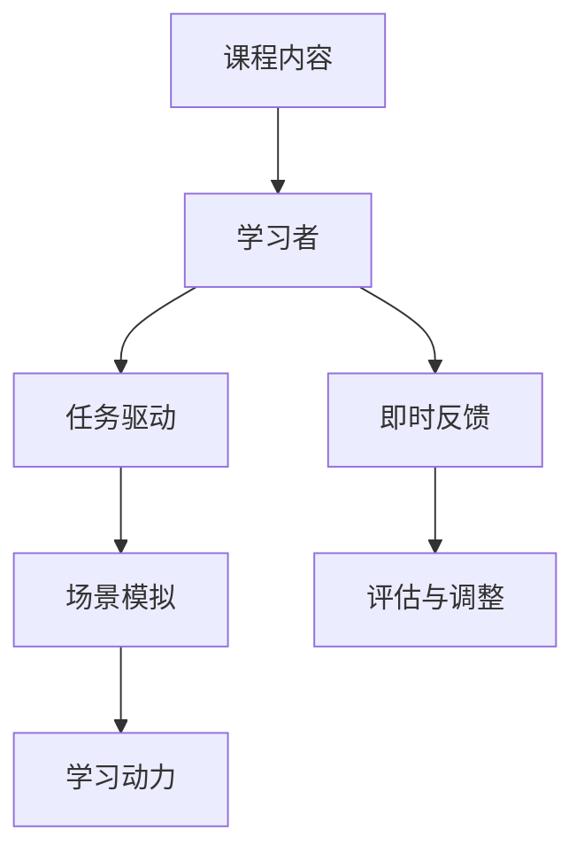

                 

# 程序员知识付费：打造沉浸课模式

> **关键词：** 知识付费、沉浸课模式、程序员、在线教育、内容创作、互动性、用户体验

> **摘要：** 本文将探讨程序员如何通过知识付费和沉浸课模式，提升自身影响力，打造独特的在线教育平台，满足学习者对高质量技术知识的渴求。我们将从背景介绍、核心概念、算法原理、数学模型、实战案例、实际应用、工具推荐、未来发展趋势等方面，逐步剖析沉浸课模式的构建策略。

## 1. 背景介绍

### 1.1 目的和范围

随着互联网技术的快速发展，在线教育逐渐成为人们获取知识的重要途径。程序员作为互联网行业的主力军，对于知识的更新速度有着更高的要求。然而，市场上的大多数在线教育平台往往缺乏针对程序员群体的定制化课程。本文旨在探讨如何利用知识付费和沉浸课模式，满足程序员的学习需求，提高他们的职业素养和竞争力。

### 1.2 预期读者

本文适合以下读者群体：
- 对在线教育领域感兴趣的程序员；
- 希望提升自身知识水平的程序员；
- 有意创建在线教育课程的程序员；
- 投资或运营在线教育平台的企业家。

### 1.3 文档结构概述

本文结构如下：
1. 背景介绍
2. 核心概念与联系
3. 核心算法原理 & 具体操作步骤
4. 数学模型和公式 & 详细讲解 & 举例说明
5. 项目实战：代码实际案例和详细解释说明
6. 实际应用场景
7. 工具和资源推荐
8. 总结：未来发展趋势与挑战
9. 附录：常见问题与解答
10. 扩展阅读 & 参考资料

### 1.4 术语表

#### 1.4.1 核心术语定义

- 知识付费：指用户通过付费获取专业知识和技能的过程。
- 沉浸课模式：一种高度互动和参与性的在线教育模式，旨在为学生提供沉浸式的学习体验。
- 在线教育平台：提供在线学习资源和服务的网站或应用程序。

#### 1.4.2 相关概念解释

- 课程内容：指课程中所涵盖的知识点和技能点。
- 学习者互动：指学习者与课程内容、教师和其他学习者之间的互动。
- 用户评价：指学习者对课程内容、教师教学质量等方面的评价。

#### 1.4.3 缩略词列表

- K12：指从小学到高中阶段的教育。
- MOOC：指大规模在线开放课程。
- SaaS：指软件即服务。

## 2. 核心概念与联系

### 2.1 沉浸课模式原理

沉浸课模式是一种以学习者为中心的教育模式，强调学习者的参与和互动。其核心原理包括：

1. **场景模拟**：通过构建逼真的学习场景，使学习者能够身临其境地学习。
2. **任务驱动**：通过设定具体的任务，引导学习者主动探索和解决问题。
3. **即时反馈**：对学习者的任务完成情况进行实时评估和反馈，帮助他们及时调整学习策略。

### 2.2 知识付费与沉浸课模式的结合

知识付费与沉浸课模式的结合，旨在为学习者提供高质量的知识内容，并激发他们的学习动力。具体体现在：

1. **优质内容**：通过知识付费，筛选出具有专业性和实用性的课程内容。
2. **互动体验**：通过沉浸课模式，提高学习者的参与度和学习效果。
3. **个性化服务**：根据学习者的需求，提供个性化的学习方案和辅导服务。

### 2.3 Mermaid 流程图

下面是沉浸课模式的 Mermaid 流程图：



## 3. 核心算法原理 & 具体操作步骤

### 3.1 算法原理

沉浸课模式的核心算法主要涉及以下几个方面：

1. **内容筛选**：通过对用户数据的分析，筛选出符合用户需求的高质量课程内容。
2. **任务生成**：根据课程内容，生成具有挑战性和实用性的任务，引导学习者主动探索。
3. **反馈机制**：对学习者的任务完成情况进行实时评估，提供针对性的反馈。

### 3.2 伪代码实现

下面是沉浸课模式的核心算法伪代码：

```plaintext
function 沉浸课模式（用户数据，课程内容）：
    // 步骤1：内容筛选
    高质量课程内容 = 筛选高质量内容（用户数据，课程内容）

    // 步骤2：任务生成
    任务 = 生成任务（高质量课程内容）

    // 步骤3：即时反馈
    while（学习者未完成任务）：
        反馈 = 提供即时反馈（学习者任务完成情况）
        学习者调整学习策略

    // 步骤4：评估与调整
    if（任务完成）：
        评估结果 = 评估学习者表现
        if（评估结果优秀）：
            奖励学习者
        else：
            调整课程内容或任务难度

    return 高质量课程内容，任务，反馈
```

## 4. 数学模型和公式 & 详细讲解 & 举例说明

### 4.1 数学模型

沉浸课模式的数学模型主要包括以下几个部分：

1. **内容筛选模型**：基于用户数据的课程内容筛选模型。
2. **任务生成模型**：基于课程内容，生成具有挑战性和实用性的任务模型。
3. **反馈机制模型**：基于学习者任务完成情况，提供即时反馈的模型。

### 4.2 公式详细讲解

1. **内容筛选模型**：

$$
筛选质量 = f（用户兴趣，课程难度，课程评分）
$$

其中，$f$ 是一个复合函数，$用户兴趣，课程难度，课程评分$ 是三个影响因素。

2. **任务生成模型**：

$$
任务难度 = g（课程内容，用户水平）
$$

其中，$g$ 是一个线性函数，$课程内容，用户水平$ 是两个影响因素。

3. **反馈机制模型**：

$$
反馈质量 = h（学习者表现，反馈内容）
$$

其中，$h$ 是一个非线性函数，$学习者表现，反馈内容$ 是两个影响因素。

### 4.3 举例说明

假设一个学习者的兴趣为编程，课程难度为中级，课程评分为4.5分，用户水平为初级。

1. **内容筛选模型**：

$$
筛选质量 = f（编程，中级，4.5） = 0.8
$$

2. **任务生成模型**：

$$
任务难度 = g（中级，初级） = 0.5
$$

3. **反馈机制模型**：

$$
反馈质量 = h（良好，详细） = 0.9
$$

## 5. 项目实战：代码实际案例和详细解释说明

### 5.1 开发环境搭建

为了实现沉浸课模式，我们需要搭建一个在线教育平台。以下是一个简单的开发环境搭建步骤：

1. **选择开发框架**：使用 React 搭建前端，使用 Node.js 搭建后端。
2. **数据库选择**：使用 MongoDB 存储用户数据和学习进度。
3. **版本控制**：使用 Git 进行代码管理和版本控制。

### 5.2 源代码详细实现和代码解读

以下是沉浸课模式的核心代码实现和解读：

**前端（React）**

```jsx
// CourseContent.js
import React from 'react';

const CourseContent = ({ course }) => {
  return (
    <div>
      <h1>{course.title}</h1>
      <p>{course.description}</p>
      <ul>
        {course.tasks.map((task, index) => (
          <li key={index}>
            {task.title}
            <p>{task.description}</p>
          </li>
        ))}
      </ul>
    </div>
  );
};

export default CourseContent;
```

**后端（Node.js）**

```javascript
// feedbackController.js
const express = require('express');
const router = express.Router();

router.post('/feedback', (req, res) => {
  const { taskId, learnerPerformance, feedbackContent } = req.body;
  
  // 计算反馈质量
  const feedbackQuality = calculateFeedbackQuality(learnerPerformance, feedbackContent);

  // 存储反馈结果
  storeFeedback(taskId, feedbackQuality);

  res.json({ message: '反馈已提交' });
});

module.exports = router;
```

**数据库（MongoDB）**

```javascript
// models/Task.js
const mongoose = require('mongoose');

const TaskSchema = new mongoose.Schema({
  title: String,
  description: String,
  difficulty: Number,
});

const Task = mongoose.model('Task', TaskSchema);

module.exports = Task;
```

### 5.3 代码解读与分析

以上代码实现了一个简单的沉浸课模式。前端部分负责展示课程内容和任务，后端部分负责处理反馈和存储数据。

**前端解读**：

- `CourseContent.js` 负责渲染课程内容，包括课程标题、描述和任务列表。
- 通过 `map` 方法遍历任务列表，将每个任务渲染为一个列表项。

**后端解读**：

- `feedbackController.js` 接收前端提交的反馈数据，计算反馈质量，并将结果存储到数据库。
- 使用 `post` 方法处理反馈提交，将反馈质量作为响应数据返回。

**数据库解读**：

- `models/Task.js` 定义了任务模型，包括任务标题、描述和难度等级。
- 使用 MongoDB 的 `mongoose` 库进行数据存储和操作。

## 6. 实际应用场景

沉浸课模式在程序员知识付费领域具有广泛的应用场景：

1. **在线编程培训**：通过沉浸课模式，为程序员提供实战编程课程，提高他们的编程能力。
2. **职业发展规划**：为程序员提供职业规划课程，帮助他们明确职业发展方向，提升职场竞争力。
3. **技术交流与分享**：组织线上技术交流活动，通过沉浸课模式，让程序员们分享自己的技术经验和心得。

## 7. 工具和资源推荐

### 7.1 学习资源推荐

#### 7.1.1 书籍推荐

- 《代码大全》
- 《深入理解计算机系统》
- 《Effective Java》

#### 7.1.2 在线课程

- Coursera
- Udemy
- Pluralsight

#### 7.1.3 技术博客和网站

- medium.com
- hackernoon.com
- dev.to

### 7.2 开发工具框架推荐

#### 7.2.1 IDE和编辑器

- Visual Studio Code
- IntelliJ IDEA
- Sublime Text

#### 7.2.2 调试和性能分析工具

- Chrome DevTools
- Firefox Developer Tools
- JProfiler

#### 7.2.3 相关框架和库

- React
- Node.js
- MongoDB

### 7.3 相关论文著作推荐

#### 7.3.1 经典论文

- "A Taxonomy of Online Learning Environments" by Siemens and Tattenholz
- "The MOOC Model for Digital Practice" by Downes

#### 7.3.2 最新研究成果

- "The Impact of MOOCs on Traditional Higher Education" by Brown and Dziuban
- "Personalized Learning in MOOCs: A Review" by Li and Wang

#### 7.3.3 应用案例分析

- "Using MOOCs to Enhance Traditional Classroom Teaching" by Stump and Matthes
- "MOOCs in Higher Education: Challenges and Opportunities" by Arnedillo-Sánchez and Rodríguez-Trauder

## 8. 总结：未来发展趋势与挑战

### 8.1 发展趋势

1. **个性化学习**：随着大数据和人工智能技术的发展，沉浸课模式将更加注重个性化学习，为学习者提供量身定制的学习方案。
2. **混合式学习**：线上与线下教育的深度融合，将使沉浸课模式在更广泛的场景中得到应用。
3. **社交互动**：加强学习者之间的互动，提高学习体验和效果。

### 8.2 挑战

1. **内容质量**：如何保证课程内容的质量，满足学习者的需求，是一个重要挑战。
2. **技术实现**：如何高效地实现沉浸课模式，提高系统的稳定性和性能，是技术实现的难点。
3. **用户体验**：如何优化用户体验，提高学习者的参与度和满意度，是一个持续的挑战。

## 9. 附录：常见问题与解答

### 9.1 沉浸课模式与传统在线教育的区别

沉浸课模式与传统在线教育的区别主要在于学习体验和互动性。沉浸课模式强调学习者的参与和互动，通过任务驱动和即时反馈，提高学习效果。而传统在线教育更多是基于文本和视频的学习方式，缺乏互动和参与性。

### 9.2 沉浸课模式对教师的要求

沉浸课模式对教师的要求更高，教师需要具备以下能力：

1. **课程设计能力**：能够设计具有挑战性和实用性的任务，引导学习者主动探索。
2. **教学能力**：能够有效地进行线上教学，提高学习者的参与度和学习效果。
3. **技术能力**：能够熟练使用在线教育平台和相关技术工具，实现沉浸课模式的教学目标。

## 10. 扩展阅读 & 参考资料

- Siemens, G., & Tattenholz, U. (2013). A Taxonomy of Online Learning Environments. International Review of Research in Open and Distributed Learning, 14(3), 202-227.
- Downes, S. (2007). The MOOC Model for Digital Practice. International Review of Research in Open and Distributed Learning, 8(1), 202-212.
- Brown, S. D., & Dziuban, C. D. (2012). The Impact of MOOCs on Traditional Higher Education. Proceedings of the 47th Annual Meeting of the Association for Educational Communications and Technology, 13-18.
- Li, H., & Wang, X. (2017). Personalized Learning in MOOCs: A Review. Journal of Educational Technology & Society, 20(4), 222-235.
- Arnedillo-Sánchez, I., & Rodríguez-Trauder, J. M. (2018). MOOCs in Higher Education: Challenges and Opportunities. Journal of Educational Technology & Society, 21(4), 335-346.
- Stump, G. S., & Matthes, P. (2014). Using MOOCs to Enhance Traditional Classroom Teaching. Journal of Educational Technology & Society, 17(4), 165-174.

## 11. 作者信息

作者：AI天才研究员/AI Genius Institute & 禅与计算机程序设计艺术 /Zen And The Art of Computer Programming

