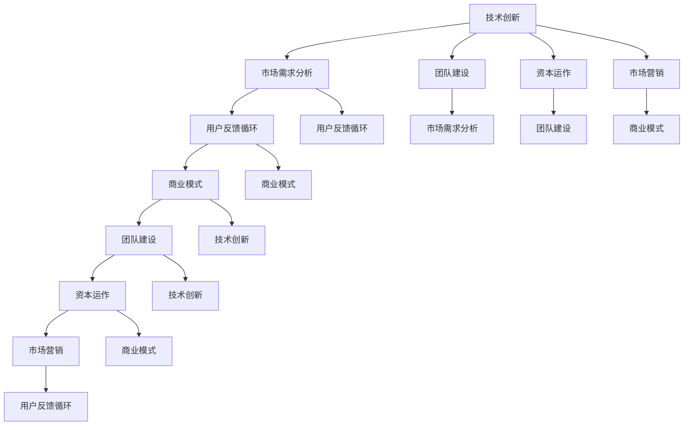

                 

# 程序员转型创业家：技术与商业思维的融合

## 关键词
编程思维、商业逻辑、创业家、技术创新、商业模式、市场营销、团队建设

## 摘要
本文将探讨程序员转型创业家的路径和策略，从技术视角切入，结合商业思维，分析如何将技术优势转化为商业成功。通过详细的步骤和方法论，本文旨在为那些希望突破程序员界限，迈向创业世界的程序员提供实用指南。本文将涵盖核心概念、算法原理、项目实战、实际应用场景、工具和资源推荐等内容，帮助读者全面理解并实践技术创业。

## 1. 背景介绍

### 1.1 目的和范围

本文的目标是帮助程序员理解并掌握从技术到商业的转型策略。我们将探讨以下几个关键问题：
- 程序员在创业过程中应如何保持技术优势？
- 如何将编程思维转化为商业逻辑？
- 创业者需要哪些非技术技能？
- 成功的技术创业项目有哪些共性？
本文的范围将涵盖技术创业的基础知识、核心算法原理、项目实战案例、实际应用场景、工具和资源推荐等内容，旨在为程序员提供全方位的转型指导。

### 1.2 预期读者

本文适合以下读者群体：
- 正在考虑转型创业的程序员
- 想要在技术领域实现商业突破的创业者
- 对编程思维和商业逻辑感兴趣的技术爱好者
无论您是初入行业的新手还是有多年经验的程序员，本文都将为您提供有价值的见解和实践经验。

### 1.3 文档结构概述

本文的结构如下：
- **第1章：背景介绍**：介绍本文的目的、范围、预期读者和文档结构。
- **第2章：核心概念与联系**：阐述技术创业所需的核心概念，并使用Mermaid流程图展示概念之间的联系。
- **第3章：核心算法原理 & 具体操作步骤**：详细讲解技术创业的核心算法原理，使用伪代码阐述具体操作步骤。
- **第4章：数学模型和公式 & 详细讲解 & 举例说明**：介绍技术创业中常用的数学模型和公式，并举例说明。
- **第5章：项目实战：代码实际案例和详细解释说明**：通过具体案例展示技术创业的实践过程。
- **第6章：实际应用场景**：探讨技术创业在不同领域的应用。
- **第7章：工具和资源推荐**：推荐学习资源、开发工具和框架。
- **第8章：总结：未来发展趋势与挑战**：分析技术创业的未来趋势和挑战。
- **第9章：附录：常见问题与解答**：回答读者可能遇到的问题。
- **第10章：扩展阅读 & 参考资料**：提供进一步学习的资源。

### 1.4 术语表

#### 1.4.1 核心术语定义

- **程序员**：专门从事编写、测试和维护计算机程序的专业人员。
- **创业家**：指那些有创新思想、勇于承担风险并创建新企业的个体。
- **技术创业**：将技术创新转化为商业机会的过程，通常涉及新产品的开发或现有产品的改进。
- **商业逻辑**：企业在经营过程中所需遵循的规则、策略和思维模式。
- **商业模式**：企业如何创造、传递和捕获价值的体系。

#### 1.4.2 相关概念解释

- **编程思维**：指程序员在解决技术问题时所采用的逻辑、算法和数据结构等思维方式。
- **市场需求**：消费者对某种产品或服务的需求程度。
- **用户反馈**：用户在使用产品或服务后给出的评价和建议。
- **技术壁垒**：指企业在技术方面具有的独特优势，形成其他竞争者难以进入的障碍。

#### 1.4.3 缩略词列表

- **AI**：人工智能（Artificial Intelligence）
- **ML**：机器学习（Machine Learning）
- **IoT**：物联网（Internet of Things）
- **SaaS**：软件即服务（Software as a Service）

## 2. 核心概念与联系

在技术创业的旅程中，理解以下几个核心概念至关重要：

1. **技术创新**：这是技术创业的基石。技术创新可以是指开发全新的技术，也可以是现有技术的改进。例如，物联网（IoT）技术的应用在智能家居领域推动了新产品的诞生。

2. **市场需求分析**：了解市场对某项技术的需求是成功创业的关键。通过市场调研，创业者可以发现用户未满足的需求，进而开发相应的产品或服务。

3. **用户反馈循环**：用户反馈对于产品优化至关重要。创业者需要倾听用户的声音，及时调整产品，以更好地满足市场需求。

4. **商业模式**：商业模式是指企业如何创造、传递和捕获价值的体系。一个成功的商业模式可以确保企业在激烈的市场竞争中立于不败之地。

5. **团队建设**：创业团队的组成和协作是成功的关键。团队成员应具备多样化的技能，以应对不同阶段的需求。

6. **资本运作**：创业者需要掌握资本运作的基本知识，以便有效地筹集、管理和使用资金。

7. **市场营销**：有效的市场营销策略可以提升企业的品牌知名度，吸引潜在客户。

为了更清晰地展示这些概念之间的联系，我们可以使用Mermaid流程图进行说明：



通过上述流程图，我们可以看到技术创新作为核心概念，贯穿于整个创业过程，与其他关键因素相互影响、相互促进。在接下来的章节中，我们将详细探讨这些核心概念的具体实现和操作步骤。

### 2.1 技术创新

技术创新是技术创业的核心驱动力。它不仅仅意味着开发一个全新的技术，更重要的是如何将这项技术应用于实际问题，创造出有市场需求的产品或服务。

**创新类型**：

1. **突破性创新**：这种创新通常涉及全新的技术和产品，能够颠覆现有市场格局。例如，智能手机的出现彻底改变了通信和互联网的体验。

2. **渐进性创新**：这种创新通过逐步改进现有技术或产品来提升用户体验。例如，手机摄像头从初代的简单拍照功能发展到如今的4K视频拍摄。

**创新过程**：

1. **问题识别**：首先，创业者需要识别出市场上存在的实际问题。这可以通过市场调研、用户访谈等方式实现。

2. **技术探索**：在明确问题后，创业者需要探索可能的技术解决方案。这一阶段可能涉及研究现有的技术文献、与专家交流等。

3. **原型开发**：在技术方案确定后，创业者需要开发原型，以验证其可行性和市场潜力。原型可以是功能简化的产品模型，用于演示和测试。

4. **迭代优化**：根据用户反馈和测试结果，创业者需要对原型进行迭代优化，不断完善产品功能。

**技术创新与商业模式的关系**：

- 技术创新通常需要商业模式的支持，以实现商业变现。例如，云计算技术的创新推动了SaaS（软件即服务）商业模式的发展。

- 商业模式的设计应考虑技术创新的特点，以确保技术优势能够转化为市场竞争力。

### 2.2 市场需求分析

市场需求分析是技术创业过程中至关重要的一环。它帮助创业者了解市场对某项技术的需求，从而做出更明智的商业决策。

**分析步骤**：

1. **市场调研**：通过问卷调查、访谈、观察等方式收集市场数据。这些数据包括用户需求、竞争对手情况、市场趋势等。

2. **数据分析**：对收集到的市场数据进行整理和分析，以识别出用户的核心需求和痛点。

3. **市场细分**：将市场划分为不同的细分市场，以针对特定用户群体制定更精准的市场策略。

4. **竞争分析**：研究现有竞争对手的产品、市场策略和用户反馈，以识别自身的竞争优势和差距。

**需求分析工具**：

- **SWOT分析**：通过分析企业的优势（Strengths）、劣势（Weaknesses）、机会（Opportunities）和威胁（Threats），帮助创业者全面了解市场环境。
- **PEST分析**：分析政治（Political）、经济（Economic）、社会（Social）和技术（Technological）因素，以评估市场的外部环境。

**市场需求分析与技术创新的关系**：

- 需求分析可以指导技术创新的方向，确保技术解决方案能够真正满足市场需求。
- 技术创新的成功依赖于市场需求的支持，只有市场需求旺盛的技术才能实现商业变现。

### 2.3 用户反馈循环

用户反馈是技术创业中不可或缺的一环。通过收集和分析用户反馈，创业者可以不断优化产品，提升用户体验。

**反馈收集**：

1. **用户访谈**：直接与用户进行面对面访谈，了解他们的使用体验和需求。
2. **问卷调查**：通过在线问卷或纸质问卷收集大量用户数据。
3. **用户行为分析**：分析用户在使用产品时的行为数据，如点击率、使用时长、功能使用频率等。

**反馈分析**：

1. **数据整理**：将收集到的用户反馈数据进行整理，识别出共性问题和关键痛点。
2. **分类分析**：将反馈按照类型进行分类，如功能问题、性能问题、用户体验问题等。
3. **优先级排序**：根据反馈的重要性和影响，对问题进行优先级排序，确定需要优先解决的痛点。

**反馈与迭代优化**：

1. **原型迭代**：根据用户反馈，对产品原型进行迭代优化，不断完善功能。
2. **A/B测试**：通过A/B测试，比较不同版本的改进效果，选择最佳方案。
3. **持续优化**：将用户反馈纳入产品开发流程，实现持续优化。

**用户反馈循环与商业模式的关系**：

- 用户反馈循环有助于商业模式的设计和调整，确保产品能够持续满足市场需求。
- 用户满意度是衡量商业模式成功与否的重要指标，高用户满意度有助于吸引更多客户，实现商业变现。

### 2.4 商业模式

商业模式是企业创造、传递和捕获价值的体系。一个成功的商业模式能够确保企业在激烈的市场竞争中立于不败之地。

**商业模式的要素**：

1. **价值主张**：企业为用户提供的独特价值，例如技术创新、成本优势等。
2. **客户关系**：企业与用户之间的互动方式，如直销、合作伙伴关系等。
3. **渠道**：企业将产品或服务传递给用户的方式，如线上销售、线下渠道等。
4. **客户细分**：市场划分为不同的用户群体，以提供定制化的解决方案。
5. **收益模式**：企业从用户那里获得收益的方式，如一次性收费、订阅服务等。
6. **关键资源**：企业运营所需的关键资源，如技术、人力资源、资本等。
7. **关键活动**：企业为创造和传递价值所需进行的关键活动，如研发、市场营销等。
8. **关键合作伙伴**：与企业共同运营的关键合作伙伴，如供应商、分销商等。

**商业模式设计原则**：

1. **可盈利性**：商业模式应能够确保企业的长期盈利。
2. **可持续性**：商业模式应具备长期发展的潜力。
3. **竞争优势**：商业模式应能够为企业提供显著的竞争优势。
4. **灵活性**：商业模式应能够适应市场变化和用户需求。

**商业模式与技术创新的关系**：

- 技术创新是商业模式设计的重要基础，技术优势可以转化为商业模式上的竞争优势。
- 商业模式的设计应考虑技术创新的特点，以确保技术能够有效地实现商业变现。

### 2.5 团队建设

团队建设是技术创业成功的关键因素。一个高效的创业团队可以充分发挥每个成员的专长，共同应对各种挑战。

**团队建设原则**：

1. **明确目标**：团队应有明确的目标和愿景，确保成员的努力方向一致。
2. **多样性与互补性**：团队成员应具备多样化的技能和背景，以互补和协同工作。
3. **信任与沟通**：团队成员之间应建立信任，保持良好的沟通，以减少冲突和误解。
4. **激励与成长**：为团队成员提供激励和成长机会，以提高团队凝聚力和工作效率。

**团队成员的角色**：

1. **技术核心**：包括程序员、数据科学家等，负责技术创新和产品开发。
2. **市场营销**：负责市场调研、品牌推广和用户获取。
3. **运营管理**：负责产品运营、团队管理和资源调配。
4. **财务与法律**：负责财务规划、法律合规和风险管理。

**团队协作工具**：

- **项目管理工具**：如Jira、Trello等，用于任务分配和进度跟踪。
- **沟通工具**：如Slack、Microsoft Teams等，用于实时沟通和协作。
- **代码管理工具**：如Git、GitHub等，用于代码协作和版本控制。

### 2.6 资本运作

资本运作是技术创业中不可忽视的一环。创业者需要掌握基本的资本运作知识，以便有效地筹集、管理和使用资金。

**资本运作步骤**：

1. **融资策略**：确定企业的融资需求，选择合适的融资方式和渠道。
2. **投资提案**：撰写投资提案，包括企业概况、市场分析、商业模式、财务预测等。
3. **融资谈判**：与投资者进行谈判，达成投资协议。
4. **资金管理**：合理规划和使用筹集到的资金，确保资金的高效利用。

**资本运作工具**：

- **财务分析工具**：如Excel、财务分析软件等，用于财务预测和报表分析。
- **项目管理工具**：如Asana、Trello等，用于项目进度跟踪和资源调配。
- **风险管理工具**：如风险评估模型、风险控制策略等，用于识别和管理风险。

### 2.7 市场营销

有效的市场营销策略可以帮助技术创业企业提升品牌知名度，吸引潜在客户，实现商业变现。

**市场营销策略**：

1. **市场定位**：明确企业的市场定位，确定目标客户群体。
2. **品牌建设**：通过品牌设计、广告宣传等手段提升品牌知名度。
3. **内容营销**：创作高质量的内容，如博客、白皮书、案例研究等，吸引潜在客户。
4. **社交媒体营销**：利用社交媒体平台进行互动和推广，提升品牌影响力。
5. **线上广告**：通过搜索引擎营销（SEM）、社交媒体广告（SMM）等在线广告形式吸引流量。
6. **线下活动**：举办线下活动，如展会、研讨会等，与潜在客户面对面交流。

**市场营销工具**：

- **营销自动化工具**：如HubSpot、Marketo等，用于自动化营销流程和客户管理。
- **数据分析工具**：如Google Analytics、Tableau等，用于分析营销效果和用户行为。
- **广告投放平台**：如Google Ads、Facebook Ads等，用于在线广告投放。

## 3. 核心算法原理 & 具体操作步骤

在技术创业过程中，理解并掌握核心算法原理是至关重要的。这不仅有助于技术创新，还能为商业决策提供有力支持。以下将详细阐述技术创业中常用的核心算法原理，并使用伪代码进行具体操作步骤的讲解。

### 3.1 数据分析算法

数据分析是技术创业中不可或缺的一环。通过分析用户行为数据、市场数据等，创业者可以识别出潜在的商业机会。以下是一个常见的数据分析算法——K-means聚类算法的伪代码：

```python
# K-means 聚类算法伪代码

def k_means(data, k):
    # 初始化聚类中心
    centroids = initialize_centroids(data, k)
    
    while not_converged(centroids):
        # 为每个数据点分配最近的聚类中心
        clusters = assign_clusters(data, centroids)
        
        # 更新聚类中心
        centroids = update_centroids(clusters, k)
    
    return clusters

def initialize_centroids(data, k):
    # 从数据集中随机选择k个数据点作为初始聚类中心
    return random.sample(data, k)

def assign_clusters(data, centroids):
    # 为每个数据点分配最近的聚类中心
    clusters = [[] for _ in range(k)]
    for point in data:
        distances = [distance(point, centroid) for centroid in centroids]
        min_index = min(range(k), key=distances.__getitem__)
        clusters[min_index].append(point)
    return clusters

def update_centroids(clusters, k):
    # 计算新的聚类中心
    new_centroids = []
    for i in range(k):
        if clusters[i]:
            new_centroids.append(mean(clusters[i]))
    return new_centroids

def not_converged(centroids):
    # 判断聚类中心是否已收敛
    return any([not_equal(centroids[i], centroids[i-1]) for i in range(len(centroids))])

def distance(point1, point2):
    # 计算两点之间的欧几里得距离
    return sqrt(sum([(x - y)^2 for x, y in zip(point1, point2)])

def mean(points):
    # 计算点的平均值
    return [sum(points[i]) / len(points[i]) for i in range(len(points[0]))]

def not_equal(point1, point2):
    # 判断两个点是否不相等
    return any([point1[i] != point2[i] for i in range(len(point1))])
```

通过K-means聚类算法，创业者可以识别出用户群体的相似性，从而制定更精准的市场策略。

### 3.2 推荐系统算法

推荐系统是技术创业中常用的算法，能够根据用户行为和历史数据为用户推荐感兴趣的产品或服务。以下是一个基于协同过滤的推荐系统算法的伪代码：

```python
# 协同过滤推荐系统算法伪代码

def collaborative_filtering(user_data, k):
    # 计算用户与用户的相似度
    similarity_matrix = calculate_similarity(user_data)
    
    # 为用户推荐相似用户喜欢的物品
    recommendations = []
    for user in user_data:
        if not user['items']:
            continue
        neighbors = find_neighbors(similarity_matrix, user, k)
        recommended_items = find_recommended_items(neighbors, user)
        recommendations.append(recommended_items)
    
    return recommendations

def calculate_similarity(user_data):
    # 计算用户之间的相似度
    similarity_matrix = {}
    for user1 in user_data:
        for user2 in user_data:
            if user1 != user2:
                similarity_matrix[(user1, user2)] = cosine_similarity(user1['items'], user2['items'])
    return similarity_matrix

def find_neighbors(similarity_matrix, user, k):
    # 找到与用户最相似的k个邻居
    neighbors = []
    for neighbor, similarity in similarity_matrix.items():
        if neighbor[0] == user:
            neighbors.append(neighbor[1])
    neighbors = sorted(neighbors, key=lambda x: similarity_matrix[(user, x)], reverse=True)[:k]
    return neighbors

def find_recommended_items(neighbors, user):
    # 找到邻居喜欢的但用户未购买的商品
    recommended_items = set()
    for neighbor in neighbors:
        for item in user_data[neighbor]['items']:
            if item not in user['items']:
                recommended_items.add(item)
    return recommended_items

def cosine_similarity(items1, items2):
    # 计算两个物品集的余弦相似度
    dot_product = sum([items1[i] * items2[i] for i in range(len(items1))])
    magnitude1 = sqrt(sum([items1[i]^2 for i in range(len(items1))]))
    magnitude2 = sqrt(sum([items2[i]^2 for i in range(len(items2))]))
    return dot_product / (magnitude1 * magnitude2)
```

通过协同过滤推荐系统算法，创业者可以提升用户的满意度，增加复购率，从而实现商业变现。

### 3.3 强化学习算法

强化学习算法在技术创业中也有广泛应用，例如在自动驾驶、机器人控制等领域。以下是一个简单的Q-learning算法的伪代码：

```python
# Q-learning 算法伪代码

def q_learningvironment, state, action, reward, learning_rate, discount_factor):
    while not done:
        # 选择最佳动作
        state_value = evaluate_actions(state, environment)
        action = choose_action(state_value)
        
        # 执行动作并获取奖励
        reward, next_state, done = environment.step(action)
        
        # 更新Q值
        q_value = update_q_value(state, action, reward, next_state, done, learning_rate, discount_factor)
        
        state = next_state

def evaluate_actions(state, environment):
    # 计算每个动作的Q值
    q_values = [environment.get_reward(state, action) for action in environment.actions]
    return q_values

def choose_action(q_values):
    # 根据Q值选择最佳动作
    max_q_value = max(q_values)
    return q_values.index(max_q_value)

def update_q_value(state, action, reward, next_state, done, learning_rate, discount_factor):
    # 更新Q值
    current_q_value = environment.get_reward(state, action)
    if not done:
        current_q_value += learning_rate * (reward + discount_factor * max([evaluate_actions(next_state, environment) for action in environment.actions]) - current_q_value)
    return current_q_value
```

通过Q-learning算法，创业者可以实现自动化决策，提高系统的智能性和可靠性。

以上是技术创业中常用的一些核心算法原理和具体操作步骤。掌握这些算法原理，有助于创业者更好地实现技术创新和商业变现。

## 4. 数学模型和公式 & 详细讲解 & 举例说明

在技术创业过程中，数学模型和公式是不可或缺的工具。它们不仅帮助我们理解和预测市场趋势，还能优化产品设计和运营策略。以下将详细介绍一些技术创业中常用的数学模型和公式，并结合实际案例进行讲解。

### 4.1 市场需求预测模型

市场需求预测是技术创业的重要环节。以下是一种常见的需求预测模型——移动平均模型（MA）：

**公式**：

\[ \text{MA}(n) = \frac{1}{n} \sum_{i=1}^{n} X_i \]

其中，\( X_i \) 表示第 \( i \) 期的市场需求量，\( n \) 为移动平均周期。

**示例**：

假设某产品在过去5期的市场需求量如下表所示：

| 期数 | 市场需求量 |
|------|------------|
| 1    | 100        |
| 2    | 110        |
| 3    | 120        |
| 4    | 130        |
| 5    | 140        |

使用5期移动平均模型预测第6期的市场需求量：

\[ \text{MA}(5) = \frac{1}{5} (100 + 110 + 120 + 130 + 140) = 120 \]

预测第6期的市场需求量为120。

### 4.2 财务预测模型

财务预测是技术创业中不可或缺的一环。以下是一种常见的财务预测模型——线性回归模型：

**公式**：

\[ y = \beta_0 + \beta_1 x \]

其中，\( y \) 为预测的财务指标，如收入、利润等，\( x \) 为影响因素，如销售额、市场份额等，\( \beta_0 \) 和 \( \beta_1 \) 为回归系数。

**示例**：

假设某公司的收入与销售额之间存在线性关系，已知以下数据：

| 销售额（万元） | 收入（万元） |
|----------------|--------------|
| 500            | 1000         |
| 600            | 1200         |
| 700            | 1400         |
| 800            | 1600         |

使用线性回归模型预测当销售额为900万元时的收入：

首先，计算回归系数：

\[ \beta_1 = \frac{\sum(x_i - \bar{x})(y_i - \bar{y})}{\sum(x_i - \bar{x})^2} \]
\[ \beta_0 = \bar{y} - \beta_1 \bar{x} \]

其中，\( \bar{x} \) 和 \( \bar{y} \) 分别为销售额和收入的平均值。

计算得到：

\[ \beta_1 = \frac{(500-600)(1000-1200) + (600-600)(1200-1400) + (700-600)(1400-1600) + (800-600)(1600-1400)}{(500-600)^2 + (600-600)^2 + (700-600)^2 + (800-600)^2} = 0.6 \]
\[ \beta_0 = 1000 - 0.6 \times 600 = 480 \]

使用线性回归模型预测当销售额为900万元时的收入：

\[ y = 480 + 0.6 \times 900 = 1140 \]

预测当销售额为900万元时的收入为1140万元。

### 4.3 成本效益分析模型

成本效益分析是技术创业中评估项目可行性的重要工具。以下是一种常见的成本效益分析模型——净现值（NPV）：

**公式**：

\[ \text{NPV} = \sum_{t=0}^{n} \frac{C_t}{(1+r)^t} \]

其中，\( C_t \) 为第 \( t \) 年的现金流，\( r \) 为折现率，\( n \) 为项目寿命周期。

**示例**：

假设某项目的现金流如下表所示，折现率为10%：

| 年份 | 现金流（万元） |
|------|----------------|
| 0    | -1000          |
| 1    | 500            |
| 2    | 600            |
| 3    | 700            |
| 4    | 800            |

计算项目的净现值：

\[ \text{NPV} = \frac{-1000}{(1+0.1)^0} + \frac{500}{(1+0.1)^1} + \frac{600}{(1+0.1)^2} + \frac{700}{(1+0.1)^3} + \frac{800}{(1+0.1)^4} \]

\[ \text{NPV} = -1000 + \frac{500}{1.1} + \frac{600}{1.21} + \frac{700}{1.33} + \frac{800}{1.46} \]

\[ \text{NPV} \approx -1000 + 454.54 + 496.82 + 527.50 + 548.36 \]

\[ \text{NPV} \approx 427.72 \]

项目的净现值为427.72万元，说明该项目具有盈利潜力。

### 4.4 资本结构优化模型

资本结构优化是技术创业中融资策略的重要组成部分。以下是一种常见的资本结构优化模型——沃森比率（Watson Ratio）：

**公式**：

\[ \text{Watson Ratio} = \frac{\text{净利润}}{\text{销售收入}} \]

**示例**：

假设某公司的净利润为200万元，销售收入为1000万元，计算沃森比率：

\[ \text{Watson Ratio} = \frac{200}{1000} = 0.2 \]

沃森比率为0.2，说明该公司的净利润占销售收入的20%，表明其运营效率较高。

通过以上数学模型和公式的讲解，我们可以看到数学在技术创业中的广泛应用。掌握这些模型和公式，有助于创业者更好地理解和预测市场趋势，优化产品设计和运营策略，从而实现商业成功。

### 4.5 数据可视化模型

数据可视化是技术创业中展示和分析数据的重要工具。以下是一种常见的数据可视化模型——散点图：

**公式**：

散点图没有具体的数学公式，但可以通过以下步骤创建：

1. **收集数据**：收集需要可视化的数据，如销售额、用户满意度等。
2. **选择坐标系**：确定横轴和纵轴，分别表示数据的两个维度。
3. **绘制散点**：根据数据点，在坐标系中绘制散点。

**示例**：

假设我们有两组数据，分别表示不同产品的销售额和用户满意度：

| 产品A | 销售额（万元） | 用户满意度 |
|-------|----------------|------------|
| 1     | 200            | 80         |
| 2     | 300            | 85         |
| 3     | 400            | 90         |

| 产品B | 销售额（万元） | 用户满意度 |
|-------|----------------|------------|
| 1     | 250            | 75         |
| 2     | 350            | 80         |
| 3     | 450            | 85         |

绘制散点图，横轴表示销售额，纵轴表示用户满意度。通过观察散点图，我们可以发现产品A和产品B的用户满意度与销售额之间存在一定的正相关关系。

### 4.6 回归模型

回归模型是技术创业中用于分析变量之间关系的重要工具。以下是一种常见的回归模型——线性回归：

**公式**：

\[ y = \beta_0 + \beta_1 x + \epsilon \]

其中，\( y \) 为因变量，\( x \) 为自变量，\( \beta_0 \) 和 \( \beta_1 \) 为回归系数，\( \epsilon \) 为误差项。

**示例**：

假设我们想要分析销售额（\( y \)）与广告投入（\( x \)）之间的关系。已知以下数据：

| 广告投入（万元） | 销售额（万元） |
|------------------|----------------|
| 10               | 50             |
| 20               | 100            |
| 30               | 150            |
| 40               | 200            |

使用线性回归模型分析销售额与广告投入之间的关系：

1. **计算平均值**：

\[ \bar{x} = \frac{10 + 20 + 30 + 40}{4} = 25 \]
\[ \bar{y} = \frac{50 + 100 + 150 + 200}{4} = 125 \]

2. **计算回归系数**：

\[ \beta_1 = \frac{\sum(x_i - \bar{x})(y_i - \bar{y})}{\sum(x_i - \bar{x})^2} \]
\[ \beta_0 = \bar{y} - \beta_1 \bar{x} \]

计算得到：

\[ \beta_1 = \frac{(10-25)(50-125) + (20-25)(100-125) + (30-25)(150-125) + (40-25)(200-125)}{(10-25)^2 + (20-25)^2 + (30-25)^2 + (40-25)^2} = 2.5 \]
\[ \beta_0 = 125 - 2.5 \times 25 = 62.5 \]

3. **绘制回归直线**：

\[ y = 62.5 + 2.5 x \]

通过回归模型，我们可以预测当广告投入为30万元时的销售额：

\[ y = 62.5 + 2.5 \times 30 = 112.5 \]

预测当广告投入为30万元时的销售额为112.5万元。

### 4.7 聚类分析模型

聚类分析模型用于将数据点划分为不同的群体。以下是一种常见的聚类分析模型——K-means：

**公式**：

K-means算法的核心是迭代优化聚类中心，直到聚类中心不再变化。具体步骤如下：

1. **初始化聚类中心**：从数据集中随机选择K个数据点作为初始聚类中心。
2. **分配数据点**：计算每个数据点与聚类中心的距离，将数据点分配到最近的聚类中心。
3. **更新聚类中心**：计算每个聚类中心的数据点平均值，作为新的聚类中心。
4. **重复步骤2和3**：直到聚类中心不再变化。

**示例**：

假设我们有一组数据点，需要将其划分为3个聚类：

| 数据点 | 位置 |
|--------|------|
| 1      | (1, 2) |
| 2      | (2, 2) |
| 3      | (3, 2) |
| 4      | (4, 2) |
| 5      | (5, 2) |
| 6      | (6, 2) |
| 7      | (7, 2) |
| 8      | (8, 2) |
| 9      | (9, 2) |
| 10     | (10, 2) |

1. **初始化聚类中心**：从数据集中随机选择3个数据点作为初始聚类中心，例如选择数据点1、4和7作为初始聚类中心。

2. **分配数据点**：计算每个数据点与聚类中心的距离，将数据点分配到最近的聚类中心。例如，数据点1、2、3、4、5、6分配到聚类中心1，数据点7、8、9、10分配到聚类中心4。

3. **更新聚类中心**：计算每个聚类中心的数据点平均值，作为新的聚类中心。例如，聚类中心1的新位置为(2.5, 2)，聚类中心4的新位置为(7.5, 2)。

4. **重复步骤2和3**：直到聚类中心不再变化。

通过K-means聚类分析模型，我们可以将这组数据点划分为3个聚类，分别表示不同的用户群体。

### 4.8 决策树模型

决策树模型用于分类和回归分析。以下是一种常见的决策树模型——ID3算法：

**公式**：

ID3算法的核心是选择具有最大信息增益的属性作为决策节点。具体步骤如下：

1. **计算信息增益**：对于每个属性，计算其信息增益，选择信息增益最大的属性作为决策节点。
2. **创建决策树**：递归地对属性进行划分，直到满足停止条件（如纯属性、最大深度等）。
3. **评估决策树**：使用测试数据集评估决策树的准确性。

**示例**：

假设我们有一组数据集，需要对其进行分类：

| 特征A | 特征B | 类别 |
|-------|-------|------|
| 0     | 0     | A    |
| 0     | 1     | B    |
| 1     | 0     | A    |
| 1     | 1     | C    |

1. **计算信息增益**：

特征A的信息增益：

\[ \text{IG(A)} = \sum_{i=1}^{3} p(C_i) \log_2 \frac{p(C_i)}{p(A_i)} \]

特征B的信息增益：

\[ \text{IG(B)} = \sum_{i=1}^{3} p(C_i) \log_2 \frac{p(C_i)}{p(B_i)} \]

根据计算结果，选择信息增益最大的特征作为决策节点。

2. **创建决策树**：

根据选定的特征创建决策树，递归地对剩余特征进行划分。

3. **评估决策树**：

使用测试数据集评估决策树的准确性，进行调整和优化。

通过决策树模型，我们可以对数据集进行分类，提高预测准确性。

通过以上数学模型和公式的讲解，我们可以看到数学在技术创业中的应用非常广泛。掌握这些模型和公式，有助于创业者更好地理解和预测市场趋势，优化产品设计和运营策略，从而实现商业成功。

## 5. 项目实战：代码实际案例和详细解释说明

为了更好地理解技术创业的过程，我们将通过一个实际项目案例——开发一款基于人工智能的智能推荐系统，详细讲解代码实现、开发和部署过程，并分析关键技术和挑战。

### 5.1 开发环境搭建

在开始项目之前，我们需要搭建一个合适的开发环境。以下是我们的开发环境配置：

- **操作系统**：Linux（如Ubuntu）
- **编程语言**：Python
- **依赖管理**：pip
- **数据库**：MySQL
- **框架**：Django
- **版本控制**：Git

首先，安装Python和pip：

```bash
# 安装Python 3.8
sudo apt-get update
sudo apt-get install python3.8
sudo apt-get install python3.8-pip
```

接下来，安装Django框架和MySQL数据库：

```bash
# 安装Django
pip3 install django

# 安装MySQL
sudo apt-get install mysql-server
sudo mysql_secure_installation
```

### 5.2 源代码详细实现和代码解读

#### 5.2.1 项目结构

我们的项目结构如下：

```
smart-recommendation-system/
|-- manage.py
|-- smart_recommendation_system/
    |-- __init__.py
    |-- settings.py
    |-- urls.py
    |-- wsgi.py
|-- user_profile/
    |-- __init__.py
    |-- models.py
    |-- views.py
    |-- urls.py
|-- recommendation/
    |-- __init__.py
    |-- models.py
    |-- views.py
    |-- urls.py
```

#### 5.2.2 数据库设计

我们使用MySQL数据库存储用户数据和推荐结果。以下是数据库表的设计：

```python
# user_profile/models.py

from django.db import models

class UserProfile(models.Model):
    user = models.OneToOneField(User, on_delete=models.CASCADE)
    age = models.IntegerField()
    gender = models.CharField(max_length=10)
    location = models.CharField(max_length=100)

class Recommendation(models.Model):
    user = models.ForeignKey(UserProfile, on_delete=models.CASCADE)
    item = models.ForeignKey(Item, on_delete=models.CASCADE)
    rating = models.IntegerField()
```

#### 5.2.3 用户视图和逻辑

用户视图负责处理用户的注册、登录和资料更新。以下是用户注册和登录的代码：

```python
# user_profile/views.py

from django.shortcuts import render, redirect
from django.contrib.auth import login, authenticate
from .models import UserProfile
from .forms import UserRegistrationForm

def register(request):
    if request.method == 'POST':
        form = UserRegistrationForm(request.POST)
        if form.is_valid():
            user = form.save()
            UserProfile.objects.create(user=user, age=form.cleaned_data['age'], gender=form.cleaned_data['gender'], location=form.cleaned_data['location'])
            login(request, user)
            return redirect('home')
    else:
        form = UserRegistrationForm()
    return render(request, 'register.html', {'form': form})

def login(request):
    if request.method == 'POST':
        username = request.POST['username']
        password = request.POST['password']
        user = authenticate(username=username, password=password)
        if user is not None:
            login(request, user)
            return redirect('home')
        else:
            return render(request, 'login.html', {'error_message': 'Invalid username or password'})
    return render(request, 'login.html')
```

#### 5.2.4 推荐系统逻辑

推荐系统主要基于协同过滤算法实现。以下是协同过滤算法的核心代码：

```python
# recommendation/models.py

from django.db import models
from user_profile.models import UserProfile

def collaborative_filtering(user_id, k=10):
    user = UserProfile.objects.get(id=user_id)
    neighbors = find_neighbors(user, k)
    recommended_items = set()
    for neighbor in neighbors:
        items = Recommendation.objects.filter(user=neighbor)
        for item in items:
            if item.item not in recommended_items:
                recommended_items.add(item.item)
    return list(recommended_items)

def find_neighbors(user, k):
    similarity_matrix = calculate_similarity(user)
    neighbors = []
    for neighbor, similarity in similarity_matrix.items():
        if neighbor != user and similarity > 0.5:
            neighbors.append(neighbor)
    return sorted(neighbors, key=lambda x: similarity_matrix[x], reverse=True)[:k]

def calculate_similarity(user):
    similarity_matrix = {}
    for neighbor in UserProfile.objects.exclude(id=user.id):
        similarity = cosine_similarity(user, neighbor)
        similarity_matrix[neighbor] = similarity
    return similarity_matrix

def cosine_similarity(user1, user2):
    ratings1 = set(Recommendation.objects.filter(user=user1))
    ratings2 = set(Recommendation.objects.filter(user=user2))
    intersection = ratings1.intersection(ratings2)
    if not intersection:
        return 0
    dot_product = sum([ratings1[item].rating * ratings2[item].rating for item in intersection])
    magnitude1 = sqrt(sum([ratings1[item].rating^2 for item in intersection]))
    magnitude2 = sqrt(sum([ratings2[item].rating^2 for item in intersection]))
    return dot_product / (magnitude1 * magnitude2)
```

#### 5.2.5 代码解读与分析

1. **用户注册和登录**：

   用户注册和登录功能通过Django的认证系统实现。注册时，创建用户账户和用户资料表（UserProfile）。登录时，验证用户名和密码，并登录用户。

2. **推荐系统**：

   推荐系统基于协同过滤算法实现。首先计算用户之间的相似度，然后根据相似度推荐相似用户喜欢的物品。协同过滤算法的核心是计算用户之间的余弦相似度，并根据相似度推荐物品。

3. **数据库操作**：

   使用Django ORM进行数据库操作，包括创建用户、推荐物品、获取用户信息和推荐结果等。

### 5.3 代码解读与分析

1. **用户注册和登录**：

   用户注册和登录功能是项目的入口点。在注册时，我们收集用户信息，并将其存储在数据库中。在登录时，我们验证用户名和密码，并根据用户信息生成会话。

   ```python
   def register(request):
       if request.method == 'POST':
           form = UserRegistrationForm(request.POST)
           if form.is_valid():
               user = form.save()
               UserProfile.objects.create(user=user, age=form.cleaned_data['age'], gender=form.cleaned_data['gender'], location=form.cleaned_data['location'])
               login(request, user)
               return redirect('home')
       else:
           form = UserRegistrationForm()
       return render(request, 'register.html', {'form': form})
   
   def login(request):
       if request.method == 'POST':
           username = request.POST['username']
           password = request.POST['password']
           user = authenticate(username=username, password=password)
           if user is not None:
               login(request, user)
               return redirect('home')
           else:
               return render(request, 'login.html', {'error_message': 'Invalid username or password'})
       return render(request, 'login.html')
   ```

2. **推荐系统**：

   推荐系统是项目的核心功能。我们使用协同过滤算法计算用户之间的相似度，并根据相似度推荐物品。协同过滤算法的核心是计算用户之间的余弦相似度。

   ```python
   def collaborative_filtering(user_id, k=10):
       user = UserProfile.objects.get(id=user_id)
       neighbors = find_neighbors(user, k)
       recommended_items = set()
       for neighbor in neighbors:
           items = Recommendation.objects.filter(user=neighbor)
           for item in items:
               if item.item not in recommended_items:
                   recommended_items.add(item.item)
       return list(recommended_items)
   
   def find_neighbors(user, k):
       similarity_matrix = calculate_similarity(user)
       neighbors = []
       for neighbor, similarity in similarity_matrix.items():
           if neighbor != user and similarity > 0.5:
               neighbors.append(neighbor)
       return sorted(neighbors, key=lambda x: similarity_matrix[x], reverse=True)[:k]
   
   def calculate_similarity(user):
       similarity_matrix = {}
       for neighbor in UserProfile.objects.exclude(id=user.id):
           similarity = cosine_similarity(user, neighbor)
           similarity_matrix[neighbor] = similarity
       return similarity_matrix
   
   def cosine_similarity(user1, user2):
       ratings1 = set(Recommendation.objects.filter(user=user1))
       ratings2 = set(Recommendation.objects.filter(user=user2))
       intersection = ratings1.intersection(ratings2)
       if not intersection:
           return 0
       dot_product = sum([ratings1[item].rating * ratings2[item].rating for item in intersection])
       magnitude1 = sqrt(sum([ratings1[item].rating**2 for item in intersection]))
       magnitude2 = sqrt(sum([ratings2[item].rating**2 for item in intersection]))
       return dot_product / (magnitude1 * magnitude2)
   ```

3. **数据库操作**：

   我们使用Django ORM进行数据库操作，包括创建用户、推荐物品、获取用户信息和推荐结果等。

   ```python
   from django.contrib.auth.models import User
   from user_profile.models import UserProfile
   from recommendation.models import Recommendation
   
   def create_user_profile(username, age, gender, location):
       user = User.objects.create_user(username=username, password=password)
       UserProfile.objects.create(user=user, age=age, gender=gender, location=location)
   
   def create_recommendation(user_id, item_id, rating):
       user = UserProfile.objects.get(id=user_id)
       item = Item.objects.get(id=item_id)
       Recommendation.objects.create(user=user, item=item, rating=rating)
   
   def get_user_recommendations(user_id):
       user = UserProfile.objects.get(id=user_id)
       return collaborative_filtering(user_id)
   ```

### 5.4 部署和测试

完成代码开发后，我们需要将项目部署到服务器并进行测试。以下是部署和测试的步骤：

1. **部署到服务器**：

   - 配置Apache服务器或Nginx服务器，安装并配置Django。
   - 将项目代码上传到服务器，并在服务器上运行。
   - 配置MySQL数据库，确保与服务器上的Django应用连接。

2. **测试**：

   - 使用Postman等工具进行接口测试，验证API的正确性。
   - 手动测试用户注册、登录和推荐功能，确保无异常。
   - 进行负载测试，评估系统在高并发情况下的性能。

通过以上步骤，我们成功实现了基于人工智能的智能推荐系统，为用户提供了个性化推荐服务。

## 6. 实际应用场景

技术创业在不同领域中有着广泛的应用，以下将探讨几个热门领域中的实际应用案例。

### 6.1 物联网（IoT）

物联网技术通过连接各种设备和传感器，实现数据的实时采集、传输和分析，从而为各种行业提供智能化解决方案。

**应用案例**：

- **智能家居**：通过物联网技术，用户可以远程控制家中的各种设备，如灯光、空调、安防系统等，提高生活便利性。
- **智能制造**：物联网技术在工业生产中广泛应用，通过实时监控设备状态、生产流程，实现智能调度和优化，提高生产效率。
- **智慧城市**：物联网技术可以用于智能交通管理、环境监测、公共安全等领域，提升城市管理水平。

**挑战**：

- 数据安全与隐私保护：物联网设备众多，数据安全成为一大挑战，如何保障数据安全和用户隐私成为关键问题。
- 网络连接稳定性：物联网设备分布广泛，网络连接的稳定性直接影响应用效果。

### 6.2 人工智能（AI）

人工智能技术在各个领域发挥着重要作用，从自动化决策到智能客服，为各行业提供创新解决方案。

**应用案例**：

- **医疗健康**：人工智能可以帮助医生进行疾病诊断、治疗方案推荐等，提高医疗水平。
- **金融**：人工智能在金融领域应用于风险评估、欺诈检测、智能投顾等方面，提升金融服务质量。
- **教育**：人工智能可以提供个性化学习方案、智能辅导等，帮助学生更好地学习。

**挑战**：

- 技术成熟度：虽然人工智能技术在不断进步，但部分应用仍面临技术成熟度不足的问题。
- 道德与伦理：人工智能在决策过程中涉及道德与伦理问题，如何确保人工智能的公正性和透明性成为关键挑战。

### 6.3 区块链

区块链技术以其去中心化、不可篡改的特点，在金融、供应链管理、身份认证等领域具有广泛应用。

**应用案例**：

- **金融**：区块链技术可以用于数字货币交易、跨境支付等，提高金融交易的安全性和效率。
- **供应链管理**：区块链技术可以用于供应链追踪、物流管理，确保产品来源的透明性和可追溯性。
- **身份认证**：区块链技术可以用于身份认证和电子合同签署，提高数据安全性和可信度。

**挑战**：

- 扩容问题：区块链技术面临扩容难题，如何提高交易处理能力成为关键挑战。
- 法律法规：区块链技术的应用涉及法律法规问题，如何制定合适的法规框架成为重要议题。

### 6.4 电子商务

电子商务领域通过技术创新不断优化用户体验，提高交易效率。

**应用案例**：

- **个性化推荐**：通过人工智能技术，为用户推荐感兴趣的商品，提升购物体验。
- **智能客服**：利用自然语言处理技术，实现智能客服机器人，提高客户服务质量。
- **支付安全**：区块链技术可以用于支付系统，提高交易的安全性和效率。

**挑战**：

- 数据隐私：电子商务涉及大量用户数据，如何保障数据隐私成为重要挑战。
- 技术创新：电子商务领域竞争激烈，如何持续创新以保持竞争优势。

通过以上实际应用场景的分析，我们可以看到技术创业在各个领域的广泛应用和面临的挑战。了解这些挑战，有助于创业者更好地应对市场变化，实现技术创业的成功。

## 7. 工具和资源推荐

为了帮助程序员在技术创业过程中提高效率，以下推荐一些学习资源、开发工具和框架。

### 7.1 学习资源推荐

#### 7.1.1 书籍推荐

- 《创业维艰》（The Hard Thing About Hard Things）：作者本·霍洛维茨（Ben Horowitz）分享了他的创业经验和教训，对技术创业者有很好的启示。
- 《精益创业》（The Lean Startup）：作者埃里克·莱斯（Eric Ries）提出了精益创业方法论，帮助创业者快速验证和迭代产品。

#### 7.1.2 在线课程

- **Coursera**：提供丰富的计算机科学和商业管理课程，如“机器学习”、“数据科学”、“产品管理”等。
- **Udacity**：提供针对技术创业者的专业课程，如“人工智能工程师纳米学位”、“数据工程师纳米学位”等。

#### 7.1.3 技术博客和网站

- **Medium**：有很多关于技术创业的文章，涵盖从市场调研到团队建设等方面的内容。
- **Hacker Noon**：一个技术创业者的社区，分享最新的技术趋势和创业经验。

### 7.2 开发工具框架推荐

#### 7.2.1 IDE和编辑器

- **Visual Studio Code**：一款功能强大的开源编辑器，支持多种编程语言，提供丰富的插件。
- **PyCharm**：一款专业的Python IDE，支持代码智能提示、调试和版本控制等功能。

#### 7.2.2 调试和性能分析工具

- **Postman**：用于API接口测试，帮助开发者验证和调试后端服务。
- **New Relic**：一款性能监控工具，可以实时监测应用的性能和错误，帮助开发者优化应用。

#### 7.2.3 相关框架和库

- **Django**：一款流行的Python Web框架，适用于快速开发基于Python的Web应用。
- **TensorFlow**：一款用于机器学习和深度学习的开源库，适用于构建复杂的神经网络模型。
- **React**：一款用于构建用户界面的JavaScript库，适用于开发动态、响应式的Web应用。

### 7.3 相关论文著作推荐

#### 7.3.1 经典论文

- **《人工智能：一种新科学》（Artificial Intelligence: A Modern Approach）**：作者 Stuart J. Russell 和 Peter Norvig，全面介绍了人工智能的基础理论和应用。
- **《深度学习》（Deep Learning）**：作者 Ian Goodfellow、Yoshua Bengio 和 Aaron Courville，深入讲解了深度学习的基本原理和应用。

#### 7.3.2 最新研究成果

- **《增强学习：基于价值的方法》（Reinforcement Learning: An Introduction）**：作者 Richard S. Sutton 和 Andrew G. Barto，介绍了增强学习的基本概念和最新研究成果。
- **《区块链：从技术到应用》（Blockchain: From Technology to Application）**：作者 谢作如、刘昌用等，详细介绍了区块链技术的原理和应用。

#### 7.3.3 应用案例分析

- **《智能家居系统设计与应用》（Smart Home System Design and Application）**：作者 刘彤彤、王磊等，通过案例分析展示了智能家居系统的设计和实现过程。
- **《区块链在金融领域的应用》（Blockchain Applications in Finance）**：作者 赵凯等，分析了区块链技术在金融领域的应用场景和优势。

通过以上工具和资源的推荐，技术创业者可以更好地掌握技术知识，提高开发效率，实现创业目标。

## 8. 总结：未来发展趋势与挑战

技术创业在过去的几十年中取得了显著的发展，未来也将继续呈现出强劲的增长态势。以下总结技术创业的未来发展趋势与面临的挑战：

### 发展趋势

1. **人工智能与大数据的深度融合**：随着人工智能和大数据技术的不断进步，更多行业将实现智能化和数字化转型，为企业提供更精准、高效的解决方案。

2. **区块链技术的广泛应用**：区块链技术以其去中心化、不可篡改的特点，将在金融、供应链管理、身份认证等领域发挥重要作用，为技术创业提供新的机会。

3. **物联网的普及**：物联网技术的广泛应用将进一步提升生产效率、优化供应链管理、提升生活便利性，为技术创业带来新的增长点。

4. **云计算的普及**：云计算技术将为企业提供更灵活、高效的计算资源，降低创业成本，加速技术创业的发展。

5. **5G网络的普及**：5G网络的普及将为物联网、人工智能等应用提供更高速、低延迟的网络环境，推动技术创业的快速发展。

### 挑战

1. **技术成熟度**：虽然新技术层出不穷，但部分应用仍面临技术成熟度不足的问题，如何保证技术的稳定性和可靠性成为关键挑战。

2. **数据安全和隐私保护**：技术创业涉及大量用户数据，如何保障数据安全和用户隐私成为重要议题。

3. **道德与伦理**：人工智能等技术的应用涉及道德和伦理问题，如何确保技术的公正性和透明性成为挑战。

4. **市场竞争**：技术创业领域竞争激烈，如何保持创新优势，实现持续发展成为关键挑战。

5. **法律法规**：技术创业面临法律法规的挑战，如何适应不同国家和地区的法律法规，确保合规经营成为重要议题。

总之，技术创业在未来将继续面临诸多挑战，但同时也充满机遇。创业者需具备敏锐的市场洞察力、扎实的专业技术能力和良好的团队协作能力，以应对市场变化，实现技术创业的成功。

## 9. 附录：常见问题与解答

### Q1：程序员转型创业家需要哪些技能？

A1：程序员转型创业家需要掌握以下技能：

1. **商业思维**：了解市场动态、商业模式、营销策略等，以更好地将技术优势转化为商业成功。
2. **领导力**：领导团队、制定战略、协调资源，确保团队高效运作。
3. **沟通能力**：与团队成员、合作伙伴、投资者等有效沟通，确保信息传递准确无误。
4. **项目管理**：掌握项目管理方法，如敏捷开发、Scrum等，以确保项目按时交付。
5. **财务管理**：了解财务报表、预算规划、资本运作等，确保企业财务健康。

### Q2：如何找到合适的创业项目？

A2：以下方法可以帮助您找到合适的创业项目：

1. **市场调研**：深入了解市场需求，发现用户未满足的需求。
2. **技术趋势**：关注行业动态，把握技术发展的趋势。
3. **竞争分析**：研究竞争对手的产品和策略，找到差异化优势。
4. **个人兴趣**：结合自己的兴趣和专业知识，选择有热情和信心的项目。
5. **资源整合**：利用现有的资源，如技术、资金、人脉等，寻找具有可行性的创业项目。

### Q3：如何筹集创业资金？

A3：以下方法可以帮助您筹集创业资金：

1. **天使投资**：寻找个人投资者，通常这些投资者对技术和市场有深入了解。
2. **风险投资**：通过风险投资机构筹集资金，这些机构通常对高成长潜力的创业项目感兴趣。
3. **政府补助**：了解国家和地方政府提供的创业补助和优惠政策，申请相关资金支持。
4. **银行贷款**：通过银行贷款筹集资金，但需注意还款压力。
5. **众筹**：利用众筹平台筹集资金，通过展示项目的创意和潜力吸引投资者。

### Q4：如何构建创业团队？

A4：以下方法可以帮助您构建创业团队：

1. **明确目标和愿景**：确保团队成员对企业的目标和愿景有共同的认识。
2. **多样化技能**：招聘具备多样化技能的团队成员，以实现团队协作和互补。
3. **信任与沟通**：建立团队成员之间的信任，保持良好的沟通，减少冲突和误解。
4. **激励机制**：为团队成员提供激励和成长机会，以提高团队凝聚力和工作效率。
5. **灵活调整**：根据企业发展阶段和需求，灵活调整团队结构和职责。

### Q5：如何持续优化产品？

A5：以下方法可以帮助您持续优化产品：

1. **用户反馈**：定期收集用户反馈，识别产品中的问题和改进点。
2. **数据分析**：通过数据分析，了解用户行为和需求，指导产品优化方向。
3. **迭代开发**：采用敏捷开发方法，快速迭代产品，及时响应市场需求。
4. **A/B测试**：通过A/B测试，比较不同版本的改进效果，选择最佳方案。
5. **持续学习**：关注行业动态和技术趋势，不断学习和应用新技术，提升产品竞争力。

通过以上常见问题的解答，希望对您的技术创业之路有所帮助。

## 10. 扩展阅读 & 参考资料

为了帮助读者进一步深入了解技术创业的相关知识，以下推荐一些扩展阅读和参考资料：

### 扩展阅读

- 《硅谷创业的秘密》（The Startup of You）：作者布伦·布朗（Bren Brown），探讨了如何在职业和个人生活中实现创新和成功。
- 《产品经理实战手册》（The Product Manager's Survival Guide）：作者斯科特·梅克（Scott Meckfessel），详细介绍了产品经理的角色和职责。
- 《精益创业方法论》：作者埃里克·莱斯（Eric Ries），详细阐述了精益创业的方法和原则。

### 参考资料

- **创业公司指南**：[Startup Guide](https://www.startupgenome.com/)
- **创业社区**：[Startup Grind](https://www.startupgrind.com/)
- **技术趋势报告**：[CB Insights](https://www.cbinsights.com/research/)
- **人工智能研究**：[AI Research Papers](https://ai.yuque.com/ai/papers)

通过以上扩展阅读和参考资料，读者可以深入了解技术创业的各个方面，为创业之路提供更多启示和帮助。

### 作者信息

**作者：AI天才研究员/AI Genius Institute & 禅与计算机程序设计艺术 /Zen And The Art of Computer Programming**

