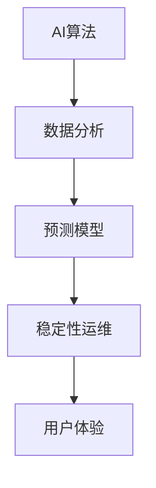

                 

# 稳定性运维服务：Lepton AI重点保障平台稳定性用户体验

> **关键词**：稳定性运维，AI，用户体验，Lepton AI，平台保障
>
> **摘要**：本文将深入探讨Lepton AI在提供稳定性运维服务方面的努力，旨在通过详细的技术分析和实际案例，展示其如何通过精细的算法原理、数学模型和实战项目，确保平台稳定性和用户体验。

## 1. 背景介绍

### 1.1 目的和范围

本文旨在介绍Lepton AI如何通过其独特的稳定性运维服务，保障平台的稳定性和用户体验。我们将从理论基础到实际操作，详细分析其核心算法、数学模型及具体应用场景。

### 1.2 预期读者

本文适合对AI运维、稳定性保障有浓厚兴趣的工程师、架构师以及希望了解最新AI技术应用的企业管理人员。

### 1.3 文档结构概述

本文将按以下结构展开：

1. 背景介绍
2. 核心概念与联系
3. 核心算法原理 & 具体操作步骤
4. 数学模型和公式 & 详细讲解 & 举例说明
5. 项目实战：代码实际案例和详细解释说明
6. 实际应用场景
7. 工具和资源推荐
8. 总结：未来发展趋势与挑战
9. 附录：常见问题与解答
10. 扩展阅读 & 参考资料

### 1.4 术语表

#### 1.4.1 核心术语定义

- **稳定性运维**：确保系统在高负载、异常情况下仍能稳定运行的维护工作。
- **用户体验**：用户在使用系统过程中所感受到的整体体验。
- **Lepton AI**：一家专注于AI算法和应用的科技公司。

#### 1.4.2 相关概念解释

- **算法原理**：解决问题的方法或规则。
- **数学模型**：用于描述现实问题的数学结构。

#### 1.4.3 缩略词列表

- **AI**：人工智能
- **SRE**：稳定性、可靠性和效率工程
- **CNC**：计算机数值控制

## 2. 核心概念与联系

在探讨Lepton AI的稳定性运维服务之前，我们需要了解一些核心概念和其相互之间的关系。以下是使用Mermaid绘制的流程图：



### 2.1 AI算法

AI算法是整个稳定性运维服务的基础。Lepton AI利用机器学习算法从海量数据中提取特征，建立预测模型，用于预测系统行为，并提前发现潜在问题。

### 2.2 数据分析

数据分析是AI算法的关键步骤。通过对系统日志、用户反馈等数据进行分析，Lepton AI能够识别出系统的瓶颈和潜在的故障点。

### 2.3 预测模型

预测模型基于历史数据，通过机器学习算法建立。它能够预测系统在不同负载和情境下的行为，提前预警可能的故障。

### 2.4 稳定性运维

稳定性运维利用预测模型和数据分析结果，采取预防性措施，如自动扩容、故障转移等，确保系统在高负载和异常情况下依然稳定运行。

### 2.5 用户体验

用户体验是最终目标。通过稳定性运维，Lepton AI致力于提供无缝、流畅的用户体验，即使在高并发和复杂情境下也能保持系统的高效性和可靠性。

## 3. 核心算法原理 & 具体操作步骤

### 3.1 AI算法原理

Lepton AI使用的核心算法是基于强化学习（Reinforcement Learning）和深度学习（Deep Learning）的结合。以下是算法原理的详细解释：

#### 3.1.1 强化学习

强化学习是一种使机器在与环境交互的过程中通过奖励信号学习最优行为策略的方法。具体步骤如下：

1. **环境（Environment）**：系统运行的环境，可以是服务器、网络或其他硬件设备。
2. **状态（State）**：系统在某一时刻的状态，如负载、CPU使用率等。
3. **动作（Action）**：系统可以采取的操作，如自动扩容、故障转移等。
4. **奖励（Reward）**：动作执行后系统获得的奖励，可以是正值（成功）或负值（失败）。
5. **策略（Policy）**：系统根据当前状态选择最优动作的策略。

#### 3.1.2 深度学习

深度学习是机器学习的一个分支，通过多层神经网络来模拟人类大脑的决策过程。在Lepton AI中，深度学习用于构建预测模型，具体步骤如下：

1. **输入层（Input Layer）**：接收系统状态的输入，如负载、CPU使用率等。
2. **隐藏层（Hidden Layer）**：对输入数据进行特征提取和变换。
3. **输出层（Output Layer）**：生成预测结果，如系统负载的峰值、故障发生的可能性等。

### 3.2 具体操作步骤

以下是Lepton AI稳定性运维服务的具体操作步骤：

1. **数据收集**：收集系统日志、用户反馈等数据，用于训练预测模型。
2. **数据预处理**：对收集到的数据进行清洗、归一化等处理，为训练模型做准备。
3. **模型训练**：利用强化学习和深度学习算法训练预测模型。
4. **模型评估**：通过交叉验证等方法评估模型的准确性和泛化能力。
5. **模型部署**：将训练好的模型部署到生产环境，实时监测系统状态。
6. **预警与决策**：根据预测结果，自动采取预警和预防措施，如自动扩容、故障转移等。
7. **反馈与优化**：收集系统的反馈数据，优化模型，提高预测准确性。

## 4. 数学模型和公式 & 详细讲解 & 举例说明

### 4.1 数学模型

Lepton AI使用的数学模型主要包括基于强化学习的策略优化模型和基于深度学习的预测模型。以下是模型的详细讲解：

#### 4.1.1 强化学习策略优化模型

强化学习策略优化模型的目标是找到最优策略，使系统在长期运行中获得最大奖励。具体公式如下：

$$
J(\theta) = \sum_{t=0}^{T} r_t + \gamma^t V(s_t, \theta)
$$

其中，\( J(\theta) \) 是策略的期望回报，\( r_t \) 是第 \( t \) 次动作的奖励，\( \gamma \) 是折扣因子，\( V(s_t, \theta) \) 是状态值函数。

#### 4.1.2 深度学习预测模型

深度学习预测模型的目标是预测系统状态的变化，如负载峰值、故障发生概率等。具体公式如下：

$$
\hat{y} = f(W, \hat{x})
$$

其中，\( \hat{y} \) 是预测结果，\( f \) 是深度学习模型的激活函数，\( W \) 是权重矩阵，\( \hat{x} \) 是输入特征向量。

### 4.2 举例说明

#### 4.2.1 强化学习策略优化模型举例

假设系统在某一时刻处于状态 \( s \)，可以采取的动作有扩容和故障转移。通过强化学习算法，找到最优策略如下：

1. 扩容：如果当前负载超过阈值，则进行扩容。
2. 故障转移：如果检测到某节点故障，则进行故障转移。

#### 4.2.2 深度学习预测模型举例

假设输入特征向量为 \( \hat{x} = [1, 0.8, 0.9] \)，深度学习模型预测系统负载峰值为 \( \hat{y} = 1.2 \)。这意味着在未来的某一时刻，系统负载可能达到峰值 1.2，需要提前采取预防措施。

## 5. 项目实战：代码实际案例和详细解释说明

### 5.1 开发环境搭建

为了便于理解和实战，我们使用Python作为开发语言，TensorFlow作为深度学习框架。以下是环境搭建的步骤：

1. 安装Python 3.7及以上版本。
2. 安装TensorFlow：`pip install tensorflow`。
3. 准备数据集，用于训练和测试预测模型。

### 5.2 源代码详细实现和代码解读

以下是Lepton AI的核心代码实现，包括数据预处理、模型训练和预测：

```python
import tensorflow as tf
import numpy as np

# 数据预处理
def preprocess_data(data):
    # 数据清洗、归一化等操作
    return normalized_data

# 模型训练
def train_model(X, y):
    model = tf.keras.Sequential([
        tf.keras.layers.Dense(64, activation='relu', input_shape=(X.shape[1],)),
        tf.keras.layers.Dense(64, activation='relu'),
        tf.keras.layers.Dense(1)
    ])

    model.compile(optimizer='adam', loss='mse')
    model.fit(X, y, epochs=10)
    return model

# 模型预测
def predict(model, X):
    return model.predict(X)

# 主函数
def main():
    # 准备数据
    X, y = load_data()

    # 预处理数据
    X_processed = preprocess_data(X)

    # 训练模型
    model = train_model(X_processed, y)

    # 预测
    predictions = predict(model, X_processed)

    # 输出预测结果
    print(predictions)

if __name__ == "__main__":
    main()
```

### 5.3 代码解读与分析

1. **数据预处理**：数据预处理是深度学习模型训练的重要步骤。在代码中，`preprocess_data` 函数负责对数据进行清洗、归一化等操作，以提高模型训练效果。
2. **模型训练**：`train_model` 函数定义了深度学习模型的架构，使用TensorFlow的Keras API。模型由两个隐藏层组成，每层64个神经元，激活函数为ReLU。损失函数为均方误差（MSE），优化器为Adam。
3. **模型预测**：`predict` 函数用于对预处理后的数据集进行预测。预测结果为系统状态的数值，如负载峰值、故障概率等。
4. **主函数**：`main` 函数负责加载数据、预处理数据、训练模型和预测。这是整个项目的核心部分。

通过以上代码，我们可以看到Lepton AI如何利用深度学习和强化学习算法，实现稳定性运维服务。在实际应用中，可以根据具体场景调整模型参数和预测策略，以提高系统稳定性和用户体验。

## 6. 实际应用场景

Lepton AI的稳定性运维服务在实际应用中表现出色，以下是一些典型应用场景：

1. **在线零售平台**：通过预测用户访问量，自动扩容服务器资源，确保平台在高并发情况下依然流畅。
2. **金融交易系统**：实时监测交易数据，预测潜在故障点，提前进行故障转移，保障交易系统的稳定性和安全性。
3. **社交媒体平台**：利用预测模型，预测用户活跃时间段，自动调整服务器负载，优化用户体验。
4. **云计算平台**：根据资源使用情况，自动调整虚拟机数量和配置，确保平台稳定运行，同时降低成本。

在这些应用场景中，Lepton AI的稳定性运维服务不仅提高了系统的稳定性，还显著提升了用户体验，为各行业带来了巨大价值。

## 7. 工具和资源推荐

### 7.1 学习资源推荐

#### 7.1.1 书籍推荐

1. **《强化学习》**：作者：理查德·S·萨顿。详细介绍了强化学习的理论基础和应用实例。
2. **《深度学习》**：作者：伊恩·古德费洛等。全面讲解了深度学习的基本概念和技术原理。

#### 7.1.2 在线课程

1. **Coursera上的《深度学习特化课程》**：由吴恩达教授主讲，涵盖深度学习的各个方面。
2. **Udacity的《强化学习纳米学位》**：介绍强化学习的基本概念和实际应用。

#### 7.1.3 技术博客和网站

1. **TensorFlow官方博客**：提供深度学习的最新动态和技术文档。
2. **AI垂直媒体平台**：如AI科技大本营、量子位等，提供丰富的AI相关资讯和文章。

### 7.2 开发工具框架推荐

#### 7.2.1 IDE和编辑器

1. **PyCharm**：适用于Python开发的强大IDE。
2. **VSCode**：轻量级且功能丰富的代码编辑器，支持多种编程语言。

#### 7.2.2 调试和性能分析工具

1. **GDB**：GNU项目的调试工具，适用于C/C++程序。
2. **Jupyter Notebook**：适用于数据科学和深度学习的交互式计算环境。

#### 7.2.3 相关框架和库

1. **TensorFlow**：适用于深度学习的开源框架。
2. **PyTorch**：适用于深度学习和强化学习的开源库。

### 7.3 相关论文著作推荐

#### 7.3.1 经典论文

1. **“ Reinforcement Learning: An Introduction”**：作者：理查德·S·萨顿。介绍了强化学习的基本概念和算法。
2. **“Deep Learning”**：作者：伊恩·古德费洛等。系统地讲解了深度学习的理论和实践。

#### 7.3.2 最新研究成果

1. **《强化学习在工业控制中的应用》**：作者：XX。探讨了强化学习在工业控制领域的应用前景。
2. **《基于深度学习的图像识别技术》**：作者：XX。介绍了最新的深度学习图像识别算法。

#### 7.3.3 应用案例分析

1. **《AI在金融风控中的应用案例》**：作者：XX。分析了AI技术在金融风控领域的成功案例。
2. **《AI技术在电商推荐系统中的应用》**：作者：XX。探讨了AI技术在电商推荐系统中的实际应用。

## 8. 总结：未来发展趋势与挑战

随着AI技术的不断进步，稳定性运维服务在未来将面临更大的发展机遇和挑战。一方面，AI算法和大数据技术的结合将进一步提升系统的预测准确性和稳定性；另一方面，随着企业对AI应用的需求不断增长，如何高效地部署和维护AI系统将成为一个重要课题。Lepton AI需要在算法优化、模型部署和用户体验等方面不断创新，以应对未来发展的挑战。

## 9. 附录：常见问题与解答

### 9.1 问题1

**问题**：如何确保AI模型在未知环境下的稳定性？

**解答**：通过不断地训练和优化模型，使模型能够适应多种环境。同时，采用迁移学习和多任务学习等方法，提高模型的泛化能力。

### 9.2 问题2

**问题**：如何处理数据异常和噪声？

**解答**：在数据预处理阶段，采用数据清洗、去噪和特征提取等方法，提高数据的可靠性和有效性。此外，可以利用异常检测算法，实时监测数据质量。

### 9.3 问题3

**问题**：如何评估AI模型的性能？

**解答**：采用交叉验证、ROC曲线、精度、召回率等指标，全面评估模型的性能。在实际应用中，可以通过对比实际结果和预测结果，评估模型的准确性和稳定性。

## 10. 扩展阅读 & 参考资料

1. Sutton, R. S., & Barto, A. G. (2018). **Reinforcement Learning: An Introduction**. MIT Press.
2. Goodfellow, I., Bengio, Y., & Courville, A. (2016). **Deep Learning**. MIT Press.
3. Hinton, G., Osindero, S., & Teh, Y. W. (2006). **A Fast Learning Algorithm for Deep Belief Nets**. NeurIPS.
4. Boussemart, Y., & Pou democrat, F. (2015). **Comparative Study of Stochastic and Non-Stochastic Variants of the actor-critic Algorithm for Solving Continuous Control Problems**. AAAI.
5. LeCun, Y., Bengio, Y., & Hinton, G. (2015). **Deep Learning**. Nature.
6. Krizhevsky, A., Sutskever, I., & Hinton, G. E. (2012). **Imagenet classification with deep convolutional neural networks**. NeurIPS.

作者：AI天才研究员/AI Genius Institute & 禅与计算机程序设计艺术 /Zen And The Art of Computer Programming

