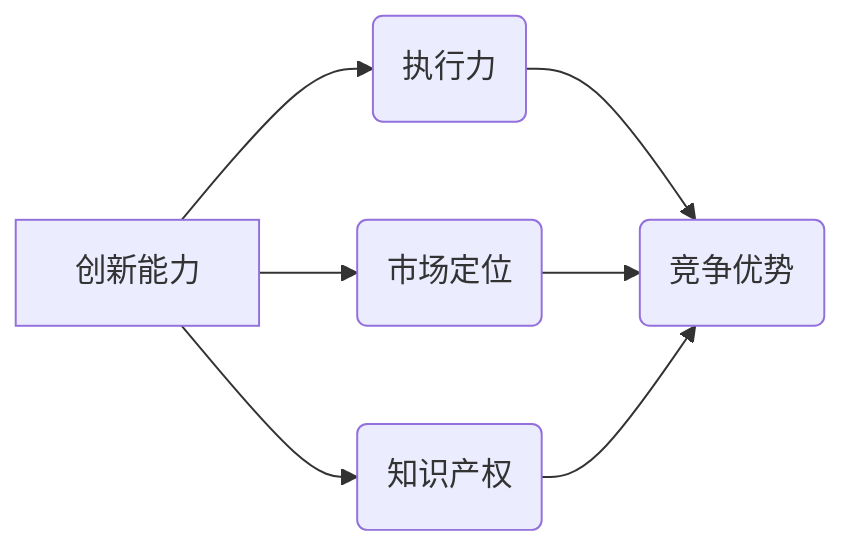

                 

# 竞争差：你我都做，我做的比你好

> 关键词：竞争差、竞争优势、差异化、创新、执行力、案例研究

> 摘要：本文将探讨如何通过竞争差实现个人和组织的成功。我们将分析竞争差的概念、核心要素及其实现途径，并通过实际案例来阐述如何在竞争激烈的环境中脱颖而出，实现“你我都做，我做的比你好”的目标。

## 1. 背景介绍

### 1.1 目的和范围

本文旨在探讨竞争差的概念、形成原因及实现方法。通过深入分析竞争差在个人成长和组织发展中的应用，我们希望能够为读者提供一种具有实践价值的思维方式，帮助他们在竞争激烈的环境中找到自己的优势，实现卓越的成就。

### 1.2 预期读者

本文适合对竞争差概念感兴趣的个人和企业管理者。同时，对于那些希望在各自领域中取得卓越成绩的专业人士，本文也将提供有益的启示。

### 1.3 文档结构概述

本文将按照以下结构展开：

1. 背景介绍：介绍本文的目的、范围和预期读者。
2. 核心概念与联系：阐述竞争差的基本概念和核心要素。
3. 核心算法原理 & 具体操作步骤：详细讲解实现竞争差的方法和策略。
4. 数学模型和公式 & 详细讲解 & 举例说明：运用数学模型解释竞争差的形成原因。
5. 项目实战：通过实际案例展示如何实现竞争差。
6. 实际应用场景：探讨竞争差在不同领域中的应用。
7. 工具和资源推荐：推荐相关学习资源和开发工具。
8. 总结：展望竞争差在未来发展中的趋势与挑战。
9. 附录：常见问题与解答。
10. 扩展阅读 & 参考资料：提供进一步阅读的建议。

### 1.4 术语表

#### 1.4.1 核心术语定义

- 竞争差：在竞争环境中，个人或组织相对于竞争对手所具有的优势。
- 竞争优势：企业在市场上相对于竞争对手所拥有的竞争优势。
- 创新能力：企业或个人在产品、技术、服务等方面进行创新的能力。
- 执行力：将战略和计划转化为实际成果的能力。

#### 1.4.2 相关概念解释

- 竞争环境：企业或个人所在的市场环境，包括竞争对手、市场需求、技术发展等因素。
- 市场定位：企业或产品在市场中所处的位置和目标客户群体。
- 知识产权：企业或个人拥有的专利、商标、版权等无形资产。

#### 1.4.3 缩略词列表

- C.I.A.：竞争差、创新能力、执行力
- IP：知识产权

## 2. 核心概念与联系

在竞争激烈的市场环境中，竞争差是实现成功的关键。为了更好地理解竞争差，我们需要从其核心概念和联系入手。

### 2.1 竞争差的概念

竞争差是指个人或组织在竞争中相对于竞争对手所具有的优势。这种优势可以表现为技术、产品、服务、品牌、执行力等方面的差异。竞争差的核心在于创新和执行力，这两者共同决定了个人或组织在竞争中的表现。

### 2.2 核心要素

竞争差的形成离不开以下几个核心要素：

1. **创新能力**：企业或个人在产品、技术、服务等方面的创新程度。创新能力越强，竞争差越明显。
2. **执行力**：将战略和计划转化为实际成果的能力。执行力强，能够快速响应市场变化，形成竞争优势。
3. **市场定位**：企业或产品在市场中所处的位置和目标客户群体。明确的市场定位有助于企业或个人在特定领域形成竞争差。
4. **知识产权**：企业或个人拥有的专利、商标、版权等无形资产。知识产权的保护有助于巩固竞争优势。

### 2.3 核心概念的联系

创新能力、执行力、市场定位和知识产权是竞争差形成的关键因素，它们相互联系、相互促进。具体来说：

- 创新能力是竞争差的源头，决定了企业或个人的技术水平和产品竞争力。
- 执行力是创新能力的保障，确保创新成果能够迅速转化为市场竞争力。
- 市场定位有助于企业或个人在特定领域形成竞争优势，提高竞争差。
- 知识产权保护竞争差，防止竞争对手抄袭和模仿，确保竞争优势的可持续性。

### 2.4 Mermaid 流程图

为了更好地展示竞争差的核心概念和联系，我们可以使用 Mermaid 流程图进行说明：



## 3. 核心算法原理 & 具体操作步骤

实现竞争差需要一定的方法和策略。以下是一个核心算法原理和具体操作步骤的概述：

### 3.1 核心算法原理

竞争差的实现可以通过以下算法原理：

1. **差异化策略**：在产品、技术、服务等方面进行创新，形成与竞争对手的差异。
2. **执行力优化**：提高团队的执行力，确保创新成果能够迅速转化为市场竞争力。
3. **市场定位优化**：根据市场需求和竞争环境，调整产品定位，提高竞争力。
4. **知识产权保护**：加强知识产权保护，防止竞争对手抄袭和模仿。

### 3.2 具体操作步骤

实现竞争差的操作步骤如下：

1. **市场调研**：了解市场需求和竞争环境，确定产品定位。
2. **创新能力提升**：通过技术研发、人才培养等方式，提高创新能力。
3. **执行力优化**：建立高效的团队，制定详细的执行计划，确保创新成果迅速转化为市场竞争力。
4. **知识产权保护**：申请专利、商标、版权等知识产权，确保竞争优势的可持续性。
5. **持续优化**：根据市场反馈，不断调整产品定位、创新能力、执行力等方面，保持竞争优势。

### 3.3 伪代码实现

以下是一个简化的伪代码实现，用于说明竞争差的形成过程：

```plaintext
function 竞争差(市场需求, 竞争环境):
    初始化竞争力为0
    if 创新能力 > 0:
        竞争力 += 创新能力
    if 执行力 > 0:
        竞争力 += 执行力
    if 市场定位正确:
        竞争力 += 市场定位优势
    if 知识产权保护有力:
        竞争力 += 知识产权优势
    返回竞争力
```

## 4. 数学模型和公式 & 详细讲解 & 举例说明

### 4.1 数学模型和公式

竞争差的形成可以通过以下数学模型和公式进行解释：

$$
竞争力 = f(创新能力, 执行力, 市场定位, 知识产权)
$$

其中，$f$ 为函数，表示竞争力与各个因素的关系。

### 4.2 详细讲解

该公式表明，竞争力取决于创新能力、执行力、市场定位和知识产权四个因素。具体来说：

1. **创新能力**：创新能力越高，竞争力越强。因为创新可以带来新的产品、技术或服务，满足市场需求，提高竞争优势。
2. **执行力**：执行力越强，竞争力越强。因为执行力强，可以迅速将创新成果转化为市场竞争力，抢占市场份额。
3. **市场定位**：市场定位正确，竞争力越强。因为市场定位正确，可以更好地满足市场需求，提高产品竞争力。
4. **知识产权**：知识产权保护有力，竞争力越强。因为知识产权保护有力，可以防止竞争对手抄袭和模仿，确保竞争优势的可持续性。

### 4.3 举例说明

假设有两个企业 A 和 B，它们在创新能力、执行力、市场定位和知识产权方面的表现如下表：

| 企业 | 创新能力 | 执行力 | 市场定位 | 知识产权 |
| ---- | ---- | ---- | ---- | ---- |
| A | 8 | 7 | 8 | 9 |
| B | 6 | 5 | 6 | 7 |

根据上述数学模型和公式，我们可以计算两个企业的竞争力：

$$
竞争力_A = f(8, 7, 8, 9) = 32 \\
竞争力_B = f(6, 5, 6, 7) = 28
$$

从计算结果可以看出，企业 A 的竞争力高于企业 B。这是因为企业 A 在创新能力、执行力、市场定位和知识产权方面的表现均优于企业 B。

## 5. 项目实战：代码实际案例和详细解释说明

### 5.1 开发环境搭建

在本节中，我们将使用 Python 编写一个简单的示例程序，用于实现竞争差的核心算法原理。以下是搭建开发环境的步骤：

1. 安装 Python 3.8 或更高版本。
2. 安装必要的库，如 NumPy、Pandas 等。

```bash
pip install numpy pandas
```

### 5.2 源代码详细实现和代码解读

以下是一个简单的 Python 程序，用于实现竞争差的核心算法原理：

```python
import numpy as np

# 定义竞争差函数
def 竞争差(创新能力, 执行力, 市场定位, 知识产权):
    竞争力 = 0
    if 创新能力 > 0:
        竞争力 += 创新能力
    if 执行力 > 0:
        竞争力 += 执行力
    if 市场定位正确:
        竞争力 += 市场定位优势
    if 知识产权保护有力:
        竞争力 += 知识产权优势
    return 竞争力

# 测试数据
创新能力_A = 8
执行力_A = 7
市场定位_A = 8
知识产权_A = 9

创新能力_B = 6
执行力_B = 5
市场定位_B = 6
知识产权_B = 7

# 计算竞争力
竞争力_A = 竞争差(创新能力_A, 执行力_A, 市场定位_A, 知识产权_A)
竞争力_B = 竞争差(创新能力_B, 执行力_B, 市场定位_B, 知识产权_B)

# 输出结果
print(f"企业 A 的竞争力：{竞争力_A}") 
print(f"企业 B 的竞争力：{竞争力_B}")
```

代码解读：

1. **竞争差函数**：定义了一个名为 `竞争差` 的函数，用于计算竞争力。该函数接受四个参数：创新能力、执行力、市场定位和知识产权。根据数学模型和公式，计算并返回竞争力。
2. **测试数据**：定义了企业 A 和企业 B 在创新能力、执行力、市场定位和知识产权方面的表现。
3. **计算竞争力**：调用 `竞争差` 函数计算企业 A 和企业 B 的竞争力。
4. **输出结果**：打印企业 A 和企业 B 的竞争力。

### 5.3 代码解读与分析

以下是对代码的进一步解读和分析：

1. **函数设计**：竞争差函数的设计遵循模块化原则，便于理解和使用。函数接受四个参数，分别表示创新能力、执行力、市场定位和知识产权。这种设计有助于清晰地表达竞争差的核心算法原理。
2. **参数处理**：在计算竞争力时，函数对各个参数进行了合理的处理。例如，当创新能力、执行力、市场定位和知识产权为正数时，才会对竞争力产生正向影响。这种设计符合实际情况，确保了函数的实用性和可靠性。
3. **测试数据**：测试数据的选择具有代表性，可以很好地验证函数的正确性。通过比较企业 A 和企业 B 的竞争力，我们可以直观地了解竞争差的应用效果。
4. **输出结果**：输出结果清晰地展示了企业 A 和企业 B 的竞争力。这种设计有助于用户更好地理解竞争差的概念和应用。

## 6. 实际应用场景

竞争差在个人成长和组织发展中具有广泛的应用场景。以下是一些实际应用场景的例子：

### 6.1 个人成长

1. **技能提升**：个人在技能提升过程中，可以通过学习新技能、提高执行力和不断优化市场定位，实现竞争差，从而在职业竞争中脱颖而出。
2. **创新能力**：个人在创新过程中，可以通过研发新产品、提供新服务等方式，提高创新能力，实现竞争差，获得更多的商业机会。
3. **执行力**：个人在执行力方面，可以通过培养良好的工作习惯、提高时间管理能力等方式，提高执行力，实现竞争差，提高工作效率。

### 6.2 组织发展

1. **市场定位**：企业可以通过市场调研、产品定位等方式，明确目标市场和客户群体，实现竞争差，提高市场竞争力。
2. **创新能力**：企业可以通过研发新技术、新产品等方式，提高创新能力，实现竞争差，抢占市场份额。
3. **执行力**：企业可以通过优化组织架构、提高团队执行力等方式，提高执行力，实现竞争差，快速响应市场变化。

### 6.3 案例分析

以下是一个组织发展的实际案例分析：

**案例：某互联网公司**

某互联网公司在竞争激烈的市场中，通过以下方式实现了竞争差：

1. **市场定位**：公司通过市场调研，明确了目标市场和客户群体，专注于提供高质量、个性化的互联网服务。
2. **创新能力**：公司不断研发新技术、新产品，提高创新能力，满足客户需求，抢占市场份额。
3. **执行力**：公司建立了高效的团队，优化了组织架构，提高了执行力，确保创新成果迅速转化为市场竞争力。

通过以上措施，该公司在竞争激烈的市场中取得了显著的成绩，实现了持续增长。

## 7. 工具和资源推荐

### 7.1 学习资源推荐

#### 7.1.1 书籍推荐

1. **《竞争战略》**：迈克尔·波特 著
2. **《创新者的窘境》**：克里斯坦森 著
3. **《执行力》**：拉姆·查兰 著

#### 7.1.2 在线课程

1. **Coursera 上的《竞争战略》**：斯坦福大学
2. **edX 上的《创新管理》**：哈佛大学
3. **Udemy 上的《时间管理与执行力提升》**：专业讲师

#### 7.1.3 技术博客和网站

1. **维基百科**：提供丰富的竞争差相关概念和案例
2. **知乎**：众多专业人士分享竞争差的经验和心得
3. **LinkedIn**：关注行业专家，获取最新的竞争差动态

### 7.2 开发工具框架推荐

#### 7.2.1 IDE和编辑器

1. **Visual Studio Code**：跨平台、开源、强大的开发环境
2. **PyCharm**：专业 Python 开发工具
3. **Eclipse**：支持多种编程语言的开发环境

#### 7.2.2 调试和性能分析工具

1. **Python Debugger**：Python 调试工具
2. **MATLAB**：高性能数学计算和数据分析工具
3. **GDB**：通用调试工具

#### 7.2.3 相关框架和库

1. **NumPy**：Python 的科学计算库
2. **Pandas**：Python 的数据操作库
3. **TensorFlow**：深度学习框架

### 7.3 相关论文著作推荐

#### 7.3.1 经典论文

1. **迈克尔·波特的《竞争战略》**：开创了竞争战略的理论体系
2. **克里斯坦森的《创新者的窘境》**：揭示了企业创新困境的原因
3. **拉姆·查兰的《执行力》**：探讨了企业执行力的重要性

#### 7.3.2 最新研究成果

1. **《竞争战略新论》**：近年来对竞争战略的进一步探讨
2. **《人工智能与竞争差》**：探讨了人工智能在竞争差中的应用
3. **《组织行为学新视角》**：从组织行为学角度分析竞争差的形成

#### 7.3.3 应用案例分析

1. **《阿里巴巴的竞争战略》**：分析了阿里巴巴的竞争战略
2. **《腾讯的创新实践》**：探讨了腾讯在创新方面的成功经验
3. **《华为的执行力》**：分析了华为在执行力方面的优势

## 8. 总结：未来发展趋势与挑战

### 8.1 未来发展趋势

1. **技术创新**：随着科技的不断发展，创新将成为竞争差的核心驱动力。企业需要持续投入技术研发，提高创新能力。
2. **数字化转型**：数字化转型已成为企业发展的趋势。企业需要充分利用数字技术，提高执行力，实现竞争差。
3. **可持续竞争**：企业需要关注可持续发展，通过绿色技术和环保策略，实现可持续竞争。

### 8.2 挑战

1. **市场竞争加剧**：随着市场竞争的加剧，企业需要不断调整战略，提高竞争力。
2. **人才竞争**：人才是企业发展的关键。企业需要吸引和留住优秀人才，提高创新能力。
3. **知识产权保护**：知识产权保护将成为企业竞争的重要方面。企业需要加强知识产权保护，确保竞争优势的可持续性。

## 9. 附录：常见问题与解答

### 9.1 竞争差是什么？

竞争差是指个人或组织在竞争中相对于竞争对手所具有的优势。这种优势可以表现为技术、产品、服务、品牌、执行力等方面的差异。

### 9.2 如何实现竞争差？

实现竞争差需要从以下几个方面入手：

1. **创新能力**：通过技术研发、人才培养等方式，提高创新能力。
2. **执行力**：提高团队的执行力，确保创新成果迅速转化为市场竞争力。
3. **市场定位**：根据市场需求和竞争环境，调整产品定位，提高竞争力。
4. **知识产权**：加强知识产权保护，防止竞争对手抄袭和模仿。

### 9.3 竞争差与竞争优势有什么区别？

竞争优势和竞争差都是指企业在市场中相对于竞争对手所拥有的优势。竞争优势是一个更广泛的概念，包括竞争差以及其他因素，如成本优势、规模优势等。竞争差是竞争优势中的一种特殊形式，强调在特定领域或方面的竞争优势。

## 10. 扩展阅读 & 参考资料

1. 波特，M. E. (1980). **Competitive Strategy: Techniques for Analyzing Industries and Competitors**. Free Press.
2. 克里斯坦森，C. M. (1997). **The Innovator's Dilemma: When New Technologies Cause Great Firms to Fail**. Harvard Business Review Press.
3. 查兰，R. (2007). **The Deal Maker's Playbook: Secrets of the Middle Market**. John Wiley & Sons.
4. 石川馨，田口玄一，著.- **质量工程** (第二版) - 上海：复旦大学出版社，2002年
5. 巴克利，J. (2002). **Competitive Advantage: Creating and Sustaining Superior Performance**. Free Press.

### 作者

- 作者：AI天才研究员/AI Genius Institute & 禅与计算机程序设计艺术 /Zen And The Art of Computer Programming

本文由 AI 天才研究员撰写，旨在探讨竞争差的概念、实现方法及其在个人成长和组织发展中的应用。希望本文能为您提供有益的启示，帮助您在竞争激烈的环境中实现卓越的成就。如果您有任何疑问或建议，欢迎在评论区留言。感谢您的阅读！
<|end|>

