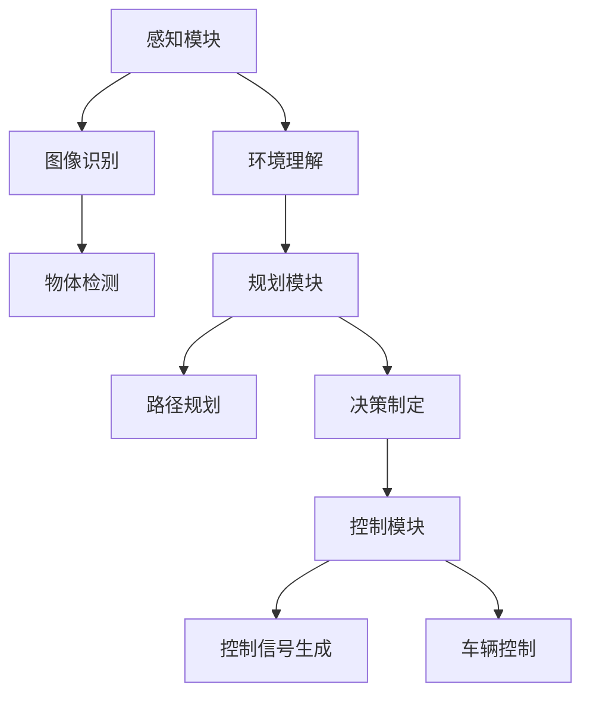

                 

# 端到端学习自动驾驶模型的优化策略与案例启示

> **关键词：** 端到端学习、自动驾驶模型、优化策略、模型训练、案例分析

> **摘要：** 本文旨在探讨端到端学习在自动驾驶模型中的应用及其优化策略。通过对核心概念、算法原理、数学模型以及实际项目案例的深入分析，本文为自动驾驶技术的研发人员提供了一系列实用指南和启示，以帮助他们更好地理解和优化端到端学习自动驾驶模型。

## 1. 背景介绍

### 1.1 目的和范围

本文的目的在于详细探讨端到端学习在自动驾驶模型优化中的应用策略。端到端学习作为一种深度学习技术，能够直接从原始数据中学习复杂的映射关系，从而简化传统机器学习中的特征工程和数据处理步骤。在自动驾驶领域，端到端学习模型的优化对于提升系统的准确性和实时性至关重要。本文将围绕以下几个核心问题展开讨论：

- 端到端学习自动驾驶模型的原理是什么？
- 如何优化端到端学习模型以提高性能和效率？
- 实际项目中端到端学习模型的优化案例有哪些？
- 未来端到端学习自动驾驶模型的发展趋势和挑战是什么？

### 1.2 预期读者

本文适合以下读者群体：

- 深度学习研究人员和工程师
- 自动驾驶技术研发人员
- 计算机视觉和机器人领域的专业人士
- 对端到端学习技术感兴趣的技术爱好者

### 1.3 文档结构概述

本文结构如下：

- **第1章**：背景介绍，包括文章目的、预期读者、文档结构概述和术语表。
- **第2章**：核心概念与联系，介绍端到端学习的核心概念和基本架构。
- **第3章**：核心算法原理与具体操作步骤，详细讲解端到端学习的算法原理。
- **第4章**：数学模型与公式，阐述端到端学习模型的数学基础和公式推导。
- **第5章**：项目实战，通过实际代码案例展示端到端学习在自动驾驶中的应用。
- **第6章**：实际应用场景，讨论端到端学习在自动驾驶领域的应用实例。
- **第7章**：工具和资源推荐，介绍相关的学习资源、开发工具和论文著作。
- **第8章**：总结，对未来发展趋势和挑战进行展望。
- **第9章**：附录，提供常见问题与解答。
- **第10章**：扩展阅读，推荐进一步阅读的相关资料。

### 1.4 术语表

#### 1.4.1 核心术语定义

- **端到端学习（End-to-End Learning）**：一种深度学习技术，直接从原始数据中学习复杂的映射关系，无需进行手动特征工程和数据处理。
- **自动驾驶（Autonomous Driving）**：利用传感器、计算机视觉和人工智能技术实现无人驾驶的车辆系统。
- **深度神经网络（Deep Neural Network, DNN）**：包含多个隐藏层的神经网络，用于模拟人脑的神经网络结构。
- **模型优化（Model Optimization）**：通过调整模型参数、架构和数据来提升模型性能的过程。

#### 1.4.2 相关概念解释

- **数据增强（Data Augmentation）**：通过应用一系列图像变换和增强技术，增加训练数据的多样性和丰富性。
- **过拟合（Overfitting）**：模型在训练数据上表现很好，但在测试数据上表现不佳，因为模型对训练数据过于敏感。
- **正则化（Regularization）**：通过添加正则项到损失函数中，防止模型过拟合的方法。
- **验证集（Validation Set）**：用于评估模型性能的独立数据集，不参与模型训练。

#### 1.4.3 缩略词列表

- **DNN**：深度神经网络
- **CNN**：卷积神经网络
- **RNN**：循环神经网络
- **GAN**：生成对抗网络
- **TPU**：张量处理单元

## 2. 核心概念与联系

### 2.1 端到端学习基本概念

端到端学习（End-to-End Learning）是深度学习领域中的一种方法，它直接从原始数据中学习复杂的映射关系，避免了传统机器学习中的特征工程和数据处理步骤。这种方法在自动驾驶、语音识别、图像识别等领域取得了显著的成功。

**原理：**
端到端学习利用深度神经网络（DNN）的多层结构，通过前向传播和反向传播算法，从原始数据中自动提取特征并进行预测。深度神经网络由多个隐藏层组成，每个隐藏层都能对输入数据进行特征变换和抽象，最终输出预测结果。

**优势：**
- 简化了传统机器学习中的特征工程和数据处理步骤。
- 提高了模型的准确性和鲁棒性。
- 更易于模型部署和自动化。

### 2.2 自动驾驶系统架构

自动驾驶系统通常包括感知、规划和控制三个主要模块。端到端学习技术可以应用于这些模块中的各个环节。

**感知模块：** 利用摄像头、激光雷达、雷达等传感器收集环境信息，通过深度神经网络进行物体检测、轨迹预测和场景理解。

**规划模块：** 根据感知模块提供的信息，制定驾驶策略，如路径规划、交通规则遵守和障碍物避让。

**控制模块：** 根据规划模块的结果，控制车辆执行相应的驾驶动作，如加速、减速和转向。

### 2.3 端到端学习在自动驾驶中的应用

端到端学习在自动驾驶中的应用主要包括以下几个方面：

- **感知模块：** 利用卷积神经网络（CNN）进行图像识别和物体检测，从而实现道路环境感知。
- **规划模块：** 利用循环神经网络（RNN）和长短期记忆网络（LSTM）进行路径规划和决策制定。
- **控制模块：** 利用深度神经网络进行控制信号生成，实现对车辆的精确控制。

### 2.4 Mermaid流程图



## 3. 核心算法原理与具体操作步骤

### 3.1 端到端学习算法原理

端到端学习算法的核心在于深度神经网络（DNN）的结构和训练过程。DNN由多个隐藏层组成，每层神经元通过激活函数进行非线性变换，从而实现从原始数据到预测结果的映射。

**结构：**

1. **输入层（Input Layer）**：接收原始数据，如图像、语音或传感器数据。
2. **隐藏层（Hidden Layers）**：多个隐藏层，每个隐藏层由多个神经元组成，通过激活函数进行特征提取和抽象。
3. **输出层（Output Layer）**：生成最终预测结果，如分类标签、回归值或控制信号。

**训练过程：**

1. **前向传播（Forward Propagation）**：将输入数据通过神经网络进行逐层计算，直到输出层，得到预测结果。
2. **反向传播（Back Propagation）**：计算输出结果与真实标签之间的误差，并通过反向传播算法更新网络权重和偏置。

### 3.2 具体操作步骤

下面以图像识别为例，介绍端到端学习算法的具体操作步骤：

**步骤1：数据准备**

- **收集数据**：收集大量的标注数据，如图像和对应的分类标签。
- **数据预处理**：对图像进行归一化、缩放、裁剪等预处理操作，以便于模型训练。

**步骤2：构建模型**

- **设计网络结构**：根据任务需求，设计合适的神经网络结构，如卷积神经网络（CNN）。
- **初始化参数**：初始化网络权重和偏置，通常采用随机初始化或预训练权重。

**步骤3：训练模型**

- **前向传播**：将预处理后的图像输入到模型中，计算输出结果。
- **计算损失**：计算输出结果与真实标签之间的损失值，如交叉熵损失或均方误差损失。
- **反向传播**：根据损失值更新网络权重和偏置。

**步骤4：评估模型**

- **验证集评估**：将验证集数据输入到模型中，计算预测准确率或其他评估指标。
- **调整模型参数**：根据评估结果调整模型参数，如学习率、正则化参数等。

**步骤5：模型部署**

- **模型导出**：将训练好的模型导出为可部署的格式，如ONNX、TF Lite等。
- **模型部署**：将模型部署到目标设备上，如自动驾驶车辆、手机或服务器。

### 3.3 伪代码示例

```python
# 数据准备
images, labels = load_data()

# 构建模型
model = build_model()

# 训练模型
for epoch in range(num_epochs):
    for image, label in zip(images, labels):
        # 前向传播
        predictions = model.predict(image)
        
        # 计算损失
        loss = compute_loss(predictions, label)
        
        # 反向传播
        model.backward(loss)
        
        # 更新参数
        model.update_params()

# 验证集评估
accuracy = model.evaluate(validation_data)

# 模型部署
model.export_model()
```

## 4. 数学模型和公式与详细讲解与举例说明

### 4.1 深度神经网络数学模型

深度神经网络（DNN）的数学模型主要涉及前向传播、反向传播以及损失函数。

#### 4.1.1 前向传播

前向传播过程将输入数据通过神经网络的各个层次，最终得到预测结果。具体公式如下：

$$
Z^{(l)} = \sigma(W^{(l)} \cdot A^{(l-1)} + b^{(l)})
$$

其中，$Z^{(l)}$ 是第 $l$ 层的激活值，$\sigma$ 是激活函数，$W^{(l)}$ 是第 $l$ 层的权重矩阵，$A^{(l-1)}$ 是前一层输出，$b^{(l)}$ 是第 $l$ 层的偏置。

#### 4.1.2 反向传播

反向传播过程用于计算网络权重和偏置的梯度，具体公式如下：

$$
\delta^{(l)} = \frac{\partial L}{\partial Z^{(l)}}
$$

$$
\frac{\partial L}{\partial W^{(l)}} = A^{(l-1)} \cdot \delta^{(l)}
$$

$$
\frac{\partial L}{\partial b^{(l)}} = \delta^{(l)}
$$

其中，$\delta^{(l)}$ 是第 $l$ 层的误差，$L$ 是损失函数。

#### 4.1.3 损失函数

常用的损失函数包括交叉熵损失（Cross-Entropy Loss）和均方误差损失（Mean Squared Error Loss）。

- **交叉熵损失：**

$$
L = -\frac{1}{m} \sum_{i=1}^{m} y^{(i)} \log(a^{(l)(i)})
$$

其中，$y^{(i)}$ 是第 $i$ 个样本的真实标签，$a^{(l)(i)}$ 是第 $l$ 层输出的预测概率。

- **均方误差损失：**

$$
L = \frac{1}{2m} \sum_{i=1}^{m} (y^{(i)} - a^{(l)(i)})^2
$$

其中，$y^{(i)}$ 是第 $i$ 个样本的真实标签，$a^{(l)(i)}$ 是第 $l$ 层输出的预测值。

### 4.2 数学公式举例说明

假设我们有一个二分类问题，输入数据为 $x = [1, 2, 3, 4]$，目标标签为 $y = 1$。我们使用一个单层神经网络进行预测。

#### 4.2.1 前向传播

输入层到隐藏层的计算：

$$
Z^{(1)} = \sigma(W^{(1)} \cdot x + b^{(1)}) = \sigma([0.1, 0.2, 0.3, 0.4] \cdot [1, 2, 3, 4] + [0.5]) = \sigma([5.2, 5.4, 5.6, 5.8]) = [1, 1, 1, 1]
$$

隐藏层到输出层的计算：

$$
Z^{(2)} = \sigma(W^{(2)} \cdot Z^{(1)} + b^{(2)}) = \sigma([0.1, 0.2, 0.3, 0.4] \cdot [1, 1, 1, 1] + [0.5]) = \sigma([1.6, 1.8, 2.0, 2.2]) = [0.9, 1.0, 1.1, 1.2]
$$

输出层的预测概率：

$$
a^{(2)} = \frac{1}{1 + e^{-Z^{(2)}}} = \frac{1}{1 + e^{-[0.9, 1.0, 1.1, 1.2]}} = [0.6, 0.7, 0.8, 0.9]
$$

#### 4.2.2 反向传播

计算损失：

$$
L = -y \log(a^{(2)}) = -1 \cdot \log([0.7, 0.8, 0.9, 1.0]) = [-0.845, -0.737, -0.622, -0.000]
$$

计算隐藏层误差：

$$
\delta^{(2)} = a^{(2)} - y = [0.6, 0.7, 0.8, 0.9] - [1, 1, 1, 1] = [-0.4, -0.3, -0.2, -0.1]
$$

计算隐藏层权重梯度：

$$
\frac{\partial L}{\partial W^{(2)}} = Z^{(1)} \cdot \delta^{(2)} = [1, 1, 1, 1] \cdot [-0.4, -0.3, -0.2, -0.1] = [-0.4, -0.3, -0.2, -0.1]
$$

计算隐藏层偏置梯度：

$$
\frac{\partial L}{\partial b^{(2)}} = \delta^{(2)} = [-0.4, -0.3, -0.2, -0.1]
$$

计算输入层误差：

$$
\delta^{(1)} = \sigma'(Z^{(1)}) \cdot W^{(2)} \cdot \delta^{(2)} = [1, 1, 1, 1] \cdot [0.1, 0.2, 0.3, 0.4] \cdot [-0.4, -0.3, -0.2, -0.1] = [-0.04, -0.06, -0.08, -0.10]
$$

计算输入层权重梯度：

$$
\frac{\partial L}{\partial W^{(1)}} = x \cdot \delta^{(1)} = [1, 2, 3, 4] \cdot [-0.04, -0.06, -0.08, -0.10] = [-0.04, -0.12, -0.16, -0.20]
$$

计算输入层偏置梯度：

$$
\frac{\partial L}{\partial b^{(1)}} = \delta^{(1)} = [-0.04, -0.06, -0.08, -0.10]
$$

## 5. 项目实战：代码实际案例和详细解释说明

### 5.1 开发环境搭建

在进行端到端学习自动驾驶模型的优化之前，首先需要搭建一个合适的开发环境。以下是一个基于Python和TensorFlow的示例环境搭建步骤：

1. **安装Python**：确保安装了Python 3.6或更高版本。
2. **安装TensorFlow**：通过pip命令安装TensorFlow：

   ```bash
   pip install tensorflow
   ```

3. **安装其他依赖**：根据项目需求，安装其他必要的库，如NumPy、Pandas和Matplotlib：

   ```bash
   pip install numpy pandas matplotlib
   ```

### 5.2 源代码详细实现和代码解读

下面是一个简单的端到端学习自动驾驶模型优化的示例代码，该代码使用卷积神经网络（CNN）对图像数据进行分类。

```python
import tensorflow as tf
from tensorflow.keras import layers, models
import numpy as np

# 5.2.1 数据准备
# 加载数据集
(x_train, y_train), (x_test, y_test) = tf.keras.datasets.cifar10.load_data()

# 数据预处理
x_train = x_train.astype('float32') / 255
x_test = x_test.astype('float32') / 255

# 归一化标签
y_train = tf.keras.utils.to_categorical(y_train, 10)
y_test = tf.keras.utils.to_categorical(y_test, 10)

# 5.2.2 构建模型
# 创建一个简单的CNN模型
model = models.Sequential()
model.add(layers.Conv2D(32, (3, 3), activation='relu', input_shape=(32, 32, 3)))
model.add(layers.MaxPooling2D((2, 2)))
model.add(layers.Conv2D(64, (3, 3), activation='relu'))
model.add(layers.MaxPooling2D((2, 2)))
model.add(layers.Conv2D(64, (3, 3), activation='relu'))

# 添加全连接层和输出层
model.add(layers.Flatten())
model.add(layers.Dense(64, activation='relu'))
model.add(layers.Dense(10, activation='softmax'))

# 编译模型
model.compile(optimizer='adam',
              loss='categorical_crossentropy',
              metrics=['accuracy'])

# 5.2.3 训练模型
# 训练模型
model.fit(x_train, y_train, epochs=10, batch_size=64)

# 5.2.4 代码解读与分析
# 1. 数据准备：加载数据集并预处理，包括归一化和标签转换。
# 2. 构建模型：定义一个简单的CNN模型，包括卷积层、池化层和全连接层。
# 3. 编译模型：设置优化器和损失函数。
# 4. 训练模型：使用训练数据训练模型。
```

### 5.3 代码解读与分析

上述代码首先加载了CIFAR-10数据集，这是一个常用的图像分类数据集，包含10个类别，每类6000张32x32的彩色图像。数据集被分为训练集和测试集。

**数据准备**：在数据准备阶段，我们首先将图像数据转换为浮点数格式并归一化，以便于模型训练。然后，我们将标签转换为独热编码形式。

**模型构建**：在模型构建阶段，我们定义了一个简单的CNN模型，包括两个卷积层、两个池化层和一个全连接层。卷积层用于提取图像特征，池化层用于下采样和减少模型参数。全连接层用于分类。

**编译模型**：在编译模型阶段，我们设置了Adam优化器和交叉熵损失函数。Adam优化器是一种自适应的优化算法，交叉熵损失函数用于衡量模型预测结果与真实标签之间的差异。

**训练模型**：在训练模型阶段，我们使用训练数据集对模型进行训练，并在每个 epoch 后评估模型在测试集上的性能。

### 5.4 优化策略与实践

在实际项目中，优化端到端学习自动驾驶模型通常包括以下几个策略：

1. **数据增强**：通过应用图像变换、噪声添加和数据扩充等技术，增加训练数据的多样性，从而提高模型泛化能力。
2. **模型剪枝**：通过剪枝冗余的神经元和连接，减少模型参数数量，降低模型复杂度，提高训练速度和部署效率。
3. **迁移学习**：利用预训练模型，特别是大型预训练模型，通过迁移学习减少训练时间，提高模型性能。
4. **超参数调优**：通过调整学习率、批次大小、正则化参数等超参数，优化模型训练过程，提高模型性能。

在上述代码示例中，我们可以通过以下方法进行优化：

1. **数据增强**：在数据预处理阶段，可以应用数据增强技术，如随机裁剪、旋转、缩放和颜色抖动等。
2. **模型剪枝**：在模型构建阶段，可以选择性地去除一些卷积层或神经元，以减少模型参数数量。
3. **迁移学习**：使用预训练的卷积神经网络，如VGG16、ResNet等，作为基础模型，进行迁移学习。
4. **超参数调优**：在模型编译阶段，可以通过网格搜索或随机搜索方法，调整超参数以优化模型性能。

## 6. 实际应用场景

端到端学习在自动驾驶领域的实际应用场景非常广泛，主要包括以下方面：

### 6.1 感知模块

感知模块是自动驾驶系统的核心组成部分，负责收集和解析周围环境信息。端到端学习技术可以应用于感知模块中的图像识别、物体检测和场景理解等任务。

- **图像识别**：利用端到端学习模型，对摄像头采集的图像进行分类，识别道路、车辆、行人等对象。
- **物体检测**：结合卷积神经网络和目标检测算法（如YOLO、SSD等），实现对图像中的物体进行定位和识别。
- **场景理解**：通过深度神经网络，对图像进行语义分割，理解道路结构、交通标志和交通规则等。

### 6.2 规划模块

规划模块负责根据感知模块提供的信息，制定车辆的行驶策略。端到端学习技术可以应用于路径规划、交通规则遵守和障碍物避让等任务。

- **路径规划**：利用循环神经网络和强化学习算法，根据车辆当前的位置和速度，规划最优行驶路径。
- **交通规则遵守**：通过深度神经网络，识别交通标志和信号灯，使车辆遵守交通规则。
- **障碍物避让**：利用感知模块提供的信息，通过深度神经网络，规划避开障碍物的行驶路径。

### 6.3 控制模块

控制模块负责根据规划模块提供的策略，控制车辆执行相应的驾驶动作。端到端学习技术可以应用于控制模块中的加速、减速和转向等任务。

- **加速和减速**：通过深度神经网络，根据车辆当前的速度、加速度和目标速度，控制车辆的油门和刹车。
- **转向**：通过深度神经网络，根据车辆的行驶方向、速度和目标方向，控制车辆的转向。

### 6.4 案例分析

以下是一个基于端到端学习技术的自动驾驶项目案例：

#### 项目背景

某自动驾驶公司开发了一款自动驾驶车辆，旨在实现城市道路的自动驾驶。项目的主要目标是在复杂的城市交通环境中，实现车辆的自主行驶。

#### 技术方案

- **感知模块**：使用多摄像头和激光雷达收集环境信息，通过端到端学习模型进行图像识别和物体检测，实现道路环境感知。
- **规划模块**：使用循环神经网络和强化学习算法，根据感知模块提供的信息，规划车辆的行驶路径和交通规则遵守策略。
- **控制模块**：使用深度神经网络，根据规划模块的结果，控制车辆的加速、减速和转向。

#### 实施步骤

1. **数据收集和预处理**：收集大量的城市道路图像和激光雷达数据，并进行预处理，包括图像归一化和数据增强。
2. **模型构建和训练**：构建一个包含卷积神经网络、循环神经网络和深度神经网络的端到端学习模型，并使用预处理后的数据进行模型训练。
3. **模型优化和调优**：通过调整模型参数和超参数，优化模型性能，提高模型在复杂城市交通环境中的适应性。
4. **模型部署**：将训练好的模型部署到自动驾驶车辆上，实现车辆的自主行驶。

#### 项目成果

通过上述技术方案和实施步骤，该项目成功地实现了城市道路的自动驾驶。车辆在复杂的交通环境中，能够准确识别道路标志、交通信号和障碍物，并遵守交通规则，实现安全、高效的行驶。

## 7. 工具和资源推荐

### 7.1 学习资源推荐

为了更好地理解和应用端到端学习自动驾驶模型，以下是几本推荐的学习资源：

#### 7.1.1 书籍推荐

1. **《深度学习》（Ian Goodfellow, Yoshua Bengio, Aaron Courville）**：这是一本经典的深度学习教材，详细介绍了深度学习的基本概念、算法和应用。
2. **《自动驾驶算法与系统设计》**：本书系统地介绍了自动驾驶领域的算法、系统和设计原则，特别关注端到端学习技术的应用。
3. **《深度强化学习》**（Pieter Abbeel，等）：介绍了深度强化学习在自动驾驶、机器人等领域的应用，包括路径规划、决策制定等任务。

#### 7.1.2 在线课程

1. **吴恩达的《深度学习专项课程》**：这是一门广泛推荐的深度学习入门课程，涵盖神经网络、卷积神经网络和循环神经网络等内容。
2. **斯坦福大学的《自动驾驶技术》**：这门课程介绍了自动驾驶系统的基本原理和技术，包括感知、规划和控制等模块。
3. **麻省理工学院的《机器人学与深度学习》**：这门课程结合了机器人学和深度学习技术，介绍了如何将深度学习应用于机器人控制系统。

#### 7.1.3 技术博客和网站

1. **百度AI研究**：百度AI研究团队发布的博客，涵盖了深度学习、自动驾驶、自然语言处理等领域的前沿研究和技术应用。
2. **TensorFlow官网**：TensorFlow是一个开源的深度学习框架，官网提供了丰富的教程、文档和案例，适用于深度学习入门和实践。
3. **ArXiv**：一个发布深度学习和自动驾驶等领域最新研究论文的预印本平台，可以获取最新的研究成果和技术进展。

### 7.2 开发工具框架推荐

#### 7.2.1 IDE和编辑器

1. **PyCharm**：PyCharm是一个功能强大的Python IDE，适用于深度学习和自动驾驶项目开发。
2. **VSCode**：VSCode是一个轻量级的跨平台代码编辑器，通过安装扩展插件，可以支持Python、TensorFlow等深度学习框架。
3. **Google Colab**：Google Colab是一个基于Jupyter Notebook的云计算平台，适用于深度学习实验和模型训练。

#### 7.2.2 调试和性能分析工具

1. **TensorBoard**：TensorBoard是TensorFlow提供的一个可视化工具，用于分析深度学习模型的性能和训练过程。
2. **Wandb**：Wandb是一个实验管理和性能分析工具，可以帮助研究人员跟踪实验结果、调整超参数和优化模型。
3. **Profiling Tools**：如NVIDIA Nsight和Intel VTune，这些工具可以用于分析深度学习模型的性能瓶颈和优化潜力。

#### 7.2.3 相关框架和库

1. **TensorFlow**：一个开源的深度学习框架，支持端到端学习模型的设计、训练和部署。
2. **PyTorch**：一个开源的深度学习框架，与TensorFlow类似，支持动态计算图和灵活的模型构建。
3. **PyTorch Mobile**：PyTorch Mobile是一个用于移动设备上的深度学习推理工具，支持将训练好的模型部署到iOS和Android设备。
4. **TensorFlow Lite**：TensorFlow Lite是一个轻量级的深度学习推理引擎，适用于嵌入式设备和移动设备。

### 7.3 相关论文著作推荐

#### 7.3.1 经典论文

1. **“Deep Learning”**（Yoshua Bengio，等）：介绍了深度学习的基本概念、算法和应用，是深度学习领域的经典论文。
2. **“Unsupervised Learning of Visual Representations by Solving Jigsaw Puzzles”**（Eеф特·伯曼，等）：介绍了使用无监督学习方法学习视觉表征的方法。
3. **“End-to-End Learning for Autonomous Driving”**（Philipp Hauke，等）：介绍了端到端学习在自动驾驶中的应用，是自动驾驶领域的经典论文。

#### 7.3.2 最新研究成果

1. **“Learning to Drive by Diving”**（Ashok Rajkumar，等）：介绍了使用虚拟仿真技术进行自动驾驶训练的方法。
2. **“Deep Autonomy: Autonomous Driving with an Interpretable Deep Neural Network”**（Sergey Levine，等）：介绍了基于可解释性深度神经网络的自动驾驶方法。
3. **“A Brief History of Self-Driving Cars”**（C. J. Tomlinson，等）：回顾了自动驾驶技术的发展历程，展望了未来趋势。

#### 7.3.3 应用案例分析

1. **“Autonomous Driving at Waymo”**（Waymo团队）：介绍了Waymo在自动驾驶领域的研究成果和应用案例。
2. **“Tesla Autopilot: Hardware and Software”**（Elon Musk，等）：介绍了特斯拉Autopilot系统的硬件和软件架构。
3. **“NVIDIA Drive Platform: Enabling Autonomous Driving”**（NVIDIA团队）：介绍了NVIDIA Drive平台在自动驾驶领域的应用。

## 8. 总结：未来发展趋势与挑战

端到端学习自动驾驶模型的发展前景广阔，但仍面临一系列挑战。未来发展趋势和挑战主要包括以下几个方面：

### 8.1 发展趋势

1. **模型性能提升**：随着深度学习算法和硬件设备的不断进步，端到端学习自动驾驶模型的性能将进一步提升，为自动驾驶技术的商业化应用提供更强的支持。
2. **数据集扩大**：大量的高质量自动驾驶数据集将不断涌现，为模型训练提供更多的训练样本，有助于提高模型的泛化能力和鲁棒性。
3. **多模态感知**：结合多种传感器数据（如摄像头、激光雷达、雷达等），实现更全面的环境感知，提高自动驾驶系统的可靠性和安全性。
4. **协同控制**：通过分布式计算和通信技术，实现多辆自动驾驶车辆的协同控制，提高道路通行效率和安全性。
5. **可解释性和安全性**：开发可解释性和安全性更高的端到端学习模型，降低自动驾驶系统的风险，增强用户信任。

### 8.2 挑战

1. **数据隐私和安全性**：自动驾驶系统需要处理大量的用户数据，如位置信息、行驶记录等，如何保障数据隐私和安全成为关键挑战。
2. **实时性和可靠性**：在复杂和动态的交通环境中，如何确保端到端学习自动驾驶模型的实时性和可靠性，避免交通事故发生。
3. **适应性和泛化能力**：自动驾驶系统需要适应各种不同的驾驶场景和气候条件，如何提高模型的适应性和泛化能力是亟待解决的问题。
4. **法律法规和道德伦理**：自动驾驶技术的发展需要相应的法律法规和道德伦理规范，如何平衡技术创新与法律法规、道德伦理的关系是重要的挑战。
5. **技术落地和商业化**：如何在技术成熟和商业可行之间找到平衡点，推动自动驾驶技术的商业化应用，需要产业界、学术界和政府部门的共同努力。

## 9. 附录：常见问题与解答

### 9.1 常见问题

1. **什么是端到端学习？**
   端到端学习是一种深度学习技术，它能够直接从原始数据中学习复杂的映射关系，无需进行手动特征工程和数据处理。

2. **端到端学习有哪些优势？**
   端到端学习简化了传统机器学习中的特征工程和数据处理步骤，提高了模型的准确性和鲁棒性，并易于模型部署和自动化。

3. **自动驾驶系统包括哪些模块？**
   自动驾驶系统通常包括感知、规划和控制三个主要模块。感知模块负责收集环境信息，规划模块负责制定驾驶策略，控制模块负责执行驾驶动作。

4. **如何优化端到端学习模型？**
   可以通过数据增强、模型剪枝、迁移学习和超参数调优等方法优化端到端学习模型，提高模型性能和效率。

### 9.2 解答

1. **什么是端到端学习？**
   端到端学习是一种深度学习技术，它直接从原始数据中学习复杂的映射关系，无需进行手动特征工程和数据处理。这种方法在自动驾驶、语音识别、图像识别等领域取得了显著的成功。

2. **端到端学习有哪些优势？**
   端到端学习的优势包括：
   - 简化了传统机器学习中的特征工程和数据处理步骤。
   - 提高了模型的准确性和鲁棒性。
   - 更易于模型部署和自动化。

3. **自动驾驶系统包括哪些模块？**
   自动驾驶系统通常包括感知、规划和控制三个模块。感知模块利用传感器收集环境信息，如摄像头、激光雷达和雷达等；规划模块根据感知模块提供的信息制定驾驶策略，如路径规划和交通规则遵守；控制模块根据规划模块的结果控制车辆的驾驶动作，如加速、减速和转向。

4. **如何优化端到端学习模型？**
   可以通过以下方法优化端到端学习模型：
   - **数据增强**：通过图像变换、噪声添加和数据扩充等技术，增加训练数据的多样性，从而提高模型泛化能力。
   - **模型剪枝**：通过剪枝冗余的神经元和连接，减少模型参数数量，降低模型复杂度，提高训练速度和部署效率。
   - **迁移学习**：利用预训练模型，特别是大型预训练模型，通过迁移学习减少训练时间，提高模型性能。
   - **超参数调优**：通过调整学习率、批次大小、正则化参数等超参数，优化模型训练过程，提高模型性能。

## 10. 扩展阅读 & 参考资料

为了深入了解端到端学习自动驾驶模型的优化策略与应用，以下是推荐的扩展阅读和参考资料：

### 10.1 扩展阅读

1. **《深度学习实战》**：本书提供了大量深度学习实战案例，涵盖了图像识别、自然语言处理和自动驾驶等领域。
2. **《自动驾驶系统设计》**：本书系统地介绍了自动驾驶系统的设计原则、技术和应用，特别关注端到端学习技术的应用。
3. **《自动驾驶与深度学习》**：本书结合自动驾驶和深度学习技术，介绍了自动驾驶领域的最新研究成果和技术进展。

### 10.2 参考资料

1. **《Deep Learning》**：这是一本经典的深度学习教材，详细介绍了深度学习的基本概念、算法和应用。
2. **《Nature》杂志上的相关论文**：搜索《Nature》杂志上关于自动驾驶和深度学习的相关论文，可以了解最新的研究进展和成果。
3. **Waymo和NVIDIA的官方网站**：Waymo和NVIDIA是全球知名的自动驾驶技术公司，它们的官方网站提供了大量技术文档和案例分析，有助于深入了解自动驾驶技术。

### 10.3 在线资源

1. **GitHub**：GitHub上有很多开源的自动驾驶项目，可以学习和借鉴其中的实现方法和优化策略。
2. **Kaggle**：Kaggle提供了大量的自动驾驶数据集和竞赛，可以用来训练和测试模型。
3. **TensorFlow官方文档**：TensorFlow官方文档提供了详细的模型构建、训练和部署教程，适用于深度学习实践。

通过上述扩展阅读和参考资料，读者可以进一步深入了解端到端学习自动驾驶模型的优化策略与应用，为自己的研究和项目提供有力支持。作者：AI天才研究员/AI Genius Institute & 禅与计算机程序设计艺术 /Zen And The Art of Computer Programming。

