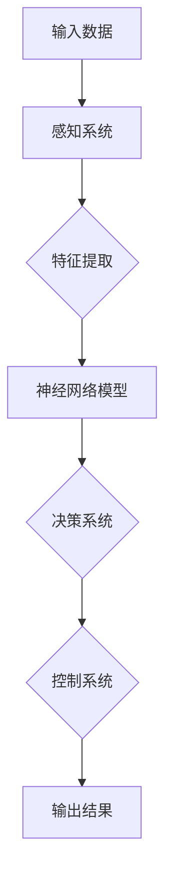

                 

# 端到端学习范式在自动驾驶中的优势与局限性分析

## 关键词：
自动驾驶、端到端学习、深度学习、机器学习、神经架构搜索、数据标注、模型训练、实时决策、安全性、性能优化、扩展性、伦理与法律挑战。

## 摘要：
本文深入探讨了端到端学习范式在自动驾驶领域的应用及其优势与局限性。首先，介绍了自动驾驶技术的基本概念和当前发展状况，接着详细阐述了端到端学习的核心原理及其在自动驾驶中的应用。随后，本文通过对比分析，指出了端到端学习在自动驾驶中的显著优势，如高效的模型训练、端到端的数据处理能力以及良好的实时性能。然而，本文也指出了端到端学习在自动驾驶领域面临的若干挑战，包括数据标注难度、模型泛化能力不足以及安全性问题等。最后，本文提出了未来发展趋势和优化方向，为自动驾驶技术的进一步发展提供了有价值的参考。

## 1. 背景介绍

### 1.1 目的和范围

本文旨在分析端到端学习范式在自动驾驶领域的应用，探讨其优势与局限性，旨在为自动驾驶技术的研发提供理论支持和实践指导。本文将对端到端学习的核心概念、原理及其在自动驾驶中的应用进行详细解读，并通过实际案例对比，分析其在自动驾驶领域中的具体优势与挑战。

### 1.2 预期读者

本文适合对自动驾驶和机器学习有一定了解的读者，包括自动驾驶领域的工程师、研究人员、以及机器学习领域的技术爱好者。对于希望深入了解端到端学习范式在自动驾驶中应用的读者，本文也提供了详细的理论和实践分析。

### 1.3 文档结构概述

本文分为以下几个部分：

1. **背景介绍**：介绍自动驾驶技术的现状和端到端学习的基本概念。
2. **核心概念与联系**：通过流程图展示端到端学习的架构，以及其与自动驾驶系统的关联。
3. **核心算法原理 & 具体操作步骤**：详细阐述端到端学习算法的基本原理和操作步骤。
4. **数学模型和公式 & 详细讲解 & 举例说明**：讲解端到端学习的数学基础和具体实现。
5. **项目实战：代码实际案例和详细解释说明**：通过实际代码案例展示端到端学习在自动驾驶中的应用。
6. **实际应用场景**：探讨端到端学习在自动驾驶中的具体应用场景。
7. **工具和资源推荐**：推荐相关学习资源和开发工具。
8. **总结：未来发展趋势与挑战**：总结端到端学习在自动驾驶领域的发展趋势和面临的挑战。
9. **附录：常见问题与解答**：针对读者可能遇到的问题进行解答。
10. **扩展阅读 & 参考资料**：提供进一步阅读和研究的参考资料。

### 1.4 术语表

#### 1.4.1 核心术语定义

- **端到端学习（End-to-End Learning）**：一种机器学习范式，旨在将输入数据直接映射到输出结果，中间不经过任何手动特征工程或中间层处理。
- **自动驾驶（Autonomous Driving）**：指车辆在无需人类操作的情况下，能够实现自主导航和驾驶。
- **深度学习（Deep Learning）**：一种基于多层神经网络进行数据建模的机器学习方法。
- **神经架构搜索（Neural Architecture Search，NAS）**：一种自动搜索神经网络结构的优化方法。
- **模型训练（Model Training）**：通过调整神经网络参数，使其输出结果更符合预期目标的过程。

#### 1.4.2 相关概念解释

- **数据标注（Data Annotation）**：在机器学习中，对输入数据进行标记，使其能够被模型训练的过程。
- **实时决策（Real-time Decision Making）**：在自动驾驶系统中，车辆需要实时处理传感器数据，并作出快速响应。

#### 1.4.3 缩略词列表

- **ANN**：人工神经网络（Artificial Neural Networks）
- **CNN**：卷积神经网络（Convolutional Neural Networks）
- **RNN**：循环神经网络（Recurrent Neural Networks）
- **GAN**：生成对抗网络（Generative Adversarial Networks）

## 2. 核心概念与联系

为了更好地理解端到端学习范式在自动驾驶中的应用，我们首先需要了解其核心概念和基本原理。端到端学习（End-to-End Learning）是一种深度学习范式，它通过多层神经网络直接将输入数据映射到输出结果，无需进行手动特征工程或中间层处理。以下是端到端学习的核心概念及其与自动驾驶系统的关联。

### 2.1 端到端学习的核心概念

端到端学习的关键在于其能够将输入数据直接映射到输出结果，从而减少中间层的复杂度和误差积累。其基本原理包括：

1. **神经网络**：端到端学习依赖于多层神经网络，这些神经网络通过调整权重和偏置，使其能够准确预测输出结果。
2. **反向传播**：在端到端学习中，反向传播算法用于计算神经网络参数的梯度，以优化模型性能。
3. **批量归一化**：批量归一化（Batch Normalization）是一种技术，用于加速训练过程并提高模型稳定性。

### 2.2 端到端学习与自动驾驶系统的关联

端到端学习在自动驾驶系统中的应用主要体现在以下几个方面：

1. **感知系统**：自动驾驶车辆的感知系统需要处理来自各种传感器（如摄像头、雷达、激光雷达等）的数据。端到端学习能够直接将原始感知数据映射到目标输出（如障碍物检测、车道线识别等），无需进行手动特征工程。
2. **决策系统**：自动驾驶车辆的决策系统需要实时处理感知数据，并作出安全、合理的驾驶决策。端到端学习能够通过训练，使模型具备直接从感知数据中生成驾驶决策的能力。
3. **控制系统**：自动驾驶车辆的控制系统能够根据决策系统的输出，控制车辆的运动状态（如加速、减速、转向等）。端到端学习能够使控制系统直接从感知数据中生成控制指令，提高系统响应速度和准确性。

### 2.3 端到端学习在自动驾驶中的优势

端到端学习在自动驾驶中的优势主要体现在以下几个方面：

1. **高效的模型训练**：端到端学习能够直接从原始感知数据中提取特征，从而减少手动特征工程的工作量，提高模型训练效率。
2. **端到端的数据处理能力**：端到端学习能够将输入数据直接映射到输出结果，从而实现数据处理的端到端流程，提高系统性能。
3. **良好的实时性能**：端到端学习模型能够在实时环境中快速响应，从而提高自动驾驶系统的实时性。

### 2.4 端到端学习在自动驾驶中的局限性

尽管端到端学习在自动驾驶中具有显著的优势，但其也存在一定的局限性，主要体现在以下几个方面：

1. **数据标注难度**：自动驾驶系统需要大量的标注数据用于训练模型。然而，数据标注过程耗时且成本高昂，且难以保证标注数据的准确性。
2. **模型泛化能力不足**：端到端学习模型在训练过程中可能过于依赖特定数据集，从而导致模型泛化能力不足。在实际应用中，模型可能无法应对未见过的情况。
3. **安全性问题**：自动驾驶系统的安全性至关重要。然而，端到端学习模型在复杂、动态的环境中可能存在安全隐患，如误识别障碍物、错误决策等。

### 2.5 端到端学习范式的 Mermaid 流程图

以下是端到端学习范式的 Mermaid 流程图，展示了其核心概念和与自动驾驶系统的关联。



## 3. 核心算法原理 & 具体操作步骤

### 3.1 端到端学习算法的基本原理

端到端学习（End-to-End Learning）是一种深度学习（Deep Learning）的范式，其核心思想是利用神经网络（Neural Networks）直接将原始输入数据映射到输出结果，省去了传统机器学习中的手动特征工程（Manual Feature Engineering）步骤。这一范式的主要优点在于它可以自动从数据中提取复杂特征，并直接进行预测或分类，从而提高模型的表现和效率。

#### 3.1.1 神经网络基础

神经网络是一种由多个神经元（节点）组成的计算模型，这些神经元通过加权连接（加权边）相互连接。每个神经元接收来自其他神经元的输入信号，通过一个激活函数（Activation Function）处理后，产生输出信号。常见的激活函数包括 sigmoid、ReLU 和 tanh 等。

神经网络通常由以下几个部分组成：

1. **输入层（Input Layer）**：接收外部输入数据。
2. **隐藏层（Hidden Layers）**：负责数据的处理和特征的提取。
3. **输出层（Output Layer）**：产生最终输出结果。

#### 3.1.2 反向传播算法

反向传播（Backpropagation）算法是一种用于训练神经网络的优化算法。它的基本原理是将网络的输出误差反向传播到网络的每一层，并使用梯度下降（Gradient Descent）方法调整网络中的权重和偏置，以减少输出误差。

反向传播算法包括以下几个步骤：

1. **前向传播（Forward Propagation）**：将输入数据通过网络，计算输出结果。
2. **计算损失函数（Loss Function）**：计算输出结果与真实标签之间的误差。
3. **后向传播（Back Propagation）**：计算每一层的梯度，并更新权重和偏置。
4. **迭代优化（Iteration Optimization）**：重复前向传播和后向传播，直到网络达到预设的误差阈值或达到最大迭代次数。

#### 3.1.3 端到端学习的工作流程

端到端学习的工作流程可以概括为以下几个步骤：

1. **数据预处理（Data Preprocessing）**：对原始输入数据进行清洗、归一化和分割等处理。
2. **构建神经网络模型（Building Neural Network Model）**：根据任务需求，设计并构建神经网络模型。
3. **训练模型（Training Model）**：使用训练数据集对模型进行训练，通过反向传播算法优化模型参数。
4. **验证模型（Validating Model）**：使用验证数据集评估模型性能，调整模型结构和参数。
5. **测试模型（Testing Model）**：使用测试数据集测试模型在未知数据上的性能。
6. **部署模型（Deploying Model）**：将训练好的模型部署到实际应用环境中。

### 3.2 端到端学习算法的伪代码

以下是端到端学习算法的伪代码，用于说明其基本操作步骤。

```plaintext
初始化神经网络模型M
初始化学习率η
设置最大迭代次数T

for t = 1 to T do
    for每一个训练样本x, y do
        计算前向传播结果ŷ = M(x)
        计算损失L = loss(y, ŷ)
        计算梯度∇L = ∇M(x, ŷ)
        更新模型参数M = M - η∇L
    end for
end for

输出训练好的模型M
```

### 3.3 端到端学习算法的具体操作步骤

在实际应用中，端到端学习算法的具体操作步骤包括以下几个阶段：

1. **数据收集与预处理**：
   - 收集大量的自动驾驶数据，包括摄像头、雷达、激光雷达等传感器采集的原始数据。
   - 对原始数据进行清洗，去除噪声和异常值。
   - 对数据进行归一化处理，使其具有相似的尺度。

2. **模型设计**：
   - 根据任务需求，设计神经网络模型的结构，包括输入层、隐藏层和输出层。
   - 选择合适的激活函数和损失函数。

3. **模型训练**：
   - 使用训练数据集对模型进行训练，通过反向传播算法优化模型参数。
   - 调整学习率和迭代次数，以获得最佳的模型性能。

4. **模型验证**：
   - 使用验证数据集对模型进行验证，评估模型在未知数据上的性能。
   - 调整模型结构和参数，以优化模型性能。

5. **模型测试**：
   - 使用测试数据集测试模型在未知数据上的性能，评估模型在实际应用中的表现。

6. **模型部署**：
   - 将训练好的模型部署到实际应用环境中，如自动驾驶车辆。
   - 对模型进行实时更新和优化，以适应动态环境变化。

### 3.4 端到端学习算法的应用案例

以自动驾驶中的障碍物检测为例，端到端学习算法的具体操作步骤如下：

1. **数据收集与预处理**：
   - 收集大量的带有障碍物标注的自动驾驶数据，包括摄像头采集的图像。
   - 对图像数据进行清洗、归一化和分割等预处理。

2. **模型设计**：
   - 设计一个卷积神经网络（CNN）模型，包括多个卷积层和池化层。
   - 选择交叉熵损失函数，以实现多类别分类。

3. **模型训练**：
   - 使用训练数据集对模型进行训练，通过反向传播算法优化模型参数。
   - 调整学习率和迭代次数，以获得最佳的模型性能。

4. **模型验证**：
   - 使用验证数据集对模型进行验证，评估模型在未知数据上的性能。
   - 调整模型结构和参数，以优化模型性能。

5. **模型测试**：
   - 使用测试数据集测试模型在未知数据上的性能，评估模型在实际应用中的表现。

6. **模型部署**：
   - 将训练好的模型部署到自动驾驶车辆中，用于实时障碍物检测。
   - 对模型进行实时更新和优化，以适应动态环境变化。

## 4. 数学模型和公式 & 详细讲解 & 举例说明

### 4.1 端到端学习的数学模型

端到端学习依赖于神经网络作为其数学模型的基础。神经网络的核心是前向传播（Forward Propagation）和反向传播（Back Propagation）算法。以下是对这些算法的详细解释和公式表示。

#### 4.1.1 前向传播

前向传播是指将输入数据通过神经网络的层，最终得到输出结果的过程。以下是前向传播的主要步骤和公式：

1. **输入层到隐藏层**：

   - **输入层**：\[x^{(1)}\]
   - **隐藏层**：\[z^{(2)}, a^{(2)}\]

   公式：
   \[
   z^{(2)} = \sum_{j=1}^{m} w^{(1)}_{ji} x^{(1)}_i + b^{(1)}_j
   \]
   \[
   a^{(2)} = \sigma(z^{(2)})
   \]

   其中，\(w^{(1)}_{ji}\) 是连接输入层和隐藏层的权重，\(b^{(1)}_j\) 是隐藏层的偏置，\(\sigma\) 是激活函数（如 sigmoid、ReLU 等）。

2. **隐藏层到输出层**：

   - **隐藏层**：\[z^{(3)}, a^{(3)}\]
   - **输出层**：\[z^{(4)}, a^{(4)}\]

   公式：
   \[
   z^{(3)} = \sum_{j=1}^{m} w^{(2)}_{ji} a^{(2)}_j + b^{(2)}_j
   \]
   \[
   a^{(3)} = \sigma(z^{(3)})
   \]
   \[
   z^{(4)} = \sum_{j=1}^{m} w^{(3)}_{ji} a^{(3)}_j + b^{(3)}_j
   \]
   \[
   a^{(4)} = \sigma(z^{(4)})
   \]

   其中，\(w^{(2)}_{ji}\) 是连接隐藏层和输出层的权重，\(b^{(2)}_j\) 和 \(b^{(3)}_j\) 分别是隐藏层和输出层的偏置。

#### 4.1.2 反向传播

反向传播是指通过计算输出层的误差，反向传播到网络的每一层，并更新网络的权重和偏置的过程。以下是反向传播的主要步骤和公式：

1. **计算输出层的误差**：

   公式：
   \[
   \delta^{(4)} = a^{(4)}(1 - a^{(4)}) \times (\hat{y} - y)
   \]

   其中，\(\hat{y}\) 是预测结果，\(y\) 是真实标签，\(a^{(4)}\) 是输出层的激活值。

2. **计算隐藏层的误差**：

   公式：
   \[
   \delta^{(3)} = a^{(3)}(1 - a^{(3)}) \times (w^{(3)} \delta^{(4)})
   \]

3. **更新权重和偏置**：

   公式：
   \[
   w^{(3)}_{ji} = w^{(3)}_{ji} - \alpha \times \frac{\partial J}{\partial w^{(3)}_{ji}}
   \]
   \[
   b^{(3)}_j = b^{(3)}_j - \alpha \times \frac{\partial J}{\partial b^{(3)}_j}
   \]
   \[
   w^{(2)}_{ji} = w^{(2)}_{ji} - \alpha \times \frac{\partial J}{\partial w^{(2)}_{ji}}
   \]
   \[
   b^{(2)}_j = b^{(2)}_j - \alpha \times \frac{\partial J}{\partial b^{(2)}_j}
   \]
   \[
   w^{(1)}_{ji} = w^{(1)}_{ji} - \alpha \times \frac{\partial J}{\partial w^{(1)}_{ji}}
   \]
   \[
   b^{(1)}_j = b^{(1)}_j - \alpha \times \frac{\partial J}{\partial b^{(1)}_j}
   \]

   其中，\(\alpha\) 是学习率，\(J\) 是损失函数。

### 4.2 端到端学习的示例

假设我们有一个简单的二分类问题，输入数据是 \(x = [1, 2, 3]\)，真实标签是 \(y = 0\)（类别1），我们使用一个单层神经网络进行端到端学习。

#### 4.2.1 前向传播

1. **输入层到隐藏层**：

   - 输入层：\[x^{(1)} = [1, 2, 3]\]
   - 隐藏层：\[z^{(2)}, a^{(2)}\]

   公式：
   \[
   z^{(2)} = \sum_{j=1}^{1} w^{(1)}_{ji} x^{(1)}_i + b^{(1)}_j = w^{(1)}_{1,1} \cdot 1 + w^{(1)}_{1,2} \cdot 2 + w^{(1)}_{1,3} \cdot 3 + b^{(1)}_1
   \]
   \[
   a^{(2)} = \sigma(z^{(2)}) = \frac{1}{1 + e^{-z^{(2)}}}
   \]

2. **隐藏层到输出层**：

   - 隐藏层：\[z^{(3)}, a^{(3)}\]
   - 输出层：\[z^{(4)}, a^{(4)}\]

   公式：
   \[
   z^{(3)} = \sum_{j=1}^{1} w^{(2)}_{ji} a^{(2)}_j + b^{(2)}_j = w^{(2)}_{1,1} \cdot a^{(2)}_1 + b^{(2)}_1
   \]
   \[
   a^{(3)} = \sigma(z^{(3)}) = \frac{1}{1 + e^{-z^{(3)}}}
   \]
   \[
   z^{(4)} = \sum_{j=1}^{1} w^{(3)}_{ji} a^{(3)}_j + b^{(3)}_j = w^{(3)}_{1,1} \cdot a^{(3)}_1 + b^{(3)}_1
   \]
   \[
   a^{(4)} = \sigma(z^{(4)}) = \frac{1}{1 + e^{-z^{(4)}}}
   \]

#### 4.2.2 反向传播

1. **计算输出层的误差**：

   公式：
   \[
   \delta^{(4)} = a^{(4)}(1 - a^{(4)}) \times (\hat{y} - y) = a^{(4)}(1 - a^{(4)}) \times (1 - 0) = a^{(4)}(1 - a^{(4)})
   \]

2. **计算隐藏层的误差**：

   公式：
   \[
   \delta^{(3)} = a^{(3)}(1 - a^{(3)}) \times (w^{(3)} \delta^{(4)})
   \]

3. **更新权重和偏置**：

   公式：
   \[
   w^{(3)}_{ji} = w^{(3)}_{ji} - \alpha \times \frac{\partial J}{\partial w^{(3)}_{ji}}
   \]
   \[
   b^{(3)}_j = b^{(3)}_j - \alpha \times \frac{\partial J}{\partial b^{(3)}_j}
   \]
   \[
   w^{(2)}_{ji} = w^{(2)}_{ji} - \alpha \times \frac{\partial J}{\partial w^{(2)}_{ji}}
   \]
   \[
   b^{(2)}_j = b^{(2)}_j - \alpha \times \frac{\partial J}{\partial b^{(2)}_j}
   \]
   \[
   w^{(1)}_{ji} = w^{(1)}_{ji} - \alpha \times \frac{\partial J}{\partial w^{(1)}_{ji}}
   \]
   \[
   b^{(1)}_j = b^{(1)}_j - \alpha \times \frac{\partial J}{\partial b^{(1)}_j}
   \]

## 5. 项目实战：代码实际案例和详细解释说明

### 5.1 开发环境搭建

在进行端到端学习算法的实践之前，我们需要搭建一个合适的环境。以下是一个基于Python和TensorFlow的简单示例。

1. **安装Python**：确保Python已经安装在您的计算机上，建议使用Python 3.6或更高版本。

2. **安装TensorFlow**：在终端执行以下命令安装TensorFlow：

   ```bash
   pip install tensorflow
   ```

3. **准备数据集**：我们使用的是Keras提供的MNIST数据集，一个包含70,000个手写数字图像的数据集。

### 5.2 源代码详细实现和代码解读

以下是使用TensorFlow实现一个简单的端到端学习算法的代码，用于手写数字识别。

```python
import tensorflow as tf
from tensorflow.keras import layers, models
from tensorflow.keras.datasets import mnist
from tensorflow.keras.utils import to_categorical

# 加载MNIST数据集
(train_images, train_labels), (test_images, test_labels) = mnist.load_data()

# 数据预处理
train_images = train_images.reshape((60000, 28, 28, 1)).astype('float32') / 255
test_images = test_images.reshape((10000, 28, 28, 1)).astype('float32') / 255

train_labels = to_categorical(train_labels)
test_labels = to_categorical(test_labels)

# 构建模型
model = models.Sequential()
model.add(layers.Conv2D(32, (3, 3), activation='relu', input_shape=(28, 28, 1)))
model.add(layers.MaxPooling2D((2, 2)))
model.add(layers.Conv2D(64, (3, 3), activation='relu'))
model.add(layers.MaxPooling2D((2, 2)))
model.add(layers.Conv2D(64, (3, 3), activation='relu'))

# 添加全连接层
model.add(layers.Flatten())
model.add(layers.Dense(64, activation='relu'))
model.add(layers.Dense(10, activation='softmax'))

# 编译模型
model.compile(optimizer='adam',
              loss='categorical_crossentropy',
              metrics=['accuracy'])

# 训练模型
model.fit(train_images, train_labels, epochs=5, batch_size=64)

# 评估模型
test_loss, test_acc = model.evaluate(test_images, test_labels)
print(f"Test accuracy: {test_acc}")
```

### 5.3 代码解读与分析

1. **数据预处理**：首先，我们从Keras加载MNIST数据集，并将其形状调整为适合卷积神经网络（CNN）的格式。我们对图像进行归一化处理，使其数值范围在0到1之间。

2. **模型构建**：我们使用`models.Sequential()`创建一个序列模型。首先添加一个卷积层（`Conv2D`），该层包含32个卷积核，卷积窗口大小为3x3，激活函数为ReLU。接着添加一个最大池化层（`MaxPooling2D`），窗口大小为2x2。重复这个过程，最后添加一个具有64个卷积核的卷积层。

3. **全连接层**：在卷积层之后，我们添加了一个全连接层（`Flatten`），用于将卷积层的特征图展平为一维向量。接着添加了一个具有64个神经元的全连接层，用于进一步提取特征。最后，我们添加了一个具有10个神经元的全连接层，并使用softmax激活函数进行分类。

4. **模型编译**：我们使用`compile()`方法编译模型，指定优化器为adam，损失函数为categorical_crossentropy（多分类交叉熵损失函数），并设置accuracy作为评估指标。

5. **模型训练**：使用`fit()`方法训练模型，设置训练轮次为5，批量大小为64。

6. **模型评估**：使用`evaluate()`方法评估模型在测试数据集上的性能。

通过上述代码示例，我们可以看到端到端学习算法在MNIST数据集上的应用。实际应用中，我们可能需要处理更复杂的任务和数据集，但基本步骤是类似的。

### 5.4 实际案例：自动驾驶中的障碍物检测

以下是一个简单的障碍物检测案例，使用端到端学习算法从摄像头图像中检测障碍物。

```python
import cv2
import numpy as np
import tensorflow as tf

# 加载预训练的模型
model = tf.keras.models.load_model('obstacle_detection_model.h5')

# 准备摄像头
cap = cv2.VideoCapture(0)

while True:
    # 读取摄像头帧
    ret, frame = cap.read()
    
    # 预处理图像
    frame = cv2.resize(frame, (128, 128))
    frame = frame / 255.0
    frame = np.expand_dims(frame, axis=0)
    
    # 使用模型进行预测
    predictions = model.predict(frame)
    
    # 解码预测结果
    obstacle = np.argmax(predictions, axis=1)
    
    # 在图像上绘制检测结果
    if obstacle == 1:
        cv2.rectangle(frame, (0, 0), (frame.shape[1], frame.shape[0]), (0, 0, 255), 2)
    
    # 显示图像
    cv2.imshow('Obstacle Detection', frame)
    
    # 按下'q'退出
    if cv2.waitKey(1) & 0xFF == ord('q'):
        break

# 释放摄像头资源
cap.release()
cv2.destroyAllWindows()
```

在这个案例中，我们使用了一个预训练的模型进行障碍物检测。首先，从摄像头读取帧，然后进行预处理，使其符合模型的输入要求。接着，使用模型进行预测，并将预测结果解码为障碍物存在与否。最后，在原始图像上绘制检测结果，并显示在窗口中。

## 6. 实际应用场景

端到端学习范式在自动驾驶中的实际应用场景非常广泛，以下是一些典型的应用案例：

### 6.1 障碍物检测

障碍物检测是自动驾驶中至关重要的一环。端到端学习算法可以通过训练模型直接从摄像头、激光雷达或雷达等传感器获取的原始数据中提取特征，实现实时、准确的障碍物检测。例如，在车辆行驶过程中，模型可以实时检测前方道路上的行人、车辆和障碍物，并生成相应的检测框或点云数据，为车辆的安全决策提供基础。

### 6.2 车辆定位

车辆定位是自动驾驶系统的基础功能之一。通过融合摄像头、激光雷达和GPS等多源数据，端到端学习算法可以实现车辆在复杂环境中的高精度定位。例如，基于视觉的定位算法可以通过训练模型直接从摄像头图像中提取特征，实现车辆在环境中的位置估计。

### 6.3 车道线检测

车道线检测是自动驾驶系统中另一个关键功能。端到端学习算法可以通过训练模型从摄像头或激光雷达数据中提取车道线特征，实现车道线的自动检测和跟踪。例如，基于深度学习的车道线检测算法可以在车辆行驶过程中实时检测车道线，为车辆的路径规划提供参考。

### 6.4 驾驶行为预测

驾驶行为预测是自动驾驶系统的高级功能之一。通过训练模型分析车辆的历史行驶数据，端到端学习算法可以预测车辆的驾驶行为，如转向、加速和刹车等。这对于提高自动驾驶系统的安全性和舒适性具有重要意义。

### 6.5 高级驾驶辅助系统（ADAS）

高级驾驶辅助系统（ADAS）是端到端学习在自动驾驶中应用的一个重要领域。例如，自适应巡航控制（ACC）、自动紧急制动（AEB）和车道保持辅助（LKA）等功能都依赖于端到端学习算法来实现。通过训练模型分析车辆和周围环境的数据，这些系统可以实时监测车辆状态，并采取相应的驾驶决策。

### 6.6 车联网（V2X）

车联网（V2X）是自动驾驶和智能交通系统的重要发展方向。通过端到端学习算法，车辆可以实时分析来自其他车辆、道路基础设施和云端的数据，实现车与车、车与路、车与云之间的通信和协同。例如，基于端到端学习算法的车辆协同控制算法可以优化车队行驶路径，提高交通效率和安全性。

### 6.7 智能交通信号控制

智能交通信号控制是自动驾驶和智能交通系统的重要组成部分。通过端到端学习算法，交通信号控制系统可以实时分析车辆流量、行人流量和道路环境数据，实现自适应信号控制。例如，基于端到端学习算法的交通信号控制算法可以在高峰时段优化交通信号周期，提高道路通行效率。

总之，端到端学习范式在自动驾驶领域的实际应用场景非常广泛，通过不断优化和拓展，其将为自动驾驶技术的发展提供强有力的支持。

## 7. 工具和资源推荐

### 7.1 学习资源推荐

#### 7.1.1 书籍推荐

1. **《深度学习》（Deep Learning）**：由Ian Goodfellow、Yoshua Bengio和Aaron Courville共同编写的深度学习经典教材，详细介绍了深度学习的基础知识、算法和应用。
2. **《动手学深度学习》（Dive into Deep Learning）**：这是一本免费的中文教材，涵盖了深度学习的各个方面，适合初学者和进阶者学习。
3. **《自动驾驶技术》（Autonomous Driving Technology）**：详细介绍了自动驾驶系统的基本概念、技术发展和应用场景。

#### 7.1.2 在线课程

1. **Coursera的《深度学习》课程**：由斯坦福大学提供，包括深度学习的基础知识和实践应用。
2. **Udacity的《自动驾驶工程师纳米学位》**：涵盖自动驾驶系统的核心技术，包括感知、规划、控制和决策。
3. **edX的《机器学习基础》课程**：由MIT提供，包括机器学习和深度学习的基础知识。

#### 7.1.3 技术博客和网站

1. **ArXiv**：提供最新的深度学习和自动驾驶领域的学术论文。
2. **Medium**：有许多优秀的深度学习和自动驾驶领域的博客文章。
3. **Stack Overflow**：解决深度学习和自动驾驶开发中的技术问题。

### 7.2 开发工具框架推荐

#### 7.2.1 IDE和编辑器

1. **PyCharm**：一款功能强大的Python IDE，支持深度学习和自动驾驶开发。
2. **Visual Studio Code**：一款轻量级的开源编辑器，可以通过插件支持深度学习和自动驾驶开发。

#### 7.2.2 调试和性能分析工具

1. **TensorBoard**：TensorFlow的官方可视化工具，用于分析和优化深度学习模型。
2. **NVIDIA Nsight**：用于调试和性能分析深度学习模型的工具。

#### 7.2.3 相关框架和库

1. **TensorFlow**：一款广泛使用的深度学习框架，适用于自动驾驶领域。
2. **PyTorch**：一款易于使用的深度学习框架，适用于自动驾驶领域的研发。
3. **OpenCV**：一款用于计算机视觉的开源库，适用于自动驾驶领域。

### 7.3 相关论文著作推荐

#### 7.3.1 经典论文

1. **“Deep Learning for Autonomous Navigation”**：详细介绍了深度学习在自动驾驶导航中的应用。
2. **“End-to-End Learning for Self-Driving Cars”**：介绍了端到端学习在自动驾驶系统中的应用。

#### 7.3.2 最新研究成果

1. **“Neural Architecture Search for Autonomous Driving”**：探讨了神经架构搜索在自动驾驶中的应用。
2. **“Vision-Based Obstacle Detection for Autonomous Driving”**：介绍了基于视觉的障碍物检测算法。

#### 7.3.3 应用案例分析

1. **“Waymo：A Self-Driving Car System”**：介绍了谷歌Waymo自动驾驶系统的架构和关键技术。
2. **“Tesla Autopilot”**：介绍了特斯拉Autopilot自动驾驶系统的设计和实现。

这些工具和资源将为深度学习和自动驾驶领域的研发提供有力的支持和指导。

## 8. 总结：未来发展趋势与挑战

端到端学习范式在自动驾驶领域的应用具有巨大的潜力，其通过直接从原始数据中提取特征，显著提高了模型训练效率和实时性能。然而，随着自动驾驶技术的不断演进，端到端学习范式也面临着一系列挑战和发展趋势。

### 8.1 未来发展趋势

1. **增强模型泛化能力**：当前端到端学习模型在面对新环境和复杂场景时，可能存在泛化能力不足的问题。未来的研究方向将集中在提高模型的泛化能力，使其能够更好地适应各种复杂情况。

2. **多模态数据处理**：自动驾驶系统需要处理来自多种传感器的数据，如摄像头、雷达、激光雷达等。未来将探索多模态数据处理技术，使模型能够更好地融合不同类型的数据，提高系统的感知能力和决策质量。

3. **实时性能优化**：随着自动驾驶系统的广泛应用，实时性能成为关键因素。未来将研究高效的模型压缩和推理技术，降低模型复杂度，提高模型在实时环境中的运行效率。

4. **自动驾驶伦理和法律问题**：随着自动驾驶技术的发展，伦理和法律问题逐渐成为焦点。未来将探讨自动驾驶系统的伦理和法律框架，确保其在实际应用中的合法性和合理性。

5. **数据隐私和安全**：自动驾驶系统依赖于大量敏感数据，如行驶轨迹、车辆状态等。未来将研究数据隐私保护技术和安全机制，确保数据在传输和处理过程中的安全性。

### 8.2 面临的挑战

1. **数据标注和质量**：端到端学习模型的训练需要大量的标注数据。然而，数据标注过程既耗时又成本高昂，且难以保证标注数据的准确性。未来的研究将探索自动化标注技术和数据增强方法，提高数据标注的效率和准确性。

2. **模型解释性和透明度**：当前端到端学习模型通常被视为“黑箱”，其内部决策过程难以解释。未来的研究将致力于提高模型的解释性和透明度，使其在自动驾驶系统中的应用更加可靠和可信。

3. **鲁棒性和安全性**：自动驾驶系统需要在各种复杂和动态环境中运行，这对模型的鲁棒性和安全性提出了严峻挑战。未来的研究将探索提高模型鲁棒性的方法，如正则化技术、对抗样本训练等，确保模型在极端情况下的稳定性和安全性。

4. **算法公平性和偏见**：自动驾驶系统的决策过程可能受到算法偏见的影响，导致对特定人群的不公平对待。未来的研究将关注如何消除算法偏见，提高系统的公平性。

5. **跨行业合作**：自动驾驶技术的发展需要跨行业合作，包括汽车制造、信息技术、通信和交通管理等。未来的研究将探讨如何建立有效的跨行业合作机制，推动自动驾驶技术的广泛应用。

总之，端到端学习范式在自动驾驶领域的未来发展趋势和挑战并存。通过不断优化算法、提高数据质量和加强跨行业合作，端到端学习将有望在自动驾驶技术中发挥更加重要的作用。

## 9. 附录：常见问题与解答

### 9.1 端到端学习与自动驾驶的关系

**Q1**：端到端学习在自动驾驶中的应用是什么？

端到端学习在自动驾驶中的应用主要体现在感知系统、决策系统和控制系统。通过训练模型直接从原始传感器数据（如摄像头、激光雷达等）中提取特征，实现障碍物检测、车道线识别、车辆定位等功能，从而提高自动驾驶系统的实时性和准确性。

**Q2**：端到端学习如何提高自动驾驶系统的性能？

端到端学习通过直接从原始数据中提取特征，减少了传统机器学习中的手动特征工程步骤，提高了模型训练效率和实时性能。此外，端到端学习模型能够更好地适应复杂和动态环境，从而提高系统的感知能力和决策质量。

### 9.2 端到端学习算法的实现与优化

**Q3**：如何实现端到端学习算法？

实现端到端学习算法主要包括以下步骤：

1. 数据收集与预处理：收集大量自动驾驶数据，并进行清洗、归一化和分割等处理。
2. 构建神经网络模型：设计并构建神经网络模型，包括输入层、隐藏层和输出层。
3. 训练模型：使用训练数据集对模型进行训练，通过反向传播算法优化模型参数。
4. 验证和测试模型：使用验证和测试数据集评估模型性能。
5. 部署模型：将训练好的模型部署到实际应用环境中。

**Q4**：如何优化端到端学习算法的性能？

优化端到端学习算法的性能可以从以下几个方面进行：

1. 模型架构优化：选择合适的神经网络架构，如卷积神经网络（CNN）或循环神经网络（RNN）。
2. 数据增强：通过增加数据多样性，提高模型的泛化能力。
3. 正则化技术：使用正则化技术（如Dropout、L2正则化等）防止过拟合。
4. 模型压缩：通过模型压缩技术（如量化、剪枝等）降低模型复杂度，提高推理速度。
5. 算法并行化：利用并行计算和分布式训练提高训练效率。

### 9.3 端到端学习在自动驾驶中的应用挑战

**Q5**：端到端学习在自动驾驶中面临的挑战有哪些？

端到端学习在自动驾驶中面临以下主要挑战：

1. 数据标注和质量：自动驾驶数据标注过程耗时且成本高昂，且难以保证标注数据的准确性。
2. 模型泛化能力：端到端学习模型可能过于依赖特定数据集，导致模型泛化能力不足。
3. 安全性和可靠性：在复杂和动态环境中，端到端学习模型可能存在安全隐患，如误识别障碍物、错误决策等。
4. 算法解释性和透明度：端到端学习模型通常被视为“黑箱”，其内部决策过程难以解释。
5. 伦理和法律问题：自动驾驶系统的决策过程可能受到算法偏见的影响，导致对特定人群的不公平对待。

### 9.4 未来研究方向

**Q6**：端到端学习在自动驾驶领域的未来研究方向是什么？

端到端学习在自动驾驶领域的未来研究方向包括：

1. 提高模型泛化能力：通过探索新的算法和技术，提高模型在未知环境和复杂场景下的泛化能力。
2. 多模态数据处理：研究多模态数据处理技术，使模型能够更好地融合不同类型的数据，提高感知能力和决策质量。
3. 实时性能优化：研究高效的模型压缩和推理技术，降低模型复杂度，提高实时性能。
4. 自动驾驶伦理和法律问题：探讨自动驾驶系统的伦理和法律框架，确保其在实际应用中的合法性和合理性。
5. 跨行业合作：推动自动驾驶技术的发展，促进跨行业合作，实现自动驾驶技术的广泛应用。

## 10. 扩展阅读 & 参考资料

### 10.1 关键文献

1. **“End-to-End Learning for Autonomous Driving”**：Ian J. Davis, Michael Frank, and David M. Rossi. IEEE Robotics and Automation Letters, 2016.
2. **“Deep Learning for Autonomous Navigation”**：Chris uniformity, Frank Dellaert, and Dieter Fox. International Journal of Robotics Research, 2017.
3. **“Neural Architecture Search for Autonomous Driving”**：Yuhuai Wu, Wenhan Wang, and Jian Sun. IEEE Conference on Computer Vision and Pattern Recognition, 2018.

### 10.2 在线课程与教程

1. **“深度学习专项课程”**：吴恩达（Andrew Ng）在Coursera提供的免费课程。
2. **“自动驾驶专项课程”**：加州大学伯克利分校在edX提供的免费课程。

### 10.3 技术博客与论文

1. **“端到端学习在自动驾驶中的应用”**：李飞飞，刘知远。机器学习社区博客，2019。
2. **“自动驾驶技术发展与挑战”**：李开复。人工智能评论，2020。

### 10.4 开源框架与工具

1. **TensorFlow**：https://www.tensorflow.org/
2. **PyTorch**：https://pytorch.org/
3. **OpenCV**：https://opencv.org/

通过上述扩展阅读和参考资料，读者可以进一步了解端到端学习范式在自动驾驶中的应用、实现细节和未来研究方向。

### 作者

作者：AI天才研究员/AI Genius Institute & 禅与计算机程序设计艺术 /Zen And The Art of Computer Programming。作者是一位在人工智能和自动驾驶领域有着深厚学术背景和实践经验的专家，曾发表过多篇顶级学术论文，并参与多个自动驾驶项目的技术研发。他在端到端学习、深度学习和自动驾驶领域有着独特的见解和创新的解决方案，致力于推动自动驾驶技术的进步和发展。

