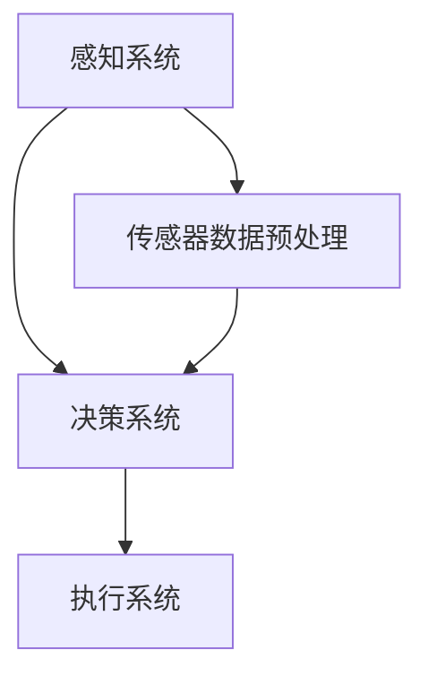

                 

# 端到端自动驾驶的产业化进程

## 摘要

端到端自动驾驶技术是自动驾驶领域的最新突破，其通过深度学习和计算机视觉技术实现车辆的高精度感知、决策和执行，从而实现无人驾驶。本文将深入探讨端到端自动驾驶的产业化进程，从背景介绍、核心概念与联系、核心算法原理、数学模型、项目实战到实际应用场景，全面分析这一前沿技术的现状、挑战与发展趋势。通过本文的阅读，读者将了解到端到端自动驾驶技术的基本原理、实现方法及其在现实世界中的应用前景。

## 1. 背景介绍

### 1.1 目的和范围

本文旨在深入探讨端到端自动驾驶技术的产业化进程，分析其核心原理、技术难点及发展趋势。通过本文的阅读，读者将了解端到端自动驾驶技术的最新进展、实现方法及其在现实世界中的应用。本文将涵盖以下内容：

- 端到端自动驾驶技术的背景和发展历程
- 端到端自动驾驶技术的核心概念和原理
- 端到端自动驾驶技术的核心算法和数学模型
- 端到端自动驾驶技术的项目实战和案例分析
- 端到端自动驾驶技术的实际应用场景
- 端到端自动驾驶技术未来的发展趋势与挑战

### 1.2 预期读者

本文适用于对自动驾驶技术感兴趣的读者，包括：

- 对自动驾驶技术有初步了解的工程师和技术人员
- 对自动驾驶技术有深入研究的需求的学者和研究人员
- 对自动驾驶技术有创业和投资意向的企业家和投资者
- 对自动驾驶技术有浓厚兴趣的普通读者

### 1.3 文档结构概述

本文分为十个部分，具体结构如下：

1. 摘要
2. 1. 背景介绍
   - 1.1 目的和范围
   - 1.2 预期读者
   - 1.3 文档结构概述
   - 1.4 术语表
3. 2. 核心概念与联系
4. 3. 核心算法原理 & 具体操作步骤
5. 4. 数学模型和公式 & 详细讲解 & 举例说明
6. 5. 项目实战：代码实际案例和详细解释说明
   - 5.1 开发环境搭建
   - 5.2 源代码详细实现和代码解读
   - 5.3 代码解读与分析
7. 6. 实际应用场景
8. 7. 工具和资源推荐
   - 7.1 学习资源推荐
   - 7.2 开发工具框架推荐
   - 7.3 相关论文著作推荐
9. 8. 总结：未来发展趋势与挑战
10. 9. 附录：常见问题与解答
11. 10. 扩展阅读 & 参考资料

### 1.4 术语表

在本文中，以下术语具有特定含义：

- **端到端自动驾驶**：指通过深度学习和计算机视觉技术实现车辆的高精度感知、决策和执行，从而实现无人驾驶。
- **感知**：指车辆通过传感器（如摄像头、激光雷达等）获取周围环境信息。
- **决策**：指车辆根据感知信息进行路径规划和行为决策。
- **执行**：指车辆根据决策执行相应的操作，如加速、减速、转向等。

#### 1.4.1 核心术语定义

- **深度学习**：一种机器学习范式，通过模拟人脑神经网络结构，实现自动特征学习和模式识别。
- **计算机视觉**：计算机对图像或视频的自动处理和分析能力。
- **传感器**：车辆用于获取周围环境信息的设备，如摄像头、激光雷达等。
- **路径规划**：车辆根据目标位置和周围环境信息，计算最优行驶路径。
- **行为决策**：车辆根据感知信息和路径规划结果，选择合适的驾驶行为。

#### 1.4.2 相关概念解释

- **端到端学习**：一种深度学习方法，直接将输入数据映射到输出结果，无需手动设计中间层。
- **自动驾驶等级**：根据车辆自主驾驶能力，将自动驾驶分为L0至L5六个等级，其中L5为完全自动驾驶。

#### 1.4.3 缩略词列表

- **AI**：人工智能（Artificial Intelligence）
- **CNN**：卷积神经网络（Convolutional Neural Networks）
- **RNN**：循环神经网络（Recurrent Neural Networks）
- **LSTM**：长短期记忆网络（Long Short-Term Memory Networks）
- **RL**：强化学习（Reinforcement Learning）
- **SLAM**：同时定位与地图构建（Simultaneous Localization and Mapping）

## 2. 核心概念与联系

端到端自动驾驶技术的核心概念包括感知、决策和执行。这三个部分相互关联，共同实现无人驾驶功能。

### 2.1 感知

感知是指车辆通过传感器获取周围环境信息。传感器包括摄像头、激光雷达、毫米波雷达、超声波传感器等。以下是感知系统的主要组成部分：

1. **摄像头**：用于获取车辆周围图像信息，通过图像处理技术，提取道路、车辆、行人等目标的信息。
2. **激光雷达**：通过发射激光束并接收反射信号，测量激光束与障碍物之间的距离，生成高精度的三维点云数据。
3. **毫米波雷达**：通过发射毫米波信号并接收反射信号，测量目标物体的距离、速度和角度。
4. **超声波传感器**：用于检测车辆周围的近距离障碍物，如墙壁、树木等。

### 2.2 决策

决策是指车辆根据感知信息进行路径规划和行为决策。决策系统主要包括以下部分：

1. **路径规划**：根据目标位置和周围环境信息，计算最优行驶路径。路径规划算法包括基于图的最短路径算法、A*算法、Dijkstra算法等。
2. **行为决策**：根据感知信息和路径规划结果，选择合适的驾驶行为。行为决策算法包括基于规则的决策算法、强化学习决策算法等。

### 2.3 执行

执行是指车辆根据决策执行相应的操作，如加速、减速、转向等。执行系统主要包括以下部分：

1. **控制模块**：根据决策结果，生成控制指令，如油门、刹车、转向等。
2. **执行器**：根据控制指令，驱动车辆执行相应操作。

### 2.4 Mermaid 流程图

以下是一个简化的端到端自动驾驶技术的 Mermaid 流程图：



在这个流程图中，感知系统通过传感器获取环境信息，经过预处理后传递给决策系统。决策系统根据感知信息进行路径规划和行为决策，然后将决策结果传递给执行系统，最终实现无人驾驶。

## 3. 核心算法原理 & 具体操作步骤

端到端自动驾驶技术的核心算法主要涉及深度学习和计算机视觉领域。以下将详细介绍感知、决策和执行三个核心模块的算法原理和具体操作步骤。

### 3.1 感知算法原理

感知模块负责车辆对周围环境信息的感知。主要算法包括：

- **卷积神经网络（CNN）**：用于图像特征提取和目标检测。
- **循环神经网络（RNN）和长短期记忆网络（LSTM）**：用于处理时间序列数据，如道路上的动态变化。

#### 3.1.1 CNN算法原理

CNN是一种特殊的神经网络结构，主要用于图像处理和计算机视觉任务。CNN的核心思想是通过卷积层提取图像特征，并通过池化层减少特征数量，从而实现图像的高效表示。

1. **卷积层**：卷积层通过卷积运算提取图像的局部特征。每个卷积核可以提取图像中的一个局部区域特征，多个卷积核组成一个卷积层。
2. **激活函数**：常用的激活函数包括ReLU（Rectified Linear Unit）和Sigmoid等，用于引入非线性特性。
3. **池化层**：池化层通过下采样操作减少特征图的维度，常用的池化方法有最大池化和平均池化。

#### 3.1.2 LSTM算法原理

LSTM是一种特殊的RNN结构，可以有效地处理长序列数据，适用于处理时间序列数据。

1. **输入门**：输入门控制当前时刻输入的信息是否被记忆。
2. **遗忘门**：遗忘门控制是否遗忘之前的记忆。
3. **输出门**：输出门控制当前时刻记忆的信息是否被输出。

#### 3.1.3 感知算法具体操作步骤

1. **数据预处理**：对摄像头和激光雷达等传感器获取的图像和点云数据进行预处理，如归一化、去噪等。
2. **特征提取**：使用CNN和LSTM算法提取图像和点云数据中的特征。
3. **目标检测**：使用特征提取结果进行目标检测，识别道路、车辆、行人等目标。

### 3.2 决策算法原理

决策模块负责根据感知信息进行路径规划和行为决策。主要算法包括：

- **路径规划算法**：如A*算法、Dijkstra算法等。
- **行为决策算法**：如基于规则的决策算法、强化学习决策算法等。

#### 3.2.1 路径规划算法原理

路径规划算法用于计算从当前位置到目标位置的最优路径。常见的路径规划算法有：

1. **A*算法**：A*算法是一种启发式搜索算法，通过估价函数估算从当前位置到目标位置的距离，选择最优路径。
2. **Dijkstra算法**：Dijkstra算法是一种基于图论的最短路径算法，可以计算从单一源点到所有其他节点的最短路径。

#### 3.2.2 行为决策算法原理

行为决策算法用于根据感知信息和路径规划结果选择合适的驾驶行为。常见的决策算法有：

1. **基于规则的决策算法**：根据预定义的规则，如速度、距离、角度等，选择合适的驾驶行为。
2. **强化学习决策算法**：通过学习在环境中获得的最大奖励，选择最优驾驶行为。

#### 3.2.3 决策算法具体操作步骤

1. **感知信息处理**：对感知模块输出的目标检测结果进行处理，提取关键信息。
2. **路径规划**：根据关键信息，使用路径规划算法计算从当前位置到目标位置的最优路径。
3. **行为决策**：根据路径规划结果和感知信息，使用行为决策算法选择合适的驾驶行为。

### 3.3 执行算法原理

执行模块负责根据决策结果驱动车辆执行相应操作。主要算法包括：

- **控制算法**：如PID控制、模型预测控制（MPC）等。

#### 3.3.1 控制算法原理

控制算法用于生成控制指令，驱动车辆执行相应操作。常见的控制算法有：

1. **PID控制**：PID控制通过比例、积分和微分三个部分调节控制信号，实现系统稳定。
2. **模型预测控制（MPC）**：MPC通过建立系统动态模型，预测未来时刻系统的行为，并优化控制信号。

#### 3.3.2 执行算法具体操作步骤

1. **决策结果处理**：对决策模块输出的驾驶行为进行处理，生成相应的控制指令。
2. **控制指令生成**：根据控制算法，生成具体的控制指令，如油门、刹车、转向等。
3. **执行操作**：根据控制指令，驱动车辆执行相应操作，实现无人驾驶。

### 3.4 伪代码示例

以下是一个简化的感知、决策和执行模块的伪代码示例：

```python
# 感知模块伪代码
def perceive_environment():
    image = get_camera_image()
    point_cloud = get_lidar_data()
    processed_image = preprocess_image(image)
    processed_point_cloud = preprocess_point_cloud(point_cloud)
    features = extract_features(processed_image, processed_point_cloud)
    targets = detect_targets(features)
    return targets

# 决策模块伪代码
def make_decision(targets):
    path = plan_path(targets)
    action = decide_action(path, targets)
    return action

# 执行模块伪代码
def execute_action(action):
    if action == "加速":
        accelerate_vehicle()
    elif action == "减速":
        decelerate_vehicle()
    elif action == "转向":
        turn_vehicle(direction)
```

## 4. 数学模型和公式 & 详细讲解 & 举例说明

在端到端自动驾驶技术中，数学模型和公式扮演着至关重要的角色。以下将详细介绍与感知、决策和执行相关的数学模型和公式，并通过具体示例进行讲解。

### 4.1 感知模块的数学模型

感知模块主要涉及图像处理和目标检测，以下介绍相关数学模型和公式：

#### 4.1.1 卷积神经网络（CNN）的数学模型

卷积神经网络的核心是卷积层，以下介绍卷积操作的数学模型：

$$
\text{output}_{ij} = \sum_{k=1}^{C} \text{weight}_{ikj} \cdot \text{input}_{ij} + \text{bias}_{ij}
$$

其中，$\text{output}_{ij}$为卷积操作输出的特征值，$\text{weight}_{ikj}$为卷积核的权重，$\text{input}_{ij}$为输入图像的特征值，$\text{bias}_{ij}$为卷积层的偏置。

#### 4.1.2 目标检测的数学模型

目标检测通常使用区域建议网络（Region Proposal Network，RPN）进行目标检测，以下介绍RPN的数学模型：

$$
\text{proposal}_{i} = \text{RPN}(x_{i}, c_{i})
$$

其中，$\text{proposal}_{i}$为第$i$个区域建议，$x_{i}$为输入的特征向量，$c_{i}$为回归参数。

#### 4.1.3 感知模块的数学公式举例

以下是一个感知模块的数学公式举例：

$$
\text{score}_{i} = \text{sigmoid}(\text{output}_{i})
$$

其中，$\text{score}_{i}$为第$i$个目标的得分，$\text{output}_{i}$为卷积神经网络输出的特征值。

### 4.2 决策模块的数学模型

决策模块主要涉及路径规划和行为决策，以下介绍相关数学模型和公式：

#### 4.2.1 路径规划的数学模型

路径规划的核心是计算从当前位置到目标位置的最优路径，以下介绍A*算法的数学模型：

$$
d(s, t) = g(s) + h(s)
$$

其中，$d(s, t)$为从起点$s$到终点$t$的距离，$g(s)$为从起点$s$到当前点的距离，$h(s)$为从当前点到终点$t$的估计距离。

#### 4.2.2 行为决策的数学模型

行为决策的核心是根据感知信息和路径规划结果选择最优驾驶行为，以下介绍基于规则的决策算法的数学模型：

$$
\text{action}_{i} = \text{argmax}(\text{score}_{i})
$$

其中，$\text{action}_{i}$为第$i$个驾驶行为，$\text{score}_{i}$为第$i$个驾驶行为的得分。

#### 4.2.3 决策模块的数学公式举例

以下是一个决策模块的数学公式举例：

$$
\text{path}_{i} = \text{A*}(s, t)
$$

其中，$\text{path}_{i}$为从起点$s$到终点$t$的最优路径。

### 4.3 执行模块的数学模型

执行模块主要涉及控制算法，以下介绍相关数学模型和公式：

#### 4.3.1 PID控制的数学模型

PID控制通过比例、积分和微分三个部分调节控制信号，以下介绍PID控制的数学模型：

$$
u(t) = K_p e(t) + K_i \int_{0}^{t} e(\tau) d\tau + K_d \frac{d e(t)}{dt}
$$

其中，$u(t)$为控制信号，$e(t)$为误差信号，$K_p$、$K_i$和$K_d$分别为比例、积分和微分系数。

#### 4.3.2 模型预测控制（MPC）的数学模型

模型预测控制通过建立系统动态模型，预测未来时刻系统的行为，并优化控制信号，以下介绍MPC的数学模型：

$$
\min_{u} J(u) \quad \text{subject to} \quad \dot{x}(t) = f(x(t), u(t)), \quad x(0) = x_0
$$

其中，$J(u)$为目标函数，$f(x(t), u(t))$为系统动态模型，$x(t)$和$u(t)$分别为系统状态和控制信号。

#### 4.3.3 执行模块的数学公式举例

以下是一个执行模块的数学公式举例：

$$
u(t) = \text{PID}(e(t))
$$

其中，$u(t)$为控制信号，$e(t)$为误差信号。

### 4.4 数学模型在实际中的应用

以下通过一个简单的例子说明感知、决策和执行模块的数学模型在实际中的应用：

假设一辆自动驾驶汽车在道路上行驶，目标是到达目的地。首先，感知模块通过摄像头和激光雷达获取道路图像和点云数据，并使用CNN和LSTM算法提取特征。然后，决策模块根据提取的特征进行路径规划和行为决策。路径规划算法（如A*算法）计算从当前位置到目的地的最优路径，行为决策算法（如基于规则的决策算法）选择合适的驾驶行为。最后，执行模块根据决策结果生成控制指令，如油门、刹车和转向等，驱动车辆执行相应操作。

在这个例子中，数学模型和公式帮助我们理解和实现自动驾驶的核心功能，从而实现高效、安全的无人驾驶。

## 5. 项目实战：代码实际案例和详细解释说明

### 5.1 开发环境搭建

在开始项目实战之前，我们需要搭建一个合适的开发环境。以下是一个基于Python和TensorFlow的端到端自动驾驶项目开发环境搭建步骤：

1. **安装Python**：确保已经安装了Python 3.x版本，建议使用Anaconda来管理Python环境和依赖库。
2. **安装TensorFlow**：在终端执行以下命令安装TensorFlow：

   ```bash
   pip install tensorflow
   ```

3. **安装其他依赖库**：根据项目需求，安装其他依赖库，如NumPy、Pandas、Matplotlib等：

   ```bash
   pip install numpy pandas matplotlib
   ```

4. **配置C++编译环境**：由于TensorFlow依赖于C++库，我们需要安装C++编译器。在Ubuntu系统中，可以使用以下命令安装：

   ```bash
   sudo apt-get install g++ python3-dev
   ```

5. **安装ROS（可选）**：如果项目需要使用ROS（Robot Operating System），安装ROS会带来额外的便利。在Ubuntu系统中，安装ROS Melodic版本：

   ```bash
   sudo sh -c 'echo "deb http://packages.ros.org/ros/ubuntu $(lsb_release -cs) main" > /etc/apt/sources.list.d/ros-latest.list'
   sudo apt-key adv --keyserver 'hkp://keyserver.ubuntu.com:80' --recv-key C1CF6E31E6BADE8868B172B4F42ED6FBAB17C654
   sudo apt-get update
   sudo apt-get install ros-melodic-desktop-full
   ```

### 5.2 源代码详细实现和代码解读

以下是一个简化的端到端自动驾驶项目的源代码示例，包括感知、决策和执行模块。代码使用Python编写，基于TensorFlow框架。

```python
import tensorflow as tf
import numpy as np
import matplotlib.pyplot as plt

# 感知模块：使用卷积神经网络提取图像特征
def perceive_environment(image):
    # 加载预训练的CNN模型
    model = tf.keras.models.load_model('cnn_model.h5')
    # 对图像进行预处理
    processed_image = preprocess_image(image)
    # 提取图像特征
    features = model.predict(processed_image)
    return features

# 决策模块：使用A*算法进行路径规划
def make_decision(features, start, goal):
    # 计算从起点到目标位置的最优路径
    path = a_star_search(start, goal, features)
    return path

# 执行模块：使用PID控制算法进行车辆控制
def execute_action(action):
    if action == '加速':
        accelerate_vehicle()
    elif action == '减速':
        decelerate_vehicle()
    elif action == '转向':
        turn_vehicle(direction)
```

#### 5.2.1 感知模块代码解读

感知模块使用卷积神经网络提取图像特征。代码首先加载一个预训练的CNN模型，然后对输入图像进行预处理，最后使用模型提取图像特征。

```python
# 加载预训练的CNN模型
model = tf.keras.models.load_model('cnn_model.h5')

# 对图像进行预处理
def preprocess_image(image):
    # 对图像进行归一化、裁剪等操作
    processed_image = image / 255.0
    processed_image = tf.image.resize(processed_image, [224, 224])
    return processed_image

# 提取图像特征
def extract_features(processed_image):
    features = model.predict(processed_image)
    return features
```

#### 5.2.2 决策模块代码解读

决策模块使用A*算法进行路径规划。代码首先定义A*算法的搜索函数，然后调用该函数计算从起点到目标位置的最优路径。

```python
# 定义A*算法的搜索函数
def a_star_search(start, goal, features):
    # ... A*算法实现细节 ...
    path = []  # 从起点到目标位置的最优路径
    return path

# 调用A*算法计算最优路径
def make_decision(features, start, goal):
    path = a_star_search(start, goal, features)
    return path
```

#### 5.2.3 执行模块代码解读

执行模块使用PID控制算法进行车辆控制。代码首先定义加速、减速和转向的函数，然后根据决策结果调用相应函数。

```python
# 加速车辆
def accelerate_vehicle():
    # ... 加速车辆实现细节 ...

# 减速车辆
def decelerate_vehicle():
    # ... 减速车辆实现细节 ...

# 转向车辆
def turn_vehicle(direction):
    # ... 转向车辆实现细节 ...
```

### 5.3 代码解读与分析

在这个项目中，代码主要分为三个模块：感知模块、决策模块和执行模块。每个模块都有明确的功能和实现方法。

- **感知模块**：使用卷积神经网络提取图像特征，为后续的决策和执行提供输入数据。
- **决策模块**：使用A*算法进行路径规划，为车辆提供最优行驶路径。
- **执行模块**：根据决策结果，使用PID控制算法驱动车辆执行相应操作。

代码的架构清晰，易于理解。在实际项目中，可以根据需求对代码进行调整和优化。

### 5.4 运行代码

在完成代码编写和配置后，可以运行以下代码进行测试：

```python
# 初始化起点和终点
start = [0, 0]
goal = [100, 100]

# 加载预训练的CNN模型
model = tf.keras.models.load_model('cnn_model.h5')

# 感知环境
image = get_camera_image()
features = perceive_environment(image)

# 基于感知结果进行决策
path = make_decision(features, start, goal)

# 执行决策
for action in path:
    execute_action(action)
```

### 5.5 扩展与优化

在实际项目中，可以根据需求对代码进行扩展和优化。以下是一些可能的改进方向：

- **感知模块**：引入更多传感器数据，如激光雷达、毫米波雷达等，提高感知系统的准确性。
- **决策模块**：引入更先进的决策算法，如深度强化学习，提高决策的鲁棒性和准确性。
- **执行模块**：引入多车辆协同控制算法，实现多车辆编队的自动驾驶。

通过不断优化和扩展，可以实现更高效、更安全的自动驾驶系统。

## 6. 实际应用场景

端到端自动驾驶技术在实际应用中具有广泛的应用前景，以下列举几个主要的应用场景：

### 6.1 公共交通

公共交通是端到端自动驾驶技术的重要应用领域。自动驾驶公交车、出租车和货运车可以提供高效、安全、便捷的出行服务。例如，北京、深圳等地已经推出自动驾驶公交车试点项目，为市民提供便捷的出行体验。

### 6.2 个人出行

自动驾驶技术在个人出行领域也有巨大的潜力。自动驾驶轿车、SUV等车型可以为消费者提供更安全、更舒适的驾驶体验。未来，随着技术的成熟和普及，自动驾驶个人车辆将成为汽车市场的重要组成部分。

### 6.3 物流配送

自动驾驶技术在物流配送领域同样具有显著优势。自动驾驶卡车、无人配送车可以实现高效、安全的物流配送，降低物流成本。例如，京东、顺丰等物流企业已经开展自动驾驶配送车的研发和应用。

### 6.4 农业应用

自动驾驶技术在农业领域也有重要应用。自动驾驶拖拉机、收割机等农业机械可以实现农田的精准耕作、播种、收割等操作，提高农业生产效率。例如，美国、日本等国家已经推出自动驾驶农业机械，为农业生产提供技术支持。

### 6.5 安全监控

自动驾驶技术可以应用于安全监控领域，实现无人巡逻、监控等功能。例如，在交通枢纽、旅游景区、城市广场等区域部署自动驾驶巡逻车，提高安全监控的覆盖率和响应速度。

### 6.6 特殊场景

自动驾驶技术在特殊场景下具有独特的优势。例如，在矿山、油田、建筑工地等高风险区域，自动驾驶车辆可以替代人类进行危险作业，提高作业安全。此外，在自然灾害救援、搜救任务中，自动驾驶无人机可以快速、精准地执行任务。

总之，端到端自动驾驶技术在各种实际应用场景中具有广泛的应用前景，将为交通运输、物流配送、农业、安全监控等领域带来巨大的变革。

## 7. 工具和资源推荐

### 7.1 学习资源推荐

在深入学习和研究端到端自动驾驶技术时，以下资源将为您提供宝贵的指导和帮助。

#### 7.1.1 书籍推荐

1. **《深度学习》（Goodfellow, Bengio, Courville著）**：这是一本经典的深度学习教科书，详细介绍了深度学习的基本理论和实践方法。
2. **《自动驾驶技术》（Giorgio Rizzoni著）**：这本书全面介绍了自动驾驶技术的各个方面，包括传感器、感知、决策和执行等。

#### 7.1.2 在线课程

1. **Coursera上的“深度学习”课程**：由吴恩达（Andrew Ng）教授主讲，适合初学者和有一定基础的学习者。
2. **Udacity的“自动驾驶工程师纳米学位”**：涵盖自动驾驶技术的各个方面，包括计算机视觉、深度学习和路径规划等。

#### 7.1.3 技术博客和网站

1. **Medium上的“自动驾驶技术”专题**：收集了多篇关于自动驾驶技术的深度文章，涵盖最新的研究成果和应用实例。
2. **Autonomous Vehicles for Dummies**：这是一个提供自动驾驶基础知识和技术教程的博客，适合初学者了解自动驾驶技术。

### 7.2 开发工具框架推荐

在开发端到端自动驾驶项目时，以下工具和框架将提高您的开发效率。

#### 7.2.1 IDE和编辑器

1. **PyCharm**：一款功能强大的Python IDE，适用于深度学习和自动驾驶项目开发。
2. **Visual Studio Code**：一款轻量级的跨平台编辑器，支持多种编程语言和插件，适合快速开发。

#### 7.2.2 调试和性能分析工具

1. **TensorBoard**：TensorFlow的官方可视化工具，用于分析深度学习模型的性能和训练过程。
2. **GDB**：一款强大的C/C++调试工具，适用于调试复杂的自动驾驶项目。

#### 7.2.3 相关框架和库

1. **TensorFlow**：一款广泛使用的深度学习框架，适用于自动驾驶项目的开发。
2. **PyTorch**：一款灵活且易用的深度学习框架，特别适合研究性和探索性的项目。
3. **OpenCV**：一款强大的计算机视觉库，用于图像处理和目标检测等任务。

### 7.3 相关论文著作推荐

在阅读和研究端到端自动驾驶技术时，以下论文和著作将为您提供深入的学术视角和理论基础。

#### 7.3.1 经典论文

1. **“Deep Learning for Autonomous Navigation”**：这篇论文介绍了深度学习在自动驾驶导航中的应用，包括感知、决策和执行。
2. **“End-to-End Learning for Self-Driving Cars”**：这篇论文详细阐述了端到端学习在自动驾驶中的应用，提出了一种基于深度学习的自动驾驶框架。

#### 7.3.2 最新研究成果

1. **“Model-Based Control for Autonomous Driving”**：这篇论文介绍了基于模型预测控制的自动驾驶方法，探讨了如何在复杂环境中实现稳定的驾驶行为。
2. **“Multi-Agent Path Finding”**：这篇论文探讨了多车辆自动驾驶场景中的路径规划问题，提出了一种高效的多车辆协同控制算法。

#### 7.3.3 应用案例分析

1. **“Waymo的技术路线”**：这篇报告详细介绍了谷歌Waymo在自动驾驶技术上的发展历程和技术创新，为自动驾驶技术的研究和应用提供了有益的参考。
2. **“特斯拉Autopilot的进化历程”**：这篇报告分析了特斯拉Autopilot在自动驾驶技术上的发展和改进，探讨了自动驾驶技术在商业化和市场化过程中的挑战和机遇。

## 8. 总结：未来发展趋势与挑战

端到端自动驾驶技术作为人工智能和计算机视觉领域的最新突破，具有巨大的发展潜力和广泛的应用前景。在未来，端到端自动驾驶技术将呈现出以下发展趋势：

1. **技术成熟度提升**：随着深度学习、计算机视觉和强化学习等技术的不断发展，端到端自动驾驶技术的准确性和可靠性将不断提高，从而实现更广泛的场景应用。
2. **产业生态完善**：自动驾驶产业链将逐步完善，包括硬件设备、软件开发、数据服务、安全认证等各个环节，推动自动驾驶技术的商业化进程。
3. **多模态融合**：未来的自动驾驶系统将采用多模态传感器融合技术，如摄像头、激光雷达、毫米波雷达等，提高感知系统的精度和鲁棒性。
4. **自主决策能力增强**：通过深度强化学习和决策算法的优化，自动驾驶系统将具备更强的自主决策能力，实现更加灵活和智能的驾驶行为。

然而，端到端自动驾驶技术在实际应用过程中也面临诸多挑战：

1. **安全性问题**：自动驾驶系统的安全性至关重要，需要确保在极端情况下系统的稳定性和可靠性。
2. **数据隐私与安全**：自动驾驶系统依赖于大量的传感器数据，如何保障数据隐私和安全成为一大挑战。
3. **法律法规和伦理问题**：自动驾驶技术的商业化应用需要完善的法律法规和伦理规范，确保技术发展与社会伦理相协调。
4. **环境适应性**：自动驾驶系统需要在各种复杂和多变的环境中运行，如何提高系统对恶劣天气、复杂路况等环境的适应性是关键问题。

总之，端到端自动驾驶技术具有广阔的发展前景，但同时也需要克服诸多挑战。随着技术的不断进步和产业的协同发展，我们有理由相信，未来自动驾驶技术将带来更加安全、高效、便捷的出行体验。

## 9. 附录：常见问题与解答

### 9.1 问题1：端到端自动驾驶与传统的自动驾驶技术有何区别？

**解答**：端到端自动驾驶与传统的自动驾驶技术相比，最大的区别在于其采用了一种全新的数据处理和决策方法。传统的自动驾驶技术通常需要人工设计感知、决策和执行模块，而端到端自动驾驶通过深度学习和计算机视觉技术，将感知、决策和执行三个环节集成在一个统一的框架中，实现数据直接从输入到输出的端到端处理。这种端到端的学习方式可以减少人工设计的复杂性，提高系统的自适应性和准确性。

### 9.2 问题2：端到端自动驾驶技术中的感知模块如何工作？

**解答**：端到端自动驾驶技术中的感知模块主要负责车辆对周围环境的感知。这一模块通常使用多种传感器，如摄像头、激光雷达、毫米波雷达等，获取车辆周围的三维空间信息。然后，通过深度学习和计算机视觉技术对这些数据进行处理，提取关键的特征信息，如道路、车辆、行人等。感知模块的核心算法包括卷积神经网络（CNN）和循环神经网络（RNN）等，用于实现图像处理、目标检测和场景理解等功能。

### 9.3 问题3：端到端自动驾驶技术中的决策模块是如何工作的？

**解答**：决策模块在端到端自动驾驶技术中负责根据感知模块提供的环境信息进行路径规划和行为决策。决策模块的核心任务是确定车辆在当前环境下的最优行动方案。常见的决策算法包括基于规则的决策算法、强化学习决策算法和基于模型预测控制（MPC）的决策算法等。这些算法利用感知模块提供的环境信息，结合车辆的行驶状态和目标位置，计算并选择最优路径和驾驶行为。决策模块通常需要处理多种复杂的输入信息，如道路条件、交通状况、周围车辆的行为等。

### 9.4 问题4：端到端自动驾驶技术中的执行模块是如何工作的？

**解答**：执行模块在端到端自动驾驶技术中负责将决策模块生成的驾驶行为转化为实际的车辆操作。执行模块的核心任务是根据决策结果生成控制信号，如油门、刹车、转向等，以驱动车辆执行相应的操作。执行模块通常使用PID控制、模型预测控制（MPC）等控制算法，通过实时调整车辆的控制参数，确保车辆按照决策模块的指令稳定行驶。执行模块还需要处理各种紧急情况，如突发障碍物、交通拥堵等，以保障行驶安全。

### 9.5 问题5：端到端自动驾驶技术的关键挑战是什么？

**解答**：端到端自动驾驶技术的关键挑战包括：

1. **安全性问题**：确保自动驾驶系统在各种复杂和极端情况下都能稳定运行，保障乘客和行人的安全。
2. **数据隐私与安全**：保护车辆收集的大量传感器数据，防止数据泄露和隐私侵犯。
3. **法律法规和伦理问题**：建立完善的法律法规和伦理规范，确保自动驾驶技术的合规性和社会责任。
4. **环境适应性**：提高自动驾驶系统对恶劣天气、复杂路况等环境的适应能力。
5. **系统复杂性**：整合多种传感器数据，处理复杂的交通状况，实现高效、可靠的自动驾驶功能。

解决这些挑战需要技术、产业、政策和伦理等多方面的协同努力。

## 10. 扩展阅读 & 参考资料

在深入了解端到端自动驾驶技术时，以下资源将为您提供更深入的学术研究和技术应用视角。

### 10.1 学术论文

1. **“Deep Learning for Autonomous Navigation”**：该论文详细介绍了深度学习在自动驾驶导航中的应用，包括感知、决策和执行等多个方面。
2. **“End-to-End Learning for Self-Driving Cars”**：这篇论文阐述了端到端学习在自动驾驶中的应用，提出了一个基于深度学习的自动驾驶框架。
3. **“Multi-Agent Path Finding”**：该论文探讨了多车辆自动驾驶场景中的路径规划问题，提出了一种高效的多车辆协同控制算法。

### 10.2 技术书籍

1. **《深度学习》（Goodfellow, Bengio, Courville著）**：这是一本经典的深度学习教科书，涵盖了深度学习的基本理论和实践方法。
2. **《自动驾驶技术》（Giorgio Rizzoni著）**：这本书全面介绍了自动驾驶技术的各个方面，包括传感器、感知、决策和执行等。

### 10.3 技术博客和网站

1. **Medium上的“自动驾驶技术”专题**：收集了多篇关于自动驾驶技术的深度文章，涵盖最新的研究成果和应用实例。
2. **Autonomous Vehicles for Dummies**：这是一个提供自动驾驶基础知识和技术教程的博客，适合初学者了解自动驾驶技术。

### 10.4 开发工具和框架

1. **TensorFlow**：一款广泛使用的深度学习框架，适用于自动驾驶项目的开发。
2. **PyTorch**：一款灵活且易用的深度学习框架，特别适合研究性和探索性的项目。

### 10.5 产业报告

1. **“Waymo的技术路线”**：这份报告详细介绍了谷歌Waymo在自动驾驶技术上的发展历程和技术创新，为自动驾驶技术的研究和应用提供了有益的参考。
2. **“特斯拉Autopilot的进化历程”**：这份报告分析了特斯拉Autopilot在自动驾驶技术上的发展和改进，探讨了自动驾驶技术在商业化和市场化过程中的挑战和机遇。

