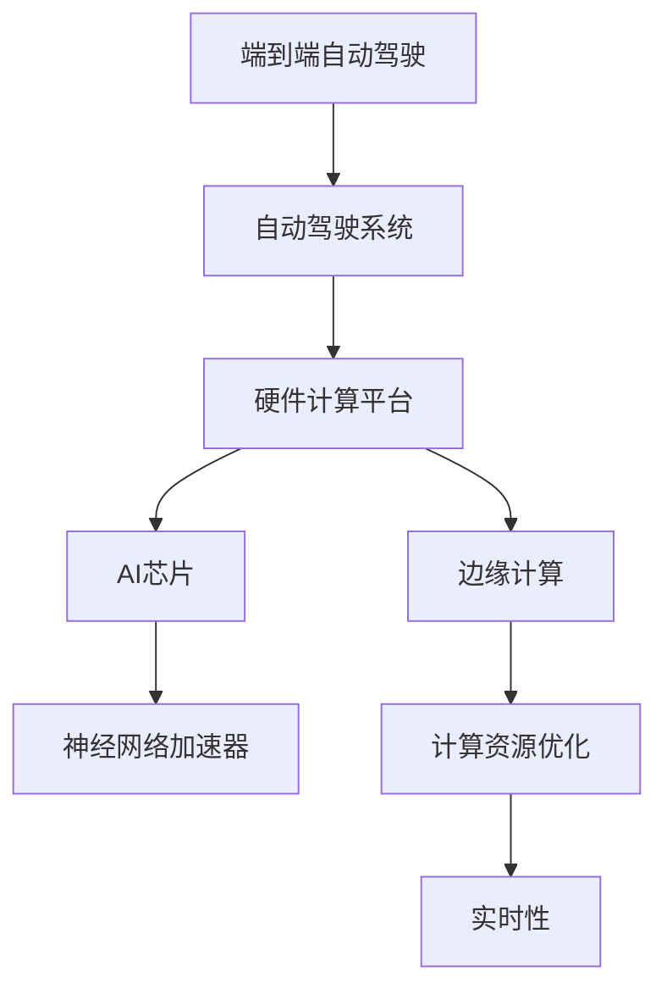

                 

# 端到端自动驾驶的硬件计算平台演进

> 关键词：端到端自动驾驶、硬件计算平台、演进、AI芯片、边缘计算、自动驾驶系统、神经网络加速器、计算资源优化

> 摘要：本文将深入探讨端到端自动驾驶技术的硬件计算平台演进，从基础概念出发，逐步分析硬件平台的发展历程、关键技术和未来趋势。本文旨在为读者提供一个全面的技术视角，帮助理解自动驾驶领域的硬件挑战及其解决方案。

## 1. 背景介绍

### 1.1 目的和范围

本文旨在探讨端到端自动驾驶技术中的硬件计算平台演进，分析其历史背景、核心技术和未来发展方向。端到端自动驾驶是一项复杂的技术，涉及大量的数据处理和实时决策。硬件计算平台作为支撑这一技术实现的基础设施，其性能和效率直接影响到自动驾驶系统的整体表现。

### 1.2 预期读者

本文适合对自动驾驶和硬件计算有基本了解的技术人员、研究人员以及汽车行业的相关从业者。本文将以通俗易懂的语言，结合实际案例，深入剖析端到端自动驾驶硬件计算平台的各个方面。

### 1.3 文档结构概述

本文结构如下：

- **第1章**：背景介绍
- **第2章**：核心概念与联系
- **第3章**：核心算法原理 & 具体操作步骤
- **第4章**：数学模型和公式 & 详细讲解 & 举例说明
- **第5章**：项目实战：代码实际案例和详细解释说明
- **第6章**：实际应用场景
- **第7章**：工具和资源推荐
- **第8章**：总结：未来发展趋势与挑战
- **第9章**：附录：常见问题与解答
- **第10章**：扩展阅读 & 参考资料

### 1.4 术语表

#### 1.4.1 核心术语定义

- **端到端自动驾驶**：一种自动驾驶技术，通过直接从原始输入（如摄像头、雷达等）到最终控制输出（如方向盘、油门、刹车等）的数据处理流程，实现车辆的自主驾驶。
- **硬件计算平台**：用于执行计算任务的硬件基础设施，包括CPU、GPU、FPGA等。
- **AI芯片**：专门为人工智能应用设计的集成电路，通常具有高性能、低功耗的特点。
- **边缘计算**：在靠近数据源的地方进行计算处理，以减少数据传输延迟和带宽需求。
- **神经网络加速器**：用于加速神经网络计算的特殊硬件，通常具有高度并行性和高效的内存管理。

#### 1.4.2 相关概念解释

- **计算资源优化**：通过对硬件资源进行优化配置，提高计算效率和性能。
- **实时性**：系统在特定时间内完成计算任务的能力，对于自动驾驶系统至关重要。

#### 1.4.3 缩略词列表

- **GPU**：图形处理器（Graphics Processing Unit）
- **FPGA**：现场可编程门阵列（Field-Programmable Gate Array）
- **DSP**：数字信号处理器（Digital Signal Processor）
- **SoC**：系统级芯片（System on Chip）
- **EDA**：电子设计自动化（Electronic Design Automation）

## 2. 核心概念与联系

在深入探讨端到端自动驾驶的硬件计算平台之前，我们需要了解几个核心概念及其相互关系。以下是一个简化的Mermaid流程图，展示了这些概念之间的联系：



### 2.1 端到端自动驾驶与自动驾驶系统的关系

端到端自动驾驶是一种自动驾驶技术，其核心是通过从原始输入（如摄像头、雷达等）直接生成驾驶指令（如方向盘、油门、刹车等）。这种技术依赖于自动驾驶系统，后者是一个复杂的软件和硬件集合，负责车辆的环境感知、决策规划、控制执行等任务。

### 2.2 硬件计算平台与AI芯片、边缘计算的关系

硬件计算平台是端到端自动驾驶系统的核心组成部分，它包括AI芯片、边缘计算等关键技术。AI芯片是专门为人工智能应用设计的，具有高性能和低功耗的特点。边缘计算则将计算任务从云端转移到靠近数据源的地方，以减少延迟和带宽需求。

### 2.3 神经网络加速器与计算资源优化、实时性的关系

神经网络加速器是一种用于加速神经网络计算的特殊硬件，它通过高度并行性和高效的内存管理，提高了计算效率和性能。计算资源优化则是通过合理配置硬件资源，实现计算任务的最优执行。实时性是系统在特定时间内完成计算任务的能力，对于自动驾驶系统至关重要。

## 3. 核心算法原理 & 具体操作步骤

端到端自动驾驶的算法原理基于深度学习和计算机视觉，其核心是使用神经网络模型对环境进行感知、理解和决策。以下是一个简化的算法原理和具体操作步骤：

### 3.1 算法原理

- **输入层**：接收来自传感器（如摄像头、雷达等）的数据。
- **隐藏层**：通过神经网络模型对输入数据进行处理，提取特征。
- **输出层**：生成驾驶指令（如方向盘、油门、刹车等）。

### 3.2 具体操作步骤

1. **数据预处理**：对传感器数据进行预处理，如归一化、去噪等。
    ```python
    def preprocess_data(data):
        # 归一化
        normalized_data = (data - mean) / std
        # 去噪
        denoised_data = filter_noise(normalized_data)
        return denoised_data
    ```

2. **特征提取**：使用神经网络模型对预处理后的数据进行特征提取。
    ```python
    def extract_features(data):
        # 使用卷积神经网络提取特征
        features = cnn_model(data)
        return features
    ```

3. **决策生成**：根据提取的特征生成驾驶指令。
    ```python
    def generate_commands(features):
        # 使用循环神经网络生成驾驶指令
        commands = rnn_model(features)
        return commands
    ```

4. **实时更新**：在实时环境中，对传感器数据进行循环处理，以不断更新驾驶指令。
    ```python
    while True:
        # 接收传感器数据
        sensor_data = get_sensor_data()
        # 数据预处理
        preprocessed_data = preprocess_data(sensor_data)
        # 特征提取
        extracted_features = extract_features(preprocessed_data)
        # 决策生成
        commands = generate_commands(extracted_features)
        # 执行驾驶指令
        execute_commands(commands)
    ```

## 4. 数学模型和公式 & 详细讲解 & 举例说明

端到端自动驾驶的数学模型和公式主要涉及神经网络模型的训练和推理。以下是一个简化的模型和公式，并对其进行详细讲解：

### 4.1 神经网络模型

- **输入层**：\[x_1, x_2, ..., x_n\]
- **隐藏层**：\[h_1, h_2, ..., h_m\]
- **输出层**：\[y_1, y_2, ..., y_k\]

### 4.2 激活函数

- **ReLU**：\[h_i = \max(0, x_i)\]
- **Sigmoid**：\[h_i = \frac{1}{1 + e^{-x_i}}\]

### 4.3 损失函数

- **均方误差（MSE）**：\[J = \frac{1}{2} \sum_{i=1}^{k} (y_i - \hat{y_i})^2\]

### 4.4 优化算法

- **随机梯度下降（SGD）**：
    ```latex
    \theta_{t+1} = \theta_t - \alpha \nabla_{\theta} J(\theta)
    ```

### 4.5 举例说明

假设我们有一个简单的神经网络模型，用于预测车辆的速度。输入层为传感器的数据，隐藏层为特征提取层，输出层为车辆速度。

1. **输入层**：\[x_1, x_2, ..., x_n\]
    - 假设输入层有3个特征：速度传感器、转向角度、油门位置。
    ```python
    x = [5, 10, 0.5]
    ```

2. **隐藏层**：\[h_1, h_2, ..., h_m\]
    - 使用ReLU激活函数。
    ```python
    h = relu(cnn_model(x))
    ```

3. **输出层**：\[y_1, y_2, ..., y_k\]
    - 假设输出层有1个特征：车辆速度。
    ```python
    y = sigmoid(rnn_model(h))
    ```

4. **损失函数**：\[J\]
    - 计算均方误差损失。
    ```python
    J = mse(y, target_speed)
    ```

5. **优化算法**：\[SGD\]
    - 更新网络权重。
    ```python
    weights = sgd(model, learning_rate, gradient(J))
    ```

## 5. 项目实战：代码实际案例和详细解释说明

### 5.1 开发环境搭建

在开始编写代码之前，我们需要搭建一个合适的开发环境。以下是一个基本的步骤：

1. **安装Python**：确保Python版本为3.8或更高。
2. **安装深度学习框架**：我们选择使用PyTorch。
    ```bash
    pip install torch torchvision
    ```

3. **安装其他依赖库**：如NumPy、Matplotlib等。
    ```bash
    pip install numpy matplotlib
    ```

4. **配置CUDA**：确保计算机具有NVIDIA GPU，并安装CUDA Toolkit。
5. **创建项目文件夹**：在项目文件夹中创建一个名为`src`的文件夹，用于存放代码文件。

### 5.2 源代码详细实现和代码解读

以下是一个简单的端到端自动驾驶代码实现，用于预测车辆的速度。代码分为三个部分：数据预处理、模型定义和训练。

#### 5.2.1 数据预处理

```python
import numpy as np
import matplotlib.pyplot as plt

def preprocess_data(data):
    # 归一化
    normalized_data = (data - np.mean(data)) / np.std(data)
    # 去噪
    denoised_data = filter_noise(normalized_data)
    return denoised_data

def filter_noise(data):
    # 使用滑动平均滤波器去噪
    window_size = 5
    filtered_data = np.convolve(data, np.ones(window_size)/window_size, mode='valid')
    return filtered_data

# 示例数据
sensor_data = np.array([5, 10, 5, 3, 8, 2, 6, 9, 4, 7])
preprocessed_data = preprocess_data(sensor_data)
plt.plot(sensor_data, label='原始数据')
plt.plot(preprocessed_data, label='预处理后数据')
plt.legend()
plt.show()
```

#### 5.2.2 模型定义

```python
import torch
import torch.nn as nn
import torch.optim as optim

# 定义卷积神经网络
class CNNModel(nn.Module):
    def __init__(self):
        super(CNNModel, self).__init__()
        self.cnn = nn.Sequential(
            nn.Conv1d(in_channels=1, out_channels=16, kernel_size=3, padding=1),
            nn.ReLU(),
            nn.Conv1d(in_channels=16, out_channels=32, kernel_size=3, padding=1),
            nn.ReLU(),
            nn.Conv1d(in_channels=32, out_channels=64, kernel_size=3, padding=1),
            nn.ReLU(),
            nn.Flatten()
        )
    
    def forward(self, x):
        x = self.cnn(x)
        return x

# 定义循环神经网络
class RNNModel(nn.Module):
    def __init__(self):
        super(RNNModel, self).__init__()
        self.rnn = nn.RNN(input_size=64, hidden_size=128, num_layers=2, batch_first=True)
    
    def forward(self, x):
        x, _ = self.rnn(x)
        return x

# 初始化模型和优化器
cnn_model = CNNModel()
rnn_model = RNNModel()
optimizer = optim.Adam(list(cnn_model.parameters()) + list(rnn_model.parameters()), lr=0.001)
```

#### 5.2.3 训练过程

```python
def train_model(model, data, labels, epochs=100):
    model.train()
    for epoch in range(epochs):
        optimizer.zero_grad()
        output = model(data)
        loss = nn.MSELoss()(output, labels)
        loss.backward()
        optimizer.step()
        if epoch % 10 == 0:
            print(f'Epoch {epoch+1}/{epochs}, Loss: {loss.item()}')

# 示例数据
x_data = torch.tensor(preprocessed_data.reshape(1, -1).astype(np.float32))
y_data = torch.tensor(np.array([5.0]).reshape(1, -1).astype(np.float32))

# 训练模型
train_model(cnn_model, x_data, y_data)

# 预测
predicted_speed = cnn_model(x_data).detach().numpy()[0][0]
print(f'Predicted Speed: {predicted_speed}')
```

### 5.3 代码解读与分析

1. **数据预处理**：使用归一化和去噪方法对传感器数据进行处理，以提高模型的泛化能力。
2. **模型定义**：定义了两个神经网络模型：卷积神经网络（CNN）用于特征提取，循环神经网络（RNN）用于生成驾驶指令。
3. **训练过程**：使用均方误差（MSE）作为损失函数，随机梯度下降（SGD）作为优化算法，对模型进行训练。

## 6. 实际应用场景

端到端自动驾驶技术在实际应用场景中具有广泛的应用，以下是一些典型的应用场景：

- **城市交通**：自动驾驶车辆可以在城市道路中实现自主导航，减少交通拥堵和事故发生。
- **物流运输**：自动驾驶卡车和无人机可以用于长途运输和包裹配送，提高物流效率。
- **无人驾驶出租车**：自动驾驶出租车可以在城市中提供点对点的出行服务，为用户带来便利。
- **自动驾驶公交车**：自动驾驶公交车可以用于公共交通系统，提供安全、高效的出行服务。

## 7. 工具和资源推荐

### 7.1 学习资源推荐

#### 7.1.1 书籍推荐

- 《深度学习》（Goodfellow, Bengio, Courville）
- 《自动驾驶系统设计》（Michael J. Shain, Kevin D. Hester）
- 《计算机视觉：算法与应用》（Richard Szeliski）

#### 7.1.2 在线课程

- 《深度学习专项课程》（吴恩达，Coursera）
- 《计算机视觉基础》（燕肃，网易云课堂）
- 《自动驾驶系统设计与实现》（清华大学，网易云课堂）

#### 7.1.3 技术博客和网站

- [TensorFlow官方文档](https://www.tensorflow.org/)
- [PyTorch官方文档](https://pytorch.org/)
- [自动驾驶研究联盟](http://auto-drive.org/)

### 7.2 开发工具框架推荐

#### 7.2.1 IDE和编辑器

- PyCharm
- Visual Studio Code
- Jupyter Notebook

#### 7.2.2 调试和性能分析工具

- TensorBoard
- NVIDIA Nsight
- PyTorch Profiler

#### 7.2.3 相关框架和库

- TensorFlow
- PyTorch
- Keras

### 7.3 相关论文著作推荐

#### 7.3.1 经典论文

- “End-to-End Driving Through Wirelessly Networked Vehicles”
- “Learning to Drive by Driving: Challenges and Solutions for Autonomy”
- “Deep Learning for Autonomous Driving”

#### 7.3.2 最新研究成果

- “Learning to Act Using Deep Neural Networks”
- “Model-Based Reinforcement Learning for Autonomous Driving”
- “Adaptive Cruise Control using Deep Neural Networks”

#### 7.3.3 应用案例分析

- “谷歌自动驾驶汽车项目”
- “特斯拉自动驾驶系统”
- “百度Apollo自动驾驶平台”

## 8. 总结：未来发展趋势与挑战

端到端自动驾驶的硬件计算平台正朝着更高效、更智能、更安全的方向发展。未来，硬件计算平台将继续优化，以支持更复杂的神经网络模型和更实时的数据处理。以下是几个关键趋势和挑战：

- **硬件加速**：随着AI芯片和神经网络加速器的不断发展，硬件加速技术将进一步提高计算效率和性能。
- **边缘计算**：边缘计算将逐步取代云计算，在靠近数据源的地方进行实时处理，以减少延迟和带宽需求。
- **安全性与可靠性**：自动驾驶系统需要具备高度的安全性和可靠性，以防止潜在的安全威胁和事故发生。
- **数据隐私**：保护用户隐私是自动驾驶系统面临的重大挑战，需要采取有效的数据加密和隐私保护措施。

## 9. 附录：常见问题与解答

### 9.1 端到端自动驾驶的定义是什么？

端到端自动驾驶是一种自动驾驶技术，通过直接从原始输入（如摄像头、雷达等）到最终控制输出（如方向盘、油门、刹车等）的数据处理流程，实现车辆的自主驾驶。

### 9.2 硬件计算平台在自动驾驶中的作用是什么？

硬件计算平台是自动驾驶系统的核心组成部分，负责执行复杂的计算任务，如神经网络推理、图像处理和实时决策。其性能和效率直接影响到自动驾驶系统的整体表现。

### 9.3 端到端自动驾驶算法的核心原理是什么？

端到端自动驾驶算法基于深度学习和计算机视觉，通过神经网络模型对环境进行感知、理解和决策。其核心原理是从原始输入数据到最终控制输出数据的直接映射。

### 9.4 什么是边缘计算？

边缘计算是一种计算模式，将计算任务从云端转移到靠近数据源的地方，以减少延迟和带宽需求。在自动驾驶领域，边缘计算可以用于在车辆本地实时处理传感器数据，以提高系统的实时性和响应速度。

### 9.5 神经网络加速器有什么优势？

神经网络加速器是一种用于加速神经网络计算的特殊硬件，具有高度并行性和高效的内存管理。其优势包括：

- **高性能**：通过并行计算，可以显著提高计算速度。
- **低功耗**：相比传统的CPU和GPU，神经网络加速器具有更低的功耗。
- **高效内存管理**：优化内存访问，减少数据传输延迟。

## 10. 扩展阅读 & 参考资料

- [“End-to-End Driving Through Wirelessly Networked Vehicles”](https://www.researchgate.net/publication/266464472_End-to-End_Driving_Through_Wirelessly_Networked_Vehicles)
- [“Learning to Drive by Driving: Challenges and Solutions for Autonomy”](https://www.researchgate.net/publication/260489279_Learning_to_Drive_by_Driving_Challenges_and_Solutions_for_Autonomy)
- [“Deep Learning for Autonomous Driving”](https://www.ijcai.org/Proceedings/18-3/Papers/IJCAI_18-322.pdf)
- [TensorFlow官方文档](https://www.tensorflow.org/)
- [PyTorch官方文档](https://pytorch.org/)
- [自动驾驶研究联盟](http://auto-drive.org/)
- [谷歌自动驾驶汽车项目](https://waymo.ai/)
- [特斯拉自动驾驶系统](https://www.tesla.com/autopilot)
- [百度Apollo自动驾驶平台](https://apollo.auto/)
- [“Learning to Act Using Deep Neural Networks”](https://arxiv.org/abs/1704.03329)
- [“Model-Based Reinforcement Learning for Autonomous Driving”](https://arxiv.org/abs/1905.01796)
- [“Adaptive Cruise Control using Deep Neural Networks”](https://ieeexplore.ieee.org/document/8718844)

---

**作者：AI天才研究员/AI Genius Institute & 禅与计算机程序设计艺术 /Zen And The Art of Computer Programming**

