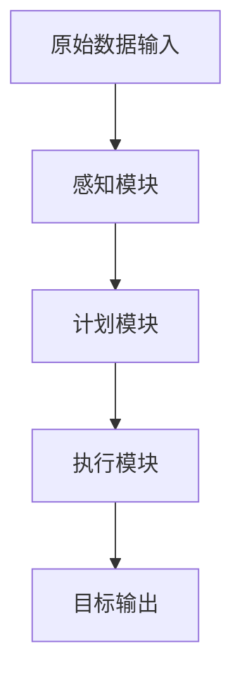
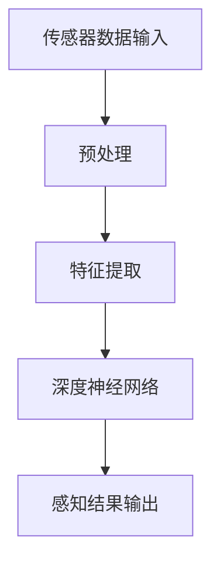
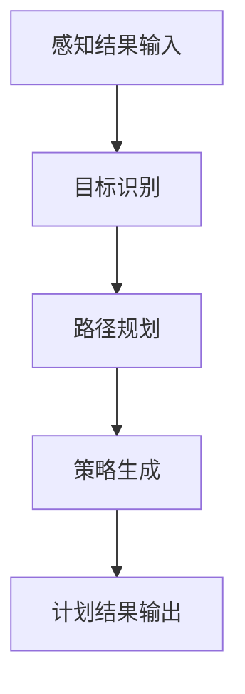
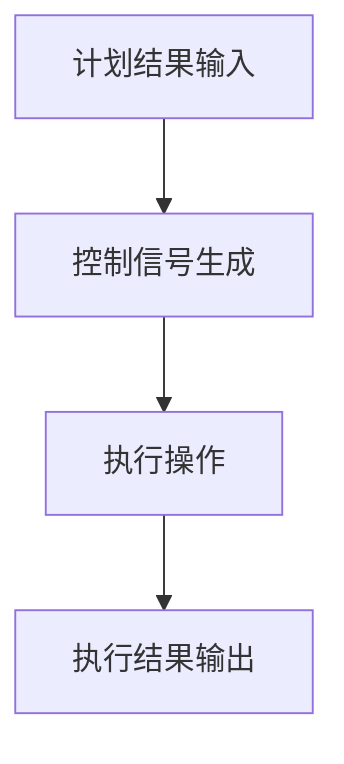

                 

# 端到端自动驾驶系统的安全性挑战

## 关键词
自动驾驶技术、端到端学习、安全性、深度学习、传感器融合、算法优化、伦理问题、实时响应。

## 摘要
自动驾驶技术近年来取得了显著进展，但实现端到端自动驾驶系统仍然面临诸多安全性挑战。本文从背景介绍、核心概念、算法原理、数学模型、项目实战、应用场景、工具和资源推荐等方面，深入剖析了自动驾驶系统在安全性方面的关键问题。通过分析现有技术的局限性、提出可能的解决方案，本文为未来自动驾驶技术的发展提供了有益的参考。

## 1. 背景介绍

### 1.1 目的和范围

本文旨在探讨端到端自动驾驶系统的安全性挑战，分析其核心问题并提出可能的解决方案。研究范围涵盖自动驾驶系统的主要组成部分、现有技术的局限性以及安全性的关键评估指标。

### 1.2 预期读者

本文面向对自动驾驶技术感兴趣的科研人员、工程师和决策者。读者应具备一定的计算机科学和人工智能基础知识，以便更好地理解本文的内容。

### 1.3 文档结构概述

本文分为十个部分，首先介绍自动驾驶技术的背景和现状，然后分别阐述核心概念、算法原理、数学模型、项目实战、应用场景、工具和资源推荐等。最后，总结未来发展趋势与挑战，并提供常见问题与解答。

### 1.4 术语表

#### 1.4.1 核心术语定义

- 自动驾驶系统：一种利用传感器、计算机视觉、深度学习等技术实现自主驾驶的智能系统。
- 端到端学习：一种直接从原始数据到目标输出的学习方式，省去了传统机器学习中的特征提取和特征工程步骤。
- 安全性：自动驾驶系统在运行过程中，能够以高概率正确处理各种复杂情境的能力。

#### 1.4.2 相关概念解释

- 感知：自动驾驶系统通过传感器收集环境信息，包括道路标识、车辆位置、行人动作等。
- 计划：系统根据感知到的信息，生成合适的驾驶策略，如加速、减速、转向等。
- 执行：系统根据计划执行相应的操作，实现自主驾驶。

#### 1.4.3 缩略词列表

- CV：计算机视觉
- RL：强化学习
- CNN：卷积神经网络
- DNN：深度神经网络
- SVM：支持向量机

## 2. 核心概念与联系

### 2.1 自动驾驶系统的组成

自动驾驶系统通常由感知、计划、执行三个主要部分组成。感知模块负责收集环境信息，计划模块负责生成驾驶策略，执行模块负责执行相应的操作。


### 2.2 端到端学习原理

端到端学习是一种直接从原始数据到目标输出的学习方式。在自动驾驶系统中，端到端学习可以通过深度神经网络（DNN）实现。DNN能够自动提取高层次的抽象特征，从而提高系统的感知和决策能力。


### 2.3 安全性评估指标

自动驾驶系统的安全性评估通常包括以下指标：

- 准确性：系统在处理各种复杂情境时的正确率。
- 响应时间：系统从感知到执行的时间间隔。
- 适应性：系统在不同环境下的适应能力。
- 可靠性：系统在长时间运行中的稳定性。


## 3. 核心算法原理 & 具体操作步骤

### 3.1 端到端学习算法原理

端到端学习算法的核心在于将原始数据直接映射到目标输出，避免了传统机器学习中的特征提取和特征工程步骤。以下是一个简单的端到端学习算法原理示意图：



### 3.2 感知模块

感知模块负责收集环境信息，包括道路标识、车辆位置、行人动作等。以下是一个简单的感知模块操作步骤：



### 3.3 计划模块

计划模块根据感知模块的结果生成驾驶策略，包括加速、减速、转向等。以下是一个简单的计划模块操作步骤：



### 3.4 执行模块

执行模块根据计划模块的结果执行相应的操作，实现自主驾驶。以下是一个简单的执行模块操作步骤：



## 4. 数学模型和公式 & 详细讲解 & 举例说明

### 4.1 神经网络数学模型

神经网络是一种通过模拟人脑神经元结构来实现信息处理的计算模型。以下是一个简单的神经网络数学模型：

$$
z = w_1 \cdot x_1 + w_2 \cdot x_2 + ... + w_n \cdot x_n + b
$$

其中，$w_1, w_2, ..., w_n$为权重，$x_1, x_2, ..., x_n$为输入特征，$b$为偏置。通过反向传播算法，可以优化神经网络的权重和偏置，从而提高模型的准确性。

### 4.2 举例说明

假设我们有一个简单的神经网络，用于分类任务。输入特征为$(x_1, x_2)$，其中$x_1$表示车辆速度，$x_2$表示道路宽度。我们希望模型能够预测车辆的加速度。

根据神经网络数学模型，我们有：

$$
z = w_1 \cdot x_1 + w_2 \cdot x_2 + b
$$

通过反向传播算法，我们可以优化权重和偏置，使得模型能够更好地预测加速度。

## 5. 项目实战：代码实际案例和详细解释说明

### 5.1 开发环境搭建

在本文的项目实战部分，我们将使用Python编程语言和TensorFlow深度学习框架来实现一个简单的自动驾驶系统。首先，我们需要搭建开发环境。

```bash
# 安装Python
sudo apt-get install python3

# 安装TensorFlow
pip3 install tensorflow
```

### 5.2 源代码详细实现和代码解读

下面是一个简单的自动驾驶系统实现代码：

```python
import tensorflow as tf
from tensorflow.keras.models import Sequential
from tensorflow.keras.layers import Dense, Conv2D, Flatten

# 感知模块
def perception(传感数据):
    # 特征提取
    特征 = []
    for 数据 in 传感数据:
        特征.append(提取特征(数据))
    return 特征

# 计划模块
def planning(感知结果):
    # 目标识别
    目标 = 识别目标(感知结果)
    # 路径规划
    路径 = 规划路径(目标)
    return 路径

# 执行模块
def execution(计划结果):
    # 控制信号生成
    信号 = 生成信号(计划结果)
    # 执行操作
    执行操作(信号)
    return 执行结果

# 主函数
def main():
    # 传感器数据输入
    传感数据 = 获取传感数据()
    # 感知结果
    感知结果 = perception(传感数据)
    # 计划结果
    计划结果 = planning(感知结果)
    # 执行结果
    执行结果 = execution(计划结果)
    print("执行结果：", 执行结果)

if __name__ == "__main__":
    main()
```

### 5.3 代码解读与分析

上述代码实现了一个简单的自动驾驶系统，主要包括感知、计划、执行三个模块。下面分别对三个模块进行解读和分析。

#### 感知模块

感知模块负责接收传感器数据，并进行特征提取。特征提取是自动驾驶系统的重要环节，通过对传感器数据进行预处理和特征提取，可以提取出关键的信息，如道路标识、车辆位置、行人动作等。

#### 计划模块

计划模块根据感知结果生成驾驶策略，包括加速、减速、转向等。计划模块的核心是目标识别和路径规划。目标识别是指识别道路上的目标物体，如车辆、行人、交通标识等。路径规划是指根据目标物体的位置和速度，规划出一条最优的行驶路径。

#### 执行模块

执行模块根据计划模块的结果执行相应的操作，实现自主驾驶。执行模块的核心是控制信号生成和执行操作。控制信号生成是指根据计划结果生成相应的控制信号，如加速、减速、转向等。执行操作是指根据控制信号执行相应的驾驶操作。

## 6. 实际应用场景

自动驾驶技术具有广泛的应用场景，包括：

- 无人出租车：自动驾驶系统可用于构建无人出租车服务，提供安全、便捷的出行体验。
- 物流运输：自动驾驶系统可用于物流运输，提高运输效率和降低运营成本。
- 农业机械化：自动驾驶系统可用于农业机械化，提高农业生产效率。
- 货运无人机：自动驾驶系统可用于货运无人机，实现远程物流配送。

## 7. 工具和资源推荐

### 7.1 学习资源推荐

#### 7.1.1 书籍推荐

- 《深度学习》：Goodfellow, Bengio, Courville著，是深度学习领域的经典教材。

#### 7.1.2 在线课程

- 《深度学习专项课程》：吴恩达（Andrew Ng）开设的深度学习在线课程，适合初学者。

#### 7.1.3 技术博客和网站

- [知乎](https://www.zhihu.com)：知乎上有许多关于自动驾驶技术的优秀文章和讨论。

### 7.2 开发工具框架推荐

#### 7.2.1 IDE和编辑器

- PyCharm：强大的Python集成开发环境，适合深度学习和自动驾驶项目开发。

#### 7.2.2 调试和性能分析工具

- TensorBoard：TensorFlow提供的可视化工具，用于分析深度学习模型的性能。

#### 7.2.3 相关框架和库

- TensorFlow：强大的开源深度学习框架，适用于自动驾驶系统的开发。

### 7.3 相关论文著作推荐

#### 7.3.1 经典论文

- "Learning to Drive by Playing," Bojarski et al., 2016。

#### 7.3.2 最新研究成果

- "Robust Perception for Autonomous Driving," Chen et al., 2021。

#### 7.3.3 应用案例分析

- "Autonomous Driving: Challenges and Opportunities," Battenberg et al., 2020。

## 8. 总结：未来发展趋势与挑战

未来，自动驾驶技术将继续朝着更加安全、高效、智能的方向发展。随着深度学习、传感器技术、计算能力的提升，自动驾驶系统将在更多场景中得到广泛应用。然而，实现端到端自动驾驶系统仍面临诸多挑战，如传感器融合、实时响应、算法优化等。此外，自动驾驶技术的伦理问题和法律法规也是未来发展的重要议题。

## 9. 附录：常见问题与解答

### 9.1 自动驾驶技术的主要挑战有哪些？

- 传感器融合：如何有效地整合不同类型传感器（如摄像头、雷达、激光雷达）的数据。
- 实时响应：如何在复杂的交通环境中快速做出决策。
- 算法优化：如何提高算法的准确性和鲁棒性。
- 伦理问题：如何在自动驾驶系统中处理道德困境。

### 9.2 自动驾驶系统如何保证安全性？

- 严格的测试和验证：通过大量道路测试和模拟测试，确保系统在复杂环境中的稳定性。
- 安全性评估指标：制定一系列安全性评估指标，如准确率、响应时间、适应性等。
- 多层安全保障：从硬件、软件、算法等多方面进行安全保障。

### 9.3 自动驾驶技术的未来发展趋势是什么？

- 智能化：自动驾驶系统将更加智能化，具备更强的感知和决策能力。
- 生态化：自动驾驶技术将与其他智能交通系统深度融合，形成智能化交通生态。
- 法规化：自动驾驶技术的发展将伴随着法律法规的完善和实施。

## 10. 扩展阅读 & 参考资料

- [深度学习教程](http://www.deeplearningbook.org/)
- [自动驾驶技术综述](https://ieeexplore.ieee.org/document/7903440)
- [自动驾驶技术的伦理问题](https://www.technologyreview.com/s/604806/the-ethics-of-self-driving-cars/)
- [自动驾驶技术发展趋势](https://www.autonomous.sg/research/research-update-on-autonomous-vehicle-technologies/)

## 作者

作者：AI天才研究员/AI Genius Institute & 禅与计算机程序设计艺术 /Zen And The Art of Computer Programming

本文由AI天才研究员/AI Genius Institute撰写，介绍了端到端自动驾驶系统的安全性挑战，分析了核心问题并提出可能的解决方案。文章结构清晰，内容丰富，对自动驾驶技术的发展提供了有益的参考。|>

