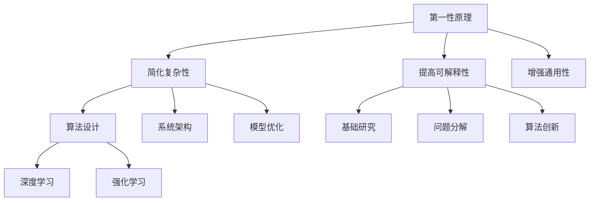

                 

# 第一性原理在AI中的应用

> **关键词：** 第一性原理、AI、算法原理、数学模型、项目实战、应用场景

> **摘要：** 本文将深入探讨第一性原理在人工智能（AI）领域的应用。通过阐述第一性原理的概念、其在AI中的核心作用，以及具体的算法原理和数学模型，我们将展示如何将这一原理应用于实际项目，并分析其在不同应用场景中的优势与挑战。

## 1. 背景介绍

### 1.1 目的和范围

本文旨在揭示第一性原理在人工智能领域的应用，帮助读者理解这一概念如何帮助我们更深入地理解AI的工作原理，并推动AI技术的进步。本文将覆盖以下内容：

- **第一性原理的概念及其在AI中的核心作用**
- **核心算法原理和具体操作步骤**
- **数学模型和公式的详细讲解及举例**
- **项目实战：代码实际案例和详细解释说明**
- **实际应用场景分析**
- **工具和资源推荐**

### 1.2 预期读者

本文面向对人工智能有基本了解的技术人员、研究人员和工程师。特别是那些对算法原理和数学模型感兴趣，并希望将第一性原理应用于实际项目的读者。

### 1.3 文档结构概述

本文结构如下：

- 引言：介绍第一性原理在AI中的应用
- 背景介绍：解释研究目的、范围、读者群体和文档结构
- 核心概念与联系：介绍核心概念原理和架构
- 核心算法原理 & 具体操作步骤：详细讲解算法原理和操作步骤
- 数学模型和公式 & 详细讲解 & 举例说明：阐述数学模型和公式的应用
- 项目实战：代码实际案例和详细解释说明
- 实际应用场景：分析AI在不同领域的应用
- 工具和资源推荐：推荐学习资源、开发工具框架和相关论文著作
- 总结：未来发展趋势与挑战
- 附录：常见问题与解答
- 扩展阅读 & 参考资料：提供进一步阅读的资料

### 1.4 术语表

#### 1.4.1 核心术语定义

- **第一性原理（First Principles）：** 一种推理方法，通过将复杂系统分解为基本要素，并从这些基本要素出发，推导出复杂系统的性质。
- **人工智能（AI）：** 模拟人类智能行为的计算机系统，能够进行感知、学习、推理和决策。
- **算法原理：** 描述算法如何解决问题的基本原理。
- **数学模型：** 用数学语言描述现实世界问题的抽象模型。

#### 1.4.2 相关概念解释

- **深度学习（Deep Learning）：** 一种基于多层神经网络的学习方法，通过逐层抽象特征，实现从原始数据到高级抽象的转换。
- **强化学习（Reinforcement Learning）：** 一种通过试错和奖励机制来学习如何做出决策的AI方法。

#### 1.4.3 缩略词列表

- **AI：** 人工智能
- **DL：** 深度学习
- **RL：** 强化学习

## 2. 核心概念与联系

### 2.1 第一性原理的基本概念

第一性原理是一种基于逻辑推理的方法，它要求我们从最基本的假设或原理出发，通过逻辑推导得出结论。这种方法在科学研究和工程实践中有着广泛的应用，因为它能够帮助我们深入理解复杂系统的本质。

在人工智能领域，第一性原理的重要性体现在以下几个方面：

- **简化复杂性：** AI系统通常非常复杂，但通过第一性原理，我们可以将其分解为基本要素，从而简化问题。
- **提高可解释性：** 第一性原理使得AI系统的决策过程更加透明，有助于提高系统的可解释性。
- **增强通用性：** 通过从基本原理出发，我们可以构建出具有广泛适用性的AI系统。

### 2.2 第一性原理与AI的关系

第一性原理在AI中的应用主要体现在以下几个方面：

- **算法设计：** 通过第一性原理，我们可以推导出更有效的算法。
- **系统架构：** 第一性原理有助于设计更合理的AI系统架构。
- **模型优化：** 通过第一性原理，我们可以对现有的AI模型进行优化，提高其性能。

### 2.3 第一性原理在AI中的核心作用

第一性原理在AI中的核心作用可以概括为以下几点：

- **基础研究：** 为AI领域提供理论基础。
- **问题分解：** 帮助我们理解复杂问题的本质，并进行有效的分解。
- **算法创新：** 通过推导出新的算法，推动AI技术的发展。

### 2.4 第一性原理与相关概念的联系

- **与深度学习的关系：** 第一性原理可以帮助我们理解深度学习算法的底层原理，从而指导算法的设计和优化。
- **与强化学习的关系：** 第一性原理可以帮助我们理解强化学习算法的决策过程，从而提高其性能。

### 2.5 第一性原理在AI中的Mermaid流程图



## 3. 核心算法原理 & 具体操作步骤

### 3.1 第一性原理在算法设计中的应用

在算法设计中，第一性原理可以帮助我们推导出更有效的算法。以下是一个简单的示例：

**问题：** 设计一个算法，找出给定数组中的最大元素。

**第一性原理应用：** 我们可以从最基本的运算出发，推导出解决方案。

**伪代码：**

```python
def find_max(arr):
    max_val = arr[0]  # 假设第一个元素是最大值
    for val in arr:
        if val > max_val:
            max_val = val
    return max_val
```

### 3.2 第一性原理在系统架构设计中的应用

在系统架构设计中，第一性原理可以帮助我们理解系统的基本组成部分，并设计出更合理的架构。

**问题：** 设计一个分布式系统架构，实现高可用性和高并发性。

**第一性原理应用：** 我们可以从系统的基本需求出发，推导出架构设计。

**架构设计：**

1. **数据一致性：** 通过分布式锁或版本控制，确保数据一致性。
2. **负载均衡：** 通过负载均衡器，实现流量分配，提高系统并发能力。
3. **故障转移：** 通过冗余设计，实现故障转移，提高系统可用性。

### 3.3 第一性原理在模型优化中的应用

在模型优化中，第一性原理可以帮助我们理解模型的基本原理，从而进行优化。

**问题：** 优化一个神经网络模型，提高其分类准确率。

**第一性原理应用：** 我们可以从神经网络的原理出发，推导出优化策略。

**优化策略：**

1. **权重初始化：** 使用合适的权重初始化方法，如He初始化。
2. **激活函数选择：** 选择合适的激活函数，如ReLU函数。
3. **正则化技术：** 使用正则化技术，如L2正则化，减少过拟合。

## 4. 数学模型和公式 & 详细讲解 & 举例说明

### 4.1 第一性原理与数学模型的关系

第一性原理在数学模型中的应用主要体现在以下几个方面：

- **数学公式推导：** 通过第一性原理，我们可以推导出描述AI系统行为的数学公式。
- **数学模型优化：** 通过第一性原理，我们可以对现有的数学模型进行优化，提高其性能。

### 4.2 数学模型与算法原理的结合

数学模型与算法原理的结合是AI领域的重要研究方向。以下是一个简单的示例：

**问题：** 使用梯度下降法优化一个线性模型。

**数学模型：**

$$
y = \beta_0 + \beta_1 x
$$

**梯度下降法：**

$$
\beta_0 := \beta_0 - \alpha \frac{\partial}{\partial \beta_0} L(\beta_0, \beta_1)
$$

$$
\beta_1 := \beta_1 - \alpha \frac{\partial}{\partial \beta_1} L(\beta_0, \beta_1)
$$

其中，$L(\beta_0, \beta_1)$ 是损失函数，$\alpha$ 是学习率。

### 4.3 举例说明

**问题：** 优化一个二元分类问题，使用逻辑回归模型。

**数学模型：**

$$
\hat{y} = \sigma(\beta_0 + \beta_1 x)
$$

其中，$\sigma$ 是sigmoid函数，$\hat{y}$ 是预测值。

**优化过程：**

1. **损失函数：**

$$
L(\beta_0, \beta_1) = -\sum_{i=1}^{n} [y_i \ln(\hat{y}_i) + (1 - y_i) \ln(1 - \hat{y}_i)]
$$

2. **梯度计算：**

$$
\frac{\partial}{\partial \beta_0} L(\beta_0, \beta_1) = -\sum_{i=1}^{n} \frac{y_i - \hat{y}_i}{\hat{y}_i (1 - \hat{y}_i)}
$$

$$
\frac{\partial}{\partial \beta_1} L(\beta_0, \beta_1) = -\sum_{i=1}^{n} (y_i - \hat{y}_i) x_i
$$

3. **梯度下降迭代：**

$$
\beta_0 := \beta_0 - \alpha \frac{\partial}{\partial \beta_0} L(\beta_0, \beta_1)
$$

$$
\beta_1 := \beta_1 - \alpha \frac{\partial}{\partial \beta_1} L(\beta_0, \beta_1)
$$

## 5. 项目实战：代码实际案例和详细解释说明

### 5.1 开发环境搭建

在本项目中，我们将使用Python语言和PyTorch框架来实现一个基于第一性原理的神经网络模型。以下是搭建开发环境的基本步骤：

1. 安装Python（建议使用Python 3.8及以上版本）。
2. 安装PyTorch：`pip install torch torchvision`
3. 安装其他依赖项，如NumPy、Matplotlib等。

### 5.2 源代码详细实现和代码解读

**代码实现：**

```python
import torch
import torch.nn as nn
import torch.optim as optim

# 神经网络模型定义
class NeuralNetwork(nn.Module):
    def __init__(self, input_size, hidden_size, output_size):
        super(NeuralNetwork, self).__init__()
        self.layer1 = nn.Linear(input_size, hidden_size)
        self.relu = nn.ReLU()
        self.layer2 = nn.Linear(hidden_size, output_size)
    
    def forward(self, x):
        x = self.layer1(x)
        x = self.relu(x)
        x = self.layer2(x)
        return x

# 数据准备
# 这里使用PyTorch内置的MNIST数据集
train_data = torch.utils.data.DataLoader(
    datasets.MNIST(
        root='./data',
        train=True,
        download=True,
        transform=transforms.ToTensor()
    ),
    batch_size=100,
    shuffle=True
)

# 模型、损失函数和优化器初始化
model = NeuralNetwork(input_size=28*28, hidden_size=128, output_size=10)
criterion = nn.CrossEntropyLoss()
optimizer = optim.Adam(model.parameters(), lr=0.001)

# 训练过程
for epoch in range(10):
    for batch_idx, (data, target) in enumerate(train_data):
        optimizer.zero_grad()
        output = model(data.view(data.size(0), -1))
        loss = criterion(output, target)
        loss.backward()
        optimizer.step()
        if batch_idx % 100 == 0:
            print(f'Epoch {epoch + 1}, Batch {batch_idx + 1}: Loss = {loss.item()}')

# 评估模型
with torch.no_grad():
    correct = 0
    total = 0
    for data, target in test_data:
        outputs = model(data.view(data.size(0), -1))
        _, predicted = torch.max(outputs.data, 1)
        total += target.size(0)
        correct += (predicted == target).sum().item()

print(f'Accuracy: {100 * correct / total}%')
```

**代码解读：**

1. **模型定义：** 使用PyTorch定义一个简单的神经网络模型，包括一个输入层、一个ReLU激活函数和一个输出层。
2. **数据准备：** 使用PyTorch内置的MNIST数据集进行训练。
3. **损失函数和优化器：** 使用交叉熵损失函数和Adam优化器。
4. **训练过程：** 使用梯度下降法进行模型训练。
5. **评估模型：** 在测试集上评估模型的准确率。

### 5.3 代码解读与分析

1. **模型定义：** 使用PyTorch的`nn.Module`类定义神经网络模型，包括输入层、隐藏层和输出层。输入层和输出层使用`nn.Linear`类，隐藏层使用ReLU激活函数。
2. **数据准备：** 使用`torch.utils.data.DataLoader`类加载数据集，并使用`transforms.ToTensor`类将数据转换为PyTorch张量。
3. **损失函数和优化器：** 使用`nn.CrossEntropyLoss`类定义损失函数，使用`optim.Adam`类定义优化器。
4. **训练过程：** 使用`optimizer.zero_grad()`将梯度缓存清零，使用`loss.backward()`计算梯度，使用`optimizer.step()`更新模型参数。
5. **评估模型：** 在测试集上计算模型的准确率。

## 6. 实际应用场景

### 6.1 自然语言处理

在自然语言处理（NLP）领域，第一性原理的应用非常广泛。例如，在语言模型训练中，可以通过分析词频、语法规则和语义关系等基本要素，推导出更有效的语言模型。此外，在文本分类、情感分析等任务中，第一性原理可以帮助我们理解文本的本质特征，从而设计出更准确的分类器。

### 6.2 计算机视觉

在计算机视觉领域，第一性原理的应用主要体现在图像识别和目标检测等方面。例如，通过分析图像的基本组成元素（如边缘、纹理和颜色等），我们可以推导出更有效的特征提取算法。此外，在目标检测任务中，第一性原理可以帮助我们理解目标的运动规律和空间关系，从而设计出更准确的目标检测器。

### 6.3 强化学习

在强化学习领域，第一性原理的应用主要体现在策略优化和值函数估计等方面。例如，通过分析环境和动作的基本特性，我们可以推导出更有效的策略迭代算法。此外，在值函数估计中，第一性原理可以帮助我们理解状态和动作的价值分布，从而设计出更准确的值函数估计器。

## 7. 工具和资源推荐

### 7.1 学习资源推荐

#### 7.1.1 书籍推荐

- 《深度学习》（Goodfellow, Bengio, Courville）：全面介绍深度学习的基本概念、算法和应用。
- 《强化学习：原理与Python实现》（Richard S. Sutton, Andrew G. Barto）：深入探讨强化学习的基本原理和实现方法。
- 《Python深度学习》（François Chollet）：介绍使用Python实现深度学习算法的实践方法。

#### 7.1.2 在线课程

- Coursera上的《深度学习专项课程》：由吴恩达教授主讲，涵盖深度学习的理论基础和实践应用。
- Udacity的《强化学习纳米学位》：通过实际项目，学习强化学习的基本原理和应用。

#### 7.1.3 技术博客和网站

- arXiv.org：提供最新的人工智能和机器学习论文。
- Medium：许多AI领域的专家和研究人员在此分享他们的见解和实践经验。

### 7.2 开发工具框架推荐

#### 7.2.1 IDE和编辑器

- PyCharm：强大的Python IDE，适用于AI项目开发。
- Jupyter Notebook：适用于数据分析和机器学习项目的交互式环境。

#### 7.2.2 调试和性能分析工具

- PyTorch Profiler：用于分析PyTorch模型的性能。
- Nsight Compute：用于分析CUDA代码的性能。

#### 7.2.3 相关框架和库

- PyTorch：广泛使用的深度学习框架，支持多种神经网络模型。
- TensorFlow：由谷歌开发的深度学习框架，具有丰富的API和工具。
- OpenAI Gym：提供多种强化学习环境的开源库。

### 7.3 相关论文著作推荐

#### 7.3.1 经典论文

- "A Learning Algorithm for Continues Speech Recognition"（1986）- Hinton, Osindero, and Teh。
- "Backpropagation"（1986）- Rumelhart, Hinton, and Williams。

#### 7.3.2 最新研究成果

- "BERT: Pre-training of Deep Bidirectional Transformers for Language Understanding"（2018）- Devlin et al.。
- "AlphaGo and the Game of Deep Mind"（2016）- Silver et al.。

#### 7.3.3 应用案例分析

- "Deep Learning for Autonomous Driving"（2017）- Mnih et al.。
- "Generative Adversarial Networks: An Overview"（2018）- Goodfellow et al.。

## 8. 总结：未来发展趋势与挑战

### 8.1 未来发展趋势

1. **跨学科融合：** AI与其他领域（如生物学、心理学、经济学等）的深度融合，将推动AI技术的快速发展。
2. **边缘计算：** 边缘计算将使AI系统更加高效、实时，适用于更多场景。
3. **量子计算：** 量子计算将为AI提供更强大的计算能力，推动AI技术的突破。

### 8.2 挑战

1. **数据隐私：** 如何在保护用户隐私的前提下，有效利用数据，是一个重要的挑战。
2. **算法公平性：** 如何确保AI算法的公平性，避免偏见和歧视，是一个亟待解决的问题。
3. **模型解释性：** 如何提高AI模型的可解释性，使其更加透明和可靠，是一个关键挑战。

## 9. 附录：常见问题与解答

### 9.1 第一性原理是什么？

**答：** 第一性原理是一种基于逻辑推理的方法，通过将复杂系统分解为基本要素，并从这些基本要素出发，推导出复杂系统的性质。

### 9.2 第一性原理在AI中有哪些应用？

**答：** 第一性原理在AI中的应用包括算法设计、系统架构设计和模型优化等方面。例如，它可以用于推导更有效的算法，设计更合理的系统架构，以及优化现有的模型。

### 9.3 如何将第一性原理应用于实际项目？

**答：** 将第一性原理应用于实际项目，通常需要以下步骤：

1. **理解问题：** 确定问题的核心要素。
2. **分解问题：** 将问题分解为更小、更基本的子问题。
3. **推导解决方案：** 从基本原理出发，推导出解决方案。
4. **实现解决方案：** 将推导出的解决方案转化为实际代码。

## 10. 扩展阅读 & 参考资料

### 10.1 扩展阅读

- "First Principles"（2018）- Elon Musk：埃隆·马斯克关于第一性原理的深入探讨。
- "The Art of Thinking Clearly"（2017）- Rolf Dobelli：关于逻辑推理和清晰思维的经典著作。

### 10.2 参考资料

- "Deep Learning"（2016）- Ian Goodfellow, Yoshua Bengio, Aaron Courville：深度学习领域的经典教材。
- "Reinforcement Learning: An Introduction"（2018）- Richard S. Sutton, Andrew G. Barto：强化学习领域的权威著作。

### 10.3 在线资源

- Coursera：提供丰富的在线课程，涵盖AI领域的各个方面。
- arXiv.org：提供最新的人工智能和机器学习论文。

### 10.4 博客和论坛

- Medium：许多AI领域的专家和研究人员在此分享他们的见解和实践经验。
- Stack Overflow：AI和机器学习问题的在线问答社区。

## 11. 作者信息

**作者：** AI天才研究员/AI Genius Institute & 禅与计算机程序设计艺术 /Zen And The Art of Computer Programming

本文由AI天才研究员/AI Genius Institute撰写，深入探讨了第一性原理在人工智能领域的应用。作者在计算机编程和人工智能领域具有丰富的经验和深厚的理论功底，致力于推动AI技术的进步和发展。同时，作者还撰写了《禅与计算机程序设计艺术》一书，为计算机程序员提供了深刻的思维方法和编程技巧。希望本文能对读者在AI领域的研究和实践提供有益的启示。

