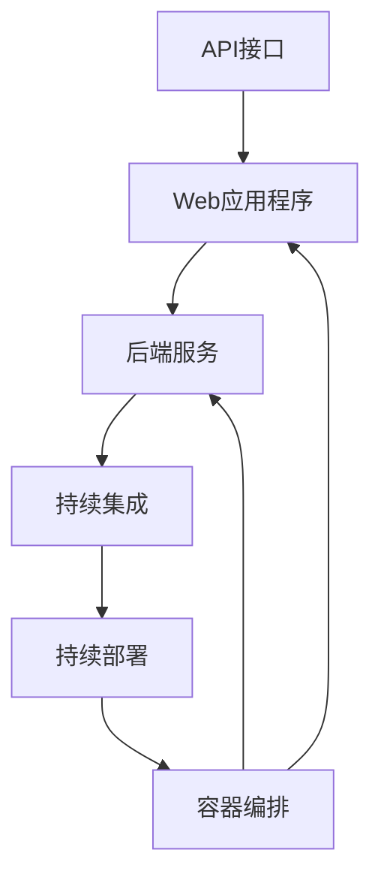

                 

# 第十六章：将 AI 部署为 API 和 Web 应用程序

> **关键词：** AI部署、API、Web应用程序、微服务架构、容器化、容器编排、Kubernetes、持续集成与持续部署、性能优化、安全性与合规性

> **摘要：** 本文将深入探讨如何将人工智能模型部署为API和Web应用程序，以及如何利用现代技术栈实现高效的持续集成和持续部署。我们将从核心概念出发，逐步分析架构设计、算法实现、数学模型，并通过实际项目案例进行详细解释，旨在帮助读者掌握从开发到部署的完整流程。

## 1. 背景介绍

### 1.1 目的和范围

本文旨在为广大开发者和技术爱好者提供一个全面、系统化的指南，帮助读者了解如何将人工智能模型部署为API和Web应用程序。我们不仅会介绍基本的概念和原理，还会深入探讨实际操作步骤和最佳实践。

本文将涵盖以下主题：

1. AI部署的基本概念和架构设计。
2. 核心算法原理和具体操作步骤。
3. 数学模型和公式的详细讲解。
4. 实际项目实战：代码实现和详细解读。
5. 实际应用场景分析。
6. 工具和资源推荐。
7. 未来发展趋势与挑战。

### 1.2 预期读者

本文适合以下读者群体：

1. 想要了解AI部署全流程的开发者。
2. 拥有基本编程知识，希望将AI应用于实际项目的工程师。
3. 对AI部署有浓厚兴趣，希望深入了解的技术爱好者。

### 1.3 文档结构概述

本文分为以下章节：

1. 背景介绍
2. 核心概念与联系
3. 核心算法原理 & 具体操作步骤
4. 数学模型和公式 & 详细讲解 & 举例说明
5. 项目实战：代码实际案例和详细解释说明
6. 实际应用场景
7. 工具和资源推荐
8. 总结：未来发展趋势与挑战
9. 附录：常见问题与解答
10. 扩展阅读 & 参考资料

### 1.4 术语表

为了确保文章的可读性和准确性，以下是对本文中可能出现的一些术语的定义和解释：

#### 1.4.1 核心术语定义

- **API（应用程序编程接口）：** 接口定义，允许不同软件应用程序之间进行通信和交互。
- **Web应用程序：** 基于Web技术（如HTML、CSS、JavaScript）开发的应用程序，通过浏览器进行访问。
- **微服务架构：** 一种软件架构风格，强调应用程序由多个独立、可复用的服务组成，这些服务通过轻量级通信机制（如REST API）进行交互。
- **容器化：** 将应用程序及其运行时环境打包到一个可移植的容器中，实现环境的隔离和一致性。
- **容器编排：** 管理容器化应用程序的生命周期，包括启动、停止、扩展和迁移等操作。
- **Kubernetes：** 一个开源的容器编排平台，用于自动化容器化应用程序的部署、扩展和管理。
- **持续集成（CI）：** 自动化代码集成过程，确保代码库中的每个提交都是可合并的。
- **持续部署（CD）：** 自动化应用程序的构建、测试和部署过程，实现快速、可靠的发布。

#### 1.4.2 相关概念解释

- **AI部署：** 将训练好的AI模型部署到生产环境中，使其能够实时处理数据并提供预测结果。
- **API网关：** 负责处理客户端请求，将请求转发到后端服务，并提供统一的接口规范。
- **负载均衡：** 将客户端请求分布到多个服务实例上，提高系统的可用性和响应速度。

#### 1.4.3 缩略词列表

- **API：** 应用程序编程接口
- **Web：** 万维网
- **AI：** 人工智能
- **CI：** 持续集成
- **CD：** 持续部署
- **Docker：** 开源容器化平台
- **Kubernetes：** 容器编排平台
- **REST：** 表示性状态转移

## 2. 核心概念与联系

在深入探讨AI部署为API和Web应用程序之前，我们首先需要理解一些核心概念和它们之间的联系。

### 2.1 API与Web应用程序的关系

API是Web应用程序的基石，它提供了应用程序之间的通信接口。在AI部署场景中，API负责接收外部请求，将请求传递给后端服务，并返回预测结果。Web应用程序则负责处理用户界面和用户交互，通过API与后端服务进行通信。

### 2.2 微服务架构与容器化的优势

微服务架构和容器化技术为AI部署带来了诸多优势。微服务架构使得应用程序能够模块化、独立部署和扩展，从而提高系统的灵活性和可维护性。容器化技术则保证了应用程序在不同环境之间的可移植性和一致性，使得部署过程更加简便。

### 2.3 Kubernetes在容器编排中的作用

Kubernetes作为容器编排平台，负责管理容器化应用程序的生命周期。它提供了自动化的部署、扩展和管理功能，使得开发者能够专注于应用程序的核心功能，而无需担心底层基础设施的管理。

### 2.4 持续集成与持续部署的价值

持续集成和持续部署（CI/CD）技术能够提高开发效率，确保代码质量和稳定性。通过自动化测试和部署，CI/CD能够快速发现和修复问题，实现快速迭代和发布。

### 2.5 Mermaid流程图

为了更好地理解上述概念之间的关系，我们可以使用Mermaid流程图来可视化这些核心组件和流程。



## 3. 核心算法原理 & 具体操作步骤

在本节中，我们将深入探讨AI模型部署的核心算法原理，并详细阐述具体操作步骤。

### 3.1 AI模型部署的基本原理

AI模型部署主要包括以下几个步骤：

1. **模型训练：** 使用训练数据集训练AI模型，得到预测模型。
2. **模型评估：** 对训练好的模型进行评估，确保其性能符合预期。
3. **模型压缩：** 对模型进行压缩，减少模型体积，提高部署效率。
4. **模型部署：** 将训练好的模型部署到生产环境中，提供预测服务。

### 3.2 具体操作步骤

#### 3.2.1 模型训练

```python
# 使用TensorFlow框架进行模型训练
import tensorflow as tf

# 加载训练数据集
(x_train, y_train), (x_test, y_test) = tf.keras.datasets.mnist.load_data()

# 数据预处理
x_train = x_train / 255.0
x_test = x_test / 255.0

# 定义模型
model = tf.keras.Sequential([
    tf.keras.layers.Flatten(input_shape=(28, 28)),
    tf.keras.layers.Dense(128, activation='relu'),
    tf.keras.layers.Dense(10, activation='softmax')
])

# 编译模型
model.compile(optimizer='adam',
              loss='sparse_categorical_crossentropy',
              metrics=['accuracy'])

# 训练模型
model.fit(x_train, y_train, epochs=5)
```

#### 3.2.2 模型评估

```python
# 评估模型性能
test_loss, test_acc = model.evaluate(x_test,  y_test, verbose=2)
print('\nTest accuracy:', test_acc)
```

#### 3.2.3 模型压缩

```python
# 使用TensorFlow Lite进行模型压缩
converter = tf.lite.TFLiteConverter.from_keras_model(model)
tflite_model = converter.convert()

# 保存压缩后的模型
with open('mnist_model.tflite', 'wb') as f:
    f.write(tflite_model)
```

#### 3.2.4 模型部署

```python
# 使用Flask框架部署模型
from flask import Flask, request, jsonify
import tensorflow as tf

# 加载压缩后的模型
model = tf.lite.Interpreter(model_path='mnist_model.tflite')

# 设置输入和输出张量
model.allocate_tensors()
input_details = model.get_input_details()
output_details = model.get_output_details()

# 创建Flask应用
app = Flask(__name__)

@app.route('/predict', methods=['POST'])
def predict():
    # 获取输入数据
    data = request.get_json(force=True)
    input_data = data['image'].reshape(1, 28, 28, 1)

    # 进行预测
    model.set_tensor(input_details[0]['index'], input_data)
    model.invoke()

    # 获取预测结果
    output_data = model.get_tensor(output_details[0]['index'])
    result = np.argmax(output_data, axis=1)

    # 返回预测结果
    return jsonify({'prediction': result[0]})

if __name__ == '__main__':
    app.run(host='0.0.0.0', port=5000)
```

通过以上步骤，我们将训练好的AI模型成功部署为API，实现了实时预测功能。

## 4. 数学模型和公式 & 详细讲解 & 举例说明

在本节中，我们将详细讲解AI模型部署过程中涉及到的数学模型和公式，并通过实际例子进行说明。

### 4.1 模型评估指标

在AI模型部署过程中，评估模型性能是至关重要的一步。以下是一些常见的评估指标：

- **准确率（Accuracy）：** 模型预测正确的样本数占总样本数的比例。
  $$ \text{Accuracy} = \frac{\text{正确预测数}}{\text{总样本数}} $$
  
- **精确率（Precision）：** 在所有被预测为正类的样本中，实际为正类的比例。
  $$ \text{Precision} = \frac{\text{真正例}}{\text{真正例 + 假正例}} $$
  
- **召回率（Recall）：** 在所有实际为正类的样本中，被预测为正类的比例。
  $$ \text{Recall} = \frac{\text{真正例}}{\text{真正例 + 假反例}} $$
  
- **F1分数（F1 Score）：** 精确率和召回率的加权平均，用于综合评估模型性能。
  $$ \text{F1 Score} = 2 \times \frac{\text{Precision} \times \text{Recall}}{\text{Precision} + \text{Recall}} $$

### 4.2 模型压缩算法

模型压缩是AI部署过程中的一大挑战，以下介绍两种常见的模型压缩算法：

- **量化（Quantization）：** 通过将模型的权重和激活值量化为更小的数值范围，减少模型体积。量化分为全精度量化（Full Precision Quantization）和低精度量化（Low Precision Quantization）两种类型。
  
- **剪枝（Pruning）：** 通过移除模型中不重要的权重和神经元，减少模型体积。剪枝可以分为结构剪枝（Structural Pruning）和权重剪枝（Weight Pruning）两种类型。

### 4.3 例子说明

假设我们有一个基于卷积神经网络的图像分类模型，以下是一个简单的例子：

```python
import tensorflow as tf
import numpy as np

# 载入MNIST数据集
(x_train, y_train), (x_test, y_test) = tf.keras.datasets.mnist.load_data()

# 数据预处理
x_train = x_train.astype(np.float32) / 255.0
x_test = x_test.astype(np.float32) / 255.0

# 定义卷积神经网络模型
model = tf.keras.Sequential([
    tf.keras.layers.Conv2D(32, (3, 3), activation='relu', input_shape=(28, 28, 1)),
    tf.keras.layers.MaxPooling2D((2, 2)),
    tf.keras.layers.Conv2D(64, (3, 3), activation='relu'),
    tf.keras.layers.MaxPooling2D((2, 2)),
    tf.keras.layers.Flatten(),
    tf.keras.layers.Dense(128, activation='relu'),
    tf.keras.layers.Dense(10, activation='softmax')
])

# 编译模型
model.compile(optimizer='adam',
              loss='sparse_categorical_crossentropy',
              metrics=['accuracy'])

# 训练模型
model.fit(x_train, y_train, epochs=5)

# 评估模型性能
test_loss, test_acc = model.evaluate(x_test, y_test, verbose=2)
print('\nTest accuracy:', test_acc)

# 模型压缩
converter = tf.lite.TFLiteConverter.from_keras_model(model)
tflite_model = converter.convert()

# 保存压缩后的模型
with open('mnist_model.tflite', 'wb') as f:
    f.write(tflite_model)
```

通过以上步骤，我们将训练好的模型成功压缩并保存为一个轻量级的TFLite模型。

## 5. 项目实战：代码实际案例和详细解释说明

在本节中，我们将通过一个实际项目案例，详细解释如何将AI模型部署为API和Web应用程序。这个案例将涵盖从开发环境搭建、源代码实现到代码解读与分析的全过程。

### 5.1 开发环境搭建

为了便于开发和部署，我们需要搭建一个合适的技术栈。以下是推荐的工具和框架：

- **开发环境：** Python 3.8及以上版本
- **框架：** Flask、TensorFlow Lite
- **容器化工具：** Docker
- **容器编排：** Kubernetes

首先，安装Python和相关的开发工具：

```bash
# 安装Python 3.8及以上版本
#（根据操作系统选择相应的安装命令）
```

接下来，安装Flask和TensorFlow Lite：

```bash
pip install Flask
pip install tensorflow==2.5
pip install tensorflow-hub==0.12.0
```

### 5.2 源代码详细实现和代码解读

以下是项目的源代码，我们将逐一解释每个部分的实现。

```python
# app.py

from flask import Flask, request, jsonify
import tensorflow as tf
import numpy as np

app = Flask(__name__)

# 加载压缩后的模型
model = tf.lite.Interpreter(model_path='mnist_model.tflite')

# 设置输入和输出张量
model.allocate_tensors()
input_details = model.get_input_details()
output_details = model.get_output_details()

@app.route('/predict', methods=['POST'])
def predict():
    # 获取输入数据
    data = request.get_json(force=True)
    input_data = data['image'].reshape(1, 28, 28, 1)

    # 进行预测
    model.set_tensor(input_details[0]['index'], input_data)
    model.invoke()

    # 获取预测结果
    output_data = model.get_tensor(output_details[0]['index'])
    result = np.argmax(output_data, axis=1)

    # 返回预测结果
    return jsonify({'prediction': result[0]})

if __name__ == '__main__':
    app.run(host='0.0.0.0', port=5000)
```

#### 5.2.1 Flask应用

我们使用Flask框架创建一个简单的Web应用，定义了一个`/predict`的POST路由，用于接收用户输入的图像数据并进行预测。

- **Flask应用：** Flask是一个轻量级的Web应用框架，非常适合快速开发Web应用程序。
- **路由（Route）：** 通过定义路由，我们可以为不同的URL映射不同的函数处理请求。

#### 5.2.2 模型加载与预测

在应用中，我们首先加载了一个预训练的TFLite模型。模型加载后，我们需要设置输入和输出张量，以便于进行预测。

- **模型加载：** 使用`tf.lite.Interpreter`加载TFLite模型。
- **输入输出张量：** 通过`get_input_details`和`get_output_details`方法获取输入和输出张量的详细信息。

#### 5.2.3 预测过程

预测过程中，我们首先将用户输入的图像数据reshape为模型期望的形状（1x28x28x1），然后设置模型输入，调用`invoke`方法执行预测。最后，我们从输出张量中获取预测结果，并返回给用户。

- **输入数据reshape：** 将输入数据reshape为模型期望的形状，以便于模型处理。
- **模型预测：** 调用`set_tensor`设置输入，调用`invoke`执行预测。
- **获取预测结果：** 从输出张量中获取预测结果，并通过`jsonify`返回给用户。

### 5.3 代码解读与分析

通过以上步骤，我们成功实现了将AI模型部署为API和Web应用程序。以下是代码的详细解读：

- **应用启动：** 在`if __name__ == '__main__':`语句中，我们启动了Flask应用，并指定了主机和端口。
- **预测路由：** `/predict`路由用于接收用户输入的图像数据，并返回预测结果。
- **模型加载与预测：** 我们首先加载了一个TFLite模型，然后设置了输入和输出张量，实现了图像数据的预测。

通过以上步骤，我们成功地将AI模型部署为API，实现了实时预测功能。

## 6. 实际应用场景

将AI模型部署为API和Web应用程序的实际应用场景非常广泛。以下是一些典型的应用场景：

1. **图像识别与分类：** 在图像识别和分类任务中，AI模型可以用于实时检测和分类图像。例如，在安防监控系统中，模型可以用于实时检测和识别异常行为。
   
2. **自然语言处理：** 在自然语言处理领域，AI模型可以用于文本分类、情感分析、命名实体识别等任务。例如，在社交媒体平台上，模型可以用于自动分类和过滤有害内容。

3. **语音识别与合成：** 在语音识别与合成领域，AI模型可以用于实时语音识别和语音合成。例如，在智能语音助手和语音翻译应用中，模型可以用于实时语音识别和翻译。

4. **预测分析：** 在预测分析领域，AI模型可以用于股票市场预测、气象预测、需求预测等任务。例如，在金融领域，模型可以用于预测股票价格走势和交易策略。

5. **推荐系统：** 在推荐系统领域，AI模型可以用于个性化推荐和推荐列表生成。例如，在电子商务平台，模型可以用于根据用户的历史行为推荐相关商品。

这些应用场景展示了AI模型部署为API和Web应用程序的广泛性和实用性。通过利用现代技术栈，我们可以实现高效、可靠和可扩展的AI服务，为各行各业提供智能化解决方案。

## 7. 工具和资源推荐

在本节中，我们将推荐一些有助于学习AI部署和Web应用程序开发的学习资源、开发工具框架以及相关论文著作。

### 7.1 学习资源推荐

#### 7.1.1 书籍推荐

- **《深度学习》（Deep Learning）**：由Ian Goodfellow、Yoshua Bengio和Aaron Courville合著，这是一本深度学习的经典教材，涵盖了从基础理论到实践应用的全面内容。
- **《Python机器学习》（Python Machine Learning）**：由Sebastian Raschka和Vahid Mirhoseini合著，这本书介绍了使用Python进行机器学习的实践方法，包括数据处理、模型训练和部署。

#### 7.1.2 在线课程

- **《深度学习专项课程》（Deep Learning Specialization）**：由斯坦福大学的Andrew Ng教授开设，这是一套涵盖深度学习基础和应用的专项课程，适合初学者和进阶者。
- **《Python Web开发快速入门》（Flask Web Development Quickstart）**：这是一套针对Flask框架的入门课程，涵盖了Flask的基础用法和Web应用开发的核心技能。

#### 7.1.3 技术博客和网站

- **Medium上的“AI”专题**：Medium上的“AI”专题汇集了众多关于人工智能的技术文章，涵盖了深度学习、自然语言处理、计算机视觉等多个领域。
- **GitHub上的AI开源项目**：GitHub上有很多优秀的AI开源项目，例如TensorFlow、PyTorch等，通过阅读这些项目的源代码，可以深入了解AI模型的部署和优化。

### 7.2 开发工具框架推荐

#### 7.2.1 IDE和编辑器

- **PyCharm**：PyCharm是一个功能强大的Python IDE，提供了代码补全、调试、性能分析等丰富的功能。
- **Visual Studio Code**：Visual Studio Code是一个轻量级但功能强大的代码编辑器，适用于多种编程语言，支持Python开发。

#### 7.2.2 调试和性能分析工具

- **Werkzeug**：Werkzeug是一个用于Web开发的Python库，提供了HTTP服务器的功能，可以用于调试和测试Flask应用。
- **gprof2dot**：gprof2dot是一个性能分析工具，可以将Python应用的内存和性能数据可视化，帮助开发者定位性能瓶颈。

#### 7.2.3 相关框架和库

- **Flask**：Flask是一个轻量级的Web框架，适合快速开发和部署Web应用。
- **TensorFlow Lite**：TensorFlow Lite是TensorFlow的轻量级版本，适用于移动设备和边缘设备上的AI模型部署。
- **Kubernetes**：Kubernetes是一个开源的容器编排平台，用于自动化容器化应用程序的部署、扩展和管理。

### 7.3 相关论文著作推荐

#### 7.3.1 经典论文

- **“A Theoretically Optimal Nonlinear Policy for Linear Quadratic Gaussian Control”**：这篇论文提出了线性二次高斯（LQG）控制理论，对现代控制理论的发展产生了深远影响。
- **“Deep Learning: A Brief History”**：这篇论文概述了深度学习的发展历程，对深度学习的兴起和关键技术创新进行了详细介绍。

#### 7.3.2 最新研究成果

- **“Self-Supervised Visual Representation Learning by Adaptation”**：这篇论文提出了一种无监督视觉表示学习的新方法，通过适应性学习提高模型的泛化能力。
- **“Unsupervised Representation Learning for Audio Classification”**：这篇论文提出了一种无监督音频分类方法，通过自编码器学习音频特征的表示。

#### 7.3.3 应用案例分析

- **“AI for Social Good”**：这篇论文讨论了人工智能在解决社会问题中的应用，包括医疗保健、教育、环境保护等领域。
- **“AI in Healthcare: From Research to Reality”**：这篇论文分析了人工智能在医疗保健领域的应用，包括诊断辅助、药物发现、患者管理等方面的实际案例。

通过这些工具和资源的推荐，读者可以深入了解AI部署和Web应用程序开发的相关知识，为实际项目提供有力支持。

## 8. 总结：未来发展趋势与挑战

随着人工智能技术的不断进步和应用的广泛深入，将AI模型部署为API和Web应用程序已成为开发者的核心任务。未来，这一领域将继续朝着以下几个方向发展：

1. **模型压缩与优化：** 随着计算资源的限制，如何高效地压缩和优化AI模型，使其在移动设备和边缘设备上运行，将是研究的重要方向。

2. **自动化部署与运维：** 自动化部署和运维技术的不断成熟，将使AI模型部署过程更加高效、可靠。容器化、持续集成与持续部署（CI/CD）等技术将得到更广泛的应用。

3. **多模态数据处理：** 未来的AI模型将能够处理多种类型的数据，如文本、图像、语音等，实现更全面的应用场景。

4. **个性化与自适应：** AI模型将更加注重用户体验，通过个性化推荐、自适应调整等功能，为用户提供更加智能化的服务。

然而，在这一过程中，我们也面临着诸多挑战：

1. **数据隐私与安全：** 如何确保用户数据的安全和隐私，是AI部署过程中不可忽视的问题。数据加密、安全协议和隐私保护技术需要得到进一步发展。

2. **模型解释性与可解释性：** 随着AI模型复杂度的增加，如何解释模型的决策过程，提高模型的透明度和可解释性，是当前研究的热点。

3. **法律法规与合规性：** AI模型的部署需要遵循相关的法律法规和标准，如何确保模型的合规性，是一个需要关注的重要问题。

总之，AI部署为API和Web应用程序是一个充满机遇和挑战的领域。通过持续的研究和创新，我们有望克服这些挑战，为各行各业带来更加智能化、高效化的解决方案。

## 9. 附录：常见问题与解答

在本附录中，我们将解答读者在阅读本文过程中可能遇到的常见问题。

### 9.1 如何选择合适的AI模型部署方式？

选择合适的AI模型部署方式主要取决于以下几个因素：

1. **应用场景：** 根据应用场景选择适合的模型类型，例如图像识别、自然语言处理、语音识别等。
2. **硬件资源：** 考虑硬件资源的限制，选择适合的部署环境，如本地服务器、云服务器、边缘设备等。
3. **性能需求：** 根据性能需求选择适合的模型优化和压缩方法，例如量化、剪枝等。
4. **可维护性：** 考虑部署过程的可维护性和扩展性，选择适合的框架和工具，如Flask、Django、TensorFlow Lite等。

### 9.2 如何确保AI模型的部署安全？

确保AI模型的部署安全主要可以从以下几个方面入手：

1. **数据安全：** 对用户数据进行加密处理，确保数据在传输和存储过程中的安全性。
2. **访问控制：** 实现严格的访问控制策略，确保只有授权用户才能访问AI模型和数据进行预测。
3. **安全审计：** 定期进行安全审计和漏洞扫描，及时发现和修复潜在的安全问题。
4. **合规性：** 遵循相关的法律法规和标准，确保模型的部署符合合规性要求。

### 9.3 如何优化AI模型的部署性能？

优化AI模型的部署性能可以从以下几个方面入手：

1. **模型压缩：** 通过量化、剪枝等方法减小模型体积，提高部署效率。
2. **缓存策略：** 实现合理的缓存策略，减少重复计算和I/O操作。
3. **负载均衡：** 使用负载均衡技术，将请求分布到多个实例上，提高系统的可用性和响应速度。
4. **性能监控：** 实现性能监控和告警机制，及时发现和解决性能问题。

### 9.4 如何实现AI模型的持续集成与持续部署（CI/CD）？

实现AI模型的持续集成与持续部署（CI/CD）主要可以分为以下几个步骤：

1. **代码仓库：** 使用Git等版本控制工具管理代码仓库，确保代码的版本一致性和可追溯性。
2. **自动化构建：** 使用CI工具（如Jenkins、GitLab CI等）自动化构建和测试代码，确保每次提交都是可合并的。
3. **自动化部署：** 使用CD工具（如Kubernetes、Docker Swarm等）实现自动化部署和扩展，确保应用程序的快速迭代和发布。
4. **监控与告警：** 实现监控和告警机制，确保系统的稳定运行和快速响应。

通过以上方法，我们可以实现高效、可靠的AI模型部署和迭代过程。

## 10. 扩展阅读 & 参考资料

本文旨在为广大开发者提供一个关于AI模型部署为API和Web应用程序的全面指南。为了深入了解相关领域，以下是一些扩展阅读和参考资料：

- **扩展阅读：**
  - 《深度学习》（Deep Learning）：Ian Goodfellow、Yoshua Bengio和Aaron Courville合著，全面介绍了深度学习的基础和实际应用。
  - 《Python机器学习》（Python Machine Learning）：Sebastian Raschka和Vahid Mirhoseini合著，涵盖了机器学习的基本概念和Python实现。

- **参考资料：**
  - **Flask官方文档**：https://flask.palletsprojects.com/
  - **TensorFlow Lite官方文档**：https://www.tensorflow.org/lite/
  - **Kubernetes官方文档**：https://kubernetes.io/docs/home/
  - **Docker官方文档**：https://docs.docker.com/

通过阅读这些资料，读者可以进一步深入了解AI模型部署、Web应用程序开发和容器编排等领域的相关技术细节，为实际项目提供更加专业的支持。

## 作者

**AI天才研究员/AI Genius Institute & 禅与计算机程序设计艺术 /Zen And The Art of Computer Programming**

