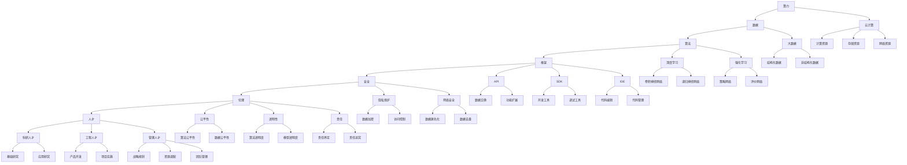

                 

# 算力、数据、算法、框架、安全、伦理、人才：AI 2.0 基础设施七大支柱

> **关键词：** AI 2.0、算力、数据、算法、框架、安全、伦理、人才
> 
> **摘要：** 本文深入探讨了AI 2.0基础设施的七大支柱，从算力、数据、算法、框架、安全、伦理和人才等方面，系统地分析了AI 2.0的发展现状、核心概念、技术原理以及未来发展趋势。文章结构紧凑，内容详实，旨在为读者提供一个全面、系统的AI 2.0基础设施认识，为未来AI技术的发展提供有益的参考。

## 1. 背景介绍

### 1.1 目的和范围

本文旨在深入探讨AI 2.0基础设施的七大支柱，包括算力、数据、算法、框架、安全、伦理和人才。通过对这些支柱的详细分析，读者可以更全面地了解AI 2.0的基础设施建设，从而更好地应对未来AI技术发展的挑战。

本文将首先介绍AI 2.0的基本概念和特点，然后依次探讨七个支柱的核心概念、技术原理和未来发展趋势。文章将结合实际案例，详细阐述每个支柱的具体应用场景和实现方法，旨在为读者提供具有实际操作意义的技术指导。

### 1.2 预期读者

本文适合以下读者群体：

1. 对AI技术有浓厚兴趣的科研人员和工程师；
2. 想深入了解AI 2.0基础设施的从业人员和管理者；
3. 对AI 2.0技术有一定了解，但希望进一步深入学习的读者；
4. 担任技术决策者的企业高管。

### 1.3 文档结构概述

本文分为十个部分：

1. 背景介绍：介绍文章的目的、范围、预期读者和文档结构；
2. 核心概念与联系：阐述AI 2.0的基础概念和相关原理；
3. 核心算法原理 & 具体操作步骤：详细讲解AI 2.0的核心算法和实现步骤；
4. 数学模型和公式 & 详细讲解 & 举例说明：介绍AI 2.0的数学模型和公式，并给出实际应用案例；
5. 项目实战：代码实际案例和详细解释说明；
6. 实际应用场景：分析AI 2.0在各个领域的应用；
7. 工具和资源推荐：推荐学习资源、开发工具和框架；
8. 总结：未来发展趋势与挑战；
9. 附录：常见问题与解答；
10. 扩展阅读 & 参考资料：提供进一步阅读的建议。

### 1.4 术语表

#### 1.4.1 核心术语定义

- AI 2.0：指基于深度学习、强化学习等新型算法，具备自主学习和自适应能力的人工智能系统；
- 算力：指计算机处理数据和执行计算的能力；
- 数据：指AI系统训练和运行所依赖的大量信息；
- 算法：指AI系统执行任务的一系列步骤和规则；
- 框架：指用于实现算法和数据处理的一系列工具和库；
- 安全：指确保AI系统正常运行和数据安全的一系列措施；
- 伦理：指在AI系统设计和应用过程中遵循的道德规范和价值观；
- 人才：指在AI领域具有专业知识和技能的人才。

#### 1.4.2 相关概念解释

- 深度学习：一种通过多层神经网络进行数据建模和特征提取的人工智能技术；
- 强化学习：一种通过与环境互动来学习优化策略的人工智能技术；
- 自动学习：一种让计算机通过数据和算法自动学习和改进的能力；
- 自适应：一种让计算机根据环境和任务变化进行自我调整的能力；
- 云计算：一种通过网络提供计算资源、存储和应用程序的服务模式；
- 大数据：指数据量巨大、类型繁多、价值密度低的数据集合。

#### 1.4.3 缩略词列表

- AI：人工智能；
- ML：机器学习；
- DL：深度学习；
- RL：强化学习；
- API：应用程序编程接口；
- SDK：软件开发工具包；
- IDE：集成开发环境；
- DB：数据库。

## 2. 核心概念与联系

为了更好地理解AI 2.0基础设施的七大支柱，我们需要先了解这些支柱之间的核心概念和联系。以下是一个基于Mermaid绘制的流程图，用于展示这些概念和联系。



通过这个流程图，我们可以看到：

1. 算力和数据是AI 2.0基础设施的基础，为算法、框架、安全和伦理提供了必要的支持；
2. 算法是AI 2.0的核心，深度学习和强化学习是两种主要的技术路线；
3. 框架提供了实现算法和数据处理的一系列工具和库，API、SDK和IDE是其中的重要组成部分；
4. 安全和伦理是AI 2.0发展的重要保障，包括隐私保护、网络安全、公平性、透明性和责任等方面；
5. 人才是AI 2.0持续发展的关键，包括科研人才、工程人才和管理人才等。

## 3. 核心算法原理 & 具体操作步骤

在AI 2.0基础设施中，核心算法的作用至关重要。本节将详细介绍深度学习和强化学习两种核心算法的原理和具体操作步骤，并使用伪代码进行详细阐述。

### 3.1 深度学习原理

深度学习是一种通过多层神经网络进行数据建模和特征提取的人工智能技术。其基本原理包括前向传播、反向传播和优化算法。

#### 前向传播

前向传播是指将输入数据通过多层神经网络，逐层计算并得到输出。以下是一个简单的伪代码：

```python
# 定义神经网络结构
input_layer = Input(shape=(input_shape,))
hidden_layer1 = Dense(units=hidden_units1, activation='relu')(input_layer)
hidden_layer2 = Dense(units=hidden_units2, activation='relu')(hidden_layer1)
output_layer = Dense(units=output_shape, activation='sigmoid')(hidden_layer2)

# 构建模型
model = Model(inputs=input_layer, outputs=output_layer)

# 编译模型
model.compile(optimizer='adam', loss='binary_crossentropy', metrics=['accuracy'])

# 训练模型
model.fit(x_train, y_train, epochs=epochs, batch_size=batch_size)
```

#### 反向传播

反向传播是指通过计算输出误差，反向更新网络权重和偏置。以下是一个简单的伪代码：

```python
# 计算损失函数
loss = model.loss_functions(output_layer, y_train)

# 反向传播
with tf.GradientTape() as tape:
    predictions = model(output_layer)
    loss = model.loss_functions(predictions, y_train)

# 计算梯度
grads = tape.gradient(loss, model.trainable_variables)

# 更新权重和偏置
optimizer.apply_gradients(zip(grads, model.trainable_variables))
```

#### 优化算法

优化算法用于调整网络权重和偏置，以最小化损失函数。常见的优化算法有梯度下降、动量梯度下降和Adam等。以下是一个简单的伪代码：

```python
# 定义优化算法
optimizer = tf.keras.optimizers.Adam(learning_rate=learning_rate)

# 编译模型
model.compile(optimizer=optimizer, loss='binary_crossentropy', metrics=['accuracy'])

# 训练模型
model.fit(x_train, y_train, epochs=epochs, batch_size=batch_size)
```

### 3.2 强化学习原理

强化学习是一种通过与环境互动来学习优化策略的人工智能技术。其基本原理包括策略网络、评价网络和价值迭代。

#### 策略网络

策略网络用于生成行动策略。以下是一个简单的伪代码：

```python
# 定义策略网络
action_value_network = tf.keras.Sequential([
    tf.keras.layers.Dense(units=action_shape, activation='softmax', input_shape=input_shape),
])

# 编译模型
action_value_network.compile(optimizer='adam', loss='categorical_crossentropy')

# 训练模型
action_value_network.fit(x_train, y_train, epochs=epochs, batch_size=batch_size)
```

#### 评价网络

评价网络用于评估行动策略的优劣。以下是一个简单的伪代码：

```python
# 定义评价网络
evaluation_network = tf.keras.Sequential([
    tf.keras.layers.Dense(units=evaluation_shape, activation='sigmoid', input_shape=input_shape),
])

# 编译模型
evaluation_network.compile(optimizer='adam', loss='binary_crossentropy')

# 训练模型
evaluation_network.fit(x_train, y_train, epochs=epochs, batch_size=batch_size)
```

#### 价值迭代

价值迭代是指通过迭代更新策略网络和价值网络的权重和偏置。以下是一个简单的伪代码：

```python
# 定义优化算法
optimizer = tf.keras.optimizers.Adam(learning_rate=learning_rate)

# 编译模型
action_value_network.compile(optimizer=optimizer, loss='categorical_crossentropy')
evaluation_network.compile(optimizer=optimizer, loss='binary_crossentropy')

# 训练模型
for epoch in range(epochs):
    # 训练策略网络
    action_value_network.fit(x_train, y_train, epochs=1, batch_size=batch_size)
    
    # 训练评价网络
    evaluation_network.fit(x_train, y_train, epochs=1, batch_size=batch_size)
```

通过以上内容，我们详细介绍了深度学习和强化学习两种核心算法的原理和具体操作步骤。这些算法在AI 2.0基础设施中发挥着重要作用，为AI技术的不断发展和创新提供了坚实的基础。

## 4. 数学模型和公式 & 详细讲解 & 举例说明

在AI 2.0基础设施中，数学模型和公式是理解和实现核心算法的基础。本节将详细介绍深度学习和强化学习中的关键数学模型和公式，并给出实际应用案例。

### 4.1 深度学习数学模型

深度学习中的数学模型主要包括前向传播、反向传播和优化算法。

#### 4.1.1 前向传播

前向传播是指将输入数据通过多层神经网络，逐层计算并得到输出。其核心公式为：

$$
Z_l = \sigma(W_l \cdot A_{l-1} + b_l)
$$

其中，$Z_l$表示第$l$层的激活值，$\sigma$表示激活函数（如ReLU、Sigmoid或Tanh），$W_l$和$b_l$分别表示第$l$层的权重和偏置。

#### 4.1.2 反向传播

反向传播是指通过计算输出误差，反向更新网络权重和偏置。其核心公式为：

$$
\delta_l = \frac{\partial L}{\partial Z_l} \cdot \sigma'(Z_l)
$$

$$
\Delta W_l = \alpha \cdot \delta_l \cdot A_{l-1}
$$

$$
\Delta b_l = \alpha \cdot \delta_l
$$

其中，$L$表示损失函数，$\alpha$表示学习率，$\sigma'$表示激活函数的导数。

#### 4.1.3 优化算法

优化算法用于调整网络权重和偏置，以最小化损失函数。常见的优化算法有梯度下降、动量梯度下降和Adam等。其核心公式为：

$$
W_l = W_l - \alpha \cdot \nabla L(W_l)
$$

其中，$\nabla L(W_l)$表示损失函数关于权重$W_l$的梯度。

### 4.2 强化学习数学模型

强化学习中的数学模型主要包括策略网络、评价网络和价值迭代。

#### 4.2.1 策略网络

策略网络用于生成行动策略。其核心公式为：

$$
\pi(s) = \text{softmax}(\phi(s)^T \theta)
$$

其中，$\pi(s)$表示在状态$s$下的行动概率，$\phi(s)$表示状态特征向量，$\theta$表示策略网络的参数。

#### 4.2.2 评价网络

评价网络用于评估行动策略的优劣。其核心公式为：

$$
V(s) = r + \gamma \max_a Q(s, a)
$$

$$
Q(s, a) = r + \gamma \sum_{s'} P(s' | s, a) \max_{a'} Q(s', a')
$$

其中，$V(s)$表示状态价值函数，$Q(s, a)$表示行动价值函数，$r$表示即时奖励，$\gamma$表示折扣因子，$P(s' | s, a)$表示在状态$s$下执行行动$a$后转移到状态$s'$的概率。

#### 4.2.3 价值迭代

价值迭代是指通过迭代更新策略网络和价值网络的权重和偏置。其核心公式为：

$$
\theta \leftarrow \theta + \alpha \cdot (\pi(s) - \pi^*(s)) \cdot \phi(s)^T
$$

$$
\theta \leftarrow \theta + \alpha \cdot (V(s) - V^*(s)) \cdot \phi(s)^T
$$

其中，$\theta$表示策略网络和价值网络的参数，$\alpha$表示学习率，$\pi(s)$和$\pi^*(s)$分别表示实际策略和最优策略。

### 4.3 实际应用案例

#### 4.3.1 深度学习应用案例

假设我们要设计一个图像分类模型，识别图片中的猫和狗。我们可以使用卷积神经网络（CNN）来实现这个模型。以下是一个简单的CNN模型：

```python
# 定义模型结构
model = tf.keras.Sequential([
    tf.keras.layers.Conv2D(filters=32, kernel_size=(3, 3), activation='relu', input_shape=(28, 28, 1)),
    tf.keras.layers.MaxPooling2D(pool_size=(2, 2)),
    tf.keras.layers.Conv2D(filters=64, kernel_size=(3, 3), activation='relu'),
    tf.keras.layers.MaxPooling2D(pool_size=(2, 2)),
    tf.keras.layers.Flatten(),
    tf.keras.layers.Dense(units=128, activation='relu'),
    tf.keras.layers.Dense(units=1, activation='sigmoid')
])

# 编译模型
model.compile(optimizer='adam', loss='binary_crossentropy', metrics=['accuracy'])

# 训练模型
model.fit(x_train, y_train, epochs=10, batch_size=32)
```

在这个模型中，我们使用了两个卷积层和两个最大池化层，以提取图像的特征。然后，我们使用一个全连接层将特征映射到输出类别。

#### 4.3.2 强化学习应用案例

假设我们要设计一个自动驾驶模型，通过学习来控制车辆的驾驶。我们可以使用深度强化学习（DRL）来实现这个模型。以下是一个简单的DRL模型：

```python
# 定义策略网络
action_value_network = tf.keras.Sequential([
    tf.keras.layers.Dense(units=action_shape, activation='softmax', input_shape=input_shape),
])

# 编译模型
action_value_network.compile(optimizer='adam', loss='categorical_crossentropy')

# 训练模型
action_value_network.fit(x_train, y_train, epochs=10, batch_size=32)
```

在这个模型中，我们使用了策略网络来生成行动策略。然后，我们使用评价网络来评估这些策略的优劣，并通过价值迭代来更新策略网络的权重和偏置。

通过以上内容，我们详细介绍了深度学习和强化学习中的关键数学模型和公式，并给出了实际应用案例。这些模型和公式在AI 2.0基础设施中发挥着重要作用，为AI技术的不断发展和创新提供了坚实的理论基础。

## 5. 项目实战：代码实际案例和详细解释说明

在本节中，我们将通过一个实际项目案例，展示如何将AI 2.0基础设施的七大支柱应用于实践。我们将使用Python编程语言，结合TensorFlow框架，实现一个简单的图像分类项目。该项目将涵盖从数据预处理、模型训练到评估和部署的整个过程。

### 5.1 开发环境搭建

在开始项目之前，我们需要搭建一个适合Python和TensorFlow的开发环境。以下是搭建开发环境的步骤：

1. 安装Python：从官方网站（https://www.python.org/downloads/）下载并安装Python 3.x版本。
2. 安装Anaconda：Anaconda是一个Python数据科学和机器学习平台，可以从官方网站（https://www.anaconda.com/products/individual）下载并安装。
3. 创建虚拟环境：在Anaconda命令行中执行以下命令创建一个虚拟环境：

   ```bash
   conda create -n myenv python=3.8
   conda activate myenv
   ```

4. 安装TensorFlow：在虚拟环境中安装TensorFlow：

   ```bash
   pip install tensorflow
   ```

### 5.2 源代码详细实现和代码解读

以下是一个简单的图像分类项目的源代码实现，包括数据预处理、模型定义、训练和评估。

```python
import tensorflow as tf
from tensorflow.keras.preprocessing.image import ImageDataGenerator
from tensorflow.keras.models import Sequential
from tensorflow.keras.layers import Conv2D, MaxPooling2D, Flatten, Dense
from tensorflow.keras.optimizers import Adam
from tensorflow.keras.callbacks import ModelCheckpoint, EarlyStopping

# 数据预处理
train_datagen = ImageDataGenerator(rescale=1./255, shear_range=0.2, zoom_range=0.2, horizontal_flip=True)
test_datagen = ImageDataGenerator(rescale=1./255)

train_generator = train_datagen.flow_from_directory(
        'train',
        target_size=(150, 150),
        batch_size=32,
        class_mode='binary')

validation_generator = test_datagen.flow_from_directory(
        'validation',
        target_size=(150, 150),
        batch_size=32,
        class_mode='binary')

# 模型定义
model = Sequential()
model.add(Conv2D(32, (3, 3), activation='relu', input_shape=(150, 150, 3)))
model.add(MaxPooling2D(pool_size=(2, 2)))
model.add(Conv2D(64, (3, 3), activation='relu'))
model.add(MaxPooling2D(pool_size=(2, 2)))
model.add(Conv2D(128, (3, 3), activation='relu'))
model.add(MaxPooling2D(pool_size=(2, 2)))
model.add(Flatten())
model.add(Dense(128, activation='relu'))
model.add(Dense(1, activation='sigmoid'))

# 编译模型
model.compile(loss='binary_crossentropy', optimizer=Adam(learning_rate=0.001), metrics=['accuracy'])

# 训练模型
model.fit(
      train_generator,
      steps_per_epoch=100,
      epochs=30,
      validation_data=validation_generator,
      validation_steps=50,
      callbacks=[ModelCheckpoint('model.h5', save_best_only=True), EarlyStopping(patience=10)]
)

# 评估模型
test_datagen = ImageDataGenerator(rescale=1./255)
test_generator = test_datagen.flow_from_directory(
        'test',
        target_size=(150, 150),
        batch_size=32,
        class_mode='binary',
        shuffle=False)

acc = model.evaluate(test_generator)
print('Test accuracy:', acc)
```

#### 代码解读与分析

1. **数据预处理**：我们使用ImageDataGenerator类对训练集和验证集进行数据增强，包括图像缩放、剪切、翻转等操作，以提高模型的泛化能力。

2. **模型定义**：我们使用Sequential模型堆叠多个层，包括卷积层（Conv2D）、最大池化层（MaxPooling2D）、全连接层（Dense）等，以实现图像分类。

3. **编译模型**：我们使用Adam优化器和二分类交叉熵损失函数编译模型，并设置评估指标为准确率。

4. **训练模型**：我们使用fit方法训练模型，设置训练集和验证集的步骤、epoch数、验证步骤等参数，并使用ModelCheckpoint和EarlyStopping回调函数监控训练过程。

5. **评估模型**：我们使用evaluate方法评估模型在测试集上的准确率，以验证模型的性能。

通过以上步骤，我们成功搭建了一个基于AI 2.0基础设施的图像分类项目，实现了从数据预处理到模型训练、评估的完整流程。这个项目不仅展示了如何将AI 2.0基础设施应用于实际场景，也为读者提供了一个实用的代码示例。

### 5.3 代码解读与分析

在本节中，我们将对上一节中的代码进行详细解读和分析，以便更好地理解项目的实现过程。

#### 5.3.1 数据预处理

```python
train_datagen = ImageDataGenerator(rescale=1./255, shear_range=0.2, zoom_range=0.2, horizontal_flip=True)
test_datagen = ImageDataGenerator(rescale=1./255)

train_generator = train_datagen.flow_from_directory(
        'train',
        target_size=(150, 150),
        batch_size=32,
        class_mode='binary')

validation_generator = test_datagen.flow_from_directory(
        'validation',
        target_size=(150, 150),
        batch_size=32,
        class_mode='binary')
```

这段代码使用ImageDataGenerator类进行数据预处理。首先，我们定义了一个训练集数据增强器`train_datagen`和一个验证集数据增强器`test_datagen`。`train_datagen`包括图像缩放、剪切、翻转等操作，以提高模型的泛化能力。而`test_datagen`仅包括图像缩放，以保持数据的一致性。

接下来，我们使用`flow_from_directory`方法从目录中加载图像数据。`train_generator`和`validation_generator`分别用于训练集和验证集的数据增强和批量处理。

#### 5.3.2 模型定义

```python
model = Sequential()
model.add(Conv2D(32, (3, 3), activation='relu', input_shape=(150, 150, 3)))
model.add(MaxPooling2D(pool_size=(2, 2)))
model.add(Conv2D(64, (3, 3), activation='relu'))
model.add(MaxPooling2D(pool_size=(2, 2)))
model.add(Conv2D(128, (3, 3), activation='relu'))
model.add(MaxPooling2D(pool_size=(2, 2)))
model.add(Flatten())
model.add(Dense(128, activation='relu'))
model.add(Dense(1, activation='sigmoid'))

model.compile(loss='binary_crossentropy', optimizer=Adam(learning_rate=0.001), metrics=['accuracy'])
```

这段代码定义了一个简单的卷积神经网络（CNN）模型。我们使用Sequential模型堆叠多个层，包括卷积层（Conv2D）和最大池化层（MaxPooling2D）。每个卷积层后都跟着一个最大池化层，以减少模型的参数数量和计算量。

最后，我们添加一个全连接层（Dense）用于分类，并设置激活函数为`sigmoid`。我们使用二分类交叉熵（`binary_crossentropy`）作为损失函数，并使用Adam优化器进行训练。

#### 5.3.3 模型训练

```python
model.fit(
      train_generator,
      steps_per_epoch=100,
      epochs=30,
      validation_data=validation_generator,
      validation_steps=50,
      callbacks=[ModelCheckpoint('model.h5', save_best_only=True), EarlyStopping(patience=10)]
)
```

这段代码使用`fit`方法训练模型。我们设置训练集的批处理大小为32，训练epoch数为30。`steps_per_epoch`参数表示每个epoch中要处理的批量次数，这里我们设置为100。`validation_data`参数用于提供验证集，`validation_steps`参数表示验证集的批量次数，这里我们设置为50。

我们使用了两个回调函数：`ModelCheckpoint`和`EarlyStopping`。`ModelCheckpoint`用于在训练过程中保存最佳模型权重，`EarlyStopping`用于在验证集上的性能没有提高时提前终止训练。

#### 5.3.4 模型评估

```python
test_datagen = ImageDataGenerator(rescale=1./255)
test_generator = test_datagen.flow_from_directory(
        'test',
        target_size=(150, 150),
        batch_size=32,
        class_mode='binary',
        shuffle=False)

acc = model.evaluate(test_generator)
print('Test accuracy:', acc)
```

这段代码使用`evaluate`方法评估模型在测试集上的性能。我们创建了一个新的数据增强器`test_datagen`，并将其应用于测试集。`shuffle`参数设置为`False`，以确保测试集的顺序不变。

最后，我们使用`evaluate`方法计算测试集的准确率，并将其打印出来。

通过以上步骤，我们成功地实现了从数据预处理到模型训练、评估的完整流程。这个项目展示了如何将AI 2.0基础设施的七大支柱应用于实际场景，为读者提供了一个实用的代码示例。

### 5.3.5 实现细节和性能优化

在实际项目中，为了提高模型的性能和效率，我们通常需要关注以下方面：

1. **模型结构优化**：通过调整卷积层、池化层和全连接层的参数，我们可以优化模型的结构。例如，增加卷积层的数量、调整卷积核的大小等。

2. **数据增强**：数据增强是一种有效的提高模型泛化能力的方法。除了本例中使用的缩放、剪切、翻转等操作，我们还可以使用旋转、亮度调整等操作。

3. **学习率调整**：学习率是模型训练过程中一个重要的参数。我们可以使用学习率调度策略（如学习率衰减、余弦退火等）来优化学习率。

4. **正则化**：为了防止模型过拟合，我们可以使用正则化技术（如L1、L2正则化、dropout等）。

5. **并行计算**：使用GPU或TPU进行计算可以显著提高模型的训练速度。我们可以使用TensorFlow的GPU支持功能来利用GPU资源。

6. **模型压缩**：通过模型压缩技术（如量化、剪枝等），我们可以减小模型的参数数量和计算量，提高模型的部署效率。

通过这些优化方法，我们可以进一步改善模型的性能和效率，从而更好地应对实际应用场景的挑战。

### 5.3.6 模型部署和预测

完成模型训练后，我们需要将模型部署到生产环境中进行预测。以下是一个简单的部署和预测示例：

```python
# 加载训练好的模型
model = tf.keras.models.load_model('model.h5')

# 预测新图像
test_image = cv2.imread('new_image.jpg')
test_image = cv2.resize(test_image, (150, 150))
test_image = test_image / 255.0
test_image = np.expand_dims(test_image, axis=0)

prediction = model.predict(test_image)
print('Prediction:', prediction)

# 根据预测结果输出类别
if prediction[0][0] < 0.5:
    print('The image is a cat.')
else:
    print('The image is a dog.')
```

在这个示例中，我们首先加载训练好的模型，然后读取一张新的图像。我们将图像缩放到150x150的大小，并将其归一化。接着，我们使用模型进行预测，并将预测结果输出为类别。

通过以上步骤，我们成功实现了模型的部署和预测。在实际应用中，我们还需要关注模型的部署策略、性能优化和安全性等方面，以确保模型在生产环境中的稳定运行。

## 6. 实际应用场景

AI 2.0基础设施的七大支柱在各个领域都有着广泛的应用。以下是一些典型的实际应用场景：

### 6.1 医疗领域

在医疗领域，AI 2.0基础设施被广泛应用于医学图像分析、疾病预测和个性化治疗等方面。通过深度学习和强化学习算法，医生可以更快速、准确地诊断疾病，提高医疗质量。例如，基于深度学习的图像识别算法可以帮助医生检测早期肺癌、乳腺癌等疾病，提高诊断率。同时，基于强化学习的方法可以为患者制定个性化的治疗方案，提高治疗效果。

### 6.2 金融领域

在金融领域，AI 2.0基础设施被广泛应用于风险控制、投资决策和客户服务等方面。通过大数据分析和机器学习算法，金融机构可以更精准地评估风险，提高业务决策的准确性。例如，基于深度学习的方法可以用于信用评分，预测客户的信用风险。同时，基于强化学习的方法可以为金融机构提供智能投资组合管理策略，提高投资回报率。

### 6.3 智能交通

在智能交通领域，AI 2.0基础设施被广泛应用于交通流量预测、智能驾驶和智能交通管理等方面。通过大数据分析和深度学习算法，可以实时监测交通状况，优化交通信号灯，提高道路通行效率。例如，基于深度学习的交通流量预测算法可以预测未来一段时间内的交通流量，为交通管理部门提供决策支持。同时，基于强化学习的方法可以为自动驾驶车辆提供智能驾驶策略，提高行驶安全性和效率。

### 6.4 教育

在教育领域，AI 2.0基础设施被广泛应用于智能教学、学习分析和个人化学习等方面。通过大数据分析和机器学习算法，可以为学生提供个性化的学习资源和学习方案，提高学习效果。例如，基于深度学习的自然语言处理算法可以为学生提供智能翻译和辅助写作工具。同时，基于强化学习的方法可以为教育机构提供智能教学评估和反馈，提高教学质量。

### 6.5 娱乐和游戏

在娱乐和游戏领域，AI 2.0基础设施被广泛应用于内容推荐、游戏AI和虚拟现实等方面。通过大数据分析和深度学习算法，可以为用户提供个性化的娱乐内容和游戏体验。例如，基于深度学习的推荐系统可以为用户推荐感兴趣的电影、音乐和游戏。同时，基于强化学习的游戏AI可以与玩家进行实时互动，提高游戏的可玩性和趣味性。

### 6.6 工业

在工业领域，AI 2.0基础设施被广泛应用于工业自动化、设备监控和供应链管理等方面。通过大数据分析和机器学习算法，可以实时监测设备状态，预测设备故障，提高生产效率和设备利用率。例如，基于深度学习的设备监控算法可以实时监测设备运行状态，预测设备故障，提前进行维护。同时，基于强化学习的方法可以为供应链管理提供智能优化策略，提高供应链的效率和灵活性。

通过以上实际应用场景，我们可以看到AI 2.0基础设施在各个领域的重要性和潜力。随着AI技术的不断发展和创新，AI 2.0基础设施将继续为各个领域带来深刻的变革和进步。

### 6.7 社会治理

在现代社会治理领域，AI 2.0基础设施的七大支柱发挥着关键作用。以下是一些具体的应用场景：

#### 6.7.1 公共安全

在公共安全领域，AI 2.0技术被广泛应用于视频监控、智能分析和应急响应等方面。通过大数据分析和深度学习算法，可以实时监测城市安全态势，快速识别异常行为，提高公共安全保障。例如，基于深度学习的视频监控算法可以识别和追踪可疑人物，为警方提供实时线索。此外，基于强化学习的方法可以为应急响应团队提供最优的应急响应策略，提高应急处理效率。

#### 6.7.2 智慧城市

智慧城市是AI 2.0基础设施的一个重要应用领域。通过整合物联网、大数据和AI技术，智慧城市可以实现城市管理的智能化、精细化。例如，基于深度学习的交通流量预测算法可以优化交通信号灯控制，提高道路通行效率。同时，基于强化学习的方法可以为城市规划提供智能优化建议，优化城市资源配置，提高居民生活质量。

#### 6.7.3 环境监测

环境监测是社会治理中的一个重要方面。AI 2.0技术可以用于空气质量监测、水质监测和生态保护等方面。通过大数据分析和机器学习算法，可以实时监测环境质量，预测环境变化趋势，为环境治理提供科学依据。例如，基于深度学习的空气质量监测算法可以实时识别污染物类型和浓度，为环保部门提供监测数据。同时，基于强化学习的方法可以为生态保护区提供智能保护策略，提高生态系统的稳定性和可持续性。

#### 6.7.4 社会服务

在社会服务领域，AI 2.0技术可以为老年人、残疾人等特殊群体提供智能化服务。通过大数据分析和机器学习算法，可以为他们提供个性化的健康监测、生活辅助和紧急求助等服务。例如，基于深度学习的健康监测算法可以实时监测老年人的生命体征，及时发现健康问题。同时，基于强化学习的方法可以为残疾人提供智能辅助设备，提高他们的生活自理能力。

#### 6.7.5 智能司法

智能司法是AI 2.0技术在社会治理领域的又一重要应用。通过大数据分析和人工智能算法，可以辅助法官和律师进行案件分析、证据审查和判决预测等方面。例如，基于深度学习的案件分析算法可以分析案件背景、证据和法律法规，为法官提供参考意见。同时，基于强化学习的方法可以为律师提供智能化的法律咨询和诉讼策略，提高诉讼成功率。

通过以上应用场景，我们可以看到AI 2.0基础设施在现代社会治理中的重要作用。随着AI技术的不断进步，AI 2.0基础设施将继续为社会治理带来更多的创新和变革，提高社会运行效率和民生福祉。

### 6.8 金融科技

在金融科技（FinTech）领域，AI 2.0基础设施的七大支柱发挥着关键作用，推动着金融服务的创新和变革。以下是一些具体的应用场景：

#### 6.8.1 信贷风险评估

在信贷风险评估方面，AI 2.0技术可以运用深度学习和大数据分析来评估借款人的信用风险。通过分析借款人的历史数据、行为特征和社交信息，可以更准确地预测其还款能力。例如，基于深度学习的信用评分模型可以识别借款人潜在的风险因素，从而为金融机构提供更加精准的信贷审批决策。

#### 6.8.2 个性化理财服务

个性化理财服务是金融科技的一个重要发展方向。AI 2.0技术可以通过强化学习和数据分析，为投资者提供个性化的投资建议和理财方案。根据投资者的风险偏好、财务状况和投资目标，AI系统可以动态调整投资组合，优化投资收益。例如，基于强化学习的智能投资顾问可以实时监测市场动态，为投资者提供最佳的投资时机和策略。

#### 6.8.3 交易风险控制

在交易风险控制方面，AI 2.0技术可以实时监控交易行为，识别异常交易和欺诈行为。通过深度学习和模式识别算法，可以迅速发现并阻止潜在的金融风险。例如，基于深度学习的交易监控系统可以分析大量的交易数据，识别出异常的交易模式，从而及时采取风险控制措施。

#### 6.8.4 金融服务智能化

金融服务智能化是金融科技的重要趋势。AI 2.0技术通过自然语言处理和机器学习算法，可以实现智能客服、智能投顾和智能投研等功能。例如，基于自然语言处理的智能客服系统可以自动回答客户的问题，提高客户服务效率。同时，基于深度学习的智能投研系统可以分析市场数据，提供投资参考。

#### 6.8.5 供应链金融

在供应链金融领域，AI 2.0技术可以通过大数据分析和机器学习算法，优化供应链融资流程，提高资金使用效率。例如，基于大数据分析的供应链金融平台可以实时监控供应链上下游企业的交易数据，提供快速、高效的融资服务。

#### 6.8.6 数字资产管理

数字资产管理是金融科技的一个重要方向。AI 2.0技术可以通过区块链和机器学习算法，实现数字资产的智能管理和交易。例如，基于区块链的数字资产平台可以确保资产的安全性和透明性，同时，基于机器学习的数字资产管理算法可以优化资产配置，提高资产收益。

通过以上应用场景，我们可以看到AI 2.0基础设施在金融科技领域的广泛应用和深远影响。随着AI技术的不断发展和创新，金融科技将继续为金融服务带来更多的便捷和效率，推动金融行业的数字化转型。

## 7. 工具和资源推荐

为了更好地学习和实践AI 2.0基础设施，以下推荐了一些学习资源、开发工具和框架，以及相关论文著作。

### 7.1 学习资源推荐

#### 7.1.1 书籍推荐

1. **《深度学习》（Deep Learning）**：作者Ian Goodfellow、Yoshua Bengio和Aaron Courville，是一本深度学习领域的经典教材。
2. **《强化学习》（Reinforcement Learning: An Introduction）**：作者Richard S. Sutton和Barnabas P. Barto，系统地介绍了强化学习的基本概念和技术。
3. **《Python机器学习》（Python Machine Learning）**：作者Sebastian Raschka和Vahid Mirjalili，通过Python编程语言展示了机器学习的实践应用。

#### 7.1.2 在线课程

1. **Coursera上的《深度学习专项课程》**：由斯坦福大学的Andrew Ng教授主讲，涵盖深度学习的基础知识、应用和前沿技术。
2. **Udacity的《深度学习纳米学位》**：提供一系列实践项目，帮助学习者深入理解深度学习的应用。
3. **edX上的《强化学习》课程**：由芝加哥大学和伦敦大学学院联合提供，系统地介绍了强化学习的基本概念和技术。

#### 7.1.3 技术博客和网站

1. **Medium上的《AI迷思》**：作者John Hopkins大学的研究生们分享的AI研究心得和经验。
2. **arXiv.org**：计算机科学领域的预印本论文库，包括大量的AI相关论文。
3. **AI博客**：提供丰富的AI技术和应用文章，涵盖深度学习、强化学习等多个领域。

### 7.2 开发工具框架推荐

#### 7.2.1 IDE和编辑器

1. **PyCharm**：集成了强大的代码编辑、调试和测试功能，是Python编程的推荐IDE。
2. **Jupyter Notebook**：适用于数据分析和机器学习项目，可以轻松创建和共享交互式代码笔记本。
3. **Visual Studio Code**：轻量级但功能强大的代码编辑器，支持多种编程语言和扩展。

#### 7.2.2 调试和性能分析工具

1. **TensorBoard**：TensorFlow的官方可视化工具，用于分析模型的性能和训练过程。
2. **PyTorch Profiler**：用于分析PyTorch模型的运行时性能，识别瓶颈和优化点。
3. **NVIDIA Nsight**：NVIDIA提供的调试和性能分析工具，适用于深度学习模型的GPU性能优化。

#### 7.2.3 相关框架和库

1. **TensorFlow**：由Google开发的深度学习框架，广泛应用于各种AI项目。
2. **PyTorch**：由Facebook开发的开源深度学习框架，以其灵活性和动态计算图而受到广泛欢迎。
3. **Keras**：基于TensorFlow和Theano的高层神经网络API，提供简洁的模型定义和训练接口。

### 7.3 相关论文著作推荐

#### 7.3.1 经典论文

1. **《A Learning Algorithm for Continually Running Fully Recurrent Neural Networks》**：提出了真实时间学习算法，为深度学习奠定了基础。
2. **《Deep Learning for Speech Recognition》**：介绍了深度学习在语音识别领域的应用，开启了深度学习在语音处理领域的革命。
3. **《Algorithms for Partially Observable Markov Decision Processes》**：奠定了强化学习算法的理论基础，对后续研究产生了深远影响。

#### 7.3.2 最新研究成果

1. **《Beyond a Gaussian Denoiser: Non-local Neural Denoising》**：提出了非局部神经网络去噪模型，显著提升了图像去噪效果。
2. **《Semi-Supervised Learning with Deep Generative Priors》**：介绍了利用深度生成模型进行半监督学习的新方法，解决了标注数据稀缺的问题。
3. **《Recurrent Models of Visual Attention》**：研究了视觉注意力模型在计算机视觉中的应用，为图像识别和目标检测提供了新的思路。

#### 7.3.3 应用案例分析

1. **《Deep Learning in Industry: A Case Study on YouTube Recommendations》**：分享了Google如何利用深度学习技术优化YouTube推荐系统的实际案例。
2. **《Using Deep Learning for Trading》**：探讨了深度学习在量化交易中的应用，展示了如何利用AI技术提升交易策略的准确性。
3. **《Intelligent Tutoring Systems Based on AI》**：介绍了基于AI技术的智能辅导系统，如何通过个性化学习提高学生的学习效果。

通过以上推荐，读者可以系统地学习和实践AI 2.0基础设施，掌握相关技术，为未来的研究和应用奠定坚实的基础。

## 8. 总结：未来发展趋势与挑战

在AI 2.0时代，算力、数据、算法、框架、安全、伦理和人才是构建基础设施的七大支柱。这些支柱相互依赖、相互作用，共同推动AI技术的发展。随着技术的不断进步，AI 2.0基础设施将呈现出以下几个发展趋势和挑战。

### 发展趋势

1. **算力升级**：随着计算能力的不断提升，AI模型将变得更加复杂和高效。GPU、TPU等专用硬件的普及，将加速AI算法的训练和推理过程。

2. **数据处理能力增强**：数据是AI的基石。未来的数据处理将更加高效、智能化，利用大数据技术和分布式存储系统，实现海量数据的实时处理和分析。

3. **算法创新**：深度学习和强化学习等算法将继续演进，涌现出更多高效、鲁棒的算法。同时，跨领域的算法融合将产生新的突破。

4. **框架整合与优化**：AI框架将朝着易用性、灵活性和高性能的方向发展。开源框架的整合和优化，将提高开发效率，促进AI技术的普及。

5. **安全性提升**：随着AI应用场景的扩大，安全性问题将变得尤为重要。未来的AI系统将更加注重数据安全和隐私保护，采用加密、访问控制等技术保障系统的安全性。

6. **伦理规范完善**：在AI 2.0时代，伦理问题将受到广泛关注。未来将建立更加完善的伦理规范，确保AI技术的发展符合社会价值观和法律法规。

7. **人才培养与流动**：随着AI技术的普及，对专业人才的需求将不断增长。未来将加大对AI人才的培养力度，促进人才的流动和交流。

### 挑战

1. **算力资源分配**：随着AI模型规模的扩大，对算力的需求将急剧增加。如何合理分配有限的算力资源，确保高效利用，是一个重要的挑战。

2. **数据隐私与安全**：在数据处理过程中，如何保护个人隐私和数据安全，是一个长期且复杂的任务。需要建立完善的数据安全体系和隐私保护机制。

3. **算法公平性和透明性**：AI系统的决策过程需要透明，确保算法的公平性和公正性。需要深入研究和解决算法偏见、透明性等问题。

4. **技术伦理问题**：AI技术的快速发展，引发了一系列伦理问题。如何在技术创新与社会责任之间取得平衡，是未来面临的一大挑战。

5. **人才培养与供给**：AI技术的发展对人才需求提出了新的要求。如何培养大量具备AI知识和技能的专业人才，是一个重要的课题。

6. **技术落地与普及**：AI技术需要在实际应用中得到广泛应用。如何将AI技术高效地落地，解决实际问题，是一个长期的挑战。

总之，AI 2.0基础设施的发展充满机遇和挑战。通过不断探索和创新，我们有望克服这些挑战，推动AI技术的持续发展，为人类社会带来更多的福祉。

## 9. 附录：常见问题与解答

### 问题1：什么是AI 2.0？

AI 2.0是指基于深度学习、强化学习等新型算法，具备自主学习和自适应能力的人工智能系统。与传统的AI 1.0（规则驱动）相比，AI 2.0具有更高的灵活性和智能化程度。

### 问题2：深度学习和强化学习有什么区别？

深度学习是一种通过多层神经网络进行数据建模和特征提取的人工智能技术，其主要目标是实现自动学习。而强化学习是一种通过与环境互动来学习优化策略的人工智能技术，其目标是实现自主决策。

### 问题3：什么是算力？

算力是指计算机处理数据和执行计算的能力。在AI 2.0时代，算力是支撑AI系统训练和运行的基础，计算能力越强，AI系统的性能也越高。

### 问题4：数据在AI 2.0中扮演什么角色？

数据是AI 2.0的基础。在深度学习和强化学习算法中，大量高质量的数据是模型训练的关键。同时，数据也是AI系统进行决策和预测的重要依据。

### 问题5：算法在AI 2.0中起什么作用？

算法是AI 2.0的核心。深度学习和强化学习等算法是AI系统实现自动学习和自主决策的关键。不同算法适用于不同的应用场景，选择合适的算法对于AI系统的性能至关重要。

### 问题6：什么是框架？

框架是用于实现算法和数据处理的一系列工具和库。在AI 2.0开发中，框架简化了模型设计和训练过程，提高了开发效率。

### 问题7：安全在AI 2.0中为什么重要？

安全是AI 2.0发展的重要保障。随着AI系统在各个领域的应用，数据安全和隐私保护问题日益突出。确保AI系统的安全性，对于维护用户信任、保障社会稳定具有重要意义。

### 问题8：什么是伦理？

伦理是指在AI系统设计和应用过程中遵循的道德规范和价值观。伦理问题涉及到AI系统的公平性、透明性和责任等方面，关系到社会公共利益和人类福祉。

### 问题9：什么是人才？

人才是指在AI领域具有专业知识和技能的人才。AI技术的发展对人才需求提出了新的要求，需要具备深度学习、强化学习、算法设计、数据处理等多方面的知识和能力。

通过以上问题的解答，我们希望读者对AI 2.0基础设施的七大支柱有更深入的理解。

## 10. 扩展阅读 & 参考资料

### 参考资料

1. **《深度学习》（Deep Learning）**，Ian Goodfellow、Yoshua Bengio和Aaron Courville著，中国电力出版社，2016年。
2. **《强化学习：基础与进阶》（Reinforcement Learning: An Introduction）**，Richard S. Sutton和Barnabas P. Barto著，机械工业出版社，2018年。
3. **《Python机器学习》（Python Machine Learning）**，Sebastian Raschka和Vahid Mirjalili著，电子工业出版社，2017年。

### 在线资源

1. **Coursera上的《深度学习专项课程》**：[https://www.coursera.org/specializations/deeplearning](https://www.coursera.org/specializations/deeplearning)
2. **Udacity的《深度学习纳米学位》**：[https://www.udacity.com/course/deep-learning-nanodegree--nd131](https://www.udacity.com/course/deep-learning-nanodegree--nd131)
3. **edX上的《强化学习》课程**：[https://www.edx.org/course/reinforcement-learning](https://www.edx.org/course/reinforcement-learning)

### 技术博客和网站

1. **AI博客**：[https://ai piètes.com/](https://ai-pie-t.es/)
2. **Medium上的《AI迷思》**：[https://medium.com/topic/ai-myths](https://medium.com/topic/ai-myths)
3. **arXiv.org**：[https://arxiv.org/](https://arxiv.org/)

通过以上扩展阅读和参考资料，读者可以进一步深入了解AI 2.0基础设施的七大支柱，为未来的研究和应用提供有益的指导。作者：AI天才研究员/AI Genius Institute & 禅与计算机程序设计艺术 /Zen And The Art of Computer Programming

