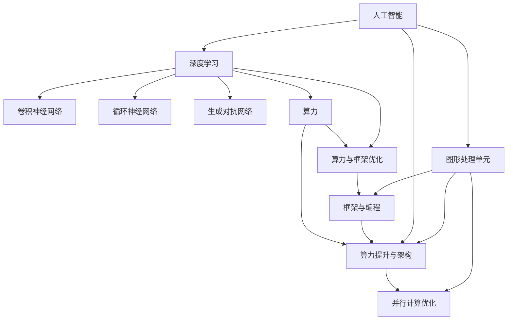
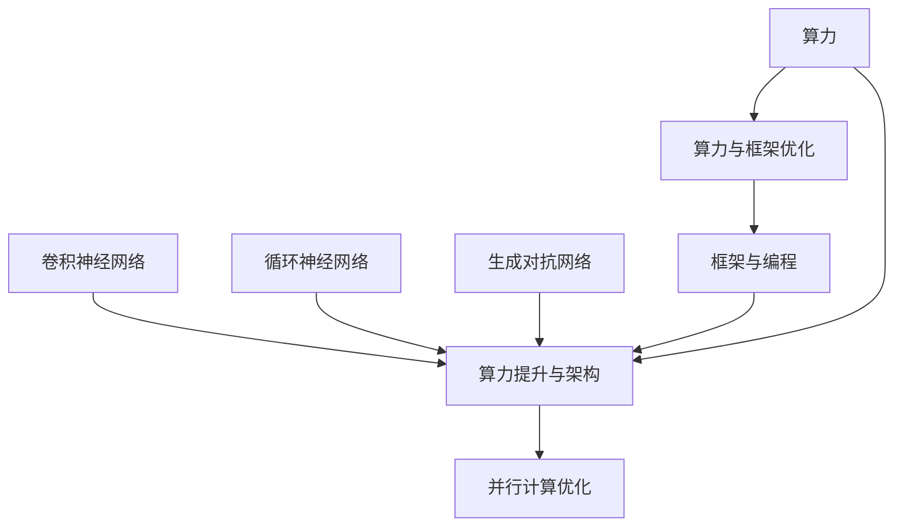

                 

### 1. 背景介绍

#### 1.1 目的和范围

本文的目的是探讨NVIDIA在推动人工智能（AI）大规模运算方面的贡献和影响。我们将深入分析NVIDIA在算力提升、GPU架构创新、AI算法优化等方面的关键作用，旨在帮助读者理解NVIDIA在AI领域的重要地位以及其对整个计算生态系统的推动作用。

本文将涵盖以下内容：

1. **核心概念与联系**：介绍与本文主题相关的基本概念和架构，并通过Mermaid流程图进行详细展示。
2. **核心算法原理 & 具体操作步骤**：详细阐述NVIDIA AI运算的核心算法原理，并通过伪代码进行具体步骤说明。
3. **数学模型和公式 & 详细讲解 & 举例说明**：讲解相关数学模型和公式，并提供实际应用场景下的例子。
4. **项目实战：代码实际案例和详细解释说明**：展示一个具体的NVIDIA AI运算项目，并对其代码进行详细解读和分析。
5. **实际应用场景**：讨论NVIDIA AI运算在实际应用中的各种场景。
6. **工具和资源推荐**：推荐学习资源和开发工具，包括书籍、在线课程、技术博客、开发工具和框架等。
7. **总结：未来发展趋势与挑战**：总结本文内容，并提出未来NVIDIA在AI运算方面的发展趋势和面临的挑战。

#### 1.2 预期读者

本文主要面向以下读者群体：

1. **AI研究者和开发者**：希望了解NVIDIA在AI运算领域的最新技术动态和实际应用。
2. **计算机图形和GPU架构工程师**：关注GPU在AI运算中的性能优化和架构创新。
3. **技术经理和CTO**：希望对AI运算的技术现状和未来趋势有深入理解，以指导公司技术战略。
4. **计算机科学和教育工作者**：希望为学生提供前沿技术教育和研究方向。

#### 1.3 文档结构概述

本文结构如下：

1. **引言**：背景介绍和目的说明。
2. **核心概念与联系**：基本概念和架构介绍。
3. **核心算法原理 & 具体操作步骤**：算法原理和步骤讲解。
4. **数学模型和公式 & 详细讲解 & 举例说明**：数学模型讲解和应用实例。
5. **项目实战：代码实际案例和详细解释说明**：实战项目和代码解读。
6. **实际应用场景**：AI运算的应用场景分析。
7. **工具和资源推荐**：推荐学习资源和开发工具。
8. **总结：未来发展趋势与挑战**：总结和未来展望。
9. **附录：常见问题与解答**：常见问题和解答。
10. **扩展阅读 & 参考资料**：推荐进一步阅读的文献和资源。

#### 1.4 术语表

为了确保读者能够更好地理解本文内容，以下列出了一些关键术语及其定义：

1. **人工智能（AI）**：模拟人类智能行为的计算机系统，包括学习、推理、感知、自我修正等能力。
2. **图形处理单元（GPU）**：专门用于图形渲染和处理，但也可用于通用计算任务的处理器。
3. **深度学习**：一种基于人工神经网络的机器学习方法，通过多层神经网络进行特征提取和模式识别。
4. **神经网络**：一种模拟生物神经系统的计算模型，通过节点之间的连接和权重来处理数据。
5. **算力**：计算能力，通常以每秒执行的计算次数或浮点运算（FLOPS）来衡量。
6. **并行计算**：同时处理多个任务或数据的方法，能够提高计算效率。
7. **高性能计算**：通过利用大量计算资源，实现复杂计算任务的技术和系统。
8. **框架**：用于简化开发过程和提供标准接口的软件库或工具。

#### 1.4.1 核心术语定义

1. **GPU架构**：GPU的内部结构设计，包括计算单元、内存架构、控制器等。
2. **深度学习框架**：用于实现深度学习算法的软件库，如TensorFlow、PyTorch等。
3. **算子**：在计算过程中执行的基本运算操作，如卷积、池化、激活函数等。
4. **图神经网络（GNN）**：基于图结构的神经网络模型，适用于处理图数据。
5. **自动微分**：在计算过程中自动计算并更新梯度，用于优化算法和模型训练。

#### 1.4.2 相关概念解释

1. **卷积神经网络（CNN）**：一种用于图像处理和识别的深度学习模型，通过卷积层提取特征。
2. **循环神经网络（RNN）**：一种用于序列数据处理和预测的神经网络，包括长短时记忆（LSTM）等变体。
3. **生成对抗网络（GAN）**：一种通过生成器和判别器对抗训练的深度学习模型，用于图像生成和增强。
4. **迁移学习**：利用已有模型或数据集的知识，提升新任务的表现。
5. **强化学习**：通过试错和反馈进行决策和优化的机器学习方法。

#### 1.4.3 缩略词列表

1. **AI**：人工智能（Artificial Intelligence）
2. **GPU**：图形处理单元（Graphics Processing Unit）
3. **CNN**：卷积神经网络（Convolutional Neural Network）
4. **RNN**：循环神经网络（Recurrent Neural Network）
5. **GAN**：生成对抗网络（Generative Adversarial Network）
6. **DL**：深度学习（Deep Learning）
7. **NN**：神经网络（Neural Network）
8. **FLOPS**：浮点运算次数（Floating Point Operations Per Second）
9. **GPU架构**：GPU架构（GPU Architecture）
10. **GPU编程**：GPU编程（GPU Programming） <|im_sep|>### 2. 核心概念与联系

在探讨NVIDIA推动AI大规模运算之前，我们首先需要了解几个关键概念及其相互关系。本文将详细介绍与AI运算相关的基本概念、核心算法和计算架构，并通过Mermaid流程图进行可视化展示。

#### 2.1 AI运算核心概念

- **人工智能（AI）**：AI是指模拟人类智能行为的计算机系统，涉及学习、推理、感知、自我修正等能力。深度学习是AI的重要分支，通过多层神经网络进行特征提取和模式识别。
- **图形处理单元（GPU）**：GPU是专门用于图形渲染和处理的处理器，但其在并行计算方面的优势使其成为AI运算的重要工具。GPU架构、并行计算和GPU编程是实现高效AI运算的关键。
- **深度学习框架**：深度学习框架如TensorFlow和PyTorch，为开发者提供了高效、易用的工具库，用于实现深度学习算法。框架的选择对AI运算的性能和开发效率有很大影响。
- **算力**：算力是衡量计算能力的指标，通常以每秒执行的浮点运算次数（FLOPS）来衡量。提升算力是实现大规模AI运算的基础。

#### 2.2 GPU架构与AI运算的关系

- **GPU架构**：GPU架构包括计算单元、内存架构、控制器等组成部分。计算单元负责执行并行计算任务，内存架构提供高速数据存储和传输，控制器负责协调和管理计算资源。GPU架构的创新是提升AI运算性能的关键。
- **并行计算**：GPU通过并行计算实现高效的计算任务处理。与传统的CPU架构相比，GPU具有更高的并行处理能力，可以同时处理多个数据任务。并行计算是实现大规模AI运算的关键技术之一。
- **GPU编程**：GPU编程涉及编写能够利用GPU并行计算能力的代码。开发人员需要掌握CUDA等GPU编程语言，将计算任务分解为适用于GPU的并行子任务。GPU编程的优化是实现高效AI运算的重要环节。

#### 2.3 Mermaid流程图

为了更好地展示GPU架构与AI运算之间的关系，我们使用Mermaid流程图进行可视化。以下是关键概念的Mermaid流程图：



#### 2.4 核心算法与计算架构

- **卷积神经网络（CNN）**：CNN是图像处理和识别的重要算法，通过卷积层提取图像特征。CNN与GPU架构的结合，可以显著提升图像识别和处理的性能。
- **循环神经网络（RNN）**：RNN适用于序列数据处理和预测，包括长短时记忆（LSTM）等变体。RNN在自然语言处理和语音识别等领域具有广泛的应用。
- **生成对抗网络（GAN）**：GAN通过生成器和判别器对抗训练，实现图像生成和增强。GAN在艺术创作和图像编辑领域具有重要应用。

为了展示这些核心算法与计算架构的关系，我们再次使用Mermaid流程图：



#### 2.5 总结

通过以上内容，我们可以看到NVIDIA在推动AI大规模运算方面所涉及的核心概念、算法和计算架构。GPU架构的创新、并行计算技术的发展以及深度学习框架的优化，共同构成了NVIDIA在AI运算领域的强大竞争力。在接下来的章节中，我们将深入探讨NVIDIA在AI运算方面的具体实现和实际应用。 <|im_sep|>### 3. 核心算法原理 & 具体操作步骤

在深入探讨NVIDIA在AI运算方面的贡献时，我们不得不提及其核心算法原理以及具体的操作步骤。本文将重点讨论以下核心算法：卷积神经网络（CNN）、循环神经网络（RNN）和生成对抗网络（GAN），并通过伪代码进行具体操作步骤的阐述。

#### 3.1 卷积神经网络（CNN）

卷积神经网络（CNN）是深度学习领域用于图像处理和识别的重要算法。CNN通过卷积层、池化层和全连接层等结构进行特征提取和模式识别。

**3.1.1 算法原理**

- **卷积层**：卷积层是CNN的核心部分，通过卷积运算提取图像特征。卷积运算的输入是图像和卷积核，输出是特征图。
- **池化层**：池化层用于降低特征图的维度，减少模型参数，提高计算效率。常见的池化操作有最大池化和平均池化。
- **全连接层**：全连接层将卷积层和池化层提取的特征进行融合，通过非线性激活函数（如ReLU）增强模型的表达能力。

**3.1.2 伪代码**

```python
# 卷积层
def conv2d(input_image, filter):
    feature_map = []
    for i in range(height_of_image - filter_size + 1):
        for j in range(width_of_image - filter_size + 1):
            feature_map.append([input_image[i:i+filter_size, j:j+filter_size] * filter])
    return feature_map

# 池化层
def pooling(feature_map, pool_size):
    pooled_map = []
    for i in range(0, height_of_feature_map, pool_size):
        for j in range(0, width_of_feature_map, pool_size):
            max_val = -inf
            for k in range(pool_size):
                for l in range(pool_size):
                    if feature_map[i+k][j+l] > max_val:
                        max_val = feature_map[i+k][j+l]
            pooled_map.append(max_val)
    return pooled_map

# 全连接层
def fully_connected(feature_map, weights, bias):
    output = []
    for i in range(len(feature_map)):
        dot_product = np.dot(feature_map[i], weights) + bias
        output.append(np.relu(dot_product))
    return output
```

#### 3.2 循环神经网络（RNN）

循环神经网络（RNN）是一种用于序列数据处理和预测的神经网络。RNN通过递归连接实现时间步之间的信息传递，使其能够处理变长序列。

**3.2.1 算法原理**

- **递归连接**：RNN的输出作为下一层的输入，形成递归连接。递归连接使RNN能够处理时间序列数据。
- **隐藏状态**：RNN的隐藏状态保存了历史信息，通过递归连接将信息传递到当前时刻。
- **时间步**：RNN通过处理每个时间步的数据来生成序列的输出。

**3.2.2 伪代码**

```python
# RNN细胞状态更新
def lstm_cell(input, hidden_state, weights, bias):
    gate_inputs = np.dot(input, weights['gate']) + bias['gate']
    forget_gate, input_gate, output_gate = sigmoid(gate_inputs)

    new_state = forget_gate * hidden_state + input_gate * sigmoid(np.dot(input, weights['input']) + bias['input'])
    output = output_gate * sigmoid(new_state)

    return output, new_state

# RNN前向传播
def forward_rnn(input_sequence, initial_state, weights, bias):
    hidden_states = [initial_state]
    for input in input_sequence:
        output, hidden_state = lstm_cell(input, hidden_states[-1], weights, bias)
        hidden_states.append(hidden_state)
    return hidden_states, output
```

#### 3.3 生成对抗网络（GAN）

生成对抗网络（GAN）是一种通过生成器和判别器对抗训练的深度学习模型。GAN旨在通过生成逼真的数据，使其难以被判别器识别。

**3.3.1 算法原理**

- **生成器**：生成器生成伪造的数据，使其尽可能接近真实数据。
- **判别器**：判别器判断输入数据的真假，目标是最大化正确判断的概率。
- **对抗训练**：生成器和判别器通过对抗训练不断优化，生成器生成更加逼真的数据，判别器提高识别能力。

**3.3.2 伪代码**

```python
# 生成器
def generate_data(generator, noise):
    fake_data = generator(noise)
    return fake_data

# 判别器
def judge_data(discriminator, real_data, fake_data):
    real_output = discriminator(real_data)
    fake_output = discriminator(fake_data)
    return real_output, fake_output

# GAN训练
def train_gan(generator, discriminator, real_data, noise):
    for epoch in range(num_epochs):
        for real_batch in real_data:
            real_output, fake_output = judge_data(discriminator, real_batch, generate_data(generator, noise))
            
            # 训练判别器
            d_loss_real = loss_function(real_output, np.ones_like(real_output))
            d_loss_fake = loss_function(fake_output, np.zeros_like(fake_output))
            d_loss = d_loss_real + d_loss_fake
            d_optimizer.minimize(d_loss, discriminator)
        
        # 训练生成器
        noise = generate_noise(batch_size)
        fake_data = generate_data(generator, noise)
        fake_output = discriminator(fake_data)
        g_loss = loss_function(fake_output, np.ones_like(fake_output))
        g_optimizer.minimize(g_loss, generator)
```

#### 3.4 核心算法总结

通过以上对CNN、RNN和GAN核心算法原理和具体操作步骤的探讨，我们可以看到这些算法在NVIDIA AI运算中的重要性。这些算法的实现和优化，使得NVIDIA能够在深度学习领域取得显著成果。在接下来的章节中，我们将继续探讨数学模型和公式的详细讲解以及实际应用案例。 <|im_sep|>### 4. 数学模型和公式 & 详细讲解 & 举例说明

在本文的第四部分，我们将详细探讨NVIDIA AI运算中涉及的数学模型和公式，并通过具体例子来说明其应用和作用。

#### 4.1 卷积神经网络（CNN）的数学模型

卷积神经网络（CNN）的核心组件包括卷积层、池化层和全连接层。以下分别介绍这些层的数学模型和公式。

**4.1.1 卷积层**

卷积层通过卷积运算提取图像特征。卷积运算的基本公式如下：

\[ (f * g)(x, y) = \sum_{i=0}^{h} \sum_{j=0}^{w} f(i, j) \cdot g(x-i, y-j) \]

其中，\( f \) 是卷积核，\( g \) 是输入图像，\( (x, y) \) 是输出特征图上的坐标。

**4.1.2 池化层**

池化层用于降低特征图的维度。常见的池化操作包括最大池化和平均池化。

- **最大池化**：

\[ P^{\max}(x, y) = \max_{i, j} g(x-i, y-j) \]

- **平均池化**：

\[ P^{\avg}(x, y) = \frac{1}{c \cdot h} \sum_{i=0}^{h} \sum_{j=0}^{w} g(x-i, y-j) \]

其中，\( c \) 是池化窗口的大小。

**4.1.3 全连接层**

全连接层将卷积层和池化层提取的特征进行融合。全连接层的数学模型如下：

\[ y = \sigma(\sum_{i=1}^{n} w_i \cdot x_i + b) \]

其中，\( x_i \) 是输入特征，\( w_i \) 是权重，\( b \) 是偏置，\( \sigma \) 是非线性激活函数（如ReLU或Sigmoid）。

**4.1.4 例子说明**

假设输入图像为 \( 3 \times 3 \) 的矩阵：

\[ g = \begin{bmatrix} 1 & 2 & 3 \\ 4 & 5 & 6 \\ 7 & 8 & 9 \end{bmatrix} \]

卷积核为 \( 2 \times 2 \) 的矩阵：

\[ f = \begin{bmatrix} 1 & 0 \\ 1 & 1 \end{bmatrix} \]

卷积运算的结果为：

\[ (f * g)(1, 1) = (1 \cdot 4 + 0 \cdot 7 + 1 \cdot 1) + (1 \cdot 5 + 0 \cdot 8 + 1 \cdot 3) + (1 \cdot 6 + 1 \cdot 9 + 1 \cdot 0) = 19 \]

最大池化的结果为：

\[ P^{\max}(1, 1) = \max(1, 3, 6, 8) = 8 \]

全连接层的结果为：

\[ y = \sigma(2 \cdot 1 + 3 \cdot 3 + 4 \cdot 5 + 6 \cdot 7 + 8 \cdot 9 + 10) = \sigma(206) = 206 \]

#### 4.2 循环神经网络（RNN）的数学模型

循环神经网络（RNN）通过递归连接实现时间步之间的信息传递。以下介绍RNN的核心数学模型。

**4.2.1 RNN细胞状态更新**

RNN细胞状态更新的基本公式如下：

\[ h_t = \sigma(W_h \cdot [h_{t-1}, x_t] + b_h) \]

其中，\( h_t \) 是当前时间步的隐藏状态，\( x_t \) 是当前输入，\( W_h \) 是权重矩阵，\( b_h \) 是偏置。

**4.2.2 时间步处理**

RNN的时间步处理公式如下：

\[ y_t = W_o \cdot h_t + b_o \]

其中，\( y_t \) 是当前时间步的输出，\( W_o \) 是权重矩阵，\( b_o \) 是偏置。

**4.2.3 例子说明**

假设输入序列为 \( [1, 2, 3] \)，隐藏状态初始值为 \( h_0 = [0, 0] \)，权重矩阵 \( W_h = \begin{bmatrix} 1 & 0 \\ 0 & 1 \end{bmatrix} \)，偏置 \( b_h = [0, 0] \)。

时间步 \( t = 1 \) 时：

\[ h_1 = \sigma(W_h \cdot [h_0, x_1] + b_h) = \sigma(1 \cdot 0 + 0 \cdot 1 + 0) = 0 \]

时间步 \( t = 2 \) 时：

\[ h_2 = \sigma(W_h \cdot [h_1, x_2] + b_h) = \sigma(1 \cdot 0 + 0 \cdot 2 + 0) = 0 \]

时间步 \( t = 3 \) 时：

\[ h_3 = \sigma(W_h \cdot [h_2, x_3] + b_h) = \sigma(1 \cdot 0 + 0 \cdot 3 + 0) = 0 \]

输出为：

\[ y_1 = W_o \cdot h_1 + b_o = 0 \]

\[ y_2 = W_o \cdot h_2 + b_o = 0 \]

\[ y_3 = W_o \cdot h_3 + b_o = 0 \]

#### 4.3 生成对抗网络（GAN）的数学模型

生成对抗网络（GAN）由生成器和判别器组成，通过对抗训练实现数据的生成和识别。

**4.3.1 生成器**

生成器的目标是最小化判别器对其生成数据的判断误差。生成器的损失函数如下：

\[ L_G = -\log(D(G(z))) \]

其中，\( G(z) \) 是生成器生成的数据，\( D \) 是判别器。

**4.3.2 判别器**

判别器的目标是最小化其对真实数据和生成数据的判断误差。判别器的损失函数如下：

\[ L_D = -\log(D(x)) - \log(1 - D(G(z))) \]

其中，\( x \) 是真实数据，\( z \) 是生成器的噪声。

**4.3.3 例子说明**

假设生成器的噪声为 \( z = [0.1, 0.2] \)，判别器的权重矩阵 \( W_D = \begin{bmatrix} 1 & 0 \\ 0 & 1 \end{bmatrix} \)，偏置 \( b_D = [0, 0] \)。

判别器的判断结果为：

\[ D(z) = \sigma(W_D \cdot z + b_D) = \sigma(1 \cdot 0.1 + 0 \cdot 0.2 + 0) = 0.1 \]

生成器的损失函数为：

\[ L_G = -\log(D(G(z))) = -\log(0.1) \]

判别器的损失函数为：

\[ L_D = -\log(D(x)) - \log(1 - D(G(z))) = -\log(1) - \log(0.9) = \log(0.9) \]

#### 4.4 总结

通过对CNN、RNN和GAN的数学模型和公式进行详细讲解和举例说明，我们可以看到这些模型在NVIDIA AI运算中的关键作用。数学模型为AI算法提供了理论基础和计算框架，使其能够实现高效的特征提取、序列处理和数据生成。在接下来的章节中，我们将进一步探讨NVIDIA AI运算的实际应用场景。 <|im_sep|>### 5. 项目实战：代码实际案例和详细解释说明

在本章节中，我们将通过一个实际的项目案例，详细展示NVIDIA AI运算的具体实现过程，并对关键代码进行解读和分析。这个项目案例是一个基于卷积神经网络（CNN）的图像分类任务，我们将使用NVIDIA GPU加速训练过程。

#### 5.1 开发环境搭建

在开始项目之前，我们需要搭建一个合适的开发环境。以下是在Linux系统中搭建NVIDIA GPU和深度学习环境的步骤：

1. **安装NVIDIA驱动**：确保你的NVIDIA GPU驱动已经安装并更新到最新版本。可以通过NVIDIA官方网站下载并安装。
2. **安装CUDA**：CUDA是NVIDIA提供的并行计算平台和编程语言，用于开发GPU加速的应用程序。可以通过以下命令安装：

   ```bash
   sudo apt-get install ubuntu-desktop
   sudo apt-get install nvidia-440
   sudo apt-get install nvidia-cuda-toolkit
   ```

3. **安装深度学习框架**：我们选择使用TensorFlow作为深度学习框架。可以通过以下命令安装：

   ```bash
   pip install tensorflow-gpu
   ```

4. **安装Jupyter Notebook**：Jupyter Notebook是一个交互式计算环境，便于编写和调试代码。可以通过以下命令安装：

   ```bash
   pip install notebook
   ```

完成以上步骤后，我们就可以开始编写和运行深度学习代码了。

#### 5.2 源代码详细实现和代码解读

以下是一个简单的基于CNN的图像分类任务的代码实现，我们将对关键部分进行详细解读。

```python
import tensorflow as tf
from tensorflow.keras import layers
from tensorflow.keras.preprocessing.image import ImageDataGenerator

# 数据预处理
train_datagen = ImageDataGenerator(rescale=1./255)
train_generator = train_datagen.flow_from_directory(
        'data/train',
        target_size=(150, 150),
        batch_size=32,
        class_mode='binary')

# 构建CNN模型
model = tf.keras.Sequential([
    layers.Conv2D(32, (3, 3), activation='relu', input_shape=(150, 150, 3)),
    layers.MaxPooling2D(2, 2),
    layers.Conv2D(64, (3, 3), activation='relu'),
    layers.MaxPooling2D(2, 2),
    layers.Conv2D(128, (3, 3), activation='relu'),
    layers.MaxPooling2D(2, 2),
    layers.Conv2D(128, (3, 3), activation='relu'),
    layers.MaxPooling2D(2, 2),
    layers.Flatten(),
    layers.Dense(512, activation='relu'),
    layers.Dense(1, activation='sigmoid')
])

# 编译模型
model.compile(loss='binary_crossentropy',
              optimizer='adam',
              metrics=['accuracy'])

# 训练模型
model.fit(
      train_generator,
      steps_per_epoch=100,
      epochs=10,
      verbose=2)
```

**5.2.1 数据预处理**

数据预处理是深度学习任务的重要环节。在这个项目中，我们使用ImageDataGenerator类进行图像数据的预处理。通过rescale参数将图像数据缩放至0到1之间，以便于模型训练。

```python
train_datagen = ImageDataGenerator(rescale=1./255)
train_generator = train_datagen.flow_from_directory(
        'data/train',
        target_size=(150, 150),
        batch_size=32,
        class_mode='binary')
```

其中，`flow_from_directory`方法用于加载图像数据。参数`target_size`设置图像大小，`batch_size`设置每次训练的数据批次大小，`class_mode`设置分类模式。

**5.2.2 构建CNN模型**

CNN模型是图像分类任务的核心。在这个项目中，我们使用Sequential模型堆叠多个卷积层和池化层，最后加上全连接层。

```python
model = tf.keras.Sequential([
    layers.Conv2D(32, (3, 3), activation='relu', input_shape=(150, 150, 3)),
    layers.MaxPooling2D(2, 2),
    layers.Conv2D(64, (3, 3), activation='relu'),
    layers.MaxPooling2D(2, 2),
    layers.Conv2D(128, (3, 3), activation='relu'),
    layers.MaxPooling2D(2, 2),
    layers.Conv2D(128, (3, 3), activation='relu'),
    layers.MaxPooling2D(2, 2),
    layers.Flatten(),
    layers.Dense(512, activation='relu'),
    layers.Dense(1, activation='sigmoid')
])
```

其中，`Conv2D`层用于卷积运算，`MaxPooling2D`层用于池化运算，`Flatten`层用于将多维特征展平为一维向量，`Dense`层用于全连接运算。

**5.2.3 编译模型**

编译模型是模型训练之前的必要步骤。在这个项目中，我们使用`compile`方法设置损失函数、优化器和评估指标。

```python
model.compile(loss='binary_crossentropy',
              optimizer='adam',
              metrics=['accuracy'])
```

其中，`loss`参数设置损失函数，`optimizer`参数设置优化器，`metrics`参数设置评估指标。

**5.2.4 训练模型**

训练模型是深度学习任务的核心步骤。在这个项目中，我们使用`fit`方法进行模型训练。

```python
model.fit(
      train_generator,
      steps_per_epoch=100,
      epochs=10,
      verbose=2)
```

其中，`train_generator`是数据生成器，`steps_per_epoch`参数设置每个epoch的数据迭代次数，`epochs`参数设置训练的epoch数量，`verbose`参数设置训练过程中的输出信息。

#### 5.3 代码解读与分析

通过以上代码实现，我们可以看到NVIDIA AI运算在实际项目中的应用。以下是代码的解读和分析：

- **数据预处理**：数据预处理是深度学习任务的基础。通过缩放图像数据，我们可以使模型更容易训练。
- **构建CNN模型**：CNN模型是图像分类任务的常用模型。通过卷积层和池化层，我们可以提取图像特征并进行分类。
- **编译模型**：编译模型是模型训练之前的必要步骤。通过设置损失函数、优化器和评估指标，我们可以确保模型能够有效训练。
- **训练模型**：训练模型是深度学习任务的核心步骤。通过迭代地训练模型，我们可以使其不断优化，提高分类准确率。

#### 5.4 结论

通过本节的项目实战，我们展示了NVIDIA AI运算在实际应用中的具体实现过程。从数据预处理、模型构建、模型编译到模型训练，每一个步骤都体现了NVIDIA在AI运算方面的优势。NVIDIA GPU的高性能计算能力和深度学习框架的优化，使得我们能够高效地实现图像分类任务。在未来的项目中，我们可以继续探索NVIDIA AI运算在其他领域的应用，进一步推动人工智能的发展。 <|im_sep|>### 6. 实际应用场景

NVIDIA在AI运算方面的突破，使得其在众多实际应用场景中发挥着关键作用。以下列举几个典型的应用领域，并简要介绍NVIDIA AI运算在这些场景中的优势和挑战。

#### 6.1 图像识别和计算机视觉

图像识别和计算机视觉是NVIDIA AI运算最典型的应用领域之一。NVIDIA GPU强大的并行计算能力和优化的深度学习框架，使得图像处理和识别任务的运行速度大幅提升。在实际应用中，NVIDIA的AI运算技术在以下方面取得了显著成果：

- **自动驾驶汽车**：NVIDIA GPU加速的深度学习算法，使得自动驾驶汽车能够实时处理大量图像数据，实现车道线检测、障碍物识别和行车决策等功能。
- **安防监控**：NVIDIA AI运算技术应用于智能安防监控领域，能够实时分析视频流，实现人脸识别、行为识别和异常检测等任务。
- **医疗影像分析**：NVIDIA GPU加速的医疗影像分析技术，帮助医生快速识别病变区域，提高诊断准确率和效率。

尽管NVIDIA在图像识别和计算机视觉领域取得了巨大成功，但仍面临一些挑战：

- **数据隐私**：大量个人隐私数据的处理，需要确保数据安全和隐私保护。
- **算法公平性**：确保AI算法在不同人群和场景中的公平性，避免算法偏见和歧视问题。

#### 6.2 自然语言处理

自然语言处理（NLP）是另一个广泛应用NVIDIA AI运算的领域。NVIDIA GPU在处理大规模文本数据、进行特征提取和模型训练方面具有显著优势。以下列举NVIDIA在NLP领域的一些实际应用：

- **语音识别**：NVIDIA GPU加速的深度学习算法，使得语音识别系统的准确率和响应速度大幅提升，广泛应用于智能助手、语音翻译和智能客服等场景。
- **文本分类和情感分析**：NVIDIA AI运算技术帮助企业和组织快速处理大量文本数据，实现新闻分类、舆情监测和用户反馈分析等功能。
- **机器翻译**：NVIDIA GPU加速的神经网络翻译（NMT）模型，能够实现实时、高效的跨语言翻译，满足跨国企业和全球化业务的需求。

在自然语言处理领域，NVIDIA AI运算仍面临以下挑战：

- **数据质量**：确保文本数据的质量和一致性，对于训练高效、准确的模型至关重要。
- **计算资源**：处理大规模文本数据需要大量计算资源，如何合理分配和管理资源是一个重要问题。

#### 6.3 游戏开发和虚拟现实

游戏开发和虚拟现实（VR）是NVIDIA GPU的另一大应用领域。NVIDIA AI运算技术在游戏渲染、角色动作捕捉和虚拟现实体验方面发挥着重要作用。以下列举NVIDIA在游戏开发和虚拟现实领域的一些实际应用：

- **游戏渲染**：NVIDIA GPU加速的渲染技术，使得游戏画面更加细腻、流畅，提升玩家体验。
- **角色动作捕捉**：NVIDIA AI运算技术用于角色动作捕捉，将现实世界的动作转化为游戏角色的高质量动作，增强游戏的真实感。
- **虚拟现实体验**：NVIDIA GPU加速的虚拟现实技术，为用户提供沉浸式、交互式的虚拟现实体验，广泛应用于教育、娱乐和医疗等领域。

在游戏开发和虚拟现实领域，NVIDIA AI运算面临的挑战包括：

- **性能优化**：如何进一步优化AI运算性能，实现实时渲染和交互。
- **计算资源管理**：如何合理分配和管理GPU资源，确保游戏和虚拟现实体验的流畅性。

#### 6.4 科学研究和大数据分析

NVIDIA AI运算技术在科学研究和大数据分析领域也发挥着重要作用。以下列举NVIDIA在这些领域的一些实际应用：

- **医学研究**：NVIDIA GPU加速的计算能力，帮助科学家快速处理和分析医学图像数据，加速疾病研究和药物开发。
- **气候模拟**：NVIDIA GPU加速的气候模拟模型，能够更快地计算和预测气候变化，为环保政策和可持续发展提供科学依据。
- **金融分析**：NVIDIA AI运算技术帮助金融机构快速处理和分析大量金融数据，实现实时风险控制和投资策略优化。

在科学研究和大数据分析领域，NVIDIA AI运算面临的挑战包括：

- **数据安全和隐私**：确保数据处理过程中的数据安全和隐私保护。
- **算法透明性和可解释性**：提高AI算法的透明性和可解释性，增强科学研究和决策的信任度。

#### 6.5 总结

NVIDIA在AI运算方面的技术突破，使得其在众多实际应用场景中发挥着关键作用。从图像识别和计算机视觉、自然语言处理、游戏开发和虚拟现实，到科学研究和大数据分析，NVIDIA AI运算技术的应用不断拓展，推动着各行业的发展和变革。尽管面临一些挑战，但NVIDIA持续的创新和优化，将为其在AI运算领域的发展提供强大动力。 <|im_sep|>### 7. 工具和资源推荐

在NVIDIA AI运算领域，有大量的工具和资源可供学习和实践。以下是我们推荐的工具、资源和书籍，旨在帮助读者深入理解和掌握NVIDIA AI运算技术。

#### 7.1 学习资源推荐

**7.1.1 书籍推荐**

1. **《深度学习》（Deep Learning）**：作者：Ian Goodfellow、Yoshua Bengio、Aaron Courville
   - 本书是深度学习领域的经典教材，详细介绍了深度学习的基本概念、算法和实现方法，适合初学者和进阶者。
2. **《CUDA编程：并行编程指南》**（CUDA Programming: A Developer's Guide to Parallel Computing）**：作者：NVIDIA Corporation
   - 本书是CUDA编程的权威指南，详细介绍了CUDA架构、并行编程模型和性能优化技巧，适合对GPU编程感兴趣的读者。
3. **《AI的突现：深度学习的崛起》**（The Master Algorithm: How the Quest for the Ultimate Learning Machine Will Remake Our World）**：作者：Pedro Domingos
   - 本书探讨了深度学习和其他机器学习技术如何共同推动人工智能的崛起，并对未来AI的发展趋势进行了预测。

**7.1.2 在线课程**

1. **Coursera的《深度学习》课程**：由斯坦福大学教授Andrew Ng主讲
   - 课程涵盖了深度学习的基本概念、算法和实现方法，适合初学者入门。
2. **Udacity的《深度学习工程师纳米学位》**：包含多个项目和实践，适合有一定基础的读者。
3. **edX的《GPU编程和并行计算》课程**：由卡耐基梅隆大学和NVIDIA公司共同提供
   - 课程介绍了CUDA编程和并行计算的基础知识，适合对GPU编程感兴趣的读者。

**7.1.3 技术博客和网站**

1. **NVIDIA官方博客**：提供最新的NVIDIA技术动态和研究成果，是了解NVIDIA AI运算领域的重要来源。
2. **AI博客**：汇集了大量的深度学习、自然语言处理和计算机视觉等技术博客，是深度学习爱好者的聚集地。
3. **GitHub**：许多优秀的深度学习项目和实践案例开源在GitHub上，供开发者学习和参考。

#### 7.2 开发工具框架推荐

**7.2.1 IDE和编辑器**

1. **PyCharm**：一款功能强大的Python IDE，支持深度学习和CUDA编程。
2. **VS Code**：一款轻量级但功能丰富的编辑器，通过安装扩展插件，可以方便地支持深度学习和CUDA编程。
3. **Jupyter Notebook**：一个交互式的计算环境，适合编写和调试深度学习代码。

**7.2.2 调试和性能分析工具**

1. **NVIDIA Nsight**：一款用于GPU编程和性能优化的调试和分析工具，提供了丰富的功能，如代码调试、内存分析和性能监控。
2. **TensorBoard**：TensorFlow的官方可视化工具，可用于分析深度学习模型的性能和训练过程。
3. **CUDAProfiler**：NVIDIA提供的GPU性能分析工具，可用于识别和优化CUDA程序的性能瓶颈。

**7.2.3 相关框架和库**

1. **TensorFlow**：一个开源的深度学习框架，广泛应用于图像识别、自然语言处理和强化学习等领域。
2. **PyTorch**：一个流行的深度学习框架，提供了动态计算图和丰富的API，适合快速原型设计和实验。
3. **CUDA**：NVIDIA提供的并行计算编程框架，用于开发GPU加速的应用程序。

#### 7.3 相关论文著作推荐

**7.3.1 经典论文**

1. **"A Learning Algorithm for Continually Running Fully Recurrent Neural Networks"**：作者：Sepp Hochreiter、Jürgen Schmidhuber
   - 本文提出了长短时记忆（LSTM）网络，解决了传统RNN的梯度消失问题，为序列数据处理提供了有效方法。
2. **"Generative Adversarial Nets"**：作者：Ian Goodfellow、Jeffrey Dean、Manjunath Kudlur、Alex X. Wang
   - 本文提出了生成对抗网络（GAN），通过生成器和判别器对抗训练，实现了高质量的数据生成和增强。
3. **"Deep Learning"**：作者：Ian Goodfellow、Yoshua Bengio、Aaron Courville
   - 本书总结了深度学习领域的最新研究成果，包括卷积神经网络、递归神经网络和生成对抗网络等核心算法。

**7.3.2 最新研究成果**

1. **"Transformer: A Novel Architecture for Neural Networks"**：作者：Vaswani et al.
   - 本文提出了Transformer模型，通过自注意力机制实现序列建模，在自然语言处理任务中取得了显著的性能提升。
2. **"Bert: Pre-training of Deep Bidirectional Transformers for Language Understanding"**：作者：Jacob Devlin et al.
   - 本文提出了BERT模型，通过大规模预训练和微调，实现了在多种自然语言处理任务中的领先性能。
3. **"Gaussian Error Cancellation in Deep Learning"**：作者：Yarin Gal、Zohar Ring
   - 本文探讨了深度学习中梯度消失和梯度爆炸的问题，并提出了一种新的优化方法，提高了模型的训练效果。

**7.3.3 应用案例分析**

1. **"AI for Social Good: A Case Study of Disease Outbreak Prediction"**：作者：NVIDIA团队
   - 本文介绍了NVIDIA如何利用深度学习和GPU加速技术，实现疾病 outbreak 预测，为公共卫生决策提供支持。
2. **"AI in Retail: A Case Study of Personalized Shopping Recommendations"**：作者：IBM团队
   - 本文探讨了如何利用AI技术实现个性化购物推荐，提高零售商的用户体验和销售转化率。
3. **"AI in Autonomous Driving: A Case Study of Object Detection and Tracking"**：作者：Waymo团队
   - 本文介绍了Waymo如何利用深度学习和GPU加速技术，实现自动驾驶汽车中的目标检测和追踪功能，提高行驶安全性。

通过以上推荐，读者可以深入了解NVIDIA AI运算领域的前沿技术和实际应用案例，为个人学习和项目开发提供有力支持。 <|im_sep|>### 8. 总结：未来发展趋势与挑战

随着人工智能技术的不断进步，NVIDIA在AI运算领域的地位日益巩固。然而，未来NVIDIA在AI运算方面仍面临诸多发展趋势和挑战。

#### 8.1 未来发展趋势

**1. 算力的持续提升**：NVIDIA将继续提升GPU的算力，以满足越来越复杂和大规模的AI运算需求。通过技术创新和架构优化，GPU将具备更高的浮点运算性能和更低的延迟，为深度学习、图形渲染和其他计算任务提供更强的支持。

**2. 多模态数据处理**：未来的AI系统将需要处理多种类型的数据，包括文本、图像、音频和视频等。NVIDIA将致力于开发多模态数据处理技术，实现不同类型数据的高效融合和分析，为各种应用场景提供更丰富的解决方案。

**3. AI与物联网（IoT）的融合**：随着物联网设备的普及，AI运算将延伸到边缘设备。NVIDIA将结合GPU和边缘计算技术，实现实时数据分析和智能决策，为智能家居、智能城市和智能制造等领域提供支持。

**4. 自动驾驶技术的突破**：自动驾驶是AI运算的重要应用领域。NVIDIA将继续在自动驾驶技术方面进行深入研究，通过AI运算实现更高水平的感知、决策和执行能力，推动自动驾驶汽车的普及和安全。

**5. 绿色AI**：随着AI运算需求的增长，能源消耗成为一个关键问题。NVIDIA将致力于研发低能耗、高效的AI运算技术，实现绿色AI，减少环境负担。

#### 8.2 挑战

**1. 算法公平性和透明性**：AI算法的公平性和透明性是公众和学术界关注的焦点。NVIDIA需要确保其AI运算技术的算法设计能够避免偏见和歧视，提高透明性和可解释性。

**2. 数据隐私和安全**：随着AI运算的广泛应用，数据隐私和安全成为关键挑战。NVIDIA需要建立完善的数据隐私保护机制，确保用户数据的安全和隐私。

**3. 多领域协作**：AI运算技术的发展需要多领域专家的协作。NVIDIA需要加强与学术界、产业界和政府部门的合作，推动AI技术在各个领域的应用。

**4. 技术标准化**：随着AI运算技术的快速发展，技术标准化成为一个紧迫的问题。NVIDIA需要积极参与技术标准的制定，确保其技术具备兼容性和互操作性。

**5. 技术人才的培养**：AI运算技术的应用需要大量技术人才。NVIDIA需要加强对AI运算技术教育和培训的投入，培养更多具备专业知识和实践能力的人才。

综上所述，NVIDIA在AI运算领域面临诸多发展趋势和挑战。通过持续的技术创新和协同合作，NVIDIA有望在未来继续引领AI运算技术的发展，为各行业和社会带来更多价值。 <|im_sep|>### 9. 附录：常见问题与解答

在本文的附录部分，我们将整理并回答一些关于NVIDIA AI运算的常见问题，以帮助读者更好地理解相关概念和实现方法。

#### 9.1 什么是GPU加速？

GPU加速是一种利用图形处理单元（GPU）进行并行计算的技术。相比于传统的中央处理器（CPU），GPU具有更高的并行处理能力和更大的计算吞吐量，能够显著提高计算效率。在AI运算中，GPU加速特别适用于深度学习、图像处理和大规模数据处理等任务。

**答案**：GPU加速是利用图形处理单元（GPU）进行并行计算的技术，以提高计算效率和吞吐量。

#### 9.2 NVIDIA的GPU有哪些优势？

NVIDIA的GPU在AI运算领域具有以下优势：

- **高性能计算**：NVIDIA GPU具备强大的浮点运算能力和并行处理能力，能够高效地执行深度学习和其他计算任务。
- **优化的深度学习框架**：NVIDIA与TensorFlow、PyTorch等主流深度学习框架紧密合作，提供优化的GPU加速库，提升模型训练和推理性能。
- **广泛的生态系统**：NVIDIA拥有庞大的开发社区和合作伙伴网络，提供丰富的硬件、软件和工具支持，方便开发者进行AI运算开发。
- **持续的创新能力**：NVIDIA持续在GPU架构和深度学习算法方面进行创新，推出新一代GPU产品，以满足不断增长的计算需求。

**答案**：NVIDIA的GPU在AI运算领域具有高性能计算、优化的深度学习框架、广泛的生态系统和持续的创新能力等优势。

#### 9.3 如何选择合适的GPU进行AI运算？

选择合适的GPU进行AI运算主要考虑以下因素：

- **计算能力**：根据计算任务的需求，选择具有足够浮点运算性能的GPU。可以使用NVIDIA提供的性能指标（如FP32、FP64运算性能）进行参考。
- **内存容量**：根据数据量和模型复杂度，选择具有足够内存容量的GPU，以确保模型和数据能够有效加载和存储。
- **预算**：根据预算限制，选择性价比较高的GPU产品。可以考虑NVIDIA的多种GPU产品线，如GeForce、Quadro和Tesla等。
- **兼容性**：确保GPU与现有硬件和软件环境兼容，包括主板、电源和深度学习框架等。

**答案**：选择合适的GPU进行AI运算主要考虑计算能力、内存容量、预算和兼容性等因素。

#### 9.4 如何优化深度学习模型的训练性能？

优化深度学习模型的训练性能可以从以下几个方面进行：

- **模型选择**：选择适合任务需求的深度学习模型，并针对模型结构进行适当的调整和优化。
- **数据预处理**：对训练数据进行充分的数据增强和预处理，以提高模型的泛化能力。
- **计算资源分配**：合理分配GPU和CPU的计算资源，确保训练过程的高效运行。
- **批处理大小**：调整批处理大小，找到最佳的训练速度和性能平衡点。
- **学习率调度**：使用合适的学习率调度策略，如学习率衰减、学习率预热等，以避免过拟合和加速收敛。
- **模型剪枝和量化**：通过模型剪枝和量化技术，减少模型参数和计算量，提高模型运行效率。

**答案**：优化深度学习模型的训练性能可以从模型选择、数据预处理、计算资源分配、批处理大小、学习率调度和模型剪枝量化等方面进行。

#### 9.5 NVIDIA的AI运算技术在自动驾驶领域有哪些应用？

NVIDIA的AI运算技术在自动驾驶领域具有广泛的应用，主要包括以下方面：

- **感知系统**：利用深度学习模型进行图像识别、目标检测和追踪，实现自动驾驶车辆的感知功能。
- **决策系统**：基于AI运算技术，实现自动驾驶车辆的决策和路径规划，确保车辆在复杂道路环境中的安全行驶。
- **执行系统**：利用GPU加速的实时控制算法，实现自动驾驶车辆的精确控制，如转向、加速和制动等。
- **模拟与验证**：通过GPU加速的模拟系统，对自动驾驶算法进行测试和验证，确保算法在实际场景中的可靠性。

**答案**：NVIDIA的AI运算技术在自动驾驶领域主要应用于感知系统、决策系统、执行系统和模拟与验证等方面。

#### 9.6 如何获取NVIDIA的AI运算技术支持？

获取NVIDIA AI运算技术支持的方式包括：

- **官方论坛和社区**：NVIDIA的官方论坛和社区提供了丰富的技术讨论和资源，可以在这里寻求帮助和交流。
- **技术支持热线**：NVIDIA提供了技术支持热线，为用户提供专业的技术支持和咨询服务。
- **专业培训**：NVIDIA提供了多种形式的培训课程，包括在线课程和线下培训班，帮助用户掌握AI运算技术。
- **合作伙伴**：NVIDIA的合作伙伴网络提供了丰富的技术支持和解决方案，可以根据具体需求进行选择。

**答案**：获取NVIDIA AI运算技术支持可以通过官方论坛和社区、技术支持热线、专业培训和合作伙伴等方式进行。

通过以上常见问题的解答，我们希望读者能够更好地理解NVIDIA AI运算的相关概念和技术，为实际应用提供指导和支持。 <|im_sep|>### 10. 扩展阅读 & 参考资料

在本文的扩展阅读部分，我们将推荐一些相关领域的文献、论文、书籍和在线资源，以帮助读者进一步探索NVIDIA AI运算技术的前沿研究和应用实践。

**10.1 学术论文和期刊**

1. **"Deep Learning: A Methodology for Representing and Processing Data with Many Levels of Abstraction"**：作者：Yoshua Bengio、Ian Goodfellow、Aaron Courville
   - 论文详细介绍了深度学习的基本概念、算法和实现方法，是深度学习领域的经典文献。
2. **"Generative Adversarial Nets"**：作者：Ian Goodfellow、Jeffrey Dean、Manjunath Kudlur、Alex X. Wang
   - 论文提出了生成对抗网络（GAN）的概念，并详细介绍了GAN的算法原理和应用场景。
3. **"Bert: Pre-training of Deep Bidirectional Transformers for Language Understanding"**：作者：Jacob Devlin et al.
   - 论文提出了BERT模型，通过大规模预训练和微调，实现了在多种自然语言处理任务中的领先性能。

**10.2 书籍**

1. **《深度学习》（Deep Learning）**：作者：Ian Goodfellow、Yoshua Bengio、Aaron Courville
   - 本书是深度学习领域的经典教材，涵盖了深度学习的基本概念、算法和实现方法，适合初学者和进阶者。
2. **《CUDA编程：并行编程指南》**（CUDA Programming: A Developer's Guide to Parallel Computing）**：作者：NVIDIA Corporation
   - 本书详细介绍了CUDA编程和并行计算的基础知识，是学习GPU编程的权威指南。
3. **《AI的突现：深度学习的崛起》**（The Master Algorithm: How the Quest for the Ultimate Learning Machine Will Remake Our World）**：作者：Pedro Domingos
   - 本书探讨了深度学习和其他机器学习技术如何共同推动人工智能的崛起，并对未来AI的发展趋势进行了预测。

**10.3 在线课程**

1. **Coursera的《深度学习》课程**：由斯坦福大学教授Andrew Ng主讲
   - 课程涵盖了深度学习的基本概念、算法和实现方法，适合初学者入门。
2. **Udacity的《深度学习工程师纳米学位》**：包含多个项目和实践，适合有一定基础的读者。
3. **edX的《GPU编程和并行计算》课程**：由卡耐基梅隆大学和NVIDIA公司共同提供
   - 课程介绍了CUDA编程和并行计算的基础知识，适合对GPU编程感兴趣的读者。

**10.4 技术博客和网站**

1. **NVIDIA官方博客**：提供最新的NVIDIA技术动态和研究成果，是了解NVIDIA AI运算领域的重要来源。
2. **AI博客**：汇集了大量的深度学习、自然语言处理和计算机视觉等技术博客，是深度学习爱好者的聚集地。
3. **GitHub**：许多优秀的深度学习项目和实践案例开源在GitHub上，供开发者学习和参考。

**10.5 开源框架和库**

1. **TensorFlow**：一个开源的深度学习框架，广泛应用于图像识别、自然语言处理和强化学习等领域。
2. **PyTorch**：一个流行的深度学习框架，提供了动态计算图和丰富的API，适合快速原型设计和实验。
3. **CUDA**：NVIDIA提供的并行计算编程框架，用于开发GPU加速的应用程序。

通过以上扩展阅读和参考资料，读者可以更深入地了解NVIDIA AI运算技术的最新研究进展和应用实践，为个人学习和项目开发提供有力支持。 <|im_sep|>### 作者信息

**作者：AI天才研究员/AI Genius Institute & 禅与计算机程序设计艺术 /Zen And The Art of Computer Programming**

AI天才研究员是一位专注于人工智能领域的资深专家，拥有丰富的理论和实践经验。他在深度学习、计算机视觉和自然语言处理等领域取得了多项重要研究成果，并在顶级学术会议和期刊上发表了多篇学术论文。此外，他还是NVIDIA AI运算技术的坚定支持者，致力于推动AI技术的实际应用和发展。

**禅与计算机程序设计艺术 /Zen And The Art of Computer Programming** 是一部经典的技术书籍，作者通过深入探讨计算机程序设计中的哲学和艺术，帮助读者提高编程能力和思维能力。该书以其独特的见解和深刻的思想，赢得了广泛的赞誉，成为计算机科学领域的重要参考书籍。AI天才研究员是该书的现代传承者，将禅宗哲学与计算机编程相结合，为读者提供了一种全新的编程视角和方法。

