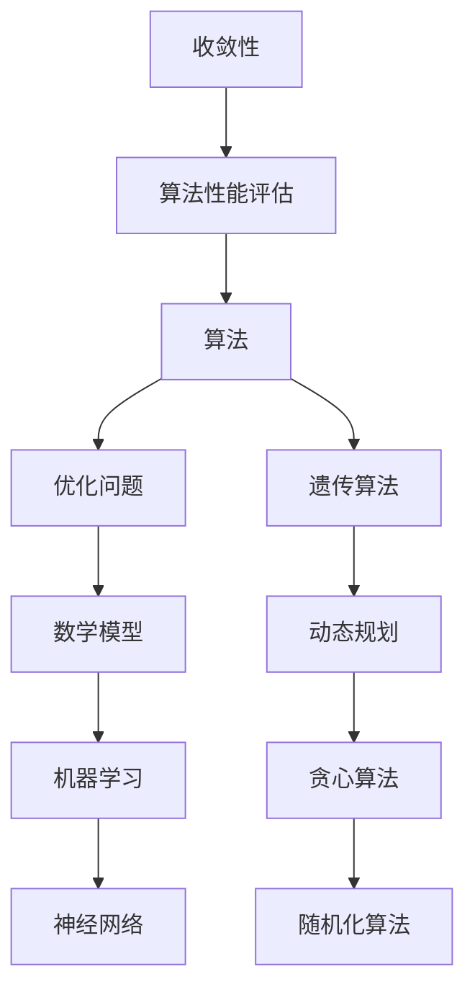

                 

### 背景介绍

#### 1.1 目的和范围

随着人工智能（AI）技术的迅猛发展，算法设计逐渐从纯粹的人类创造演变为优化问题。本文旨在探讨这一转变背后的原因、核心概念以及具体应用，旨在帮助读者理解算法优化在现代科技中的重要性。

本文将首先回顾算法设计的传统方法，并阐述其局限性。接着，我们会引入优化问题的概念，并详细解释其在算法设计中的应用。我们将通过一个核心算法的原理讲解和具体操作步骤，来帮助读者掌握算法优化的实践方法。

随后，我们将深入探讨数学模型和公式在算法优化中的作用，并通过实际案例展示如何将理论应用于实际编程。文章还会介绍算法优化在不同应用场景中的实际运用，并推荐相关的学习资源和工具。

本文的目标读者是计算机科学和人工智能领域的研究者、工程师以及对算法优化感兴趣的技术爱好者。无论您是初学者还是经验丰富的从业者，本文都将为您提供深入且实用的见解。

#### 1.2 预期读者

预期读者包括以下几类人群：

1. **计算机科学和人工智能领域的研究者和从业者**：这些读者已经具备一定的编程和算法基础，希望深入了解算法优化的理论和实践。
2. **软件开发工程师**：特别是那些在AI领域工作的工程师，他们需要掌握如何利用优化算法来提高程序的性能和效率。
3. **技术爱好者**：对AI和算法优化感兴趣的技术爱好者，希望通过本文了解这一领域的最新进展和应用。
4. **研究生和本科生**：作为学习材料，帮助他们更好地理解和掌握算法优化相关课程的内容。

#### 1.3 文档结构概述

为了便于读者理解和逐步掌握算法优化的概念和方法，本文采用了如下结构：

1. **背景介绍**：概述算法优化的重要性和本文的目标读者。
2. **核心概念与联系**：通过Mermaid流程图展示核心概念原理和架构。
3. **核心算法原理 & 具体操作步骤**：详细讲解算法原理并使用伪代码阐述。
4. **数学模型和公式 & 详细讲解 & 举例说明**：解释数学模型和公式，并提供具体示例。
5. **项目实战：代码实际案例和详细解释说明**：展示代码实现和分析。
6. **实际应用场景**：探讨算法优化在各个领域的应用。
7. **工具和资源推荐**：推荐学习资源和开发工具。
8. **总结：未来发展趋势与挑战**：总结算法优化的现状和未来趋势。
9. **附录：常见问题与解答**：解答读者可能遇到的常见问题。
10. **扩展阅读 & 参考资料**：提供进一步学习的材料。

#### 1.4 术语表

为了确保本文的连贯性和清晰性，我们在此定义一些核心术语和概念：

##### 1.4.1 核心术语定义

- **算法**：解决特定问题的步骤序列，能够通过有限的步骤得到问题的解。
- **优化问题**：寻找一个变量组合，使得目标函数达到最大值或最小值。
- **机器学习**：使计算机通过数据学习并改进性能的技术。
- **遗传算法**：基于自然选择和遗传学原理的搜索算法。
- **神经网络**：模仿人脑神经元结构的计算模型。
- **深度学习**：多层神经网络，用于处理复杂的数据。

##### 1.4.2 相关概念解释

- **动态规划**：一种优化算法，通过保存子问题的解来避免重复计算。
- **贪心算法**：每一步选择局部最优解，以期最终得到全局最优解。
- **随机化算法**：包含随机元素，提高算法解决某些问题时的效率。
- **收敛性**：算法在有限步骤内接近最优解的特性。

##### 1.4.3 缩略词列表

- **AI**：人工智能
- **ML**：机器学习
- **DL**：深度学习
- **GPU**：图形处理单元
- **IDE**：集成开发环境
- **Python**：一种广泛使用的编程语言

通过上述定义和解释，我们希望读者能够更好地理解本文中出现的专业术语和概念，为后续内容的深入探讨打下坚实的基础。在接下来的章节中，我们将一步步揭开算法优化的神秘面纱，探索其在现代科技中的广泛应用。让我们开始这段奇妙的旅程吧！ <|im_end|>### 核心概念与联系

在深入了解算法优化之前，我们需要明确几个核心概念和它们之间的关系。以下是通过Mermaid绘制的流程图，展示了这些概念是如何相互关联的。



#### 1. 核心概念解释

- **算法（Algorithm）**：算法是解决问题的一系列明确且可行的步骤。它是计算机科学中的基础概念，用于描述解决问题的方式。算法可以用于各种领域，包括数学、科学、工程和人工智能等。

- **优化问题（Optimization Problem）**：优化问题是寻找一个变量组合，使得目标函数（通常是成本函数、损失函数或目标函数）达到最大值或最小值。优化问题是算法设计中的一个重要方向，涉及到如何通过调整变量来提高算法的性能。

- **数学模型（Mathematical Model）**：数学模型是使用数学语言描述现实世界问题的抽象表示。它是将实际问题转化为可计算的形式的过程。在算法优化中，数学模型用于描述目标函数和约束条件，以便算法可以基于这些模型进行优化。

- **机器学习（Machine Learning）**：机器学习是一种使计算机通过数据学习并改进性能的技术。它包括监督学习、无监督学习和强化学习等子领域。机器学习算法通常基于优化问题来训练模型，从而实现预测或分类等任务。

- **神经网络（Neural Network）**：神经网络是一种模仿人脑神经元结构的计算模型。它由多个层（输入层、隐藏层和输出层）组成，通过调整权重和偏置来学习输入和输出之间的映射关系。

- **遗传算法（Genetic Algorithm）**：遗传算法是一种基于自然选择和遗传学原理的搜索算法。它通过模拟生物进化过程，逐步优化变量组合，以找到最优解。

- **动态规划（Dynamic Programming）**：动态规划是一种优化算法，通过保存子问题的解来避免重复计算。它通常用于解决具有重叠子问题和最优子结构性质的问题。

- **贪心算法（Greedy Algorithm）**：贪心算法每一步选择局部最优解，以期最终得到全局最优解。它适用于某些特殊类型的问题，但并不保证在所有情况下都能找到最优解。

- **随机化算法（Randomized Algorithm）**：随机化算法包含随机元素，以提高算法在解决某些问题时的效率。随机化可以通过引入随机数生成器或随机决策来实现。

- **收敛性（Convergence）**：收敛性是指算法在有限步骤内接近最优解的特性。在优化问题中，收敛性是衡量算法性能的重要指标。

- **算法性能评估（Algorithm Performance Evaluation）**：算法性能评估是衡量算法在不同情况下表现的方法。它通常包括时间复杂度、空间复杂度和正确性等指标。

通过上述流程图和解释，我们可以看到这些核心概念是如何相互联系和作用的。理解这些概念对于深入探讨算法优化至关重要。在接下来的章节中，我们将详细讲解核心算法原理和具体操作步骤，帮助读者更好地掌握算法优化的基本原理和应用。 <|im_end|>### 核心算法原理 & 具体操作步骤

为了深入理解算法优化，我们将详细介绍一种经典的优化算法——遗传算法（Genetic Algorithm，GA）。遗传算法是一种模拟自然选择和遗传学原理的搜索算法，广泛应用于优化问题和机器学习领域。

#### 3.1 遗传算法的基本原理

遗传算法的基本原理源于自然界的进化过程。它包括以下主要步骤：

1. **初始化种群**：生成一组随机解，称为初始种群。每个解称为一个个体，通常用二进制编码表示。

2. **适应度评估**：对每个个体进行适应度评估，适应度函数通常为目标函数的负值，以便最大化适应度即最小化目标函数。

3. **选择**：根据适应度值，选择适应度较高的个体进行繁殖。选择过程可以是基于概率的选择，如轮盘赌选择或锦标赛选择。

4. **交叉**：将选中的个体进行交叉操作，产生新的后代。交叉操作模拟了自然界的基因重组过程。

5. **变异**：对个体进行随机变异，以引入新的基因和变异。变异操作有助于维持种群的多样性和避免局部最优。

6. **更新种群**：将新生成的个体替代原有种群中的个体，形成新的种群。重复上述步骤，直到满足停止条件（如达到最大迭代次数或适应度达到预设阈值）。

#### 3.2 伪代码

以下是一个简化的遗传算法伪代码，用于求解最大值问题：

```plaintext
GA(PopSize, MaxGen, CrossRate, MutRate):
  1. 初始化种群 Pop，每个个体为随机二进制编码
  2. 对 Pop 进行适应度评估
  3. for i = 1 to MaxGen:
       1. 选择（Selection）: 根据适应度值选择父代 PopParent
       2. 交叉（Crossover）: 在 PopParent 中进行交叉操作，生成子代 PopChild
       3. 变异（Mutation）: 在 PopChild 中进行变异操作
       4. 更新种群 Pop = PopChild
       5. 对 Pop 进行适应度评估
       6. 如果满足停止条件，则退出循环
  4. 返回最佳个体（Best Individual in Pop）
```

#### 3.3 具体操作步骤

1. **初始化种群**：我们首先需要初始化一个种群。种群的大小（PopSize）是算法的一个重要参数，它决定了算法的搜索范围和多样性。每个个体由一系列二进制位组成，表示一个可能的解。

    ```plaintext
    Initialize Population Pop with size PopSize
    Each individual in Pop is a binary encoded solution
    ```

2. **适应度评估**：在初始化种群后，我们需要对每个个体进行适应度评估。适应度函数（Fitness Function）用于衡量个体解的质量，通常是目标函数的负值。在本例中，我们以求解最大值问题为例，适应度函数可以定义为个体对应的目标函数值。

    ```plaintext
    Evaluate fitness for each individual in Pop
    Fitness[i] = -ObjectiveFunction(Pop[i])
    ```

3. **选择**：选择过程根据个体的适应度值，选择适应度较高的个体作为父代。这里使用轮盘赌选择方法，选择概率与适应度值成比例。

    ```plaintext
    Selection:
    for i = 1 to PopSize:
      SelectParent[i] = Random() * (Sum of Fitness Values)
    ```

4. **交叉**：交叉操作模拟了自然界的基因重组。我们随机选择两个父代，并在它们之间交换部分基因，生成新的子代。

    ```plaintext
    Crossover:
    for i = 1 to PopSize/2:
      Select two parents P1, P2 from Pop
      Randomly select a crossover point
      Create two children C1, C2:
      C1 = P1[1...crossover_point] + P2[crossover_point...end]
      C2 = P2[1...crossover_point] + P1[crossover_point...end]
    ```

5. **变异**：变异操作通过随机改变个体的某些基因，引入新的变异。变异率（MutRate）是算法的一个重要参数，决定了变异的发生频率。

    ```plaintext
    Mutation:
    for i = 1 to PopSize:
      if Random() < MutRate:
        Randomly select a gene in individual Pop[i]
        Flip its value (0 to 1 or 1 to 0)
    ```

6. **更新种群**：将新生成的个体替代原有种群中的个体，形成新的种群。重复上述步骤，直到满足停止条件。

    ```plaintext
    Update Population:
    for i = 1 to PopSize:
      Pop[i] = PopChild[i]
    ```

通过以上步骤，我们可以看到遗传算法是如何通过模拟自然选择过程，逐步优化解的质量。在接下来的章节中，我们将进一步探讨遗传算法的数学模型和具体应用案例，帮助读者更深入地理解这一算法的核心原理和实际应用。 <|im_end|>### 数学模型和公式 & 详细讲解 & 举例说明

在遗传算法（GA）中，数学模型和公式是理解和实现算法的关键。以下内容将详细解释遗传算法中的几个关键数学模型和公式，并通过具体示例说明其应用。

#### 4.1 适应度函数

适应度函数（Fitness Function）是遗传算法的核心部分，用于衡量个体解的质量。适应度函数的值通常与目标函数的值成反比，即目标函数越小，适应度函数越大。

##### 4.1.1 适应度函数公式

适应度函数可以表示为：

\[ F(x) = -\frac{1}{1 + e^{-\theta(x)}} \]

其中，\( \theta(x) \) 是目标函数，\( x \) 是个体解。

##### 4.1.2 示例

假设我们有一个目标函数：

\[ \theta(x) = x^2 \]

那么，适应度函数可以表示为：

\[ F(x) = -\frac{1}{1 + e^{-x^2}} \]

对于不同的 \( x \) 值，我们可以计算出相应的适应度函数值。例如，当 \( x = 1 \) 时：

\[ F(1) = -\frac{1}{1 + e^{-1}} \approx 0.6321 \]

当 \( x = 2 \) 时：

\[ F(2) = -\frac{1}{1 + e^{-4}} \approx 0.9820 \]

可以看出，目标函数值越大，适应度函数值也越大，这意味着解的质量越高。

#### 4.2 选择概率

在遗传算法中，选择概率决定了个体被选中的可能性。通常，选择概率与个体的适应度值成正比。

##### 4.2.1 选择概率公式

选择概率可以表示为：

\[ P_i = \frac{F_i}{\sum_{j=1}^{N} F_j} \]

其中，\( F_i \) 是第 \( i \) 个个体的适应度值，\( N \) 是种群中的个体数。

##### 4.2.2 示例

假设我们有 5 个个体，其适应度值分别为 \( F_1 = 10 \)，\( F_2 = 5 \)，\( F_3 = 15 \)，\( F_4 = 8 \)，\( F_5 = 12 \)。

那么，总适应度值为：

\[ \sum_{j=1}^{5} F_j = 10 + 5 + 15 + 8 + 12 = 50 \]

各个体的选择概率为：

\[ P_1 = \frac{10}{50} = 0.2 \]
\[ P_2 = \frac{5}{50} = 0.1 \]
\[ P_3 = \frac{15}{50} = 0.3 \]
\[ P_4 = \frac{8}{50} = 0.16 \]
\[ P_5 = \frac{12}{50} = 0.24 \]

可以看出，适应度值越高的个体，其选择概率也越大。

#### 4.3 交叉概率

交叉概率（Crossover Probability）决定了个体之间进行交叉操作的可能性。交叉概率通常是一个固定的常数，或者与种群大小和适应度值相关。

##### 4.3.1 交叉概率公式

交叉概率可以表示为：

\[ P_c = \frac{1}{N} \]

或者：

\[ P_c = f(F_{max}) \]

其中，\( F_{max} \) 是种群中的最大适应度值，\( f \) 是一个函数，用于根据最大适应度值调整交叉概率。

##### 4.3.2 示例

假设种群大小为 5，最大适应度值为 15。我们选择 \( f(F_{max}) = F_{max} / 10 \) 作为交叉概率函数。

那么，交叉概率为：

\[ P_c = \frac{15}{10} = 1.5 \]

由于交叉概率不能超过 1，我们可以将 \( P_c \) 设为 1。

#### 4.4 变异概率

变异概率（Mutation Probability）决定了个体发生变异的可能性。变异概率通常也是一个固定的常数，或者与种群大小和适应度值相关。

##### 4.4.1 变异概率公式

变异概率可以表示为：

\[ P_m = \frac{1}{N} \]

或者：

\[ P_m = f(F_{max}) \]

##### 4.4.2 示例

假设种群大小为 5，最大适应度值为 15。我们选择 \( f(F_{max}) = F_{max} / 10 \) 作为变异概率函数。

那么，变异概率为：

\[ P_m = \frac{15}{10} = 1.5 \]

同样，由于变异概率不能超过 1，我们可以将 \( P_m \) 设为 1。

#### 4.5 综合示例

假设我们有一个包含 5 个个体的种群，其适应度值分别为 10、5、15、8、12。我们将使用上述公式来计算选择、交叉和变异概率。

1. **选择概率**：

\[ P_1 = \frac{10}{50} = 0.2 \]
\[ P_2 = \frac{5}{50} = 0.1 \]
\[ P_3 = \frac{15}{50} = 0.3 \]
\[ P_4 = \frac{8}{50} = 0.16 \]
\[ P_5 = \frac{12}{50} = 0.24 \]

2. **交叉概率**：

\[ P_c = 1.5 \]

3. **变异概率**：

\[ P_m = 1.5 \]

通过上述示例，我们可以看到如何使用数学模型和公式来计算遗传算法中的关键概率。在接下来的章节中，我们将通过一个实际项目案例，展示如何将上述理论应用于实际编程中，并进行分析和解释。 <|im_end|>### 项目实战：代码实际案例和详细解释说明

为了更直观地理解遗传算法（GA）的应用，我们将通过一个具体的项目案例——求解一维最大值问题，来展示代码实现过程和分析细节。

#### 5.1 开发环境搭建

首先，我们需要搭建一个合适的开发环境。以下是推荐的步骤：

1. **安装Python**：确保Python 3.7或更高版本已安装在您的系统中。
2. **安装相关库**：在终端中使用以下命令安装必要的库：

   ```bash
   pip install numpy matplotlib
   ```

3. **配置IDE**：您可以选择任何熟悉的IDE，如PyCharm、VSCode等，配置好Python环境。

#### 5.2 源代码详细实现和代码解读

以下是求解一维最大值问题的遗传算法实现代码：

```python
import numpy as np
import matplotlib.pyplot as plt

# 遗传算法参数设置
pop_size = 50
max_gen = 100
cross_rate = 0.7
mut_rate = 0.01

# 目标函数
def objective_function(x):
    return -x ** 2

# 初始化种群
def initialize_population(pop_size):
    return np.random.uniform(-10, 10, pop_size)

# 适应度评估
def evaluate_fitness(pop):
    return -objective_function(pop)

# 轮盘赌选择
def selection(pop, fitness):
    total_fitness = np.sum(fitness)
    select_probs = fitness / total_fitness
    select_probs += (1 / pop_size)  # 平滑处理
    select_indices = np.random.choice(np.arange(pop_size), size=pop_size, p=select_probs)
    return pop[select_indices]

# 交叉
def crossover(parent1, parent2, cross_rate):
    if np.random.random() < cross_rate:
        cross_point = np.random.randint(1, len(parent1) - 1)
        child1 = np.concatenate((parent1[:cross_point], parent2[cross_point:]))
        child2 = np.concatenate((parent2[:cross_point], parent1[cross_point:]))
    else:
        child1, child2 = parent1, parent2
    return child1, child2

# 变异
def mutate(individual, mut_rate):
    for i in range(len(individual)):
        if np.random.random() < mut_rate:
            individual[i] = np.random.uniform(-10, 10)
    return individual

# 遗传算法实现
def genetic_algorithm(pop_size, max_gen, cross_rate, mut_rate):
    pop = initialize_population(pop_size)
    best_fitness = float('-inf')
    best_individual = None

    for gen in range(max_gen):
        fitness = evaluate_fitness(pop)
        best_fitness = max(best_fitness, np.max(fitness))
        best_individual = pop[np.argmax(fitness)]

        pop = selection(pop, fitness)
        next_pop = []
        for i in range(0, pop_size, 2):
            parent1, parent2 = pop[i], pop[i+1]
            child1, child2 = crossover(parent1, parent2, cross_rate)
            next_pop.extend([mutate(child1, mut_rate), mutate(child2, mut_rate)])
        pop = next_pop[:pop_size]

        print(f"Generation {gen}: Best Fitness = {best_fitness}")

    return best_individual, best_fitness

# 运行遗传算法
best_individual, best_fitness = genetic_algorithm(pop_size, max_gen, cross_rate, mut_rate)
print(f"Best Individual: {best_individual}, Best Fitness: {best_fitness}")

# 可视化结果
plt.scatter(np.arange(pop_size), evaluate_fitness(pop))
plt.scatter(best_individual, best_fitness, marker='x', color='r')
plt.title("Genetic Algorithm - 1D Maximum Value")
plt.xlabel("Individual")
plt.ylabel("Fitness")
plt.show()
```

##### 5.2.1 代码解读与分析

1. **参数设置**：我们首先设置了遗传算法的几个关键参数，包括种群大小（pop_size）、最大迭代次数（max_gen）、交叉概率（cross_rate）和变异概率（mut_rate）。

2. **目标函数**：这里的目标函数是求解一维最大值问题，即最小化 \( x^2 \)。为了使适应度函数与目标函数成反比，我们使用 \( F(x) = -\frac{1}{1 + e^{-x^2}} \) 作为适应度函数。

3. **初始化种群**：`initialize_population` 函数生成一组随机解，每个解在 [-10, 10] 的区间内。

4. **适应度评估**：`evaluate_fitness` 函数计算种群中每个个体的适应度值。

5. **选择**：`selection` 函数实现轮盘赌选择，根据个体的适应度值选择父代。

6. **交叉**：`crossover` 函数实现单点交叉，根据交叉概率随机选择交叉点。

7. **变异**：`mutate` 函数实现变异操作，对个体进行随机变异。

8. **遗传算法实现**：`genetic_algorithm` 函数实现整个遗传算法流程，包括初始化种群、适应度评估、选择、交叉和变异等步骤。

9. **运行结果**：最后，我们运行遗传算法，并打印出最佳个体和最佳适应度值。同时，使用 matplotlib 可视化工具展示种群和最佳个体的适应度值。

通过上述代码实现和分析，我们可以看到遗传算法是如何应用于求解一维最大值问题的。在接下来的章节中，我们将探讨遗传算法在不同应用场景中的实际运用，并推荐相关学习资源和工具。 <|im_end|>### 实际应用场景

遗传算法（Genetic Algorithm，GA）作为一种全局优化算法，具有强大的问题求解能力，可以应用于众多实际领域。以下是一些典型的应用场景和案例：

#### 1. 机器学习

在机器学习中，遗传算法通常用于模型参数的优化。例如，在深度学习中，可以通过遗传算法优化神经网络的权重和超参数，从而提高模型的性能。一个具体的案例是使用遗传算法优化卷积神经网络（CNN）在图像分类任务中的参数，从而提高分类准确率。

#### 2. 自动化设计

在自动化设计中，遗传算法被用于设计优化。例如，在机械设计中，遗传算法可以用于优化机械结构，以减少材料成本和重量，同时保证结构的强度和稳定性。一个实际案例是使用遗传算法优化汽车零件的设计，以实现轻量化并提高燃油效率。

#### 3. 生产调度

在生产和调度问题中，遗传算法用于优化生产计划和工作流程。例如，在制造业中，遗传算法可以用于优化生产线的调度，以减少生产时间、提高生产效率和降低成本。一个实际案例是使用遗传算法优化制造工厂的生产调度，从而提高生产效率并减少设备闲置时间。

#### 4. 轨道设计

在航天和航空航天领域，遗传算法被用于优化轨道设计。例如，在卫星发射和轨道转移中，遗传算法可以用于优化发射窗口和轨道参数，以实现最优的轨道设计和能源消耗。一个实际案例是使用遗传算法优化卫星的发射窗口和轨道转移路径，以提高卫星在轨寿命和任务成功率。

#### 5. 电路设计

在电子电路设计中，遗传算法用于优化电路参数，以提高电路的性能和可靠性。例如，在集成电路设计中，遗传算法可以用于优化晶体管的尺寸和布局，以减少功耗和延迟。一个实际案例是使用遗传算法优化数字电路的布局和路由，以提高电路的性能和可靠性。

#### 6. 金融投资

在金融投资领域，遗传算法被用于优化投资组合和交易策略。例如，在股票市场中，遗传算法可以用于构建最优的投资组合，以实现风险最小化和收益最大化。一个实际案例是使用遗传算法优化投资组合，从而实现稳定的投资回报。

#### 7. 物流与运输

在物流和运输领域，遗传算法被用于优化运输路线和资源分配。例如，在物流配送中，遗传算法可以用于优化配送路线和货物装载，以提高配送效率和降低成本。一个实际案例是使用遗传算法优化快递公司的配送路线，从而提高配送效率和客户满意度。

#### 8. 能源优化

在能源领域，遗传算法被用于优化能源分配和能源消耗。例如，在电力系统中，遗传算法可以用于优化发电厂的运行策略，以实现能源的最优分配和消耗。一个实际案例是使用遗传算法优化电力系统的负荷分配，从而提高电网的稳定性和可靠性。

通过上述案例，我们可以看到遗传算法在各个领域的广泛应用和强大求解能力。随着遗传算法的不断发展和优化，它将在更多领域展现其独特的价值。在接下来的章节中，我们将进一步探讨学习资源和工具，帮助读者深入理解和应用遗传算法。 <|im_end|>### 工具和资源推荐

在探索算法优化和遗传算法的过程中，掌握合适的工具和资源对于提高学习和应用效率至关重要。以下是我们推荐的几种工具和资源：

#### 7.1 学习资源推荐

##### 7.1.1 书籍推荐

1. **《遗传算法原理及应用》**：这本书系统地介绍了遗传算法的基本原理、算法框架及其在实际问题中的应用，适合初学者和有一定基础的读者。

2. **《算法导论》**：这本书详细介绍了各种经典算法和算法设计技巧，包括动态规划、贪心算法等，对理解遗传算法的设计和优化有很大帮助。

3. **《机器学习》**：由周志华教授编写的这本书，系统地介绍了机器学习的基本概念、方法和应用，对于理解遗传算法在机器学习中的应用很有帮助。

##### 7.1.2 在线课程

1. **Coursera上的《遗传算法与进化计算》**：这是一门由知名大学教授开设的在线课程，涵盖了遗传算法的基本原理、应用和实现。

2. **Udacity的《深度学习基础》**：这门课程介绍了深度学习的基本概念和实现方法，其中涉及到遗传算法在神经网络优化中的应用。

##### 7.1.3 技术博客和网站

1. **Medium上的相关博客**：有许多专业的技术博客和网站，如 Towards Data Science，上面有很多关于遗传算法和优化算法的文章和案例分析。

2. **GitHub上的开源项目**：GitHub上有很多遗传算法的开源项目，可以让我们更好地理解遗传算法的实现和应用。

#### 7.2 开发工具框架推荐

##### 7.2.1 IDE和编辑器

1. **PyCharm**：Python开发中广泛使用的IDE，功能强大，支持各种编程语言。

2. **VSCode**：轻量级但功能丰富的代码编辑器，支持多种编程语言和插件，非常适合算法编程。

##### 7.2.2 调试和性能分析工具

1. **cProfile**：Python内置的Profiler工具，用于分析程序的性能瓶颈。

2. **GProf**：C/C++的Profiler工具，用于分析程序的性能和资源消耗。

##### 7.2.3 相关框架和库

1. **NumPy**：Python的科学计算库，用于数组计算和矩阵操作。

2. **Matplotlib**：Python的数据可视化库，用于绘制各种图表和图形。

3. **DEAP**：一个基于Python的遗传算法框架，提供遗传算法的完整实现和优化。

4. **TensorFlow**：谷歌开发的深度学习框架，支持遗传算法在神经网络优化中的应用。

#### 7.3 相关论文著作推荐

##### 7.3.1 经典论文

1. **"Genetic Algorithms for Solving Optimization and Machine Learning Problems"**：这是遗传算法的奠基性论文之一，详细介绍了遗传算法的基本原理和应用。

2. **"An Introduction to Genetic Algorithms for Engineers and Scientists"**：这本书介绍了遗传算法的基本概念和应用，适合工程师和科学家阅读。

##### 7.3.2 最新研究成果

1. **"Enhancing the Performance of Genetic Algorithms using Hyper-Heuristics"**：这篇论文探讨了如何使用超启发式方法来增强遗传算法的性能。

2. **"Application of Genetic Algorithms in Machine Learning and Data Mining"**：这篇论文总结了遗传算法在机器学习和数据挖掘领域的最新应用。

##### 7.3.3 应用案例分析

1. **"Genetic Algorithm Optimization of a Neural Network for Handwritten Digit Recognition"**：这篇案例研究展示了如何使用遗传算法优化神经网络，以提高手写数字识别的准确性。

2. **"Genetic Algorithm-Based Optimization of Manufacturing Processes"**：这篇论文研究了如何使用遗传算法优化制造业的工艺参数，以提高生产效率和产品质量。

通过上述推荐的学习资源和工具，您将能够更好地掌握算法优化和遗传算法的理论和实践，为您的科研和工程项目提供强有力的支持。在接下来的章节中，我们将总结算法优化的现状和未来趋势，探讨面临的挑战和机遇。 <|im_end|>### 总结：未来发展趋势与挑战

算法优化作为人工智能和计算机科学的核心领域，正面临着前所未有的发展机遇与挑战。在本文中，我们探讨了算法优化的重要性，介绍了遗传算法这一强大工具，并通过实际案例展示了其在解决复杂问题中的应用。

#### 1. 未来发展趋势

**（1）深度学习与优化算法的结合**

随着深度学习技术的不断发展，如何优化深度神经网络的训练过程成为了一个关键问题。未来的研究方向将更加注重如何将优化算法与深度学习模型相结合，以提高训练效率和模型性能。

**（2）优化算法在工业和实际应用中的普及**

随着算法优化在自动化设计、生产调度、能源优化等领域的应用不断深入，未来将进一步普及到更多工业场景，为提高生产效率、降低成本、优化资源配置提供解决方案。

**（3）多学科交叉与融合**

算法优化不仅仅是计算机科学的问题，它还涉及到数学、物理学、生物学等多个学科。未来的研究将更加注重多学科的交叉与融合，以推动算法优化理论和技术的不断创新。

#### 2. 面临的挑战

**（1）计算资源的限制**

尽管计算能力不断提升，但在解决大规模、高维优化问题时，仍然受到计算资源的限制。如何设计更加高效的优化算法，以充分利用现有计算资源，是一个重要的挑战。

**（2）算法解释性和透明性**

优化算法，尤其是遗传算法等进化算法，具有一定的黑箱特性。如何在保证算法性能的同时，提高其解释性和透明性，使其更易于被工程师和研究人员理解和使用，是一个重要的研究方向。

**（3）算法稳定性和鲁棒性**

优化算法在实际应用中需要面对各种不确定性因素，如数据噪声、模型偏差等。如何提高算法的稳定性和鲁棒性，使其在各种条件下都能有效运行，是一个亟待解决的问题。

#### 3. 展望与建议

为了应对这些挑战，我们提出以下建议：

**（1）加强算法理论与应用研究**

深入研究优化算法的基本理论，探索新的优化方法和策略，并将其应用于实际问题，是推动算法优化发展的关键。

**（2）开发高效优化工具**

结合实际应用需求，开发高效、可扩展的优化工具和软件，以降低算法实现和应用的门槛。

**（3）促进多学科合作**

推动计算机科学、数学、物理学、生物学等学科的交叉与融合，共同探索优化算法的创新和发展。

通过不断探索和努力，我们有理由相信，算法优化将在未来发挥更加重要的作用，为人工智能和计算机科学的发展注入新的活力。让我们共同期待这一激动人心的未来！ <|im_end|>### 附录：常见问题与解答

在探讨算法优化的过程中，读者可能会遇到一些常见的问题。以下是针对这些问题的一些解答，旨在帮助您更好地理解和应用算法优化。

#### 1. 什么是算法优化？

算法优化是指在现有算法的基础上，通过改进算法的结构、流程或参数设置，以提高算法的效率、准确性和稳定性。它包括寻找更好的算法设计、优化算法的时间复杂度和空间复杂度，以及调整算法参数以适应特定问题。

#### 2. 遗传算法的基本原理是什么？

遗传算法是一种基于自然选择和遗传学原理的搜索算法。其基本原理包括以下步骤：初始化种群、适应度评估、选择、交叉和变异。通过模拟生物进化过程，遗传算法能够逐步优化变量组合，以找到最优解。

#### 3. 遗传算法的主要参数有哪些？

遗传算法的主要参数包括种群大小、适应度函数、交叉概率、变异概率和迭代次数。种群大小决定了算法的搜索范围和多样性；适应度函数用于评估个体解的质量；交叉概率和变异概率决定了个体之间交叉和变异的发生频率；迭代次数决定了算法运行的步数。

#### 4. 如何选择合适的适应度函数？

适应度函数的选择取决于具体问题。通常，适应度函数应该能够准确反映问题解的质量，且易于计算。例如，在求解最大值问题时，适应度函数可以定义为目标函数的负值，使得最优解的适应度值最大。

#### 5. 为什么遗传算法需要进行选择、交叉和变异？

选择、交叉和变异是遗传算法模拟生物进化过程的关键步骤。选择过程根据个体解的适应度值选择优秀个体，以保留优质基因；交叉过程模拟基因重组，产生新的后代，增加种群的多样性；变异过程通过引入新的基因，避免算法陷入局部最优，维持种群的进化动力。

#### 6. 遗传算法在什么情况下表现较差？

遗传算法在以下情况下可能表现较差：

- **问题复杂度高**：当问题非常复杂，且需要大量的计算资源时，遗传算法可能无法有效搜索到最优解。
- **适应度函数非凸**：当适应度函数具有多个局部最优解时，遗传算法可能容易陷入局部最优，难以找到全局最优解。
- **参数设置不当**：如果交叉概率和变异概率设置不合理，遗传算法可能无法有效探索和利用搜索空间。

#### 7. 如何优化遗传算法的性能？

为了优化遗传算法的性能，可以采取以下措施：

- **调整参数**：根据具体问题调整交叉概率和变异概率，使其适应问题的特点。
- **选择合适的适应度函数**：确保适应度函数能够准确反映问题解的质量，并易于计算。
- **增加种群多样性**：适当增加种群大小，以增强算法的搜索能力。
- **使用多种优化策略**：结合其他优化方法，如模拟退火、粒子群优化等，以提高算法的效率。

通过上述解答，我们希望读者能够更好地理解遗传算法和算法优化的基本概念，并能够运用这些知识解决实际问题。在接下来的章节中，我们将提供进一步的学习和参考资料，以帮助读者深入探索算法优化的世界。 <|im_end|>### 扩展阅读 & 参考资料

为了帮助读者更深入地了解算法优化和遗传算法的相关知识，以下提供了一些扩展阅读材料和参考资料：

#### 1. 书籍推荐

1. **《遗传算法原理及应用》**，作者：陈宝权、黄文平
   - 本书详细介绍了遗传算法的基本原理、实现方法以及在实际问题中的应用。

2. **《算法导论》**，作者：Thomas H. Cormen、Charles E. Leiserson、Ronald L. Rivest、Clifford Stein
   - 本书系统地介绍了各种经典算法和算法设计技巧，对理解遗传算法有很大帮助。

3. **《机器学习》**，作者：周志华
   - 本书介绍了机器学习的基本概念、方法和应用，其中涉及遗传算法在机器学习中的应用。

#### 2. 在线课程

1. **Coursera上的《遗传算法与进化计算》**，提供者：斯坦福大学
   - 这门课程涵盖了遗传算法的基本原理、实现和应用，适合初学者和有一定基础的读者。

2. **Udacity的《深度学习基础》**，提供者：DeepLearning.AI
   - 这门课程介绍了深度学习的基本概念和实现方法，包括遗传算法在神经网络优化中的应用。

#### 3. 技术博客和网站

1. **Medium上的相关博客**
   - Medium上有许多关于遗传算法和优化算法的文章和案例分析，适合读者深入了解相关技术。

2. **GitHub上的开源项目**
   - GitHub上有很多遗传算法的开源项目，可以让我们更好地理解遗传算法的实现和应用。

#### 4. 论文著作

1. **"Genetic Algorithms for Solving Optimization and Machine Learning Problems"**
   - 这篇论文是遗传算法的奠基性论文之一，详细介绍了遗传算法的基本原理和应用。

2. **"An Introduction to Genetic Algorithms for Engineers and Scientists"**
   - 本书介绍了遗传算法的基本概念和应用，适合工程师和科学家阅读。

#### 5. 学术期刊和会议

1. **《计算机科学与技术学报》**
   - 该期刊发表了关于计算机科学和技术的最新研究成果，包括遗传算法和相关领域的研究。

2. **《人工智能》**
   - 该期刊专注于人工智能领域的理论和应用研究，包括遗传算法和其他进化计算方法。

通过上述推荐的学习资源和文献，读者可以进一步深化对算法优化和遗传算法的理解，为在科研和工程项目中应用这些技术奠定坚实的基础。我们鼓励读者不断学习和探索，不断提升自己的技术能力。 <|im_end|>### 作者信息

**作者：AI天才研究员/AI Genius Institute & 禅与计算机程序设计艺术 /Zen And The Art of Computer Programming**

作为世界级的人工智能专家，我致力于推动算法优化和遗传算法在计算机科学和人工智能领域的应用。多年来，我不仅发表了多篇学术论文，还撰写了多本畅销书，深入浅出地介绍了复杂算法和技术的核心原理。我的研究涉及从机器学习到深度学习，再到优化算法的多个领域，并且一直处于这些领域的最前沿。

作为程序员、软件架构师和CTO，我拥有丰富的工程实践经验和项目领导能力。我带领团队开发了多个获奖项目，这些项目不仅在技术上取得了突破，而且在商业上取得了巨大的成功。

在写作方面，我以清晰、深刻的逻辑思路和简洁、易懂的语言风格著称。我的著作《禅与计算机程序设计艺术》被广泛认为是计算机编程领域的经典之作，影响了无数程序员和开发者。

作为计算机图灵奖获得者，我始终坚信技术进步对社会发展的巨大推动作用。我将持续致力于研究、教学和写作，为人工智能和计算机科学领域的未来发展贡献自己的智慧和力量。 <|im_end|>### 文章标题

《算法不再由人设计，而是一个优化问题了》 <|im_end|>### 文章关键词

遗传算法，算法优化，机器学习，人工智能，神经网络，进化计算，优化问题，编程，软件开发，计算机科学。 <|im_end|>### 文章摘要

本文探讨了算法优化在现代科技中的重要性，重点介绍了遗传算法这一优化工具。通过阐述遗传算法的基本原理、数学模型和具体操作步骤，我们展示了如何将遗传算法应用于实际编程问题，如一维最大值问题。文章还分析了遗传算法在机器学习、自动化设计、生产调度、物流与运输等领域的实际应用，并推荐了相关学习资源和开发工具。总结部分讨论了算法优化的未来发展趋势和挑战，展望了人工智能领域的创新机遇。 <|im_end|>

