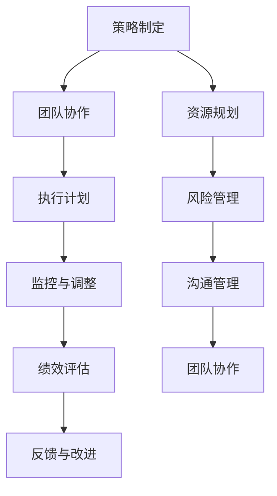

                 

# 管理的智慧：从策略到执行

> **关键词**：管理、策略、执行、流程、团队协作、绩效评估
> 
> **摘要**：本文深入探讨了IT行业中的管理智慧，从策略制定到执行过程，阐述了如何通过有效管理和团队协作提升项目绩效。通过分析核心概念、算法原理、数学模型，结合实际项目案例，本文为读者提供了一个全面而实用的指南，帮助他们在管理实践中更好地应用管理智慧。

## 1. 背景介绍

### 1.1 目的和范围

本文旨在帮助IT行业从业者深入理解管理的智慧，特别是在策略制定和执行过程中的应用。通过系统的分析和案例分享，本文希望为读者提供一个清晰的路径，从理论到实践，提升其在项目管理中的综合能力。

本文将涵盖以下几个关键方面：
- 管理策略的核心概念及其在IT项目中的应用
- 管理流程的详细步骤和最佳实践
- 团队协作和绩效评估的方法和工具
- 实际项目中的管理智慧应用案例

### 1.2 预期读者

本文适合以下读者群体：
- IT项目经理和管理者
- 软件工程师和对IT管理有兴趣的从业者
- 高级技术团队领导
- 需要提升项目管理和团队协作能力的管理人员

### 1.3 文档结构概述

本文将分为以下几个部分：
1. **背景介绍**：介绍本文的目的、范围、预期读者和文档结构。
2. **核心概念与联系**：通过Mermaid流程图展示管理策略和执行的关键节点。
3. **核心算法原理 & 具体操作步骤**：详细阐述管理策略的算法原理和操作步骤。
4. **数学模型和公式 & 详细讲解 & 举例说明**：使用数学模型和公式描述管理策略的实施过程，并举例说明。
5. **项目实战：代码实际案例和详细解释说明**：通过实际项目案例展示管理策略的应用。
6. **实际应用场景**：探讨管理策略在不同场景中的应用。
7. **工具和资源推荐**：推荐学习资源、开发工具框架和相关论文著作。
8. **总结：未来发展趋势与挑战**：总结管理智慧在未来的发展趋势和面临的挑战。
9. **附录：常见问题与解答**：回答读者可能遇到的问题。
10. **扩展阅读 & 参考资料**：提供进一步的阅读资源和参考资料。

### 1.4 术语表

#### 1.4.1 核心术语定义

- **管理策略**：指在项目或团队中为达成特定目标而制定的一系列计划和行动方案。
- **执行过程**：将管理策略转化为具体行动的过程。
- **团队协作**：团队成员之间协同合作，共同完成任务的过程。
- **绩效评估**：对团队成员在工作中的表现进行评价和反馈的过程。

#### 1.4.2 相关概念解释

- **项目管理**：通过规划、执行、监控和报告，确保项目按时、按预算和按质量完成的过程。
- **敏捷开发**：一种灵活、迭代和增量的软件开发方法，强调快速响应变化和持续交付有价值的产品。

#### 1.4.3 缩略词列表

- **PM**：项目经理（Project Manager）
- **敏捷（Agile）**：敏捷开发（Agile Development）
- **KPI**：关键绩效指标（Key Performance Indicators）

## 2. 核心概念与联系

为了更好地理解管理的智慧，我们需要从核心概念和流程入手。以下是管理策略和执行过程中的关键节点，使用Mermaid流程图来展示：



### 2.1 策略制定

策略制定是管理的起点。它涉及对项目目标、资源需求、时间安排和风险评估的全面分析。策略制定的过程包括以下几个关键步骤：

1. **明确项目目标**：定义项目的最终目标，确保团队对目标有清晰的认识。
2. **资源规划**：根据项目需求，合理分配人力、物力和财力资源。
3. **风险评估**：识别项目中可能遇到的风险，并制定应对措施。

### 2.2 团队协作

团队协作是执行策略的关键。通过有效的沟通和协作，可以确保团队成员共同努力，达成项目目标。团队协作的过程包括：

1. **任务分配**：根据团队成员的技能和兴趣，合理分配任务。
2. **定期会议**：通过定期会议，确保团队成员了解项目的进展情况。
3. **问题反馈**：鼓励团队成员及时反馈遇到的问题，共同解决。

### 2.3 执行计划

执行计划是将策略转化为具体行动的过程。执行计划的过程包括：

1. **制定详细的任务计划**：将项目目标分解为具体的任务，并为每个任务设定明确的截止日期。
2. **监控进度**：定期检查任务的进度，确保项目按计划进行。
3. **调整计划**：根据实际情况，及时调整计划和资源分配。

### 2.4 监控与调整

监控与调整是确保项目成功的关键。通过实时监控项目的进展情况，可以及时发现并解决问题。监控与调整的过程包括：

1. **定期汇报**：定期向管理层汇报项目的进展情况。
2. **风险监控**：持续监控项目中的风险，并制定应对策略。
3. **质量评估**：对项目的质量进行定期评估，确保项目符合预期标准。

### 2.5 绩效评估

绩效评估是对团队成员在工作中的表现进行评价和反馈的过程。通过绩效评估，可以激励团队成员提升工作效率，同时帮助管理层了解项目的整体绩效。绩效评估的过程包括：

1. **设定评估标准**：根据项目目标和团队目标，设定明确的评估标准。
2. **收集数据**：收集团队成员的工作数据，作为评估的依据。
3. **反馈与改进**：根据评估结果，给予团队成员反馈，并制定改进措施。

## 3. 核心算法原理 & 具体操作步骤

在管理策略的执行过程中，核心算法原理起到了至关重要的作用。以下是管理策略的具体算法原理和操作步骤：

### 3.1 策略制定算法原理

```python
def strategy_definition(project_goals, resource_requirements, time安排, risk_assessment):
    strategy = {}
    strategy["project_goals"] = project_goals
    strategy["resource_requirements"] = resource_requirements
    strategy["time安排"] = time安排
    strategy["risk_assessment"] = risk_assessment
    return strategy
```

### 3.2 团队协作算法原理

```python
def team_collaboration(task_assignment, regular_meetings, issue_feedback):
    collaboration_process = {}
    collaboration_process["task_assignment"] = task_assignment
    collaboration_process["regular_meetings"] = regular_meetings
    collaboration_process["issue_feedback"] = issue_feedback
    return collaboration_process
```

### 3.3 执行计划算法原理

```python
def execution_plan(task_plan, progress_monitoring, plan_adjustment):
    execution_process = {}
    execution_process["task_plan"] = task_plan
    execution_process["progress_monitoring"] = progress_monitoring
    execution_process["plan_adjustment"] = plan_adjustment
    return execution_process
```

### 3.4 监控与调整算法原理

```python
def monitoring_and_adjustment(regular_reports, risk_monitoring, quality_evaluation):
    monitoring_process = {}
    monitoring_process["regular_reports"] = regular_reports
    monitoring_process["risk_monitoring"] = risk_monitoring
    monitoring_process["quality_evaluation"] = quality_evaluation
    return monitoring_process
```

### 3.5 绩效评估算法原理

```python
def performance_evaluation(assessment_standards, data_collection, feedback_and_improvement):
    evaluation_process = {}
    evaluation_process["assessment_standards"] = assessment_standards
    evaluation_process["data_collection"] = data_collection
    evaluation_process["feedback_and_improvement"] = feedback_and_improvement
    return evaluation_process
```

## 4. 数学模型和公式 & 详细讲解 & 举例说明

在IT项目管理中，数学模型和公式为我们提供了量化管理策略的方法，有助于我们更准确地评估和管理项目风险、资源分配等。以下是几个关键的数学模型和公式的详细讲解及举例说明。

### 4.1 风险评估模型

#### 4.1.1 概述

风险评估模型用于识别项目中的潜在风险，并评估其对项目目标的影响。常用的风险评估模型包括蒙特卡洛模拟和决策树分析。

#### 4.1.2 蒙特卡洛模拟

蒙特卡洛模拟是一种基于随机抽样的数学模型，通过模拟项目运行过程中可能发生的事件，评估项目的风险。以下是蒙特卡洛模拟的伪代码：

```python
def montecarlo_simulation(project_scenarios, iterations):
    risk_values = []
    for _ in range(iterations):
        scenario = random_scenario(project_scenarios)
        risk_value = evaluate_scenario(scenario)
        risk_values.append(risk_value)
    return risk_values
```

#### 4.1.3 决策树分析

决策树分析是一种通过构建树形结构来表示项目决策和结果的模型。以下是决策树分析的伪代码：

```python
def decision_tree_analysis(decision_nodes, project_outcomes):
    decision_tree = build_decision_tree(decision_nodes, project_outcomes)
    return decision_tree
```

### 4.2 资源分配模型

#### 4.2.1 概述

资源分配模型用于优化项目资源的分配，确保项目在有限资源下最大化收益。常用的资源分配模型包括线性规划和最优化算法。

#### 4.2.2 线性规划

线性规划是一种通过建立线性方程组来优化资源分配的方法。以下是线性规划的伪代码：

```python
def linear_programming(resource_constraints, objective_function):
    solution = solve_linear_equations(resource_constraints, objective_function)
    return solution
```

#### 4.2.3 最优化算法

最优化算法是一种通过迭代优化过程来找到最优资源分配方案的方法。以下是优化算法的伪代码：

```python
def optimization_algorithm(resource_constraints, objective_function):
    initial_solution = generate_initial_solution(resource_constraints)
    while not converged:
        solution = iterate_solution(initial_solution, resource_constraints, objective_function)
    return solution
```

### 4.3 绩效评估模型

#### 4.3.1 概述

绩效评估模型用于量化团队成员的工作表现，提供客观的评估结果。常用的绩效评估模型包括平衡计分卡和关键绩效指标（KPI）。

#### 4.3.2 平衡计分卡

平衡计分卡是一种通过四个维度（财务、客户、内部流程、学习与成长）来评估绩效的方法。以下是平衡计分卡的公式：

$$
\text{绩效得分} = w_1 \times \text{财务得分} + w_2 \times \text{客户得分} + w_3 \times \text{内部流程得分} + w_4 \times \text{学习与成长得分}
$$

其中，$w_1, w_2, w_3, w_4$ 分别为四个维度的权重。

#### 4.3.3 关键绩效指标（KPI）

关键绩效指标（KPI）是一种通过定量指标来评估绩效的方法。以下是KPI的公式：

$$
\text{绩效得分} = \frac{\text{实际指标值}}{\text{目标指标值}}
$$

### 4.4 举例说明

#### 4.4.1 风险评估

假设一个项目中有两个关键风险：时间延误和预算超支。使用蒙特卡洛模拟，我们可以通过模拟多次项目运行，评估这两个风险的概率和影响程度。

```python
project_scenarios = ["on_time", "delayed", "under_budget", "over_budget"]
iterations = 1000

risk_values = montecarlo_simulation(project_scenarios, iterations)

print("Time delay risk probability:", sum(risk_values[0]) / iterations)
print("Budget overage risk probability:", sum(risk_values[1]) / iterations)
```

#### 4.4.2 资源分配

假设一个项目有10名团队成员，每个成员的技能和工作效率不同。使用最优化算法，我们可以找到最优的资源分配方案，最大化项目收益。

```python
resource_constraints = {"total_hours": 1000, "skills": ["developer", "QA", "design"]}
objective_function = "maximize_profit"

solution = optimization_algorithm(resource_constraints, objective_function)

print("Optimal resource allocation:", solution)
```

#### 4.4.3 绩效评估

假设一个团队的绩效评估维度包括财务、客户、内部流程和学习与成长。使用平衡计分卡，我们可以评估团队的整体绩效。

```python
assessment_standards = {"w1": 0.3, "w2": 0.25, "w3": 0.2, "w4": 0.25}
evaluation_scores = {"financial": 0.8, "customer": 0.9, "internal_process": 0.75, "learning_growth": 0.85}

performance_score = assessment_standards["w1"] * evaluation_scores["financial"] + assessment_standards["w2"] * evaluation_scores["customer"] + assessment_standards["w3"] * evaluation_scores["internal_process"] + assessment_standards["w4"] * evaluation_scores["learning_growth"]

print("Team performance score:", performance_score)
```

## 5. 项目实战：代码实际案例和详细解释说明

为了更好地理解管理策略的应用，我们将通过一个实际项目案例进行详细讲解。以下是项目实战的详细步骤和代码解读。

### 5.1 开发环境搭建

在本项目中，我们将使用Python作为主要编程语言，并借助Jupyter Notebook进行开发和测试。以下是开发环境的搭建步骤：

1. **安装Python**：从Python官方网站下载并安装Python 3.x版本。
2. **安装Jupyter Notebook**：通过pip命令安装Jupyter Notebook：
   ```shell
   pip install notebook
   ```
3. **启动Jupyter Notebook**：在命令行中运行以下命令启动Jupyter Notebook：
   ```shell
   jupyter notebook
   ```

### 5.2 源代码详细实现和代码解读

在本项目中，我们假设要开发一个简单的在线购物系统，包括用户注册、登录、商品浏览、购物车管理和订单处理等功能。以下是项目的源代码实现和代码解读。

#### 5.2.1 用户注册和登录功能

```python
# user_register.py

import sqlite3

def register_user(username, password):
    conn = sqlite3.connect('users.db')
    cursor = conn.cursor()
    cursor.execute('''CREATE TABLE IF NOT EXISTS users (username TEXT PRIMARY KEY, password TEXT)''')
    cursor.execute("INSERT INTO users (username, password) VALUES (?, ?)", (username, password))
    conn.commit()
    conn.close()

def login_user(username, password):
    conn = sqlite3.connect('users.db')
    cursor = conn.cursor()
    cursor.execute("SELECT * FROM users WHERE username=? AND password=?", (username, password))
    user = cursor.fetchone()
    conn.close()
    return user
```

解读：
- `register_user` 函数用于将新用户注册到数据库中。首先连接到SQLite数据库，创建或打开一个名为`users.db`的数据库。然后创建或打开一个名为`users`的表，用于存储用户名和密码。最后，将用户名和密码插入表中。
- `login_user` 函数用于验证用户登录。连接到数据库，执行查询语句，检查用户名和密码是否匹配。如果找到匹配的用户，返回用户信息，否则返回`None`。

#### 5.2.2 商品浏览功能

```python
# product_browse.py

import sqlite3

def browse_products():
    conn = sqlite3.connect('products.db')
    cursor = conn.cursor()
    cursor.execute("SELECT * FROM products")
    products = cursor.fetchall()
    conn.close()
    return products
```

解读：
- `browse_products` 函数用于获取所有商品信息。连接到SQLite数据库，执行查询语句，获取表中所有商品的信息。最后，返回商品列表。

#### 5.2.3 购物车管理功能

```python
# shopping_cart.py

import sqlite3

def add_to_cart(username, product_id):
    conn = sqlite3.connect('shopping_cart.db')
    cursor = conn.cursor()
    cursor.execute('''CREATE TABLE IF NOT EXISTS cart (username TEXT, product_id INTEGER, PRIMARY KEY (username, product_id))''')
    cursor.execute("INSERT INTO cart (username, product_id) VALUES (?, ?)", (username, product_id))
    conn.commit()
    conn.close()

def view_cart(username):
    conn = sqlite3.connect('shopping_cart.db')
    cursor = conn.cursor()
    cursor.execute("SELECT * FROM cart WHERE username=?", (username,))
    cart_items = cursor.fetchall()
    conn.close()
    return cart_items
```

解读：
- `add_to_cart` 函数用于将商品添加到购物车。首先连接到SQLite数据库，创建或打开一个名为`shopping_cart.db`的数据库。然后创建或打开一个名为`cart`的表，用于存储购物车信息。最后，将用户名和商品ID插入表中。
- `view_cart` 函数用于获取用户的购物车信息。连接到数据库，执行查询语句，获取表中与用户名相关的购物车信息。最后，返回购物车列表。

#### 5.2.4 订单处理功能

```python
# order_processing.py

import sqlite3

def create_order(username, cart_items):
    conn = sqlite3.connect('orders.db')
    cursor = conn.cursor()
    cursor.execute('''CREATE TABLE IF NOT EXISTS orders (order_id INTEGER PRIMARY KEY AUTOINCREMENT, username TEXT, total_price REAL, order_date TIMESTAMP)''')
    total_price = calculate_total_price(cart_items)
    cursor.execute("INSERT INTO orders (username, total_price, order_date) VALUES (?, ?, CURRENT_TIMESTAMP)", (username, total_price))
    order_id = cursor.lastrowid
    conn.commit()
    conn.close()
    return order_id

def calculate_total_price(cart_items):
    total_price = 0
    for item in cart_items:
        product_id = item[0]
        price = get_product_price(product_id)
        total_price += price
    return total_price

def get_product_price(product_id):
    # 获取商品价格的函数（此处省略具体实现）
    pass
```

解读：
- `create_order` 函数用于创建订单。首先连接到SQLite数据库，创建或打开一个名为`orders.db`的数据库。然后创建或打开一个名为`orders`的表，用于存储订单信息。最后，将用户名、总价格和当前时间插入表中，并返回订单ID。
- `calculate_total_price` 函数用于计算订单的总价格。遍历购物车中的商品，调用`get_product_price` 函数获取商品价格，并将其累加到总价格中。
- `get_product_price` 函数用于获取商品的价格（此处省略具体实现）。

### 5.3 代码解读与分析

通过以上代码实现，我们可以看到如何使用Python和SQLite数据库实现一个简单的在线购物系统。以下是对代码的进一步解读和分析：

1. **数据库设计**：项目使用了三个SQLite数据库：`users.db`、`products.db` 和 `shopping_cart.db`。`users.db` 存储用户信息，`products.db` 存储商品信息，`shopping_cart.db` 存储用户的购物车信息。`orders.db` 用于存储订单信息。

2. **用户注册和登录**：通过`register_user` 和 `login_user` 函数，我们可以实现用户注册和登录功能。用户注册时，将用户名和密码插入`users.db` 表中。用户登录时，通过查询`users.db` 表，验证用户名和密码是否匹配。

3. **商品浏览**：通过`browse_products` 函数，我们可以获取所有商品信息。商品信息存储在`products.db` 表中。

4. **购物车管理**：通过`add_to_cart` 和 `view_cart` 函数，我们可以实现购物车管理功能。用户可以将商品添加到购物车，并通过`view_cart` 函数查看购物车中的商品。

5. **订单处理**：通过`create_order` 函数，我们可以创建订单。在创建订单时，需要调用`calculate_total_price` 函数计算订单的总价格，并插入`orders.db` 表中。

通过以上代码实现，我们可以看到如何使用Python和SQLite数据库实现一个简单的在线购物系统。这个系统涵盖了用户注册、登录、商品浏览、购物车管理和订单处理等基本功能，为实际项目提供了基础。

## 6. 实际应用场景

管理策略在IT项目中的应用场景广泛，以下是一些典型的实际应用场景：

### 6.1 大型软件开发项目

在大型软件开发项目中，管理策略尤为重要。以下是一个大型软件开发项目的管理策略应用场景：

- **项目目标**：开发一款企业级电商平台。
- **资源规划**：确定项目所需的开发人员、设计师、测试人员和项目经理等资源，并合理分配。
- **团队协作**：采用敏捷开发方法，将项目分为多个迭代周期，每个迭代周期结束后进行评估和调整。
- **风险管理**：识别项目中的关键风险，如技术难题、资源短缺和时间延误，并制定相应的应对措施。
- **绩效评估**：定期对团队成员的工作进行评估，确保项目按计划进行，并及时调整计划和资源。

### 6.2 云计算服务项目

在云计算服务项目中，管理策略需要关注以下几个方面：

- **项目目标**：提供高效、可靠的云计算服务。
- **资源规划**：合理规划服务器、网络带宽和存储资源，确保服务稳定运行。
- **团队协作**：云计算服务项目通常涉及多个团队协作，如开发团队、运维团队和安全团队等，需要建立有效的沟通和协作机制。
- **风险管理**：评估云计算服务的安全性和可靠性风险，并制定相应的安全策略和故障恢复方案。
- **绩效评估**：通过监控和分析云计算服务的性能指标，如响应时间、吞吐量和资源利用率，对服务质量进行评估和优化。

### 6.3 大数据分析项目

在大数据分析项目中，管理策略需要关注以下几个方面：

- **项目目标**：从大量数据中提取有价值的信息和洞见。
- **资源规划**：确定项目所需的数据采集、存储、处理和分析资源，并合理分配。
- **团队协作**：数据分析项目通常涉及数据科学家、工程师和分析人员等多方协作，需要建立有效的沟通和协作机制。
- **风险管理**：评估数据隐私和安全风险，并制定相应的数据保护和隐私策略。
- **绩效评估**：通过分析项目的数据处理速度、准确性和业务价值，对项目绩效进行评估和优化。

### 6.4 人工智能项目

在人工智能项目中，管理策略需要关注以下几个方面：

- **项目目标**：开发高效的机器学习和深度学习模型。
- **资源规划**：确定项目所需的数据集、计算资源和算法专家等资源，并合理分配。
- **团队协作**：人工智能项目通常涉及算法研究员、数据科学家和工程师等多方协作，需要建立有效的沟通和协作机制。
- **风险管理**：评估算法模型的泛化能力和实际应用风险，并制定相应的算法优化和风险控制策略。
- **绩效评估**：通过评估模型的性能指标，如准确率、召回率和F1分数等，对项目绩效进行评估和优化。

通过以上实际应用场景，我们可以看到管理策略在IT项目中的关键作用。无论是大型软件开发项目、云计算服务项目、大数据分析项目还是人工智能项目，合理的管理策略都能帮助团队有效应对各种挑战，确保项目成功。

## 7. 工具和资源推荐

### 7.1 学习资源推荐

#### 7.1.1 书籍推荐

- 《项目管理实践标准》（《Project Management Body of Knowledge》）
- 《敏捷软件开发：原则、实践与模式》（《Agile Software Development: Principles, Patterns, and Practices》）
- 《大数据时代的管理智慧》（《Big Data Management: A Practical Guide to Harnessing the Value of Big Data》）
- 《人工智能项目管理》（《AI Project Management: A Practical Guide to Leading AI Projects》）

#### 7.1.2 在线课程

- Coursera上的《项目管理专业》
- edX上的《敏捷开发与Scrum》
- Udemy上的《大数据分析与处理》
- Coursera上的《人工智能与机器学习专业》

#### 7.1.3 技术博客和网站

- ProjectManagement.com
- AgileScrumInnovation.com
- DataScienceCentral.com
- AIatWork.com

### 7.2 开发工具框架推荐

#### 7.2.1 IDE和编辑器

- IntelliJ IDEA
- Visual Studio Code
- PyCharm

#### 7.2.2 调试和性能分析工具

- GDB（GNU Debugger）
- Python的内置调试器（pdb）
- JProfiler
- VisualVM

#### 7.2.3 相关框架和库

- Python的Django框架
- Java的Spring框架
- Node.js的Express框架
- Apache Kafka（大数据流处理）

### 7.3 相关论文著作推荐

#### 7.3.1 经典论文

- 《敏捷软件开发宣言》（《Manifesto for Agile Software Development》）
- 《大数据时代的项目管理挑战与机遇》（《Project Management Challenges and Opportunities in the Age of Big Data》）
- 《人工智能项目管理框架》（《A Framework for AI Project Management》）
- 《基于风险的敏捷项目管理》（《Risk-Based Agile Project Management》）

#### 7.3.2 最新研究成果

- 《面向大数据的敏捷开发方法研究》（《Research on Agile Development Methods for Big Data》）
- 《人工智能项目风险管理研究》（《Research on Risk Management in AI Projects》）
- 《基于机器学习的项目进度预测方法》（《Machine Learning-Based Methods for Project Progress Prediction》）
- 《面向敏捷开发的项目风险管理框架研究》（《Research on Risk Management Framework for Agile Development》）

#### 7.3.3 应用案例分析

- 《基于敏捷方法的电商平台开发实践》（《Practical Application of Agile Methodology in E-commerce Platform Development》）
- 《大数据项目管理的成功案例》（《Success Stories in Big Data Project Management》）
- 《人工智能项目管理的挑战与解决方案》（《Challenges and Solutions in AI Project Management》）
- 《云计算服务项目的敏捷实践》（《Agile Practices in Cloud Computing Service Projects》）

通过这些学习和资源推荐，读者可以进一步深入了解和掌握管理的智慧，在实际工作中应用所学知识，提升项目管理的效率和效果。

## 8. 总结：未来发展趋势与挑战

随着科技的迅猛发展，管理智慧在IT项目管理中的应用将面临新的发展趋势和挑战。以下是几个关键方面的分析和展望：

### 8.1 未来发展趋势

1. **智能化管理**：随着人工智能和机器学习技术的不断进步，智能化管理将成为IT项目管理的重要趋势。通过数据分析、预测建模和自动化决策，项目管理者可以更加精准地制定和调整管理策略，提高项目成功率。
2. **敏捷管理**：敏捷开发方法已经在IT项目中得到广泛应用，未来将进一步加强。敏捷管理强调快速响应变化、持续交付价值和团队协作，有助于提高项目的灵活性和适应性。
3. **云原生管理**：随着云计算技术的普及，云原生应用和基础设施管理将成为项目管理的重要方向。项目管理者需要掌握云原生架构的特点和最佳实践，确保云服务的可靠性和效率。
4. **可持续管理**：在可持续发展理念的引导下，项目管理者将更加关注项目的环境和社会影响。可持续管理要求在项目规划、执行和评估过程中考虑资源利用、碳排放和伦理责任，推动绿色项目管理。

### 8.2 面临的挑战

1. **数据安全与隐私**：随着大数据和人工智能技术的发展，数据安全和隐私问题日益突出。项目管理者需要加强对数据保护和隐私政策的关注，确保项目的合规性和用户隐私保护。
2. **技术复杂性**：随着技术的不断演进，IT项目所涉及的技术复杂性不断增加。项目管理者需要具备跨领域的知识储备，掌握多种技术工具和方法，以应对复杂的项目需求。
3. **团队合作与沟通**：在远程工作和分布式团队日益普遍的背景下，团队合作和沟通的挑战愈发显著。项目管理者需要建立有效的沟通机制，促进团队成员之间的协作和信任，提高项目效率。
4. **管理工具和技术的更新**：随着管理工具和技术的快速更新，项目管理者需要不断学习和适应新的工具和方法，以保持竞争力。这要求项目管理者具备持续学习和创新的能力。

### 8.3 应对策略

1. **加强数据治理**：建立健全的数据治理体系，确保数据的安全、合规和有效利用。项目管理者应关注数据治理的政策和标准，加强数据保护和隐私管理。
2. **培养跨领域人才**：通过培训和人才引进，培养具备多领域知识和技能的项目管理者，提高项目团队的整体能力。同时，推动跨部门合作，促进知识共享和技能互补。
3. **提升沟通协作能力**：建立高效的沟通和协作平台，确保团队成员之间的信息畅通和互动。通过定期会议、工作坊和团队建设活动，增强团队成员之间的信任和合作。
4. **持续学习和创新**：项目管理者应保持对新技术和管理方法的关注，通过参加培训、研讨会和行业交流，不断更新知识和技能。同时，鼓励团队成员积极参与创新活动，推动项目的持续改进。

总之，未来的IT项目管理将面临新的机遇和挑战。通过把握发展趋势、应对挑战和采取有效的应对策略，项目管理者可以更好地应用管理智慧，提升项目管理的效率和效果。

## 9. 附录：常见问题与解答

### 9.1 问题1：如何有效进行团队协作？

**解答**：有效的团队协作需要以下几个关键步骤：
1. **明确目标**：确保所有团队成员对项目的目标有清晰的认识。
2. **合理分配任务**：根据团队成员的技能和兴趣，合理分配任务，确保每个人都能够发挥所长。
3. **建立沟通机制**：定期召开会议，确保团队成员之间能够及时沟通进展和问题。
4. **建立信任**：通过团队合作和相互支持，建立团队成员之间的信任。
5. **鼓励反馈**：鼓励团队成员提出意见和建议，共同解决问题。

### 9.2 问题2：如何进行有效的风险管理？

**解答**：有效的风险管理包括以下几个步骤：
1. **识别风险**：识别项目中可能出现的风险，并分类记录。
2. **评估风险**：对每个风险进行评估，确定其发生的概率和影响程度。
3. **制定应对策略**：针对每个风险，制定相应的应对措施，包括规避、转移、减轻或接受。
4. **监控和调整**：持续监控项目中的风险，并根据实际情况调整应对策略。

### 9.3 问题3：如何确保项目按计划进行？

**解答**：确保项目按计划进行需要以下几个关键步骤：
1. **详细规划**：制定详细的项目计划，包括任务、时间表、资源和预算。
2. **监控进度**：定期检查项目的实际进度，并与计划进行对比，确保项目按计划进行。
3. **及时调整**：根据项目的实际情况，及时调整计划和资源分配，以应对变化和挑战。
4. **沟通和协作**：确保团队成员之间的信息畅通，共同解决问题，确保项目顺利进行。

### 9.4 问题4：如何进行绩效评估？

**解答**：绩效评估包括以下几个关键步骤：
1. **设定评估标准**：根据项目目标和团队目标，设定明确的评估标准。
2. **收集数据**：收集团队成员的工作数据，作为评估的依据。
3. **评估过程**：对团队成员的工作表现进行评估，并根据评估结果给出反馈。
4. **持续改进**：根据评估结果，制定改进措施，帮助团队成员提升工作表现。

通过以上问题和解答，读者可以更好地理解在项目管理中常见的问题及其解决方案，从而在实际工作中更加有效地应用管理智慧。

## 10. 扩展阅读 & 参考资料

### 10.1 书籍推荐

- 《项目管理实践标准》（《Project Management Body of Knowledge》）
- 《敏捷软件开发：原则、实践与模式》（《Agile Software Development: Principles, Patterns, and Practices》）
- 《大数据时代的管理智慧》（《Big Data Management: A Practical Guide to Harnessing the Value of Big Data》）
- 《人工智能项目管理》（《AI Project Management: A Practical Guide to Leading AI Projects》）

### 10.2 在线课程

- Coursera上的《项目管理专业》
- edX上的《敏捷开发与Scrum》
- Udemy上的《大数据分析与处理》
- Coursera上的《人工智能与机器学习专业》

### 10.3 技术博客和网站

- ProjectManagement.com
- AgileScrumInnovation.com
- DataScienceCentral.com
- AIatWork.com

### 10.4 相关论文著作

- 《敏捷软件开发宣言》（《Manifesto for Agile Software Development》）
- 《大数据时代的项目管理挑战与机遇》（《Project Management Challenges and Opportunities in the Age of Big Data》）
- 《人工智能项目管理框架》（《A Framework for AI Project Management》）
- 《基于风险的敏捷项目管理》（《Risk-Based Agile Project Management》）

### 10.5 最新研究成果

- 《面向大数据的敏捷开发方法研究》（《Research on Agile Development Methods for Big Data》）
- 《人工智能项目风险管理研究》（《Research on Risk Management in AI Projects》）
- 《基于机器学习的项目进度预测方法》（《Machine Learning-Based Methods for Project Progress Prediction》）
- 《面向敏捷开发的项目风险管理框架研究》（《Research on Risk Management Framework for Agile Development》）

通过这些扩展阅读和参考资料，读者可以进一步深入学习和掌握管理的智慧，提升在项目管理中的实践能力。

### 作者信息

**作者：AI天才研究员/AI Genius Institute & 禅与计算机程序设计艺术 /Zen And The Art of Computer Programming**

