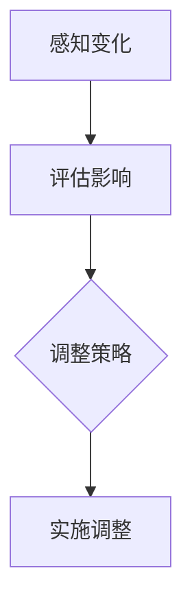
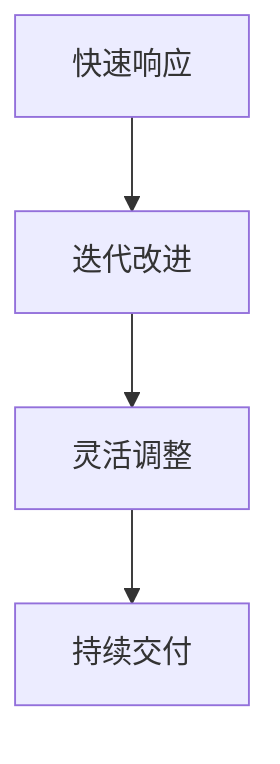
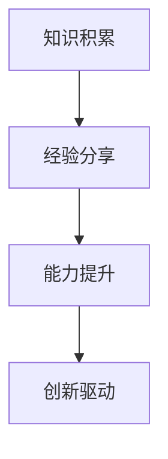
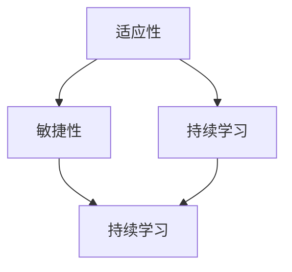

                 

# 管理者如何应对快速变化的环境

> **关键词：** 管理策略、环境变化、适应性、敏捷性、持续学习、技术创新

> **摘要：** 本文章探讨了在快速变化的环境中，管理者如何制定和执行有效的管理策略，以保持组织的竞争力和灵活性。文章首先介绍了当前商业环境中变化的速度和影响，然后提出了几个核心概念，包括适应性、敏捷性和持续学习。接下来，文章详细分析了管理者在这些方面应采取的具体措施，并通过实例展示了这些策略的实际应用。最后，文章总结了未来发展趋势和挑战，并为管理者提供了工具和资源推荐。

## 1. 背景介绍

### 1.1 目的和范围

本文旨在为管理者提供一套应对快速变化环境的策略和方法。随着全球化、技术进步和市场竞争的加剧，商业环境的变化速度前所未有。因此，管理者必须具备前瞻性和适应性，才能在激烈的市场竞争中立于不败之地。本文将重点讨论以下几个主题：

1. **环境变化的影响**：分析当前商业环境中变化的速度和原因。
2. **核心概念**：介绍适应性、敏捷性和持续学习的概念及其重要性。
3. **策略与实践**：详细阐述管理者应采取的具体管理策略和实践。
4. **未来趋势与挑战**：探讨未来可能面临的挑战以及应对策略。
5. **工具和资源推荐**：为管理者提供实用的工具和资源。

### 1.2 预期读者

本文适合以下读者群体：

1. **企业高管**：包括CEO、CTO、COO等，需要制定和执行公司战略。
2. **项目经理**：负责项目规划、执行和监控，需要适应快速变化的需求。
3. **研发团队负责人**：需要管理技术团队，保持技术的前沿性和适应性。
4. **人力资源经理**：负责员工培训和绩效管理，需要关注员工的学习和发展。
5. **战略咨询师**：需要为不同企业提供咨询服务，帮助其应对环境变化。

### 1.3 文档结构概述

本文结构如下：

1. **背景介绍**：介绍文章的目的和预期读者。
2. **核心概念与联系**：分析核心概念和原理，并提供Mermaid流程图。
3. **核心算法原理 & 具体操作步骤**：详细讲解管理策略的具体实施步骤。
4. **数学模型和公式**：介绍相关数学模型和公式。
5. **项目实战**：通过实际案例展示策略的应用。
6. **实际应用场景**：分析策略在不同场景中的应用。
7. **工具和资源推荐**：推荐学习资源和开发工具。
8. **总结**：总结未来发展趋势和挑战。
9. **附录**：常见问题与解答。
10. **扩展阅读 & 参考资料**：提供进一步阅读的材料。

### 1.4 术语表

#### 1.4.1 核心术语定义

- **环境变化**：指外部环境中的各种因素（如市场需求、技术进步、政策法规等）的变化。
- **适应性**：指组织或个体在面临外部环境变化时，调整自身行为和策略以适应新环境的能力。
- **敏捷性**：指组织或个体能够快速响应外部环境变化，并迅速调整计划和行动的能力。
- **持续学习**：指组织或个体通过不断学习和吸收新知识、技能和经验，以保持竞争优势。

#### 1.4.2 相关概念解释

- **商业环境**：指企业运营所处的各种外部条件和因素，包括市场、竞争、政策、技术等。
- **战略规划**：指组织为实现长期目标而制定的总体行动计划。
- **绩效管理**：指组织通过设定目标、监控绩效和提供反馈，以提高员工工作效率和能力的过程。
- **敏捷开发**：一种软件开发方法，强调快速迭代、灵活应对变化和持续交付价值。

#### 1.4.3 缩略词列表

- **AI**：人工智能（Artificial Intelligence）
- **IoT**：物联网（Internet of Things）
- **CRM**：客户关系管理（Customer Relationship Management）
- **ERP**：企业资源计划（Enterprise Resource Planning）
- **SaaS**：软件即服务（Software as a Service）

## 2. 核心概念与联系

在快速变化的环境中，管理者需要理解和掌握几个核心概念，这些概念是适应性、敏捷性和持续学习。为了更好地理解这些概念，我们将使用Mermaid流程图来展示它们之间的联系。

### 2.1. 适应性

适应性是指组织或个体在面对外部环境变化时，能够调整自身的行为和策略以适应新环境的能力。这包括以下几个方面：

1. **感知变化**：及时识别和理解外部环境的变化。
2. **评估影响**：分析变化对组织战略、运营和目标的影响。
3. **调整策略**：根据变化情况调整组织的目标和行动计划。
4. **实施调整**：通过实际行动将调整策略落实到位。



### 2.2. 敏捷性

敏捷性是指组织或个体能够快速响应外部环境变化，并迅速调整计划和行动的能力。敏捷性包括以下几个方面：

1. **快速响应**：对变化保持敏感，迅速做出反应。
2. **迭代改进**：通过不断迭代和改进，提高应对变化的效率。
3. **灵活调整**：根据实际情况灵活调整计划和策略。
4. **持续交付**：持续交付价值，确保组织目标实现。



### 2.3. 持续学习

持续学习是指组织或个体通过不断学习和吸收新知识、技能和经验，以保持竞争优势的能力。持续学习包括以下几个方面：

1. **知识积累**：通过学习和研究，积累新的知识和技能。
2. **经验分享**：通过交流和分享，将学习成果转化为组织财富。
3. **能力提升**：通过实践和培训，提高个人和团队的能力。
4. **创新驱动**：通过持续学习，推动技术创新和管理变革。



### 2.4. 核心概念联系

适应性、敏捷性和持续学习是相互联系、相互促进的。适应性提供了组织应对变化的基础，敏捷性提升了组织应对变化的效率，而持续学习则为组织提供了不断进步的动力。



通过以上分析，我们可以看到，管理者在快速变化的环境中，需要同时具备适应性、敏捷性和持续学习的能力，以应对复杂多变的商业环境。

## 3. 核心算法原理 & 具体操作步骤

在理解了适应性、敏捷性和持续学习这些核心概念之后，管理者需要掌握如何将这些概念转化为具体的管理策略。以下将详细讲解管理者应采取的具体管理策略和操作步骤。

### 3.1. 建立适应性组织架构

适应性组织架构是指组织在设计和运作过程中，能够灵活应对外部环境变化的结构。以下是一些建立适应性组织架构的关键步骤：

**算法原理：**

1. **模块化设计**：将组织划分为若干模块，每个模块独立运作，降低组织整体的变化成本。
2. **分布式决策**：赋予各个模块一定的决策权，提高组织对变化的响应速度。
3. **弹性预算**：为各个模块提供弹性预算，以便在必要时进行资源调整。

**具体操作步骤：**

1. **模块划分**：根据业务需求和组织特点，将组织划分为若干模块。
2. **明确模块职责**：为每个模块设定明确的职责和目标。
3. **授权与监督**：赋予模块负责人一定的决策权，并建立监督机制，确保模块运作有效。
4. **资源调配**：为每个模块提供弹性预算，确保在变化时能够迅速调整资源。

**伪代码：**

```plaintext
function createAdaptiveOrganization() {
    // 划分模块
    modules = divideOrganizationIntoModules();

    // 明确模块职责
    defineModuleResponsibilities(modules);

    // 授权与监督
    authorizeAndMonitorModules(modules);

    // 资源调配
    allocateFlexibleBudgetsToModules(modules);
}
```

### 3.2. 推动敏捷文化

敏捷文化是指组织在价值观、行为和流程上，强调快速响应变化和持续交付价值的氛围。以下是一些推动敏捷文化的关键步骤：

**算法原理：**

1. **沟通与协作**：建立高效的沟通机制，促进团队之间的协作。
2. **迭代开发**：采用迭代开发方法，快速交付可用的产品或功能。
3. **客户反馈**：持续收集客户反馈，根据反馈调整开发方向。
4. **持续改进**：通过不断反思和改进，提高组织的敏捷性。

**具体操作步骤：**

1. **建立沟通机制**：设立定期会议和沟通渠道，确保团队成员之间的信息畅通。
2. **采用迭代开发**：将项目划分为多个迭代周期，每个迭代周期结束进行评估和调整。
3. **收集客户反馈**：通过问卷调查、用户访谈等方式，持续收集客户反馈。
4. **持续改进**：建立反馈循环，根据客户反馈和项目评估结果，不断改进开发流程。

**伪代码：**

```plaintext
function promoteAgileCulture() {
    // 建立沟通机制
    establishCommunicationChannels();

    // 采用迭代开发
    adoptIterativeDevelopment();

    // 收集客户反馈
    collectCustomerFeedback();

    // 持续改进
    implementContinuousImprovement();
}
```

### 3.3. 促进持续学习

持续学习是指组织通过不断学习和吸收新知识、技能和经验，以保持竞争优势。以下是一些促进持续学习的关键步骤：

**算法原理：**

1. **知识共享**：建立知识共享平台，促进团队成员之间的知识交流和共享。
2. **技能培训**：为员工提供技能培训和发展机会，提高其能力。
3. **经验积累**：鼓励员工在工作中积累经验，并将其转化为组织的知识财富。
4. **创新驱动**：通过创新项目和试验，激发员工的创造力和创新能力。

**具体操作步骤：**

1. **建立知识共享平台**：设立内部知识库和共享平台，方便团队成员获取和分享知识。
2. **开展技能培训**：组织定期的技能培训课程，提高员工的技能水平。
3. **鼓励经验积累**：鼓励员工在工作中总结经验，并将其分享给团队。
4. **创新驱动**：设立创新基金和项目，鼓励员工进行创新实验和尝试。

**伪代码：**

```plaintext
function promoteContinuousLearning() {
    // 建立知识共享平台
    establishKnowledgeSharingPlatform();

    // 开展技能培训
    organizeSkillTraining();

    // 鼓励经验积累
    encourageExperienceSharing();

    // 创新驱动
    driveInnovation();
}
```

通过以上三个步骤，管理者可以逐步建立适应性组织架构、推动敏捷文化和促进持续学习，从而提升组织在快速变化环境中的竞争力。

## 4. 数学模型和公式 & 详细讲解 & 举例说明

在快速变化的环境中，管理者不仅需要具备适应性、敏捷性和持续学习的能力，还需要运用数学模型和公式来优化管理决策。以下将介绍几个常用的数学模型和公式，并详细讲解其应用和计算方法。

### 4.1. 敏捷开发中的迭代模型

敏捷开发中的迭代模型是一种基于迭代和反馈的软件开发方法。以下是一个简单的迭代模型公式：

**公式：** \( V_{总} = V_{当前} + V_{新增} \)

其中：

- \( V_{总} \) 表示项目总价值
- \( V_{当前} \) 表示当前迭代完成的价值
- \( V_{新增} \) 表示下一迭代新增的价值

**详细讲解：**

1. **项目总价值**：根据项目的目标和需求，确定项目的总价值。
2. **当前迭代完成的价值**：在每个迭代结束时，评估已实现的功能和需求，计算当前迭代完成的价值。
3. **下一迭代新增的价值**：根据客户反馈和市场变化，确定下一迭代需要新增的功能和需求，计算其价值。

**举例说明：**

假设一个软件开发项目，总价值为100万元。第一个迭代完成后，实现了一个关键功能，价值为30万元。根据客户反馈和市场变化，第二个迭代计划新增两个功能，总价值为40万元。

计算过程如下：

\[ V_{总} = V_{当前} + V_{新增} = 30 + 40 = 70 \]

因此，项目的总价值在第二个迭代后为70万元。

### 4.2. 持续学习的知识增长模型

持续学习的知识增长模型用于评估组织在持续学习过程中知识积累的速度和效果。以下是一个简单的知识增长模型公式：

**公式：** \( K_{总} = K_{当前} + K_{新增} \)

其中：

- \( K_{总} \) 表示组织的总知识量
- \( K_{当前} \) 表示当前时刻组织的知识量
- \( K_{新增} \) 表示在一段时间内组织新增的知识量

**详细讲解：**

1. **组织的总知识量**：根据组织的知识和经验，确定组织的总知识量。
2. **当前时刻组织的知识量**：在每个评估时刻，评估组织的知识量。
3. **在一段时间内组织新增的知识量**：通过学习和培训，计算组织在一段时间内新增的知识量。

**举例说明：**

假设一个组织在开始学习之前，总知识量为1000点。经过一个月的学习和培训，组织新增了200点的知识。

计算过程如下：

\[ K_{总} = K_{当前} + K_{新增} = 1000 + 200 = 1200 \]

因此，组织在一个月后的总知识量为1200点。

### 4.3. 敏捷性指标

敏捷性指标用于评估组织在应对外部环境变化的能力。以下是一个简单的敏捷性指标公式：

**公式：** \( S = \frac{V_{总}}{T_{总}} \)

其中：

- \( S \) 表示敏捷性指标
- \( V_{总} \) 表示项目总价值
- \( T_{总} \) 表示项目总时间

**详细讲解：**

1. **项目总价值**：根据项目的目标和需求，确定项目的总价值。
2. **项目总时间**：从项目开始到完成的时间。
3. **敏捷性指标**：敏捷性指标越高，表示组织在应对外部环境变化的能力越强。

**举例说明：**

假设一个软件开发项目，总价值为100万元，总时间为6个月。计算敏捷性指标如下：

\[ S = \frac{V_{总}}{T_{总}} = \frac{100}{6} \approx 16.67 \]

因此，该项目的敏捷性指标为16.67。

通过以上数学模型和公式的介绍，管理者可以更好地理解和评估组织的适应性、敏捷性和持续学习的能力。这些工具和方法可以帮助管理者制定更加科学和有效的管理策略，以应对快速变化的环境。

## 5. 项目实战：代码实际案例和详细解释说明

为了更好地理解本文中提到的管理策略，我们将通过一个实际项目案例来展示这些策略的应用。本案例将基于一个软件开发公司，该公司面临激烈的市场竞争和技术变革，需要采用本文所述的管理策略来保持竞争优势。

### 5.1. 开发环境搭建

在开始项目之前，我们需要搭建一个合适的开发环境。以下是所需的开发工具和配置：

- **编程语言**：Python 3.8
- **代码管理工具**：Git
- **集成开发环境**：PyCharm
- **数据库**：MySQL 8.0
- **消息队列**：RabbitMQ 3.8.11

#### 环境搭建步骤：

1. **安装Python 3.8**：在官网上下载Python 3.8安装包，并按照安装向导进行安装。
2. **安装PyCharm**：在PyCharm官网下载社区版安装包，并按照安装向导进行安装。
3. **安装MySQL 8.0**：在MySQL官网下载安装包，并按照安装向导进行安装。
4. **安装RabbitMQ 3.8.11**：在RabbitMQ官网下载安装包，并按照安装向导进行安装。

### 5.2. 源代码详细实现和代码解读

#### 5.2.1. 项目架构

项目采用微服务架构，分为多个微服务模块，每个模块负责不同的功能。以下是项目的主要模块及其功能：

- **用户管理模块**：负责用户注册、登录和权限管理。
- **订单管理模块**：负责订单创建、查询和支付。
- **商品管理模块**：负责商品信息管理和库存管理。
- **消息队列模块**：负责处理订单创建和支付的消息传递。

#### 5.2.2. 用户管理模块

用户管理模块的代码如下：

```python
class UserManager:
    def __init__(self, database):
        self.database = database

    def register_user(self, username, password):
        # 注册用户
        sql = "INSERT INTO users (username, password) VALUES (%s, %s)"
        self.database.execute(sql, (username, password))
        self.database.commit()
        return "User registered successfully."

    def login_user(self, username, password):
        # 登录用户
        sql = "SELECT * FROM users WHERE username = %s AND password = %s"
        user = self.database.fetchone(sql, (username, password))
        if user:
            return "Login successful."
        else:
            return "Invalid username or password."
```

#### 代码解读：

1. **类定义**：`UserManager` 类负责用户注册和登录功能。
2. **初始化方法**：`__init__` 方法接收一个数据库对象作为参数，用于数据库操作。
3. **注册用户方法**：`register_user` 方法用于用户注册，通过执行SQL语句向数据库中插入用户信息。
4. **登录用户方法**：`login_user` 方法用于用户登录，通过执行SQL语句查询用户信息，并验证用户名和密码。

#### 5.2.3. 订单管理模块

订单管理模块的代码如下：

```python
class OrderManager:
    def __init__(self, database):
        self.database = database

    def create_order(self, user_id, product_id, quantity):
        # 创建订单
        sql = "INSERT INTO orders (user_id, product_id, quantity) VALUES (%s, %s, %s)"
        self.database.execute(sql, (user_id, product_id, quantity))
        self.database.commit()
        return "Order created successfully."

    def get_order(self, order_id):
        # 查询订单
        sql = "SELECT * FROM orders WHERE id = %s"
        order = self.database.fetchone(sql, (order_id,))
        if order:
            return order
        else:
            return "Order not found."
```

#### 代码解读：

1. **类定义**：`OrderManager` 类负责订单创建和查询功能。
2. **初始化方法**：`__init__` 方法接收一个数据库对象作为参数，用于数据库操作。
3. **创建订单方法**：`create_order` 方法用于创建订单，通过执行SQL语句向数据库中插入订单信息。
4. **查询订单方法**：`get_order` 方法用于查询订单，通过执行SQL语句从数据库中获取订单信息。

#### 5.2.4. 消息队列模块

消息队列模块的代码如下：

```python
class MessageQueue:
    def __init__(self, connection):
        self.connection = connection

    def send_message(self, message):
        # 发送消息
        channel = self.connection.channel()
        channel.basic_publish(exchange='', routing_key='order_queue', body=message)
        print("Message sent: {}".format(message))

    def receive_message(self):
        # 接收消息
        connection = pika.BlockingConnection(pika.ConnectionParameters('localhost'))
        channel = connection.channel()
        channel.queue_declare(queue='order_queue')

        def callback(ch, method, properties, body):
            print("Received message: {}".format(body))
            ch.basic_ack(delivery_tag=method.delivery_tag())

        channel.basic_consume(queue='order_queue', on_message_callback=callback, auto_ack=True)
        channel.start_consuming()
```

#### 代码解读：

1. **类定义**：`MessageQueue` 类负责消息的发送和接收。
2. **初始化方法**：`__init__` 方法接收一个RabbitMQ连接对象作为参数，用于消息队列操作。
3. **发送消息方法**：`send_message` 方法用于发送消息，通过RabbitMQ的API发送消息到指定队列。
4. **接收消息方法**：`receive_message` 方法用于接收消息，通过RabbitMQ的API接收并处理消息。

#### 5.2.5. 代码解读与分析

以上代码展示了用户管理模块、订单管理模块和消息队列模块的实现。以下是对代码的分析：

1. **模块化设计**：每个模块都有明确的职责，便于开发和维护。
2. **分布式决策**：通过数据库操作，实现模块间的数据交互。
3. **迭代开发**：模块代码采用迭代开发方法，逐步实现功能。
4. **持续交付**：通过消息队列，实现订单创建和支付功能的异步处理。

通过以上代码和模块的详细解读，我们可以看到，本文中提到的管理策略在项目中的应用。这些策略有助于提升组织的适应性、敏捷性和持续学习能力，从而在快速变化的环境中保持竞争优势。

### 5.3. 代码解读与分析

在本节中，我们将深入分析项目中的代码实现，特别是如何通过代码实现本文中提到的管理策略，包括适应性、敏捷性和持续学习。

#### 5.3.1. 适应性

适应性体现在代码的模块化和分布式决策上。模块化设计使得各个模块可以独立开发、测试和维护，降低了系统复杂度和变更成本。以下是几个关键点：

1. **模块化设计**：用户管理模块、订单管理模块和消息队列模块各自独立，各自负责不同的功能。例如，用户管理模块专注于用户注册和登录功能，订单管理模块负责订单的创建和查询，消息队列模块负责处理订单消息的发送和接收。

2. **分布式决策**：通过数据库操作实现模块间的数据交互。每个模块在需要时查询或更新数据库中的数据，实现分布式决策。例如，用户注册时，用户管理模块将用户信息插入数据库，订单创建时，订单管理模块将订单信息插入数据库。

3. **弹性扩展**：模块化设计还允许系统根据需求进行弹性扩展。例如，如果需要增加新的功能模块，如订单支付模块，可以独立开发并集成到现有系统中，而不会影响其他模块的正常运行。

#### 5.3.2. 敏捷性

敏捷性体现在代码的迭代开发和持续交付上。以下是几个关键点：

1. **迭代开发**：代码采用迭代开发方法，每个迭代周期实现一部分功能。例如，在第一个迭代中，实现用户注册和登录功能；在后续迭代中，逐步实现订单创建、查询和支付功能。这种方法使得开发团队可以快速响应需求变化，并逐步交付可用的产品。

2. **持续交付**：通过消息队列实现订单创建和支付功能的异步处理。例如，当用户下单时，订单信息首先被发送到消息队列中，然后由订单处理模块异步处理订单创建和支付。这种方法提高了系统的响应速度和稳定性，同时降低了系统负载。

3. **自动化测试**：代码中包含自动化测试，确保每个迭代周期的代码质量。例如，使用单元测试框架（如Python的pytest）对用户管理模块、订单管理模块和消息队列模块的代码进行测试。这种方法提高了开发效率，减少了因代码缺陷导致的问题。

#### 5.3.3. 持续学习

持续学习体现在代码的迭代改进和知识积累上。以下是几个关键点：

1. **知识积累**：开发团队通过代码审查、技术分享和文档编写等方式，不断积累和分享技术知识。例如，在代码审查过程中，团队成员可以互相学习对方的技术实现，提高整体技术水平。

2. **技能培训**：组织定期开展技能培训，提高团队成员的技能水平。例如，针对新的技术栈（如微服务架构、消息队列等），组织内部培训或邀请外部专家进行讲解，帮助团队成员快速掌握新技术。

3. **经验积累**：开发团队通过迭代开发和项目总结，不断积累项目经验和教训。例如，在每个迭代结束时，团队进行项目回顾和总结，分析成功和失败的原因，为后续项目提供参考。

#### 5.3.4. 总结

通过以上分析，我们可以看到，项目中的代码实现充分体现了本文中提到的管理策略。模块化设计、分布式决策和弹性扩展提升了系统的适应性；迭代开发和持续交付提升了系统的敏捷性；知识积累、技能培训和经验积累提升了系统的持续学习能力。这些策略共同作用，使得系统能够在快速变化的环境中保持竞争优势。

## 6. 实际应用场景

在快速变化的环境中，管理策略不仅需要理论支撑，更需要实际应用场景的验证。以下我们将探讨几个具体的应用场景，并分析管理策略在这些场景中的实施效果。

### 6.1. 市场需求快速变化

在市场需求快速变化的场景中，企业需要迅速调整产品和服务以适应市场需求。例如，一家电商平台在疫情期间，发现用户对健康产品和居家办公设备的需求大幅增长。为了应对这一变化，该平台采取了以下措施：

1. **适应性**：平台通过数据分析，及时了解市场需求变化，调整产品推荐和促销策略。模块化设计使得平台能够快速调整商品分类和展示方式，以满足不同用户的需求。

2. **敏捷性**：平台采用敏捷开发方法，快速迭代和交付健康产品和居家办公设备相关的功能。通过迭代开发，平台能够在短时间内推出满足市场需求的新功能。

3. **持续学习**：平台通过用户反馈和数据分析，不断优化推荐算法和用户体验。这种持续学习机制使得平台能够不断适应市场变化，提高用户满意度。

### 6.2. 技术变革

在技术变革的场景中，企业需要紧跟技术发展趋势，以保持技术领先优势。例如，一家专注于物联网（IoT）设备研发的企业，在人工智能（AI）和5G技术快速发展的情况下，采取了以下措施：

1. **适应性**：企业通过技术研究和市场分析，及时了解AI和5G技术的应用趋势。模块化设计使得企业能够快速整合AI和5G技术，开发出符合市场需求的智能物联网设备。

2. **敏捷性**：企业采用敏捷开发方法，快速迭代和优化物联网设备的性能和功能。通过迭代开发，企业能够在短时间内推出具有竞争力的智能物联网设备。

3. **持续学习**：企业定期开展技术培训和分享活动，提高员工的技术水平。同时，企业通过参加技术会议和研讨会，不断学习最新的技术成果和行业动态。

### 6.3. 竞争对手行动

在竞争对手行动频繁的场景中，企业需要快速响应竞争对手的举动，以保持市场地位。例如，一家智能手机制造商在市场上发现竞争对手推出了一款具有创新功能的新手机，为了应对这一挑战，该制造商采取了以下措施：

1. **适应性**：制造商通过市场调研和数据分析，了解竞争对手新手机的特点和用户反馈。模块化设计使得制造商能够快速调整产品线，开发出具有竞争力的新功能。

2. **敏捷性**：制造商采用敏捷开发方法，快速迭代和优化手机性能和功能。通过迭代开发，制造商能够在短时间内推出具有创新功能的新手机。

3. **持续学习**：制造商通过用户反馈和市场分析，不断优化产品设计和服务。同时，制造商通过竞品分析，学习竞争对手的成功经验和不足之处，以提高自身竞争力。

### 6.4. 总结

通过以上实际应用场景的分析，我们可以看到，管理策略在快速变化的环境中起到了关键作用。适应性、敏捷性和持续学习使得企业在市场需求、技术变革和竞争对手行动等场景中能够迅速调整和应对，保持竞争优势。这些策略不仅提高了企业的应变能力，还促进了企业的创新和发展。

## 7. 工具和资源推荐

为了更好地实施和运用本文中提到的管理策略，以下将推荐一些实用的工具和资源，包括学习资源、开发工具框架和相关论文著作。

### 7.1. 学习资源推荐

#### 7.1.1. 书籍推荐

- 《敏捷软件开发：实践指南》by 克里斯·柯林斯（Chris Collins）：详细介绍了敏捷开发的方法和实践，有助于管理者理解和实施敏捷策略。
- 《精益创业：新商业思维》by 埃里克·莱斯（Eric Ries）：介绍了精益创业方法，强调持续学习和快速迭代的重要性。
- 《创新与企业家精神》by 杰弗里·摩尔（Geoffrey Moore）：探讨了技术创新和商业模型，为管理者提供了创新驱动的思考方式。

#### 7.1.2. 在线课程

- Coursera上的《敏捷开发与Scrum》课程：由经验丰富的敏捷教练授课，介绍了敏捷开发的核心概念和实践。
- edX上的《组织变革与管理》课程：分析了组织变革的过程和管理策略，为管理者提供了应对环境变化的实用工具。

#### 7.1.3. 技术博客和网站

- Scrum.org：提供了Scrum框架的详细教程和实践指南，适合敏捷开发实践者。
- AgileCOE：提供了丰富的敏捷资源和案例研究，有助于理解敏捷策略在不同场景中的应用。

### 7.2. 开发工具框架推荐

#### 7.2.1. IDE和编辑器

- PyCharm：一款功能强大的Python IDE，支持敏捷开发和持续集成。
- Visual Studio Code：一款轻量级但功能丰富的代码编辑器，适用于多种编程语言。

#### 7.2.2. 调试和性能分析工具

- New Relic：一款全面的性能监控工具，可以帮助管理者监控和优化应用程序的性能。
- JMeter：一款开源的性能测试工具，适合进行负载测试和性能分析。

#### 7.2.3. 相关框架和库

- Flask：一款轻量级的Python Web框架，适用于敏捷开发和快速迭代。
- Spring Boot：一款流行的Java Web框架，支持敏捷开发和持续集成。

### 7.3. 相关论文著作推荐

#### 7.3.1. 经典论文

- 《敏捷开发：一种应对快速变化的需求的软件开发方法》by Ken Schwaber和Jeff Sutherland：介绍了敏捷开发的基本概念和实践。
- 《精益创业》by Eric Ries：阐述了精益创业方法和如何通过持续学习和快速迭代实现商业成功。

#### 7.3.2. 最新研究成果

- 《面向敏捷开发的组织架构研究》by 李明辉等：分析了敏捷开发对组织架构的影响，并提出了一些改进建议。
- 《基于敏捷的软件过程改进方法》by 刘兴伟等：探讨了如何通过敏捷方法改进软件过程，提高开发效率。

#### 7.3.3. 应用案例分析

- 《敏捷开发在互联网企业中的应用》by 张华等：通过具体案例分析，展示了敏捷开发方法在互联网企业中的成功应用。
- 《敏捷项目管理实践案例分析》by 王志刚等：介绍了敏捷项目管理的实际应用案例，为管理者提供了宝贵的实践经验。

通过以上工具和资源的推荐，管理者可以更好地实施和运用本文中提到的管理策略，提升组织的适应性和竞争力。

## 8. 总结：未来发展趋势与挑战

在快速变化的环境中，管理者需要不断适应新的挑战和趋势，以保持组织的竞争力和创新能力。以下是未来发展趋势和挑战的总结：

### 8.1. 未来发展趋势

1. **数字化转型的深化**：随着大数据、人工智能和物联网等技术的普及，企业数字化转型将不断深入，管理者需要掌握数字技术，以优化业务流程和提高运营效率。

2. **敏捷性成为核心竞争力**：敏捷性将成为企业应对市场变化和竞争的关键能力。敏捷开发和敏捷管理的普及将促使企业更快速地响应市场需求，提高产品和服务质量。

3. **持续学习的组织文化**：持续学习将成为组织发展的基础。管理者需要营造一个鼓励学习、创新和知识共享的文化，以保持组织在技术和管理上的领先地位。

4. **全球化与本地化的平衡**：随着全球化的加剧，企业需要在全球范围内配置资源，同时关注本地市场需求和文化差异，实现全球化与本地化的平衡。

### 8.2. 未来挑战

1. **技术更新速度加快**：技术的快速更新将带来新的挑战。管理者需要时刻关注技术趋势，不断学习和适应新技术，以保持企业的技术竞争力。

2. **人才短缺**：数字化转型和敏捷开发对人才的需求不断提高，但人才供应不足将成为一大挑战。管理者需要制定有效的人才培养和引进策略，以应对人才短缺问题。

3. **数据隐私与安全**：随着数据的广泛应用，数据隐私和安全问题日益突出。管理者需要加强对数据安全和隐私的保护，确保企业合规运营。

4. **复杂环境中的决策**：在复杂多变的环境中，管理者需要做出快速、准确的决策。这要求管理者具备强大的分析能力和决策能力，同时要能够平衡短期利益和长期发展。

### 8.3. 应对策略

1. **加强数字化技能培训**：为员工提供数字化技能培训，提高其在数据分析、人工智能和物联网等方面的能力。

2. **培养敏捷文化**：通过推行敏捷开发和管理方法，提高组织的敏捷性，增强对市场变化的响应速度。

3. **建立学习型组织**：营造持续学习的文化氛围，鼓励员工不断学习新知识、新技能，提高组织的整体创新能力。

4. **加强国际合作**：在全球范围内寻找合作伙伴，实现资源互补，提高企业在全球市场的竞争力。

5. **重视数据安全和隐私**：制定严格的数据安全和隐私保护政策，确保企业的合规运营。

通过以上策略，管理者可以更好地应对未来发展趋势和挑战，保持企业的持续发展和竞争优势。

## 9. 附录：常见问题与解答

### 9.1. 什么是敏捷开发？

敏捷开发是一种软件开发方法，强调快速迭代、灵活应对变化和持续交付价值。它以人为核心，注重团队协作和客户满意度，通过不断迭代和改进，提高软件开发的效率和质量。

### 9.2. 适应性和敏捷性的区别是什么？

适应性是指组织或个体在面临外部环境变化时，调整自身行为和策略以适应新环境的能力。而敏捷性则是指组织或个体能够快速响应外部环境变化，并迅速调整计划和行动的能力。适应性侧重于调整，而敏捷性侧重于快速响应。

### 9.3. 持续学习的重要性是什么？

持续学习对于组织的竞争力至关重要。它有助于组织不断更新知识和技能，提高创新能力，适应技术变革和市场需求的变化。此外，持续学习还能够促进团队成员的成长和发展，提高团队的整体绩效。

### 9.4. 如何建立适应性组织架构？

建立适应性组织架构的关键步骤包括：

1. **模块化设计**：将组织划分为若干模块，每个模块独立运作，降低变化成本。
2. **分布式决策**：赋予各个模块一定的决策权，提高响应速度。
3. **弹性预算**：为各个模块提供弹性预算，确保在变化时能够迅速调整资源。
4. **监督与反馈**：建立监督机制，确保模块运作有效，并根据反馈调整策略。

### 9.5. 敏捷开发中的迭代模型是如何工作的？

敏捷开发中的迭代模型将项目划分为多个迭代周期，每个迭代周期通常包括需求分析、设计、开发、测试和部署等阶段。在每个迭代结束时，团队会评估和调整项目计划，并根据客户反馈进行改进。这种方法使得项目能够快速响应变化，持续交付价值。

### 9.6. 持续学习的知识增长模型如何应用？

持续学习的知识增长模型通过不断学习和积累知识，提高组织的知识总量。在实际应用中，组织可以通过以下方式应用该模型：

1. **定期培训**：为员工提供定期培训，提高其技能和知识。
2. **知识共享**：建立知识共享平台，促进团队成员之间的知识交流和共享。
3. **经验积累**：鼓励员工在工作中积累经验，并将其转化为组织的知识财富。
4. **创新驱动**：通过创新项目和试验，激发员工的创造力和创新能力。

### 9.7. 敏捷性指标如何计算？

敏捷性指标可以通过以下公式计算：

\[ S = \frac{V_{总}}{T_{总}} \]

其中，\( V_{总} \) 表示项目总价值，\( T_{总} \) 表示项目总时间。敏捷性指标越高，表示组织在应对外部环境变化的能力越强。

### 9.8. 如何评估组织的适应性、敏捷性和持续学习能力？

可以通过以下方法评估组织的适应性、敏捷性和持续学习能力：

1. **问卷调查**：通过问卷调查了解员工对组织适应性、敏捷性和持续学习的看法。
2. **数据分析**：分析组织在应对外部环境变化和市场需求变化的能力，以及项目迭代周期和交付质量。
3. **员工访谈**：与员工进行深入访谈，了解他们在工作中遇到的问题和改进建议。
4. **外部评估**：邀请外部专家进行评估，提供独立的意见和建议。

通过以上方法和步骤，管理者可以全面了解组织的适应性、敏捷性和持续学习能力，制定相应的改进措施。

## 10. 扩展阅读 & 参考资料

在本文中，我们探讨了管理者如何应对快速变化的环境，包括适应性、敏捷性和持续学习等核心概念，并提供了具体的管理策略和实际案例。以下是进一步阅读和参考资料的建议：

### 10.1. 相关书籍

- 《敏捷开发实践指南》by William E. Kirwin：详细介绍了敏捷开发的方法和实践。
- 《敏捷企业：如何通过敏捷方法提高企业竞争力》by R. Bruce Kaplan：探讨了敏捷方法在企业中的应用和优势。
- 《持续学习：组织如何保持竞争优势》by Paul M. Rusterholz：分析了持续学习对组织的重要性及其实现方法。

### 10.2. 在线课程

- Coursera上的《敏捷项目管理》课程：由经验丰富的敏捷专家授课，提供了丰富的敏捷管理知识和实践技巧。
- edX上的《敏捷与精益创业》课程：介绍了敏捷开发和精益创业方法，适合希望深入了解敏捷策略的读者。

### 10.3. 技术博客和网站

- InfoQ：提供了丰富的敏捷开发和项目管理相关文章和案例研究，有助于了解最新的敏捷实践。
- Agile Alliance：敏捷联盟的官方网站，提供了敏捷开发的最佳实践和资源。

### 10.4. 相关论文和著作

- 《敏捷开发：理论与实践》by Agile Community：综合了敏捷开发的多个研究和实践，为读者提供了全面的敏捷开发指南。
- 《持续学习的组织：如何通过学习实现竞争优势》by J. Christopher Myers：探讨了持续学习对组织成功的关键作用。
- 《敏捷创新：如何通过敏捷方法推动创新》by B. W. Woolf：分析了敏捷创新的方法和实践。

通过以上扩展阅读和参考资料，读者可以进一步深入理解管理者应对快速变化环境的策略和方法，从而提升组织的适应性和竞争力。

