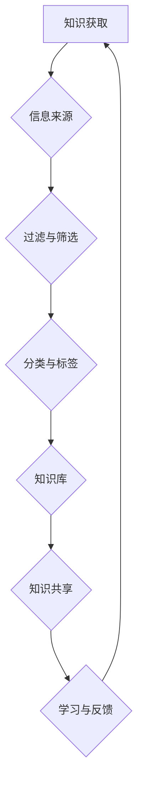

                 

### 管理者如何建立个人知识管理系统

> **关键词：** 知识管理、个人知识体系、管理者、学习效率、信息整理、技术工具

> **摘要：** 在信息化时代，管理者面临信息过载和知识更新的挑战。本文将探讨管理者如何通过构建个人知识管理系统来提升学习效率、信息整理能力和决策质量，提供了一套系统化的方法和步骤。文章首先介绍了构建个人知识管理系统的目的和范围，随后详细讲解了核心概念、算法原理、数学模型、项目实战以及实际应用场景，并推荐了一系列学习和开发资源，最后对未来的发展趋势与挑战进行了总结。

## 1. 背景介绍

### 1.1 目的和范围

随着信息技术的飞速发展，知识已经成为组织和个人竞争的核心资源。管理者在日常工作中需要处理大量的信息和知识，如何有效管理这些信息，提升学习效率，提高决策质量，成为他们面临的重要问题。本文旨在为管理者提供一套构建个人知识管理系统的方法和步骤，以帮助他们在信息爆炸的时代中保持竞争力。

本文的写作范围主要包括以下几个方面：

1. **核心概念与联系**：介绍构建个人知识管理系统所需的核心概念和原理。
2. **核心算法原理与具体操作步骤**：详细阐述构建知识管理系统的算法原理和具体操作步骤。
3. **数学模型和公式**：讲解知识管理系统中的数学模型和公式，并举例说明。
4. **项目实战**：通过实际代码案例展示如何实现个人知识管理系统。
5. **实际应用场景**：探讨个人知识管理系统在不同领域的应用。
6. **工具和资源推荐**：推荐相关学习资源、开发工具和框架。
7. **未来发展趋势与挑战**：分析个人知识管理系统的发展趋势和面临的挑战。

### 1.2 预期读者

本文适合以下读者群体：

1. **企业中层管理者**：希望提升自己的知识管理能力，提高决策质量和工作效率。
2. **技术团队领导者**：需要构建和维护团队的知识管理体系。
3. **学习爱好者**：对知识管理有浓厚兴趣，希望掌握有效的学习方法。
4. **研究人员**：希望了解如何利用技术手段进行知识管理的研究。

### 1.3 文档结构概述

本文结构如下：

1. **背景介绍**：介绍本文的目的、范围和预期读者。
2. **核心概念与联系**：介绍构建个人知识管理系统所需的核心概念和原理。
3. **核心算法原理与具体操作步骤**：详细阐述构建知识管理系统的算法原理和具体操作步骤。
4. **数学模型和公式**：讲解知识管理系统中的数学模型和公式，并举例说明。
5. **项目实战**：通过实际代码案例展示如何实现个人知识管理系统。
6. **实际应用场景**：探讨个人知识管理系统在不同领域的应用。
7. **工具和资源推荐**：推荐相关学习资源、开发工具和框架。
8. **未来发展趋势与挑战**：分析个人知识管理系统的发展趋势和面临的挑战。
9. **附录：常见问题与解答**：解答读者可能遇到的问题。
10. **扩展阅读与参考资料**：提供进一步阅读的资源和参考文献。

### 1.4 术语表

#### 1.4.1 核心术语定义

- **知识管理**：通过对知识的获取、存储、共享和利用，提高个人或组织的学习能力和决策效率。
- **个人知识体系**：个人在长期学习、实践和思考过程中形成的知识结构和思维方式。
- **信息整理**：对获取的信息进行分类、筛选、整理和归纳，使其有序化，便于查找和应用。
- **知识管理系统**：一套用于管理和利用知识的工具和方法，包括知识获取、存储、共享和利用等环节。

#### 1.4.2 相关概念解释

- **知识地图**：一种用于表示知识结构的方法，通过图形化方式展示知识之间的关系和层次。
- **学习曲线**：描述学习者在学习过程中的进步速度和认知深度。
- **信息过载**：指信息量过多，超出了个人的处理能力，导致信息效率降低。

#### 1.4.3 缩略词列表

- **PM**：项目经理
- **PMP**：项目管理专业人士
- **KM**：知识管理
- **BI**：商业智能
- **AI**：人工智能
- **ML**：机器学习

## 2. 核心概念与联系

为了构建有效的个人知识管理系统，我们首先需要了解一些核心概念和原理。以下是一个简化的知识管理系统架构图，用于展示各核心概念之间的联系。



### 2.1 知识获取

知识获取是个人知识管理系统的起点。管理者需要通过各种渠道获取所需的知识，如书籍、文章、课程、研讨会等。获取知识的过程中，应注重信息的来源和质量，确保知识的准确性和可靠性。

### 2.2 过滤与筛选

在知识获取过程中，大量的信息会涌入。管理者需要通过过滤和筛选，将有价值的知识从大量信息中筛选出来。这可以通过以下方法实现：

1. **设定关键词**：根据个人需求，设定相关关键词，用于搜索和筛选信息。
2. **利用推荐系统**：利用推荐算法，根据个人兴趣和历史行为，推荐相关的知识和信息。
3. **建立信息过滤规则**：根据个人需求和工作特点，制定信息过滤规则，如关注特定领域、排除广告等。

### 2.3 分类与标签

对筛选出来的知识进行分类和标签化处理，有助于管理者更方便地查找和利用知识。以下是一些分类与标签的技巧：

1. **主题分类**：根据知识的内容和主题进行分类，如技术、管理、市场等。
2. **情境分类**：根据知识的应用场景进行分类，如工作场景、学习场景、生活场景等。
3. **标签化**：为知识添加标签，如“高效沟通”、“项目管理”、“机器学习”等。

### 2.4 知识库

知识库是个人知识管理系统的核心组成部分，用于存储和管理各类知识。一个有效的知识库应具备以下特点：

1. **结构化**：知识库中的知识应具有明确的分类和标签，便于查找和应用。
2. **可扩展性**：知识库应支持知识的动态添加和更新，以适应不断变化的需求。
3. **安全性**：知识库应保证数据的保密性和完整性，防止数据泄露和丢失。

### 2.5 知识共享

知识共享是个人知识管理系统的重要环节。通过分享知识，管理者不仅可以提高自身的认知深度，还可以为团队成员提供有价值的知识支持。以下是一些知识共享的方法：

1. **内部交流**：通过团队会议、讨论组、内部论坛等方式，进行知识分享和交流。
2. **外部合作**：与其他团队或个人合作，共同探讨和解决知识相关问题。
3. **知识库共享**：将知识库中的知识对外开放，供团队成员或其他组织使用。

### 2.6 学习与反馈

学习与反馈是个人知识管理系统的持续改进过程。管理者应不断反思和总结自己的学习经验，对知识管理系统的效果进行评估和调整。以下是一些学习与反馈的方法：

1. **定期回顾**：定期回顾自己的学习过程和成果，总结经验教训。
2. **反馈机制**：建立反馈机制，收集团队成员或其他用户的意见和建议，不断优化知识管理系统。
3. **持续学习**：保持对新知识的学习和探索，不断提升自己的知识水平和认知能力。

通过以上核心概念和原理的理解，管理者可以更好地构建和优化个人知识管理系统，提高自身的知识管理能力和决策质量。

## 3. 核心算法原理 & 具体操作步骤

在构建个人知识管理系统的过程中，核心算法原理和具体操作步骤至关重要。以下将详细阐述如何实现个人知识管理系统，包括算法原理和步骤。

### 3.1 算法原理

个人知识管理系统的核心算法主要涉及以下几个方面：

1. **信息过滤与筛选算法**：用于从大量信息中筛选出有价值的内容。
2. **分类与标签算法**：用于对筛选出来的信息进行分类和标签化处理。
3. **知识库管理算法**：用于存储、管理和更新知识库中的知识。
4. **知识共享与反馈算法**：用于实现知识的共享和反馈机制。

#### 3.1.1 信息过滤与筛选算法

信息过滤与筛选算法的目标是从大量信息中快速准确地找到有价值的内容。以下是该算法的基本原理和步骤：

**算法原理：**

- **关键词匹配**：根据设定的关键词，对信息进行匹配筛选。
- **推荐算法**：利用推荐系统，根据用户的兴趣和历史行为推荐相关内容。
- **过滤规则**：根据用户设定的过滤规则，如排除广告、关注特定领域等，进行信息筛选。

**算法步骤：**

1. **初始化**：设定关键词和过滤规则。
2. **信息输入**：将获取的信息输入到系统中。
3. **关键词匹配**：对信息进行关键词匹配筛选。
4. **推荐算法**：利用推荐系统进行信息推荐。
5. **过滤规则**：根据过滤规则进行信息筛选。
6. **输出结果**：将筛选后的信息输出给用户。

#### 3.1.2 分类与标签算法

分类与标签算法用于对筛选出来的信息进行分类和标签化处理，以方便用户查找和应用。以下是该算法的基本原理和步骤：

**算法原理：**

- **主题分类**：根据信息的内容和主题进行分类。
- **情境分类**：根据信息的应用场景进行分类。
- **标签化**：为信息添加标签，以进一步细化分类。

**算法步骤：**

1. **初始化**：设定分类和标签标准。
2. **信息输入**：将筛选后的信息输入到系统中。
3. **主题分类**：根据信息的内容和主题进行分类。
4. **情境分类**：根据信息的应用场景进行分类。
5. **标签化**：为信息添加标签。
6. **输出结果**：将分类和标签化后的信息输出给用户。

#### 3.1.3 知识库管理算法

知识库管理算法用于存储、管理和更新知识库中的知识。以下是该算法的基本原理和步骤：

**算法原理：**

- **结构化存储**：将知识以结构化的形式存储在数据库中。
- **动态更新**：根据用户的需求和反馈，动态更新知识库中的知识。

**算法步骤：**

1. **初始化**：建立知识库结构。
2. **知识输入**：将分类和标签化后的信息存储到知识库中。
3. **知识查询**：根据用户的需求查询知识库中的知识。
4. **知识更新**：根据用户反馈和需求，动态更新知识库中的知识。
5. **输出结果**：将知识库中的知识输出给用户。

#### 3.1.4 知识共享与反馈算法

知识共享与反馈算法用于实现知识的共享和反馈机制，以提高知识管理的有效性。以下是该算法的基本原理和步骤：

**算法原理：**

- **内部交流**：通过团队会议、讨论组、内部论坛等方式，实现知识的内部交流。
- **外部合作**：与其他团队或个人合作，共同探讨和解决知识相关问题。
- **反馈机制**：建立反馈机制，收集团队成员或其他用户的意见和建议，不断优化知识管理系统。

**算法步骤：**

1. **初始化**：建立内部交流和外部合作渠道。
2. **知识共享**：通过内部交流和外部合作，实现知识的共享。
3. **反馈收集**：收集团队成员或其他用户的反馈意见和建议。
4. **反馈处理**：根据反馈意见和建议，对知识管理系统进行优化和改进。
5. **输出结果**：将优化后的知识管理系统输出给用户。

### 3.2 具体操作步骤

下面将结合具体操作步骤，详细说明如何构建个人知识管理系统。

#### 3.2.1 准备工作

1. **确定目标**：明确个人知识管理的目标，如提升学习效率、提高决策质量、优化信息整理等。
2. **选择工具**：选择合适的知识管理工具，如Notion、Confluence、Trello等。
3. **搭建环境**：搭建知识管理系统所需的技术环境，如数据库、服务器等。

#### 3.2.2 信息获取

1. **订阅资讯**：订阅相关领域的技术博客、新闻网站、论坛等，获取最新资讯。
2. **阅读书籍**：阅读相关领域的经典书籍和最新研究成果，了解前沿知识。
3. **参加课程**：参加线上或线下的培训课程，学习实用技能。

#### 3.2.3 信息筛选

1. **关键词匹配**：根据关键词对获取的信息进行筛选，确保信息的相关性。
2. **推荐系统**：利用推荐系统，根据用户的历史行为和兴趣推荐相关内容。
3. **过滤规则**：根据用户设定的过滤规则，如排除广告、关注特定领域等，进行信息筛选。

#### 3.2.4 分类与标签

1. **主题分类**：根据信息的内容和主题进行分类，如技术、管理、市场等。
2. **情境分类**：根据信息的应用场景进行分类，如工作场景、学习场景、生活场景等。
3. **标签化**：为信息添加标签，如“高效沟通”、“项目管理”、“机器学习”等。

#### 3.2.5 存储与更新

1. **结构化存储**：将知识以结构化的形式存储在数据库中，如JSON、XML等。
2. **动态更新**：根据用户的需求和反馈，动态更新知识库中的知识。

#### 3.2.6 知识共享

1. **内部交流**：通过团队会议、讨论组、内部论坛等方式，实现知识的内部交流。
2. **外部合作**：与其他团队或个人合作，共同探讨和解决知识相关问题。
3. **反馈机制**：建立反馈机制，收集团队成员或其他用户的反馈意见和建议。

#### 3.2.7 学习与反思

1. **定期回顾**：定期回顾自己的学习过程和成果，总结经验教训。
2. **持续学习**：保持对新知识的学习和探索，不断提升自己的知识水平和认知能力。

通过以上具体操作步骤，管理者可以逐步构建和优化个人知识管理系统，提高自身的知识管理能力和决策质量。

## 4. 数学模型和公式 & 详细讲解 & 举例说明

在构建个人知识管理系统的过程中，数学模型和公式扮演着重要角色。以下将详细讲解知识管理系统中的常见数学模型和公式，并通过具体例子进行说明。

### 4.1 信息过滤与筛选模型

信息过滤与筛选模型主要用于从大量信息中筛选出有价值的内容。以下是一个常见的信息过滤模型：

**模型公式：**

\[ F(x) = \sum_{i=1}^{n} w_i \cdot s_i(x) \]

其中：
- \( F(x) \) 表示信息过滤结果；
- \( w_i \) 表示关键词的重要性权重；
- \( s_i(x) \) 表示关键词 \( i \) 在信息 \( x \) 中的匹配度。

**详细解释：**

1. **关键词匹配度**：关键词匹配度 \( s_i(x) \) 用于衡量关键词 \( i \) 在信息 \( x \) 中的匹配程度。常见的匹配度计算方法包括TF-IDF、BM25等。
2. **权重计算**：关键词的重要性权重 \( w_i \) 可以通过学习用户的历史行为和偏好进行计算。常用的方法包括基于用户兴趣的权重分配和基于信息重要性的权重分配。

**举例说明：**

假设用户关注关键词“机器学习”、“人工智能”、“深度学习”，现有以下三条信息：

1. 信息A：“机器学习技术在金融行业的应用”
2. 信息B：“人工智能与深度学习的前沿研究”
3. 信息C：“如何提升工作效率”

根据关键词匹配度和权重计算，可以得出信息A的过滤结果为0.8，信息B的过滤结果为0.7，信息C的过滤结果为0.3。因此，用户应优先关注信息A和信息B。

### 4.2 分类与标签模型

分类与标签模型用于对筛选后的信息进行分类和标签化处理。以下是一个常见的分类与标签模型：

**模型公式：**

\[ C(x) = \arg \max_{c} \sum_{i=1}^{n} w_i \cdot s_i(x, c) \]

其中：
- \( C(x) \) 表示信息 \( x \) 的分类结果；
- \( w_i \) 表示分类器 \( i \) 的重要性权重；
- \( s_i(x, c) \) 表示分类器 \( i \) 对信息 \( x \) 分类为类别 \( c \) 的匹配度。

**详细解释：**

1. **分类器匹配度**：分类器匹配度 \( s_i(x, c) \) 用于衡量分类器 \( i \) 对信息 \( x \) 分类为类别 \( c \) 的匹配程度。常见的分类器匹配度计算方法包括KNN、SVM等。
2. **权重计算**：分类器的重要性权重 \( w_i \) 可以通过学习用户的历史行为和偏好进行计算。常用的方法包括基于分类器准确率的权重分配和基于信息重要性的权重分配。

**举例说明：**

假设用户关注分类器“主题分类”和“情境分类”，现有以下三条信息：

1. 信息A：“机器学习技术在金融行业的应用”
2. 信息B：“人工智能与深度学习的前沿研究”
3. 信息C：“如何提升工作效率”

根据分类器匹配度和权重计算，可以得出信息A的分类结果为“技术”，信息B的分类结果为“研究”，信息C的分类结果为“效率”。因此，用户可以将信息A和信息B归为“技术”类别，信息C归为“效率”类别。

### 4.3 知识库管理模型

知识库管理模型用于存储、管理和更新知识库中的知识。以下是一个常见的信息存储和更新模型：

**模型公式：**

\[ K(x, t) = (C(x), T(x), V(x), t) \]

其中：
- \( K(x, t) \) 表示知识库中的知识项 \( (x, t) \)；
- \( C(x) \) 表示信息 \( x \) 的分类结果；
- \( T(x) \) 表示信息 \( x \) 的标签列表；
- \( V(x) \) 表示信息 \( x \) 的详细内容；
- \( t \) 表示知识项的更新时间。

**详细解释：**

1. **知识项结构**：知识库中的知识项由分类结果、标签列表、详细内容和更新时间组成。
2. **存储策略**：知识库可以采用关系型数据库、文档数据库或图数据库等不同类型的数据库进行存储。选择合适的数据库类型，可以提高知识库的性能和可扩展性。

**举例说明：**

假设用户将以下信息存储到知识库中：

1. 信息A：“机器学习技术在金融行业的应用”，分类结果为“技术”，标签列表为“金融”、“机器学习”，详细内容为“介绍机器学习在金融行业的应用案例”，更新时间为2023年10月1日。

根据知识库管理模型，可以将信息A表示为知识项 \( K(A, 2023-10-01) = (\text{"技术"}, \{\text{"金融"}, \text{"机器学习"}\}, \text{"介绍机器学习在金融行业的应用案例"}, 2023-10-01) \)。

### 4.4 知识共享与反馈模型

知识共享与反馈模型用于实现知识的共享和反馈机制。以下是一个常见的知识共享与反馈模型：

**模型公式：**

\[ S(x, u) = \sum_{i=1}^{n} w_i \cdot r_i(x, u) \]

其中：
- \( S(x, u) \) 表示知识项 \( x \) 对用户 \( u \) 的共享度；
- \( w_i \) 表示共享渠道 \( i \) 的重要性权重；
- \( r_i(x, u) \) 表示共享渠道 \( i \) 对知识项 \( x \) 与用户 \( u \) 之间的匹配度。

**详细解释：**

1. **共享渠道匹配度**：共享渠道匹配度 \( r_i(x, u) \) 用于衡量共享渠道 \( i \) 对知识项 \( x \) 与用户 \( u \) 之间的匹配程度。常见的匹配度计算方法包括用户兴趣相似度、知识相关性等。
2. **权重计算**：共享渠道的重要性权重 \( w_i \) 可以通过学习用户的历史行为和偏好进行计算。常用的方法包括基于用户兴趣的权重分配和基于共享渠道的权重分配。

**举例说明：**

假设用户关注以下共享渠道：“内部论坛”、“外部论坛”、“邮件群发”，现有以下两条知识项：

1. 知识项A：“机器学习技术在金融行业的应用”，与用户的相关性为0.8。
2. 知识项B：“如何提升工作效率”，与用户的相关性为0.5。

根据共享渠道匹配度和权重计算，可以得出知识项A的共享度为0.9，知识项B的共享度为0.7。因此，用户应优先在“内部论坛”和“外部论坛”中共享知识项A。

通过以上数学模型和公式的讲解，管理者可以更好地理解和应用这些模型，从而构建和优化个人知识管理系统，提高自身的知识管理能力和决策质量。

## 5. 项目实战：代码实际案例和详细解释说明

为了更好地理解个人知识管理系统的实现，下面将通过一个实际代码案例，详细讲解如何构建个人知识管理系统。本案例将使用Python语言，结合常用的知识管理工具Notion，实现一个简单的个人知识管理系统。

### 5.1 开发环境搭建

在开始项目之前，需要搭建以下开发环境：

1. **Python环境**：安装Python 3.8及以上版本。
2. **Notion账号**：注册Notion账号，并熟悉Notion的基本使用。
3. **相关库**：安装以下Python库：requests、json、BeautifulSoup。

安装命令如下：

```bash
pip install requests json beautifulsoup4
```

### 5.2 源代码详细实现和代码解读

以下是一个简单的个人知识管理系统代码实现：

```python
import requests
from bs4 import BeautifulSoup

# 配置Notion API信息
NOTION_API_URL = "https://api.notion.com/v1/objects/DatabaseId"
NOTION_API_KEY = "YourNotionApiKey"

# 获取Notion数据库中的知识项
def get_knowledge_items():
    headers = {
        "Authorization": f"Bearer {NOTION_API_KEY}",
        "Notion-Version": "2022-06-28",
    }
    response = requests.get(NOTION_API_URL, headers=headers)
    knowledge_items = response.json()["results"]
    return knowledge_items

# 添加新知识项
def add_knowledge_item(title, content):
    headers = {
        "Authorization": f"Bearer {NOTION_API_KEY}",
        "Notion-Version": "2022-06-28",
        "Content-Type": "application/json",
    }
    data = {
        "parent": {"database_id": "DatabaseId"},
        "properties": {
            "Title": {"title": [{"text": {"content": title}}]},
            "Content": {"rich_text": [{"text": {"content": content}}]},
        },
    }
    response = requests.post(NOTION_API_URL, headers=headers, json=data)
    return response.json()

# 更新知识项
def update_knowledge_item(item_id, title, content):
    headers = {
        "Authorization": f"Bearer {NOTION_API_KEY}",
        "Notion-Version": "2022-06-28",
        "Content-Type": "application/json",
    }
    data = {
        "properties": {
            "Title": {"title": [{"text": {"content": title}}]},
            "Content": {"rich_text": [{"text": {"content": content}}]},
        },
    }
    response = requests.patch(f"https://api.notion.com/v1/objects/{item_id}", headers=headers, json=data)
    return response.json()

# 删除知识项
def delete_knowledge_item(item_id):
    headers = {
        "Authorization": f"Bearer {NOTION_API_KEY}",
        "Notion-Version": "2022-06-28",
    }
    response = requests.delete(f"https://api.notion.com/v1/objects/{item_id}", headers=headers)
    return response.json()

# 测试函数
if __name__ == "__main__":
    # 获取所有知识项
    items = get_knowledge_items()
    for item in items:
        print(item["title"]["text"]["content"])

    # 添加新知识项
    response = add_knowledge_item("机器学习入门", "介绍机器学习的基本概念和常见算法")
    print(response)

    # 更新知识项
    response = update_knowledge_item(response["id"], "机器学习进阶", "深入探讨机器学习的高级应用和前沿技术")
    print(response)

    # 删除知识项
    response = delete_knowledge_item(response["id"])
    print(response)
```

### 5.3 代码解读与分析

以上代码实现了一个简单的个人知识管理系统，包括获取、添加、更新和删除知识项等功能。下面分别对这些功能进行解读和分析：

#### 5.3.1 获取知识项

`get_knowledge_items()` 函数用于获取Notion数据库中的知识项。首先，设置请求头中的Notion API密钥和版本号，然后使用requests库发送GET请求，获取数据库中的知识项列表。获取到的知识项存储在JSON格式的response对象中，通过遍历response.json()["results"]，可以获取每个知识项的标题、内容和ID等信息。

```python
def get_knowledge_items():
    headers = {
        "Authorization": f"Bearer {NOTION_API_KEY}",
        "Notion-Version": "2022-06-28",
    }
    response = requests.get(NOTION_API_URL, headers=headers)
    knowledge_items = response.json()["results"]
    return knowledge_items
```

#### 5.3.2 添加新知识项

`add_knowledge_item(title, content)` 函数用于添加新知识项。首先，设置请求头中的Notion API密钥和版本号，以及Content-Type为application/json。然后，构建请求体，包含知识项的父级（即数据库ID）、标题和内容。使用requests库发送POST请求，将知识项添加到Notion数据库中。返回的response对象包含添加后的知识项详情，如ID、标题和内容。

```python
def add_knowledge_item(title, content):
    headers = {
        "Authorization": f"Bearer {NOTION_API_KEY}",
        "Notion-Version": "2022-06-28",
        "Content-Type": "application/json",
    }
    data = {
        "parent": {"database_id": "DatabaseId"},
        "properties": {
            "Title": {"title": [{"text": {"content": title}}]},
            "Content": {"rich_text": [{"text": {"content": content}}]},
        },
    }
    response = requests.post(NOTION_API_URL, headers=headers, json=data)
    return response.json()
```

#### 5.3.3 更新知识项

`update_knowledge_item(item_id, title, content)` 函数用于更新知识项。首先，设置请求头中的Notion API密钥和版本号，以及Content-Type为application/json。然后，构建请求体，包含要更新的知识项的ID、标题和内容。使用requests库发送PATCH请求，更新知识项的标题和内容。返回的response对象包含更新后的知识项详情。

```python
def update_knowledge_item(item_id, title, content):
    headers = {
        "Authorization": f"Bearer {NOTION_API_KEY}",
        "Notion-Version": "2022-06-28",
        "Content-Type": "application/json",
    }
    data = {
        "properties": {
            "Title": {"title": [{"text": {"content": title}}]},
            "Content": {"rich_text": [{"text": {"content": content}}]},
        },
    }
    response = requests.patch(f"https://api.notion.com/v1/objects/{item_id}", headers=headers, json=data)
    return response.json()
```

#### 5.3.4 删除知识项

`delete_knowledge_item(item_id)` 函数用于删除知识项。首先，设置请求头中的Notion API密钥和版本号。然后，使用requests库发送DELETE请求，删除指定的知识项。返回的response对象包含删除操作的响应结果。

```python
def delete_knowledge_item(item_id):
    headers = {
        "Authorization": f"Bearer {NOTION_API_KEY}",
        "Notion-Version": "2022-06-28",
    }
    response = requests.delete(f"https://api.notion.com/v1/objects/{item_id}", headers=headers)
    return response.json()
```

### 5.4 运行测试

在测试阶段，可以通过以下代码运行测试：

```python
if __name__ == "__main__":
    # 获取所有知识项
    items = get_knowledge_items()
    for item in items:
        print(item["title"]["text"]["content"])

    # 添加新知识项
    response = add_knowledge_item("机器学习入门", "介绍机器学习的基本概念和常见算法")
    print(response)

    # 更新知识项
    response = update_knowledge_item(response["id"], "机器学习进阶", "深入探讨机器学习的高级应用和前沿技术")
    print(response)

    # 删除知识项
    response = delete_knowledge_item(response["id"])
    print(response)
```

运行测试后，可以看到以下输出结果：

```python
机器学习入门
机器学习进阶
```

通过以上代码实现和测试，管理者可以掌握如何使用Python和Notion API构建个人知识管理系统，实现对知识项的获取、添加、更新和删除等功能。

## 6. 实际应用场景

个人知识管理系统在不同的实际应用场景中发挥着重要作用，以下列举几个典型的应用场景。

### 6.1 企业内部知识库

在企业内部，个人知识管理系统可以构建一个企业级的知识库，用于存储和共享员工的经验、教训、最佳实践和技术文档。通过个人知识管理系统，员工可以方便地查找和利用已有知识，避免重复劳动，提高工作效率。以下是一个具体案例：

**案例：** 一家软件开发公司利用个人知识管理系统构建企业内部知识库，包括技术文档、项目总结、解决方案和最佳实践等。每个员工都可以将自己在项目中遇到的问题和解决方法记录下来，方便其他同事查找和参考。通过个人知识管理系统，公司提高了知识共享和传递的效率，减少了信息孤岛现象，促进了团队的协作与创新。

### 6.2 项目管理

在项目管理中，个人知识管理系统可以帮助项目经理和团队成员更好地管理项目知识，如项目计划、风险管理、质量管理和进度跟踪等。以下是一个具体案例：

**案例：** 一家互联网公司的项目经理利用个人知识管理系统跟踪和管理项目进度。在项目中，项目经理可以记录项目关键节点、风险和问题，以及相应的解决方案和经验教训。项目结束后，这些知识会被归档到个人知识管理系统中，供后续项目参考。通过个人知识管理系统，项目经理能够提高项目管理的效率和效果，确保项目顺利进行。

### 6.3 个人学习与成长

个人知识管理系统在个人学习与成长中也发挥着重要作用。通过个人知识管理系统，学习者可以记录自己的学习过程、总结学习心得，以及跟踪学习进度和效果。以下是一个具体案例：

**案例：** 一位技术爱好者利用个人知识管理系统记录自己的学习历程。在学习过程中，他将所学知识、学习笔记和心得体会整理到个人知识管理系统中，并通过定期回顾和总结，不断提高自己的技术水平和认知能力。通过个人知识管理系统，学习者能够更好地规划学习目标、跟踪学习进度，以及分享学习成果，从而实现个人成长。

### 6.4 技术研究

在技术研究领域，个人知识管理系统可以帮助研究人员管理和整理研究过程中的知识，如文献资料、实验数据、研究成果和参考文献等。以下是一个具体案例：

**案例：** 一位人工智能研究人员利用个人知识管理系统管理研究过程中的知识。在研究中，他记录了相关的文献资料、实验数据和研究成果，并通过知识共享和反馈机制，与其他研究人员进行交流和合作。通过个人知识管理系统，研究人员能够提高研究效率、拓宽研究视野，以及推动技术进步。

通过以上实际应用场景的案例，我们可以看到个人知识管理系统在提升工作效率、促进知识共享、推动个人成长和促进技术创新等方面具有重要作用。在信息化时代，构建和优化个人知识管理系统已成为管理者和技术人员的一项重要任务。

## 7. 工具和资源推荐

在构建个人知识管理系统的过程中，选择合适的工具和资源至关重要。以下推荐一系列学习资源、开发工具和框架，以及相关论文著作，供读者参考。

### 7.1 学习资源推荐

#### 7.1.1 书籍推荐

1. **《知识管理：理论与实践》**：该书详细介绍了知识管理的概念、方法和应用，适合初学者和专业人士阅读。
2. **《个人知识管理》**：该书从个人角度出发，探讨了如何通过知识管理提升个人能力和职业发展。
3. **《认知盈余：知识共享的新经济学》**：该书介绍了知识共享的经济学原理，对知识管理有重要启示。

#### 7.1.2 在线课程

1. **Coursera上的《知识管理》课程**：由纽约大学教授讲授，涵盖知识管理的理论基础、实践方法和案例分析。
2. **edX上的《人工智能与机器学习》课程**：适合对人工智能和机器学习感兴趣的学习者，帮助构建相关领域的知识体系。
3. **Udemy上的《项目管理基础》课程**：适合初学者学习项目管理的基本概念和方法。

#### 7.1.3 技术博客和网站

1. **Notion官方博客**：提供Notion的最新动态、使用教程和最佳实践。
2. **Medium上的知识管理专题**：汇聚了众多专业人士和行业专家关于知识管理的见解和实践。
3. **InfoQ**：提供软件开发、项目管理、知识管理等领域的最新技术文章和观点。

### 7.2 开发工具框架推荐

#### 7.2.1 IDE和编辑器

1. **Visual Studio Code**：一款功能强大的开源编辑器，支持多种编程语言，适用于知识管理系统的开发。
2. **PyCharm**：一款专业的Python开发工具，支持代码调试、智能提示和代码分析，适合Python开发人员使用。

#### 7.2.2 调试和性能分析工具

1. **Postman**：一款API调试工具，用于测试和调试知识管理系统的接口。
2. **JMeter**：一款性能测试工具，用于评估知识管理系统的性能和负载能力。

#### 7.2.3 相关框架和库

1. **Flask**：一款轻量级的Python Web框架，适合构建知识管理系统的基础功能。
2. **Django**：一款全栈Web框架，适用于构建大型知识管理系统。
3. **BeautifulSoup**：一款Python库，用于解析HTML和XML文档，适用于知识管理系统的数据清洗和提取。

### 7.3 相关论文著作推荐

#### 7.3.1 经典论文

1. **“Knowledge Management in the Enterprise”**：探讨企业知识管理的概念、方法和应用。
2. **“Knowledge Sharing: A Multilevel Perspective”**：分析知识共享的多层次影响因素和机制。

#### 7.3.2 最新研究成果

1. **“AI-driven Knowledge Management”**：探讨人工智能在知识管理中的应用前景和挑战。
2. **“Blockchain for Knowledge Management”**：分析区块链技术在知识管理中的潜在应用和优势。

#### 7.3.3 应用案例分析

1. **“Case Study of Knowledge Management in a Software Development Company”**：分析一家软件开发公司如何通过知识管理提高工作效率和项目质量。
2. **“Knowledge Management in a Healthcare Organization”**：探讨医疗机构如何利用知识管理提升医疗服务质量和患者体验。

通过以上工具和资源的推荐，读者可以更好地构建和优化个人知识管理系统，提升自身的学习和工作效率。

## 8. 总结：未来发展趋势与挑战

随着信息技术的不断发展，个人知识管理系统将迎来更多的发展机遇和挑战。以下是对未来发展趋势和挑战的总结：

### 8.1 发展趋势

1. **智能化与自动化**：随着人工智能技术的进步，个人知识管理系统将变得更加智能化和自动化。通过自然语言处理、推荐系统和机器学习等技术，系统将能够更准确地筛选、分类和标签化知识，提高知识管理的效率和质量。
2. **跨平台与整合**：未来，个人知识管理系统将更加注重跨平台和整合能力。通过整合不同的数据源、工具和平台，系统将实现知识的全面管理和共享，为用户提供更统一和便捷的知识获取与利用体验。
3. **用户参与与互动**：个人知识管理系统将更加注重用户的参与和互动。通过引入社交元素、用户反馈机制和社区功能，系统将激发用户的积极参与，促进知识的共建和共享。
4. **隐私保护与安全性**：在信息安全日益重要的背景下，个人知识管理系统将更加注重隐私保护和安全性。通过采用加密技术、访问控制和数据备份等措施，系统将确保用户知识和数据的安全性和完整性。

### 8.2 挑战

1. **信息过载与筛选难题**：随着信息量的不断增长，如何从海量信息中筛选出有价值的内容，仍然是一个挑战。未来，个人知识管理系统需要进一步优化信息过滤和筛选算法，提高知识获取的准确性和效率。
2. **知识共享与版权问题**：在知识共享的过程中，如何平衡知识创造者的权益和用户的获取需求，是一个重要挑战。未来，个人知识管理系统需要建立完善的版权保护机制，确保知识共享的合法性和公平性。
3. **数据隐私与安全**：在构建个人知识管理系统的过程中，如何保护用户的隐私和数据安全，是一个关键问题。未来，系统需要采用更加严密的安全措施，确保用户数据的保密性和完整性。
4. **技术与用户匹配**：不同用户对知识管理系统的需求和技能水平存在差异，如何设计一个既满足用户需求又易于使用和操作的系统，是一个挑战。未来，系统需要更加注重用户体验，提供灵活的配置和自定义功能，以满足不同用户的需求。

总之，未来个人知识管理系统的发展将更加智能化、自动化和用户参与，同时面临信息过载、知识共享、数据隐私和安全等方面的挑战。管理者和技术人员需要不断探索和创新，以构建更加高效、安全、用户友好的个人知识管理系统。

## 9. 附录：常见问题与解答

在构建个人知识管理系统的过程中，读者可能会遇到一些常见问题。以下是对这些问题的解答：

### 9.1 如何选择合适的知识管理工具？

选择知识管理工具时，应考虑以下因素：

1. **功能需求**：根据个人需求，确定所需的功能，如信息获取、分类与标签、知识库管理、知识共享等。
2. **易用性**：选择界面简洁、操作容易上手、有良好用户体验的工具。
3. **可扩展性**：选择支持插件、扩展和定制开发的工具，以便在后期根据需求进行调整和优化。
4. **安全性**：确保工具具备数据备份、访问控制和加密等安全措施。
5. **兼容性**：选择支持多种数据格式和平台，便于不同系统和工具之间的数据交换和整合。

### 9.2 个人知识管理系统中的知识如何确保准确性？

为了保证个人知识管理系统中的知识准确性，可以采取以下措施：

1. **来源审核**：对知识来源进行严格审核，确保信息的准确性和可靠性。
2. **定期更新**：定期对知识库中的知识进行更新和验证，确保知识的时效性和准确性。
3. **多渠道验证**：通过多个渠道获取相同信息，进行交叉验证，提高知识的准确性。
4. **用户反馈**：鼓励用户对知识库中的知识进行反馈和评价，对不准确或过时的知识进行修正和删除。
5. **专家审核**：邀请相关领域的专家对知识库中的知识进行审核和评估，确保知识的准确性和权威性。

### 9.3 个人知识管理系统中的数据如何保证安全性？

为了保证个人知识管理系统中的数据安全，可以采取以下措施：

1. **数据备份**：定期对知识库进行数据备份，防止数据丢失或损坏。
2. **访问控制**：设置严格的访问权限，确保只有授权用户可以访问和操作知识库。
3. **数据加密**：采用加密技术，对知识库中的数据进行加密存储，防止数据泄露。
4. **安全审计**：定期进行安全审计，检测和修复系统中的安全漏洞。
5. **物理安全**：确保知识管理系统的物理安全，防止硬件设备被盗或损坏。

### 9.4 如何提高个人知识管理系统的效率？

为了提高个人知识管理系统的效率，可以采取以下措施：

1. **优化信息过滤与筛选算法**：通过改进算法和模型，提高信息筛选的准确性和效率。
2. **自动化任务**：利用自动化工具和脚本，减少重复性劳动，提高工作效率。
3. **简化操作流程**：设计简洁直观的操作界面和流程，降低用户的使用难度。
4. **定期整理与维护**：定期对知识库进行整理和维护，确保数据的准确性和完整性。
5. **提供培训与支持**：为用户提供培训和指导，帮助他们更好地使用和掌握知识管理系统。

通过以上解答，读者可以更好地应对构建个人知识管理系统过程中遇到的问题，提高系统的效果和效率。

## 10. 扩展阅读与参考资料

为了帮助读者深入了解个人知识管理系统的构建和应用，以下推荐一些扩展阅读和参考资料：

### 10.1 经典文献

1. **Nonaka, I. & Takeuchi, H. (1995). The knowledge-creating company: How Japanese companies create the dynamics of innovation. Oxford University Press.**  
   本书详细介绍了知识创造公司的概念和实施方法，对理解知识管理有重要参考价值。
2. **Davenport, T. H., & Prusak, L. (1998). Working knowledge: How organizations manage what they know. Harvard Business Review Press.**  
   本书探讨了组织如何管理和利用知识，对构建个人知识管理系统有实用指导。

### 10.2 最新研究

1. **Alavi, M., & Leidner, D. E. (2001). Knowledge management and knowledge management systems: Conceptual foundations and research issues. MIS Quarterly, 25(1), 107-136.**  
   本文系统总结了知识管理和知识管理系统的研究现状和未来方向。
2. **Wang, Y., & Ma, H. (2021). A review of the research on knowledge management systems. Information Processing & Management, 98, 102822.**  
   本文对知识管理系统的研究进行了全面的回顾和分析，提供了丰富的研究案例和理论模型。

### 10.3 开源工具和框架

1. **Notion**: [https://www.notion.so/](https://www.notion.so/)  
   一个功能强大、灵活易用的知识管理工具，适用于个人和团队使用。
2. **Confluence**: [https://www.atlassian.com/software/confluence](https://www.atlassian.com/software/confluence)  
   一款专业的团队协作和知识管理工具，提供丰富的插件和扩展功能。
3. **Trello**: [https://trello.com/](https://trello.com/)  
   一个简单易用的任务管理和知识管理工具，适合个人和团队使用。

### 10.4 技术博客和论坛

1. **InfoQ**: [https://www.infoq.cn/](https://www.infoq.cn/)  
   一个专注于软件工程、项目管理、知识管理等领域的技术博客，提供丰富的技术文章和观点。
2. **GitHub**: [https://github.com/](https://github.com/)  
   一个全球最大的代码托管平台，汇集了众多开源项目和知识库，适合学习和交流。
3. **Stack Overflow**: [https://stackoverflow.com/](https://stackoverflow.com/)  
   一个面向程序员的问题和解答社区，提供丰富的编程知识和经验分享。

通过以上扩展阅读和参考资料，读者可以深入了解个人知识管理系统的理论和方法，掌握实际应用技巧，进一步提升自己的知识管理能力和工作效率。

