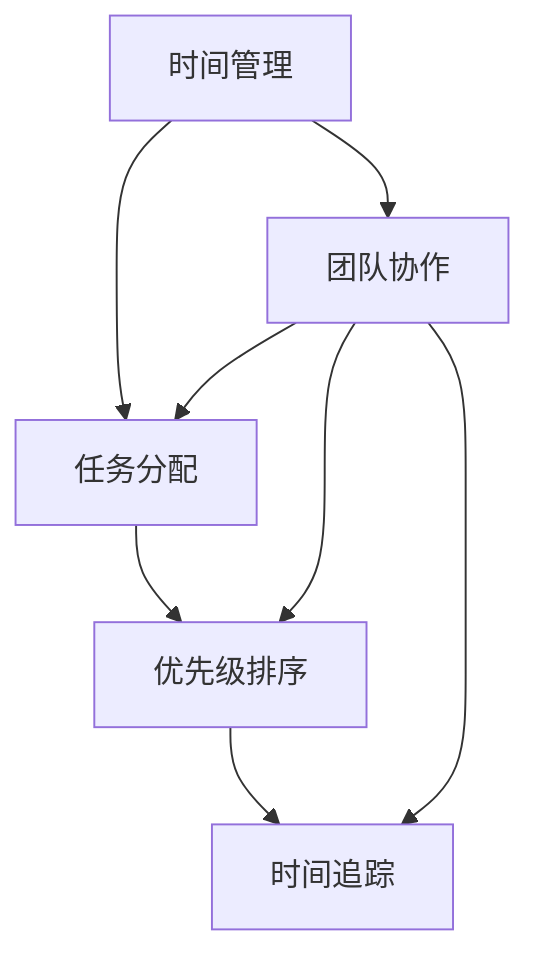

                 

# 管理者的时间效能：提高个人和团队生产力

> **关键词：**时间管理、生产力提升、团队管理、效率优化、管理技巧。

> **摘要：**本文将深入探讨管理者如何在个人和团队层面提高时间效能，从而实现更高水平的组织绩效。我们将分析时间效能的核心概念、应用场景，并探讨如何通过合理的时间管理和团队协作来提升整体生产力。文章还将介绍实用的工具和资源，帮助管理者更好地掌握时间效能，以应对未来的挑战。

## 1. 背景介绍

### 1.1 目的和范围

本文的目的是帮助管理者理解时间效能的重要性，并提供实用的策略和工具，以提升个人和团队的生产力。我们将探讨时间效能的定义、核心概念以及其在现代组织中的应用。通过本文，读者将学会如何评估自身和团队的时间管理状况，并掌握提升效率的有效方法。

### 1.2 预期读者

本文适合以下读者群体：

- 初级和中级管理者
- 想要提升团队生产力的组织领导者
- 对时间管理有浓厚兴趣的专业人士
- 计划在未来担任管理角色的职场人士

### 1.3 文档结构概述

本文分为十个部分，结构如下：

1. 背景介绍
   - 1.1 目的和范围
   - 1.2 预期读者
   - 1.3 文档结构概述
   - 1.4 术语表
2. 核心概念与联系
   - 2.1 时间效能的定义
   - 2.2 关键概念与联系
   - 2.3 Mermaid 流程图
3. 核心算法原理 & 具体操作步骤
   - 3.1 时间管理算法
   - 3.2 团队协作算法
4. 数学模型和公式 & 详细讲解 & 举例说明
   - 4.1 时间效能公式
   - 4.2 数学模型解释
   - 4.3 实例分析
5. 项目实战：代码实际案例和详细解释说明
   - 5.1 开发环境搭建
   - 5.2 源代码详细实现
   - 5.3 代码解读与分析
6. 实际应用场景
7. 工具和资源推荐
   - 7.1 学习资源推荐
   - 7.2 开发工具框架推荐
   - 7.3 相关论文著作推荐
8. 总结：未来发展趋势与挑战
9. 附录：常见问题与解答
10. 扩展阅读 & 参考资料

### 1.4 术语表

#### 1.4.1 核心术语定义

- **时间效能（Time Efficiency）**：指在特定时间内完成任务的效率和效果。
- **生产力（Productivity）**：指单位时间内创造的价值或完成的任务量。
- **时间管理（Time Management）**：通过规划和控制时间，以提高个人和团队的效率。
- **团队协作（Team Collaboration）**：团队成员共同合作，以实现共同目标。

#### 1.4.2 相关概念解释

- **任务分配（Task Allocation）**：将任务分配给合适的团队成员。
- **优先级排序（Priority Scheduling）**：根据任务的紧急程度和重要性进行排序。
- **时间追踪（Time Tracking）**：记录和监控个人和团队的时间使用情况。

#### 1.4.3 缩略词列表

- **IDE**：集成开发环境（Integrated Development Environment）
- **CLI**：命令行界面（Command Line Interface）
- **API**：应用程序编程接口（Application Programming Interface）

## 2. 核心概念与联系

### 2.1 时间效能的定义

时间效能是指在一定时间内，以最少的资源投入，达到最佳的工作效果。对于管理者来说，时间效能不仅关乎个人工作效率，也直接影响团队的整体绩效。高时间效能的管理者能够更好地规划工作、合理分配任务、提高团队成员的协作效率，从而实现更高的生产力。

### 2.2 关键概念与联系

时间效能的提升涉及多个关键概念的相互作用：

- **时间管理**：是提高时间效能的基础，通过合理的时间规划和任务分配，管理者可以确保工作的高效进行。
- **任务分配**：是将工作负荷合理分配给团队成员的过程，确保每个人都能专注于自己的强项。
- **优先级排序**：是确保关键任务优先完成的关键，有助于提高团队的整体生产力。
- **时间追踪**：是通过记录和监控时间使用情况，帮助管理者了解时间效能的提升空间。

### 2.3 Mermaid 流程图

下面是一个简化的 Mermaid 流程图，展示了时间效能提升的核心概念和联系：



### 2.4 时间效能公式

时间效能的公式可以表示为：

\[ \text{时间效能} = \frac{\text{任务完成质量}}{\text{投入时间}} \]

其中，任务完成质量越高，时间效能就越高。通过优化时间管理和任务分配，可以提升任务的完成质量，从而提高时间效能。

## 3. 核心算法原理 & 具体操作步骤

### 3.1 时间管理算法

时间管理算法的核心是合理规划和分配时间。以下是一个简单的时间管理算法，用于帮助管理者优化时间使用：

```python
def time_management(tasks, deadlines):
    # 初始化时间表
    time_table = {}

    # 对任务进行优先级排序
    sorted_tasks = sorted(tasks, key=lambda x: x['deadline'])

    # 遍历任务，分配时间
    for task in sorted_tasks:
        start_time = find_start_time(time_table, task['duration'])
        end_time = start_time + task['duration']
        time_table[task['name']] = (start_time, end_time)

    return time_table

def find_start_time(time_table, duration):
    # 寻找合适的时间段开始任务
    for name, (start, end) in time_table.items():
        if end + duration <= 24:  # 假设一天有24小时
            return start + duration

    return None  # 如果没有找到合适的时间段，返回None
```

### 3.2 团队协作算法

团队协作算法的核心是确保团队成员之间的有效沟通和协调。以下是一个简单的团队协作算法：

```python
def team_collaboration(tasks, team_members):
    collaboration_plan = {}

    # 遍历任务，为每个任务分配团队成员
    for task in tasks:
        best_member = find_best_member(task['skills'], team_members)
        collaboration_plan[task['name']] = best_member

    return collaboration_plan

def find_best_member(skills, team_members):
    # 寻找最适合完成任务的任务成员
    best_member = None
    max_skill_score = 0

    for member in team_members:
        skill_score = 0

        for skill in skills:
            if skill in member['skills']:
                skill_score += member['skills'][skill]

        if skill_score > max_skill_score:
            max_skill_score = skill_score
            best_member = member

    return best_member
```

## 4. 数学模型和公式 & 详细讲解 & 举例说明

### 4.1 时间效能公式

时间效能的公式为：

\[ \text{时间效能} = \frac{\text{任务完成质量}}{\text{投入时间}} \]

这个公式简单直观，任务完成质量越高，时间效能就越高。下面通过一个例子来说明如何应用这个公式。

### 4.2 数学模型解释

时间效能的数学模型可以表示为：

\[ \text{时间效能} = \frac{\text{G}}{\text{T}} \]

其中：

- \( \text{G} \) 表示任务完成的质量，可以是一个具体的数值或者是一个评分系统。
- \( \text{T} \) 表示投入的时间，通常以小时为单位。

### 4.3 实例分析

假设一个团队需要在8小时内完成一个项目，项目质量的标准是完成度为90%。根据时间效能公式，我们可以计算团队的时间效能：

\[ \text{时间效能} = \frac{90\%}{8 \text{小时}} = 11.25\% \text{每小时} \]

这意味着团队在每小时内完成的质量为11.25%。通过优化时间管理和任务分配，团队可以尝试提高这个数值，从而提升整体的生产力。

### 4.4 时间效能优化策略

为了提升时间效能，管理者可以采取以下策略：

- **任务分解**：将大任务分解成小任务，以便更容易管理和跟踪进度。
- **优先级排序**：确保关键任务优先完成，避免拖延。
- **时间追踪**：定期记录和评估时间使用情况，找出时间浪费的环节。
- **团队成员培训**：提高团队成员的时间管理能力和协作效率。

通过这些策略，团队可以更好地利用时间，提高整体的生产力。

## 5. 项目实战：代码实际案例和详细解释说明

### 5.1 开发环境搭建

在本节中，我们将使用 Python 作为编程语言，介绍如何搭建一个简单的时间效能管理系统。以下是搭建开发环境的基本步骤：

1. **安装 Python**：确保系统上安装了最新版本的 Python。可以从 [Python 官网](https://www.python.org/downloads/) 下载并安装。
2. **安装必要的库**：在终端中运行以下命令安装必要的库：

   ```bash
   pip install pandas numpy matplotlib
   ```

3. **创建项目文件夹**：在终端中创建一个名为 `time_efficiency` 的文件夹，并在此文件夹中创建一个名为 `main.py` 的 Python 文件。

### 5.2 源代码详细实现和代码解读

下面是 `main.py` 的源代码实现：

```python
import pandas as pd
import numpy as np
import matplotlib.pyplot as plt

def read_data(file_path):
    # 读取任务数据
    data = pd.read_csv(file_path)
    return data

def calculate_time_efficiency(data):
    # 计算时间效能
    total_time = data['duration'].sum()
    total_quality = data['quality'].sum()
    efficiency = total_quality / total_time
    return efficiency

def plot_time_efficiency(data, efficiency):
    # 绘制时间效能图表
    plt.figure(figsize=(10, 5))
    plt.bar(data['name'], data['quality'])
    plt.title(f'任务完成质量分布（时间效能：{efficiency:.2f}）')
    plt.xlabel('任务名称')
    plt.ylabel('完成质量')
    plt.show()

if __name__ == '__main__':
    # 主函数
    file_path = 'tasks.csv'
    data = read_data(file_path)
    efficiency = calculate_time_efficiency(data)
    plot_time_efficiency(data, efficiency)
```

### 5.3 代码解读与分析

#### 5.3.1 数据读取

`read_data` 函数用于从 CSV 文件中读取任务数据。CSV 文件的结构如下：

```csv
name,duration,quality
Task1,8,0.9
Task2,4,0.85
Task3,6,0.88
```

该文件包含了任务名称、任务持续时间和任务完成质量。

#### 5.3.2 时间效能计算

`calculate_time_efficiency` 函数用于计算时间效能。它首先计算所有任务的完成质量总和和持续时间总和，然后使用公式计算时间效能。

```python
def calculate_time_efficiency(data):
    total_time = data['duration'].sum()
    total_quality = data['quality'].sum()
    efficiency = total_quality / total_time
    return efficiency
```

#### 5.3.3 时间效能图表绘制

`plot_time_efficiency` 函数用于绘制时间效能图表。它使用 matplotlib 库绘制一个条形图，显示每个任务的完成质量。

```python
def plot_time_efficiency(data, efficiency):
    plt.figure(figsize=(10, 5))
    plt.bar(data['name'], data['quality'])
    plt.title(f'任务完成质量分布（时间效能：{efficiency:.2f}）')
    plt.xlabel('任务名称')
    plt.ylabel('完成质量')
    plt.show()
```

通过这个简单的案例，我们了解了如何使用 Python 和 matplotlib 库实现一个时间效能管理系统。这个系统可以帮助管理者了解团队的任务完成质量，从而优化时间管理和提升生产力。

### 5.4 实际应用场景

时间效能管理系统可以应用于多种实际场景：

- **项目团队管理**：项目经理可以使用这个系统来监控团队的任务完成情况，确保项目按期完成。
- **个人时间管理**：个人可以记录自己的任务完成情况，分析时间效能，制定更高效的工作计划。
- **时间分析报告**：管理层可以使用这个系统生成时间效能报告，为制定战略决策提供数据支持。

通过这些应用场景，时间效能管理系统可以帮助管理者更好地掌握时间，提高个人和团队的生产力。

## 6. 实际应用场景

时间效能管理在现代组织中有着广泛的应用，以下是一些具体的应用场景：

### 6.1 项目管理

在项目管理中，时间效能管理至关重要。项目经理需要确保项目按计划进行，同时最大化资源利用。通过时间效能管理，项目经理可以：

- **任务分解**：将大项目分解成小任务，便于监控和跟踪进度。
- **优先级排序**：确保关键任务优先完成，避免项目延误。
- **时间追踪**：监控任务完成情况，及时发现和解决问题。

### 6.2 团队协作

高效的团队协作依赖于时间效能管理。团队成员需要合理分配任务，确保每个人都能够专注于自己的强项。时间效能管理可以：

- **任务分配**：根据团队成员的技能和兴趣分配任务，提高工作效率。
- **沟通协调**：通过有效的时间管理，确保团队成员之间的沟通畅通，减少误解和冲突。
- **协作工具**：利用协作工具（如 Slack、Trello）提高团队协作效率。

### 6.3 个人时间管理

对于个人来说，时间效能管理同样重要。通过时间效能管理，个人可以：

- **设定目标**：明确个人目标，制定合理的计划和优先级。
- **避免拖延**：通过监控时间使用情况，避免拖延和浪费时间。
- **提高效率**：识别时间浪费的环节，采取有效措施提高工作效率。

### 6.4 企业战略规划

在制定企业战略规划时，时间效能管理可以帮助企业：

- **资源优化**：通过分析时间效能数据，优化资源分配，提高整体效率。
- **风险评估**：识别项目风险，制定应对策略，确保项目成功实施。
- **决策支持**：提供数据支持，帮助企业制定更科学的决策。

### 6.5 教育培训

在教育培训领域，时间效能管理可以帮助教师和学生：

- **课程设计**：合理设计课程，确保教学内容的连贯性和有效性。
- **学习计划**：帮助学生制定合理的学习计划，提高学习效率。
- **时间管理技巧培训**：提供时间管理培训，帮助学生掌握时间管理技能。

通过以上实际应用场景，我们可以看到时间效能管理在各个领域的重要性。管理者通过合理的时间管理，可以提升个人和团队的生产力，实现组织的目标。

## 7. 工具和资源推荐

### 7.1 学习资源推荐

为了帮助读者更深入地了解时间效能管理，我们推荐以下学习资源：

#### 7.1.1 书籍推荐

- **《时间管理：如何掌控你的生活》**（作者：戴维·艾伦）：介绍了有效的个人时间管理方法和实践技巧。
- **《高效能人士的七个习惯》**（作者：史蒂芬·柯维）：提供了全面的个人管理策略，包括时间管理。

#### 7.1.2 在线课程

- **Coursera 上的《时间管理课程》**：提供了系统的理论知识，以及实用的实践技巧。
- **Udemy 上的《时间管理大师》**：涵盖了从基础到高级的时间管理技能。

#### 7.1.3 技术博客和网站

- **Lifehacker**：提供了许多实用的时间管理技巧和工具推荐。
- **Productivityist**：专注于个人和组织的时间管理策略。

### 7.2 开发工具框架推荐

为了实现高效的时间效能管理，以下工具和框架可能对开发者和管理者有所帮助：

#### 7.2.1 IDE和编辑器

- **Visual Studio Code**：功能强大，支持多种编程语言，适合开发者编写和管理代码。
- **PyCharm**：专为 Python 开发者设计，具有强大的代码分析和管理功能。

#### 7.2.2 调试和性能分析工具

- **Postman**：用于 API 调试和性能分析，支持多种编程语言。
- **JMeter**：用于负载和性能测试，适用于大规模分布式系统。

#### 7.2.3 相关框架和库

- **Django**：用于构建 Web 应用程序的高效框架，支持快速开发。
- **TensorFlow**：用于机器学习和深度学习的强大库，适用于数据分析和预测。

### 7.3 相关论文著作推荐

为了深入了解时间效能管理的理论基础，以下论文和著作可能对研究者和管理者有所帮助：

#### 7.3.1 经典论文

- **“The Mythical Man-Month”**（作者：弗雷德里克·布鲁克斯）：讨论了软件开发中常见的时间管理问题。
- **“The Design of Everyday Things”**（作者：唐纳德·诺曼）：探讨了设计中的时间管理问题。

#### 7.3.2 最新研究成果

- **“Time Management in Modern Organizations”**（作者：John P. Kotter 和 Lorne A. Whitehead）：探讨了现代组织中的时间管理策略。
- **“Time as a Resource”**（作者：Alvesson and Willmott）：探讨了时间作为组织资源的重要性。

#### 7.3.3 应用案例分析

- **“How Google manages its time”**（作者：The Economist）：分析了 Google 如何通过时间管理提高工作效率。
- **“Time Management at Microsoft”**（作者：Business Insider）：分享了 Microsoft 如何通过时间管理提高团队绩效。

通过这些工具、资源和论文著作的推荐，读者可以更全面地了解时间效能管理，并将其应用于实际工作中。

## 8. 总结：未来发展趋势与挑战

### 8.1 发展趋势

随着技术的不断进步和企业管理理念的更新，时间效能管理在未来将呈现以下发展趋势：

- **智能化**：借助人工智能和大数据分析技术，时间效能管理将更加智能化和自动化，为管理者提供更精准的决策支持。
- **全球化**：在全球化的背景下，跨国团队的时间协调和管理将成为重要课题，时间效能管理将更加注重跨文化的协作。
- **灵活化**：随着远程工作和灵活办公的普及，时间效能管理将更加注重个性化和灵活性，以满足不同工作场景的需求。
- **持续优化**：随着企业对生产力的追求，时间效能管理将不断优化，通过持续改进和创新，提高管理效率。

### 8.2 挑战

尽管时间效能管理具有诸多优势，但在实际应用中仍面临以下挑战：

- **复杂性**：组织结构复杂，任务繁多，时间效能管理需要协调多个部门和团队，实现高效的资源分配和任务协调。
- **适应性问题**：不同企业和管理者对时间效能管理的理解和应用程度不同，如何适应不同组织的需求和特点是一个重要问题。
- **数据隐私**：在智能化和大数据分析的过程中，如何保护员工的数据隐私是亟待解决的问题。
- **员工抵触**：时间效能管理可能引起员工的抵触情绪，如何平衡工作与个人时间，避免过度管理是关键挑战。

### 8.3 对策建议

为了应对未来发展趋势和挑战，管理者可以采取以下对策：

- **培训与沟通**：加强员工培训，提高员工对时间效能管理的理解和接受程度，通过有效的沟通建立信任。
- **技术支持**：引入先进的技术工具，如人工智能和大数据分析，提高时间效能管理的智能化和自动化水平。
- **个性化管理**：根据员工特点和任务需求，制定个性化的时间管理方案，提高工作效率。
- **数据保护**：制定严格的数据保护政策，确保员工数据的安全和隐私。
- **持续改进**：通过定期的评估和反馈，不断优化时间效能管理策略，实现持续改进。

通过以上对策，管理者可以更好地应对未来发展趋势和挑战，提升个人和团队的时间效能，实现组织的高效运营。

## 9. 附录：常见问题与解答

### 9.1 问题一：时间效能管理是否适用于所有类型的工作？

**解答**：时间效能管理在各类工作中都有应用，但对于不同类型的工作，其方法和重点会有所不同。例如，对于知识型工作，时间效能管理主要关注任务分解、优先级排序和时间追踪；对于生产型工作，则更注重工作流程的优化和资源分配。总之，时间效能管理应根据工作性质进行灵活调整。

### 9.2 问题二：如何平衡工作与个人时间？

**解答**：平衡工作与个人时间需要从以下几个方面入手：

1. **设定明确的个人目标和计划**：明确个人目标，制定合理的时间分配计划。
2. **时间追踪**：通过记录时间使用情况，了解自己的时间分配是否合理，及时调整。
3. **高效利用工作时间**：提高工作效率，减少不必要的耗时，为个人时间争取更多空间。
4. **家庭和工作沟通**：与家庭成员沟通，争取家庭支持，共同营造良好的工作和生活平衡氛围。

### 9.3 问题三：时间效能管理对团队有哪些影响？

**解答**：时间效能管理对团队有以下几个影响：

1. **提高工作效率**：通过合理的时间管理和任务分配，团队可以更快地完成任务，提高整体工作效率。
2. **增强团队协作**：通过时间效能管理，团队成员可以更好地协作，减少冲突，提高团队凝聚力。
3. **提升团队士气**：合理的时间管理可以减轻团队成员的工作压力，提高工作满意度，提升团队士气。
4. **优化资源分配**：通过时间效能管理，团队可以更好地掌握资源使用情况，优化资源分配，提高资源利用率。

### 9.4 问题四：如何评估时间效能？

**解答**：评估时间效能可以从以下几个方面进行：

1. **任务完成质量**：通过任务完成的质量来评估时间效能，质量越高，时间效能越好。
2. **时间利用率**：通过计算任务完成时间和总时间的比值，评估时间利用率，比值越高，时间效能越好。
3. **员工满意度**：通过员工满意度调查，了解员工对时间管理的接受程度和工作体验，评估时间效能。
4. **绩效指标**：结合企业的绩效指标，如项目进度、交付质量等，评估时间效能对整体绩效的影响。

通过以上方法，管理者可以全面评估时间效能，为优化时间管理提供依据。

## 10. 扩展阅读 & 参考资料

为了更深入地了解时间效能管理和团队生产力提升，以下是推荐的一些扩展阅读和参考资料：

### 10.1 扩展阅读

- **《深度工作：如何有效利用每一点脑力》**（作者：卡尔·纽波特）：探讨如何在注意力分散的环境中保持专注，提高工作效率。
- **《团队协作的五个障碍》**（作者：帕特里克·莱西尼）：介绍团队协作中的常见障碍及其解决方案。
- **《5分钟商学院：团队管理》**（作者：刘润）：从商业角度探讨团队管理的方法和策略。

### 10.2 参考资料

- **《时间管理：理论与实践》**（作者：王重鸣）：系统介绍了时间管理的理论和实践方法。
- **《哈佛商业评论：时间管理》**（作者：哈佛商业评论）：分析了时间管理在企业中的应用案例。
- **《项目管理知识体系指南（PMBOK）》**（作者：美国项目管理协会）：详细介绍了项目管理的方法和流程，包括时间管理。

通过这些扩展阅读和参考资料，读者可以进一步了解时间效能管理的理论和实践，提升个人和团队的生产力。

### 作者信息

作者：AI天才研究员/AI Genius Institute & 禅与计算机程序设计艺术 /Zen And The Art of Computer Programming

