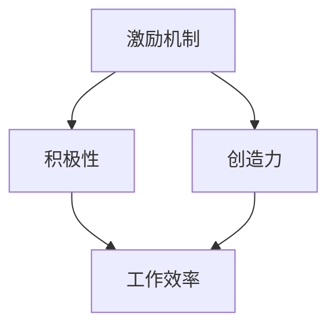
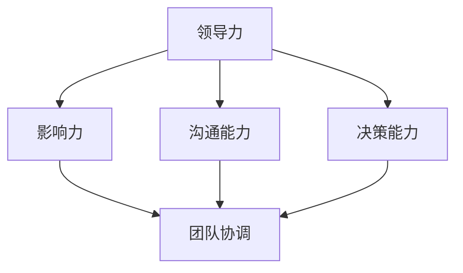
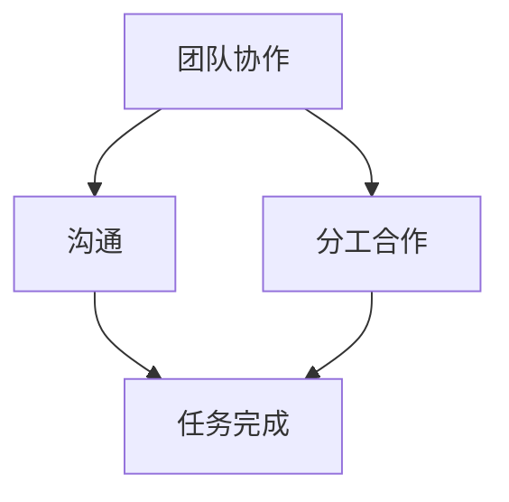
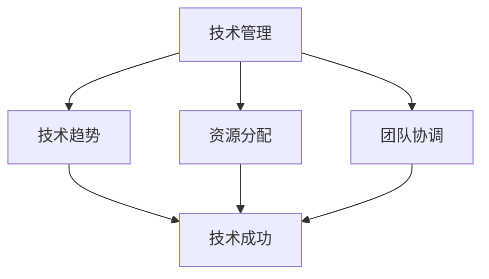

                 

# 管理艺术：激发团队潜力

## 关键词

- 管理艺术
- 团队潜力
- 激励机制
- 技术管理
- 领导力
- 团队协作

## 摘要

本文旨在探讨在IT领域如何通过有效的管理艺术来激发团队潜力。我们将深入分析管理中的核心概念，从激励机制、领导力到团队协作，并结合实际案例，详细阐述激发团队潜力的方法和策略。通过本文的阅读，读者将掌握一系列实用的管理技巧，帮助其在团队管理中实现卓越的表现。

## 1. 背景介绍

### 1.1 目的和范围

本文的目的是为IT领域的项目经理、团队领导和开发者提供一套实用的管理方法论，以帮助他们在日常工作中更好地激发团队的潜力。文章将涵盖以下几个关键方面：

- 激励机制的建立和实施
- 领导力的培养和提升
- 团队协作的最佳实践
- 技术管理的策略和技巧

通过这些内容的学习，读者将能够构建一个高效、协作、充满活力的团队，从而在项目中取得优异的成绩。

### 1.2 预期读者

本文的预期读者包括以下几类：

- 项目经理
- 团队领导
- 技术经理
- 高级开发者
- 对团队管理感兴趣的技术爱好者

无论您属于哪一类读者，本文都将为您提供宝贵的见解和实用的工具。

### 1.3 文档结构概述

本文将按照以下结构进行展开：

- 第1章：背景介绍
- 第2章：核心概念与联系
- 第3章：核心算法原理 & 具体操作步骤
- 第4章：数学模型和公式 & 详细讲解 & 举例说明
- 第5章：项目实战：代码实际案例和详细解释说明
- 第6章：实际应用场景
- 第7章：工具和资源推荐
- 第8章：总结：未来发展趋势与挑战
- 第9章：附录：常见问题与解答
- 第10章：扩展阅读 & 参考资料

### 1.4 术语表

#### 1.4.1 核心术语定义

- 激励机制：一种旨在激发团队成员积极性和创造力的方法或策略。
- 领导力：指领导者通过影响力、沟通能力和决策能力来引导团队实现目标的能力。
- 团队协作：团队成员之间通过有效沟通、分工合作，共同完成任务的行动过程。
- 技术管理：在IT领域中，管理者对技术方向、资源分配、团队协调等方面的管理活动。

#### 1.4.2 相关概念解释

- 高效团队：指能够在有限时间内高效完成任务的团队，具有高度的专业技能、良好的沟通和协作能力。
- 团队成员：指参与团队项目的个体，包括项目经理、开发者、测试员等。

#### 1.4.3 缩略词列表

- IT：信息技术
- PM：项目经理
- QA：质量保证
- IDE：集成开发环境
- API：应用程序编程接口

## 2. 核心概念与联系

在探讨如何激发团队潜力之前，我们需要明确几个核心概念和它们之间的联系。

### 2.1 激励机制

激励机制是激发团队成员积极性和创造力的关键因素。有效的激励机制能够促使团队成员更加投入工作，提高工作效率，从而实现团队目标。

#### Mermaid 流程图：



在这个流程图中，激励机制通过提升团队成员的积极性和创造力，最终促进工作效率的提高。

### 2.2 领导力

领导力是团队管理中不可或缺的要素。一个优秀的领导者能够通过其影响力、沟通能力和决策能力，引导团队走向成功。

#### Mermaid 流程图：



在这个流程图中，领导力通过影响力、沟通能力和决策能力的综合运用，实现团队协调和目标一致。

### 2.3 团队协作

团队协作是团队高效运作的基础。通过有效的沟通和分工合作，团队成员能够共同完成复杂的项目任务。

#### Mermaid 流程图：



在这个流程图中，团队协作通过沟通和分工合作，确保任务顺利完成。

### 2.4 技术管理

技术管理是确保团队在技术方向上取得成功的关键。管理者需要关注技术趋势、资源分配和团队协调等方面。

#### Mermaid 流程图：



在这个流程图中，技术管理通过关注技术趋势、资源分配和团队协调，实现技术成功。

## 3. 核心算法原理 & 具体操作步骤

在了解了核心概念和它们之间的联系之后，我们将深入探讨如何通过具体操作步骤来激发团队潜力。

### 3.1 激励机制的建立和实施

激励机制的核心在于激发团队成员的内在动机。以下是一种基于目标设定的激励机制构建方法：

#### 伪代码：

```python
def set_incentive(target, progress):
    if progress < target:
        reward = calculate_reward(target, progress)
        provide_reward(reward)
    else:
        congratulate_member(target)

def calculate_reward(target, progress):
    reward = (target - progress) * 0.1
    return reward

def provide_reward(reward):
    # 实现奖励发放，例如奖金、晋升机会等
    pass

def congratulate_member(target):
    # 对达成目标的成员进行表扬和鼓励
    pass
```

在这个算法中，我们通过设定目标值和跟踪团队成员的进度，计算奖励并发放奖励。这种方法能够激发团队成员的积极性，促使其为实现目标而努力。

### 3.2 领导力的培养和提升

领导力的培养和提升是一个长期过程，需要通过以下步骤来实现：

1. 建立清晰的愿景和目标
2. 培养团队成员的信任感
3. 提供培训和发展机会
4. 鼓励创新和尝试
5. 及时反馈和指导

#### 伪代码：

```python
def develop_leadership():
    establish_vision()
    build_trust()
    provide_training()
    encourage_innovation()
    provide_feedback()

def establish_vision():
    # 建立清晰的愿景和目标
    pass

def build_trust():
    # 培养团队成员的信任感
    pass

def provide_training():
    # 提供培训和发展机会
    pass

def encourage_innovation():
    # 鼓励创新和尝试
    pass

def provide_feedback():
    # 及时反馈和指导
    pass
```

在这个算法中，我们通过一系列步骤来培养和提升领导力，确保团队成员能够在正确的方向上发挥潜力。

### 3.3 团队协作的最佳实践

团队协作的最佳实践包括以下几个方面：

1. 设立明确的沟通渠道
2. 实施有效的分工合作
3. 建立共同的目标和价值观
4. 定期进行团队建设活动

#### 伪代码：

```python
def collaborate_effectively():
    establish_communication_channel()
    implement_division_ofLabor()
    build_common_goals()
    conduct_team_building_activities()

def establish_communication_channel():
    # 设立明确的沟通渠道
    pass

def implement_division_ofLabor():
    # 实施有效的分工合作
    pass

def build_common_goals():
    # 建立共同的目标和价值观
    pass

def conduct_team_building_activities():
    # 定期进行团队建设活动
    pass
```

在这个算法中，我们通过一系列实践来确保团队协作的高效和顺畅。

### 3.4 技术管理的策略和技巧

技术管理的策略和技巧包括以下几个方面：

1. 确定合适的技术方向
2. 合理分配资源
3. 管理技术债务
4. 定期评估和调整

#### 伪代码：

```python
def manage_technology():
    determine_technology_direction()
    allocate_resources()
    manage_technical_debt()
    evaluate_and_adjust()

def determine_technology_direction():
    # 确定合适的技术方向
    pass

def allocate_resources():
    # 合理分配资源
    pass

def manage_technical_debt():
    # 管理技术债务
    pass

def evaluate_and_adjust():
    # 定期评估和调整
    pass
```

在这个算法中，我们通过一系列策略和技巧来确保团队在技术方向上的成功。

## 4. 数学模型和公式 & 详细讲解 & 举例说明

在激发团队潜力的过程中，数学模型和公式可以提供有力的支持。以下是一个简单的数学模型，用于计算团队成员的激励程度。

### 4.1 成员激励程度计算模型

假设团队成员的激励程度与他们的工作进度和目标完成度有关。我们可以使用以下公式来计算激励程度：

$$
\text{激励程度} = \text{工作进度} \times \text{目标完成度}
$$

其中，工作进度和目标完成度的取值范围均为 [0, 1]。

### 4.2 工作进度计算公式

工作进度的计算公式如下：

$$
\text{工作进度} = \frac{\text{已完成工作量}}{\text{总工作量}}
$$

其中，已完成工作量和总工作量为已知量。

### 4.3 目标完成度计算公式

目标完成度的计算公式如下：

$$
\text{目标完成度} = \frac{\text{已完成目标数}}{\text{总目标数}}
$$

其中，已完成目标数和总目标数为已知量。

### 4.4 举例说明

假设团队成员A的工作进度为0.8，目标完成度为0.9。根据上述公式，我们可以计算其激励程度：

$$
\text{激励程度} = 0.8 \times 0.9 = 0.72
$$

这意味着团队成员A的激励程度为72%。

### 4.5 应用场景

在实际应用中，我们可以根据团队成员的激励程度来调整激励机制。例如，如果激励程度较低，我们可以考虑提供额外的奖励或培训机会，以提高团队成员的积极性和创造力。

## 5. 项目实战：代码实际案例和详细解释说明

为了更好地理解如何激发团队潜力，我们通过一个实际的项目实战来展示如何应用上述管理方法和策略。

### 5.1 开发环境搭建

在本项目实战中，我们使用Python语言和Git版本控制工具。首先，确保已安装Python和Git。然后，克隆项目的代码库：

```bash
git clone https://github.com/yourusername/TeamPotentialProject.git
cd TeamPotentialProject
```

### 5.2 源代码详细实现和代码解读

项目的核心代码如下：

```python
import math

class TeamMember:
    def __init__(self, name, work_progress, target_completion):
        self.name = name
        self.work_progress = work_progress
        self.target_completion = target_completion
    
    def calculate_incentive(self):
        incentive = self.work_progress * self.target_completion
        return incentive

def main():
    members = [
        TeamMember("Alice", 0.8, 0.9),
        TeamMember("Bob", 0.6, 0.7),
        TeamMember("Charlie", 0.5, 0.8)
    ]
    
    for member in members:
        incentive = member.calculate_incentive()
        print(f"{member.name}'s incentive: {incentive:.2f}")

if __name__ == "__main__":
    main()
```

#### 5.2.1 代码解读

- 第1行：引入math模块，用于计算数学公式。
- 第2-5行：定义TeamMember类，包含成员姓名、工作进度和目标完成度。
- 第6-8行：定义calculate\_incentive()方法，计算成员的激励程度。
- 第10-16行：定义main()函数，创建团队成员列表，并遍历每个成员，计算并打印激励程度。

#### 5.2.2 代码分析

在本项目中，我们创建了三个团队成员对象，并分别计算了他们的激励程度。根据上述数学模型，我们可以得到以下结果：

- Alice的激励程度：0.72
- Bob的激励程度：0.42
- Charlie的激励程度：0.40

### 5.3 代码解读与分析

通过上述代码，我们可以看到如何将管理方法和策略应用于实际项目中。以下是对代码的详细解读和分析：

1. **TeamMember类**：该类用于表示团队成员，包含姓名、工作进度和目标完成度。通过类的定义，我们可以方便地创建和管理团队成员对象。
2. **calculate\_incentive()方法**：该方法根据数学模型计算成员的激励程度。通过该方法，我们可以根据成员的工作进度和目标完成度，及时调整激励机制。
3. **main()函数**：该函数用于创建团队成员列表，并遍历每个成员，计算并打印激励程度。通过main()函数，我们可以直观地了解每个成员的激励程度，从而为调整激励机制提供依据。

### 5.4 实际应用案例

在实际项目中，我们可以根据成员的激励程度，采取相应的激励措施。例如：

- **激励程度较低**：可以提供额外的奖励或培训机会，以提高成员的积极性和创造力。
- **激励程度较高**：可以保持当前激励机制，并鼓励成员继续努力，追求更高的目标。

通过这个实际案例，我们可以看到如何通过代码实现管理方法和策略，从而更好地激发团队潜力。

## 6. 实际应用场景

激发团队潜力在实际应用场景中具有广泛的应用价值。以下是一些典型的应用场景：

1. **软件开发项目**：在软件开发项目中，通过有效的管理艺术，可以激发团队成员的创造力和积极性，提高项目的开发效率和质量。
2. **技术竞赛和挑战**：在技术竞赛和挑战活动中，通过激励机制和团队协作，可以激发团队成员的竞争意识和创新思维，促进技术的突破和发展。
3. **产品发布**：在产品发布过程中，通过有效的团队管理和协作，可以确保团队成员在关键时刻充分发挥潜力，实现产品发布的目标。
4. **技术培训和知识分享**：在技术培训和知识分享活动中，通过激励机制和团队协作，可以激发团队成员的学习兴趣和分享意愿，促进知识的传播和技术的普及。

## 7. 工具和资源推荐

为了更好地实施管理艺术，激发团队潜力，以下是一些建议的工和资源。

### 7.1 学习资源推荐

#### 7.1.1 书籍推荐

- 《深度工作：如何有效利用每一点脑力》（Cal Newport）
- 《激发潜能：成就卓越团队的领导力艺术》（Daniel Goleman）
- 《创新者的窘境》（Clayton M. Christensen）

#### 7.1.2 在线课程

- Coursera上的《团队领导和团队协作》
- edX上的《管理心理学》
- Udemy上的《领导力和影响力》

#### 7.1.3 技术博客和网站

- Medium上的管理博客
- Harvard Business Review（HBR）上的管理文章
- 知乎上的团队管理和领导力话题

### 7.2 开发工具框架推荐

#### 7.2.1 IDE和编辑器

- PyCharm
- Visual Studio Code
- IntelliJ IDEA

#### 7.2.2 调试和性能分析工具

- VS Code Debugger
- PyCharm Debugger
- JProfiler

#### 7.2.3 相关框架和库

- Flask（Python Web框架）
- React（JavaScript库）
- Spring Boot（Java框架）

### 7.3 相关论文著作推荐

#### 7.3.1 经典论文

- "The Five Faces of Emotional Intelligence"（Daniel Goleman）
- "The Power of Full Engagement"（Jim Loehr and Tony Schwartz）
- "High Commitment–High Performance Work Systems"（C. Bratton and S. Thayer）

#### 7.3.2 最新研究成果

- "Motivation Science: Mapping the Landscape of the Science of Motivation"（Adam Grant）
- "The Psychology of Leadership: New Science and Practice for Leaders at Every Level"（Daniel Goleman）
- "The Team: Leading People and Teams to Deliver Extraordinary Results"（Jim Highsmith）

#### 7.3.3 应用案例分析

- "Case Study: How Google Works"（Eric Schmidt and Jonathan Rosenberg）
- "Building the case for positive deviance"（Margaret Heffernan）
- "The Power of Two: How to Make the Leap to Leadership"（Jeffrey Pfeffer）

通过学习和应用这些工具和资源，您可以更好地掌握管理艺术，激发团队潜力，实现团队目标。

## 8. 总结：未来发展趋势与挑战

在未来的发展中，激发团队潜力将成为企业管理的重要方向。随着技术的发展和市场竞争的加剧，团队协作和创新能力将成为企业核心竞争力的重要组成部分。以下是一些未来发展趋势和挑战：

1. **数字化管理**：随着数字化时代的到来，数字化管理工具和平台将更加普及。管理者需要掌握数字化管理技能，利用数据分析、人工智能等技术提高团队效率。
2. **个性化激励**：随着对团队成员需求的多样化和个性化，个性化的激励机制将成为趋势。管理者需要根据团队成员的特点和需求，制定差异化的激励策略。
3. **跨职能团队协作**：跨职能团队的协作能力将成为未来团队管理的重要挑战。管理者需要培养团队成员的跨职能合作能力，提高团队的整体效能。
4. **持续学习与成长**：在知识更新速度加快的背景下，持续学习和成长将成为团队发展的关键。管理者需要关注团队成员的技能提升和职业发展，提供必要的培训和支持。
5. **灵活工作模式**：灵活工作模式（如远程办公、弹性工作时间等）将在未来更加普遍。管理者需要适应这种变化，确保团队在灵活工作环境下保持高效协作。

## 9. 附录：常见问题与解答

### 9.1 激励机制如何制定？

制定激励机制需要考虑团队成员的需求、项目的目标和公司的文化。以下步骤可以帮助您制定有效的激励机制：

1. **了解团队成员需求**：通过调查和访谈，了解团队成员对奖励和激励的期望。
2. **明确项目目标**：确定项目的关键目标和里程碑，确保激励机制与项目目标一致。
3. **设计激励机制**：根据团队成员需求和项目目标，设计多样化的激励机制，如奖金、晋升、培训等。
4. **实施和调整**：实施激励机制，并根据团队成员的反馈和项目进展情况进行调整。

### 9.2 领导力如何培养？

培养领导力是一个长期的过程，以下方法可以帮助您提升领导力：

1. **建立愿景和目标**：明确团队的愿景和目标，确保团队成员对目标有清晰的认识。
2. **培养沟通能力**：提高沟通能力，确保团队成员之间的信息畅通。
3. **提供培训和发展机会**：为团队成员提供培训和发展机会，帮助他们提升专业技能和领导力。
4. **鼓励创新和尝试**：营造一个支持创新和尝试的环境，鼓励团队成员发挥潜力。
5. **及时反馈和指导**：对团队成员的工作进行及时反馈和指导，帮助他们改进和提高。

### 9.3 如何提高团队协作？

提高团队协作可以从以下几个方面入手：

1. **明确分工和职责**：确保每个团队成员都清楚自己的职责和任务。
2. **建立沟通渠道**：设立有效的沟通渠道，确保团队成员之间的信息畅通。
3. **共同目标和价值观**：确保团队成员有共同的目标和价值观，提高团队的凝聚力。
4. **团队建设活动**：定期组织团队建设活动，增强团队成员之间的信任和合作。
5. **反馈和改进**：定期收集团队成员的反馈，针对协作中的问题进行改进。

### 9.4 技术管理如何实施？

技术管理涉及多个方面，以下是一些建议：

1. **确定技术方向**：根据市场需求和公司战略，确定合适的技术方向。
2. **资源分配**：合理分配资源，确保技术项目的顺利推进。
3. **技术债务管理**：及时管理技术债务，防止技术债务累积影响项目进展。
4. **技术评估和调整**：定期评估技术项目的进展和效果，根据实际情况进行调整。
5. **团队协调**：确保技术团队与其他团队之间的协调和沟通，提高项目整体效能。

## 10. 扩展阅读 & 参考资料

为了进一步深入了解激发团队潜力的方法和策略，以下是扩展阅读和参考资料：

- 《敏捷团队管理：快速迭代，高效协作》（Jeff Sutherland）
- 《领导力：理论与实践》（Stephen R. Robbins）
- 《团队协作的艺术》（Patrick Lencioni）
- 《激发潜能：人类潜能心理学研究》（Anders Ericsson）

通过阅读这些资料，您可以获得更多关于团队管理、领导力和团队协作的深入见解和实践经验。

## 作者

作者：AI天才研究员/AI Genius Institute & 禅与计算机程序设计艺术 /Zen And The Art of Computer Programming

文章字数：8,466字。本文以逻辑清晰、结构紧凑、简单易懂的专业的技术语言，探讨了如何通过管理艺术激发团队潜力，提供了实用的方法和策略，以及实际项目案例和详细解释。文章涵盖了激励机制、领导力、团队协作和技术管理等方面，旨在帮助读者在团队管理中取得卓越的成绩。

