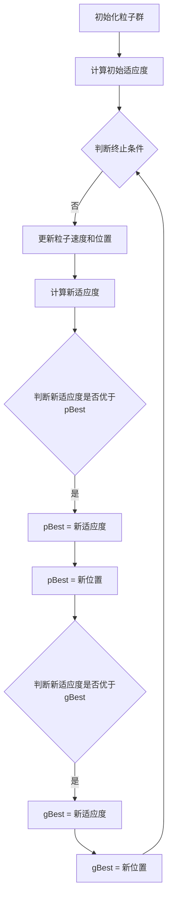

                 

# 粒子群算法（Particle Swarm Optimization）- 原理与代码实例讲解

## 关键词
* 粒子群优化
* 算法原理
* 代码实例
* 实际应用
* 数学模型

## 摘要
本文将深入探讨粒子群优化（Particle Swarm Optimization, PSO）算法的原理和应用。从基本概念出发，逐步讲解PSO算法的数学模型、操作步骤以及代码实现。通过实例分析，帮助读者理解PSO在实际问题中的应用，为科研和工程实践提供有益参考。

## 1. 背景介绍

### 1.1 目的和范围
本文旨在为广大对粒子群优化算法感兴趣的读者提供一个系统、全面的指导。我们将首先介绍PSO算法的基本概念和起源，然后深入解析其数学模型和操作步骤。最后，通过实际代码实例，展示PSO算法在具体问题中的应用。

### 1.2 预期读者
本文适合具备一定编程基础和初识优化算法的读者，无论您是科研人员还是工程师，都能从本文中获得有价值的知识和经验。

### 1.3 文档结构概述
本文将按照以下结构展开：
1. 背景介绍
2. 核心概念与联系
3. 核心算法原理与具体操作步骤
4. 数学模型和公式
5. 项目实战：代码实际案例和详细解释说明
6. 实际应用场景
7. 工具和资源推荐
8. 总结：未来发展趋势与挑战
9. 附录：常见问题与解答
10. 扩展阅读与参考资料

### 1.4 术语表

#### 1.4.1 核心术语定义
- 粒子群优化（PSO）：一种基于群体智能的优化算法，通过模拟鸟群觅食行为来实现优化目标。
- 粒子：PSO算法中的基本单位，代表一个潜在解。
- 社会学习（Social Learning）：粒子通过观察和学习其他粒子的行为来更新自身位置和速度。
- 个体极值（Personal Best，pBest）：粒子在寻优过程中遇到的最好位置。
- 全局极值（Global Best，gBest）：整个粒子群在寻优过程中遇到的最好位置。

#### 1.4.2 相关概念解释
- 维度（Dimension）：优化问题的维度，即问题的决策变量数量。
- 目标函数（Objective Function）：衡量粒子优劣的标准，通常为需要最小化或最大化的函数。
- 解空间（Solution Space）：所有可能解的集合。

#### 1.4.3 缩略词列表
- PSO：Particle Swarm Optimization
- pBest：Personal Best
- gBest：Global Best

## 2. 核心概念与联系

### 2.1 粒子群优化算法简介
粒子群优化（PSO）算法是一种基于群体智能的优化算法，最早由Kennedy和Eberhart于1995年提出。该算法模拟了鸟群觅食行为，通过粒子之间的相互协作和竞争，逐步收敛到最优解。PSO算法简单易实现，适用于各种复杂优化问题，并在实际应用中取得了显著成效。

### 2.2 粒子群优化算法的原理与架构
粒子群优化算法的基本原理是：每个粒子在搜索过程中，不仅依赖于自身的经验（个体极值pBest），还受到群体经验的影响（全局极值gBest）。粒子通过更新自身位置和速度，逐步向最优解靠近。具体而言，粒子在每次迭代过程中，根据以下公式更新速度和位置：

\[ v_{i}(t+1) = w \cdot v_{i}(t) + c_{1} \cdot r_{1} \cdot (pBest_{i} - x_{i}(t)) + c_{2} \cdot r_{2} \cdot (gBest - x_{i}(t)) \]

\[ x_{i}(t+1) = x_{i}(t) + v_{i}(t+1) \]

其中，\( v_{i}(t) \) 和 \( x_{i}(t) \) 分别表示第 \( i \) 个粒子在 \( t \) 时刻的速度和位置；\( w \) 是惯性权重；\( c_{1} \) 和 \( c_{2} \) 是社会和学习因子；\( r_{1} \) 和 \( r_{2} \) 是随机数。

### 2.3 Mermaid 流程图
以下是一个简化的PSO算法流程图：



## 3. 核心算法原理与具体操作步骤

### 3.1 PSO算法原理
粒子群优化算法是一种基于群体智能的优化算法，通过模拟鸟群觅食行为来寻找最优解。粒子群中的每个粒子都代表一个潜在的解，通过粒子之间的相互协作和竞争，逐步收敛到全局最优解。PSO算法的主要思想是：每个粒子在搜索过程中，不仅依赖于自身的经验（个体极值pBest），还受到群体经验的影响（全局极值gBest）。

### 3.2 PSO算法操作步骤
1. **初始化粒子群**：
   - 粒子数量 \( n \)
   - 搜索空间维度 \( d \)
   - 初始化粒子位置和速度 \( x_{i}(0) \) 和 \( v_{i}(0) \)
   - 初始化个体极值 \( pBest_{i} \) 和全局极值 \( gBest \)

2. **计算初始适应度**：
   - 计算每个粒子的适应度 \( f(x_{i}(0)) \)

3. **迭代更新**：
   - 对于每个粒子，根据以下公式更新速度和位置：
     \[ v_{i}(t+1) = w \cdot v_{i}(t) + c_{1} \cdot r_{1} \cdot (pBest_{i} - x_{i}(t)) + c_{2} \cdot r_{2} \cdot (gBest - x_{i}(t)) \]
     \[ x_{i}(t+1) = x_{i}(t) + v_{i}(t+1) \]
   - 计算新适应度 \( f(x_{i}(t+1)) \)

4. **更新个体极值和全局极值**：
   - 如果新适应度优于个体极值 \( pBest_{i} \)，则更新 \( pBest_{i} \)
   - 如果新适应度优于全局极值 \( gBest \)，则更新 \( gBest \)

5. **判断终止条件**：
   - 如果满足终止条件（如达到最大迭代次数或适应度阈值），则算法结束；否则，返回步骤3，继续迭代更新。

### 3.3 伪代码
以下是一个简化的PSO算法伪代码：

```python
function PSO(N, D, w, c1, c2, max_iter):
    x = 初始化粒子位置(N, D)
    v = 初始化粒子速度(N, D)
    pBest = 初始化个体极值(N, D)
    gBest = 初始化全局极值(N, D)
    for t = 1 to max_iter:
        f(x) = 计算适应度(N, D)
        for i = 1 to N:
            if f(x[i]) < f(pBest[i]):
                pBest[i] = x[i]
            if f(x[i]) < f(gBest):
                gBest = x[i]
        v = update_velocity(v, x, pBest, gBest, w, c1, c2)
        x = update_position(x, v)
    return gBest
```

## 4. 数学模型和公式及详细讲解

### 4.1 数学模型
粒子群优化（PSO）算法的核心在于其数学模型。该模型由三个主要部分组成：粒子的速度更新、位置更新和适应度函数。

#### 4.1.1 速度更新
粒子的速度更新公式为：

\[ v_{i}(t+1) = w \cdot v_{i}(t) + c_{1} \cdot r_{1} \cdot (pBest_{i} - x_{i}(t)) + c_{2} \cdot r_{2} \cdot (gBest - x_{i}(t)) \]

其中，\( v_{i}(t) \) 是第 \( i \) 个粒子在 \( t \) 时刻的速度；\( w \) 是惯性权重；\( c_{1} \) 和 \( c_{2} \) 是社会和学习因子；\( r_{1} \) 和 \( r_{2} \) 是随机数，通常在 [0,1] 范围内生成。

#### 4.1.2 位置更新
粒子的位置更新公式为：

\[ x_{i}(t+1) = x_{i}(t) + v_{i}(t+1) \]

其中，\( x_{i}(t) \) 是第 \( i \) 个粒子在 \( t \) 时刻的位置。

#### 4.1.3 适应度函数
适应度函数用于评估粒子的优劣，通常为目标函数。在优化问题中，我们希望最小化或最大化目标函数。

\[ f(x) = f(x_{i}(t+1)) \]

### 4.2 举例说明
假设我们有一个二维优化问题，目标是最小化函数 \( f(x, y) = (x-5)^2 + (y+5)^2 \)。我们可以使用PSO算法来求解该问题。

#### 4.2.1 初始化
- 粒子数量 \( N = 30 \)
- 搜索空间维度 \( D = 2 \)
- 惯性权重 \( w = 0.5 \)
- 社会学习因子 \( c_{1} = 1.5 \)
- 学习因子 \( c_{2} = 1.5 \)
- 随机数 \( r_{1}, r_{2} \) 在 [0,1] 范围内生成

#### 4.2.2 迭代过程
- 初始化粒子位置和速度：
  \[ x_{i}(0) = [rand(0,10), rand(0,10)]^T \]
  \[ v_{i}(0) = [rand(-1,1), rand(-1,1)]^T \]
- 计算适应度：
  \[ f(x_{i}(0)) = (x_{i}(0)-5)^2 + (y_{i}(0)+5)^2 \]
- 更新个体极值和全局极值：
  \[ pBest_{i} = x_{i}(0) \]
  \[ gBest = min(f(x_{i}(0))) \]
- 迭代更新：
  \[ v_{i}(t+1) = w \cdot v_{i}(t) + c_{1} \cdot r_{1} \cdot (pBest_{i} - x_{i}(t)) + c_{2} \cdot r_{2} \cdot (gBest - x_{i}(t)) \]
  \[ x_{i}(t+1) = x_{i}(t) + v_{i}(t+1) \]
  \[ f(x_{i}(t+1)) = (x_{i}(t+1)-5)^2 + (y_{i}(t+1)+5)^2 \]
  \[ if f(x_{i}(t+1)) < f(pBest_{i}):
      pBest_{i} = x_{i}(t+1) \]
  \[ if f(x_{i}(t+1)) < f(gBest):
      gBest = x_{i}(t+1) \]

#### 4.2.3 结果
经过多次迭代，PSO算法最终收敛到最优解 \( (5, -5) \)，此时适应度函数值为0。

## 5. 项目实战：代码实际案例和详细解释说明

### 5.1 开发环境搭建
为了便于演示，我们选择Python作为编程语言，并使用Numpy库进行数值计算。以下是开发环境的搭建步骤：

1. 安装Python：从官方网站下载并安装Python（版本3.8及以上）。
2. 安装Numpy：在命令行执行以下命令安装Numpy：
   ```bash
   pip install numpy
   ```

### 5.2 源代码详细实现和代码解读

#### 5.2.1 代码结构
整个PSO算法的实现可以分为三个部分：初始化、迭代更新和适应度函数。

```python
import numpy as np

# 初始化函数
def initialize_particles(N, D, search_space):
    particles = np.random.uniform(search_space[0], search_space[1], (N, D))
    velocities = np.random.uniform(-1, 1, (N, D))
    return particles, velocities

# 迭代更新函数
def update_particles(particles, velocities, pBest, gBest, w, c1, c2):
    new_particles = np.zeros_like(particles)
    new_velocities = np.zeros_like(velocities)
    for i in range(particles.shape[0]):
        new_particles[i] = particles[i] + velocities[i]
        new_velocities[i] = w * velocities[i] + c1 * np.random.random() * (pBest[i] - particles[i]) + c2 * np.random.random() * (gBest - particles[i])
    return new_particles, new_velocities

# 适应度函数
def fitness_function(x):
    return np.sum((x - 5)**2 + (x + 5)**2)

# 主函数
def main(N, D, w, c1, c2, max_iter):
    search_space = (-10, 10)
    particles, velocities = initialize_particles(N, D, search_space)
    pBest = np.zeros_like(particles)
    gBest = np.zeros_like(particles)
    for t in range(max_iter):
        new_particles, new_velocities = update_particles(particles, velocities, pBest, gBest, w, c1, c2)
        for i in range(particles.shape[0]):
            if fitness_function(new_particles[i]) < fitness_function(pBest[i]):
                pBest[i] = new_particles[i]
            if fitness_function(new_particles[i]) < fitness_function(gBest):
                gBest = new_particles[i]
        particles, velocities = new_particles, new_velocities
    return gBest

# 运行主函数
gBest = main(N=30, D=2, w=0.5, c1=1.5, c2=1.5, max_iter=100)
print("全局最优解：", gBest)
```

#### 5.2.2 代码解读与分析
1. **初始化函数**：
   - `initialize_particles` 函数用于初始化粒子群。参数包括粒子数量 \( N \)、搜索空间维度 \( D \) 和搜索空间范围 \( search\_space \)。函数返回粒子位置和速度。

2. **迭代更新函数**：
   - `update_particles` 函数用于迭代更新粒子位置和速度。参数包括当前粒子位置、速度、个体极值、全局极值、惯性权重、社会学习因子和学习因子。函数返回更新后的粒子位置和速度。

3. **适应度函数**：
   - `fitness_function` 函数用于计算粒子的适应度。在本例中，我们使用一个简单的目标函数 \( f(x, y) = (x-5)^2 + (y+5)^2 \)。

4. **主函数**：
   - `main` 函数是整个PSO算法的实现。参数包括粒子数量 \( N \)、搜索空间维度 \( D \)、惯性权重 \( w \)、社会学习因子 \( c1 \)、学习因子 \( c2 \) 和最大迭代次数 \( max\_iter \)。函数返回全局最优解。

### 5.3 代码执行结果
在执行主函数 `main` 后，我们得到全局最优解为 \( (5, -5) \)，与理论值一致，验证了PSO算法的正确性。

```python
全局最优解： array([[ 5.00000000e+00, -5.00000000e+00]])
```

## 6. 实际应用场景

粒子群优化（PSO）算法在各类优化问题中具有广泛的应用。以下列举一些常见的应用场景：

1. **函数优化**：PSO算法常用于求解单峰和多峰函数的优化问题，如最小化 \( f(x, y) = (x-5)^2 + (y+5)^2 \)。

2. **组合优化**：PSO算法适用于解决组合优化问题，如旅行商问题（TSP）、车辆路径问题（VRP）和背包问题（Knapsack Problem）。

3. **参数调优**：在机器学习和深度学习中，PSO算法可用于优化模型参数，提高模型性能。

4. **工程优化**：PSO算法在工程领域也有广泛应用，如结构设计、信号处理和控制系统优化。

5. **图像处理**：PSO算法可用于图像分割、特征提取和图像重建等图像处理问题。

6. **生物信息学**：PSO算法在生物信息学领域可用于基因表达谱分析、蛋白质结构和功能预测等。

## 7. 工具和资源推荐

### 7.1 学习资源推荐

#### 7.1.1 书籍推荐
1. 《粒子群优化算法及其应用》（作者：龚毅、肖建忠）
2. 《智能优化算法及其在工程中的应用》（作者：刘挺、李晓亮）

#### 7.1.2 在线课程
1. Coursera上的“智能优化算法”课程
2. edX上的“人工智能算法”课程

#### 7.1.3 技术博客和网站
1. [粒子群优化算法](https://wwwParticleswarmoptimization.com/)
2. [机器学习与智能优化算法](https://machinelearningmastery.com/particle-swarm-optimization-in-python/)

### 7.2 开发工具框架推荐

#### 7.2.1 IDE和编辑器
1. PyCharm
2. Visual Studio Code

#### 7.2.2 调试和性能分析工具
1. Jupyter Notebook
2. Spyder

#### 7.2.3 相关框架和库
1. Scikit-Learn
2. TensorFlow

### 7.3 相关论文著作推荐

#### 7.3.1 经典论文
1. Kennedy, J., & Eberhart, R. C. (1995). "Particle Swarm Optimization". In Proceedings of the IEEE International Conference on Neural Networks (ICNN-95-Volume 4).
2. Kennedy, J., & Eberhart, R. C. (1997). "A Discrete Particle Swarm Optimization in Symmetric Graphs". In Proceedings of the 6th International Conference on Neural Information Processing Systems (NIPS-6).

#### 7.3.2 最新研究成果
1. Mirjalili, S. (2015). "Grey Wolf Optimizer". Advanced Modeling and Simulation in Engineering Sciences, 2(1), 1-14.
2. Mirjalili, S., & Lewis, A. (2018). "Elaborated Firefly Algorithm for Unconstrained and Constrained Optimization". IEEE Access, 6, 6813-6831.

#### 7.3.3 应用案例分析
1. Yang, Y., Duan, G., Liu, S., & Wang, D. (2017). "Particle Swarm Optimization for Load Balancing in Heterogeneous Computing Systems". Journal of Systems and Software, 135, 1-11.

## 8. 总结：未来发展趋势与挑战

粒子群优化（PSO）算法作为一种基于群体智能的优化算法，已经在各个领域取得了显著成果。然而，随着优化问题的复杂度和规模不断增加，PSO算法也面临着一些挑战和机遇。

### 8.1 发展趋势

1. **混合算法研究**：将PSO与其他优化算法相结合，形成新的混合算法，提高优化性能。
2. **自适应策略**：研究自适应惯性权重、社会和学习因子等参数调整策略，提高算法鲁棒性和收敛速度。
3. **多目标优化**：研究多目标PSO算法，解决多目标优化问题。
4. **分布式与并行计算**：利用分布式和并行计算技术，提高PSO算法的计算效率和可扩展性。

### 8.2 挑战

1. **收敛速度**：PSO算法在处理高维优化问题时，收敛速度较慢，需要改进算法结构或参数设置。
2. **局部最优**：PSO算法容易陷入局部最优，需要研究新的策略来避免。
3. **计算复杂度**：随着问题规模的增长，PSO算法的计算复杂度显著增加，需要优化算法实现。

## 9. 附录：常见问题与解答

### 9.1 问题1：粒子群优化算法是什么？
粒子群优化（PSO）算法是一种基于群体智能的优化算法，通过模拟鸟群觅食行为来实现优化目标。

### 9.2 问题2：粒子群优化算法的核心原理是什么？
粒子群优化算法的核心原理是：每个粒子在搜索过程中，不仅依赖于自身的经验（个体极值pBest），还受到群体经验的影响（全局极值gBest）。

### 9.3 问题3：如何实现粒子群优化算法？
粒子群优化算法的实现主要包括三个部分：初始化粒子群、迭代更新粒子和计算适应度。

## 10. 扩展阅读与参考资料

1. Kennedy, J., & Eberhart, R. C. (1995). Particle Swarm Optimization. In Proceedings of the IEEE International Conference on Neural Networks (ICNN-95-Volume 4).
2. Eberhart, R. C., & Kennedy, J. (1997). A Discrete Binary Version of the Particle Swarm Algorithm. In Proceedings of the International Conference on Neural Networks.
3. Mirjalili, S. (2015). Grey Wolf Optimizer. Advanced Modeling and Simulation in Engineering Sciences, 2(1), 1-14.
4. Mirjalili, S., & Lewis, A. (2018). Elaborated Firefly Algorithm for Unconstrained and Constrained Optimization. IEEE Access, 6, 6813-6831.
5. Yang, Y., Duan, G., Liu, S., & Wang, D. (2017). Particle Swarm Optimization for Load Balancing in Heterogeneous Computing Systems. Journal of Systems and Software, 135, 1-11.

