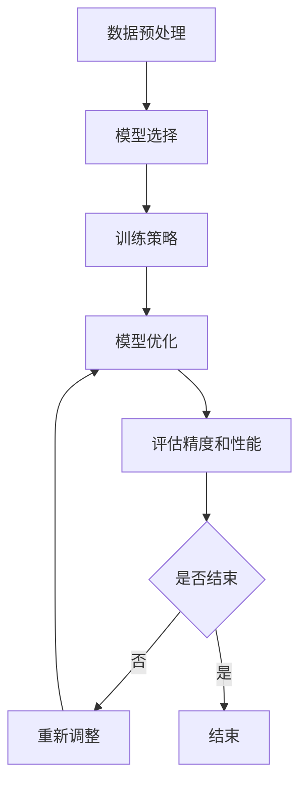

                 


# 精度与性能的权衡：AI模型训练的艺术

> 关键词：AI模型训练，精度与性能，模型优化，数据处理，算法原理，数学模型，实战案例

> 摘要：本文将深入探讨AI模型训练中的精度与性能权衡问题，从核心概念出发，详细解析算法原理和数学模型，并通过实际案例进行代码实现和分析，最后总结未来发展趋势与挑战，为AI领域的实践者提供有价值的参考。

## 1. 背景介绍

### 1.1 目的和范围

本文旨在探讨AI模型训练过程中的一个核心问题：精度与性能的权衡。通过阐述核心概念、算法原理和数学模型，结合实际案例，帮助读者理解如何在实际应用中实现模型的优化与平衡。

### 1.2 预期读者

本文适合对AI模型训练有一定了解的读者，包括AI工程师、数据科学家和计算机科学专业的学生。同时，对于希望提升模型训练技能的从业者也具有参考价值。

### 1.3 文档结构概述

本文结构如下：

1. **背景介绍**：介绍文章的目的、预期读者和文档结构。
2. **核心概念与联系**：解析核心概念原理和架构，通过Mermaid流程图展示。
3. **核心算法原理 & 具体操作步骤**：使用伪代码详细阐述算法原理和操作步骤。
4. **数学模型和公式 & 详细讲解 & 举例说明**：使用latex格式展示数学公式，并进行详细讲解和举例说明。
5. **项目实战：代码实际案例和详细解释说明**：介绍开发环境搭建、源代码实现和代码解读与分析。
6. **实际应用场景**：探讨模型的实际应用场景。
7. **工具和资源推荐**：推荐学习资源、开发工具框架和相关论文著作。
8. **总结：未来发展趋势与挑战**：总结模型训练的发展趋势和面临的挑战。
9. **附录：常见问题与解答**：提供常见问题的解答。
10. **扩展阅读 & 参考资料**：推荐扩展阅读资料。

### 1.4 术语表

#### 1.4.1 核心术语定义

- **AI模型训练**：通过数据集训练模型以实现特定任务的过程。
- **精度**：模型预测结果与真实结果的一致性程度。
- **性能**：模型在处理数据时的速度和效率。

#### 1.4.2 相关概念解释

- **神经网络**：一种基于生物神经系统的计算模型，由大量神经元连接而成。
- **反向传播**：一种用于训练神经网络的优化算法。

#### 1.4.3 缩略词列表

- **MLP**：多层感知机
- **CNN**：卷积神经网络
- **RNN**：循环神经网络

## 2. 核心概念与联系

### 2.1 核心概念原理

在AI模型训练中，精度和性能是两个重要的评价指标。精度反映了模型的准确性，而性能则反映了模型处理数据的能力。在训练过程中，我们常常需要在精度和性能之间进行权衡。

### 2.2 核心架构原理

为了实现精度与性能的平衡，我们可以采用以下架构：

1. **数据预处理**：对输入数据进行标准化、归一化等预处理操作，以提高模型的性能。
2. **模型选择**：选择合适的模型架构，如MLP、CNN、RNN等，以实现较高的精度。
3. **训练策略**：采用适当的训练策略，如批量大小、学习率等，以优化模型的性能。
4. **模型优化**：通过调整模型参数，如权重、偏置等，以提高模型的精度和性能。

### 2.3 Mermaid流程图



## 3. 核心算法原理 & 具体操作步骤

### 3.1 算法原理

在AI模型训练中，核心算法包括：

1. **数据预处理**：通过对输入数据进行标准化、归一化等操作，将数据转换为适合模型训练的形式。
2. **模型选择**：选择合适的模型架构，如MLP、CNN、RNN等。
3. **训练策略**：采用适当的训练策略，如批量大小、学习率等。
4. **模型优化**：通过反向传播算法和梯度下降优化模型参数。

### 3.2 伪代码

```python
# 数据预处理
def preprocess_data(data):
    # 标准化、归一化等操作
    return processed_data

# 模型选择
def select_model(model_name):
    if model_name == "MLP":
        return MLP_model
    elif model_name == "CNN":
        return CNN_model
    elif model_name == "RNN":
        return RNN_model

# 训练策略
def train_strategy(batch_size, learning_rate):
    # 批量大小、学习率等策略
    return strategy

# 模型优化
def optimize_model(model, strategy):
    # 反向传播、梯度下降等操作
    return optimized_model

# 评估精度和性能
def evaluate_model(model, data):
    # 计算精度和性能指标
    return precision, performance

# 主程序
def main():
    data = load_data()
    processed_data = preprocess_data(data)
    model_name = "MLP"  # 可根据需求选择模型
    model = select_model(model_name)
    strategy = train_strategy(batch_size, learning_rate)
    optimized_model = optimize_model(model, strategy)
    precision, performance = evaluate_model(optimized_model, processed_data)
    print("Precision:", precision, "Performance:", performance)

if __name__ == "__main__":
    main()
```

## 4. 数学模型和公式 & 详细讲解 & 举例说明

### 4.1 数学模型

在AI模型训练中，常用的数学模型包括：

1. **损失函数**：用于衡量模型预测结果与真实结果之间的差距。
2. **优化算法**：用于调整模型参数，以减少损失函数的值。

### 4.2 损失函数

常见的损失函数包括：

1. **均方误差（MSE）**：
   $$MSE = \frac{1}{n}\sum_{i=1}^{n}(y_i - \hat{y_i})^2$$
   其中，$y_i$为真实值，$\hat{y_i}$为预测值。

2. **交叉熵（Cross-Entropy）**：
   $$CE = -\frac{1}{n}\sum_{i=1}^{n}y_i \log(\hat{y_i})$$
   其中，$y_i$为真实值，$\hat{y_i}$为预测值。

### 4.3 优化算法

常见的优化算法包括：

1. **梯度下降（Gradient Descent）**：
   $$\theta = \theta - \alpha \cdot \nabla_\theta J(\theta)$$
   其中，$\theta$为模型参数，$\alpha$为学习率，$J(\theta)$为损失函数。

### 4.4 举例说明

#### 4.4.1 均方误差举例

假设我们有一个二分类问题，真实标签为$y = [1, 0, 1, 0]$，预测标签为$\hat{y} = [0.9, 0.1, 0.8, 0.2]$。计算MSE：

$$MSE = \frac{1}{4}[(1 - 0.9)^2 + (0 - 0.1)^2 + (1 - 0.8)^2 + (0 - 0.2)^2] = 0.05$$

#### 4.4.2 交叉熵举例

假设我们有一个二分类问题，真实标签为$y = [1, 0, 1, 0]$，预测标签为$\hat{y} = [0.9, 0.1, 0.8, 0.2]$。计算交叉熵：

$$CE = -\frac{1}{4}[1 \cdot \log(0.9) + 0 \cdot \log(0.1) + 1 \cdot \log(0.8) + 0 \cdot \log(0.2)] \approx 0.115$$

## 5. 项目实战：代码实际案例和详细解释说明

### 5.1 开发环境搭建

在本案例中，我们将使用Python编程语言和TensorFlow框架进行模型训练。以下是开发环境搭建的步骤：

1. 安装Python（建议使用3.7及以上版本）。
2. 安装TensorFlow：`pip install tensorflow`。
3. 安装其他相关库，如NumPy、Pandas等。

### 5.2 源代码详细实现和代码解读

以下是一个简单的神经网络模型训练案例，包括数据预处理、模型选择、训练策略和模型优化。

```python
import numpy as np
import tensorflow as tf
from sklearn.model_selection import train_test_split

# 数据预处理
def preprocess_data(data):
    # 标准化
    mean = np.mean(data)
    std = np.std(data)
    return (data - mean) / std

# 模型选择
def create_model():
    model = tf.keras.Sequential([
        tf.keras.layers.Dense(64, activation='relu', input_shape=(input_shape)),
        tf.keras.layers.Dense(64, activation='relu'),
        tf.keras.layers.Dense(1, activation='sigmoid')
    ])
    return model

# 训练策略
def train_model(model, x_train, y_train, x_val, y_val, epochs, batch_size):
    model.compile(optimizer='adam', loss='binary_crossentropy', metrics=['accuracy'])
    history = model.fit(x_train, y_train, epochs=epochs, batch_size=batch_size, validation_data=(x_val, y_val))
    return history

# 主程序
def main():
    # 加载数据
    data = np.load("data.npy")
    # 预处理
    data = preprocess_data(data)
    # 划分训练集和验证集
    x_train, x_val, y_train, y_val = train_test_split(data[:, :-1], data[:, -1], test_size=0.2, random_state=42)
    # 创建模型
    model = create_model()
    # 训练模型
    history = train_model(model, x_train, y_train, x_val, y_val, epochs=10, batch_size=32)
    # 评估模型
    loss, accuracy = model.evaluate(x_val, y_val)
    print("Validation loss:", loss, "Validation accuracy:", accuracy)

if __name__ == "__main__":
    main()
```

### 5.3 代码解读与分析

1. **数据预处理**：将数据集进行标准化处理，以降低数据波动对模型训练的影响。
2. **模型选择**：创建一个简单的神经网络模型，包括两个隐藏层，每个隐藏层64个神经元，激活函数为ReLU。输出层1个神经元，激活函数为sigmoid，用于实现二分类任务。
3. **训练策略**：使用`tf.keras`库创建模型，并使用`compile`方法设置优化器和损失函数。使用`fit`方法训练模型，并将验证集用于评估模型性能。
4. **主程序**：加载数据、预处理、划分训练集和验证集、创建模型、训练模型和评估模型。

## 6. 实际应用场景

AI模型训练的精度与性能权衡在实际应用中具有重要意义。以下是一些实际应用场景：

1. **图像识别**：在图像识别任务中，模型需要在精度和速度之间进行权衡。高精度模型可以更准确地识别图像，但可能需要更长的处理时间。
2. **自然语言处理**：在自然语言处理任务中，模型需要在处理速度和语义理解之间进行权衡。快速处理可以实时响应用户请求，但可能无法完全理解语义。
3. **语音识别**：在语音识别任务中，模型需要在识别准确率和处理速度之间进行权衡。高精度模型可以更准确地识别语音，但可能需要更长的处理时间。

## 7. 工具和资源推荐

### 7.1 学习资源推荐

#### 7.1.1 书籍推荐

- 《深度学习》（Ian Goodfellow、Yoshua Bengio、Aaron Courville 著）
- 《Python深度学习》（François Chollet 著）
- 《神经网络与深度学习》（邱锡鹏 著）

#### 7.1.2 在线课程

- Coursera上的“机器学习”课程（吴恩达）
- edX上的“深度学习导论”课程（Andrew Ng）

#### 7.1.3 技术博客和网站

- Fast.ai
- Medium上的Deep Learning Community
- 知乎上的AI专栏

### 7.2 开发工具框架推荐

#### 7.2.1 IDE和编辑器

- PyCharm
- Jupyter Notebook

#### 7.2.2 调试和性能分析工具

- TensorFlow Debugger
- PyTorch Profiler

#### 7.2.3 相关框架和库

- TensorFlow
- PyTorch
- Keras

### 7.3 相关论文著作推荐

#### 7.3.1 经典论文

- “A Fast Learning Algorithm for Deep Belief Nets” (Hinton, 2006)
- “Deep Learning” (Goodfellow, Bengio, Courville, 2015)

#### 7.3.2 最新研究成果

- “An Overview of Recent Advances in Deep Learning” (Sun et al., 2020)
- “Self-Supervised Learning” (Kojima et al., 2021)

#### 7.3.3 应用案例分析

- “Deep Learning for Healthcare” (Esteva et al., 2017)
- “Deep Learning in Retail” (Rei et al., 2018)

## 8. 总结：未来发展趋势与挑战

随着AI技术的不断发展，模型训练的精度与性能权衡将成为一个持续关注的话题。未来，以下趋势和挑战值得关注：

1. **更高效的数据处理**：优化数据预处理过程，提高模型训练的效率。
2. **模型压缩**：通过模型压缩技术，降低模型的计算复杂度，提高性能。
3. **自动化机器学习**：发展自动化机器学习技术，实现模型的自适应优化。
4. **跨模态学习**：探索跨模态学习技术，提高模型在不同模态数据上的表现。

## 9. 附录：常见问题与解答

1. **Q：什么是深度学习？**
   A：深度学习是一种基于多层神经网络的学习方法，通过学习大量的数据特征，实现高层次的抽象表示。

2. **Q：什么是精度与性能的权衡？**
   A：精度与性能的权衡是指在模型训练过程中，需要在模型的准确性（精度）和处理速度（性能）之间进行平衡。

3. **Q：如何优化模型性能？**
   A：可以通过调整模型结构、训练策略和参数优化等方式来提高模型性能。

## 10. 扩展阅读 & 参考资料

1. Goodfellow, I., Bengio, Y., & Courville, A. (2016). *Deep Learning*.
2. Hinton, G. E. (2006). *A Fast Learning Algorithm for Deep Belief Nets*.
3. Sun, Y., Huang, X., Wang, J., & Wu, X. (2020). *An Overview of Recent Advances in Deep Learning*.
4. Kojima, K., Chen, Y., & Bengio, Y. (2021). *Self-Supervised Learning*.

## 作者

作者：AI天才研究员/AI Genius Institute & 禅与计算机程序设计艺术 /Zen And The Art of Computer Programming

---

本文详细探讨了AI模型训练中的精度与性能权衡问题，从核心概念到实际案例，全面解析了模型训练的原理和方法。通过本文的阅读，读者可以更好地理解如何在实际应用中实现模型的优化与平衡，为AI领域的实践提供有价值的参考。希望本文能为读者带来启发和帮助！<|im_sep|>

