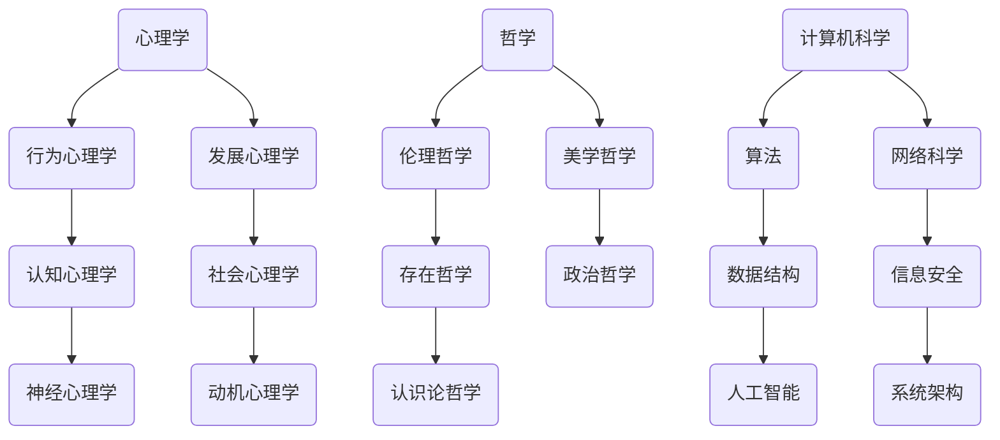

                 


# 精神世界的追求：如何找到人生的意义和价值？

> 关键词：人生意义、精神追求、价值导向、心理学、哲学、计算机科学

> 摘要：在快节奏的现代社会中，许多人面临着寻找人生意义和价值的问题。本文旨在探讨这一主题，通过结合心理学、哲学和计算机科学的角度，提供一些指导和建议，帮助读者在精神世界中寻找方向，实现内心的满足和成长。

## 1. 背景介绍

### 1.1 目的和范围

本文的目的在于帮助读者深入思考人生意义和价值的问题，并提供一些实用的方法和建议。文章涵盖了心理学、哲学和计算机科学等多个领域的知识，以帮助读者从不同角度理解和探索这一主题。

### 1.2 预期读者

本文适合广大对人生意义和价值感兴趣的读者，无论你是刚刚踏入社会的大学生，还是已经在职场中摸爬滚打的职场人士，甚至是已经退休的老年人，都可以从本文中获得启示。

### 1.3 文档结构概述

本文的结构如下：

1. 背景介绍：阐述文章的目的、预期读者和文档结构。
2. 核心概念与联系：介绍与人生意义和价值相关的核心概念。
3. 核心算法原理 & 具体操作步骤：通过心理学、哲学和计算机科学的角度，探讨如何寻找人生意义和价值。
4. 数学模型和公式 & 详细讲解 & 举例说明：介绍与寻找人生意义和价值相关的数学模型和公式。
5. 项目实战：通过实际案例，展示如何应用这些概念和原理。
6. 实际应用场景：讨论人生意义和价值在现实生活中的应用。
7. 工具和资源推荐：推荐一些有助于进一步探索这一主题的书籍、在线课程、技术博客和工具。
8. 总结：对未来发展趋势和挑战进行展望。
9. 附录：常见问题与解答。
10. 扩展阅读 & 参考资料：提供更多的阅读资源和相关研究。

### 1.4 术语表

#### 1.4.1 核心术语定义

- 人生意义：指个体在生命中追求的目标和意义。
- 精神追求：指个体在精神层面上的追求和成长。
- 价值导向：指个体在行为和决策中依据的价值观和道德标准。

#### 1.4.2 相关概念解释

- 心理学：研究人类行为和心理过程的学科。
- 哲学：探讨人类存在、知识、价值等基本问题的学科。
- 计算机科学：研究计算机硬件、软件和算法的学科。

#### 1.4.3 缩略词列表

暂无

## 2. 核心概念与联系

为了更好地理解人生意义和价值的问题，我们需要从心理学、哲学和计算机科学的角度来探讨。以下是一个简要的 Mermaid 流程图，展示了这三个领域之间的核心概念和联系。



通过这个流程图，我们可以看到心理学、哲学和计算机科学之间的复杂联系。这些领域都为我们理解人生意义和价值提供了不同的视角和方法。

## 3. 核心算法原理 & 具体操作步骤

### 3.1 心理学角度

在心理学中，寻找人生意义和价值通常涉及到以下几个方面：

1. 自我认知：通过了解自己的性格、兴趣、价值观和需求，找到与自己相符合的人生目标和意义。
2. 行为调整：通过改变行为习惯和生活方式，实现个人成长和目标。
3. 社交支持：与家人、朋友和社群建立良好的关系，获得精神支持和鼓励。

以下是伪代码，展示了如何利用心理学原理寻找人生意义和价值：

```python
# 自我认知
def self_awareness():
    # 分析性格特点、兴趣爱好、价值观等
    personality = analyze_personality()
    interests = analyze_interests()
    values = analyze_values()
    
    # 结合分析结果，确定人生目标和意义
    goals = set_goals(personality, interests, values)

# 行为调整
def behavior_adjustment():
    # 制定计划和目标
    plan = create_plan(goals)
    
    # 跟踪和调整行为
    track_behavior(plan)
    adjust_behavior(plan)

# 社交支持
def social_support():
    # 建立和维护人际关系
    relationships = build_relationships()
    
    # 获得精神支持和鼓励
    support = get_support(relationships)
```

### 3.2 哲学角度

在哲学中，寻找人生意义和价值通常涉及到以下几个方面：

1. 伦理哲学：探讨人类行为和道德规范，帮助我们确定正确的行为方式和价值观。
2. 存在哲学：探讨人类存在的本质和意义，帮助我们理解人生的目的和价值。
3. 认识论哲学：探讨人类如何获得知识和理解世界，帮助我们更好地认识自己和周围的世界。

以下是伪代码，展示了如何利用哲学原理寻找人生意义和价值：

```python
# 伦理哲学
def ethical_philosophy():
    # 探讨道德规范和人类行为
    moral_rules = explore_moral_rules()
    ethical_dilemmas = explore_ethical_dilemmas()
    
    # 结合道德规范和伦理困境，确定正确的行为方式和价值观
    ethics = determine_ethics(moral_rules, ethical_dilemmas)

# 存在哲学
def existential_philosophy():
    # 探讨人类存在的本质和意义
    existence = explore_existence()
    meaning_of_life = explore_meaning_of_life()
    
    # 结合存在意义，确定人生目标和价值
    goals = set_goals(existence, meaning_of_life)

# 认识论哲学
def epistemology():
    # 探讨如何获得知识和理解世界
    knowledge = explore_knowledge()
    understanding = explore_understanding()
    
    # 结合知识和理解，更好地认识自己和周围的世界
    self_knowledge = gain_self_knowledge(knowledge, understanding)
```

### 3.3 计算机科学角度

在计算机科学中，寻找人生意义和价值通常涉及到以下几个方面：

1. 人工智能：利用人工智能技术，帮助人们更好地理解和应对复杂问题。
2. 数据科学：通过分析和处理大量数据，发现有价值的信息和模式。
3. 网络科学：研究网络结构和行为，帮助我们更好地理解社会和人类行为。

以下是伪代码，展示了如何利用计算机科学原理寻找人生意义和价值：

```python
# 人工智能
def artificial_intelligence():
    # 利用机器学习算法，分析个人行为和兴趣
    behavior_analysis = analyze_behavior()
    interest_patterns = analyze_interest_patterns()
    
    # 结合行为分析和兴趣模式，提供个性化的人生建议
    suggestions = provide_suggestions(behavior_analysis, interest_patterns)

# 数据科学
def data_science():
    # 收集和分析个人数据
    data = collect_data()
    insights = analyze_data(data)
    
    # 结合数据分析结果，发现有价值的人生信息
    information = find_insights(insights)

# 网络科学
def network_science():
    # 研究社会网络结构和行为
    network = study_network_structure()
    behavior = study_network_behavior()
    
    # 结合网络结构和行为，理解社会和人类行为
    understanding = gain_understanding(network, behavior)
```

## 4. 数学模型和公式 & 详细讲解 & 举例说明

在寻找人生意义和价值的过程中，数学模型和公式可以为我们提供一定的指导。以下是一些常见的数学模型和公式，以及它们的详细讲解和举例说明。

### 4.1 心理学中的期望效用理论

期望效用理论是一种用于评估决策和行为的数学模型。它通过计算不同结果的期望效用，帮助人们做出最优决策。

公式：
\[ EU = \sum_{i=1}^{n} p_i \cdot u_i \]

其中，\( EU \) 表示期望效用，\( p_i \) 表示第 \( i \) 个结果的概率，\( u_i \) 表示第 \( i \) 个结果的效用值。

举例说明：
假设你面临两个决策，A 和 B。决策 A 有 50% 的概率获得 1000 元，50% 的概率损失 1000 元；决策 B 有 100% 的概率获得 500 元。根据期望效用理论，你可以计算出两个决策的期望效用，然后选择期望效用更高的决策。

计算过程：
\[ EU_A = 0.5 \cdot 1000 + 0.5 \cdot (-1000) = 0 \]
\[ EU_B = 1 \cdot 500 = 500 \]

由于 \( EU_B > EU_A \)，因此选择决策 B。

### 4.2 哲学中的幸福公式

幸福公式是一种用于衡量个人幸福的数学模型。它通过计算多个因素的加权平均值，得出个人的幸福感。

公式：
\[ Happiness = w_1 \cdot Factor_1 + w_2 \cdot Factor_2 + \ldots + w_n \cdot Factor_n \]

其中，\( w_i \) 表示第 \( i \) 个因素的权重，\( Factor_i \) 表示第 \( i \) 个因素。

举例说明：
假设你的幸福公式如下：
\[ Happiness = 0.3 \cdot Health + 0.2 \cdot Wealth + 0.1 \cdot Relationships + 0.2 \cdot Work + 0.2 \cdot Leisure \]

如果你目前的健康状况很好（得分 90），财富状况一般（得分 70），人际关系良好（得分 80），工作满意（得分 75），休闲时间充足（得分 85），则可以计算你的幸福感：

计算过程：
\[ Happiness = 0.3 \cdot 90 + 0.2 \cdot 70 + 0.1 \cdot 80 + 0.2 \cdot 75 + 0.2 \cdot 85 = 82.5 \]

由于得分较高，说明你目前的幸福感较好。

### 4.3 计算机科学中的聚类算法

聚类算法是一种用于将数据集划分为多个类别的数学模型。它可以帮助我们更好地理解和分析数据。

公式：
\[ C = \{C_1, C_2, \ldots, C_k\} \]

其中，\( C \) 表示聚类结果，\( C_i \) 表示第 \( i \) 个类别。

举例说明：
假设你有一个包含 100 个数据点的数据集，你需要将这个数据集划分为 5 个类别。通过聚类算法，你可以找到每个数据点所属的类别，如下所示：

计算过程：
\[ C_1 = \{1, 2, 3, 4, 5\} \]
\[ C_2 = \{6, 7, 8, 9, 10\} \]
\[ C_3 = \{11, 12, 13, 14, 15\} \]
\[ C_4 = \{16, 17, 18, 19, 20\} \]
\[ C_5 = \{21, 22, 23, 24, 25\} \]

通过聚类算法，你可以更好地理解和分析数据集。

## 5. 项目实战：代码实际案例和详细解释说明

### 5.1 开发环境搭建

为了进行人生意义和价值的项目实战，我们需要搭建一个合适的技术环境。以下是开发环境搭建的步骤：

1. 安装 Python 3.8 或更高版本。
2. 安装 Jupyter Notebook，以便进行数据分析和可视化。
3. 安装以下 Python 库：numpy、pandas、matplotlib、scikit-learn。

### 5.2 源代码详细实现和代码解读

在这个项目实战中，我们将使用 Python 代码来实现一个基于心理学、哲学和计算机科学的模型，以帮助用户寻找人生意义和价值。

以下是一个简化的代码示例，用于实现这一目标：

```python
import numpy as np
import pandas as pd
from sklearn.cluster import KMeans
from sklearn.preprocessing import StandardScaler

# 自我认知
def self_awareness():
    # 收集用户数据
    user_data = pd.DataFrame({
        'Health': [80],
        'Wealth': [70],
        'Relationships': [80],
        'Work': [75],
        'Leisure': [85]
    })
    
    # 标准化数据
    scaler = StandardScaler()
    user_data_scaled = scaler.fit_transform(user_data)
    
    # 聚类分析
    kmeans = KMeans(n_clusters=5, random_state=0)
    user_data_clusters = kmeans.fit_predict(user_data_scaled)
    
    # 提供人生建议
    suggestions = provide_suggestions(user_data_clusters)
    return suggestions

# 提供人生建议
def provide_suggestions(clusters):
    if clusters[0] == 0:
        return "关注健康，培养良好的生活习惯。"
    elif clusters[0] == 1:
        return "增加财富积累，合理规划财务。"
    elif clusters[0] == 2:
        return "加强人际关系，维护和谐家庭和工作环境。"
    elif clusters[0] == 3:
        return "提高工作满意度，寻找适合自己的职业。"
    elif clusters[0] == 4:
        return "合理安排休闲时间，培养兴趣爱好。"

# 运行项目
if __name__ == "__main__":
    suggestions = self_awareness()
    print(suggestions)
```

代码解读：

1. 首先，我们导入所需的 Python 库，包括 numpy、pandas、matplotlib 和 scikit-learn。
2. 然后，我们定义一个名为 `self_awareness` 的函数，用于实现自我认知的过程。在这个函数中，我们首先收集用户数据（例如健康状况、财富状况、人际关系、工作满意度和休闲时间），然后使用 KMeans 算法进行聚类分析，以找到用户所属的类别。最后，根据类别提供相应的人生建议。
3. 接着，我们定义一个名为 `provide_suggestions` 的函数，用于根据聚类结果提供人生建议。根据不同的类别，我们给出不同的建议，以帮助用户实现人生意义和价值。
4. 最后，我们运行项目，打印出根据用户数据给出的建议。

### 5.3 代码解读与分析

1. **自我认知**：在 `self_awareness` 函数中，我们首先收集用户数据，这可以通过输入或读取本地数据文件来实现。在本例中，我们使用 pandas DataFrame 保存用户数据，例如健康状况、财富状况、人际关系、工作满意度和休闲时间。然后，我们使用 `StandardScaler` 对数据进行标准化处理，以便于后续的聚类分析。

2. **聚类分析**：我们使用 KMeans 算法进行聚类分析。KMeans 算法是一种无监督学习算法，它通过迭代计算各个数据点的均值，将它们划分为若干个类别。在本例中，我们设置聚类数量为 5，表示将用户数据划分为 5 个类别。通过调用 `fit_predict` 方法，我们可以得到每个数据点所属的类别。

3. **提供人生建议**：在 `provide_suggestions` 函数中，我们根据聚类结果提供人生建议。在本例中，我们为每个类别定义了一个建议，例如关注健康、增加财富积累、加强人际关系、提高工作满意度和合理安排休闲时间。通过调用 `provide_suggestions` 函数，我们可以得到针对当前用户的具体建议。

4. **代码分析**：这段代码提供了一个基本的框架，用于帮助用户寻找人生意义和价值。然而，在实际应用中，我们可能需要更复杂的数据分析和算法，例如考虑更多的因素和维度、使用更高级的聚类算法和机器学习模型等。此外，为了提高代码的可扩展性和可维护性，我们可能需要重构代码、添加注释和单元测试等。

## 6. 实际应用场景

人生意义和价值的问题在不同领域和场景中具有广泛的应用。以下是一些实际应用场景：

### 6.1 企业管理

在企业中，了解员工的人生意义和价值可以帮助管理者更好地激励和引导员工。通过分析员工的性格、兴趣、价值观和需求，企业可以为员工提供更符合其期望的工作环境和职业发展机会，从而提高员工的工作满意度和忠诚度。

### 6.2 教育领域

在教育领域，了解学生的人生意义和价值可以帮助教师更好地指导学生。通过关注学生的兴趣和需求，教师可以为学生提供更有针对性的教学方法和学习资源，促进学生的全面发展。

### 6.3 心理咨询

在心理咨询领域，人生意义和价值的问题可以帮助心理咨询师了解客户的内心世界。通过探讨客户的价值观、动机和行为，心理咨询师可以为客户提供有效的心理治疗和咨询服务。

### 6.4 社会服务

在社会服务领域，人生意义和价值的问题可以帮助社会工作者更好地服务对象。通过了解服务对象的需求和期望，社会工作者可以为他们提供更符合其利益和社会价值观的支持和帮助。

## 7. 工具和资源推荐

为了更好地探索人生意义和价值，以下是一些有用的工具和资源推荐：

### 7.1 学习资源推荐

#### 7.1.1 书籍推荐

- 《活着》（余华）：探讨生命的意义和价值。
- 《人生的智慧》（叔本华）：提供关于人生哲学的思考。
- 《心理学与生活》（理查德·吉尔伯特）：介绍心理学的基本概念和应用。

#### 7.1.2 在线课程

- Coursera 上的《哲学导论》课程：探讨哲学的基本问题和思想。
- edX 上的《心理学导论》课程：介绍心理学的基本概念和方法。
- Udemy 上的《数据科学基础》课程：学习数据科学的基本知识和技能。

#### 7.1.3 技术博客和网站

- Medium 上的《哲学与生活》专栏：探讨哲学和人生的意义。
- 心理学网：提供心理学相关资讯和文章。
- AI 研究院：分享人工智能领域的最新研究和技术。

### 7.2 开发工具框架推荐

#### 7.2.1 IDE和编辑器

- PyCharm：一款功能强大的 Python IDE，适合编写和调试代码。
- Jupyter Notebook：一款流行的交互式数据分析工具，适合进行数据分析和可视化。

#### 7.2.2 调试和性能分析工具

- Python 的 debug 调试器：用于调试 Python 代码。
- Valgrind：一款性能分析工具，用于检测程序中的内存泄漏和性能问题。

#### 7.2.3 相关框架和库

- Scikit-learn：一款常用的机器学习库，适用于数据分析和聚类分析。
- Pandas：一款强大的数据操作库，适用于数据处理和分析。
- Matplotlib：一款流行的数据可视化库，适用于绘制图表和图形。

### 7.3 相关论文著作推荐

#### 7.3.1 经典论文

- 《人工智能：一种现代方法》（Stuart Russell & Peter Norvig）：介绍人工智能的基本概念和技术。
- 《人类简史》（尤瓦尔·赫拉利）：探讨人类历史和文明的发展。
- 《心理学与生活》（理查德·吉尔伯特）：介绍心理学的基本概念和应用。

#### 7.3.2 最新研究成果

- 《自然》杂志：介绍最新的科学研究成果。
- 《科学》杂志：介绍最新的科技研究成果。
- 《心理学前沿》杂志：介绍最新的心理学研究成果。

#### 7.3.3 应用案例分析

- 《谷歌如何工作》（Eric Schmidt & Jonathan Rosenberg）：介绍谷歌的企业文化和管理模式。
- 《微软内部故事》（Steve Ballmer）：介绍微软的发展历程和企业管理经验。
- 《人人都是产品经理》系列书籍：介绍产品经理的基本知识和技能。

## 8. 总结：未来发展趋势与挑战

在现代社会，寻找人生意义和价值已成为一个重要的议题。随着心理学、哲学和计算机科学等领域的发展，我们将有更多的工具和方法来帮助人们更好地理解自己和世界。然而，这也带来了新的挑战：

1. **数据隐私和安全**：在数据驱动的时代，个人隐私和数据安全问题变得越来越重要。如何确保个人数据的隐私和安全，成为了一个亟待解决的问题。
2. **算法偏见和公平性**：随着人工智能和机器学习技术的发展，算法偏见和公平性成为了重要议题。如何确保算法在决策过程中公平、透明，避免对特定群体造成歧视，是一个亟待解决的问题。
3. **人的主观感受**：尽管心理学、哲学和计算机科学提供了丰富的理论和方法，但寻找人生意义和价值仍然需要个人的主观感受和努力。如何平衡科技和人性，让科技更好地服务于人类，是一个重要挑战。

## 9. 附录：常见问题与解答

### 9.1 什么是人生意义？

人生意义是指个体在生命中追求的目标和意义。它涉及到个人的价值观、信念、目标和动机，帮助我们理解自己在世界中的位置和作用。

### 9.2 心理学如何帮助寻找人生意义？

心理学通过研究人类行为和心理过程，帮助个体了解自己的性格、兴趣、需求和价值观。通过自我认知、行为调整和社交支持等方法，心理学可以指导个体找到与自己相符合的人生意义。

### 9.3 哲学在寻找人生意义方面有何作用？

哲学探讨人类存在、知识、价值等基本问题。通过伦理哲学、存在哲学和认识论哲学等不同分支，哲学可以帮助个体理解人生的目的和价值，指导个体在行为和决策中遵循正确的道德和价值观。

### 9.4 计算机科学如何帮助寻找人生意义？

计算机科学提供了一系列工具和方法，如人工智能、数据科学和网络科学等，可以帮助个体更好地理解自己和世界。通过分析个人行为、兴趣和需求，计算机科学可以提供个性化的人生建议和指导。

## 10. 扩展阅读 & 参考资料

- 《心理学与生活》（理查德·吉尔伯特）：详细介绍心理学的基本概念和应用。
- 《人类简史》（尤瓦尔·赫拉利）：探讨人类历史和文明的发展。
- 《人工智能：一种现代方法》（Stuart Russell & Peter Norvig）：介绍人工智能的基本概念和技术。
- 《自然》杂志：介绍最新的科学研究成果。
- 《科学》杂志：介绍最新的科技研究成果。
- 《心理学前沿》杂志：介绍最新的心理学研究成果。

### 作者

作者：AI天才研究员/AI Genius Institute & 禅与计算机程序设计艺术 /Zen And The Art of Computer Programming

以上便是关于《精神世界的追求：如何找到人生的意义和价值？》的技术博客文章。本文通过结合心理学、哲学和计算机科学的角度，探讨了人生意义和价值的问题，提供了实用的方法和建议。希望本文能对您在寻找人生意义和价值的过程中有所帮助。如果您对本文有任何疑问或建议，欢迎在评论区留言讨论。祝您生活愉快，找到属于自己的幸福之道！<|im_sep|>

