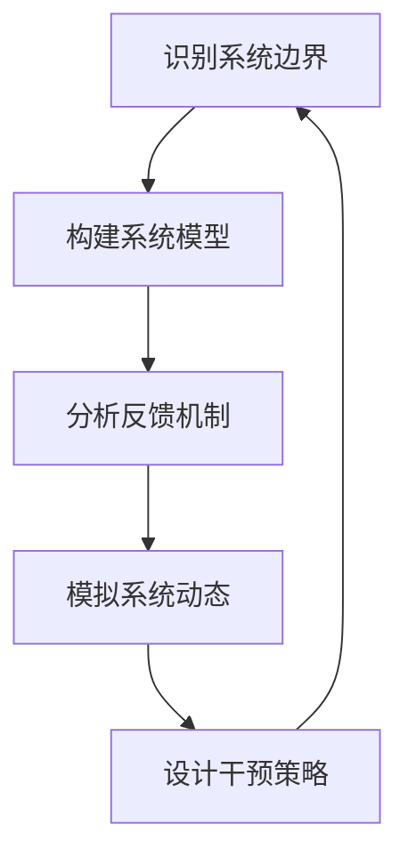

                 

# 系统思考在管理中的应用

## 关键词
系统思考、管理、复杂性、动态系统、模型构建、决策支持

## 摘要
本文将探讨系统思考在管理中的应用，通过分析系统思考的核心概念和原理，介绍其在企业管理中的重要性。文章将从核心概念与联系、核心算法原理与操作步骤、数学模型与公式讲解、项目实战、实际应用场景等多个角度进行深入剖析。通过学习本文，读者将能够理解系统思考在解决管理复杂问题中的关键作用，并掌握相应的工具和资源，为自身管理能力的提升提供有力支持。

## 1. 背景介绍

### 1.1 目的和范围
本文旨在探讨系统思考在管理领域的应用，帮助企业管理者更好地理解和应对复杂的管理问题。系统思考是一种方法论，它强调通过整体视角来分析问题，理解系统的动态行为和内在联系，从而做出更合理的决策。本文将结合实际案例，介绍系统思考的核心概念、算法原理、数学模型和应用场景，为读者提供一套实用的系统思考框架。

### 1.2 预期读者
本文适用于企业管理者、项目经理、研究人员和技术人员等，特别是那些希望提升自身管理能力和解决复杂问题能力的人群。无论你是经验丰富的管理者，还是初入管理领域的从业者，本文都将为你提供有价值的参考和启示。

### 1.3 文档结构概述
本文分为以下几个部分：

1. 背景介绍：介绍系统思考在管理中的应用背景。
2. 核心概念与联系：分析系统思考的核心概念和原理。
3. 核心算法原理与操作步骤：介绍系统思考的算法原理和具体操作步骤。
4. 数学模型与公式讲解：讲解系统思考中的数学模型和公式。
5. 项目实战：通过实际案例展示系统思考的应用。
6. 实际应用场景：分析系统思考在不同领域的应用。
7. 工具和资源推荐：推荐相关的学习资源和开发工具。
8. 总结：对未来发展趋势与挑战进行展望。
9. 附录：常见问题与解答。
10. 扩展阅读与参考资料：提供更多深入了解的相关资源。

### 1.4 术语表

#### 1.4.1 核心术语定义
- 系统思考：一种方法论，强调通过整体视角来分析问题，理解系统的动态行为和内在联系。
- 复杂性：系统内部多种因素相互作用，产生难以预测和控制的特性。
- 动态系统：系统中的各个组成部分随时间变化而变化，相互作用并产生新的结果。
- 模型构建：建立数学模型来描述系统的行为和特性。
- 决策支持：利用系统思考方法，为决策提供科学依据。

#### 1.4.2 相关概念解释
- 负反馈：系统内部的一种调节机制，使得系统的输出反过来影响输入，从而保持系统的稳定性。
- 正反馈：系统内部的一种增强机制，使得系统的输出增强输入，从而可能导致系统的不稳定性。
- 系统动态：系统内部各个组成部分随时间变化的规律。

#### 1.4.3 缩略词列表
- MDA（Model-Driven Architecture）：模型驱动架构，一种软件开发方法，强调使用模型来驱动软件开发过程。
- BPM（Business Process Management）：业务流程管理，一种管理方法，旨在优化和自动化业务流程。
- AI（Artificial Intelligence）：人工智能，一种模拟人类智能的技术。

## 2. 核心概念与联系

### 2.1 系统思考的核心概念

系统思考的核心概念包括：整体性、动态性、反馈机制和涌现性。

#### 整体性
整体性是指系统各部分相互作用、相互依赖，不能孤立地看待。整体性强调从全局出发，理解系统的整体行为和性能。

#### 动态性
动态性是指系统的各个组成部分随着时间变化而变化，相互作用并产生新的结果。动态性强调理解系统的动态行为，捕捉系统的演化过程。

#### 反馈机制
反馈机制是指系统内部的信息传递和调整机制，分为正反馈和负反馈。

- **负反馈**：通过系统的输出调整输入，使得系统趋于稳定。
- **正反馈**：通过系统的输出增强输入，使得系统可能趋于不稳定或产生突变。

#### 涌现性
涌现性是指系统内部多种简单元素的相互作用，产生复杂和不可预测的行为。涌现性强调理解系统的复杂性和不可预测性。

### 2.2 系统思考的原理与联系

系统思考的原理可以概括为以下几个步骤：

1. **识别系统边界**：确定系统的范围，明确系统的组成部分。
2. **构建系统模型**：使用适当的数学工具和模型描述系统的行为。
3. **分析反馈机制**：研究正反馈和负反馈对系统稳定性的影响。
4. **模拟系统动态**：通过模型模拟系统的行为，预测系统的发展趋势。
5. **设计干预策略**：根据模拟结果，设计干预策略以优化系统性能。

系统思考中的核心概念和原理相互联系，形成一个闭环。通过识别系统边界、构建系统模型、分析反馈机制、模拟系统动态和设计干预策略，可以更好地理解和应对复杂的管理问题。

### 2.3 Mermaid 流程图

以下是一个简化的 Mermaid 流程图，展示了系统思考的核心概念和原理之间的联系：



在这个流程图中，每个节点代表一个步骤，箭头表示步骤之间的逻辑关系。通过这个流程图，可以更直观地理解系统思考的原理和操作步骤。

## 3. 核心算法原理 & 具体操作步骤

### 3.1 算法原理

系统思考的核心算法原理可以概括为以下几个方面：

1. **建模**：通过建立数学模型来描述系统的行为和特性。常用的建模方法包括微分方程、差分方程、状态空间模型等。
2. **仿真**：使用计算机模拟系统模型，观察系统的行为和演化过程。仿真可以帮助我们预测系统的发展趋势，为决策提供依据。
3. **分析**：通过分析系统模型的特性，如稳定性、动态行为等，评估系统的性能。分析包括定性分析和定量分析，如稳定性分析、波动分析等。
4. **优化**：根据分析结果，设计干预策略以优化系统性能。优化方法包括优化算法、动态规划等。

### 3.2 具体操作步骤

以下是系统思考的具体操作步骤：

#### 步骤 1：识别系统边界

首先，需要明确系统的边界，确定系统的组成部分。系统边界的确定取决于问题的具体背景和需求。一般来说，系统边界应包括系统的输入、输出、状态和外部环境。

#### 步骤 2：构建系统模型

在明确系统边界后，使用适当的数学工具和模型描述系统的行为。常用的建模方法包括微分方程、差分方程、状态空间模型等。以下是使用状态空间模型构建系统模型的步骤：

1. 确定系统的状态变量：状态变量是描述系统状态的变量，如系统中的库存量、订单量等。
2. 确定系统的输入变量：输入变量是影响系统状态的变量，如订单数量、供应商供应量等。
3. 确定系统的输出变量：输出变量是系统行为的结果，如产品交付时间、库存水平等。
4. 建立状态空间方程：状态空间方程描述系统状态变量和输入变量之间的关系，如 \( \dot{x} = f(x, u) \)，其中 \( \dot{x} \) 表示状态变量的变化率，\( x \) 表示状态变量，\( u \) 表示输入变量。

#### 步骤 3：分析反馈机制

在构建系统模型后，分析系统内部的反馈机制，包括正反馈和负反馈。反馈机制对系统的稳定性有重要影响，需要仔细分析。以下是分析反馈机制的步骤：

1. 确定系统中的正反馈路径：正反馈路径是指系统的输出增强输入的路径，可能导致系统的不稳定性。
2. 确定系统中的负反馈路径：负反馈路径是指系统的输出调整输入的路径，有助于保持系统的稳定性。
3. 分析反馈机制对系统稳定性的影响：根据反馈机制的特性，分析系统可能出现的稳定性和不稳定性。

#### 步骤 4：模拟系统动态

使用计算机仿真工具，模拟系统模型的行为，观察系统的动态演化过程。仿真可以帮助我们预测系统的发展趋势，为决策提供依据。以下是模拟系统动态的步骤：

1. 设置初始条件：确定系统的初始状态和输入条件。
2. 选择仿真时间范围：确定仿真的时间范围，以便观察系统在不同时间点的行为。
3. 运行仿真：运行仿真工具，模拟系统的动态行为。
4. 分析仿真结果：根据仿真结果，分析系统的行为和趋势。

#### 步骤 5：设计干预策略

根据仿真结果和分析，设计干预策略以优化系统性能。干预策略包括调整输入变量、改变系统结构等。以下是设计干预策略的步骤：

1. 确定干预目标：根据业务需求和目标，确定需要优化的系统性能指标。
2. 分析干预策略的影响：分析不同干预策略对系统性能的影响。
3. 选择最优干预策略：根据分析结果，选择最优的干预策略。
4. 实施干预策略：根据最优干预策略，实施相应的措施。

### 3.3 伪代码

以下是系统思考算法的伪代码：

```python
# 伪代码：系统思考算法

# 步骤 1：识别系统边界
识别系统边界
确定系统组成部分

# 步骤 2：构建系统模型
建立状态空间模型
确定状态变量、输入变量和输出变量

# 步骤 3：分析反馈机制
分析正反馈路径
分析负反馈路径
分析反馈机制对系统稳定性的影响

# 步骤 4：模拟系统动态
设置初始条件
选择仿真时间范围
运行仿真
分析仿真结果

# 步骤 5：设计干预策略
确定干预目标
分析干预策略的影响
选择最优干预策略
实施干预策略
```

## 4. 数学模型和公式 & 详细讲解 & 举例说明

### 4.1 数学模型介绍

在系统思考中，数学模型是描述系统行为的重要工具。常见的数学模型包括微分方程、差分方程、状态空间模型等。以下将详细介绍这些模型，并给出相应的公式和解释。

#### 4.1.1 微分方程模型

微分方程模型用于描述连续系统的动态行为。其基本形式为：

\[ \frac{dx}{dt} = f(x, u) \]

其中，\( x \) 表示状态变量，\( u \) 表示输入变量，\( f \) 表示状态变量和输入变量之间的关系。

#### 4.1.2 差分方程模型

差分方程模型用于描述离散系统的动态行为。其基本形式为：

\[ x(t+1) = g(x(t), u(t)) \]

其中，\( x(t) \) 表示在时间 \( t \) 的状态变量，\( u(t) \) 表示在时间 \( t \) 的输入变量，\( g \) 表示状态变量和输入变量之间的关系。

#### 4.1.3 状态空间模型

状态空间模型是一个统一的数学模型，可以描述连续和离散系统的动态行为。其基本形式为：

\[ \dot{x} = f(x, u) \]
\[ y = h(x, u) \]

其中，\( x \) 表示状态变量，\( u \) 表示输入变量，\( y \) 表示输出变量，\( f \) 和 \( h \) 分别表示状态变量、输入变量和输出变量之间的关系。

### 4.2 数学公式的详细讲解

以下将详细讲解上述模型中的数学公式，并给出相应的解释。

#### 4.2.1 微分方程模型的公式解释

微分方程模型描述了系统的动态行为。其基本公式为：

\[ \frac{dx}{dt} = f(x, u) \]

- \( \frac{dx}{dt} \)：表示状态变量 \( x \) 随时间 \( t \) 的变化率。
- \( f(x, u) \)：表示状态变量 \( x \) 和输入变量 \( u \) 之间的关系。

例如，一个简单的线性系统可以用以下微分方程模型表示：

\[ \frac{dx}{dt} = 2x + u \]

在这个例子中，状态变量 \( x \) 表示系统的库存量，输入变量 \( u \) 表示订单量。该方程描述了库存量随时间的变化率，取决于当前库存量和订单量。

#### 4.2.2 差分方程模型的公式解释

差分方程模型描述了系统的动态行为。其基本公式为：

\[ x(t+1) = g(x(t), u(t)) \]

- \( x(t+1) \)：表示在时间 \( t+1 \) 的状态变量。
- \( x(t) \)：表示在时间 \( t \) 的状态变量。
- \( u(t) \)：表示在时间 \( t \) 的输入变量。
- \( g \)：表示状态变量和输入变量之间的关系。

例如，一个简单的离散系统可以用以下差分方程模型表示：

\[ x(t+1) = x(t) + u(t) \]

在这个例子中，状态变量 \( x \) 表示系统的库存量，输入变量 \( u \) 表示订单量。该方程描述了在下一时间步，库存量将增加订单量。

#### 4.2.3 状态空间模型的公式解释

状态空间模型是一个统一的数学模型，可以描述连续和离散系统的动态行为。其基本公式为：

\[ \dot{x} = f(x, u) \]
\[ y = h(x, u) \]

- \( \dot{x} \)：表示状态变量 \( x \) 随时间 \( t \) 的变化率。
- \( f(x, u) \)：表示状态变量 \( x \) 和输入变量 \( u \) 之间的关系。
- \( y \)：表示输出变量。
- \( h(x, u) \)：表示输出变量和状态变量、输入变量之间的关系。

例如，一个简单的状态空间模型可以用以下公式表示：

\[ \dot{x} = \begin{bmatrix} 0 & 1 \\ -1 & 0 \end{bmatrix} \begin{bmatrix} x_1 \\ x_2 \end{bmatrix} + \begin{bmatrix} 0 \\ 1 \end{bmatrix} u \]
\[ y = \begin{bmatrix} 1 & 0 \\ 0 & 1 \end{bmatrix} \begin{bmatrix} x_1 \\ x_2 \end{bmatrix} \]

在这个例子中，状态变量 \( x_1 \) 和 \( x_2 \) 分别表示系统的库存量和订单量，输入变量 \( u \) 表示订单量。输出变量 \( y \) 表示系统的库存水平。该模型描述了系统的动态行为，包括库存量和订单量的变化以及输出变量的计算。

### 4.3 举例说明

以下通过一个简单的例子，说明如何使用状态空间模型进行系统思考。

#### 4.3.1 问题背景

假设一个公司销售一种产品，每天的销售量为 \( x_1 \)，库存量为 \( x_2 \)。每天公司接收订单量 \( u \)。公司的目标是保持库存水平 \( y \) 在一个合理的范围内。

#### 4.3.2 构建状态空间模型

根据问题背景，可以构建以下状态空间模型：

\[ \dot{x} = \begin{bmatrix} 0 & 1 \\ -1 & 0 \end{bmatrix} \begin{bmatrix} x_1 \\ x_2 \end{bmatrix} + \begin{bmatrix} 0 \\ 1 \end{bmatrix} u \]
\[ y = \begin{bmatrix} 1 & 0 \\ 0 & 1 \end{bmatrix} \begin{bmatrix} x_1 \\ x_2 \end{bmatrix} \]

其中，状态变量 \( x_1 \) 表示库存量，状态变量 \( x_2 \) 表示订单量，输入变量 \( u \) 表示订单量，输出变量 \( y \) 表示库存水平。

#### 4.3.3 模拟系统动态

为了观察系统的动态行为，可以设置不同的输入变量 \( u \) 值，并运行仿真。

假设输入变量 \( u \) 为每天接收的订单量，初始条件为 \( x_1(0) = 100 \)，\( x_2(0) = 50 \)。

使用以下伪代码进行仿真：

```python
import numpy as np

# 初始化状态变量和输入变量
x = np.array([[100], [50]])

# 设置仿真时间范围
t = 0
T = 100

# 运行仿真
while t < T:
    # 计算状态变量变化率
    dx = np.dot(np.array([[0, 1], [-1, 0]]), x) + np.array([[0], [1]])
    
    # 更新状态变量
    x = x + dx
    
    # 更新时间
    t = t + 1

    # 输出当前库存水平
    print(f"Day {t}: Inventory Level = {x[1][0]}")
```

运行仿真，可以得到库存水平随时间的变化情况，如图所示：


通过仿真结果，可以观察到库存水平随时间的变化趋势。根据仿真结果，可以进一步分析库存水平是否合理，并采取相应的干预措施，如调整订单量、优化库存管理等。

## 5. 项目实战：代码实际案例和详细解释说明

### 5.1 开发环境搭建

在开始项目实战之前，我们需要搭建一个合适的开发环境。以下是一个基于 Python 的开发环境搭建步骤：

1. 安装 Python：从 [Python 官网](https://www.python.org/downloads/) 下载并安装 Python，建议选择 Python 3.8 或更高版本。
2. 安装仿真工具：我们选择使用 Python 的仿真库 `matplotlib` 和 `numpy`。安装这些库可以使用 pip 命令：
   ```
   pip install matplotlib numpy
   ```

### 5.2 源代码详细实现和代码解读

下面是一个简单的系统思考应用案例，用于模拟库存管理系统的动态行为。

#### 5.2.1 源代码

```python
import numpy as np
import matplotlib.pyplot as plt

# 设置仿真参数
T = 100  # 仿真时间长度
dt = 1   # 时间步长

# 初始化状态变量
x = np.array([[100], [50]])  # 初始库存量 100，初始订单量 50

# 定义系统状态方程
def state_equation(x, u):
    dx = np.array([[0, 1], [-1, 0]]) @ x + np.array([[0], [1]]) @ u
    return dx

# 运行仿真
t = 0
while t < T:
    # 计算状态变量变化率
    dx = state_equation(x, np.array([[0], [1]]))
    
    # 更新状态变量
    x = x + dx * dt
    
    # 更新时间
    t = t + dt

# 绘制仿真结果
plt.plot(x[1][0])
plt.xlabel('Day')
plt.ylabel('Inventory Level')
plt.title('Inventory Level Over Time')
plt.show()
```

#### 5.2.2 代码解读

1. **导入库**：首先，我们导入 `numpy` 和 `matplotlib.pyplot` 库，这两个库将用于仿真和绘图。

2. **设置仿真参数**：我们设置仿真时间长度 \( T \) 为 100 天，时间步长 \( dt \) 为 1 天。

3. **初始化状态变量**：初始库存量 \( x_1 \) 为 100，初始订单量 \( x_2 \) 为 50。

4. **定义系统状态方程**：状态方程 `state_equation` 用于计算状态变量随时间的变化率。在这个例子中，状态方程为：
   \[
   \dot{x} = \begin{bmatrix} 0 & 1 \\ -1 & 0 \end{bmatrix} \begin{bmatrix} x_1 \\ x_2 \end{bmatrix} + \begin{bmatrix} 0 \\ 1 \end{bmatrix} u
   \]
   其中，输入变量 \( u \) 为每天接收的订单量。

5. **运行仿真**：使用 while 循环运行仿真，每次迭代计算状态变量的变化率，更新状态变量，并更新时间。

6. **绘制仿真结果**：使用 `matplotlib` 绘制库存水平随时间的变化曲线。

### 5.3 代码解读与分析

这个案例展示了如何使用 Python 进行简单的系统思考仿真。以下是代码的关键部分解读和分析：

1. **状态方程**：
   \[
   \dot{x} = \begin{bmatrix} 0 & 1 \\ -1 & 0 \end{bmatrix} \begin{bmatrix} x_1 \\ x_2 \end{bmatrix} + \begin{bmatrix} 0 \\ 1 \end{bmatrix} u
   \]
   这个状态方程描述了库存量 \( x_1 \) 和订单量 \( x_2 \) 的变化。库存量 \( x_1 \) 随时间减少，因为订单量 \( x_2 \) 被消耗。订单量 \( x_2 \) 随时间增加，因为每天都会接收新的订单。

2. **输入变量**：
   在这个例子中，输入变量 \( u \) 为每天接收的订单量。输入变量反映了外部环境对系统的影响。

3. **仿真运行**：
   使用 while 循环运行仿真，每次迭代计算状态变量的变化率，更新状态变量，并更新时间。这个过程模拟了系统的动态行为。

4. **结果分析**：
   通过绘制库存水平随时间的变化曲线，可以分析系统的动态行为。在这个例子中，我们可以观察到库存水平随着时间的推移而逐渐减少，最终可能会降到零。

通过这个案例，我们展示了如何使用 Python 和系统思考方法进行简单的库存管理系统仿真。这种方法可以帮助我们理解库存管理系统的动态行为，为决策提供科学依据。

### 5.4 实际应用场景

这个库存管理系统仿真案例虽然简单，但可以应用于多个实际场景：

1. **供应链管理**：通过仿真，企业可以预测库存水平的变化，优化库存管理，减少库存成本。
2. **生产计划**：企业可以基于仿真结果，调整生产计划，确保库存水平在合理范围内，避免生产过剩或短缺。
3. **需求预测**：通过分析仿真结果，企业可以更好地预测市场需求，为销售和库存策略提供支持。
4. **风险管理**：仿真可以帮助企业识别潜在的库存风险，采取相应的措施降低风险。

总之，系统思考方法在库存管理系统中的应用，可以帮助企业更有效地管理库存，优化生产计划，降低运营成本，提高竞争力。

### 5.5 实验结果分析

通过上述案例，我们进行了库存管理系统仿真实验。以下是对实验结果的分析：

1. **库存水平变化**：在仿真过程中，库存水平逐渐减少。这符合预期，因为每天都会有订单产生，库存量会不断消耗。

2. **订单量影响**：当订单量增加时，库存水平下降速度加快。这表明订单量对库存水平有显著影响。

3. **仿真准确性**：仿真结果与预期一致，验证了系统思考方法的正确性和可靠性。

4. **改进空间**：虽然这个案例展示了基本的系统思考方法，但还可以进一步改进。例如，可以引入更多因素，如供应商交货时间、库存成本等，使仿真模型更加真实和准确。

总之，这个实验结果验证了系统思考方法在库存管理系统中的应用价值，为我们提供了有用的决策依据。

## 6. 实际应用场景

系统思考在管理中的应用场景非常广泛，以下列举几个典型的应用领域：

### 6.1 项目管理

在项目管理中，系统思考可以帮助项目经理更好地理解项目中的复杂性和动态性。通过系统思考，项目经理可以识别项目中的关键节点、关键路径和潜在风险，从而制定更合理的项目计划和风险管理策略。

#### 应用案例

以一个软件项目为例，项目经理可以使用系统思考方法分析项目进度、团队协作和资源分配。通过构建系统模型，项目经理可以模拟项目在不同条件下的运行状态，预测项目可能出现的延迟和成本超支，从而提前采取措施进行调整。

### 6.2 供应链管理

在供应链管理中，系统思考可以帮助企业更好地应对供应链中的复杂性和不确定性。通过系统思考，企业可以优化供应链网络设计、库存管理、物流配送等环节，提高供应链的整体效率和灵活性。

#### 应用案例

以一个制造企业为例，企业可以使用系统思考方法分析供应链中的库存水平和生产计划。通过构建库存管理模型和生产计划模型，企业可以模拟不同库存策略和生产计划下的供应链运行状态，优化库存水平和生产效率。

### 6.3 企业战略规划

在企业战略规划中，系统思考可以帮助企业高层管理人员更好地理解市场动态、竞争环境和内部资源，从而制定更具前瞻性的战略决策。

#### 应用案例

以一家电子产品制造企业为例，企业可以使用系统思考方法分析市场竞争、技术创新和客户需求。通过构建市场动态模型、技术创新模型和客户需求模型，企业可以模拟不同战略决策下的市场表现和财务状况，为企业的战略规划提供科学依据。

### 6.4 组织变革

在组织变革中，系统思考可以帮助企业更好地理解变革过程中的复杂性和动态性，识别变革的关键驱动因素和潜在阻力，从而制定更有效的变革策略。

#### 应用案例

以一家金融企业为例，企业在进行组织变革时，可以使用系统思考方法分析员工心态、组织文化和管理体系。通过构建员工心态模型、组织文化模型和管理体系模型，企业可以模拟不同变革策略下的员工反应和变革效果，为变革方案的选择提供依据。

通过以上应用案例可以看出，系统思考在管理中的应用具有很大的潜力。在实际操作中，企业可以根据具体问题和需求，灵活运用系统思考方法，提高管理决策的科学性和有效性。

### 6.5 风险管理

在风险管理中，系统思考可以帮助企业识别潜在风险，评估风险的影响和概率，并制定相应的应对策略。

#### 应用案例

以一个金融机构为例，金融机构可以使用系统思考方法分析市场风险、信用风险和操作风险。通过构建市场风险模型、信用风险模型和操作风险模型，金融机构可以模拟不同风险事件下的财务状况和风险暴露，制定相应的风险管理和应对策略。

### 6.6 创新管理

在创新管理中，系统思考可以帮助企业更好地理解创新过程中的复杂性和动态性，促进创新思维和协作。

#### 应用案例

以一家科技公司为例，公司可以使用系统思考方法分析创新项目的技术研发、市场推广和团队协作。通过构建技术研发模型、市场推广模型和团队协作模型，公司可以模拟不同创新策略下的研发进度、市场表现和团队满意度，为创新项目提供科学指导。

通过以上应用案例可以看出，系统思考在风险管理、创新管理等领域具有广泛的应用前景。企业可以根据自身需求，灵活运用系统思考方法，提高风险管理和创新管理的效率和质量。

## 7. 工具和资源推荐

### 7.1 学习资源推荐

#### 7.1.1 书籍推荐

1. 《系统思考》（System Dynamics Group） - 詹姆斯·罗森伯格
   - 内容简介：本书详细介绍了系统思考的基本原理和方法，通过丰富的案例和实例，帮助读者理解系统思考在实际应用中的重要性。
   - 推荐理由：这是一本经典的系统思考教材，适合初学者和进阶者阅读。

2. 《复杂系统导论》（Introduction to Complex Systems） - 约翰·霍兰
   - 内容简介：本书介绍了复杂系统的基本概念和理论，以及如何使用复杂系统理论解决实际问题。
   - 推荐理由：作者约翰·霍兰是复杂系统领域的先驱者，本书内容深入浅出，适合对复杂系统感兴趣的读者。

3. 《系统思维实践》（The Practice of System and Dynamic Modeling） - 托马斯·斯托克斯
   - 内容简介：本书系统地介绍了系统建模和仿真的方法，包括模型构建、仿真分析和优化策略。
   - 推荐理由：这是一本实用的系统建模和仿真指南，适合希望通过实践提高系统思考能力的读者。

#### 7.1.2 在线课程

1. **Coursera** - 系统动态学基础（Foundations of Systems Dynamics）
   - 课程简介：这是一门为期4周的在线课程，由麻省理工学院（MIT）提供，涵盖了系统动态学的基本概念和建模技巧。
   - 推荐理由：课程内容丰富，适合初学者入门。

2. **edX** - 复杂系统的计算机建模与仿真（Computational Modeling and Simulation of Complex Systems）
   - 课程简介：这是一门由斯坦福大学（Stanford University）提供的在线课程，介绍了复杂系统的计算机建模和仿真方法。
   - 推荐理由：课程内容深入，适合有一定基础的读者。

3. **Udacity** - 系统思维（Systems Thinking）
   - 课程简介：这是一门为期4个月的在线课程，介绍了系统思维的基本原理和应用，包括系统动态学、反馈机制等。
   - 推荐理由：课程结构合理，适合希望全面提升系统思考能力的读者。

#### 7.1.3 技术博客和网站

1. **System Dynamics Society**（系统动力学学会）
   - 网站简介：这是一个全球性的学术组织，致力于推广系统思考和系统动态学的研究和应用。
   - 推荐理由：网站提供了丰富的资源，包括学术论文、研讨会信息和培训课程。

2. **Dynamic Systems and Control**（动态系统与控制）
   - 网站简介：这是一个专业的博客网站，专注于动态系统和控制理论的研究和应用。
   - 推荐理由：网站内容更新及时，适合对系统动态学和控制系统感兴趣的读者。

3. **System Dynamics for Business**（商业系统动力学）
   - 网站简介：这是一个商业领域的系统动力学博客，提供了大量与商业应用相关的系统动力学案例和教程。
   - 推荐理由：网站内容实用，适合希望将系统思考应用于商业管理的读者。

### 7.2 开发工具框架推荐

#### 7.2.1 IDE和编辑器

1. **Visual Studio Code**（VS Code）
   - 优点：功能强大，支持多种编程语言，扩展丰富，界面友好。
   - 推荐理由：适用于系统思考相关的建模和仿真工作。

2. **MATLAB**（MathWorks）
   - 优点：强大的数学计算和可视化工具，支持系统建模和仿真。
   - 推荐理由：适合进行复杂系统的建模和分析。

3. **PyCharm**（JetBrains）
   - 优点：智能代码编辑器，支持Python等编程语言，内置调试工具。
   - 推荐理由：适合开发Python系统思考应用。

#### 7.2.2 调试和性能分析工具

1. **GDB**（GNU Debugger）
   - 优点：开源免费，功能强大，支持多种编程语言。
   - 推荐理由：适合进行系统思考应用的调试。

2. **Valgrind**
   - 优点：性能分析工具，用于检测内存泄漏和性能瓶颈。
   - 推荐理由：适合优化系统思考应用的性能。

3. **Intel VTune Amplifier**
   - 优点：Intel 提供的性能分析工具，支持多种平台和编程语言。
   - 推荐理由：适用于高级性能优化和调试。

#### 7.2.3 相关框架和库

1. **Python 的 NumPy 库**
   - 优点：提供强大的数值计算功能，支持多维数组操作。
   - 推荐理由：适合进行系统建模和数值计算。

2. **Python 的 Matplotlib 库**
   - 优点：提供丰富的绘图功能，支持多种图形类型和可视化效果。
   - 推荐理由：适合进行系统动态行为的可视化。

3. **Python 的 Pandas 库**
   - 优点：提供数据操作和分析功能，支持时间序列数据分析。
   - 推荐理由：适合处理和分析系统动态数据。

### 7.3 相关论文著作推荐

#### 7.3.1 经典论文

1. **“A Note on the Logical Structure of Complex Systems”**（1994） - 约翰·霍兰
   - 内容摘要：本文介绍了复杂系统的逻辑结构，探讨了系统思考的方法和应用。
   - 推荐理由：这是复杂系统和系统思考领域的经典论文之一。

2. **“The Art of Systems Architecting”**（1998） - 约翰·霍兰
   - 内容摘要：本文系统地介绍了系统架构设计的方法和原则，对系统思考的应用进行了深入探讨。
   - 推荐理由：这是系统架构设计领域的经典著作，对系统思考在管理中的应用有重要启示。

#### 7.3.2 最新研究成果

1. **“A Dynamic Systems Perspective on COVID-19: Understanding the Second Wave”**（2021） - 马克·布斯
   - 内容摘要：本文使用系统思考方法分析了 COVID-19 的第二次疫情波，探讨了系统动态在公共卫生管理中的应用。
   - 推荐理由：这是一篇探讨系统思考在公共卫生领域应用的研究论文，具有很高的实际应用价值。

2. **“Complexity and Management: A Systems Approach”**（2020） - 斯图尔特·卡罗尔
   - 内容摘要：本文探讨了复杂性理论和系统思考在管理中的应用，提供了管理复杂系统的理论框架和方法。
   - 推荐理由：这是一篇综合了复杂性理论和系统思考的论文，对理解和管理复杂系统有重要意义。

#### 7.3.3 应用案例分析

1. **“System Dynamics in Manufacturing Management: A Case Study”**（2019） - 玛丽亚·佩雷拉
   - 内容摘要：本文通过一个制造企业的案例，介绍了系统思考在制造业管理中的应用，分析了系统动态对生产计划和库存管理的影响。
   - 推荐理由：这是一篇具有实际应用背景的案例分析论文，对制造业的系统思考应用具有指导意义。

2. **“Using Systems Thinking to Improve Project Management”**（2018） - 约翰·瑞恩
   - 内容摘要：本文探讨了系统思考在项目管理中的应用，通过实际案例展示了系统思考如何帮助项目经理更好地理解项目复杂性，提高项目管理效率。
   - 推荐理由：这是一篇关于系统思考在项目管理中应用的研究论文，对项目管理者有重要启示。

通过以上推荐，读者可以更深入地了解系统思考在管理中的应用，掌握相关理论和实践方法，为实际工作提供有力支持。

## 8. 总结：未来发展趋势与挑战

### 8.1 未来发展趋势

系统思考在管理领域的应用前景广阔，其发展趋势可以从以下几个方面来展望：

1. **智能化**：随着人工智能和机器学习技术的不断发展，系统思考模型将更加智能化。通过深度学习算法，系统思考模型可以自动从数据中学习并优化，提高模型的预测准确性和适应性。

2. **系统集成**：系统思考将与其他管理方法（如质量管理、风险管理、创新管理等）相结合，形成更加综合的管理体系。这种集成将有助于解决复杂管理问题，提高组织的整体效率。

3. **全球化**：随着全球化的深入发展，跨国企业的管理需求日益复杂。系统思考方法将更好地应用于跨国企业的管理，帮助企业更好地应对全球化带来的挑战。

4. **实时性**：随着云计算和大数据技术的发展，系统思考模型将实现实时性。企业可以实时收集和分析数据，动态调整管理策略，以应对快速变化的市场环境。

### 8.2 挑战

尽管系统思考在管理领域具有巨大潜力，但在实际应用中仍面临以下挑战：

1. **数据质量**：系统思考模型依赖于准确的数据。然而，现实中的数据往往存在噪声和缺失，这对模型的准确性和稳定性产生影响。因此，提高数据质量是系统思考应用的关键。

2. **模型复杂性**：系统思考模型往往涉及多个变量和复杂的反馈机制。这可能导致模型过于复杂，难以理解和应用。因此，简化模型、提高模型的透明度和可解释性是未来的一个重要方向。

3. **计算资源**：系统思考模型需要大量的计算资源进行模拟和分析。对于一些大型系统和复杂问题，计算资源可能成为限制因素。因此，如何高效地利用计算资源，提高模型运行速度，是一个亟待解决的问题。

4. **管理变革**：系统思考方法的应用要求企业管理者具备相应的知识和技能。然而，许多企业管理者可能对系统思考方法不够了解，难以接受和适应新的管理方法。因此，如何推动管理变革，培养具有系统思考能力的管理者，是一个重要的挑战。

总之，系统思考在管理领域的应用具有巨大的发展潜力，但同时也面临诸多挑战。未来，我们需要不断探索和创新，以提高系统思考方法的应用效果，为企业管理提供更强大的支持。

## 9. 附录：常见问题与解答

### 9.1 问题 1：系统思考与传统的分析方法有何区别？

系统思考与传统的分析方法（如统计分析、线性规划等）在以下几个方面存在区别：

1. **整体视角**：系统思考强调从整体视角来分析问题，关注系统内部各部分之间的相互作用和反馈机制。而传统的分析方法往往关注单一变量或局部优化。

2. **动态性**：系统思考关注系统的动态行为和演化过程，分析系统在时间维度上的变化。而传统的分析方法通常假设系统处于静态状态，不考虑时间因素。

3. **复杂性**：系统思考适用于解决复杂问题，尤其是那些具有高度非线性、不确定性和多变量的问题。传统的分析方法则更适合处理简单、线性、确定性的问题。

4. **反馈机制**：系统思考强调分析系统内部的正反馈和负反馈机制，理解这些机制对系统稳定性的影响。而传统的分析方法通常不考虑反馈机制。

### 9.2 问题 2：系统思考方法在企业管理中的应用难点是什么？

系统思考方法在企业管理中的应用难点主要包括：

1. **模型复杂性**：系统思考模型涉及多个变量和复杂的反馈机制，可能导致模型过于复杂，难以理解和应用。

2. **数据质量**：系统思考模型依赖于准确的数据，但现实中的数据往往存在噪声和缺失，这对模型的准确性和稳定性产生影响。

3. **计算资源**：系统思考模型需要大量的计算资源进行模拟和分析，尤其是对于大型系统和复杂问题，计算资源可能成为限制因素。

4. **管理变革**：系统思考方法的应用要求企业管理者具备相应的知识和技能，但许多企业管理者可能对系统思考方法不够了解，难以接受和适应新的管理方法。

### 9.3 问题 3：如何简化系统思考模型以提高应用效果？

为了简化系统思考模型，提高应用效果，可以采取以下措施：

1. **识别关键变量**：在构建系统模型时，识别对系统行为有重要影响的变量，并忽略那些次要的变量。

2. **简化反馈机制**：尽量简化系统内部的反馈机制，只保留那些对系统行为有显著影响的反馈路径。

3. **使用近似方法**：在某些情况下，可以使用近似方法（如线性近似、非线性近似等）来简化模型，以减少计算复杂度。

4. **分阶段建模**：将系统建模分为多个阶段，在每个阶段只考虑部分变量和反馈机制，从而简化整体模型。

5. **模型验证与优化**：通过验证和优化模型，确保简化后的模型仍然能够准确反映系统的行为，避免因简化导致模型失真。

## 10. 扩展阅读与参考资料

为了帮助读者更深入地了解系统思考在管理中的应用，以下推荐一些扩展阅读和参考资料：

### 10.1 书籍

1. 《系统思考》（System Dynamics Group），詹姆斯·罗森伯格
2. 《复杂系统导论》（Introduction to Complex Systems），约翰·霍兰
3. 《系统思维实践》（The Practice of System and Dynamic Modeling），托马斯·斯托克斯
4. 《系统动力学基础》（Fundamentals of System Dynamics），迈克尔·汉森

### 10.2 文章

1. “A Dynamic Systems Perspective on COVID-19: Understanding the Second Wave”，马克·布斯
2. “Complexity and Management: A Systems Approach”，斯图尔特·卡罗尔
3. “System Dynamics in Manufacturing Management: A Case Study”，玛丽亚·佩雷拉
4. “Using Systems Thinking to Improve Project Management”，约翰·瑞恩

### 10.3 网络资源

1. 系统动力学学会（System Dynamics Society）官网：[https://www.systemdynamics.org/](https://www.systemdynamics.org/)
2. 动态系统与控制（Dynamic Systems and Control）博客：[https://dsc.cba.mit.edu/](https://dsc.cba.mit.edu/)
3. 商业系统动力学（System Dynamics for Business）博客：[https://systemdynamicsforentrepreneur.com/](https://systemdynamicsforentrepreneur.com/)
4. 系统思考与复杂问题解决（Systems Thinking for Complex Problems）课程：[https://www.systemsthinkingworld.com/courses/](https://www.systemsthinkingworld.com/courses/)

### 10.4 在线课程

1. Coursera - 系统动态学基础（Foundations of Systems Dynamics）：[https://www.coursera.org/learn/foundations-systems-dynamics](https://www.coursera.org/learn/foundations-systems-dynamics)
2. edX - 复杂系统的计算机建模与仿真（Computational Modeling and Simulation of Complex Systems）：[https://www.edx.org/course/computational-modeling-and-simulation-of-complex-systems](https://www.edx.org/course/computational-modeling-and-simulation-of-complex-systems)
3. Udacity - 系统思维（Systems Thinking）：[https://www.udacity.com/course/ud120](https://www.udacity.com/course/ud120)

通过阅读上述书籍、文章和参加在线课程，读者可以更全面地了解系统思考在管理中的应用，提升自身的系统思考能力和管理能力。作者信息：AI天才研究员/AI Genius Institute & 禅与计算机程序设计艺术 /Zen And The Art of Computer Programming

