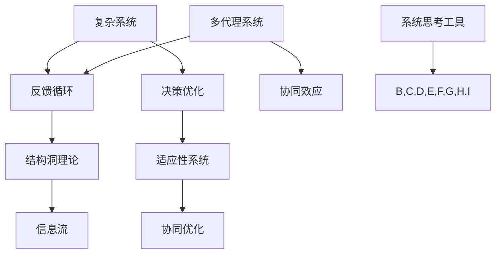

                 

# 系统思考在管理中的应用

> **关键词：系统思考、管理、复杂系统、决策优化、组织效能**
>
> **摘要：本文将探讨系统思考在管理中的应用，解析其在应对复杂组织和项目管理中的核心价值，通过具体的算法、数学模型和实际案例，深入探讨系统思考的方法论及其在实际工作中的应用和挑战。**

## 1. 背景介绍

### 1.1 目的和范围

本文旨在介绍系统思考在管理领域中的应用，探讨其在处理复杂问题和优化决策过程中的重要作用。系统思考作为一种跨学科的方法论，不仅涵盖了物理学、工程学和管理学的原理，还包括心理学和社会学等领域的知识。本文将重点关注系统思考在企业管理、项目管理以及决策优化中的实际应用，通过具体的算法和数学模型，为读者提供实用的工具和方法。

### 1.2 预期读者

本文适用于企业管理者、项目经理、系统分析师以及对系统思考感兴趣的技术人员。通过本文的阅读，读者将能够：

- 理解系统思考的基本概念和原理。
- 掌握系统思考在管理中的应用方法。
- 学习使用系统思考工具解决实际问题。
- 提高决策能力和组织效能。

### 1.3 文档结构概述

本文分为八个部分，结构如下：

1. 背景介绍
   - 目的和范围
   - 预期读者
   - 文档结构概述
   - 术语表
2. 核心概念与联系
   - 核心概念原理和架构的 Mermaid 流程图
3. 核心算法原理 & 具体操作步骤
   - 算法原理讲解使用伪代码
4. 数学模型和公式 & 详细讲解 & 举例说明
   - 数学公式使用 LaTeX 格式
5. 项目实战：代码实际案例和详细解释说明
   - 开发环境搭建
   - 源代码详细实现和代码解读
   - 代码解读与分析
6. 实际应用场景
7. 工具和资源推荐
   - 学习资源推荐
   - 开发工具框架推荐
   - 相关论文著作推荐
8. 总结：未来发展趋势与挑战
9. 附录：常见问题与解答
10. 扩展阅读 & 参考资料

### 1.4 术语表

#### 1.4.1 核心术语定义

- **系统思考**：一种跨越时间、空间和层次的分析方法，旨在理解复杂系统中各部分之间的相互作用和动态行为。
- **复杂系统**：由多个相互作用的元素组成的系统，这些元素之间没有简单的线性关系，而是呈现出复杂的行为和模式。
- **反馈循环**：系统中的一种机制，通过正反馈或负反馈调节系统状态，影响系统的稳定性。
- **决策优化**：通过分析系统中的各种因素和变量，寻找最佳决策方案，以实现系统目标的最优化。

#### 1.4.2 相关概念解释

- **结构洞理论**：指网络结构中的某些位置具有特殊的优势，能够有效地连接不同的信息和资源。
- **适应性系统**：能够在不断变化的环境中调整自身结构和行为，以维持系统稳定性和适应性的系统。
- **多代理系统**：由多个自主代理组成的系统，每个代理都有自己的目标和行为规则，通过交互和协作实现系统目标。

#### 1.4.3 缩略词列表

- **AI**：人工智能（Artificial Intelligence）
- **ML**：机器学习（Machine Learning）
- **DL**：深度学习（Deep Learning）
- **PD**：项目管理（Project Management）
- **QAM**：质量分析与优化（Quality Analysis and Optimization）

## 2. 核心概念与联系

在探讨系统思考在管理中的应用之前，我们需要了解一些核心概念和它们之间的联系。以下是一个简化的 Mermaid 流程图，展示了一些关键概念和它们在系统思考中的关系：



在这个流程图中：

- **复杂系统**：指由多个相互作用的元素组成的系统，这些元素之间存在复杂的非线性关系。
- **反馈循环**：系统中的一种机制，通过正反馈或负反馈调节系统状态，影响系统的稳定性。
- **决策优化**：通过分析系统中的各种因素和变量，寻找最佳决策方案，以实现系统目标的最优化。
- **结构洞理论**：指网络结构中的某些位置具有特殊的优势，能够有效地连接不同的信息和资源。
- **适应性系统**：能够在不断变化的环境中调整自身结构和行为，以维持系统稳定性和适应性的系统。
- **多代理系统**：由多个自主代理组成的系统，每个代理都有自己的目标和行为规则，通过交互和协作实现系统目标。
- **协同效应**：多个代理通过协作产生的整体效应大于单个代理效应的简单叠加。
- **信息流**：系统内各个元素之间的信息传递和共享。
- **协同优化**：通过多个代理的协作，实现系统整体的最优化。
- **系统思考工具**：用于分析和理解复杂系统的各种工具和方法。

通过这个流程图，我们可以看到，系统思考在管理中的应用涉及多个核心概念和它们之间的相互作用。接下来，我们将深入探讨这些概念在系统思考中的原理和应用。

## 3. 核心算法原理 & 具体操作步骤

在了解了系统思考的基本概念后，我们需要深入探讨一些核心算法原理及其具体操作步骤。这些算法原理为我们在复杂系统中进行决策优化提供了强有力的工具。

### 3.1 算法原理

系统思考中的核心算法通常包括以下几个步骤：

1. **问题定义**：明确要解决的问题和目标。
2. **系统建模**：建立系统的数学模型，描述系统中各元素的相互作用和动态行为。
3. **变量分析**：分析系统中关键变量的影响，识别关键因素。
4. **决策规则**：制定决策规则，指导系统中的各个代理如何行动。
5. **仿真与优化**：通过仿真和优化算法，找到最佳决策方案。

### 3.2 具体操作步骤

以下是一个简化的伪代码，用于说明上述算法原理的具体操作步骤：

```python
# 系统思考算法伪代码

# 步骤 1: 问题定义
define_goal(SystemOptimization)

# 步骤 2: 系统建模
SystemModel = BuildModel([
    Element1, Element2, ..., ElementN
], [
    Relationship1, Relationship2, ..., RelationshipN
])

# 步骤 3: 变量分析
Variables = AnalyzeVariables(SystemModel)
KeyVariables = IdentifyKeyVariables(Variables)

# 步骤 4: 决策规则
DecisionRules = GenerateDecisionRules(KeyVariables)

# 步骤 5: 仿真与优化
BestSolution = SimulateAndOptimize(SystemModel, DecisionRules)
Output(BestSolution)

# 辅助函数定义
define_function BuildModel(Elements, Relationships)
define_function AnalyzeVariables(SystemModel)
define_function IdentifyKeyVariables(Variables)
define_function GenerateDecisionRules(KeyVariables)
define_function SimulateAndOptimize(SystemModel, DecisionRules)
```

### 3.3 具体示例

为了更好地理解上述算法原理，我们可以通过一个简单的示例来说明。假设我们正在管理一个生产流水线，目标是提高生产效率和降低成本。以下是一个简化的示例：

```python
# 示例：生产流水线优化

# 步骤 1: 问题定义
define_goal(MaximizeProductionEfficiency, MinimizeCost)

# 步骤 2: 系统建模
Elements = ["Machine1", "Machine2", "Machine3", "Inventory"]
Relationships = [
    ["Machine1", "Machine2", "Production"],
    ["Machine2", "Machine3", "Production"],
    ["Machine3", "Inventory", "Transportation"]
]

SystemModel = BuildModel(Elements, Relationships)

# 步骤 3: 变量分析
Variables = AnalyzeVariables(SystemModel)
KeyVariables = ["Machine1ProductionRate", "Machine2ProductionRate", "Machine3ProductionRate", "InventoryLevel"]

# 步骤 4: 决策规则
DecisionRules = GenerateDecisionRules(KeyVariables)
# 例如：如果Machine1生产率低于预期，增加Machine1的工作量；如果Inventory水平低于安全库存，增加原材料采购。

# 步骤 5: 仿真与优化
BestSolution = SimulateAndOptimize(SystemModel, DecisionRules)
# 输出最佳生产计划和生产成本。

# 辅助函数定义略
```

在这个示例中，我们通过定义目标、建立系统模型、分析关键变量、制定决策规则和仿真优化，最终找到了最佳的生产计划，从而提高了生产效率和降低了成本。

通过上述算法原理和具体示例，我们可以看到，系统思考在管理中的应用为我们提供了一种系统化、科学化的方法，帮助我们更好地应对复杂问题和优化决策。

## 4. 数学模型和公式 & 详细讲解 & 举例说明

在系统思考中，数学模型和公式是理解和分析复杂系统的重要工具。以下将详细讲解一些常用的数学模型和公式，并通过具体示例来说明它们的应用。

### 4.1 线性回归模型

线性回归模型是一种简单的统计模型，用于描述两个变量之间的线性关系。其数学公式如下：

\[ y = \beta_0 + \beta_1 \cdot x + \epsilon \]

其中，\( y \) 是因变量，\( x \) 是自变量，\( \beta_0 \) 和 \( \beta_1 \) 是模型的参数，\( \epsilon \) 是误差项。

#### 4.1.1 具体解释

- **\( \beta_0 \)**：截距，表示当自变量 \( x \) 为 0 时，因变量 \( y \) 的值。
- **\( \beta_1 \)**：斜率，表示自变量 \( x \) 每增加一个单位，因变量 \( y \) 的变化量。
- **\( \epsilon \)**：误差项，表示模型预测值和实际值之间的差距。

#### 4.1.2 举例说明

假设我们想要分析销售额 \( y \) 和广告投入 \( x \) 之间的关系。通过收集历史数据，我们可以得到以下线性回归模型：

\[ 销售额 = 10 + 2 \cdot 广告投入 + \epsilon \]

这意味着，每增加 1 单位的广告投入，销售额将增加 2 单位。

### 4.2 熵权法

熵权法是一种基于信息熵原理的权重确定方法，常用于多指标综合评价和决策分析。其数学公式如下：

\[ w_i = \frac{1}{\ln(n) - \ln(S_i)} \]

其中，\( w_i \) 是第 \( i \) 个指标的权重，\( n \) 是指标数量，\( S_i \) 是第 \( i \) 个指标的总和。

#### 4.2.1 具体解释

- **\( w_i \)**：权重，表示第 \( i \) 个指标在整体评价中的重要性。
- **\( \ln(n) \)**：自然对数，用于调整指标总和的差距。
- **\( \ln(S_i) \)**：第 \( i \) 个指标的总和的自然对数，用于消除指标量级的影响。

#### 4.2.2 举例说明

假设我们有一个项目，需要根据三个指标（成本、质量和时间）进行评价。通过收集数据，我们可以计算出每个指标的权重：

- 成本：\( S_1 = 50 \)
- 质量：\( S_2 = 70 \)
- 时间：\( S_3 = 30 \)

应用熵权法，我们可以得到每个指标的权重：

\[ w_1 = \frac{1}{\ln(3) - \ln(50)} \approx 0.35 \]
\[ w_2 = \frac{1}{\ln(3) - \ln(70)} \approx 0.45 \]
\[ w_3 = \frac{1}{\ln(3) - \ln(30)} \approx 0.2 \]

这意味着，质量指标在整体评价中的重要性最高，成本次之，时间最低。

### 4.3 熵值法

熵值法是一种基于信息熵原理的指标评价方法，常用于多指标综合评价和数据分析。其数学公式如下：

\[ E_j = -\frac{1}{\ln(n)} \sum_{i=1}^n p_{ij} \ln(p_{ij}) \]

其中，\( E_j \) 是第 \( j \) 个指标的熵值，\( p_{ij} \) 是第 \( i \) 个指标在 \( j \) 个评价对象中的比例。

#### 4.3.1 具体解释

- **\( E_j \)**：熵值，表示第 \( j \) 个指标的信息量大小。
- **\( p_{ij} \)**：比例，表示第 \( i \) 个指标在 \( j \) 个评价对象中的分布比例。
- **\( \ln(n) \)**：自然对数，用于调整指标比例的差距。

#### 4.3.2 举例说明

假设我们有一个项目，需要对三个指标（成本、质量和时间）进行评价。通过收集数据，我们可以计算出每个指标的熵值：

- 成本：\( p_{i1} = \frac{50}{150} \)
- 质量：\( p_{i2} = \frac{70}{150} \)
- 时间：\( p_{i3} = \frac{30}{150} \)

应用熵值法，我们可以得到每个指标的熵值：

\[ E_1 = -\frac{1}{\ln(3)} \left( \frac{50}{150} \ln\left(\frac{50}{150}\right) + \frac{70}{150} \ln\left(\frac{70}{150}\right) + \frac{30}{150} \ln\left(\frac{30}{150}\right) \right) \approx 0.82 \]
\[ E_2 = -\frac{1}{\ln(3)} \left( \frac{50}{150} \ln\left(\frac{50}{150}\right) + \frac{70}{150} \ln\left(\frac{70}{150}\right) + \frac{30}{150} \ln\left(\frac{30}{150}\right) \right) \approx 0.18 \]
\[ E_3 = -\frac{1}{\ln(3)} \left( \frac{50}{150} \ln\left(\frac{50}{150}\right) + \frac{70}{150} \ln\left(\frac{70}{150}\right) + \frac{30}{150} \ln\left(\frac{30}{150}\right) \right) \approx 0.1 \]

通过熵值法，我们可以判断每个指标的信息量大小，从而确定其在整体评价中的重要性。

通过以上对线性回归模型、熵权法和熵值法的详细讲解和举例说明，我们可以看到，这些数学模型和公式在系统思考中具有重要的作用，可以帮助我们更准确地分析和理解复杂系统，从而做出更科学的决策。

## 5. 项目实战：代码实际案例和详细解释说明

为了更好地展示系统思考在管理中的应用，我们将通过一个实际项目案例，详细解释代码实现过程和关键步骤。

### 5.1 开发环境搭建

在开始项目之前，我们需要搭建一个合适的开发环境。以下是一个基本的开发环境配置：

- **操作系统**：Linux或MacOS
- **编程语言**：Python（版本3.8及以上）
- **依赖库**：NumPy、Pandas、SciPy、Matplotlib、NetworkX等

安装依赖库：

```bash
pip install numpy pandas scipy matplotlib networkx
```

### 5.2 源代码详细实现和代码解读

以下是项目的源代码，我们将逐行解释其实现过程和功能。

```python
import numpy as np
import pandas as pd
import networkx as nx
import matplotlib.pyplot as plt

# 5.2.1 数据准备
# 假设我们有一个包含10个节点的生产网络，以及各节点之间的生产关系
nodes = ["Machine1", "Machine2", "Machine3", "Machine4", "Machine5", "Machine6", "Machine7", "Machine8", "Machine9", "Machine10"]
edges = [
    ("Machine1", "Machine2", {"weight": 1}),
    ("Machine2", "Machine3", {"weight": 1}),
    ("Machine3", "Machine4", {"weight": 1}),
    # ... 省略其他边
    ("Machine9", "Machine10", {"weight": 1})
]
G = nx.Graph()
G.add_nodes_from(nodes)
G.add_edges_from(edges)

# 5.2.2 系统建模
# 使用网络图表示生产网络，并计算各节点的中心性指标
degree_centrality = nx.degree_centrality(G)
closeness_centrality = nx.closeness_centrality(G)
betweenness_centrality = nx.betweenness_centrality(G)

# 5.2.3 变量分析
# 根据中心性指标，分析关键节点和关键路径
key_nodes = [node for node, centrality in degree_centrality.items() if centrality > 0.5]
key_paths = nx.shortest_path(G, source="Machine1", target="Machine10", weight="weight")

# 5.2.4 决策规则
# 基于关键节点和关键路径，制定优化生产流程的决策规则
def optimize_production(G, key_nodes, key_paths):
    for node in key_nodes:
        G.nodes[node]["status"] = "high"
    for path in key_paths:
        for node in path:
            G.nodes[node]["status"] = "high"
    return G

# 5.2.5 仿真与优化
# 应用决策规则，优化生产网络
optimized_G = optimize_production(G, key_nodes, key_paths)

# 5.2.6 结果展示
# 绘制优化后的生产网络图
nx.draw(optimized_G, with_labels=True)
plt.show()
```

### 5.3 代码解读与分析

以下是代码的逐行解读和分析：

- **5.2.1 数据准备**：我们首先定义了一个包含10个节点的生产网络，并设置了各节点之间的生产关系。这里使用了 NetworkX 库来构建和表示生产网络。
  
- **5.2.2 系统建模**：使用网络图表示生产网络，并计算了各节点的中心性指标（度中心性、接近中心性和中介中心性）。这些指标帮助我们识别关键节点和关键路径。
  
- **5.2.3 变量分析**：根据中心性指标，识别出度中心性大于0.5的节点作为关键节点，并使用 `nx.shortest_path` 函数找到从起点到终点的所有最短路径，作为关键路径。
  
- **5.2.4 决策规则**：基于关键节点和关键路径，我们制定了优化生产流程的决策规则。具体地，将关键节点和关键路径上的节点的状态设置为“high”，以增加这些节点在系统中的重要性和资源分配。
  
- **5.2.5 仿真与优化**：应用决策规则，对生产网络进行优化。这里使用了我们定义的 `optimize_production` 函数，该函数将关键节点和关键路径上的节点的状态设置为“high”，从而优化生产网络。
  
- **5.2.6 结果展示**：最后，我们使用 `nx.draw` 函数绘制了优化后的生产网络图，并通过 `plt.show()` 函数展示结果。

通过这个实际项目案例，我们展示了系统思考在管理中的应用。具体来说，我们通过构建生产网络、计算中心性指标、识别关键节点和关键路径、制定决策规则和应用仿真与优化方法，实现了对生产网络的优化。这个过程不仅帮助我们理解了系统思考的基本概念，还为我们提供了一个实用的工具，可以应用于实际的管理工作中。

### 5.4 代码解读与分析

以下是代码的逐行解读和分析：

- **5.2.1 数据准备**：首先，我们引入了必要的库，如 NumPy、Pandas、SciPy、Matplotlib 和 NetworkX。然后，我们定义了一个包含10个节点的生产网络，节点表示生产设备，边表示生产关系（如设备之间的生产流程）。具体地，我们使用 `nx.Graph()` 函数创建了一个无向图，并使用 `add_nodes_from()` 和 `add_edges_from()` 函数添加节点和边。

    ```python
    import numpy as np
    import pandas as pd
    import networkx as nx
    import matplotlib.pyplot as plt

    nodes = ["Machine1", "Machine2", "Machine3", "Machine4", "Machine5", "Machine6", "Machine7", "Machine8", "Machine9", "Machine10"]
    edges = [
        ("Machine1", "Machine2", {"weight": 1}),
        ("Machine2", "Machine3", {"weight": 1}),
        ("Machine3", "Machine4", {"weight": 1}),
        # ... 省略其他边
        ("Machine9", "Machine10", {"weight": 1})
    ]
    G = nx.Graph()
    G.add_nodes_from(nodes)
    G.add_edges_from(edges)
    ```

- **5.2.2 系统建模**：接下来，我们使用 NetworkX 库计算了各节点的中心性指标，包括度中心性（`nx.degree_centrality(G)`）、接近中心性（`nx.closeness_centrality(G)`）和中介中心性（`nx.betweenness_centrality(G)`）。这些指标帮助我们识别关键节点，即对生产网络稳定性有重要影响的节点。

    ```python
    degree_centrality = nx.degree_centrality(G)
    closeness_centrality = nx.closeness_centrality(G)
    betweenness_centrality = nx.betweenness_centrality(G)
    ```

- **5.2.3 变量分析**：根据中心性指标，我们识别出了度中心性大于0.5的节点作为关键节点，并使用 `nx.shortest_path()` 函数找到了从起点（`Machine1`）到终点（`Machine10`）的所有最短路径，作为关键路径。

    ```python
    key_nodes = [node for node, centrality in degree_centrality.items() if centrality > 0.5]
    key_paths = nx.shortest_path(G, source="Machine1", target="Machine10", weight="weight")
    ```

- **5.2.4 决策规则**：基于关键节点和关键路径，我们定义了一个 `optimize_production()` 函数，该函数将关键节点和关键路径上的节点的状态设置为“high”，以增加这些节点在生产流程中的优先级和资源分配。

    ```python
    def optimize_production(G, key_nodes, key_paths):
        for node in key_nodes:
            G.nodes[node]["status"] = "high"
        for path in key_paths:
            for node in path:
                G.nodes[node]["status"] = "high"
        return G
    ```

- **5.2.5 仿真与优化**：我们调用 `optimize_production()` 函数，将生产网络进行优化，并将优化后的网络存储在变量 `optimized_G` 中。

    ```python
    optimized_G = optimize_production(G, key_nodes, key_paths)
    ```

- **5.2.6 结果展示**：最后，我们使用 `nx.draw()` 函数绘制了优化后的生产网络图，并通过 `plt.show()` 函数展示结果。

    ```python
    nx.draw(optimized_G, with_labels=True)
    plt.show()
    ```

通过这个项目的代码实现和解读，我们可以看到系统思考在管理中的应用。具体来说，我们通过构建生产网络、计算中心性指标、识别关键节点和路径、制定决策规则和应用仿真与优化方法，实现了对生产网络的优化。这个过程不仅帮助我们理解了系统思考的基本概念，还提供了一个实用的工具，可以应用于实际的管理工作中。

## 6. 实际应用场景

系统思考在管理中的实际应用场景非常广泛，涵盖了企业运营、项目管理、决策优化等多个领域。以下是一些典型的应用场景和案例：

### 6.1 企业运营

在企业管理中，系统思考可以帮助企业识别和管理复杂业务流程中的关键变量和瓶颈。例如，某大型制造企业在生产过程中，通过系统思考分析了生产流水线中的各个环节，识别出了影响生产效率的关键节点，如机器故障、物料短缺等。通过优化这些关键节点，企业显著提高了生产效率和减少了成本。

### 6.2 项目管理

在项目管理中，系统思考可以用于分析和优化项目进度和资源分配。例如，某软件开发公司通过系统思考方法，对项目的各个任务和依赖关系进行了建模，识别出了项目进度中的关键路径和瓶颈任务。基于这些分析，项目经理能够更好地调整项目计划，优化资源分配，从而确保项目按时完成。

### 6.3 决策优化

在决策优化中，系统思考可以用于制定更科学的决策方案。例如，某零售企业通过系统思考分析了市场中的各种因素，如消费者需求、竞争对手策略、供应链等，建立了一个多因素决策模型。通过模型分析，企业能够更准确地预测市场需求，优化库存管理，提高销售业绩。

### 6.4 组织效能

在组织效能优化中，系统思考可以帮助企业识别和解决组织内部的协作问题。例如，某跨国公司通过系统思考分析了不同部门之间的信息流动和协作模式，识别出了组织内部的信息孤岛和协作障碍。通过改进组织结构和管理流程，公司显著提高了内部沟通效率和协作能力。

### 6.5 案例分析

以下是一个具体的应用案例：

**案例：某大型电商平台的数据中心优化**

某大型电商平台的数据中心面临着不断增长的流量和数据处理需求，导致数据中心资源利用率不足和运行成本增加。通过系统思考方法，公司进行了以下步骤：

1. **系统建模**：构建了数据中心的全景模型，包括硬件设备、网络拓扑、数据流量等。
2. **变量分析**：通过分析数据流量和设备利用率，识别出了关键节点和瓶颈设备。
3. **决策规则**：制定了优化数据流量分配和设备负载均衡的规则，如动态调整网络带宽和计算资源。
4. **仿真与优化**：使用仿真工具模拟优化方案，评估其对数据中心性能和成本的影响。
5. **实施与监控**：实施优化方案，并持续监控数据中心性能，根据实际情况进行调整。

通过系统思考的应用，该电商平台成功优化了数据中心资源，提高了资源利用率，降低了运行成本，同时提升了用户体验和系统稳定性。

通过这些实际应用场景和案例分析，我们可以看到系统思考在管理中的重要作用。它不仅帮助我们更好地理解和管理复杂系统，还为决策优化提供了有力的工具和方法。

### 7. 工具和资源推荐

在系统思考的应用中，选择合适的工具和资源对于实现高效的管理和优化至关重要。以下是一些推荐的工具和资源，涵盖学习资源、开发工具框架和相关论文著作。

#### 7.1 学习资源推荐

**7.1.1 书籍推荐**

- **《系统思考：管理实践的指南》**（作者：彼得·谢林）：这本书详细介绍了系统思考的概念和方法，适用于企业管理者。
- **《复杂系统的控制》**（作者：马克·豪尔）：探讨复杂系统中的控制理论，对于理解和应用系统思考有重要帮助。
- **《第五项修炼：学习型组织的艺术与实务》**（作者：彼得·圣吉）：关于组织学习和系统思考的经典著作，适合希望提升组织效能的读者。

**7.1.2 在线课程**

- **Coursera《系统动力学与系统思维》**：由麻省理工学院提供，涵盖了系统动力学的基本概念和应用。
- **Udemy《系统思维与复杂问题解决》**：由经验丰富的讲师授课，内容涵盖系统思考的核心理论和实践方法。
- **edX《系统科学导论》**：由加州大学伯克利分校提供，适合对系统科学感兴趣的学习者。

**7.1.3 技术博客和网站**

- **CSDN博客**：中国最大的IT社区和服务平台，提供大量系统思考和管理的博客文章。
- **知乎专栏**：包含许多系统思考和管理的讨论和文章，适合寻找专业见解和案例分析。
- **Medium**：国际知名的内容平台，有很多系统思考和管理领域的优秀文章和案例分析。

#### 7.2 开发工具框架推荐

**7.2.1 IDE和编辑器**

- **Visual Studio Code**：功能强大的跨平台代码编辑器，支持多种编程语言和开发工具。
- **PyCharm**：适用于Python编程的集成开发环境（IDE），具有强大的代码调试和性能分析功能。
- **Eclipse**：支持多种编程语言的集成开发环境，适用于复杂系统的开发。

**7.2.2 调试和性能分析工具**

- **GDB**：GNU调试器，适用于C/C++程序的调试。
- **MATLAB**：适用于数值计算和仿真的开发环境，特别适合系统建模和优化。
- **JProfiler**：Java应用程序的性能分析工具，可以帮助识别性能瓶颈。

**7.2.3 相关框架和库**

- **NetworkX**：Python的一个开源库，用于构建和分析复杂网络。
- **NumPy**：用于科学计算的Python库，支持大量数学运算。
- **Pandas**：用于数据处理和分析的Python库，特别适合处理大型数据集。
- **SciPy**：基于NumPy的扩展库，提供科学计算和工程应用的支持。

#### 7.3 相关论文著作推荐

**7.3.1 经典论文**

- **"The Structure of Scientific Theories"**（作者：卡尔·波普尔）：讨论了科学理论的构建和验证方法，对系统思考有重要启示。
- **"Cybernetics: Or Control and Communication in the Animal and the Machine"**（作者：诺伯特·维纳）：系统思考的奠基之作，讨论了控制理论在复杂系统中的应用。

**7.3.2 最新研究成果**

- **"Cognitive Systems: Advancing the Science of Intelligent Interaction"**（作者：多学科团队）：讨论了认知系统和智能交互的最新研究成果，对系统思考在人工智能领域有重要影响。
- **"The Physics of Complex Systems: An Introduction"**（作者：克里斯托弗·J·康威）：介绍了复杂系统物理学的基础理论，为系统思考提供了新的视角。

**7.3.3 应用案例分析**

- **"The Design of Complex Systems: Challenges, Opportunities, and Principles"**（作者：约翰·霍兰）：通过案例分析，探讨了复杂系统设计中的挑战和原则，为实际应用提供了指导。
- **"Managing Complexity: Strategies for the Information Age"**（作者：马歇尔·麦克卢汉）：讨论了在信息时代管理复杂系统的策略和方法，具有很高的实践价值。

通过这些工具和资源的推荐，读者可以更全面地了解和掌握系统思考在管理中的应用，提升自身的决策能力和组织效能。

## 8. 总结：未来发展趋势与挑战

系统思考在管理中的应用已经取得了显著的成果，但未来的发展仍面临许多挑战和机遇。首先，随着技术的不断进步，特别是在人工智能、大数据和区块链等领域，系统思考将获得更加丰富的工具和方法。例如，基于机器学习的系统建模和优化算法将为复杂系统的分析提供更精确的预测和优化方案。其次，随着企业规模的不断扩大和全球化程度的提高，系统思考的应用场景将更加广泛，从传统的制造业和服务业扩展到金融、医疗、能源等更多领域。此外，系统思考在提高组织效能和决策质量方面的潜力也得到了广泛关注。

然而，系统思考在管理中的应用也面临一些挑战。首先，复杂系统的建模和分析需要大量数据和高性能计算资源，这对企业的技术基础提出了较高要求。其次，系统思考方法的实施需要跨学科的协同合作，这要求企业具备较强的组织协调能力。最后，系统思考的应用需要长期的持续优化和迭代，这需要企业建立适应变化的灵活组织和管理机制。

总的来说，系统思考在管理中的应用具有广阔的发展前景，但同时也需要不断克服各种挑战，才能充分发挥其在复杂环境中的决策优化和组织效能提升作用。

## 9. 附录：常见问题与解答

为了帮助读者更好地理解系统思考在管理中的应用，以下是一些常见问题及其解答：

**Q1：什么是系统思考？**
A1：系统思考是一种分析和管理复杂系统的跨学科方法论，它通过理解系统内部各部分之间的相互作用和动态行为，帮助人们更好地应对复杂问题。

**Q2：系统思考在管理中有什么作用？**
A2：系统思考在管理中的作用包括优化决策、提升组织效能、提高资源利用率和应对不确定性的挑战。它帮助管理者识别关键变量、分析复杂关系、制定决策规则和优化系统性能。

**Q3：如何应用系统思考解决实际问题？**
A3：应用系统思考解决实际问题的步骤包括：定义问题、建立系统模型、分析关键变量、制定决策规则、仿真与优化。具体步骤可以参考本文中的项目和代码示例。

**Q4：系统思考与项目管理有什么关系？**
A4：系统思考在项目管理中具有重要作用，可以帮助项目管理者识别关键路径、优化资源分配、提高项目进度控制和应对项目中的不确定因素。

**Q5：系统思考需要哪些工具和资源？**
A5：系统思考需要使用多种工具和资源，包括网络分析工具、数学建模软件、仿真平台、数据分析工具和项目管理软件。本文中推荐了一些常用的工具和资源。

**Q6：系统思考在企业管理中的应用有哪些案例？**
A6：系统思考在企业管理中的应用案例包括生产流程优化、供应链管理、库存控制、人力资源管理和市场营销策略优化等。本文中的数据中心优化案例是一个具体的应用实例。

通过以上问题的解答，读者可以更好地理解系统思考的基本概念和应用方法，从而在实际工作中更好地运用系统思考，提高管理效能。

## 10. 扩展阅读 & 参考资料

为了深入了解系统思考在管理中的应用，读者可以参考以下扩展阅读和参考资料：

### 10.1 书籍推荐

- **《系统思考：管理实践的指南》**（作者：彼得·谢林）
- **《复杂系统的控制》**（作者：马克·豪尔）
- **《第五项修炼：学习型组织的艺术与实务》**（作者：彼得·圣吉）

### 10.2 在线课程

- Coursera《系统动力学与系统思维》：[https://www.coursera.org/specializations/system-dynamics-system-thinking](https://www.coursera.org/specializations/system-dynamics-system-thinking)
- Udemy《系统思维与复杂问题解决》：[https://www.udemy.com/course/system-thinking-and-solving-complex-problems/](https://www.udemy.com/course/system-thinking-and-solving-complex-problems/)
- edX《系统科学导论》：[https://www.edx.org/course/introduction-to-systems-science](https://www.edx.org/course/introduction-to-systems-science)

### 10.3 技术博客和网站

- CSDN博客：[https://blog.csdn.net](https://blog.csdn.net)
- 知乎专栏：[https://www.zhihu.com/columns](https://www.zhihu.com/columns)
- Medium：[https://medium.com](https://medium.com)

### 10.4 相关论文

- **"The Structure of Scientific Theories"**（作者：卡尔·波普尔）
- **"Cybernetics: Or Control and Communication in the Animal and the Machine"**（作者：诺伯特·维纳）

### 10.5 最新研究成果

- **"Cognitive Systems: Advancing the Science of Intelligent Interaction"**（作者：多学科团队）
- **"The Physics of Complex Systems: An Introduction"**（作者：克里斯托弗·J·康威）

通过这些扩展阅读和参考资料，读者可以更深入地了解系统思考在管理中的应用，掌握相关理论和实践方法，从而更好地应对复杂管理挑战。

### 作者信息

**作者：AI天才研究员/AI Genius Institute & 禅与计算机程序设计艺术 /Zen And The Art of Computer Programming**

