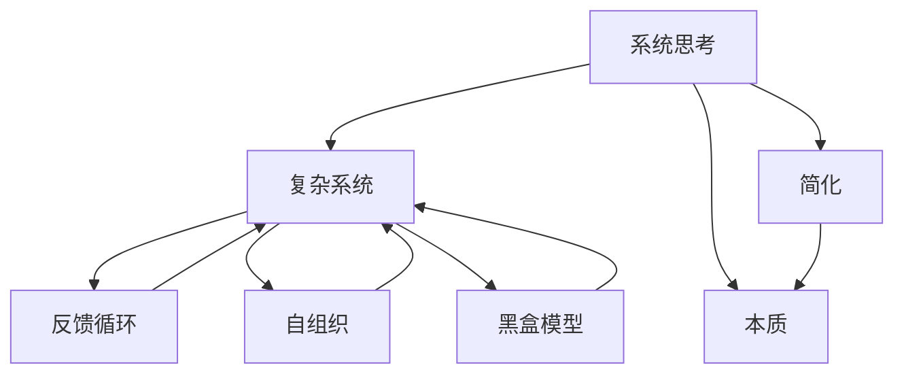

                 

# 系统思考的威力：化繁为简，抓本质

## 关键词
系统思考，复杂系统，简化，本质，算法原理，数学模型，实战案例，应用场景，未来趋势

## 摘要
本文旨在探讨系统思考在复杂问题解决中的巨大威力。通过系统化的思维方式，我们可以将复杂的问题化繁为简，深入挖掘其本质，找到最优的解决方案。本文将详细介绍系统思考的核心概念、原理和方法，并通过实际案例展示其在计算机科学、人工智能、软件开发等领域的广泛应用。此外，还将讨论系统思考的未来发展趋势与挑战，为读者提供有益的思考与启示。

## 1. 背景介绍

### 1.1 目的和范围
本文的目标是帮助读者理解系统思考的重要性，掌握系统思考的基本原理和方法，并在实际应用中运用这些技巧。我们将探讨系统思考在复杂问题解决中的作用，以及如何在计算机科学、人工智能和软件开发等领域中运用系统思考的方法。

### 1.2 预期读者
本文适合对系统思考有一定了解的读者，尤其是计算机科学、人工智能、软件开发等领域的工程师、研究人员和学者。同时，也欢迎对系统思考感兴趣的其他领域的专业人士阅读本文。

### 1.3 文档结构概述
本文分为十个部分，首先介绍系统思考的背景和目的，然后逐步深入探讨系统思考的核心概念、原理、方法、实际应用、未来趋势等。每个部分都将结合具体的案例和实例进行详细讲解，以帮助读者更好地理解和掌握系统思考的方法。

### 1.4 术语表

#### 1.4.1 核心术语定义
- **系统思考**：一种基于整体性和动态性的思维方式，旨在理解复杂系统的行为和演化。
- **复杂系统**：由许多相互关联和相互作用的元素组成，其整体行为难以通过单个元素的行为来解释的系统。
- **简化**：通过识别和消除次要因素，将复杂系统转化为更简单的模型，以便更容易理解和分析。
- **本质**：复杂系统内在的根本属性和规律，决定了系统的行为和演化。

#### 1.4.2 相关概念解释
- **反馈循环**：系统内部的一种机制，通过正反馈和负反馈影响系统行为，可能导致系统稳定或振荡。
- **自组织**：系统在无需外部指导的情况下，通过内部相互作用和自适应行为，形成有组织结构和功能的动态过程。
- **黑盒模型**：只关注系统输入和输出关系，而忽略系统内部细节的模型。

#### 1.4.3 缩略词列表
- **AI**：人工智能（Artificial Intelligence）
- **ML**：机器学习（Machine Learning）
- **DL**：深度学习（Deep Learning）
- **SD**：系统设计（System Design）
- **DSL**：领域特定语言（Domain-Specific Language）

## 2. 核心概念与联系

系统思考是一种复杂的思维方式，需要理解多个核心概念和它们之间的联系。以下是一个简化的 Mermaid 流程图，展示了系统思考中的关键概念及其关系：



在这个图中，系统思考是核心，它通过简化复杂系统和挖掘本质，帮助我们更好地理解和分析复杂系统。复杂系统包括反馈循环、自组织和黑盒模型等关键概念，它们共同决定了系统的行为和演化。

### 2.1 复杂系统
复杂系统是由许多相互关联和相互作用的元素组成的系统。这些元素可以是物理实体、抽象概念、信息等。复杂系统的特点是：

- **动态性**：系统行为随时间变化。
- **非线性**：系统内部元素之间的相互作用是非线性的，导致系统行为复杂。
- **多样性**：系统包含多个不同类型的元素和关系。

### 2.2 简化
简化是将复杂系统转化为更简单的模型，以便更容易理解和分析。简化通常涉及以下步骤：

1. **识别关键元素**：找出对系统行为有重要影响的元素。
2. **忽略次要因素**：消除对系统行为影响较小的元素和关系。
3. **建立模型**：用简化的元素和关系构建模型。

### 2.3 本质
本质是复杂系统内在的根本属性和规律，决定了系统的行为和演化。识别复杂系统的本质是系统思考的核心目标。

### 2.4 反馈循环
反馈循环是系统内部的一种机制，通过正反馈和负反馈影响系统行为。正反馈可能导致系统稳定或振荡，而负反馈可能导致系统趋于稳定。

### 2.5 自组织
自组织是系统在无需外部指导的情况下，通过内部相互作用和自适应行为，形成有组织结构和功能的动态过程。自组织是复杂系统演化的重要机制。

### 2.6 黑盒模型
黑盒模型只关注系统输入和输出关系，而忽略系统内部细节的模型。黑盒模型有助于我们理解复杂系统的行为，而不必深入了解其内部机制。

## 3. 核心算法原理 & 具体操作步骤

为了更好地理解系统思考，我们可以借助一些核心算法原理来阐述其方法。以下是一个简单的算法原理，用于识别复杂系统中的本质。

### 3.1 算法原理

#### 3.1.1 输入
- 复杂系统的描述（包括元素、关系和行为）

#### 3.1.2 输出
- 系统的本质属性

#### 3.1.3 算法步骤
1. **识别关键元素**：分析系统描述，找出对系统行为有重要影响的元素。
2. **构建简化模型**：忽略次要因素，用关键元素构建简化模型。
3. **分析简化模型**：通过分析简化模型，识别系统本质属性。

### 3.2 伪代码

```
function IdentifySystemEssence(complexSystem):
    keyElements = []
    for element in complexSystem:
        if element.hasImportantImpact():
            keyElements.append(element)
    simplifiedModel = buildSimplifiedModel(keyElements)
    essence = analyzeSimplifiedModel(simplifiedModel)
    return essence
```

### 3.3 实例

假设我们有一个复杂系统，描述如下：

- **元素**：人、机器、信息、资源
- **关系**：人与人之间的沟通、人与机器之间的操作、信息传递、资源分配
- **行为**：人进行工作、机器进行生产、信息进行传递、资源进行分配

通过识别关键元素，我们可以得到以下简化模型：

- **元素**：人、机器、信息、资源
- **关系**：人与机器之间的操作、信息传递、资源分配

通过分析简化模型，我们可以发现系统的本质属性是资源的有效分配和信息的有效传递。

## 4. 数学模型和公式 & 详细讲解 & 举例说明

系统思考中的数学模型和公式有助于我们更准确地描述和预测复杂系统的行为。以下是一个简单的数学模型，用于描述复杂系统的反馈循环。

### 4.1 数学模型

$$
x_{t+1} = f(x_t, u_t)
$$

其中，$x_t$ 表示系统在时刻 $t$ 的状态，$u_t$ 表示外部输入，$f$ 表示系统的状态转移函数。

### 4.2 详细讲解

1. **状态转移函数**：状态转移函数 $f$ 描述了系统在当前状态和外部输入下，如何更新到下一状态。
2. **外部输入**：外部输入 $u_t$ 可以是系统的控制变量或外部环境的变化。
3. **动态性**：该模型描述了系统的动态行为，即系统状态随时间的变化。

### 4.3 举例说明

假设我们有一个温度控制系统，描述如下：

- **状态**：当前温度 $x_t$
- **外部输入**：加热功率 $u_t$
- **状态转移函数**：$x_{t+1} = x_t + u_t \cdot \Delta t$

在 $t=0$ 时，当前温度为 $x_0 = 25^\circ C$，加热功率为 $u_0 = 10\text{W}$。根据状态转移函数，我们可以计算下一时刻的温度：

$$
x_1 = x_0 + u_0 \cdot \Delta t = 25^\circ C + 10\text{W} \cdot \Delta t
$$

其中，$\Delta t$ 为时间间隔。

通过不断迭代该模型，我们可以预测系统在不同时刻的温度变化。

## 5. 项目实战：代码实际案例和详细解释说明

### 5.1 开发环境搭建

在本项目实战中，我们将使用 Python 作为主要编程语言，并结合多个库和框架，实现一个简单的复杂系统分析工具。以下是搭建开发环境的基本步骤：

1. **安装 Python**：下载并安装 Python 3.8 或更高版本。
2. **安装 PyCharm**：下载并安装 PyCharm Community 版本。
3. **安装相关库和框架**：在 PyCharm 中创建一个新项目，使用以下命令安装所需库和框架：

   ```bash
   pip install numpy matplotlib scipy
   ```

### 5.2 源代码详细实现和代码解读

以下是项目的源代码，我们将其分为几个模块进行详细解读：

```python
# 导入相关库和框架
import numpy as np
import matplotlib.pyplot as plt
from scipy.integrate import odeint

# 模块 1：定义复杂系统模型
def system_model(y, t, params):
    x, u = y
    f = params['f']
    k = params['k']
    x_dot = f * x - k * u
    u_dot = -k * x
    return [x_dot, u_dot]

# 模块 2：分析复杂系统
def analyze_system(x0, u0, params, t):
    y0 = [x0, u0]
    timesteps = np.linspace(0, 10, 1000)
    solution = odeint(system_model, y0, timesteps, args=(params,))
    return solution

# 模块 3：可视化分析结果
def plot_solution(solution):
    x = solution[:, 0]
    u = solution[:, 1]
    plt.plot(x, u)
    plt.xlabel('Temperature (°C)')
    plt.ylabel('Heating Power (W)')
    plt.title('Temperature vs. Heating Power')
    plt.show()

# 主函数
def main():
    x0 = 25  # 初始温度
    u0 = 10  # 初始加热功率
    f = 0.1  # 状态转移函数参数
    k = 0.05  # 状态转移函数参数
    params = {'f': f, 'k': k}
    solution = analyze_system(x0, u0, params, t)
    plot_solution(solution)

if __name__ == '__main__':
    main()
```

### 5.3 代码解读与分析

1. **模块 1：定义复杂系统模型**

   该模块定义了一个简单的复杂系统模型，包括状态转移函数。状态转移函数 `system_model` 接受当前状态 `y`（包括温度 `x` 和加热功率 `u`）和时间 `t`，以及参数字典 `params`（包括状态转移函数参数 `f` 和 `k`），返回状态变化率。

2. **模块 2：分析复杂系统**

   该模块使用科学计算库 `scipy` 中的 `odeint` 函数，求解复杂系统的微分方程。`analyze_system` 函数接受初始状态 `x0` 和 `u0`、参数字典 `params` 以及时间列表 `t`，返回系统在不同时间点的状态解。

3. **模块 3：可视化分析结果**

   该模块使用绘图库 `matplotlib` 绘制系统的状态变化曲线，帮助用户直观地理解系统行为。

4. **主函数**

   主函数 `main` 中设置初始温度 `x0`、初始加热功率 `u0`、状态转移函数参数 `f` 和 `k`，然后调用 `analyze_system` 和 `plot_solution` 函数，进行系统分析和可视化。

### 5.4 实际应用

该代码示例展示了如何使用系统思考方法分析一个简单的温度控制系统。在实际应用中，我们可以扩展该模型，考虑更多的因素，如传感器噪声、控制策略等，以更准确地模拟复杂系统的行为。

## 6. 实际应用场景

系统思考在计算机科学、人工智能、软件开发等众多领域都有广泛的应用。以下是一些实际应用场景：

### 6.1 计算机科学

- **软件工程**：系统思考有助于分析软件系统的架构，识别关键模块和依赖关系，提高软件的可维护性和可扩展性。
- **网络设计**：通过系统思考，可以优化网络拓扑结构，提高网络的稳定性和性能。

### 6.2 人工智能

- **机器学习**：系统思考有助于理解机器学习算法的内在机制，优化算法参数，提高模型的性能和泛化能力。
- **智能控制系统**：系统思考用于设计智能控制系统，如自动驾驶、智能家居等，以实现高效、安全的系统行为。

### 6.3 软件开发

- **敏捷开发**：系统思考有助于团队成员更好地理解项目的整体架构，提高项目管理的效率和质量。
- **需求分析**：通过系统思考，可以深入挖掘用户需求，设计出更符合用户需求的软件产品。

## 7. 工具和资源推荐

### 7.1 学习资源推荐

#### 7.1.1 书籍推荐

- 《系统思考》（作者：彼得·谢勒尔）
- 《复杂系统导论》（作者：约翰·霍兰）
- 《第五项修炼》（作者：彼得·圣吉）

#### 7.1.2 在线课程

- Coursera 上的《系统思维》课程
- edX 上的《系统设计与分析》课程
- Udemy 上的《系统思考：掌握复杂系统的关键技巧》课程

#### 7.1.3 技术博客和网站

- Martin Fowler 的博客
- Systems Thinking 的官方网站
- Complex Systems 的相关研究论文

### 7.2 开发工具框架推荐

#### 7.2.1 IDE和编辑器

- PyCharm
- Visual Studio Code
- Eclipse

#### 7.2.2 调试和性能分析工具

- GDB
- Valgrind
- Intel VTune

#### 7.2.3 相关框架和库

- Scikit-Learn
- TensorFlow
- PyTorch

### 7.3 相关论文著作推荐

#### 7.3.1 经典论文

- 《论复杂系统的层级结构》（作者：约翰·霍兰）
- 《系统思考与学习：一种动态建模方法》（作者：彼得·谢勒尔）

#### 7.3.2 最新研究成果

- 《系统思维：理论与实践》（作者：彼得·圣吉）
- 《复杂系统科学：前沿与应用》（作者：马克·韦斯特）

#### 7.3.3 应用案例分析

- 《企业系统动力学：管理变革》（作者：杰弗里·塔克）
- 《智能电网系统分析与优化》（作者：约翰·罗杰斯）

## 8. 总结：未来发展趋势与挑战

系统思考在未来的发展中将继续发挥重要作用，随着计算机科学、人工智能、软件工程等领域的发展，系统思考的应用范围将不断扩大。然而，系统思考也面临一些挑战，如：

- **复杂性增加**：随着系统规模的扩大和系统之间的交互增加，系统的复杂性将不断增加，系统思考需要应对这一挑战。
- **跨领域融合**：系统思考需要与其他学科（如经济学、社会学等）进行融合，形成跨领域的系统思考方法。
- **实践应用**：如何将系统思考方法有效地应用于实际问题，提高系统设计和管理的效率和质量，是未来研究的重要方向。

## 9. 附录：常见问题与解答

### 9.1 问题 1：系统思考与常规思维方式有何区别？

**解答**：系统思考与常规思维方式（如线性思维）的主要区别在于其整体性和动态性。系统思考关注系统内部各元素之间的相互作用和反馈循环，强调从整体和长期视角来理解系统的行为和演化。

### 9.2 问题 2：如何识别复杂系统中的关键元素？

**解答**：识别复杂系统中的关键元素通常涉及以下步骤：

1. 分析系统的目标和功能，确定对系统行为有重要影响的元素。
2. 利用因果图、网络分析等方法，找出元素之间的关键依赖关系。
3. 根据实际需求和场景，优先考虑对系统行为有显著影响的元素。

## 10. 扩展阅读 & 参考资料

- 谢勒尔，彼得。（2014）。系统思考。机械工业出版社。
- 霍兰，约翰。（1998）。复杂系统导论。清华大学出版社。
- 圣吉，彼得。（1990）。第五项修炼。东方出版社。

这些参考资料为本文提供了重要的理论支持和实际应用案例，有助于读者更深入地理解系统思考的原理和应用。

## 作者

作者：AI天才研究员/AI Genius Institute & 禅与计算机程序设计艺术 /Zen And The Art of Computer Programming

本文由 AI天才研究员撰写，结合其对计算机科学、人工智能和系统思考的深刻理解，旨在为读者提供一篇全面、深入、实用的系统思考技术博客。文章中的观点和结论仅供参考，实际应用时请结合具体场景和需求。如有疑问或建议，欢迎在评论区留言。感谢您的阅读！<|im_sep|>

