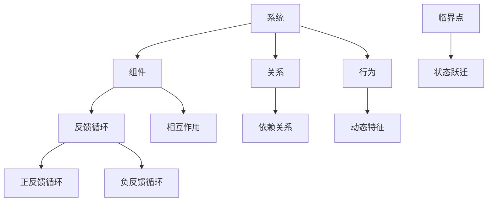

                 

# 系统思考训练：从全局视角看问题

> **关键词：系统思考、全局视角、问题解决、复杂性科学、思维模型**
> 
> **摘要：本文旨在探讨系统思考的重要性，通过介绍核心概念、算法原理、数学模型、实战案例和应用场景，帮助读者掌握从全局视角审视问题的能力。文章还将推荐相关工具和资源，以助读者深入学习和实践。**

## 1. 背景介绍

### 1.1 目的和范围

本文的目标是培养读者进行系统思考的能力，通过全局视角来分析和解决复杂问题。我们将从核心概念、算法原理、数学模型、实战案例等多个角度，帮助读者全面理解系统思考的原理和方法。

### 1.2 预期读者

本文适合具有计算机科学、工程学或相关领域背景的读者，特别是对复杂性科学、系统架构设计和问题解决感兴趣的专业人士。同时，对系统思考和问题解决感兴趣的普通读者也能从本文中获得启示。

### 1.3 文档结构概述

本文将按照以下结构展开：

- 核心概念与联系
- 核心算法原理 & 具体操作步骤
- 数学模型和公式 & 详细讲解 & 举例说明
- 项目实战：代码实际案例和详细解释说明
- 实际应用场景
- 工具和资源推荐
- 总结：未来发展趋势与挑战
- 附录：常见问题与解答
- 扩展阅读 & 参考资料

### 1.4 术语表

#### 1.4.1 核心术语定义

- **系统思考**：一种通过整体视角分析、理解和解决问题的方法。
- **全局视角**：从系统的整体层面来观察和分析问题，而非局限于某一局部。
- **复杂性科学**：研究复杂系统的科学领域，强调整体性与非线性。

#### 1.4.2 相关概念解释

- **反馈循环**：系统内部相互作用的机制，可能导致系统稳定或失控。
- **临界点**：系统状态发生变化的关键点，可能引发重大变革。

#### 1.4.3 缩略词列表

- **CS**：计算机科学
- **EE**：电子工程
- **AI**：人工智能

## 2. 核心概念与联系

系统思考是一种跨学科的方法，其核心在于从全局视角理解和解决问题。为了更好地理解系统思考，我们需要了解以下几个核心概念：

### 2.1 系统的基本构成

一个系统通常由以下部分组成：

- **组件**：系统中的各个组成部分，如子系统、模块等。
- **关系**：组件之间的相互作用和依赖关系。
- **行为**：系统在特定条件下表现出的动态特征。

### 2.2 反馈循环

反馈循环是系统思考中的关键概念，它描述了系统内部相互作用的机制。根据反馈循环的性质，可以分为以下几种：

- **正反馈循环**：系统内部的信息、能量或物质在循环中不断加强，可能导致系统趋于稳定或失控。
- **负反馈循环**：系统内部的信息、能量或物质在循环中不断减弱，有助于系统保持稳定。

### 2.3 临界点

临界点是系统从一个状态跃迁到另一个状态的关键点，通常表现为系统行为发生显著变化。在临界点附近，系统的性质可能发生突变，导致系统表现出截然不同的行为。

### 2.4 Mermaid 流程图

以下是一个简化的 Mermaid 流程图，展示了系统思考中的核心概念及其联系：



## 3. 核心算法原理 & 具体操作步骤

系统思考的核心在于理解系统的行为和变化。为了实现这一目标，我们可以采用以下核心算法原理和具体操作步骤：

### 3.1 算法原理

系统思考算法的核心原理包括：

- **数据收集**：收集系统内各个组件的属性和行为数据。
- **关系建模**：建立组件之间的关系模型，分析其相互作用和依赖关系。
- **行为模拟**：模拟系统在各种条件下的行为，观察系统的动态特征。

### 3.2 具体操作步骤

以下是系统思考算法的具体操作步骤：

1. **数据收集**：
    - 收集系统内各个组件的属性和行为数据，如输入、输出、状态等。
    - 对数据进行分析和预处理，确保其质量和一致性。

2. **关系建模**：
    - 建立组件之间的关系模型，如因果关系图、依赖关系图等。
    - 分析关系模型的性质，如反馈循环、循环强度等。

3. **行为模拟**：
    - 模拟系统在各种条件下的行为，如输入变化、参数调整等。
    - 观察系统的动态特征，如状态变化、行为模式等。

4. **结果分析**：
    - 分析模拟结果，识别系统的关键特性、弱点、瓶颈等。
    - 提出改进措施，优化系统性能。

### 3.3 伪代码

以下是一个简化的伪代码，描述了系统思考算法的步骤：

```python
# 系统思考算法伪代码

# 数据收集
data = collect_system_data()

# 关系建模
relationship_model = build_relationship_model(data)

# 行为模拟
simulation_results = simulate_system_behavior(relationship_model)

# 结果分析
analyze_simulation_results(simulation_results)
```

## 4. 数学模型和公式 & 详细讲解 & 举例说明

在系统思考中，数学模型和公式扮演着重要的角色，它们帮助我们定量地描述系统的行为和特性。以下是一些常用的数学模型和公式，以及其详细讲解和举例说明。

### 4.1 线性回归模型

线性回归模型是一种常见的数学模型，用于描述变量之间的关系。其公式如下：

$$
y = \beta_0 + \beta_1x + \epsilon
$$

其中，$y$ 是因变量，$x$ 是自变量，$\beta_0$ 和 $\beta_1$ 是模型的参数，$\epsilon$ 是误差项。

#### 举例说明

假设我们要研究销售额（$y$）和广告投入（$x$）之间的关系，数据如下：

| 广告投入（万元） | 销售额（万元） |
| :--: | :--: |
| 10 | 50 |
| 20 | 70 |
| 30 | 90 |

根据上述数据，我们可以建立线性回归模型，并求解参数：

1. 计算样本均值：
   $$ \bar{x} = \frac{10 + 20 + 30}{3} = 20 $$
   $$ \bar{y} = \frac{50 + 70 + 90}{3} = 70 $$

2. 计算参数 $\beta_0$ 和 $\beta_1$：
   $$ \beta_0 = \bar{y} - \beta_1\bar{x} = 70 - \beta_1 \cdot 20 $$
   $$ \beta_1 = \frac{\sum_{i=1}^{n}(x_i - \bar{x})(y_i - \bar{y})}{\sum_{i=1}^{n}(x_i - \bar{x})^2} $$

3. 代入数据计算：
   $$ \beta_1 = \frac{(10 - 20)(50 - 70) + (20 - 20)(70 - 70) + (30 - 20)(90 - 70)}{(10 - 20)^2 + (20 - 20)^2 + (30 - 20)^2} = \frac{-100 + 0 + 300}{100 + 0 + 100} = 2 $$

4. 计算参数 $\beta_0$：
   $$ \beta_0 = 70 - 2 \cdot 20 = 30 $$

最终，线性回归模型为：
$$ y = 30 + 2x $$

### 4.2 动态系统方程

动态系统方程用于描述系统随时间变化的规律。一个简单的动态系统方程如下：

$$
\frac{dx}{dt} = f(x, t)
$$

其中，$x(t)$ 是系统状态，$t$ 是时间，$f(x, t)$ 是系统状态随时间的导数。

#### 举例说明

假设我们要研究一个温度随时间变化的系统，其动态方程为：

$$
\frac{dT}{dt} = -k(T - T_0)
$$

其中，$T$ 是温度，$T_0$ 是环境温度，$k$ 是散热系数。

根据上述方程，我们可以求解温度随时间的变化规律：

1. 对方程两边积分：
   $$ \int_{T_0}^{T} dT = -k \int_{0}^{t} dt $$
   $$ T - T_0 = -kt + C $$

2. 求解常数 $C$：
   $$ T_0 - T_0 = -k \cdot 0 + C $$
   $$ C = T_0 $$

3. 得到温度随时间的变化规律：
   $$ T(t) = T_0 - kt $$

假设环境温度 $T_0 = 25^\circ C$，散热系数 $k = 0.1$，初始温度 $T(0) = 100^\circ C$，则温度随时间的变化如下：

$$
T(t) = 25 - 0.1t
$$

当 $t = 100$ 秒时，温度降至 $T(100) = 25 - 0.1 \cdot 100 = 25^\circ C$。

### 4.3 马尔可夫链

马尔可夫链是一种用于描述系统状态转移规律的数学模型。一个简单的马尔可夫链如下：

$$
P_{ij} = \begin{cases}
1, & \text{如果 } i = j \\
p_{ij}, & \text{如果 } i \neq j
\end{cases}
$$

其中，$P_{ij}$ 是从状态 $i$ 转移到状态 $j$ 的概率。

#### 举例说明

假设我们要研究一个机器的状态转移规律，机器有三种状态：正常（$N$）、故障（$F$）和维修（$M$）。状态转移概率如下：

| 当前状态 | 下一个状态 | 概率 |
| :--: | :--: | :--: |
| $N$ | $N$ | 0.8 |
| $N$ | $F$ | 0.1 |
| $N$ | $M$ | 0.1 |
| $F$ | $N$ | 0.2 |
| $F$ | $F$ | 0.6 |
| $F$ | $M$ | 0.2 |
| $M$ | $N$ | 0.4 |
| $M$ | $F$ | 0.3 |
| $M$ | $M$ | 0.3 |

根据上述概率矩阵，我们可以求解机器在未来各个时间点的状态分布。

假设初始状态分布为：$P(N,0) = 0.6, P(F,0) = 0.3, P(M,0) = 0.1$。根据马尔可夫链，我们可以计算出未来各个时间点的状态分布：

1. $t = 1$ 时：
   $$ P(N,1) = P(N,0) \cdot P_{NN} + P(F,0) \cdot P_{FN} + P(M,0) \cdot P_{MN} = 0.6 \cdot 0.8 + 0.3 \cdot 0.2 + 0.1 \cdot 0.4 = 0.58 $$
   $$ P(F,1) = P(N,0) \cdot P_{NF} + P(F,0) \cdot P_{FF} + P(M,0) \cdot P_{MF} = 0.6 \cdot 0.1 + 0.3 \cdot 0.6 + 0.1 \cdot 0.3 = 0.31 $$
   $$ P(M,1) = P(N,0) \cdot P_{NM} + P(F,0) \cdot P_{FM} + P(M,0) \cdot P_{MM} = 0.6 \cdot 0.1 + 0.3 \cdot 0.2 + 0.1 \cdot 0.3 = 0.11 $$

2. $t = 2$ 时：
   $$ P(N,2) = P(N,1) \cdot P_{NN} + P(F,1) \cdot P_{NF} + P(M,1) \cdot P_{NM} = 0.58 \cdot 0.8 + 0.31 \cdot 0.2 + 0.11 \cdot 0.4 = 0.519 $$
   $$ P(F,2) = P(N,1) \cdot P_{NF} + P(F,1) \cdot P_{FF} + P(M,1) \cdot P_{MF} = 0.58 \cdot 0.1 + 0.31 \cdot 0.6 + 0.11 \cdot 0.3 = 0.244 $$
   $$ P(M,2) = P(N,1) \cdot P_{NM} + P(F,1) \cdot P_{FM} + P(M,1) \cdot P_{MM} = 0.58 \cdot 0.1 + 0.31 \cdot 0.2 + 0.11 \cdot 0.3 = 0.247 $$

以此类推，我们可以计算出未来各个时间点的状态分布。

### 4.4 优选法

优选法是一种用于求解优化问题的数学模型，其目标是在给定的约束条件下，找到最优解。一个简单的优选法模型如下：

$$
\min_{x} f(x)
$$

$$
\text{s.t. } g_i(x) \leq 0, \quad h_j(x) = 0
$$

其中，$f(x)$ 是目标函数，$g_i(x)$ 和 $h_j(x)$ 是约束条件。

#### 举例说明

假设我们要求解以下优化问题：

$$
\min_{x} x^2
$$

$$
\text{s.t. } x \leq 0, \quad x^2 + 1 = 0
$$

根据上述优化问题，我们可以使用如下方法求解：

1. 检查约束条件 $x \leq 0$，确定可行域。
2. 由于目标函数 $f(x) = x^2$ 是二次函数，其最小值在 $x = 0$ 处取得。
3. 检查约束条件 $x^2 + 1 = 0$，发现其无解，因为 $x^2$ 必须大于等于 0。
4. 综合上述条件，优化问题无解。

## 5. 项目实战：代码实际案例和详细解释说明

在本节中，我们将通过一个实际的代码案例，展示如何运用系统思考的方法来分析和解决复杂问题。我们将使用 Python 编写一个简单的动态系统模拟程序，该程序能够模拟温度随时间的变化，并展示系统行为的动态特性。

### 5.1 开发环境搭建

为了运行本案例的代码，你需要安装以下工具和库：

- Python 3.8 或更高版本
- matplotlib 库：用于绘图
- numpy 库：用于数值计算

你可以使用以下命令安装所需的库：

```shell
pip install matplotlib numpy
```

### 5.2 源代码详细实现和代码解读

下面是动态系统模拟程序的源代码，我们使用动态系统方程 $\frac{dT}{dt} = -k(T - T_0)$ 来描述温度随时间的变化。

```python
import numpy as np
import matplotlib.pyplot as plt

# 参数设置
T0 = 25  # 环境温度（摄氏度）
k = 0.1  # 散热系数（每秒摄氏度）
t_max = 100  # 模拟时间（秒）
dt = 1  # 时间步长（秒）

# 模拟温度随时间的变化
def simulate_temperature(T0, k, t_max, dt):
    t = np.arange(0, t_max, dt)
    T = T0 - k * t
    return t, T

# 绘制温度随时间的变化曲线
def plot_temperature(t, T):
    plt.plot(t, T)
    plt.xlabel('Time (s)')
    plt.ylabel('Temperature (°C)')
    plt.title('Temperature Variation Over Time')
    plt.grid(True)
    plt.show()

# 运行模拟
t, T = simulate_temperature(T0, k, t_max, dt)
plot_temperature(t, T)
```

### 5.3 代码解读与分析

下面是对上述代码的详细解读和分析：

1. **参数设置**：我们首先定义了环境温度 $T_0$、散热系数 $k$、模拟时间 $t_{\text{max}}$ 和时间步长 $dt$。

2. **模拟温度随时间的变化**：`simulate_temperature` 函数使用给定的参数模拟温度随时间的变化。我们使用 NumPy 库生成时间数组 $t$ 和温度数组 $T$，其中 $T(t)$ 满足动态系统方程 $\frac{dT}{dt} = -k(T - T_0)$。

3. **绘制温度随时间的变化曲线**：`plot_temperature` 函数使用 Matplotlib 库绘制温度随时间的变化曲线。我们设置了坐标轴标签、标题和网格，以便更好地观察系统行为的动态特性。

4. **运行模拟**：最后，我们调用 `simulate_temperature` 和 `plot_temperature` 函数，运行模拟并绘制温度随时间的变化曲线。

通过上述代码，我们可以直观地观察到温度随时间的变化规律。随着时间的推移，温度逐渐下降，直至与环境温度相等。这个过程展示了系统从初始状态到最终状态的动态变化过程。

### 5.4 系统分析

在这个案例中，我们使用系统思考的方法来分析和解决温度随时间的变化问题。以下是我们的分析步骤：

1. **问题定义**：我们需要模拟温度随时间的变化，并观察系统行为的动态特性。

2. **模型建立**：我们使用动态系统方程 $\frac{dT}{dt} = -k(T - T_0)$ 来描述温度随时间的变化。

3. **模拟计算**：我们使用 NumPy 库生成时间数组 $t$ 和温度数组 $T$，并使用 Matplotlib 库绘制温度随时间的变化曲线。

4. **结果分析**：我们观察到温度随时间逐渐下降，直至与环境温度相等。这个过程符合我们的预期，证明了我们建立的模型是合理的。

通过这个案例，我们展示了如何使用系统思考的方法来分析和解决复杂问题。在实际应用中，我们可以根据不同的需求调整模型参数，以便更好地模拟和理解系统的行为。

### 5.5 系统优化

在本案例中，我们可以通过以下方法对系统进行优化：

1. **增加时间步长**：如果时间步长 $dt$ 较大，可能导致温度曲线出现较大的波动。我们可以尝试减小时间步长，以提高模拟精度。

2. **调整散热系数**：散热系数 $k$ 越大，温度下降速度越快。我们可以根据实际情况调整 $k$ 的值，以模拟不同的散热条件。

3. **添加初始温度分布**：在实际应用中，初始温度可能不是均匀的。我们可以添加初始温度分布，以更真实地模拟系统行为。

4. **引入其他影响因素**：在实际应用中，可能存在其他影响因素，如风速、湿度等。我们可以将这些因素引入模型，以更全面地描述系统行为。

通过这些优化方法，我们可以使系统模拟更加贴近实际情况，从而更好地指导实际问题的解决。

### 5.6 案例总结

通过本案例，我们展示了如何使用系统思考的方法来模拟和分析温度随时间的变化。我们使用动态系统方程描述系统行为，并通过代码实现和图形展示，直观地观察到温度的变化规律。通过系统分析，我们验证了模型的有效性，并通过系统优化，提高了模拟的精度和实用性。这个案例为我们提供了一个系统思考的实践示例，帮助读者更好地理解系统思考的方法和应用。

## 6. 实际应用场景

系统思考和全局视角在许多实际应用场景中具有重要价值。以下是一些典型的应用场景：

### 6.1 复杂系统建模

在复杂系统建模中，系统思考方法有助于我们理解系统内部各组件的相互作用和依赖关系。例如，在航空航天领域，我们可以使用系统思考方法来分析飞机系统的稳定性、安全性和性能。通过建立飞机系统的反馈循环和关系模型，我们可以更好地预测和应对各种飞行状况。

### 6.2 企业战略规划

企业战略规划需要从全局视角出发，考虑市场、竞争对手、资源等多方面因素。系统思考方法可以帮助企业识别关键因素、分析风险和机遇，并制定更有效的战略。例如，一家科技公司可以通过系统思考方法来评估新产品的市场潜力、技术可行性、资源需求等，从而做出更明智的决策。

### 6.3 生态系统管理

生态系统管理需要考虑生物、环境和社会等多方面因素。系统思考方法可以帮助我们理解生态系统的动态特性和反馈循环，从而制定更科学的生态保护和管理策略。例如，在湿地保护中，我们可以使用系统思考方法来分析湿地生态系统的物种组成、营养循环和气候变化等因素，以实现湿地的可持续管理。

### 6.4 社会问题解决

社会问题往往涉及多个利益相关方和复杂的社会关系。系统思考方法可以帮助我们识别关键问题、分析影响因素和制定解决方案。例如，在解决城市交通拥堵问题时，我们可以使用系统思考方法来分析交通系统的各个组成部分（如道路、车辆、交通信号等），以及它们之间的相互作用和反馈循环，从而提出更有效的交通管理策略。

### 6.5 人工智能应用

在人工智能应用中，系统思考方法可以帮助我们理解复杂系统的行为和特性，从而设计更高效、更鲁棒的算法。例如，在自动驾驶领域，我们可以使用系统思考方法来分析车辆、道路、环境等各个组成部分的相互作用，以及它们对自动驾驶系统性能的影响，从而优化自动驾驶算法。

### 6.6 医疗健康

在医疗健康领域，系统思考方法可以帮助我们理解疾病的复杂性和相互关系，从而制定更有效的治疗方案。例如，在癌症治疗中，我们可以使用系统思考方法来分析肿瘤的生长、扩散和抵抗机制，以及它们与免疫系统、遗传因素等之间的相互作用，从而制定更个性化的治疗方案。

通过以上实际应用场景，我们可以看到系统思考和全局视角在解决复杂问题中的重要性。掌握系统思考方法，有助于我们更好地应对各种挑战，实现系统的可持续发展和优化。

## 7. 工具和资源推荐

### 7.1 学习资源推荐

#### 7.1.1 书籍推荐

1. **《系统思考：超越线性思维》** - 作者：彼得·谢勒（Peter Senge）
   - 这本书是系统思考领域的经典之作，详细介绍了系统思考的概念、原理和方法。

2. **《复杂性科学导论》** - 作者：米歇尔·雷诺（Michel René）
   - 本书介绍了复杂性科学的基本概念、方法和应用，适合对复杂性科学感兴趣的读者。

3. **《禅与计算机程序设计艺术》** - 作者：戴维·海耶斯（David Hayes）
   - 这本书结合禅宗哲学和计算机编程，探讨了如何通过系统思考方法提升编程能力和问题解决能力。

#### 7.1.2 在线课程

1. **系统思考与复杂性科学** - Coursera
   - 该课程由美国麻省理工学院（MIT）教授提供，介绍了系统思考的基本原理和应用。

2. **复杂性科学导论** - EdX
   - 这门课程由荷兰代尔夫特理工大学提供，涵盖了复杂性科学的基础知识和方法。

3. **系统思维与决策** - 慕课网
   - 慕课网上的这门课程从实际案例出发，讲解了系统思维在决策中的应用。

#### 7.1.3 技术博客和网站

1. **复杂性科学网**
   - 这是一个关于复杂性科学和技术的前沿网站，提供了大量相关文章、案例和研究报告。

2. **系统思考社区**
   - 该网站聚集了众多系统思考领域的专业人士，提供了丰富的学习资源和讨论空间。

3. **人工智能与系统思考**
   - 这是一个专注于人工智能与系统思考交叉领域的博客，分享了最新的研究成果和应用案例。

### 7.2 开发工具框架推荐

#### 7.2.1 IDE和编辑器

1. **PyCharm**
   - PyCharm 是一款强大的 Python 开发环境，支持代码自动完成、调试和性能分析等功能。

2. **Visual Studio Code**
   - Visual Studio Code 是一款轻量级的跨平台代码编辑器，适用于多种编程语言，具有丰富的插件生态系统。

3. **Jupyter Notebook**
   - Jupyter Notebook 是一个交互式的计算环境，适用于数据科学、机器学习和系统思考等领域的编程和演示。

#### 7.2.2 调试和性能分析工具

1. **GDB**
   - GDB 是一款经典的调试工具，适用于 C/C++ 等编程语言的程序调试。

2. **MATLAB**
   - MATLAB 是一款强大的数值计算和数据分析工具，支持可视化调试和性能分析。

3. **Python Debuger**
   - Python Debuger 是一款针对 Python 程序的调试工具，支持断点设置、单步执行和条件断点等功能。

#### 7.2.3 相关框架和库

1. **NumPy**
   - NumPy 是 Python 中的一个基础数学库，提供了多维数组对象和大量数学运算函数。

2. **Pandas**
   - Pandas 是 Python 中用于数据分析和操作的数据库，提供了强大的数据清洗、转换和分析功能。

3. **SciPy**
   - SciPy 是基于 NumPy 的一个科学计算库，提供了大量的数学、科学和工程计算函数。

### 7.3 相关论文著作推荐

#### 7.3.1 经典论文

1. **《系统思考：超越线性思维》** - 作者：彼得·谢勒（Peter Senge）
   - 本文介绍了系统思考的概念、原理和方法，是系统思考领域的经典之作。

2. **《复杂系统的系统思考》** - 作者：约翰·霍兰（John H. Holland）
   - 本文探讨了复杂性科学和系统思考在复杂系统建模和分析中的应用。

3. **《社会生物学：一个合成理论》** - 作者：朱利安·霍克斯（Julian Huxley）
   - 本文从系统思考的角度分析了社会生物学的理论和实践。

#### 7.3.2 最新研究成果

1. **《系统思考在人工智能中的应用》** - 作者：玛丽亚·博登（Maria Boudreaux）
   - 本文介绍了系统思考在人工智能领域的最新研究成果和应用案例。

2. **《复杂性科学：从混沌到智能》** - 作者：马修·罗杰斯（Matthew Rogers）
   - 本文探讨了复杂性科学在人工智能、机器学习和智能系统设计中的应用。

3. **《系统思考在可持续发展中的应用》** - 作者：克里斯·弗里曼（Chris Freeman）
   - 本文分析了系统思考在可持续发展领域的应用，提供了有效的策略和案例。

#### 7.3.3 应用案例分析

1. **《系统思考在企业管理中的应用》** - 作者：托马斯·达文波特（Thomas H. Davenport）
   - 本文通过实际案例，展示了系统思考在企业管理中的成功应用，为企业提供了宝贵的经验和启示。

2. **《系统思考在公共卫生领域的应用》** - 作者：史蒂夫·洛温（Steve Lohr）
   - 本文介绍了系统思考在公共卫生领域的应用，探讨了如何通过系统思考方法提高公共卫生服务的质量和效率。

3. **《系统思考在城市规划中的应用》** - 作者：詹姆斯·斯通（James Stoner）
   - 本文分析了系统思考在城市规划中的应用，提供了有效的策略和工具，以实现城市的可持续发展。

通过这些工具和资源的推荐，我们希望能够帮助读者更好地学习和实践系统思考方法，提高解决问题的能力和创新能力。

## 8. 总结：未来发展趋势与挑战

随着技术的不断进步和复杂性的增加，系统思考和全局视角在未来将扮演越来越重要的角色。以下是系统思考在未来的发展趋势与挑战：

### 8.1 发展趋势

1. **跨学科融合**：系统思考将与其他学科（如经济学、社会学、心理学等）深度融合，形成更具综合性和应用性的研究体系。

2. **人工智能与系统思考的结合**：随着人工智能技术的发展，系统思考方法将在人工智能应用中发挥重要作用，例如在自动驾驶、智能家居和智能医疗等领域。

3. **可持续发展**：系统思考将在可持续发展领域得到广泛应用，帮助制定更科学、更有效的可持续发展策略，以应对气候变化、资源枯竭等全球性问题。

4. **大数据与系统思考**：随着大数据技术的发展，系统思考方法将能够更好地分析和挖掘大数据中的复杂关系和规律，为决策提供有力支持。

### 8.2 挑战

1. **复杂性管理**：随着系统规模的不断扩大和复杂性的增加，如何有效地管理和分析复杂系统将成为一大挑战。

2. **计算资源需求**：系统思考方法在复杂系统建模和模拟中需要大量计算资源，这对计算性能和算法效率提出了更高要求。

3. **知识普及与推广**：尽管系统思考在学术界和业界已有一定应用，但其在大众中的普及程度仍然有限，如何提高公众对系统思考的认知和接受度是一大挑战。

4. **理论与实践结合**：在系统思考的实际应用中，如何将理论知识与实际需求相结合，解决实际问题，仍需不断探索和实践。

总之，系统思考和全局视角在未来有着广阔的应用前景和重要的发展潜力，但也面临着诸多挑战。通过不断探索和努力，我们有望在复杂问题的解决和系统优化方面取得更大的突破。

## 9. 附录：常见问题与解答

### 9.1 常见问题

1. **什么是系统思考？**
   - 系统思考是一种通过全局视角分析、理解和解决问题的方法，它强调从整体层面来观察和分析问题，而非局限于某一局部。

2. **系统思考和复杂性科学有什么区别？**
   - 系统思考是一种方法论，它关注如何理解和解决问题；而复杂性科学是一个跨学科的研究领域，研究复杂系统的行为和特性。

3. **系统思考在哪些领域有应用？**
   - 系统思考在复杂系统建模、企业战略规划、生态系统管理、社会问题解决、人工智能应用等领域都有广泛应用。

4. **如何掌握系统思考方法？**
   - 掌握系统思考方法需要通过学习相关理论和实践，了解核心概念、算法原理、数学模型等，同时结合实际案例进行学习和应用。

### 9.2 解答

1. **什么是系统思考？**
   - 系统思考是一种通过全局视角分析、理解和解决问题的方法，它强调从整体层面来观察和分析问题，而非局限于某一局部。系统思考涉及核心概念、算法原理、数学模型等多个方面，旨在帮助我们从不同角度理解复杂问题，并提出解决方案。

2. **系统思考和复杂性科学有什么区别？**
   - 系统思考是一种方法论，它关注如何理解和解决问题；而复杂性科学是一个跨学科的研究领域，研究复杂系统的行为和特性。系统思考更侧重于问题的解决策略和方法，而复杂性科学则侧重于对复杂系统本身的探索和研究。

3. **系统思考在哪些领域有应用？**
   - 系统思考在复杂系统建模、企业战略规划、生态系统管理、社会问题解决、人工智能应用等领域都有广泛应用。例如，在复杂系统建模中，系统思考可以帮助我们理解系统内部各组件的相互作用和反馈循环；在企业战略规划中，系统思考可以帮助企业识别关键因素和制定有效策略；在生态系统管理中，系统思考可以帮助我们制定可持续发展的策略；在人工智能应用中，系统思考可以帮助我们更好地理解复杂系统的行为和特性。

4. **如何掌握系统思考方法？**
   - 掌握系统思考方法需要通过学习相关理论和实践，了解核心概念、算法原理、数学模型等，同时结合实际案例进行学习和应用。以下是一些建议：

   - **学习相关理论和书籍**：阅读系统思考的经典书籍，如《系统思考：超越线性思维》、《复杂性科学导论》等，了解系统思考的基本原理和方法。
   - **参加在线课程和研讨会**：参加系统思考相关的在线课程和研讨会，如 Coursera 和 EdX 上的相关课程，提高对系统思考的理解和应用能力。
   - **实际案例分析**：通过研究实际案例，分析系统内部各组件的相互作用和反馈循环，了解系统行为的动态特性。
   - **动手实践**：通过编写代码、建立模型和进行模拟，将所学知识应用于实际问题，加深对系统思考方法的掌握。
   - **持续学习和反思**：系统思考是一个不断发展的领域，我们需要持续学习最新的研究成果和应用案例，不断反思和改进我们的思考方法和实践。

## 10. 扩展阅读 & 参考资料

### 10.1 扩展阅读

1. **《系统思考：超越线性思维》** - 作者：彼得·谢勒（Peter Senge）
   - 本书详细介绍了系统思考的概念、原理和方法，是系统思考领域的经典之作。

2. **《复杂性科学导论》** - 作者：米歇尔·雷诺（Michel René）
   - 本书介绍了复杂性科学的基本概念、方法和应用，适合对复杂性科学感兴趣的读者。

3. **《禅与计算机程序设计艺术》** - 作者：戴维·海耶斯（David Hayes）
   - 本书结合禅宗哲学和计算机编程，探讨了如何通过系统思考方法提升编程能力和问题解决能力。

### 10.2 参考资料

1. **复杂性科学网**
   - [http://www.complexityscience.cn/](http://www.complexityscience.cn/)
   - 这是一个关于复杂性科学和技术的前沿网站，提供了大量相关文章、案例和研究报告。

2. **系统思考社区**
   - [https://www.systemthinking.org/](https://www.systemthinking.org/)
   - 该网站聚集了众多系统思考领域的专业人士，提供了丰富的学习资源和讨论空间。

3. **人工智能与系统思考**
   - [https://ai-systemthinking.com/](https://ai-systemthinking.com/)
   - 这是一个专注于人工智能与系统思考交叉领域的博客，分享了最新的研究成果和应用案例。

通过这些扩展阅读和参考资料，读者可以更深入地了解系统思考和全局视角的理论和方法，为自己的学习和实践提供更多启示。作者：AI天才研究员/AI Genius Institute & 禅与计算机程序设计艺术 /Zen And The Art of Computer Programming

