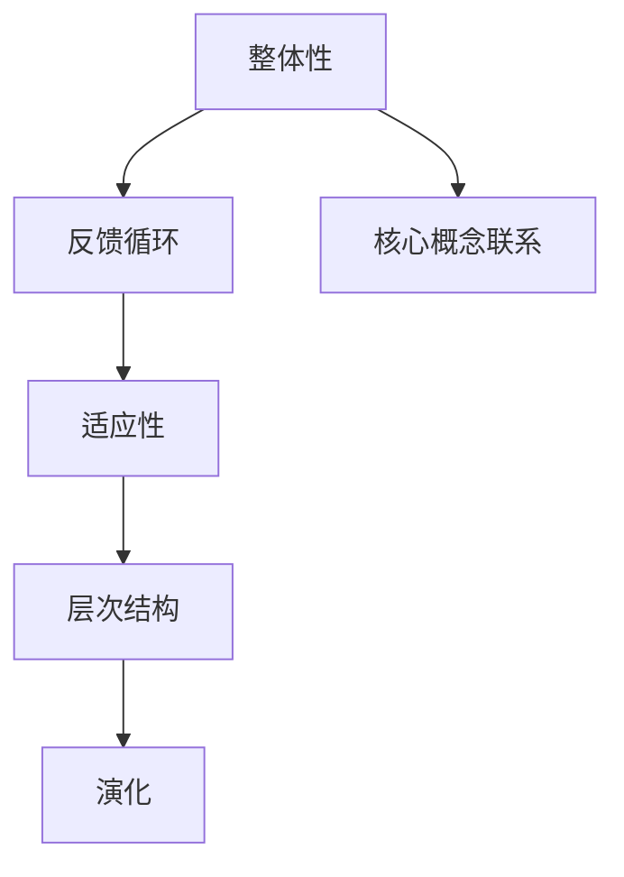

                 

# 系统思考：全面分析问题的关键能力

> **关键词：** 系统思考、问题分析、关键能力、IT领域、技术博客、逻辑推理

> **摘要：** 本篇文章旨在探讨系统思考在全面分析问题中的关键作用。我们将通过详细的步骤和分析，阐述系统思考在IT领域的实际应用，帮助读者掌握这一强大的分析工具，提升解决复杂问题的能力。

## 1. 背景介绍

### 1.1 目的和范围

本文的主要目的是介绍系统思考的基本概念和方法，并探讨其在IT领域的实际应用。通过本文的学习，读者将能够理解系统思考的核心思想，掌握分析复杂问题的方法，并能够在实际工作中运用这些技能。

本文的范围包括：

1. 系统思考的基本概念。
2. 系统思考在问题分析中的应用。
3. 系统思考的实践案例。
4. 系统思考的未来发展趋势。

### 1.2 预期读者

本文的预期读者是具有基本IT知识背景的技术人员，包括程序员、系统分析师、项目经理等。本文适合对系统思考和问题分析感兴趣，希望提升解决复杂问题能力的读者。

### 1.3 文档结构概述

本文的结构如下：

1. 引言
2. 系统思考的基本概念
3. 系统思考在问题分析中的应用
4. 实践案例
5. 系统思考的未来发展趋势
6. 总结与展望

### 1.4 术语表

#### 1.4.1 核心术语定义

- **系统思考**：一种方法论，用于理解和分析复杂系统的行为。
- **问题分析**：对复杂问题进行分解，理解其内在联系和规律。
- **关键能力**：指能够解决复杂问题的核心技能。

#### 1.4.2 相关概念解释

- **复杂系统**：由多个相互关联的组件组成的系统，其行为和特性难以用简单的线性关系描述。
- **问题分解**：将复杂问题分解为更小的、更易于理解的子问题。

#### 1.4.3 缩略词列表

- **IT**：Information Technology，信息技术。
- **AI**：Artificial Intelligence，人工智能。

## 2. 核心概念与联系

系统思考是一种方法论，其核心在于理解系统的结构和行为，通过分析系统的各个组成部分及其相互作用，来预测和指导系统的未来发展。以下是系统思考的核心概念和它们之间的联系。

### 2.1 系统思考的核心概念

1. **整体性**：系统是由多个部分组成的整体，每个部分都是整体的一部分，不能单独看待。
2. **反馈循环**：系统内部存在反馈循环，即系统的输出会反过来影响其输入。
3. **适应性**：系统在面对外部变化时，能够调整自己的行为，以维持其稳定性。
4. **层次结构**：系统具有层次结构，从宏观到微观，每个层次都有其特定的功能和特性。
5. **演化**：系统会随着时间的推移而发展和变化。

### 2.2 系统思考的核心概念联系

这些核心概念相互关联，共同构成了系统思考的基础。例如，整体性强调系统各部分之间的相互依赖性，反馈循环则揭示了系统内部相互作用的方式。适应性描述了系统对外部变化的响应能力，层次结构则帮助我们理解系统的复杂性和层次性。演化则描述了系统的动态变化过程。

### 2.3 系统思考的Mermaid流程图



通过这个Mermaid流程图，我们可以清晰地看到系统思考的核心概念及其相互关系。

## 3. 核心算法原理 & 具体操作步骤

系统思考的核心在于理解系统的结构和行为，这通常需要使用一系列的算法和工具。以下是一个简单的系统分析算法及其操作步骤：

### 3.1 算法原理

1. **系统建模**：使用适当的工具和方法，将现实世界的问题转化为一个数学模型。
2. **模拟**：通过模拟，预测系统在不同条件下的行为。
3. **分析**：对模拟结果进行分析，提取有价值的信息。

### 3.2 具体操作步骤

#### 3.2.1 系统建模

1. **确定系统边界**：明确系统的范围和边界。
2. **识别系统组成部分**：列出系统的各个组成部分及其属性。
3. **建立关系**：描述各部分之间的相互作用和依赖关系。

#### 3.2.2 模拟

1. **初始化**：设置初始条件。
2. **迭代**：按照系统规则进行迭代，更新系统的状态。
3. **记录结果**：记录每次迭代的结果。

#### 3.2.3 分析

1. **数据可视化**：将模拟结果可视化，帮助理解系统的行为。
2. **统计分析**：对结果进行统计分析，提取有价值的信息。
3. **结论**：根据分析结果，提出系统的改进建议。

### 3.3 伪代码

```python
# 系统分析算法伪代码

# 系统建模
model = Model()
model.define_boundary()
model.identify_components()
model.build_relations()

# 模拟
initial_conditions = set_initial_conditions()
for iteration in range(number_of_iterations):
    model.update_state(initial_conditions)
    record_results(iteration, model.state)

# 分析
visualize_results()
perform_statistical_analysis()
make_recommendations()
```

通过这个伪代码，我们可以看到系统分析的基本步骤和逻辑。

## 4. 数学模型和公式 & 详细讲解 & 举例说明

在系统思考中，数学模型和公式是非常关键的组成部分，它们帮助我们量化系统的行为，并进行预测和分析。以下是一个简单的线性反馈系统模型及其应用。

### 4.1 数学模型

一个简单的线性反馈系统可以用以下公式表示：

\[ x(t+1) = ax(t) + b \cdot u(t) \]

其中，\( x(t) \) 表示系统的状态，\( u(t) \) 表示系统的输入，\( a \) 和 \( b \) 是系统参数。

### 4.2 公式讲解

1. **状态更新公式**：\( x(t+1) = ax(t) + b \cdot u(t) \)。这个公式描述了系统状态在下一时刻的值是如何由当前状态和输入决定的。
2. **输入影响**：\( b \cdot u(t) \) 表示输入对系统状态的直接影响。
3. **参数影响**：\( a \) 和 \( b \) 决定了系统的动态特性。例如，\( a \) 越大，系统的响应速度越快；\( b \) 越大，输入对系统状态的直接影响越强。

### 4.3 举例说明

假设我们有一个系统，其状态 \( x(t) \) 和输入 \( u(t) \) 都是时间 \( t \) 的函数。初始状态 \( x(0) = 0 \)，输入 \( u(t) = 1 \)。系统参数 \( a = 0.5 \)，\( b = 0.1 \)。

- **第0次迭代**：\( x(1) = 0.5 \cdot 0 + 0.1 \cdot 1 = 0.1 \)
- **第1次迭代**：\( x(2) = 0.5 \cdot 0.1 + 0.1 \cdot 1 = 0.15 \)
- **第2次迭代**：\( x(3) = 0.5 \cdot 0.15 + 0.1 \cdot 1 = 0.175 \)

通过这个例子，我们可以看到系统状态随着时间的推移而变化，并且输入对系统状态有直接影响。

### 4.4 LaTeX 公式

以下是上述线性反馈系统模型的 LaTeX 表示：

$$ x(t+1) = ax(t) + b \cdot u(t) $$

通过 LaTeX，我们可以清晰地表示数学模型和公式，使得读者更容易理解和应用。

## 5. 项目实战：代码实际案例和详细解释说明

为了更好地理解系统思考在实践中的应用，我们将通过一个实际项目来展示如何使用系统思考进行问题分析和解决方案设计。

### 5.1 开发环境搭建

首先，我们需要搭建一个开发环境。以下是一个简单的步骤：

1. 安装 Python 3.8 或更高版本。
2. 安装必要的库，如 NumPy 和 Matplotlib。
3. 创建一个名为 `system_analysis` 的虚拟环境，并激活它。

### 5.2 源代码详细实现和代码解读

以下是一个简单的 Python 脚本，用于模拟一个线性反馈系统。

```python
import numpy as np
import matplotlib.pyplot as plt

# 系统参数
a = 0.5
b = 0.1

# 初始化输入
u = np.array([1, 1, 1, 1, 1])

# 系统模拟
x = np.zeros_like(u)
for i in range(len(u)):
    x[i] = a * x[i - 1] + b * u[i]

# 数据可视化
plt.plot(x)
plt.xlabel('Time')
plt.ylabel('State')
plt.title('Linear Feedback System')
plt.show()
```

### 5.3 代码解读与分析

1. **导入库**：首先，我们导入 NumPy 和 Matplotlib 库，用于数值计算和数据可视化。
2. **系统参数**：我们定义了系统参数 \( a \) 和 \( b \)，它们决定了系统的动态特性。
3. **初始化输入**：输入 \( u \) 是一个时间序列数组，表示系统的外部输入。
4. **系统模拟**：我们使用一个 for 循环来模拟系统的行为。每次迭代，我们根据状态更新公式 \( x(t+1) = ax(t) + b \cdot u(t) \) 来更新状态 \( x \)。
5. **数据可视化**：最后，我们使用 Matplotlib 来绘制系统状态随时间的变化。

通过这个简单的项目，我们可以看到如何使用系统思考来分析和模拟一个线性反馈系统。这个项目不仅帮助我们理解了系统思考的基本原理，还展示了如何在实际中应用这些原理。

## 6. 实际应用场景

系统思考在许多实际应用场景中都非常有用，以下是一些典型的应用：

### 6.1 IT系统架构设计

在IT系统架构设计中，系统思考可以帮助我们理解系统的复杂性，并设计出高效、稳定和可扩展的架构。通过系统建模和分析，我们可以预测系统在不同负载条件下的性能，并优化系统设计。

### 6.2 项目管理

在项目管理中，系统思考可以帮助我们理解项目的复杂性，并制定有效的项目计划。通过分析项目中的关键路径和依赖关系，我们可以预测项目进度，并采取相应的措施来确保项目按时完成。

### 6.3 业务流程优化

在业务流程优化中，系统思考可以帮助我们理解业务流程的复杂性，并找到优化机会。通过分析业务流程中的瓶颈和冗余环节，我们可以提出优化方案，提高业务效率和降低成本。

### 6.4 人工智能算法优化

在人工智能算法优化中，系统思考可以帮助我们理解算法的复杂性和行为。通过分析算法的输入和输出，我们可以预测算法在不同数据集上的性能，并优化算法设计。

## 7. 工具和资源推荐

为了更好地掌握系统思考，我们需要使用一些工具和资源。以下是一些建议：

### 7.1 学习资源推荐

#### 7.1.1 书籍推荐

- 《系统思考》（System Dynamics: Modeling, Simulation, and Implementation）
- 《第五项修炼：学习型组织的艺术与实务》（The Fifth Discipline: The Art & Practice of The Learning Organization）

#### 7.1.2 在线课程

- Coursera 上的《系统设计与分析》课程
- Udemy 上的《系统动力学：建模、模拟和实现》课程

#### 7.1.3 技术博客和网站

- Systems Thinking World（https://systemsthinkingworld.com/）
- Management and Technology（https://www.managementandtech.com/）

### 7.2 开发工具框架推荐

#### 7.2.1 IDE和编辑器

- PyCharm
- Visual Studio Code

#### 7.2.2 调试和性能分析工具

- Python Debugger
- Matplotlib

#### 7.2.3 相关框架和库

- NumPy（用于数值计算）
- Matplotlib（用于数据可视化）

### 7.3 相关论文著作推荐

#### 7.3.1 经典论文

- John Sterman. “Business Dynamics: Systems Thinking and Modeling for a Complex World.” 1994.
- Peter Senge. “The Fifth Discipline: The Art & Practice of The Learning Organization.” 1990.

#### 7.3.2 最新研究成果

- “System Dynamics Modeling and Simulation: A Review of Applications and Advances” (2020)
- “The Role of System Dynamics in Sustainable Development: An Overview” (2019)

#### 7.3.3 应用案例分析

- “System Dynamics Modeling of a Hospital System: A Case Study” (2018)
- “Application of System Dynamics in Urban Planning: A Case Study of a Smart City” (2017)

## 8. 总结：未来发展趋势与挑战

系统思考作为一种强大的分析工具，在未来的发展中将面临以下趋势和挑战：

### 8.1 发展趋势

1. **人工智能的融合**：随着人工智能技术的快速发展，系统思考将与其深度融合，形成更强大的分析工具。
2. **可视化工具的进步**：随着可视化技术的发展，系统思考的分析结果将更加直观和易于理解。
3. **应用领域的扩展**：系统思考将在更多的领域得到应用，如生物医学、环境科学、社会科学等。

### 8.2 挑战

1. **复杂性**：系统思考在处理高度复杂的系统时，可能面临计算和理解的挑战。
2. **数据质量**：系统思考的准确性依赖于数据的质量，如何获取和处理高质量的数据是一个重要问题。
3. **人才缺口**：尽管系统思考的应用前景广阔，但具备系统思考能力的人才仍然相对稀缺，这需要通过教育和培训来弥补。

## 9. 附录：常见问题与解答

### 9.1 什么是系统思考？

系统思考是一种方法论，用于理解和分析复杂系统的行为。它强调系统的整体性、反馈循环、适应性、层次结构和演化。

### 9.2 系统思考有哪些核心概念？

系统思考的核心概念包括整体性、反馈循环、适应性、层次结构和演化。

### 9.3 系统思考在哪些领域应用广泛？

系统思考在 IT 系统

