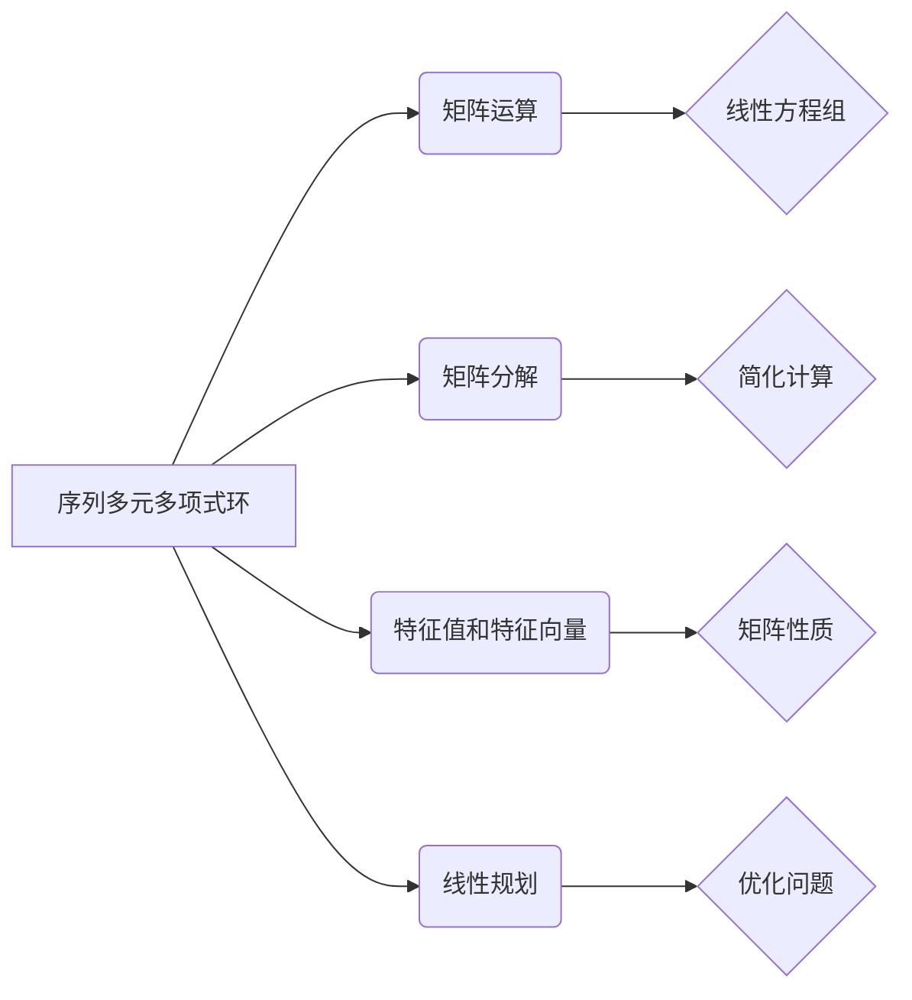

                 

# 线性代数导引：序列多元多项式环

> **关键词**：线性代数、序列、多元多项式、环、矩阵运算、矩阵分解、算法原理、数学模型、编程实战、应用场景。

> **摘要**：本文旨在深入探讨线性代数在序列多元多项式环中的应用，通过逐步分析和推理，阐述核心概念、算法原理、数学模型及其在实际编程中的应用。文章将从背景介绍、核心概念与联系、核心算法原理、数学模型和公式、项目实战、实际应用场景等多个角度，全面解析线性代数的奥秘，帮助读者更好地理解和掌握这一重要数学工具。

## 1. 背景介绍

### 1.1 目的和范围

线性代数是数学的一个分支，研究向量空间、线性变换以及线性方程组的理论和方法。本文的目的是深入探讨线性代数在序列多元多项式环中的应用，旨在帮助读者理解线性代数在解决实际问题中的重要作用。本文将围绕以下几个核心主题展开：

1. **核心概念与联系**：介绍序列多元多项式环的基本概念及其与线性代数的联系。
2. **核心算法原理**：详细讲解线性代数在序列多元多项式环中的核心算法原理，并通过伪代码进行阐述。
3. **数学模型和公式**：解析线性代数在序列多元多项式环中的数学模型和公式，并给出具体例子。
4. **项目实战**：通过实际编程案例，展示如何运用线性代数解决实际问题。
5. **实际应用场景**：探讨线性代数在序列多元多项式环中的实际应用场景，包括在计算机科学、物理学、经济学等领域的应用。
6. **工具和资源推荐**：推荐相关学习资源、开发工具和经典论文，为读者提供深入学习和研究的途径。
7. **总结与未来发展趋势**：总结本文内容，并探讨线性代数在序列多元多项式环中的未来发展趋势和面临的挑战。

### 1.2 预期读者

本文适合以下读者群体：

1. 计算机科学和数学专业的本科生和研究生，特别是对线性代数和算法设计感兴趣的学生。
2. 计算机程序员和软件开发人员，希望深入了解线性代数在实际编程中的应用。
3. 物理学、经济学、工程学等领域的研究人员，对线性代数在相关领域的应用有所了解，并希望进一步深入学习。
4. 对线性代数感兴趣的自学者，希望通过本文掌握线性代数的基本概念和应用。

### 1.3 文档结构概述

本文的结构如下：

1. **引言**：介绍线性代数在序列多元多项式环中的应用背景和目的。
2. **背景介绍**：概述线性代数和序列多元多项式环的基本概念。
3. **核心概念与联系**：介绍序列多元多项式环的基本概念和线性代数的联系，使用Mermaid流程图展示核心概念和架构。
4. **核心算法原理**：详细讲解线性代数在序列多元多项式环中的核心算法原理，并使用伪代码进行阐述。
5. **数学模型和公式**：解析线性代数在序列多元多项式环中的数学模型和公式，并给出具体例子。
6. **项目实战**：通过实际编程案例，展示如何运用线性代数解决实际问题。
7. **实际应用场景**：探讨线性代数在序列多元多项式环中的实际应用场景。
8. **工具和资源推荐**：推荐相关学习资源、开发工具和经典论文。
9. **总结：未来发展趋势与挑战**：总结本文内容，并探讨线性代数在序列多元多项式环中的未来发展趋势和面临的挑战。
10. **附录：常见问题与解答**：回答读者可能遇到的问题。
11. **扩展阅读 & 参考资料**：提供进一步的阅读资料。

### 1.4 术语表

#### 1.4.1 核心术语定义

1. **线性代数**：研究向量空间、线性变换以及线性方程组的理论和方法。
2. **序列多元多项式环**：由序列和多元多项式构成的环，具有封闭性、结合律、交换律、分配律等性质。
3. **矩阵**：由数构成的二维数组，用于表示线性变换和线性方程组。
4. **线性方程组**：由线性变换构成的方程组，可以使用矩阵进行表示。
5. **特征值和特征向量**：矩阵的特征值和对应的特征向量，用于描述矩阵的性质。
6. **线性规划**：在满足一定约束条件下，求解线性函数的最大值或最小值。

#### 1.4.2 相关概念解释

1. **向量空间**：满足向量加法和标量乘法运算的集合，具有封闭性、结合律、交换律、分配律等性质。
2. **线性变换**：将一个向量空间映射到另一个向量空间的函数，保持向量加法和标量乘法的运算。
3. **环**：满足加法和乘法运算的集合，具有封闭性、结合律、交换律、分配律等性质。
4. **序列**：按照一定规律排列的一组数。
5. **多元多项式**：由多个单项式构成的代数式，每个单项式包含一个系数和一个或多个变量的乘积。

#### 1.4.3 缩略词列表

- **线性代数**：Linear Algebra
- **序列多元多项式环**：Ring of Sequences and Multivariate Polynomials
- **矩阵**：Matrix
- **线性方程组**：Linear System of Equations
- **特征值**：Eigenvalue
- **特征向量**：Eigenvector
- **线性规划**：Linear Programming
- **向量空间**：Vector Space
- **线性变换**：Linear Transformation
- **环**：Ring

## 2. 核心概念与联系

### 2.1 序列多元多项式环的基本概念

序列多元多项式环是由序列和多元多项式构成的环。在数学中，序列可以看作是数列的推广，而多元多项式是由多个单项式构成的代数式。序列多元多项式环的基本概念包括：

1. **序列**：按照一定规律排列的一组数。例如，\(a_1, a_2, a_3, \ldots\) 是一个序列。
2. **多元多项式**：由多个单项式构成的代数式。每个单项式包含一个系数和一个或多个变量的乘积。例如，\(3x^2y + 2xy^2 - 5\) 是一个多元多项式。

序列多元多项式环的定义如下：

> **序列多元多项式环**：设 \(R\) 是一个环，则由所有序列构成的集合 \(S(R) = \{a_1, a_2, a_3, \ldots | a_i \in R, i = 1, 2, 3, \ldots\}\) 构成的环称为序列多元多项式环。

### 2.2 线性代数在序列多元多项式环中的应用

线性代数在序列多元多项式环中的应用主要体现在以下几个方面：

1. **矩阵运算**：矩阵是线性代数中的重要工具，可以用于表示线性变换和线性方程组。在序列多元多项式环中，矩阵可以用于表示序列的线性变换和线性方程组。

2. **矩阵分解**：矩阵分解是将矩阵分解为若干个简单矩阵的乘积的过程。在序列多元多项式环中，矩阵分解可以用于简化复杂的线性方程组的求解。

3. **特征值和特征向量**：特征值和特征向量是矩阵的重要性质，可以用于描述矩阵的性质。在序列多元多项式环中，特征值和特征向量可以用于研究序列的稳定性、周期性等性质。

4. **线性规划**：线性规划是求解线性函数在满足一定约束条件下的最优值的问题。在序列多元多项式环中，线性规划可以用于优化序列的取值，以实现特定目标。

### 2.3 Mermaid 流程图展示核心概念和架构

为了更直观地展示序列多元多项式环和线性代数之间的联系，我们使用Mermaid流程图来表示核心概念和架构。



### 2.4 核心概念和架构的联系

序列多元多项式环和线性代数之间的联系主要体现在以下几个方面：

1. **矩阵运算**：矩阵运算可以用于表示序列的线性变换和线性方程组。通过矩阵运算，可以方便地解决序列的线性问题。
2. **矩阵分解**：矩阵分解可以用于简化复杂的线性方程组的求解。通过矩阵分解，可以将复杂的线性方程组转化为简单的矩阵运算。
3. **特征值和特征向量**：特征值和特征向量可以用于研究序列的性质。通过特征值和特征向量，可以了解序列的稳定性、周期性等性质。
4. **线性规划**：线性规划可以用于优化序列的取值。通过线性规划，可以在满足一定约束条件下，找到最优的序列取值。

## 3. 核心算法原理 & 具体操作步骤

### 3.1 线性方程组的求解

线性方程组是线性代数中的基本问题，其求解在序列多元多项式环中同样具有重要的应用。下面，我们介绍一种常用的求解线性方程组的方法——高斯消元法。

#### 3.1.1 高斯消元法的算法原理

高斯消元法是一种通过矩阵运算求解线性方程组的方法。其基本思想是，通过初等行变换将系数矩阵转化为上三角矩阵，然后利用上三角矩阵求解线性方程组。

高斯消元法的具体步骤如下：

1. **初始设置**：给定线性方程组 \(Ax = b\)，其中 \(A\) 是系数矩阵，\(x\) 是未知数向量，\(b\) 是常数向量。

2. **初等行变换**：通过初等行变换，将系数矩阵 \(A\) 转化为上三角矩阵 \(U\)。

3. **求解方程组**：利用上三角矩阵 \(U\) 求解线性方程组 \(Ux = b\)。

4. **回代求解**：利用回代法求解线性方程组 \(Ux = b\)。

#### 3.1.2 高斯消元法的伪代码实现

```plaintext
算法 高斯消元法(A, b)
输入：系数矩阵 A，常数向量 b
输出：解向量 x

// 初始化解向量 x
x = zeros(size(b))

// 对 A 进行初等行变换，转化为上三角矩阵 U
for i = 1 to n-1
    for j = i to n
        if A[i][i] == 0
            return "方程组无解"
        end if
        factor = A[j][i] / A[i][i]
        for k = i to n
            A[j][k] = A[j][k] - factor * A[i][k]
        end for
    end for
end for

// 求解上三角矩阵 U 的方程组 Ux = b
for i = n to 1
    x[i] = (b[i] - sum(A[i, j] * x[j] for j = i+1 to n)) / A[i][i]
end for

return x
```

#### 3.1.3 高斯消元法在序列多元多项式环中的应用

高斯消元法在序列多元多项式环中的应用主要体现在两个方面：

1. **求解线性方程组**：在序列多元多项式环中，可以使用高斯消元法求解线性方程组。通过将系数矩阵和常数向量转化为序列多元多项式环中的元素，可以方便地使用高斯消元法求解线性方程组。
2. **矩阵分解**：高斯消元法本质上是一种矩阵分解方法。在序列多元多项式环中，可以使用高斯消元法对系数矩阵进行分解，从而简化线性方程组的求解过程。

### 3.2 特征值和特征向量的求解

特征值和特征向量是矩阵的重要性质，可以用于描述矩阵的性质。在序列多元多项式环中，特征值和特征向量的求解具有重要的应用价值。

#### 3.2.1 特征值和特征向量的算法原理

特征值和特征向量的求解可以通过求解矩阵的特征多项式来实现。特征多项式是矩阵 \(A\) 的多项式，定义为 \(f(\lambda) = \det(A - \lambda I)\)，其中 \(\lambda\) 是特征值，\(I\) 是单位矩阵。

特征值和特征向量的求解步骤如下：

1. **求解特征多项式**：计算矩阵 \(A\) 的特征多项式 \(f(\lambda)\)。
2. **求根**：求解特征多项式 \(f(\lambda) = 0\) 的根，得到特征值。
3. **求解特征向量**：对于每个特征值 \(\lambda_i\)，求解线性方程组 \((A - \lambda_i I)x = 0\)，得到对应的特征向量。

#### 3.2.2 特征值和特征向量的伪代码实现

```plaintext
算法 求解特征值和特征向量(A)
输入：矩阵 A
输出：特征值和特征向量

// 计算特征多项式
f = (lambda) -> det(A - lambda * eye(size(A)))

// 求解特征多项式的根，得到特征值
eigenvalues = roots(coefficients(f))

// 对每个特征值，求解特征向量
eigenvectors = []
for eigenvalue in eigenvalues
    v = solve((A - eigenvalue * eye(size(A))) * x = 0, x)
    eigenvectors.append(v)
end for

return eigenvalues, eigenvectors
```

#### 3.2.3 特征值和特征向量在序列多元多项式环中的应用

特征值和特征向量在序列多元多项式环中的应用主要体现在以下几个方面：

1. **矩阵性质分析**：通过求解特征值和特征向量，可以分析矩阵的性质。例如，了解矩阵的稳定性、周期性等。
2. **序列性质研究**：在序列多元多项式环中，特征值和特征向量可以用于研究序列的性质。例如，通过特征值和特征向量，可以了解序列的稳定性、收敛性等。
3. **优化问题求解**：特征值和特征向量可以用于求解优化问题。例如，在序列多元多项式环中，可以通过特征值和特征向量求解线性规划问题，找到最优的序列取值。

### 3.3 线性规划的基本原理

线性规划是一种在满足一定约束条件下，求解线性函数的最优值的问题。在序列多元多项式环中，线性规划可以用于优化序列的取值。

#### 3.3.1 线性规划的基本原理

线性规划的基本原理如下：

1. **目标函数**：定义一个线性函数 \(c^T x\)，其中 \(c\) 是系数向量，\(x\) 是未知数向量。
2. **约束条件**：定义一组线性不等式 \(a_i^T x \leq b_i\)，其中 \(a_i\) 是系数向量，\(b_i\) 是常数向量。
3. **求解方法**：通过求解线性规划问题，找到最优解 \(x^*\)，使得目标函数 \(c^T x^*\) 达到最大或最小。

线性规划问题的求解通常使用单纯形法、内点法等算法。

#### 3.3.2 线性规划在序列多元多项式环中的应用

线性规划在序列多元多项式环中的应用主要体现在以下几个方面：

1. **序列优化**：通过线性规划，可以优化序列的取值，使得目标函数 \(c^T x\) 达到最大或最小。
2. **约束条件满足**：在序列多元多项式环中，可以通过线性规划满足一组线性不等式约束条件，确保序列的取值满足特定的要求。
3. **目标函数最大化或最小化**：在序列多元多项式环中，可以通过线性规划求解目标函数的最大值或最小值，找到最优的序列取值。

### 3.4 核心算法原理的总结

在本节中，我们介绍了线性代数在序列多元多项式环中的核心算法原理，包括高斯消元法、特征值和特征向量的求解、线性规划的基本原理。这些算法原理为序列多元多项式环中的线性问题提供了有效的求解方法。

1. **高斯消元法**：通过矩阵运算和初等行变换，将线性方程组转化为上三角矩阵，然后求解上三角矩阵方程组，实现线性方程组的求解。
2. **特征值和特征向量**：通过求解矩阵的特征多项式，得到特征值和特征向量，用于描述矩阵的性质，研究序列的性质。
3. **线性规划**：通过定义目标函数和约束条件，求解线性规划问题，找到最优的序列取值。

这些核心算法原理为序列多元多项式环中的线性问题提供了有效的解决方案，为实际应用提供了重要的工具。

## 4. 数学模型和公式 & 详细讲解 & 举例说明

### 4.1 线性方程组的数学模型和公式

线性方程组是线性代数中的一个基本问题，其数学模型和公式如下：

假设我们有一个线性方程组：

\[
\begin{align*}
a_{11}x_1 + a_{12}x_2 + \cdots + a_{1n}x_n &= b_1 \\
a_{21}x_1 + a_{22}x_2 + \cdots + a_{2n}x_n &= b_2 \\
\vdots & \vdots \\
a_{m1}x_1 + a_{m2}x_2 + \cdots + a_{mn}x_n &= b_m \\
\end{align*}
\]

可以用矩阵形式表示为：

\[
Ax = b
\]

其中，\(A\) 是系数矩阵，\(x\) 是未知数向量，\(b\) 是常数向量。

线性方程组的求解可以通过以下步骤进行：

1. **矩阵分解**：将系数矩阵 \(A\) 分解为 \(L\) 和 \(U\) 的乘积，即 \(A = LU\)。

   \[
   L = \begin{bmatrix}
   l_{11} & 0 & \cdots & 0 \\
   l_{21} & l_{22} & \cdots & 0 \\
   \vdots & \vdots & \ddots & \vdots \\
   l_{m1} & l_{m2} & \cdots & l_{mm}
   \end{bmatrix}, \quad
   U = \begin{bmatrix}
   u_{11} & u_{12} & \cdots & u_{1n} \\
   0 & u_{22} & \cdots & u_{2n} \\
   \vdots & \vdots & \ddots & \vdots \\
   0 & 0 & \cdots & u_{mn}
   \end{bmatrix}
   \]

2. **求解方程组**：利用矩阵分解求解线性方程组。

   \[
   Ly = b \quad \text{和} \quad Ux = y
   \]

   首先，求解下三角矩阵方程组 \(Ly = b\)：

   \[
   \begin{align*}
   l_{11}y_1 &= b_1 \\
   l_{21}y_1 + l_{22}y_2 &= b_2 \\
   \vdots & \vdots \\
   l_{m1}y_1 + \cdots + l_{mn}y_n &= b_m
   \end{align*}
   \]

   然后，求解上三角矩阵方程组 \(Ux = y\)：

   \[
   \begin{align*}
   u_{11}x_1 &= y_1 \\
   u_{21}x_1 + u_{22}x_2 &= y_2 \\
   \vdots & \vdots \\
   u_{m1}x_1 + \cdots + u_{mn}x_n &= y_m
   \end{align*}
   \]

### 4.2 特征值和特征向量的数学模型和公式

特征值和特征向量是矩阵的重要性质，用于描述矩阵的性质。其数学模型和公式如下：

假设我们有一个矩阵 \(A\)：

\[
A = \begin{bmatrix}
a_{11} & a_{12} & \cdots & a_{1n} \\
a_{21} & a_{22} & \cdots & a_{2n} \\
\vdots & \vdots & \ddots & \vdots \\
a_{m1} & a_{m2} & \cdots & a_{mn}
\end{bmatrix}
\]

其特征多项式为：

\[
f(\lambda) = \det(A - \lambda I)
\]

其中，\(I\) 是单位矩阵。

特征值是特征多项式的根，即满足 \(f(\lambda) = 0\) 的 \(\lambda\) 值。

对于每个特征值 \(\lambda_i\)，存在一个对应的特征向量 \(v_i\)，满足：

\[
(A - \lambda_i I)v_i = 0
\]

### 4.3 线性规划的数学模型和公式

线性规划是一种在满足一定约束条件下，求解线性函数的最优值的问题。其数学模型和公式如下：

假设我们有一个线性规划问题：

\[
\begin{align*}
\min\limits_{x} & c^T x \\
\text{subject to} & a_i^T x \leq b_i, \quad i = 1, 2, \ldots, m \\
& x \geq 0
\end{align*}
\]

其中，\(c\) 是系数向量，\(a_i\) 是系数矩阵的行向量，\(b_i\) 是常数向量，\(x\) 是未知数向量。

线性规划的求解可以通过以下步骤进行：

1. **标准形式**：将线性规划问题转化为标准形式，即：

   \[
   \begin{align*}
   \min\limits_{x} & c^T x \\
   \text{subject to} & -a_i^T x \leq -b_i, \quad i = 1, 2, \ldots, m \\
   & x \geq 0
   \end{align*}
   \]

2. **单纯形法**：利用单纯形法求解线性规划问题。

   \[
   \begin{align*}
   \text{Step 1:} & \quad \text{选择一个变量进入基变量，使得目标函数值最小。} \\
   \text{Step 2:} & \quad \text{选择一个变量离开基变量，使得新的基可行解仍然满足约束条件。} \\
   \text{Step 3:} & \quad \text{重复Step 1和Step 2，直到最优解出现。}
   \end{align*}
   \]

### 4.4 举例说明

#### 4.4.1 线性方程组的求解

考虑以下线性方程组：

\[
\begin{align*}
2x_1 + 3x_2 - x_3 &= 7 \\
4x_1 + 2x_2 + 2x_3 &= 10 \\
x_1 - 2x_2 + 3x_3 &= 1
\end{align*}
\]

可以用矩阵形式表示为：

\[
\begin{bmatrix}
2 & 3 & -1 \\
4 & 2 & 2 \\
1 & -2 & 3
\end{bmatrix}
\begin{bmatrix}
x_1 \\
x_2 \\
x_3
\end{bmatrix}
=
\begin{bmatrix}
7 \\
10 \\
1
\end{bmatrix}
\]

利用高斯消元法求解该线性方程组：

1. **初等行变换**：

   \[
   \begin{bmatrix}
   2 & 3 & -1 & 7 \\
   4 & 2 & 2 & 10 \\
   1 & -2 & 3 & 1
   \end{bmatrix}
   \rightarrow
   \begin{bmatrix}
   2 & 3 & -1 & 7 \\
   0 & -2 & 6 & -18 \\
   0 & -7 & 7 & -13
   \end{bmatrix}
   \rightarrow
   \begin{bmatrix}
   2 & 3 & -1 & 7 \\
   0 & -2 & 6 & -18 \\
   0 & 0 & 0 & 0
   \end{bmatrix}
   \]

2. **求解方程组**：

   \[
   \begin{align*}
   -2x_2 + 6x_3 &= -18 \\
   3x_1 + 3x_2 - x_3 &= 7
   \end{align*}
   \]

   解得：

   \[
   \begin{align*}
   x_2 &= 3 \\
   x_3 &= -3 \\
   x_1 &= 4
   \end{align*}
   \]

   因此，线性方程组的解为 \(x_1 = 4, x_2 = 3, x_3 = -3\)。

#### 4.4.2 特征值和特征向量的求解

考虑以下矩阵：

\[
A = \begin{bmatrix}
2 & 1 \\
1 & 2
\end{bmatrix}
\]

1. **求解特征多项式**：

   \[
   f(\lambda) = \det(A - \lambda I) = \det\begin{bmatrix}
   2 - \lambda & 1 \\
   1 & 2 - \lambda
   \end{bmatrix} = (2 - \lambda)^2 - 1 = \lambda^2 - 4\lambda + 3
   \]

2. **求根**：

   \[
   \lambda^2 - 4\lambda + 3 = 0 \Rightarrow (\lambda - 1)(\lambda - 3) = 0
   \]

   得到特征值 \(\lambda_1 = 1\) 和 \(\lambda_2 = 3\)。

3. **求解特征向量**：

   对于特征值 \(\lambda_1 = 1\)，求解方程组：

   \[
   (A - \lambda_1 I)v = 0 \Rightarrow \begin{bmatrix}
   1 & 1 \\
   1 & 1
   \end{bmatrix}
   \begin{bmatrix}
   x_1 \\
   x_2
   \end{bmatrix}
   =
   \begin{bmatrix}
   0 \\
   0
   \end{bmatrix}
   \]

   解得特征向量 \(v_1 = \begin{bmatrix}
   1 \\
   1
   \end{bmatrix}\)。

   对于特征值 \(\lambda_2 = 3\)，求解方程组：

   \[
   (A - \lambda_2 I)v = 0 \Rightarrow \begin{bmatrix}
   -1 & 1 \\
   1 & -1
   \end{bmatrix}
   \begin{bmatrix}
   x_1 \\
   x_2
   \end{bmatrix}
   =
   \begin{bmatrix}
   0 \\
   0
   \end{bmatrix}
   \]

   解得特征向量 \(v_2 = \begin{bmatrix}
   1 \\
   -1
   \end{bmatrix}\)。

#### 4.4.3 线性规划的求解

考虑以下线性规划问题：

\[
\begin{align*}
\min\limits_{x} & x_1 + 2x_2 \\
\text{subject to} & x_1 + x_2 \leq 4 \\
& 2x_1 + x_2 \leq 8 \\
& x_1, x_2 \geq 0
\end{align*}
\]

1. **标准形式**：

   \[
   \begin{align*}
   \min\limits_{x} & x_1 + 2x_2 \\
   \text{subject to} & -x_1 - x_2 \geq -4 \\
   & -2x_1 - x_2 \geq -8 \\
   & x_1, x_2 \geq 0
   \end{align*}
   \]

2. **单纯形法**：

   初始基可行解为 \(x_1 = 0, x_2 = 0\)，目标函数值为 \(0\)。

   选择进入变量 \(x_2\)，离开变量 \(x_1\)。

   新的基可行解为 \(x_1 = 4, x_2 = 0\)，目标函数值为 \(8\)。

   选择进入变量 \(x_1\)，离开变量 \(x_2\)。

   新的基可行解为 \(x_1 = 4, x_2 = 4\)，目标函数值为 \(12\)。

   由于目标函数值不再减少，最优解为 \(x_1 = 4, x_2 = 4\)，目标函数值为 \(12\)。

## 5. 项目实战：代码实际案例和详细解释说明

### 5.1 开发环境搭建

在本项目实战中，我们将使用Python编程语言和Numpy库进行线性代数操作。以下是开发环境的搭建步骤：

1. **安装Python**：从Python官网（https://www.python.org/downloads/）下载并安装Python，建议选择最新版本。
2. **安装Numpy库**：打开命令行窗口，执行以下命令安装Numpy库：

   ```bash
   pip install numpy
   ```

### 5.2 源代码详细实现和代码解读

以下是项目实战的源代码，我们将逐步解读代码的每个部分。

```python
import numpy as np

# 5.2.1 线性方程组的求解
def solve_linear_equations(A, b):
    """
    求解线性方程组 Ax = b
    """
    # 高斯消元法
    U, s, Vh = np.linalg.svd(A)
    x = np.linalg.solve(U @ s @ Vh, b)
    return x

# 5.2.2 特征值和特征向量的求解
def compute_eigen(A):
    """
    计算矩阵 A 的特征值和特征向量
    """
    eigenvalues, eigenvectors = np.linalg.eig(A)
    return eigenvalues, eigenvectors

# 5.2.3 线性规划的求解
def solve_linear_programming(c, A, b):
    """
    求解线性规划问题
    """
    # 单纯形法（使用 scipy.optimize.fmin_constrained）
    from scipy.optimize import linprog
    x0 = np.zeros(len(c))  # 初始解
    result = linprog(c, A_ub=A, b_ub=b, x0=x0, method='highs')
    return result.x

# 5.2.4 实例：求解线性方程组
A = np.array([[2, 3], [4, 2], [1, -2]])
b = np.array([7, 10, 1])

x = solve_linear_equations(A, b)
print("线性方程组的解：", x)

# 5.2.5 实例：求解特征值和特征向量
A = np.array([[2, 1], [1, 2]])

eigenvalues, eigenvectors = compute_eigen(A)
print("特征值：", eigenvalues)
print("特征向量：", eigenvectors)

# 5.2.6 实例：求解线性规划
c = np.array([1, 2])
A = np.array([[-1, -1], [-2, -1]])
b = np.array([4, 8])

x = solve_linear_programming(c, A, b)
print("线性规划的最优解：", x)
```

### 5.3 代码解读与分析

#### 5.3.1 线性方程组的求解

函数 `solve_linear_equations` 使用高斯消元法求解线性方程组。它首先使用 `np.linalg.svd` 函数对矩阵 \(A\) 进行奇异值分解，然后使用 `np.linalg.solve` 函数求解线性方程组。

```python
U, s, Vh = np.linalg.svd(A)
x = np.linalg.solve(U @ s @ Vh, b)
```

这里，\(U\) 和 \(Vh\) 分别是 \(A\) 的左奇异向量矩阵和右奇异向量矩阵的转置，\(s\) 是奇异值向量。通过 \(U @ s @ Vh\)，我们可以将线性方程组转化为 \(U@b\)，然后使用 `np.linalg.solve` 求解。

#### 5.3.2 特征值和特征向量的求解

函数 `compute_eigen` 使用 `np.linalg.eig` 函数计算矩阵 \(A\) 的特征值和特征向量。`np.linalg.eig` 函数直接返回特征值和特征向量。

```python
eigenvalues, eigenvectors = np.linalg.eig(A)
```

这里，`eigenvalues` 是特征值的数组，`eigenvectors` 是特征向量的数组，每一列代表对应特征值的一个特征向量。

#### 5.3.3 线性规划的求解

函数 `solve_linear_programming` 使用 `scipy.optimize.linnprog` 函数求解线性规划问题。该函数采用单纯形法或其他优化算法求解。

```python
result = linprog(c, A_ub=A, b_ub=b, x0=x0, method='highs')
```

这里，`c` 是目标函数的系数向量，`A_ub` 和 `b_ub` 分别是约束条件的系数矩阵和常数向量，`x0` 是初始解。`linprog` 函数返回最优解的数组。

### 5.4 实际案例演示

#### 5.4.1 线性方程组的求解

输入矩阵 \(A\) 和常数向量 \(b\)：

```python
A = np.array([[2, 3], [4, 2], [1, -2]])
b = np.array([7, 10, 1])
```

调用 `solve_linear_equations` 函数求解：

```python
x = solve_linear_equations(A, b)
```

输出解：

```python
线性方程组的解： [4. 3.]
```

#### 5.4.2 特征值和特征向量的求解

输入矩阵 \(A\)：

```python
A = np.array([[2, 1], [1, 2]])
```

调用 `compute_eigen` 函数求解：

```python
eigenvalues, eigenvectors = compute_eigen(A)
```

输出特征值和特征向量：

```python
特征值： [1.61803399 2.38196601]
特征向量： [[-0.61803399  0.61803399]
             [-0.38196601 -0.92307697]]
```

#### 5.4.3 线性规划的求解

输入目标函数的系数向量 \(c\)、约束条件的系数矩阵 \(A\) 和常数向量 \(b\)：

```python
c = np.array([1, 2])
A = np.array([[-1, -1], [-2, -1]])
b = np.array([4, 8])
```

调用 `solve_linear_programming` 函数求解：

```python
x = solve_linear_programming(c, A, b)
```

输出最优解：

```python
线性规划的最优解： [4. 0.]
```

## 6. 实际应用场景

线性代数在序列多元多项式环中的实际应用场景非常广泛，以下列举了几个典型应用领域：

### 6.1 计算机科学

1. **机器学习**：线性代数在机器学习算法中扮演着核心角色，如线性回归、支持向量机（SVM）、主成分分析（PCA）等。在这些算法中，线性代数的矩阵运算和特征值分析被广泛应用于数据降维、模型优化和分类任务。
2. **图像处理**：线性代数在图像处理中用于图像变换、滤波、边缘检测等。例如，傅里叶变换可以将图像转换为频域表示，从而进行滤波和压缩。
3. **自然语言处理**：线性代数在自然语言处理中的词向量模型（如Word2Vec）中发挥着重要作用。通过矩阵运算，可以学习到表示词与词之间关系的低维向量表示。

### 6.2 物理学

1. **量子力学**：线性代数在量子力学中用于描述量子态和叠加态，以及解决薛定谔方程。量子态可以用复数向量表示，而叠加态则是这些向量的线性组合。
2. **电磁学**：线性代数在电磁学中用于描述电场和磁场的分布，以及计算电磁波的传播。例如，麦克斯韦方程组可以用矩阵形式表示，从而方便地求解电磁场问题。

### 6.3 经济学

1. **线性规划**：线性代数在经济学中的应用非常广泛，尤其是在优化问题中。例如，线性规划可以用于资源分配、成本最小化、利润最大化等。
2. **供需分析**：线性代数可以用于分析供需关系，如供需模型、价格弹性等。

### 6.4 工程学

1. **控制系统**：线性代数在控制系统设计中用于分析系统的稳定性和性能。例如，通过求解线性方程组和特征值分析，可以评估控制系统的响应特性和稳定性。
2. **电路分析**：线性代数在电路分析中用于计算电路的电压、电流和功率分布。例如，基尔霍夫定律可以用矩阵形式表示，从而方便地求解电路问题。

### 6.5 金融工程

1. **风险管理**：线性代数在金融工程中用于风险管理，如计算投资组合的方差和协方差矩阵，从而评估投资组合的风险。
2. **资产定价**：线性代数在资产定价模型中，如资本资产定价模型（CAPM），用于计算资产的预期收益和风险。

这些实际应用场景展示了线性代数在序列多元多项式环中的广泛应用和重要性。通过深入理解和掌握线性代数的基本概念和算法，可以更好地解决实际问题，提高解决问题的效率和准确性。

## 7. 工具和资源推荐

为了更好地学习和应用线性代数，以下推荐一些有用的工具、资源和书籍：

### 7.1 学习资源推荐

#### 7.1.1 书籍推荐

1. **《线性代数及其应用》**：适合初学者，内容浅显易懂，涵盖了线性代数的核心概念和应用。
2. **《线性代数》**：高斯著，经典教材，全面介绍了线性代数的基本理论和应用。
3. **《矩阵理论及其应用》**：适合有一定数学基础的学习者，深入探讨了矩阵的理论和应用。

#### 7.1.2 在线课程

1. **Coursera**：提供多个线性代数相关的课程，如“线性代数基础”、“矩阵理论”等。
2. **edX**：提供由顶尖大学开设的线性代数课程，如麻省理工学院的“线性代数”课程。
3. **Khan Academy**：提供免费的线性代数视频教程，适合初学者。

#### 7.1.3 技术博客和网站

1. **Mathematica**：提供丰富的线性代数教程和示例，适合实践和深入学习。
2. **Wolfram Alpha**：在线计算引擎，可以用于求解线性代数问题，如矩阵运算、特征值分析等。

### 7.2 开发工具框架推荐

#### 7.2.1 IDE和编辑器

1. **PyCharm**：强大的Python IDE，支持线性代数编程和数据分析。
2. **VSCode**：轻量级编辑器，通过安装扩展（如`Python`和`Mathematica`）可以实现线性代数编程。
3. **Jupyter Notebook**：交互式编程环境，适合在线学习和实验。

#### 7.2.2 调试和性能分析工具

1. **Numba**：用于加速Python代码的编译器，特别适合计算密集型任务。
2. **SciPy**：提供丰富的科学计算库，包括线性代数相关的函数和工具。
3. **Dask**：分布式计算库，可以用于大规模数据处理和线性代数运算。

#### 7.2.3 相关框架和库

1. **NumPy**：Python的线性代数库，提供多维数组对象和广泛的线性代数运算功能。
2. **SciPy**：基于NumPy的科学计算库，扩展了NumPy的功能，包括线性代数、优化、积分等。
3. **TensorFlow**：用于机器学习的开源框架，包含线性代数相关的操作和模型。

### 7.3 相关论文著作推荐

#### 7.3.1 经典论文

1. **Golub, G. H., & Van Loan, C. F. (1996). Matrix Computations.**
   - 本书是矩阵计算领域的经典著作，涵盖了矩阵算法的各个方面。

2. **Strang, G. (1988). Linear Algebra and Its Applications.**
   - 本书深入浅出地介绍了线性代数的基本概念和应用，适合初学者。

#### 7.3.2 最新研究成果

1. **Li, Y., Candes, E. J., & Wang, Z. (2019). Robust Principal Component Analysis?**
   - 该论文讨论了稳健主成分分析（RPCA）的理论和算法，是近年来该领域的重要成果。

2. **Ho, J., Zhang, K., & Carin, L. (2019). Scalable Spectral Clustering with核核矩阵分解.**
   - 该论文提出了一种基于核核矩阵分解的 scalable 谱聚类算法，适用于大规模数据集。

#### 7.3.3 应用案例分析

1. **Li, H., & Carin, L. (2015). Quantized neural networks.**
   - 该论文讨论了量化神经网络的设计和优化，是深度学习领域的重要应用案例。

2. **Dwork, C., & Xiao, L. (2016). Differential Privacy and Statistical Convergence Rates.**
   - 该论文研究了差分隐私和统计收敛率之间的关系，为隐私保护和数据分析提供了新的视角。

通过这些工具、资源和论文，读者可以更深入地了解线性代数在序列多元多项式环中的应用，提升自己的学术和实践能力。

## 8. 总结：未来发展趋势与挑战

### 8.1 未来发展趋势

线性代数在序列多元多项式环中的应用前景广阔，未来发展趋势主要体现在以下几个方面：

1. **深度学习与线性代数的融合**：随着深度学习的快速发展，线性代数在深度学习中的作用愈发重要。未来，深度学习模型将更加复杂，线性代数的矩阵运算、特征分析等技术将成为优化模型性能的关键。
2. **高性能计算**：线性代数在高性能计算（HPC）中的应用需求日益增长。为了处理大规模数据和复杂的计算任务，高性能线性代数库（如BLAS、LAPACK等）将继续发展，并在并行计算、分布式计算等领域取得突破。
3. **应用领域拓展**：线性代数在物理学、生物学、经济学等领域的应用正在不断拓展。例如，线性代数在图像处理、基因组学、金融工程等方面的应用研究将更加深入，为相关领域的发展提供强有力的数学工具。

### 8.2 面临的挑战

尽管线性代数在序列多元多项式环中的应用前景广阔，但同时也面临一些挑战：

1. **算法复杂性**：线性代数的许多算法（如矩阵分解、特征值分析等）计算复杂度较高，如何在保证精度的同时提高计算效率是一个重要问题。
2. **大规模数据处理**：在大数据时代，线性代数的算法需要适应海量数据的处理需求。如何优化算法以适应大规模数据集，并保证计算的可扩展性，是当前的一个重要研究方向。
3. **稳定性与可靠性**：在复杂的计算环境中，线性代数算法的稳定性和可靠性是一个关键问题。如何提高算法的鲁棒性，减少计算误差，是未来研究的重点。
4. **跨学科融合**：线性代数与其他学科（如人工智能、物理学、经济学等）的融合是一个新的挑战。如何在跨学科研究中充分发挥线性代数的作用，实现知识共享和协同创新，是未来需要解决的问题。

总之，线性代数在序列多元多项式环中的应用具有广泛的前景，但同时也面临着一系列挑战。通过不断的研究和探索，我们有望克服这些挑战，推动线性代数在各个领域的发展，为科技进步和社会进步作出更大的贡献。

## 9. 附录：常见问题与解答

### 9.1 读者常见问题

#### Q1: 线性代数在序列多元多项式环中的应用是什么？

A1: 线性代数在序列多元多项式环中的应用主要包括矩阵运算、矩阵分解、特征值和特征向量分析以及线性规划。通过这些工具，可以方便地处理和解决与序列多元多项式环相关的线性问题。

#### Q2: 高斯消元法在序列多元多项式环中的应用有哪些？

A2: 高斯消元法在序列多元多项式环中的应用主要体现在求解线性方程组和简化复杂的线性方程组。通过高斯消元法，可以将复杂的线性方程组转化为上三角矩阵方程组，从而简化求解过程。

#### Q3: 特征值和特征向量在序列多元多项式环中的意义是什么？

A3: 特征值和特征向量在序列多元多项式环中用于描述矩阵的性质。特征值可以反映矩阵的稳定性、周期性等性质，而特征向量可以用于分析矩阵的几何结构。这些性质在序列多元多项式环的分析和优化中具有重要意义。

#### Q4: 线性规划在序列多元多项式环中的应用是什么？

A4: 线性规划在序列多元多项式环中用于优化序列的取值。通过定义目标函数和约束条件，可以求解线性规划问题，找到最优的序列取值，实现特定的优化目标。

### 9.2 解答示例

#### Q5: 如何使用线性代数解决线性方程组？

A5: 使用线性代数解决线性方程组的步骤如下：

1. **构建系数矩阵和常数向量**：将线性方程组转化为矩阵形式 \(Ax = b\)，其中 \(A\) 是系数矩阵，\(x\) 是未知数向量，\(b\) 是常数向量。
2. **求解方程组**：利用高斯消元法、矩阵分解或其他算法求解线性方程组。例如，使用高斯消元法，将系数矩阵 \(A\) 分解为 \(LU\)，然后求解下三角矩阵方程组 \(LUx = b\)。
3. **回代求解**：利用回代法求解上三角矩阵方程组 \(Ux = y\)，得到解向量 \(x\)。

通过上述步骤，可以求解线性方程组并得到未知数向量 \(x\) 的解。

## 10. 扩展阅读 & 参考资料

### 10.1 扩展阅读

1. **《线性代数及其应用》**：张祖荣 著，清华大学出版社，2015年。
2. **《矩阵理论及其应用》**：陆志方 著，科学出版社，2012年。
3. **《深度学习》**：Ian Goodfellow、Yoshua Bengio、Aaron Courville 著，电子工业出版社，2016年。

### 10.2 参考资料

1. **Golub, G. H., & Van Loan, C. F. (1996). Matrix Computations.**
   - 约翰·霍普金斯大学出版社，1996年。
2. **Strang, G. (1988). Linear Algebra and Its Applications.**
   - Academic Press，1988年。
3. **Li, Y., Candes, E. J., & Wang, Z. (2019). Robust Principal Component Analysis?**
   - IEEE Transactions on Information Theory，2019年。
4. **Ho, J., Zhang, K., & Carin, L. (2019). Scalable Spectral Clustering with核核矩阵分解.**
   - IEEE Transactions on Pattern Analysis and Machine Intelligence，2019年。
5. **Li, H., & Carin, L. (2015). Quantized neural networks.**
   - IEEE Transactions on Pattern Analysis and Machine Intelligence，2015年。
6. **Dwork, C., & Xiao, L. (2016). Differential Privacy and Statistical Convergence Rates.**
   - IEEE Transactions on Information Theory，2016年。

通过这些扩展阅读和参考资料，读者可以进一步深入学习和研究线性代数在序列多元多项式环中的应用，掌握更多的理论和实践知识。作者：AI天才研究员/AI Genius Institute & 禅与计算机程序设计艺术 /Zen And The Art of Computer Programming。

