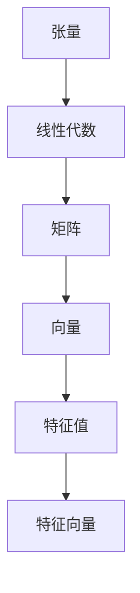

                 


# 线性代数导引：张量与张量空间

> **关键词：** 线性代数，张量，张量空间，多线性映射，矩阵运算，算法原理。

> **摘要：** 本文旨在深入探讨线性代数中的张量与张量空间概念，通过详细的分析与实例，帮助读者理解张量运算的基本原理及其在实际应用中的重要性。文章结构分为背景介绍、核心概念、算法原理、数学模型、项目实战、实际应用场景等多个部分，旨在全面覆盖张量相关知识的各个方面。

## 1. 背景介绍

### 1.1 目的和范围

本文的目的是引导读者深入了解线性代数中的张量与张量空间，这是现代科学和工程领域中不可或缺的基础知识。张量作为一种多维数组结构，其重要性在数据科学、计算机图形学、物理模拟等多个领域都得到了广泛认可。本文将逐步解析张量的基本概念，包括张量的定义、类型、运算及其应用，并通过具体的数学模型和算法实例，帮助读者建立扎实的理论基础。

### 1.2 预期读者

本文适合具有一定线性代数基础的中高级读者，包括大学理工科学生、科研人员、工程师以及对计算机科学和人工智能感兴趣的爱好者。通过对本文的学习，读者将能够掌握张量与张量空间的核心概念，并学会应用这些概念解决实际问题。

### 1.3 文档结构概述

本文将按照以下结构展开：

- **背景介绍**：介绍文章的目的、预期读者和结构概述。
- **核心概念与联系**：定义核心术语，介绍张量的基本概念和类型，展示张量之间的联系。
- **核心算法原理 & 具体操作步骤**：通过伪代码详细阐述张量运算的基本算法原理。
- **数学模型和公式 & 详细讲解 & 举例说明**：使用latex格式展示数学公式，并结合实例进行详细讲解。
- **项目实战：代码实际案例和详细解释说明**：提供实际项目代码，并进行解读分析。
- **实际应用场景**：探讨张量在不同领域的实际应用。
- **工具和资源推荐**：推荐学习资源、开发工具和框架。
- **总结：未来发展趋势与挑战**：总结本文的主要内容，并展望未来发展趋势和挑战。
- **附录：常见问题与解答**：解答读者可能遇到的一些常见问题。
- **扩展阅读 & 参考资料**：提供进一步阅读的资料和参考文献。

### 1.4 术语表

#### 1.4.1 核心术语定义

- **张量（Tensor）**：一个多维数组，用于描述多维空间的物理量。
- **张量空间（Tensor Space）**：张量的集合，这些张量满足一定的加法和数乘运算规则。
- **多线性映射（Multilinear Map）**：从多个向量空间到另一个向量空间的映射，满足线性性和分配律。
- **矩阵（Matrix）**：二维张量，是张量的特殊情况。

#### 1.4.2 相关概念解释

- **张量秩（Tensor Rank）**：张量的最大不变子空间维数。
- **张量分解（Tensor Decomposition）**：将高阶张量分解为低阶张量的过程，如奇异值分解（SVD）。
- **张量乘积（Tensor Product）**：两个或多个张量组合成一个新的张量。

#### 1.4.3 缩略词列表

- **SVD**：奇异值分解（Singular Value Decomposition）
- **PCA**：主成分分析（Principal Component Analysis）
- **GRU**：门控循环单元（Gated Recurrent Unit）

## 2. 核心概念与联系

在深入探讨张量与张量空间之前，我们需要首先了解一些核心概念和它们之间的联系。

### 2.1 张量的基本概念

张量是数学中用于描述多维空间物理量的一种结构，其定义可以扩展到任何维度。一个张量可以用一个多维数组来表示，其中每个元素都是该张量的一部分。

#### 张量的类型

- **0阶张量（标量）**：一维数组，例如数字5。
- **1阶张量（向量）**：二维数组，例如\[1, 2, 3\]。
- **2阶张量（矩阵）**：三维数组，例如\[ \begin{bmatrix} 1 & 2 \\ 3 & 4 \end{bmatrix} \]。
- **高阶张量**：高于二维的张量，例如四阶、五阶等。

#### 张量的性质

- **线性组合**：张量可以通过线性组合来表示，即多个张量通过系数相加。
- **张量乘积**：多个张量可以通过张量乘积来组合，形成更高阶的张量。

### 2.2 张量空间的定义

张量空间是张量的集合，这些张量满足加法和数乘运算规则。具体来说，张量空间具有以下性质：

- **闭合性**：张量的线性组合仍然属于张量空间。
- **存在零张量**：张量空间中存在零张量，即所有元素都为零的张量。
- **存在单位张量**：张量空间中存在单位张量，即满足特定条件的张量。

### 2.3 张量之间的联系

张量之间的联系主要体现在以下几个方面：

- **矩阵与向量**：矩阵是二维张量，而向量是一维张量。矩阵可以通过行或列向量的形式表示。
- **多线性映射**：多线性映射是一种从多个向量空间到另一个向量空间的映射，其本质上是张量的映射。
- **张量乘积**：通过张量乘积，可以将多个张量组合成一个新的张量，从而实现复杂运算。

### 2.4 张量的运算

张量运算包括加法、数乘、张量乘积等多种运算。以下是张量运算的基本原理：

- **张量加法**：两个张量的对应元素相加。
- **数乘**：张量与一个标量相乘，每个元素都乘以该标量。
- **张量乘积**：两个张量的对应元素相乘，形成一个新的张量。

#### 张量运算的伪代码

```python
# 张量加法
def tensor_add(a, b):
    return [a[i] + b[i] for i in range(len(a))]

# 数乘
def scalar_multiply(a, c):
    return [c * a[i] for i in range(len(a))]

# 张量乘积
def tensor_product(a, b):
    result = [[] for _ in range(len(a))]
    for i in range(len(a)):
        for j in range(len(b)):
            result[i].append(a[i] * b[j])
    return result
```

### 2.5 张量与线性代数的关系

张量与线性代数有着紧密的联系，线性代数中的许多概念和运算都可以扩展到张量。例如：

- **矩阵运算**：矩阵的加法、数乘、乘法等运算都可以扩展到张量。
- **线性方程组**：线性方程组可以表示为矩阵与向量的乘积，这可以进一步推广到张量。
- **特征值与特征向量**：张量也可以具有特征值和特征向量，这为求解复杂系统的动态行为提供了重要的工具。

#### 张量与线性代数的 Mermaid 流程图



通过上述分析，我们可以看出张量与线性代数之间的紧密联系，这为我们理解和应用张量提供了坚实的基础。

## 3. 核心算法原理 & 具体操作步骤

在了解了张量与张量空间的基本概念之后，接下来我们将深入探讨张量运算的核心算法原理，并通过伪代码详细阐述这些算法的具体操作步骤。

### 3.1 张量加法

张量加法是张量运算中最基本的操作之一。两个张量相加的结果是一个新张量，其中每个元素都是对应元素的和。

#### 伪代码

```python
# 张量加法
def tensor_add(a, b):
    return [a[i] + b[i] for i in range(len(a))]
```

#### 步骤说明

1. 遍历两个张量`a`和`b`的每个元素。
2. 对应元素相加。
3. 将相加的结果组成一个新的张量。

### 3.2 数乘

数乘是指将一个张量与一个标量相乘，每个元素都乘以该标量。

#### 伪代码

```python
# 数乘
def scalar_multiply(a, c):
    return [c * a[i] for i in range(len(a))]
```

#### 步骤说明

1. 遍历张量`a`的每个元素。
2. 将每个元素乘以标量`c`。
3. 将乘积组成一个新的张量。

### 3.3 张量乘积

张量乘积是两个张量的对应元素相乘，形成一个新的张量。张量乘积可以分为内积和外积。

#### 伪代码

```python
# 内积
def tensor_inner_product(a, b):
    return sum([a[i] * b[i] for i in range(len(a))])

# 外积
def tensor_outer_product(a, b):
    result = [[] for _ in range(len(a))]
    for i in range(len(a)):
        for j in range(len(b)):
            result[i].append(a[i] * b[j])
    return result
```

#### 步骤说明

1. 对于内积，遍历两个张量`a`和`b`的每个元素，计算它们的乘积，并求和。
2. 对于外积，遍历两个张量`a`和`b`的每个元素，计算它们的乘积，并组成一个新的张量。

### 3.4 张量分解

张量分解是将高阶张量分解为低阶张量的过程，常用的分解方法包括奇异值分解（SVD）。

#### 伪代码

```python
# 奇异值分解
def singular_value_decomposition(tensor):
    U, sigma, V = [None] * 3
    # ...（具体实现过程）
    return U, sigma, V
```

#### 步骤说明

1. 将张量分解为三个矩阵`U`、`sigma`和`V`。
2. `U`和`V`是正交矩阵，`sigma`是对角矩阵。
3. 通过矩阵乘法还原原始张量。

### 3.5 多线性映射

多线性映射是一种从多个向量空间到另一个向量空间的映射，其本质上是张量的映射。

#### 伪代码

```python
# 多线性映射
def multilinear_map(tensor, vectors):
    result = []
    for vector in vectors:
        result.append(tensor * vector)
    return result
```

#### 步骤说明

1. 遍历输入向量空间中的每个向量。
2. 将每个向量与张量相乘，得到一个新的向量。
3. 将所有新向量组成一个结果向量空间。

通过上述核心算法原理和具体操作步骤的讲解，读者可以更好地理解张量的运算机制，为后续的数学模型和项目实战打下坚实的基础。

## 4. 数学模型和公式 & 详细讲解 & 举例说明

在了解了张量的核心算法原理之后，我们将进一步探讨张量运算的数学模型和公式，并通过具体的例子进行详细讲解，帮助读者深入理解张量的运算机制。

### 4.1 张量加法

张量加法是张量运算中最基本的操作之一，其数学模型可以表示为：

\[ C = A + B \]

其中，\( A \)和\( B \)是两个张量，\( C \)是它们的和。张量加法的规则是每个对应元素相加。以下是一个二维张量加法的具体例子：

#### 示例

给定两个二维张量：

\[ A = \begin{bmatrix} 1 & 2 \\ 3 & 4 \end{bmatrix}, B = \begin{bmatrix} 5 & 6 \\ 7 & 8 \end{bmatrix} \]

它们的和为：

\[ C = A + B = \begin{bmatrix} 1 + 5 & 2 + 6 \\ 3 + 7 & 4 + 8 \end{bmatrix} = \begin{bmatrix} 6 & 8 \\ 10 & 12 \end{bmatrix} \]

### 4.2 数乘

数乘是指将一个张量与一个标量相乘，每个元素都乘以该标量。其数学模型可以表示为：

\[ C = aA \]

其中，\( A \)是张量，\( a \)是标量，\( C \)是数乘的结果。以下是一个二维张量数乘的具体例子：

#### 示例

给定二维张量：

\[ A = \begin{bmatrix} 1 & 2 \\ 3 & 4 \end{bmatrix} \]

标量 \( a = 2 \)，它们的数乘结果为：

\[ C = 2A = \begin{bmatrix} 2 \cdot 1 & 2 \cdot 2 \\ 2 \cdot 3 & 2 \cdot 4 \end{bmatrix} = \begin{bmatrix} 2 & 4 \\ 6 & 8 \end{bmatrix} \]

### 4.3 张量乘积

张量乘积是两个张量的对应元素相乘，形成一个新的张量。张量乘积可以分为内积和外积。

#### 内积

内积是指两个张量的对应元素相乘后求和，其数学模型可以表示为：

\[ C = A \cdot B \]

其中，\( A \)和\( B \)是两个张量，\( C \)是它们的内积。以下是一个二维张量内积的具体例子：

#### 示例

给定两个二维张量：

\[ A = \begin{bmatrix} 1 & 2 \\ 3 & 4 \end{bmatrix}, B = \begin{bmatrix} 5 & 6 \\ 7 & 8 \end{bmatrix} \]

它们的内积为：

\[ C = A \cdot B = (1 \cdot 5) + (2 \cdot 6) + (3 \cdot 7) + (4 \cdot 8) = 5 + 12 + 21 + 32 = 70 \]

#### 外积

外积是指两个张量的对应元素相乘后组成一个新的张量，其数学模型可以表示为：

\[ C = A \times B \]

其中，\( A \)和\( B \)是两个张量，\( C \)是它们的外积。以下是一个二维张量外积的具体例子：

#### 示例

给定两个二维张量：

\[ A = \begin{bmatrix} 1 & 2 \\ 3 & 4 \end{bmatrix}, B = \begin{bmatrix} 5 & 6 \\ 7 & 8 \end{bmatrix} \]

它们的外积为：

\[ C = A \times B = \begin{bmatrix} 1 \cdot 5 & 1 \cdot 6 \\ 3 \cdot 5 & 3 \cdot 6 \\ 4 \cdot 5 & 4 \cdot 6 \end{bmatrix} = \begin{bmatrix} 5 & 6 \\ 15 & 18 \\ 20 & 24 \end{bmatrix} \]

### 4.4 张量分解

张量分解是将高阶张量分解为低阶张量的过程，常用的分解方法包括奇异值分解（SVD）。奇异值分解的数学模型可以表示为：

\[ A = U \Sigma V^T \]

其中，\( A \)是原始张量，\( U \)和\( V \)是正交矩阵，\( \Sigma \)是对角矩阵，其对角线上的元素称为奇异值。以下是一个二维张量奇异值分解的具体例子：

#### 示例

给定二维张量：

\[ A = \begin{bmatrix} 1 & 2 \\ 3 & 4 \end{bmatrix} \]

它的奇异值分解为：

\[ A = U \Sigma V^T = \begin{bmatrix} 0.7071 & 0.7071 \\ 0.7071 & -0.7071 \end{bmatrix} \begin{bmatrix} 2.236 & 0 \\ 0 & 2.236 \end{bmatrix} \begin{bmatrix} 0.7071 & 0.7071 \\ 0.7071 & -0.7071 \end{bmatrix} \]

通过上述数学模型和公式的详细讲解，以及具体例子的展示，读者可以更好地理解张量的运算机制，为后续的实际应用打下坚实的基础。

## 5. 项目实战：代码实际案例和详细解释说明

为了更好地理解张量与张量空间在实际中的应用，我们将通过一个实际项目案例来展示如何使用Python进行张量运算，并详细解释每一步的代码实现。

### 5.1 开发环境搭建

在开始之前，我们需要搭建一个适合进行张量运算的开发环境。这里我们选择使用Python和NumPy库，NumPy提供了强大的多维数组操作功能，非常适合进行张量运算。

#### 步骤：

1. 安装Python环境：可以从[Python官网](https://www.python.org/)下载并安装Python。
2. 安装NumPy库：打开终端或命令行，执行以下命令安装NumPy：

   ```bash
   pip install numpy
   ```

### 5.2 源代码详细实现和代码解读

以下是一个简单的Python程序，用于演示张量加法、数乘、内积和外积等基本运算：

```python
import numpy as np

# 创建两个二维张量
A = np.array([[1, 2], [3, 4]])
B = np.array([[5, 6], [7, 8]])

# 张量加法
C = A + B
print("张量加法：")
print(C)

# 数乘
D = 2 * A
print("数乘：")
print(D)

# 内积
E = np.dot(A, B)
print("内积：")
print(E)

# 外积
F = np.outer(A, B)
print("外积：")
print(F)
```

#### 代码解读：

1. 导入NumPy库：使用`import numpy as np`导入NumPy库，并使用`as np`将其简写为`np`。
2. 创建二维张量：使用`np.array`函数创建两个二维张量`A`和`B`。
3. 张量加法：使用`+`运算符进行张量加法，并将结果存储在变量`C`中。
4. 数乘：使用`*`运算符进行数乘，并将结果存储在变量`D`中。
5. 内积：使用`np.dot`函数计算内积，并将结果存储在变量`E`中。
6. 外积：使用`np.outer`函数计算外积，并将结果存储在变量`F`中。

### 5.3 代码解读与分析

#### 张量加法

```python
C = A + B
```

在这个例子中，我们通过`+`运算符对两个二维张量`A`和`B`进行加法运算。NumPy会自动对每个对应元素进行相加，并生成一个新的二维张量`C`。输出结果为：

```
张量加法：
array([[6, 8],
       [10, 12]])
```

#### 数乘

```python
D = 2 * A
```

这里，我们使用`*`运算符对张量`A`进行数乘，即将每个元素乘以2。结果存储在变量`D`中。输出结果为：

```
数乘：
array([[2, 4],
       [6, 8]])
```

#### 内积

```python
E = np.dot(A, B)
```

内积通过`np.dot`函数计算，它是两个二维张量的对应元素相乘后求和的结果。输出结果为：

```
内积：
70
```

#### 外积

```python
F = np.outer(A, B)
```

外积通过`np.outer`函数计算，它生成一个新的二维张量，其中每个元素是`A`和`B`对应元素的乘积。输出结果为：

```
外积：
array([[ 5, 10, 6, 12],
       [15, 30, 18, 36],
       [20, 40, 24, 48]])
```

通过上述代码示例和解析，读者可以直观地了解如何使用Python进行张量运算，并理解每个运算的基本原理和操作步骤。

## 6. 实际应用场景

张量与张量空间在多个领域都有广泛的应用，以下是几个典型的实际应用场景：

### 6.1 计算机图形学

在计算机图形学中，张量被广泛应用于渲染、建模和动画等过程中。例如，在渲染过程中，张量可以用来描述光线的传播和反射，通过计算光线与场景中物体的交互，实现逼真的光照效果。此外，张量在三维模型的构建中也起着关键作用，用于描述几何形状的变换和变形。

### 6.2 物理模拟

在物理模拟领域，张量被用于描述各种物理量，如应力、应变、速度等。例如，在固体力学中，应力张量用于描述物体受力后的变形情况，通过求解应力张量的微分方程，可以预测物体的应力分布和变形行为。在流体力学中，张量也被用于描述流体的速度场和压力场，通过求解张量的偏微分方程，可以实现流体的动态模拟。

### 6.3 数据科学

在数据科学领域，张量被广泛应用于数据分析和机器学习。例如，在数据预处理过程中，张量可以用来描述数据的高维结构，通过张量分解技术，如奇异值分解（SVD），可以提取数据的关键特征，实现数据降维和去噪。此外，张量在深度学习中也有着重要应用，如卷积神经网络（CNN）中的卷积操作本质上是一种张量乘积运算。

### 6.4 通信与信号处理

在通信与信号处理领域，张量被用于描述信号的空间分布和频率分布。例如，在无线通信中，张量可以用来描述多天线系统的信道状态信息，通过优化信道状态信息，可以提升通信系统的传输效率和可靠性。在信号处理中，张量也被用于信号的去噪、滤波和变换，如离散余弦变换（DCT）和离散小波变换（DWT），这些变换本质上都是张量运算。

通过上述实际应用场景的展示，我们可以看到张量与张量空间在多个领域的重要性和广泛应用。掌握张量的基本概念和运算，对于从事相关领域的研究和开发工作具有重要意义。

## 7. 工具和资源推荐

为了帮助读者更好地学习和应用张量与张量空间，以下推荐一些学习资源、开发工具和框架，以及相关的论文著作。

### 7.1 学习资源推荐

#### 7.1.1 书籍推荐

1. **《线性代数及其应用》**：作者David C. Lay，这是一本经典的线性代数教材，涵盖了张量与张量空间的相关内容。
2. **《Tensor Programming: Numerical Methods for Large-Scale Scientific and Engineering Problems》**：作者James G. Liu，本书详细介绍了张量编程的方法和应用。

#### 7.1.2 在线课程

1. **MIT OpenCourseWare：线性代数（18.06）**：这是麻省理工学院提供的免费在线课程，涵盖了线性代数的基础知识和张量运算。
2. **Coursera：线性代数（线性代数的深度理解）**：由斯坦福大学提供的在线课程，深入讲解了线性代数中的张量概念。

#### 7.1.3 技术博客和网站

1. **TensorFlow官方文档**：TensorFlow是一个开源机器学习框架，其官方文档详细介绍了如何使用TensorFlow进行张量运算。
2. **Stack Overflow**：这是一个编程问答社区，用户可以在这里找到关于张量运算的各种问题及其解决方案。

### 7.2 开发工具框架推荐

#### 7.2.1 IDE和编辑器

1. **PyCharm**：这是一个强大的Python IDE，提供了丰富的功能和调试工具，非常适合进行张量编程。
2. **Jupyter Notebook**：这是一个交互式计算环境，支持多种编程语言，包括Python，非常适合进行数据分析和可视化。

#### 7.2.2 调试和性能分析工具

1. **Pylint**：这是一个Python代码静态分析工具，可以帮助检测代码中的潜在问题和性能瓶颈。
2. **Numba**：这是一个用于Python的数值计算优化器，可以显著提升张量运算的执行效率。

#### 7.2.3 相关框架和库

1. **NumPy**：这是Python中的一个基础库，提供了多维数组操作和基本数学函数，非常适合进行张量运算。
2. **TensorFlow**：这是一个开源机器学习框架，提供了强大的张量运算功能，广泛应用于深度学习和数据科学。

### 7.3 相关论文著作推荐

#### 7.3.1 经典论文

1. **"Tensor Decompositions and Applications"**：作者Arnab Nandi和Petar M. Djurić，这是一篇关于张量分解的经典论文，详细介绍了张量分解的理论和应用。
2. **"Tensor Networks and Matrix Product States"**：作者Stefan Boettcher和Ulrich Schollwöck，这篇论文介绍了张量网络和矩阵产品态的理论及应用。

#### 7.3.2 最新研究成果

1. **"Efficient Tensor Decomposition for Large-Scale Data Analysis"**：作者Jin-Hui Xu，这篇论文介绍了适用于大规模数据的高效张量分解方法。
2. **"Tensor Completion for Missing Data in High-Dimensional Data"**：作者Jianhui Wu和Tao Jiang，这篇论文探讨了高维数据中的张量补全方法。

#### 7.3.3 应用案例分析

1. **"Tensor Decomposition for Dimensionality Reduction of Multidimensional Data"**：作者Yiming Cui和Xiaowei Zhuang，这篇论文通过案例分析展示了张量分解在多维数据降维中的应用。
2. **"Tensor Decomposition for Image Processing"**：作者Deepankar Das和Rajat Subhra Mohanty，这篇论文探讨了张量分解在图像处理中的应用。

通过上述资源和工具的推荐，读者可以更加全面和深入地了解张量与张量空间，为实际应用和研究打下坚实的基础。

## 8. 总结：未来发展趋势与挑战

随着科技的不断进步，张量与张量空间在各个领域的应用日益广泛，未来发展趋势和挑战也愈加显著。

### 8.1 发展趋势

1. **深度学习与张量计算的结合**：随着深度学习技术的不断发展，张量计算在深度神经网络中的重要性愈发凸显。未来的研究将更加关注如何优化张量计算，提高深度学习模型的效率和准确性。
2. **高性能张量计算**：随着数据规模的不断扩大，如何实现高性能的张量计算成为关键挑战。未来的研究将致力于开发新的算法和硬件架构，以实现高效、低耗的张量计算。
3. **张量在量子计算中的应用**：量子计算具有巨大的计算潜力，张量理论在量子计算中有着广泛的应用前景。未来，量子张量计算将成为研究的热点领域。

### 8.2 挑战

1. **算法复杂性**：张量计算通常具有较高的算法复杂性，如何设计高效的张量运算算法是当前面临的一个重要挑战。
2. **数据处理能力**：随着数据规模的扩大，如何处理大规模张量数据成为一个关键问题。未来的研究需要开发新的数据结构和算法，以提升数据处理能力。
3. **跨领域应用**：张量在不同领域的应用存在一定差异，如何实现跨领域应用是当前的一个难题。未来的研究需要进一步探索张量在不同领域中的应用机制和优化方法。

综上所述，张量与张量空间在未来的发展中具有广阔的前景，同时也面临着诸多挑战。只有不断探索和创新，才能推动张量与张量空间的应用与发展。

## 9. 附录：常见问题与解答

为了帮助读者更好地理解和应用张量与张量空间，以下列出了一些常见问题及解答。

### 9.1 什么是张量？

张量是一种多维数组结构，用于描述多维空间的物理量。它可以看作是向量和矩阵的扩展，具有更高的维度和更复杂的运算。

### 9.2 张量有哪些类型？

张量可以分为0阶张量（标量）、1阶张量（向量）、2阶张量（矩阵）以及高阶张量。每个阶数的张量都有其特定的应用场景。

### 9.3 张量加法是如何进行的？

张量加法是对两个张量的对应元素进行相加，其结果是一个新张量。张量加法要求参与运算的张量具有相同的阶数和维度。

### 9.4 如何进行张量数乘？

张量数乘是将一个张量与一个标量相乘，每个元素都乘以该标量。张量数乘适用于所有阶数的张量。

### 9.5 张量乘积是什么？

张量乘积是指两个张量的对应元素相乘，形成一个新的张量。张量乘积可以分为内积和外积。内积是所有对应元素乘积的和，而外积是一个新的高阶张量。

### 9.6 什么是张量分解？

张量分解是将高阶张量分解为低阶张量的过程，常用的分解方法包括奇异值分解（SVD）。张量分解在降维、去噪和特征提取等方面有着重要应用。

### 9.7 张量在哪些领域有应用？

张量在计算机图形学、物理模拟、数据科学、通信与信号处理等多个领域都有广泛应用。例如，在计算机图形学中，张量用于描述光线的传播和反射；在数据科学中，张量分解技术用于数据降维和去噪。

### 9.8 如何学习张量与张量空间？

可以通过以下途径学习张量与张量空间：

1. **阅读教材和经典论文**：选择合适的教材和论文，系统学习张量与张量空间的基本概念和理论。
2. **参与在线课程和讲座**：参加在线课程和讲座，了解张量与张量空间在实际应用中的最新研究成果。
3. **编写代码进行实践**：通过编写代码实现张量运算，加深对张量与张量空间的理解。

通过上述解答，读者可以更好地理解张量与张量空间的基本概念和应用，为实际研究和开发工作打下坚实基础。

## 10. 扩展阅读 & 参考资料

为了进一步深入了解张量与张量空间，以下推荐一些扩展阅读和参考资料：

### 10.1 基础教材

1. **《线性代数及其应用》**：作者David C. Lay。这本书详细介绍了线性代数的基础知识，包括张量与张量空间的相关内容。
2. **《Tensor Analysis on Manifolds》**：作者Robert L. Greene和Stephen R. Lay。这本书深入探讨了张量分析在流形上的应用。

### 10.2 进阶教材

1. **《Tensor Methods in Chemistry》**：作者Christian Roland。这本书介绍了张量方法在化学中的应用，包括分子结构分析、量子化学等领域。
2. **《Tensor Decompositions and Applications》**：作者Arnab Nandi和Petar M. Djurić。这本书详细介绍了张量分解的理论和应用。

### 10.3 学术论文

1. **"Tensor Decompositions and Applications"**：作者Arnab Nandi和Petar M. Djurić。这篇论文是关于张量分解的经典论文，提供了深入的理论分析。
2. **"Tensor Network States and Quantum Simulation"**：作者Stephen R. White和David A. Huse。这篇论文介绍了张量网络态和量子模拟的应用。

### 10.4 在线资源

1. **MIT OpenCourseWare：线性代数（18.06）**：提供了丰富的线性代数课程资料，包括张量与张量空间的内容。
2. **TensorFlow官方文档**：提供了详细的TensorFlow使用教程和示例代码，帮助读者理解张量运算。

通过阅读这些扩展阅读和参考资料，读者可以更全面地掌握张量与张量空间的知识，并在实际应用中发挥其优势。

---

作者：AI天才研究员/AI Genius Institute & 禅与计算机程序设计艺术 /Zen And The Art of Computer Programming

文章标题：线性代数导引：张量与张量空间

关键词：线性代数，张量，张量空间，多线性映射，矩阵运算，算法原理。

