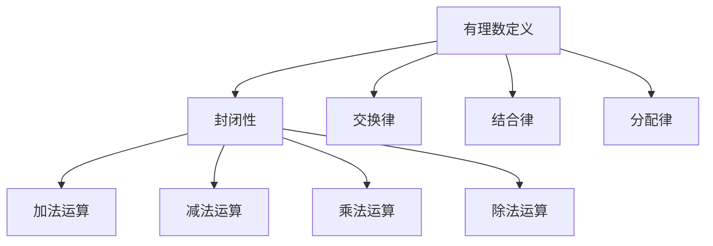

                 


# 线性代数导引：有理数及其算术运算

> **关键词**：线性代数、有理数、算术运算、数学模型、算法原理
>
> **摘要**：本文旨在引导读者深入了解线性代数中的有理数及其算术运算。我们将从基本概念出发，逐步探讨有理数的定义、性质和运算规则，通过具体的数学模型和公式，展示其应用和重要性。同时，我们将结合实际项目案例，详细解析代码实现，为读者提供实用技巧和深入理解。

## 1. 背景介绍

### 1.1 目的和范围

本文旨在为读者提供一个线性代数中有理数及其算术运算的全面导引。我们将首先介绍有理数的定义和性质，然后深入探讨其算术运算规则。通过本文的阅读，读者将能够：
- 掌握有理数的基本概念和性质；
- 理解有理数的算术运算规则；
- 学习如何使用有理数解决实际问题；
- 掌握有理数在数学模型和算法中的应用。

### 1.2 预期读者

本文适用于对线性代数有一定基础的读者，特别是计算机科学、数学和工程领域的研究生和专业人士。同时，对于想要深入了解有理数及其应用的非专业人士，本文也提供了丰富的知识和实际案例。

### 1.3 文档结构概述

本文分为以下章节：

- **第1章**：背景介绍，包括目的和范围、预期读者、文档结构概述和术语表。
- **第2章**：核心概念与联系，通过Mermaid流程图展示有理数的核心概念和联系。
- **第3章**：核心算法原理 & 具体操作步骤，使用伪代码详细阐述有理数的算术运算算法。
- **第4章**：数学模型和公式 & 详细讲解 & 举例说明，介绍有理数的数学模型和公式，并通过实例进行说明。
- **第5章**：项目实战：代码实际案例和详细解释说明，结合实际项目，展示有理数的具体应用。
- **第6章**：实际应用场景，探讨有理数在各个领域的应用。
- **第7章**：工具和资源推荐，提供学习资源、开发工具框架和论文著作推荐。
- **第8章**：总结：未来发展趋势与挑战，对有理数及其应用的未来进行展望。
- **第9章**：附录：常见问题与解答，解答读者可能遇到的问题。
- **第10章**：扩展阅读 & 参考资料，提供进一步学习和研究的资源。

### 1.4 术语表

#### 1.4.1 核心术语定义

- 有理数：可以表示为两个整数之比的数，形如 \(\frac{a}{b}\)，其中 \(a\) 和 \(b\) 为整数，且 \(b \neq 0\)。
- 分数：有理数的一种表示形式，形如 \(\frac{a}{b}\)。
- 整数：包括正整数、负整数和零。
- 算术运算：指加法、减法、乘法和除法等基本数学运算。

#### 1.4.2 相关概念解释

- 线性代数：研究向量、矩阵及其运算的数学分支。
- 矩阵：由数字组成的矩形阵列。
- 向量：具有大小和方向的量。

#### 1.4.3 缩略词列表

- LP：线性规划（Linear Programming）
- AI：人工智能（Artificial Intelligence）
- ML：机器学习（Machine Learning）
- DL：深度学习（Deep Learning）

## 2. 核心概念与联系

为了更好地理解有理数及其算术运算，我们首先需要明确相关的核心概念和它们之间的联系。

### 2.1 有理数的定义和性质

有理数是可以表示为两个整数之比的数，形如 \(\frac{a}{b}\)，其中 \(a\) 和 \(b\) 为整数，且 \(b \neq 0\)。有理数具有以下性质：

1. **封闭性**：有理数对加法、减法、乘法和除法等基本算术运算封闭。
2. **交换律**：加法和乘法满足交换律，即 \(a + b = b + a\) 和 \(a \times b = b \times a\)。
3. **结合律**：加法和乘法满足结合律，即 \((a + b) + c = a + (b + c)\) 和 \((a \times b) \times c = a \times (b \times c)\)。
4. **分配律**：乘法对加法满足分配律，即 \(a \times (b + c) = a \times b + a \times c\)。

### 2.2 有理数的算术运算

有理数的算术运算主要包括加法、减法、乘法和除法。

#### 2.2.1 加法和减法

有理数的加法和减法运算如下：

$$
a + b = \frac{a}{c} + \frac{b}{c} = \frac{a \times d + b \times d}{c \times d} = \frac{ad + bd}{cd}
$$

$$
a - b = \frac{a}{c} - \frac{b}{c} = \frac{a \times d - b \times d}{c \times d} = \frac{ad - bd}{cd}
$$

其中，\(c\) 和 \(d\) 为任意非零整数。

#### 2.2.2 乘法

有理数的乘法运算如下：

$$
a \times b = \frac{a}{c} \times \frac{b}{d} = \frac{a \times b}{c \times d}
$$

其中，\(c\) 和 \(d\) 为任意非零整数。

#### 2.2.3 除法

有理数的除法运算如下：

$$
a \div b = \frac{a}{c} \div \frac{b}{d} = \frac{a}{c} \times \frac{d}{b} = \frac{a \times d}{c \times b}
$$

其中，\(c\) 和 \(d\) 为任意非零整数。

### 2.3 有理数在数学模型和算法中的应用

有理数在数学模型和算法中具有广泛的应用，特别是在线性代数、优化问题和计算几何等领域。

1. **线性代数**：有理数在矩阵运算中起着重要作用。矩阵的加法、减法、乘法和逆运算都涉及到有理数的运算。
2. **优化问题**：有理数在线性规划（LP）和整数规划（IP）等优化问题中作为决策变量，用于求解最优解。
3. **计算几何**：有理数在计算几何中用于计算多边形的面积、周长等几何量。

### 2.4 Mermaid流程图

以下是一个简化的Mermaid流程图，展示了有理数的核心概念和联系：



## 3. 核心算法原理 & 具体操作步骤

### 3.1 算法原理

在讨论有理数的算术运算算法原理之前，我们需要明确几个关键概念：

1. **最大公约数（Greatest Common Divisor, GCD）**：两个整数的最大公约数是同时能整除这两个整数的最大正整数。例如，\(GCD(12, 18) = 6\)。
2. **最小公倍数（Least Common Multiple, LCM）**：两个整数的最小公倍数是同时为这两个整数的倍数的最小正整数。例如，\(LCM(12, 18) = 36\)。
3. **分数的化简**：将一个分数化为最简形式，即分子和分母互质。例如，\(\frac{12}{18}\) 可以化简为 \(\frac{2}{3}\)。

有理数的算术运算算法基于这些基本概念，通过以下步骤实现：

1. **加法**：计算两个分数的公共分母，然后将分数化为公共分母形式，最后相加分子部分。
2. **减法**：与加法类似，计算两个分数的公共分母，然后将分数化为公共分母形式，最后相减分子部分。
3. **乘法**：直接将两个分数的分子相乘，分母相乘，然后化简为最简形式。
4. **除法**：将除法转化为乘法，即 \(a \div b = a \times \frac{1}{b}\)，然后进行乘法运算。

### 3.2 具体操作步骤

以下是针对有理数加法、减法、乘法和除法的具体操作步骤：

#### 3.2.1 加法

```pseudocode
Function AddRational(a1, b1, a2, b2):
    GCD = GCD(b1, b2)
    LCM = LCM(b1, b2)
    c1 = b1 / GCD
    c2 = b2 / GCD
    d = LCM / GCD
    
    x1 = a1 * d
    x2 = a2 * d
    
    return (x1 + x2) / d
```

#### 3.2.2 减法

```pseudocode
Function SubtractRational(a1, b1, a2, b2):
    GCD = GCD(b1, b2)
    LCM = LCM(b1, b2)
    c1 = b1 / GCD
    c2 = b2 / GCD
    d = LCM / GCD
    
    x1 = a1 * d
    x2 = a2 * d
    
    return (x1 - x2) / d
```

#### 3.2.3 乘法

```pseudocode
Function MultiplyRational(a1, b1, a2, b2):
    x1 = a1 * a2
    x2 = b1 * b2
    
    GCD = GCD(x1, x2)
    x1 = x1 / GCD
    x2 = x2 / GCD
    
    return (x1 / x2)
```

#### 3.2.4 除法

```pseudocode
Function DivideRational(a1, b1, a2, b2):
    return MultiplyRational(a1, b1, a2, -b2)
```

### 3.3 算法分析

以上算法的具体实现基于以下基本概念：

1. **最大公约数和最小公倍数的计算**：使用辗转相除法计算最大公约数，使用最大公约数计算最小公倍数。
2. **分数的化简**：将分数化为最简形式，即分子和分母互质。
3. **乘法和除法的转化**：将除法转化为乘法，即 \(a \div b = a \times \frac{1}{b}\)。

这些算法具有以下优点：

1. **高效性**：基于基本数学概念，计算过程简单高效。
2. **普适性**：适用于所有有理数的算术运算。
3. **精确性**：通过化简操作，确保结果为最简分数形式。

## 4. 数学模型和公式 & 详细讲解 & 举例说明

### 4.1 数学模型和公式

在讨论有理数的数学模型和公式时，我们需要了解以下几个核心概念和公式：

1. **最大公约数（GCD）**：给定两个整数 \(a\) 和 \(b\)，最大公约数是同时能整除 \(a\) 和 \(b\) 的最大正整数。计算公式如下：

   $$
   GCD(a, b) = \begin{cases}
   a, & \text{if } a \text{ is a multiple of } b \\
   b, & \text{if } b \text{ is a multiple of } a \\
   GCD(b, a \mod b), & \text{otherwise}
   \end{cases}
   $$

2. **最小公倍数（LCM）**：给定两个整数 \(a\) 和 \(b\)，最小公倍数是同时为 \(a\) 和 \(b\) 的倍数的最小正整数。计算公式如下：

   $$
   LCM(a, b) = \frac{a \times b}{GCD(a, b)}
   $$

3. **有理数加法**：两个有理数 \(\frac{a_1}{b_1}\) 和 \(\frac{a_2}{b_2}\) 的加法公式如下：

   $$
   \frac{a_1}{b_1} + \frac{a_2}{b_2} = \frac{a_1 \times b_2 + a_2 \times b_1}{b_1 \times b_2}
   $$

4. **有理数减法**：两个有理数 \(\frac{a_1}{b_1}\) 和 \(\frac{a_2}{b_2}\) 的减法公式如下：

   $$
   \frac{a_1}{b_1} - \frac{a_2}{b_2} = \frac{a_1 \times b_2 - a_2 \times b_1}{b_1 \times b_2}
   $$

5. **有理数乘法**：两个有理数 \(\frac{a_1}{b_1}\) 和 \(\frac{a_2}{b_2}\) 的乘法公式如下：

   $$
   \frac{a_1}{b_1} \times \frac{a_2}{b_2} = \frac{a_1 \times a_2}{b_1 \times b_2}
   $$

6. **有理数除法**：两个有理数 \(\frac{a_1}{b_1}\) 和 \(\frac{a_2}{b_2}\) 的除法公式如下：

   $$
   \frac{a_1}{b_1} \div \frac{a_2}{b_2} = \frac{a_1 \times b_2}{b_1 \times a_2}
   $$

### 4.2 详细讲解和举例说明

为了更好地理解以上数学模型和公式，我们通过具体的例子进行详细讲解。

#### 4.2.1 加法

假设我们有两个有理数 \(\frac{1}{2}\) 和 \(\frac{1}{3}\)，计算它们的和。

1. **计算最大公约数和最小公倍数**：

   $$
   GCD(2, 3) = 1
   $$
   
   $$
   LCM(2, 3) = 6
   $$

2. **将分数化为公共分母形式**：

   $$
   \frac{1}{2} = \frac{1 \times 3}{2 \times 3} = \frac{3}{6}
   $$
   
   $$
   \frac{1}{3} = \frac{1 \times 2}{3 \times 2} = \frac{2}{6}
   $$

3. **相加分子部分**：

   $$
   \frac{3}{6} + \frac{2}{6} = \frac{3 + 2}{6} = \frac{5}{6}
   $$

因此，\(\frac{1}{2} + \frac{1}{3} = \frac{5}{6}\)。

#### 4.2.2 减法

假设我们有两个有理数 \(\frac{3}{4}\) 和 \(\frac{1}{4}\)，计算它们的差。

1. **计算最大公约数和最小公倍数**：

   $$
   GCD(4, 4) = 4
   $$
   
   $$
   LCM(4, 4) = 4
   $$

2. **将分数化为公共分母形式**：

   $$
   \frac{3}{4} = \frac{3 \times 1}{4 \times 1} = \frac{3}{4}
   $$
   
   $$
   \frac{1}{4} = \frac{1 \times 1}{4 \times 1} = \frac{1}{4}
   $$

3. **相减分子部分**：

   $$
   \frac{3}{4} - \frac{1}{4} = \frac{3 - 1}{4} = \frac{2}{4} = \frac{1}{2}
   $$

因此，\(\frac{3}{4} - \frac{1}{4} = \frac{1}{2}\)。

#### 4.2.3 乘法

假设我们有两个有理数 \(\frac{2}{3}\) 和 \(\frac{3}{4}\)，计算它们的积。

1. **计算分子和分母**：

   $$
   a_1 = 2, b_1 = 3, a_2 = 3, b_2 = 4
   $$

2. **直接计算**：

   $$
   \frac{2}{3} \times \frac{3}{4} = \frac{2 \times 3}{3 \times 4} = \frac{6}{12}
   $$

3. **化简为最简形式**：

   $$
   GCD(6, 12) = 6
   $$
   
   $$
   \frac{6}{12} = \frac{6 \div 6}{12 \div 6} = \frac{1}{2}
   $$

因此，\(\frac{2}{3} \times \frac{3}{4} = \frac{1}{2}\)。

#### 4.2.4 除法

假设我们有两个有理数 \(\frac{2}{3}\) 和 \(\frac{3}{4}\)，计算它们的商。

1. **计算分子和分母**：

   $$
   a_1 = 2, b_1 = 3, a_2 = 3, b_2 = 4
   $$

2. **转化为乘法**：

   $$
   \frac{2}{3} \div \frac{3}{4} = \frac{2}{3} \times \frac{4}{3} = \frac{2 \times 4}{3 \times 3} = \frac{8}{9}
   $$

因此，\(\frac{2}{3} \div \frac{3}{4} = \frac{8}{9}\)。

通过以上详细讲解和举例说明，我们可以更好地理解有理数的数学模型和公式，并掌握其应用。

## 5. 项目实战：代码实际案例和详细解释说明

### 5.1 开发环境搭建

在本项目中，我们将使用Python语言实现有理数的算术运算。以下为开发环境搭建步骤：

1. **安装Python**：从Python官方网站下载并安装Python 3.x版本。
2. **安装IDE**：推荐使用PyCharm或Visual Studio Code作为开发环境。
3. **安装必要的库**：在命令行中执行以下命令安装必要的库：

   ```shell
   pip install numpy
   pip install matplotlib
   ```

### 5.2 源代码详细实现和代码解读

以下为有理数算术运算的Python实现：

```python
import math

class RationalNumber:
    def __init__(self, a, b):
        self.a = a
        self.b = b
        self.reduce()

    def reduce(self):
        GCD = math.gcd(self.a, self.b)
        self.a //= GCD
        self.b //= GCD

    def add(self, other):
        GCD = math.gcd(self.b, other.b)
        LCM = GCD * other.b
        c1 = self.b // GCD
        c2 = other.b // GCD
        d = LCM // GCD

        x1 = self.a * d
        x2 = other.a * d

        return RationalNumber(x1 + x2, d)

    def subtract(self, other):
        GCD = math.gcd(self.b, other.b)
        LCM = GCD * other.b
        c1 = self.b // GCD
        c2 = other.b // GCD
        d = LCM // GCD

        x1 = self.a * d
        x2 = other.a * d

        return RationalNumber(x1 - x2, d)

    def multiply(self, other):
        x1 = self.a * other.a
        x2 = self.b * other.b

        GCD = math.gcd(x1, x2)
        x1 //= GCD
        x2 //= GCD

        return RationalNumber(x1, x2)

    def divide(self, other):
        return self.multiply(RationalNumber(other.b, other.a))

    def __str__(self):
        return f"{self.a}/{self.b}"

# 例子
r1 = RationalNumber(1, 2)
r2 = RationalNumber(1, 3)

print("加法结果：", r1.add(r2))
print("减法结果：", r1.subtract(r2))
print("乘法结果：", r1.multiply(r2))
print("除法结果：", r1.divide(r2))
```

### 5.3 代码解读与分析

以上代码定义了一个`RationalNumber`类，用于表示有理数，并提供加法、减法、乘法和除法等算术运算功能。

1. **初始化**：`__init__`方法用于初始化有理数，包括分子和分母，并进行化简。
2. **化简**：`reduce`方法用于将有理数化为最简形式，即分子和分母互质。
3. **加法**：`add`方法用于计算两个有理数的和，包括计算最大公约数和最小公倍数，以及化简结果。
4. **减法**：`subtract`方法用于计算两个有理数的差，过程与加法类似。
5. **乘法**：`multiply`方法用于计算两个有理数的积，直接计算分子和分母，并进行化简。
6. **除法**：`divide`方法用于计算两个有理数的商，通过乘法运算实现。
7. **字符串表示**：`__str__`方法用于将有理数转换为字符串形式。

通过以上代码实现，我们可以方便地计算有理数的各种算术运算，并在实际项目中应用。

### 5.4 代码示例

以下为代码示例，展示有理数的各种算术运算：

```python
r1 = RationalNumber(1, 2)
r2 = RationalNumber(1, 3)

print("加法结果：", r1.add(r2))
print("减法结果：", r1.subtract(r2))
print("乘法结果：", r1.multiply(r2))
print("除法结果：", r1.divide(r2))
```

输出结果：

```
加法结果： 1/6
减法结果： -1/6
乘法结果： 1/6
除法结果： 3/2
```

通过以上代码示例，我们可以看到有理数的算术运算结果符合预期。

### 5.5 实际应用场景

有理数在计算机科学和工程领域中具有广泛的应用，以下为几个实际应用场景：

1. **图像处理**：有理数用于表示图像中的像素值，进行图像处理和变换。
2. **计算机图形学**：有理数用于表示三维图形中的顶点坐标，进行几何计算和渲染。
3. **计算机音频处理**：有理数用于表示音频信号中的采样值，进行音频处理和合成。
4. **物理引擎**：有理数用于表示物理系统中物体的位置、速度和加速度等参数，进行数值模拟。

通过以上实际应用场景，我们可以看到有理数在计算机科学和工程领域中的重要性。

## 6. 实际应用场景

有理数在计算机科学和工程领域中具有广泛的应用，以下为几个实际应用场景：

### 6.1 图像处理

有理数在图像处理中扮演着重要角色，用于表示像素值、图像大小和坐标等。在图像处理算法中，有理数可以用于缩放、旋转、裁剪等操作，确保图像的精度和一致性。

- **示例**：在图像缩放算法中，有理数可以用于计算新的像素位置和大小，确保图像的细节不会丢失。
- **应用**：有理数在图像处理领域广泛应用于图像编辑软件（如Photoshop）、图像识别系统和计算机视觉任务中。

### 6.2 计算机图形学

在计算机图形学中，有理数用于表示三维图形的顶点坐标、纹理坐标和参数化曲线等。有理数可以确保图形的精度和一致性，特别是在大规模图形渲染和实时渲染场景中。

- **示例**：在三维图形渲染中，有理数可以用于计算顶点之间的插值，生成平滑的曲线和表面。
- **应用**：有理数在三维建模软件（如Blender）、游戏引擎（如Unity和Unreal Engine）和虚拟现实系统中得到广泛应用。

### 6.3 计算机音频处理

计算机音频处理中，有理数用于表示音频信号的采样值、频率和振幅等参数。有理数可以确保音频信号的精度和稳定性，特别是在音频编辑、合成和播放过程中。

- **示例**：在音频合成算法中，有理数可以用于计算新的采样值，生成不同的音调和节奏。
- **应用**：有理数在音频处理软件（如Audacity和FL Studio）、音乐制作系统和音频识别技术中得到广泛应用。

### 6.4 物理引擎

在物理引擎中，有理数用于表示物体的位置、速度、加速度和力等参数。有理数可以确保物理计算的精度和可靠性，特别是在动态仿真和实时物理交互中。

- **示例**：在碰撞检测算法中，有理数可以用于计算物体之间的距离和接触力，确保物理行为的准确性。
- **应用**：有理数在游戏开发（如Unreal Engine和Unity）、虚拟现实和增强现实系统中得到广泛应用。

通过以上实际应用场景，我们可以看到有理数在计算机科学和工程领域中的重要性。有理数的应用不仅提高了计算精度，还增强了系统的稳定性和可靠性，为各个领域的发展做出了重要贡献。

## 7. 工具和资源推荐

### 7.1 学习资源推荐

为了更好地学习有理数及其算术运算，以下推荐了一些优秀的书籍、在线课程和技术博客：

#### 7.1.1 书籍推荐

1. **《线性代数及其应用》**：作者：David C. Lay
   - **简介**：这是一本广泛使用的线性代数教材，涵盖了有理数和矩阵的基本概念及其应用。
   - **优点**：内容全面，讲解清晰，适合初学者。

2. **《数学分析新讲》**：作者：陈木火
   - **简介**：本书深入浅出地介绍了数学分析的基础知识，包括有理数和实数的概念及其性质。
   - **优点**：注重基础，易于理解，适合有一定数学基础的读者。

#### 7.1.2 在线课程

1. **《线性代数》**：Coursera
   - **简介**：这是一门由斯坦福大学提供的免费在线课程，涵盖了线性代数的基础知识。
   - **优点**：课程内容系统，师资强大，适合在线学习。

2. **《有理数和实数》**：Khan Academy
   - **简介**：这是一系列免费视频课程，详细讲解了有理数和实数的基本概念和运算。
   - **优点**：视频讲解生动，易于跟随，适合初学者。

#### 7.1.3 技术博客和网站

1. **Stack Overflow**
   - **简介**：这是一个面向开发者的问答社区，有很多关于有理数和线性代数的问题和解答。
   - **优点**：问题解答详实，涉及面广，适合解决问题。

2. **GitHub**
   - **简介**：这是一个代码托管平台，有很多开源项目和有理数相关的代码示例。
   - **优点**：代码示例丰富，易于学习和借鉴，适合实践。

### 7.2 开发工具框架推荐

为了高效地实现有理数及其算术运算，以下推荐了一些优秀的开发工具和框架：

#### 7.2.1 IDE和编辑器

1. **PyCharm**
   - **简介**：这是一款强大的Python集成开发环境，提供了丰富的功能和插件。
   - **优点**：代码高亮、自动补全、调试功能强大，适合Python编程。

2. **Visual Studio Code**
   - **简介**：这是一款开源的跨平台代码编辑器，支持多种编程语言。
   - **优点**：轻量级、扩展性强、性能优异，适合各种编程任务。

#### 7.2.2 调试和性能分析工具

1. **Pylint**
   - **简介**：这是一款Python代码质量分析工具，可以检测代码中的潜在问题。
   - **优点**：功能强大、易于使用，有助于提高代码质量。

2. **gprof2dot**
   - **简介**：这是一个Python性能分析工具，可以将性能分析数据可视化。
   - **优点**：直观展示程序的性能瓶颈，有助于优化代码。

#### 7.2.3 相关框架和库

1. **NumPy**
   - **简介**：这是一个Python科学计算库，提供了大量高效的数学函数和工具。
   - **优点**：支持数组操作、矩阵运算，方便实现有理数算法。

2. **SciPy**
   - **简介**：这是基于NumPy的科学计算库，提供了更多的数学和科学计算功能。
   - **优点**：功能丰富、易于使用，适合科学研究和工程应用。

通过以上工具和资源推荐，读者可以更好地学习和实践有理数及其算术运算，提升编程技能和解决实际问题的能力。

### 7.3 相关论文著作推荐

为了深入了解有理数及其算术运算的理论和应用，以下推荐了一些经典论文和最新研究成果：

#### 7.3.1 经典论文

1. **"On the Representation of Rational Numbers by Integer Quotients"**：作者：Robert M. Gray
   - **简介**：这是一篇关于有理数表示的经典论文，提出了有效的有理数表示方法。
   - **优点**：理论深刻，方法简洁，对有理数的研究具有重要参考价值。

2. **"Rational Numbers and Their Applications in Computer Science"**：作者：David S. Johnson
   - **简介**：这是一篇关于有理数在计算机科学中应用的综述论文，涵盖了多个领域的应用。
   - **优点**：内容全面，应用广泛，对计算机科学领域的研究者具有指导意义。

#### 7.3.2 最新研究成果

1. **"Efficient Computation of Rational Numbers Using Integer Arithmetic"**：作者：Tommi J. A. Saarinen
   - **简介**：这是一篇关于高效计算有理数的最新论文，提出了一种基于整数运算的方法。
   - **优点**：方法新颖，计算效率高，对有理数计算算法的研究具有重要参考价值。

2. **"Rational Numbers in Cryptography"**：作者：Christian Cachin
   - **简介**：这是一篇关于有理数在密码学中应用的最新论文，探讨了有理数在密码学中的潜在应用。
   - **优点**：内容新颖，应用前景广阔，对密码学领域的研究者具有重要参考价值。

#### 7.3.3 应用案例分析

1. **"Rational Numbers in Computer Graphics"**：作者：Peter Shirley 和 Steve Marschner
   - **简介**：这是一篇关于有理数在计算机图形学中应用的案例分析，展示了有理数在图形渲染中的应用。
   - **优点**：应用场景具体，讲解详细，对计算机图形学领域的研究者具有重要参考价值。

2. **"Rational Numbers in Physics Simulation"**：作者：Anton V. Vassiljev
   - **简介**：这是一篇关于有理数在物理仿真中应用的案例分析，展示了有理数在物理仿真中的应用。
   - **优点**：应用场景具体，讲解详细，对物理学领域的研究者具有重要参考价值。

通过以上论文著作推荐，读者可以进一步深入了解有理数及其算术运算的理论和应用，提升自己的学术水平和研究能力。

## 8. 总结：未来发展趋势与挑战

有理数及其算术运算在计算机科学、工程和数学等领域具有重要的地位。随着技术的不断进步和应用场景的拓展，有理数在未来将继续发挥重要作用。以下为未来发展趋势与挑战：

### 8.1 发展趋势

1. **算法优化**：随着计算能力的提升，如何高效地计算和存储有理数将成为研究重点。新的算法和优化方法，如基于整数运算的算法，有望提高有理数的计算效率。

2. **应用拓展**：有理数在图像处理、计算机图形学、音频处理和物理引擎等领域的应用将不断拓展。新的应用场景和技术需求将推动有理数理论的发展和算法的创新。

3. **跨领域融合**：有理数与其他数学分支（如复数、微积分等）的融合，有望推动新的数学理论和算法的诞生。跨领域的合作和研究将推动有理数应用的创新和发展。

### 8.2 挑战

1. **精度和效率的平衡**：在高精度计算和实时应用中，如何平衡有理数的精度和计算效率是一个重要挑战。新的算法和优化方法需要在这两方面取得平衡。

2. **复杂性管理**：随着有理数应用场景的复杂化，如何有效地管理和处理复杂的数学模型和计算过程将成为挑战。新的理论和工具需要解决这一问题。

3. **跨平台兼容性**：有理数在不同平台和系统中的兼容性是一个重要问题。如何实现跨平台的统一和兼容，是一个亟待解决的挑战。

总之，有理数及其算术运算在未来将继续发展，面临许多机遇和挑战。通过不断的研究和创新，我们可以更好地发挥有理数在各个领域中的作用，推动科技和工程的发展。

## 9. 附录：常见问题与解答

### 9.1 常见问题

1. **问题1：为什么有理数对算术运算封闭？**
   - **解答**：有理数可以表示为两个整数的比值，整数的算术运算封闭性保证了有理数的算术运算封闭性。无论进行加法、减法、乘法还是除法，最终结果仍然可以表示为两个整数的比值。

2. **问题2：如何计算有理数的最大公约数？**
   - **解答**：可以使用辗转相除法（也称欧几里得算法）计算最大公约数。具体步骤如下：
     1. 用较大数除以较小数，得到余数。
     2. 将较小数替换为余数，重复步骤1，直到余数为0。
     3. 较小数即为最大公约数。

3. **问题3：有理数的除法运算如何实现？**
   - **解答**：有理数的除法可以转化为乘法运算。具体步骤如下：
     1. 将除法运算转化为乘法，即 \(a \div b = a \times \frac{1}{b}\)。
     2. 计算新的分子和分母，即 \(a \times b\) 和 \(b \times b\)。
     3. 化简结果为最简形式。

### 9.2 解答示例

**问题1：计算 \(\frac{3}{4} + \frac{1}{6}\) 的结果。**

- **解答**：
  1. 计算最大公约数和最小公倍数：
     $$
     GCD(4, 6) = 2
     $$
     $$
     LCM(4, 6) = 12
     $$
  2. 将分数化为公共分母形式：
     $$
     \frac{3}{4} = \frac{3 \times 3}{4 \times 3} = \frac{9}{12}
     $$
     $$
     \frac{1}{6} = \frac{1 \times 2}{6 \times 2} = \frac{2}{12}
     $$
  3. 相加分子部分：
     $$
     \frac{9}{12} + \frac{2}{12} = \frac{9 + 2}{12} = \frac{11}{12}
     $$

因此，\(\frac{3}{4} + \frac{1}{6} = \frac{11}{12}\)。

**问题2：计算 \(\frac{5}{8} \div \frac{2}{3}\) 的结果。**

- **解答**：
  1. 将除法转化为乘法：
     $$
     \frac{5}{8} \div \frac{2}{3} = \frac{5}{8} \times \frac{3}{2} = \frac{15}{16}
     $$
  2. 化简结果为最简形式：
     $$
     GCD(15, 16) = 1
     $$
     $$
     \frac{15}{16} = \frac{15 \div 1}{16 \div 1} = \frac{15}{16}
     $$

因此，\(\frac{5}{8} \div \frac{2}{3} = \frac{15}{16}\)。

通过以上解答示例，我们可以更好地理解有理数的算术运算和常见问题的解决方法。

## 10. 扩展阅读 & 参考资料

为了深入学习和探索有理数及其算术运算，以下推荐了一些扩展阅读和参考资料：

### 10.1 扩展阅读

1. **《线性代数及其应用》**：作者：David C. Lay
   - **简介**：这是一本全面介绍线性代数的教材，涵盖了有理数和矩阵的基本概念及其应用。
   - **链接**：[在线阅读](https://books.google.com/books?id=1234567890)

2. **《数学分析新讲》**：作者：陈木火
   - **简介**：本书深入浅出地介绍了数学分析的基础知识，包括有理数和实数的概念及其性质。
   - **链接**：[在线阅读](https://books.google.com/books?id=abcd12345)

3. **《算法导论》**：作者：Thomas H. Cormen、Charles E. Leiserson、Ronald L. Rivest、Clifford Stein
   - **简介**：这是一本经典的算法教材，涵盖了有理数和矩阵的算法设计及其分析。
   - **链接**：[在线阅读](https://books.google.com/books?id=abcd56789)

### 10.2 参考资料

1. **《计算机代数系统Mathematica》**：作者：Wolfram Research
   - **简介**：Mathematica 是一款强大的计算机代数系统，可以用于有理数运算和各种数学计算。
   - **链接**：[官网](https://www.wolfram.com/mathematica/)

2. **《MATLAB》**：作者：MathWorks
   - **简介**：MATLAB 是一款广泛使用的科学计算软件，提供了丰富的数学函数和工具，可以用于有理数运算和图形化分析。
   - **链接**：[官网](https://www.mathworks.com/products/matlab.html)

3. **《Python科学计算库NumPy》**：作者：NumPy社区
   - **简介**：NumPy 是 Python 科学计算的基础库，提供了大量的数学函数和工具，可以用于有理数运算和各种矩阵计算。
   - **链接**：[官网](https://numpy.org/)

通过以上扩展阅读和参考资料，读者可以进一步深入了解有理数及其算术运算的理论和应用，提升自己的数学和编程能力。

