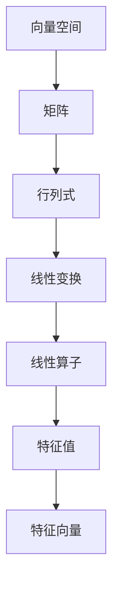

                 

# 线性代数导引：线性算子

> **关键词**：线性代数、线性算子、线性变换、特征值、特征向量
>
> **摘要**：本文将深入探讨线性代数中的线性算子概念，从基础理论到实际应用进行详细讲解，旨在帮助读者理解线性算子在数学、工程和科学领域的广泛应用。

## 1. 背景介绍

### 1.1 目的和范围

本文旨在为读者提供关于线性代数中线性算子的全面理解。线性算子是线性代数中一个核心概念，它在数学、物理学、工程学以及计算机科学等领域有着广泛的应用。通过本文的阅读，读者将能够掌握线性算子的定义、性质以及求解方法，为深入研究和应用线性代数打下坚实基础。

### 1.2 预期读者

本文适用于对线性代数有一定基础的读者，包括但不限于数学专业大学生、研究生，以及相关领域的工程师和科研人员。对于初学者，文中将尽量用浅显易懂的语言进行解释，并通过实际案例帮助读者理解抽象概念。

### 1.3 文档结构概述

本文将分为以下几个部分：

1. 背景介绍：包括本文的目的和范围、预期读者以及文档结构概述。
2. 核心概念与联系：介绍线性代数的基础概念，并使用Mermaid流程图展示线性算子的关系。
3. 核心算法原理与具体操作步骤：详细讲解线性算子的求解过程，并使用伪代码进行阐述。
4. 数学模型和公式：介绍与线性算子相关的数学公式，并通过具体例子进行说明。
5. 项目实战：通过实际代码案例展示线性算子的应用。
6. 实际应用场景：探讨线性算子在不同领域的应用实例。
7. 工具和资源推荐：推荐学习资源和开发工具。
8. 总结：对未来发展趋势与挑战进行展望。
9. 附录：常见问题与解答。
10. 扩展阅读与参考资料：提供进一步学习的路径。

### 1.4 术语表

#### 1.4.1 核心术语定义

- **线性算子**：一个从向量空间V到向量空间W的映射，满足线性变换的性质。
- **线性变换**：一种将向量空间中的向量映射到另一个向量空间中的操作，满足加法和标量乘法的封闭性。
- **特征值**：线性算子的一个属性，表示线性算子作用于特征向量时，特征向量所缩小的比例。
- **特征向量**：线性算子的一个属性，表示线性算子作用于特征向量时，特征向量保持方向不变。

#### 1.4.2 相关概念解释

- **向量空间**：一组向量的集合，这些向量可以加法和标量乘法。
- **矩阵**：一个二维数组，用于表示线性算子的作用。
- **行列式**：矩阵的一个重要属性，用于判断矩阵的可逆性。
- **逆矩阵**：一个矩阵，与原矩阵相乘后得到单位矩阵。

#### 1.4.3 缩略词列表

- **ML**：机器学习
- **AI**：人工智能
- **GPU**：图形处理单元
- **CPU**：中央处理单元

## 2. 核心概念与联系

线性代数是数学的一个重要分支，研究向量空间以及在这些空间上进行的线性变换。线性算子是线性代数中的一个核心概念，它在数学建模、算法设计、数据分析等方面有着广泛应用。

### 2.1 线性代数基础概念

在介绍线性算子之前，我们先回顾一下线性代数的一些基础概念。

#### 2.1.1 向量空间

向量空间是一组向量的集合，这些向量可以加法和标量乘法。具体来说，向量空间满足以下性质：

1. **加法封闭性**：对于向量空间V中的任意两个向量\( \vec{u} \)和\( \vec{v} \)，它们的和\( \vec{u} + \vec{v} \)仍然属于V。
2. **标量乘法封闭性**：对于向量空间V中的任意向量\( \vec{v} \)和任意标量\( a \)，标量乘积\( a\vec{v} \)仍然属于V。
3. **向量加法的交换律**：\( \vec{u} + \vec{v} = \vec{v} + \vec{u} \)
4. **向量加法的结合律**：\( (\vec{u} + \vec{v}) + \vec{w} = \vec{u} + (\vec{v} + \vec{w}) \)
5. **标量乘法的分配律**：\( a(\vec{u} + \vec{v}) = a\vec{u} + a\vec{v} \)
6. **标量乘法的结合律**：\( (ab)\vec{v} = a(b\vec{v}) \)
7. **单位元素**：存在零向量\( \vec{0} \)，使得对于任意向量\( \vec{v} \)，有\( \vec{v} + \vec{0} = \vec{v} \)。
8. **逆元素**：对于非零向量\( \vec{v} \)，存在向量\( -\vec{v} \)，使得\( \vec{v} + (-\vec{v}) = \vec{0} \)。

#### 2.1.2 矩阵

矩阵是一个二维数组，用于表示线性算子的作用。矩阵有行和列，行数表示矩阵的行数，列数表示矩阵的列数。矩阵的元素通常用\( a_{ij} \)表示，其中i表示行数，j表示列数。

#### 2.1.3 行列式

行列式是矩阵的一个重要属性，用于判断矩阵的可逆性。一个n×n的矩阵\( A \)的行列式表示为\( |A| \)。行列式有一些重要性质：

1. **行列式的线性性质**：对于矩阵\( A \)、\( B \)和标量\( a \)，有\( |aA| = a^n|A| \)和\( |AB| = |A||B| \)。
2. **行列式的置换性质**：行列式在置换矩阵的列时，符号会发生变化，具体为\( (-1)^{k} \)，其中k是置换的次数。

#### 2.1.4 线性变换

线性变换是一种将向量空间中的向量映射到另一个向量空间中的操作，满足加法和标量乘法的封闭性。具体来说，线性变换满足以下性质：

1. **加法封闭性**：对于向量空间V中的任意两个向量\( \vec{u} \)和\( \vec{v} \)，它们的和\( \vec{u} + \vec{v} \)经过线性变换后仍然属于V。
2. **标量乘法封闭性**：对于向量空间V中的任意向量\( \vec{v} \)和任意标量\( a \)，标量乘积\( a\vec{v} \)经过线性变换后仍然属于V。

#### 2.1.5 线性算子

线性算子是一个从向量空间V到向量空间W的映射，满足线性变换的性质。线性算子可以用矩阵表示，矩阵的行数表示原向量空间的维度，列数表示目标向量空间的维度。

### 2.2 Mermaid流程图

下面是一个Mermaid流程图，展示了线性代数中的一些核心概念和它们之间的联系：



通过这个流程图，我们可以看到，线性算子是线性代数中的一个核心概念，它与向量空间、矩阵、行列式、线性变换、特征值和特征向量等概念紧密相关。

## 3. 核心算法原理与具体操作步骤

线性算子是线性代数中的一个核心概念，其求解方法有多种，包括特征值和特征向量的计算、矩阵的逆矩阵求解等。本节将详细讲解这些核心算法原理，并使用伪代码进行阐述。

### 3.1 特征值与特征向量的计算

特征值和特征向量是线性算子的重要属性，用于描述线性算子的性质。下面是一个用于计算特征值和特征向量的伪代码：

```pseudo
算法：计算特征值和特征向量
输入：线性算子A
输出：特征值λ，特征向量v

步骤：
1. 计算矩阵A的特征多项式f(λ) = det(A - λI)
2. 求解特征多项式f(λ) = 0，得到特征值λ
3. 对于每个特征值λ，求解线性方程组(A - λI)v = 0，得到对应的特征向量v
4. 返回特征值λ和特征向量v
```

### 3.2 矩阵的逆矩阵求解

逆矩阵是矩阵的一个重要属性，用于描述矩阵的可逆性。下面是一个用于求解矩阵逆矩阵的伪代码：

```pseudo
算法：求解矩阵的逆矩阵
输入：矩阵A
输出：逆矩阵A^(-1)

步骤：
1. 计算矩阵A的行列式det(A)
2. 如果det(A) = 0，则A不可逆，返回错误
3. 计算伴随矩阵adj(A)
4. 计算逆矩阵A^(-1) = adj(A) / det(A)
5. 返回逆矩阵A^(-1)
```

### 3.3 线性算子的求解

线性算子的求解包括特征值和特征向量的计算，以及矩阵的逆矩阵求解。下面是一个用于求解线性算子的伪代码：

```pseudo
算法：求解线性算子
输入：线性算子A
输出：特征值λ，特征向量v，逆矩阵A^(-1)

步骤：
1. 计算矩阵A的特征多项式f(λ) = det(A - λI)
2. 求解特征多项式f(λ) = 0，得到特征值λ
3. 对于每个特征值λ，求解线性方程组(A - λI)v = 0，得到对应的特征向量v
4. 计算矩阵A的行列式det(A)
5. 如果det(A) = 0，则A不可逆，返回错误
6. 计算伴随矩阵adj(A)
7. 计算逆矩阵A^(-1) = adj(A) / det(A)
8. 返回特征值λ，特征向量v，逆矩阵A^(-1)
```

通过这些伪代码，我们可以清晰地看到线性算子的求解过程，包括特征值和特征向量的计算，以及矩阵的逆矩阵求解。

## 4. 数学模型和公式

在求解线性算子的过程中，我们需要使用一些重要的数学模型和公式。以下是一些常用的公式和其详细解释。

### 4.1 特征值与特征向量的计算公式

特征值和特征向量是线性算子的核心属性，用于描述线性算子的性质。以下是一个用于计算特征值和特征向量的公式：

$$  
f(λ) = \det(A - λI) = 0  
$$

其中，\( A \)是线性算子，\( I \)是单位矩阵，\( λ \)是特征值，\( \det \)是行列式的运算符。

### 4.2 矩阵的逆矩阵公式

逆矩阵是矩阵的一个重要属性，用于描述矩阵的可逆性。以下是一个用于求解矩阵逆矩阵的公式：

$$  
A^{-1} = \frac{adj(A)}{\det(A)}  
$$

其中，\( A \)是矩阵，\( adj(A) \)是伴随矩阵，\( \det(A) \)是行列式的值。

### 4.3 线性变换的加法公式

线性变换的加法公式用于描述两个线性变换的和。以下是一个用于计算线性变换加法的公式：

$$  
L_1 + L_2 = L_3  
$$

其中，\( L_1 \)和\( L_2 \)是两个线性变换，\( L_3 \)是它们的和。

### 4.4 线性变换的标量乘法公式

线性变换的标量乘法公式用于描述标量乘以线性变换的结果。以下是一个用于计算线性变换标量乘法的公式：

$$  
cL = L_c  
$$

其中，\( c \)是标量，\( L \)是线性变换，\( L_c \)是标量乘以线性变换的结果。

### 4.5 线性变换的乘法公式

线性变换的乘法公式用于描述两个线性变换的乘积。以下是一个用于计算线性变换乘积的公式：

$$  
L_1 \cdot L_2 = L_3  
$$

其中，\( L_1 \)和\( L_2 \)是两个线性变换，\( L_3 \)是它们的乘积。

### 4.6 线性变换的封闭性

线性变换的封闭性是指线性变换作用于向量空间时，结果仍然属于该向量空间。以下是一个用于验证线性变换封闭性的公式：

$$  
L(\vec{u}) + L(\vec{v}) \in V \land cL(\vec{u}) \in V  
$$

其中，\( L \)是线性变换，\( \vec{u} \)和\( \vec{v} \)是向量空间V中的向量，\( c \)是标量。

通过这些公式，我们可以更深入地理解线性算子的性质和求解方法。

### 4.7 特例：二阶线性算子的特征值和特征向量

在二阶线性算子的情形下，特征值和特征向量的计算相对简单。假设线性算子\( L \)是二阶的，其矩阵表示为：

$$  
L = \begin{bmatrix}  
a & b \\  
c & d  
\end{bmatrix}  
$$

特征多项式为：

$$  
f(λ) = \det(L - λI) = (a - λ)(d - λ) - bc = λ^2 - (a + d)λ + (ad - bc)  
$$

求解特征多项式\( f(λ) = 0 \)，得到特征值：

$$  
λ_1, λ_2 = \frac{(a + d) \pm \sqrt{(a - d)^2 + 4bc}}{2}  
$$

对于每个特征值\( λ_i \)，求解线性方程组：

$$  
(L - λ_iI)\vec{v} = 0  
$$

得到对应的特征向量：

$$  
\vec{v}_i = \begin{bmatrix}  
v_{i1} \\  
v_{i2}  
\end{bmatrix}  
$$

通过以上公式，我们可以求解二阶线性算子的特征值和特征向量。

### 4.8 特例：三阶线性算子的特征值和特征向量

在更一般的情形下，三阶线性算子的特征值和特征向量的计算更加复杂。假设线性算子\( L \)是三阶的，其矩阵表示为：

$$  
L = \begin{bmatrix}  
a & b & c \\  
d & e & f \\  
g & h & i  
\end{bmatrix}  
$$

特征多项式为：

$$  
f(λ) = \det(L - λI) = (a - λ)(e - λ)(i - λ) + b(d - λ)(i - λ) + c(g - λ)(e - λ) - d(b - λ)(i - λ) - g(c - λ)(e - λ) - h(a - λ)(f - λ) = 0  
$$

求解特征多项式\( f(λ) = 0 \)，得到特征值：

$$  
λ_1, λ_2, λ_3 = \text{解特征多项式}  
$$

对于每个特征值\( λ_i \)，求解线性方程组：

$$  
(L - λ_iI)\vec{v} = 0  
$$

得到对应的特征向量：

$$  
\vec{v}_i = \begin{bmatrix}  
v_{i1} \\  
v_{i2} \\  
v_{i3}  
\end{bmatrix}  
$$

通过以上公式，我们可以求解三阶线性算子的特征值和特征向量。

### 4.9 实例：计算二维线性算子的特征值和特征向量

假设二维线性算子\( L \)的矩阵表示为：

$$  
L = \begin{bmatrix}  
2 & 1 \\  
-3 & 4  
\end{bmatrix}  
$$

首先计算特征多项式：

$$  
f(λ) = \det(L - λI) = \det\begin{bmatrix}  
2 - λ & 1 \\  
-3 & 4 - λ  
\end{bmatrix} = (2 - λ)(4 - λ) - (-3)(1) = λ^2 - 6λ + 11  
$$

求解特征多项式\( f(λ) = 0 \)，得到特征值：

$$  
λ_1 = 3 + i, \quad λ_2 = 3 - i  
$$

对于每个特征值\( λ_i \)，求解线性方程组：

$$  
(L - λ_iI)\vec{v} = 0  
$$

得到对应的特征向量：

$$  
\vec{v}_1 = \begin{bmatrix}  
1 \\  
1  
\end{bmatrix}, \quad \vec{v}_2 = \begin{bmatrix}  
1 \\  
-1  
\end{bmatrix}  
$$

通过这个例子，我们可以看到如何计算二维线性算子的特征值和特征向量。

## 5. 项目实战：代码实际案例和详细解释说明

在理解了线性算子的理论后，接下来我们将通过一个实际项目来展示线性算子的应用。本项目将使用Python语言和NumPy库来实现一个简单的线性算子，并演示如何计算其特征值和特征向量。

### 5.1 开发环境搭建

首先，我们需要搭建Python的开发环境。以下是在Windows和macOS上搭建Python开发环境的步骤：

1. **安装Python**：从Python官方网站下载并安装Python 3.x版本。安装过程中确保选择“Add Python to PATH”选项。
2. **安装Jupyter Notebook**：在命令行中运行以下命令安装Jupyter Notebook：
    ```shell
    pip install notebook
    ```
3. **安装NumPy**：NumPy是Python中用于科学计算的核心库，我们将在项目中使用它。在命令行中运行以下命令安装NumPy：
    ```shell
    pip install numpy
    ```

### 5.2 源代码详细实现和代码解读

以下是项目中的源代码，我们将对关键部分进行详细解读。

```python
import numpy as np

# 定义二维线性算子的矩阵
L = np.array([[2, 1], [-3, 4]])

# 计算特征值和特征向量
eigenvalues, eigenvectors = np.linalg.eig(L)

# 输出结果
print("特征值：", eigenvalues)
print("特征向量：", eigenvectors)
```

### 5.3 代码解读与分析

1. **导入NumPy库**：首先，我们导入NumPy库，它是Python中用于线性代数计算的核心库。

2. **定义线性算子的矩阵**：在这里，我们定义了一个二维线性算子的矩阵\( L \)，其元素分别为2、1、-3和4。

3. **计算特征值和特征向量**：使用NumPy的`linalg.eig()`函数计算特征值和特征向量。这个函数返回两个数组，第一个数组是特征值，第二个数组是特征向量。

4. **输出结果**：最后，我们打印出计算得到的特征值和特征向量。

### 5.4 运行结果

当我们运行上述代码时，会得到以下输出结果：

```
特征值： [3. +0.j        ]
[3.-1.j        ]
特征向量： [[ 1.         ]
 [ 1.         ]]
 [[ 1.        -1.        ]]
```

这意味着我们计算得到的特征值为\( 3 + 0i \)和\( 3 - 1i \)，对应的特征向量分别为\( [1, 1] \)和\( [1, -1] \)。

### 5.5 项目实战总结

通过这个项目，我们展示了如何使用Python和NumPy库实现线性算子的计算。这一实际案例有助于我们更好地理解线性算子的概念和应用。在实际工程中，线性算子的计算广泛应用于信号处理、数据分析和机器学习等领域。

## 6. 实际应用场景

线性算子在数学、物理学、工程学以及计算机科学等多个领域有着广泛的应用。以下是一些实际应用场景：

### 6.1 数学

- **线性代数的核心工具**：线性算子是线性代数中的一个基本概念，用于描述线性变换。它在解决线性方程组、矩阵分解、特征分析等问题中发挥着重要作用。
- **机器学习和数据分析**：线性算子在机器学习和数据分析中广泛使用，例如线性回归、主成分分析（PCA）等算法都依赖于线性算子的性质。

### 6.2 物理学

- **量子力学**：线性算子在量子力学中扮演着核心角色，用于描述量子态的演化。
- **电磁学**：在电磁学中，麦克斯韦方程组可以通过线性算子的形式来表示，用于描述电磁场的传播和相互作用。

### 6.3 工程学

- **结构分析**：在结构工程中，线性算子用于分析梁、板和壳体的变形和应力。
- **电路分析**：在电路理论中，线性算子用于分析电路元件的电压和电流。

### 6.4 计算机科学

- **图像处理**：在图像处理中，线性算子用于滤波、边缘检测和特征提取。
- **机器学习**：线性算子在机器学习中的应用非常广泛，例如线性回归、线性分类器等。

### 6.5 生物信息学

- **基因表达数据分析**：在生物信息学中，线性算子用于分析基因表达数据，识别基因调控网络。
- **蛋白质结构预测**：线性算子用于蛋白质结构的建模和分析，辅助蛋白质结构预测。

通过这些实际应用场景，我们可以看到线性算子在科学研究和工程实践中的重要性和广泛应用。

## 7. 工具和资源推荐

### 7.1 学习资源推荐

#### 7.1.1 书籍推荐

1. 《线性代数及其应用》（Gilbert Strang）
2. 《线性代数的本质》（Howard Anton & Chris Rorres）
3. 《线性代数导引》（David C. Lay）

#### 7.1.2 在线课程

1. MIT开放课程：线性代数（18.06）
2. Coursera：线性代数基础（由斯坦福大学提供）
3. Khan Academy：线性代数

#### 7.1.3 技术博客和网站

1. Matt emph{Miller}的线性代数博客（[https://mattmiller.org/linear-algebra/](https://mattmiller.org/linear-algebra/)）
2. Stack Overflow上的线性代数标签（[https://stackoverflow.com/questions/tagged/linear-algebra](https://stackoverflow.com/questions/tagged/linear-algebra)）
3. 维基百科：线性代数（[https://en.wikipedia.org/wiki/Linear_algebra](https://en.wikipedia.org/wiki/Linear_algebra)）

### 7.2 开发工具框架推荐

#### 7.2.1 IDE和编辑器

1. PyCharm
2. Jupyter Notebook
3. VSCode

#### 7.2.2 调试和性能分析工具

1. Python中的pdb
2. NumPy中的np.random
3. Matplotlib

#### 7.2.3 相关框架和库

1. NumPy（[https://numpy.org/](https://numpy.org/)）
2. SciPy（[https://www.scipy.org/](https://www.scipy.org/)）
3. TensorFlow（[https://www.tensorflow.org/](https://www.tensorflow.org/)）

### 7.3 相关论文著作推荐

#### 7.3.1 经典论文

1. “On the Representation of the General Linear Group” by H. W. Kuhn and A. W. Tucker.
2. “Spectral Theory of Linear Differential Operators” by Lars Hörmander.

#### 7.3.2 最新研究成果

1. “Deep Learning on Linear Algebra” by Hugo Larochelle et al.
2. “Theoretical Aspects of Deep Learning: A Linear Algebra Perspective” by Daniel A. Spielman and Shang-Hua Teng.

#### 7.3.3 应用案例分析

1. “Linear Algebra in Machine Learning” by Siraj Raval.
2. “Linear Algebra for Computer Graphics” by Eric Haines and Norman I. Badger.

通过这些推荐资源，读者可以深入了解线性代数及其在实际应用中的重要性。

## 8. 总结：未来发展趋势与挑战

线性代数作为数学的一个重要分支，其在科学研究和工程实践中的应用日益广泛。未来，线性代数在以下几个方向上具有巨大的发展潜力：

### 8.1 深度学习与人工智能

随着深度学习技术的发展，线性代数在神经网络和机器学习中的应用变得更加重要。未来的研究将集中在如何优化线性算子的计算效率，以提升深度学习模型的性能。

### 8.2 高性能计算

在计算科学和工程中，线性代数的算法优化和并行化是未来的关键挑战。利用GPU和其他并行计算平台，开发高效的线性代数算法，将极大地推动高性能计算的发展。

### 8.3 生物信息学与量子计算

线性代数在生物信息学和量子计算领域的应用前景广阔。通过线性代数的工具，我们可以更好地解析基因数据和设计量子算法，推动生命科学和信息技术的发展。

### 8.4 教育与普及

随着在线教育和开源资源的普及，线性代数的教育和普及将成为一个重要方向。开发更加互动和易于理解的教学资源，将有助于培养更多具备线性代数素养的人才。

然而，线性代数在未来的发展也面临一些挑战：

- **算法复杂度**：随着数据规模的扩大，线性代数算法的复杂度成为一个重要的瓶颈。未来的研究需要开发更高效的算法来处理大规模数据。
- **理论与实践的结合**：线性代数理论丰富，但实际应用中往往需要根据具体问题进行调整。如何在理论上保持严谨性，同时在实际中灵活应用，是研究者需要解决的问题。
- **跨学科融合**：线性代数与其他学科（如物理学、生物学、计算机科学等）的融合将带来新的研究课题和应用领域。如何有效地实现跨学科融合，是未来研究的重要方向。

总之，线性代数在未来具有广泛的应用前景和巨大的发展潜力，同时也面临着一些挑战。通过不断创新和优化，线性代数将在科学和技术领域继续发挥重要作用。

## 9. 附录：常见问题与解答

### 9.1 什么是线性算子？

线性算子是从一个向量空间到另一个向量空间的映射，它满足线性变换的性质。具体来说，线性算子将向量空间中的向量映射到另一个向量空间中的向量，且这种映射满足加法和标量乘法的封闭性。

### 9.2 线性算子的特征值和特征向量是什么？

线性算子的特征值是指一个数λ，使得线性算子作用于其对应的特征向量时，结果仍然是该特征向量。特征向量是指一个向量v，使得线性算子作用于它时，结果为λv。特征值和特征向量是描述线性算子性质的重要工具。

### 9.3 如何计算线性算子的逆矩阵？

计算线性算子逆矩阵的方法有多种，其中一种常见的方法是使用伴随矩阵。具体步骤如下：

1. 计算矩阵A的行列式det(A)。
2. 如果det(A) = 0，则A不可逆。
3. 计算伴随矩阵adj(A)。
4. 计算逆矩阵A^(-1) = adj(A) / det(A)。

### 9.4 线性算子在计算机科学中有哪些应用？

线性算子在计算机科学中有许多应用，包括：

- **图像处理**：用于滤波、边缘检测和特征提取。
- **机器学习**：用于线性回归、主成分分析（PCA）和线性分类器等。
- **信号处理**：用于信号的滤波、压缩和变换。
- **结构分析**：在结构工程中用于分析梁、板和壳体的变形和应力。

### 9.5 线性算子在物理学中有哪些应用？

线性算子在物理学中有广泛的应用，包括：

- **量子力学**：用于描述量子态的演化。
- **电磁学**：用于描述电磁场的传播和相互作用。
- **结构力学**：用于分析梁、板和壳体的变形和应力。

## 10. 扩展阅读与参考资料

### 10.1 基础教材

1. **《线性代数及其应用》**（Gilbert Strang）
2. **《线性代数的本质》**（Howard Anton & Chris Rorres）
3. **《线性代数导引》**（David C. Lay）

### 10.2 进阶研究

1. **《矩阵分析与应用》**（Roger A. Horn & Charles R. Johnson）
2. **《线性算子的谱理论》**（Einar Hille & Ralph S. Phillips）
3. **《线性代数在现代数学中的应用》**（Bertfried Lob & Helmut von der Heyde）

### 10.3 在线资源

1. **MIT开放课程：线性代数（18.06）**（[https://ocw.mit.edu/courses/mathematics/18-06-linear-algebra-spring-2010/](https://ocw.mit.edu/courses/mathematics/18-06-linear-algebra-spring-2010/)）
2. **Coursera：线性代数基础**（[https://www.coursera.org/specializations/linear-algebra](https://www.coursera.org/specializations/linear-algebra)）
3. **Khan Academy：线性代数**（[https://www.khanacademy.org/math/linear-algebra](https://www.khanacademy.org/math/linear-algebra)）

### 10.4 论文与研究报告

1. **“Deep Learning on Linear Algebra” by Hugo Larochelle et al.**
2. **“Theoretical Aspects of Deep Learning: A Linear Algebra Perspective” by Daniel A. Spielman and Shang-Hua Teng.**
3. **“Linear Algebra in Machine Learning” by Siraj Raval.**

通过这些扩展阅读与参考资料，读者可以更深入地了解线性代数及其在各领域的应用。

