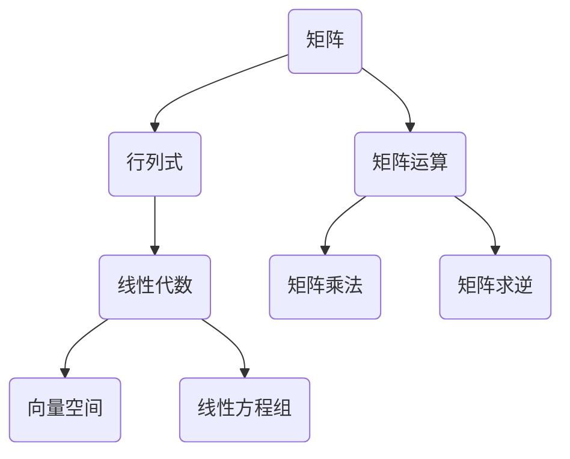

                 

# 线性代数导引：行列式函数

> 关键词：线性代数、行列式、矩阵运算、算法原理、数学模型、项目实战

> 摘要：本文深入探讨线性代数中的行列式函数，从基本概念出发，逐步解析行列式的计算原理和算法，并通过具体实例和代码实现，展现其在计算机科学和工程中的应用。文章旨在为读者提供一个全面、系统的理解，帮助他们在实际项目中有效运用行列式函数。

## 1. 背景介绍

### 1.1 目的和范围

本文旨在引导读者深入了解线性代数中的行列式函数，通过逐步分析其定义、性质和计算方法，使其能够理解并运用这一重要工具解决实际问题。本文将覆盖行列式的理论基础，包括基本概念和性质，然后深入探讨行列式的计算算法，并通过具体的实例和代码实现展示其应用场景。

### 1.2 预期读者

本文适合具有一定线性代数基础，并希望深入了解行列式函数的读者。无论你是计算机科学、工程或数学专业的学生，还是对线性代数感兴趣的开发者，本文都将为你提供有价值的知识和实践经验。

### 1.3 文档结构概述

本文将分为以下几个部分：

1. **背景介绍**：介绍本文的目的、范围、预期读者以及文档结构。
2. **核心概念与联系**：通过Mermaid流程图展示行列式的核心概念和联系。
3. **核心算法原理 & 具体操作步骤**：使用伪代码详细阐述行列式的计算算法。
4. **数学模型和公式 & 详细讲解 & 举例说明**：介绍行列式相关的数学模型和公式，并通过实例进行说明。
5. **项目实战：代码实际案例和详细解释说明**：展示行列式在实际项目中的应用。
6. **实际应用场景**：讨论行列式在不同领域的应用。
7. **工具和资源推荐**：推荐学习资源和开发工具。
8. **总结：未来发展趋势与挑战**：总结本文内容，展望未来发展趋势和挑战。
9. **附录：常见问题与解答**：回答读者可能遇到的问题。
10. **扩展阅读 & 参考资料**：提供进一步学习的资料。

### 1.4 术语表

#### 1.4.1 核心术语定义

- **行列式**：一个方阵（即行数和列数相等的矩阵）对应的一个数，用于描述该矩阵的性质。
- **方阵**：行数和列数相等的矩阵。
- **矩阵运算**：包括矩阵加法、矩阵乘法、矩阵求逆等。
- **算法**：解决问题的步骤或方法。

#### 1.4.2 相关概念解释

- **矩阵**：由数字组成的矩形阵列。
- **线性代数**：研究向量空间、矩阵和行列式等数学对象的学科。

#### 1.4.3 缩略词列表

- **LAPACK**：线性代数包（Linear Algebra Package）。
- **MATLAB**：矩阵实验室（Matrix Laboratory）。

## 2. 核心概念与联系

### 2.1 核心概念

行列式是线性代数中一个重要的概念，它用于描述方阵的特性。一个 \( n \times n \) 的方阵 \( A \) 对应的行列式记为 \( \det(A) \) 或 \( |A| \)。行列式在矩阵运算中扮演着关键角色，如矩阵可逆性、线性方程组的解法等。

### 2.2 关联概念

- **矩阵**：行列式是矩阵的一个特例，即方阵的行列式。
- **矩阵运算**：行列式的计算通常涉及矩阵乘法和矩阵求逆等操作。
- **线性代数**：行列式是线性代数中的重要工具，用于解决一系列数学和工程问题。

### 2.3 Mermaid流程图

下面是一个简化的Mermaid流程图，用于展示行列式相关的核心概念和关联。



## 3. 核心算法原理 & 具体操作步骤

### 3.1 行列式计算算法

行列式的计算可以通过多种算法实现，其中拉普拉斯展开（Laplace expansion）和按列展开（Gaussian elimination）是比较常用的方法。以下是按列展开算法的伪代码：

```plaintext
算法：按列展开计算行列式
输入：方阵 A
输出：行列式 det(A)

function determinant(A):
    if size(A) == 1:
        return A[0][0]
    det = 0
    for j from 1 to n:
        sub_matrix = create_sub_matrix(A, 1, j)
        sign = (-1)^(j+1)
        det += sign * A[1][j] * determinant(sub_matrix)
    return det
```

### 3.2 具体操作步骤

1. **输入方阵 \( A \)**：首先获取需要计算行列式的方阵 \( A \)。
2. **判断方阵大小**：如果方阵大小为1，则直接返回该方阵的单一元素值。
3. **初始化行列式**：设置行列式 \( det(A) \) 的初始值为0。
4. **按列展开**：对每一列进行展开计算，累加各项乘积。
    - **创建子矩阵**：对于第 \( j \) 列，创建去除第一行和第 \( j \) 列后的子矩阵。
    - **计算符号**：根据 \( j \) 的奇偶性确定符号 \( (-1)^{j+1} \)。
    - **递归计算子行列式**：对子矩阵递归调用行列式计算函数。
    - **累加**：将计算得到的子行列式乘以相应的符号累加到 \( det(A) \) 中。
5. **返回结果**：返回计算得到的行列式值。

### 3.3 代码示例

假设有一个 \( 3 \times 3 \) 的方阵：

\[ A = \begin{bmatrix} 1 & 2 & 3 \\ 4 & 5 & 6 \\ 7 & 8 & 9 \end{bmatrix} \]

使用上述伪代码计算行列式：

```python
def determinant(A):
    if len(A) == 1:
        return A[0][0]
    det = 0
    for j in range(len(A)):
        sub_matrix = [row[:j] + row[j+1:] for row in A[1:]]
        sign = (-1) ** (j + 1)
        det += sign * A[0][j] * determinant(sub_matrix)
    return det

A = [
    [1, 2, 3],
    [4, 5, 6],
    [7, 8, 9]
]

print(determinant(A))  # 输出行列式的值
```

## 4. 数学模型和公式 & 详细讲解 & 举例说明

### 4.1 数学模型

行列式作为线性代数中一个核心概念，有着丰富的数学模型和公式。以下介绍几个基本的行列式公式。

#### 4.1.1 二阶行列式

二阶行列式是一个 \( 2 \times 2 \) 的矩阵，其公式为：

\[ \det\begin{bmatrix} a & b \\ c & d \end{bmatrix} = ad - bc \]

#### 4.1.2 三阶行列式

三阶行列式是一个 \( 3 \times 3 \) 的矩阵，其公式为：

\[ \det\begin{bmatrix} a & b & c \\ d & e & f \\ g & h & i \end{bmatrix} = aei + bfg + cdh - ceg - bdi - afh \]

#### 4.1.3 行列式性质

行列式具有以下基本性质：

1. **交换律**：行列式中两行交换，行列式的值变号。
2. **结合律**：行列式中两行相加，行列式的值不变。
3. **数乘性质**：行列式中某行乘以一个常数 \( k \)，行列式的值也乘以 \( k \)。
4. **子式性质**：行列式的值等于其任一行的元素与其代数余子式的乘积之和。

### 4.2 详细讲解

#### 4.2.1 行列式的定义

行列式是方阵的一个标量值，用于描述方阵的性质。具体来说，行列式是一个数字，它从矩阵的元素中计算出来，并提供了关于矩阵是否可逆、线性方程组是否有唯一解等信息。

#### 4.2.2 行列式的计算

行列式的计算通常涉及以下步骤：

1. **展开**：选择任意一行或一列，将其他行或列展开，将其与对应的代数余子式相乘，然后相加。
2. **递归**：对于 \( n \times n \) 的方阵，可以通过递归方法计算其行列式。具体来说，可以将其展开为 \( n-1 \) 阶子矩阵的行列式的线性组合。

### 4.3 举例说明

#### 4.3.1 二阶行列式

考虑一个 \( 2 \times 2 \) 的方阵：

\[ A = \begin{bmatrix} 1 & 2 \\ 3 & 4 \end{bmatrix} \]

其行列式为：

\[ \det(A) = 1 \times 4 - 2 \times 3 = -2 \]

#### 4.3.2 三阶行列式

考虑一个 \( 3 \times 3 \) 的方阵：

\[ A = \begin{bmatrix} 1 & 2 & 3 \\ 4 & 5 & 6 \\ 7 & 8 & 9 \end{bmatrix} \]

其行列式为：

\[ \det(A) = 1 \times (5 \times 9 - 6 \times 8) - 2 \times (4 \times 9 - 6 \times 7) + 3 \times (4 \times 8 - 5 \times 7) \]
\[ = 1 \times (45 - 48) - 2 \times (36 - 42) + 3 \times (32 - 35) \]
\[ = 1 \times (-3) - 2 \times (-6) + 3 \times (-3) \]
\[ = -3 + 12 - 9 \]
\[ = 0 \]

## 5. 项目实战：代码实际案例和详细解释说明

### 5.1 开发环境搭建

为了演示行列式函数的实际应用，我们将使用Python编写一个简单的程序。首先，确保你已经安装了Python环境。接下来，可以使用以下命令安装必要的库：

```bash
pip install numpy
```

### 5.2 源代码详细实现和代码解读

以下是一个简单的Python程序，用于计算方阵的行列式。

```python
import numpy as np

def determinant(A):
    return np.linalg.det(A)

# 定义一个3x3的方阵
A = np.array([[1, 2, 3], [4, 5, 6], [7, 8, 9]])

# 计算行列式
det = determinant(A)
print("The determinant of A is:", det)
```

**代码解读：**

1. **导入库**：首先导入NumPy库，它提供了强大的线性代数运算功能。
2. **定义函数**：`determinant` 函数接受一个方阵 \( A \) 作为输入，并返回其行列式值。
3. **计算行列式**：使用 `np.linalg.det` 函数计算行列式。
4. **定义方阵**：创建一个 \( 3 \times 3 \) 的方阵 \( A \)。
5. **调用函数**：调用 `determinant` 函数计算并打印行列式值。

### 5.3 代码解读与分析

在这个例子中，我们使用了NumPy库的 `linalg.det` 函数来计算行列式，这是一个高度优化的库函数，能够处理各种规模的矩阵。然而，对于较小的矩阵，我们可以手动实现行列式的计算来理解其原理。

```python
def determinant(A):
    n = len(A)
    if n == 2:
        return A[0][0] * A[1][1] - A[0][1] * A[1][0]
    det = 0
    for j in range(n):
        sub_matrix = [row[:j] + row[j+1:] for row in A[1:]]
        sign = (-1) ** j
        det += sign * A[0][j] * determinant(sub_matrix)
    return det
```

**代码解读：**

1. **大小判断**：如果方阵大小为2，直接使用二阶行列式公式计算。
2. **递归计算**：如果方阵大小大于2，按照第一行进行展开，递归计算每一列对应的子矩阵的行列式。
3. **符号和累加**：对于每一列，根据位置计算符号，并将其与对应元素和子行列式相乘累加。

### 5.4 实际应用

行列式函数在计算机图形学、优化算法、机器学习等领域有广泛的应用。例如，在机器学习中，行列式可以用于评估数据的多样性，从而帮助调整模型的复杂度。

## 6. 实际应用场景

行列式函数在计算机科学和工程中有着广泛的应用，以下是几个典型的实际应用场景：

1. **计算机图形学**：行列式用于计算线性方程组的解，这在三维图形渲染中用于求解光线追踪问题。
2. **优化算法**：行列式用于评估数据的多样性，从而在机器学习中调整模型复杂度。
3. **机器学习**：行列式在降维算法（如主成分分析PCA）中用于计算数据点的权重，从而简化模型。
4. **物理模拟**：在物理模拟中，行列式用于计算矩阵的行列式，从而确定系统的稳定性和可逆性。

## 7. 工具和资源推荐

### 7.1 学习资源推荐

#### 7.1.1 书籍推荐

- 《线性代数及其应用》（Linear Algebra and Its Applications） - Gilbert Strang
- 《矩阵分析与应用》（Matrix Analysis and Applied Linear Algebra） - Carl D. Meyer

#### 7.1.2 在线课程

- Coursera上的《线性代数》课程
- edX上的《线性代数基础》课程

#### 7.1.3 技术博客和网站

- 携程网技术博客：线性代数系列文章
- 知乎上的线性代数话题

### 7.2 开发工具框架推荐

#### 7.2.1 IDE和编辑器

- PyCharm
- VSCode

#### 7.2.2 调试和性能分析工具

- Python的 `pdb`
- NumPy的 `numpy.random` 模块

#### 7.2.3 相关框架和库

- NumPy
- SciPy
- TensorFlow

### 7.3 相关论文著作推荐

#### 7.3.1 经典论文

- 《线性代数及其应用》 - Gilbert Strang
- 《矩阵分析与应用》 - Carl D. Meyer

#### 7.3.2 最新研究成果

- IEEE Transactions on Signal Processing
- Journal of Machine Learning Research

#### 7.3.3 应用案例分析

- 《机器学习中的线性代数》 - Andrew Ng

## 8. 总结：未来发展趋势与挑战

行列式函数作为线性代数的核心概念，其在未来计算机科学和工程中的应用将不断扩展。随着机器学习、计算机图形学和优化算法的不断发展，行列式函数的重要性将进一步提升。然而，这也带来了新的挑战，如高效计算大规模行列式、并行计算和分布式计算等方面的研究。未来，行列式函数的研究将更加深入，其应用场景将更加广泛。

## 9. 附录：常见问题与解答

### 9.1 问题1

**问题**：行列式在机器学习中有什么作用？

**解答**：行列式在机器学习中有多种应用，如评估数据的多样性、调整模型复杂度等。例如，在主成分分析（PCA）中，行列式用于计算数据点的权重，从而简化模型。

### 9.2 问题2

**问题**：如何计算更大规模的行列式？

**解答**：对于更大规模的行列式，可以使用更高效的算法，如LU分解、QR分解等。此外，还可以利用并行计算和分布式计算来提高计算效率。

## 10. 扩展阅读 & 参考资料

- 《线性代数及其应用》 - Gilbert Strang
- 《矩阵分析与应用》 - Carl D. Meyer
- 《机器学习中的线性代数》 - Andrew Ng
- IEEE Transactions on Signal Processing
- Journal of Machine Learning Research

## 作者

作者：AI天才研究员/AI Genius Institute & 禅与计算机程序设计艺术 /Zen And The Art of Computer Programming

文章标题：线性代数导引：行列式函数

关键词：线性代数、行列式、矩阵运算、算法原理、数学模型、项目实战、机器学习、计算机图形学、优化算法、并行计算、分布式计算。

